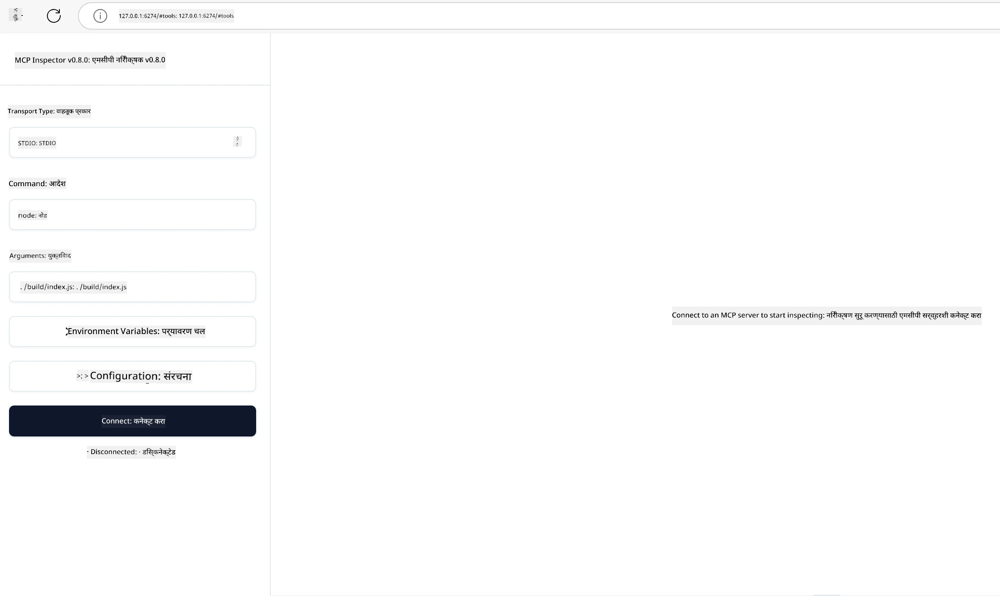

# व्यावहारिक अंमलबजावणी

[](https://youtu.be/vCN9-mKBDfQ)

_(या धड्याचा व्हिडिओ पाहण्यासाठी वरील प्रतिमेवर क्लिक करा)_

व्यावहारिक अंमलबजावणी म्हणजे Model Context Protocol (MCP) ची शक्ती प्रत्यक्षात अनुभवायला मिळते. MCP मागील सिद्धांत आणि आर्किटेक्चर समजून घेणे महत्त्वाचे असले तरी, प्रत्यक्ष मूल्य तेव्हा निर्माण होते जेव्हा आपण या संकल्पनांचा वापर करून खऱ्या जगातील समस्या सोडवणाऱ्या उपाययोजना तयार, तपासणी आणि तैनात करता. हा अध्याय संकल्पनात्मक ज्ञान आणि प्रत्यक्ष विकास यामधील दुवा जोडतो, तुम्हाला MCP-आधारित अनुप्रयोग जीवंत कसे करायचे हे मार्गदर्शन करतो.

तुम्ही बुद्धिमान सहाय्यक विकसित करत असाल, व्यवसाय वर्कफ्लोमध्ये AI समाकलित करत असाल किंवा डेटा प्रक्रिया साठी सानुकूल साधने तयार करत असाल, MCP लवचिक पाया पुरवतो. याचा भाषा-निर्भर नसलेला डिझाइन आणि लोकप्रिय प्रोग्रामिंग भाषांसाठी अधिकृत SDKs हे अनेक विकासकांसाठी सुलभ करतात. या SDKs चा वापर करून, तुम्ही जलद प्रोटोटाइप तयार करू शकता, पुनरावृत्ती करू शकता आणि वेगवेगळ्या प्लॅटफॉर्म्स आणि वातावरणांमध्ये आपल्या उपाययोजनांचे प्रमाण वाढवू शकता.

पुढील विभागांमध्ये, तुम्हाला व्यावहारिक उदाहरणे, नमुना कोड, आणि तैनाती धोरणे मिळतील जी C#, Java with Spring, TypeScript, JavaScript, आणि Python मध्ये MCP कसे अंमलात आणायचे हे दाखवतात. तुम्ही तुमचे MCP सर्व्हर्स डीबग आणि तपासणे, API व्यवस्थापित करणे, आणि Azure वापरून उपाय तैनात करण्याचे देखील शिकाल. हे प्रत्यक्ष साधने तुमचे शिक्षण वेगवान करतील आणि तुम्हाला आत्मविश्वासाने मजबूत, उत्पादनासाठी तयार MCP अनुप्रयोग तयार करण्यात मदत करतील.

## आढावा

हा धडा متعدد प्रोग्रामिंग भाषांमध्ये MCP अंमलबजावणीच्या व्यावहारिक पैलूंवर लक्ष केंद्रित करतो. आपण C#, Java with Spring, TypeScript, JavaScript, आणि Python मध्ये MCP SDKs कसे वापरायचे, MCP सर्व्हर्स डीबग व तपासायचे, आणि पुन्हा वापरण्यायोग्य साधने, प्रॉम्प्ट्स, व टूल्स तयार करायचे हे पाहू.

## शिकण्याचे उद्दिष्ट

या धड्याच्या शेवटी, तुम्ही सक्षम असाल:

- विविध प्रोग्रामिंग भाषांमध्ये अधिकृत SDKs चा वापर करून MCP उपाय अंमलात आणणे
- प्रणालीबद्धपणे MCP सर्व्हर्स डीबग व तपासणे
- सर्व्हर वैशिष्ट्ये तयार करणे आणि वापरणे (Resources, Prompts, व Tools)
- गुंतागुंतीच्या कार्यांसाठी प्रभावी MCP वर्कफ्लोज डिझाइन करणे
- कार्यक्षमता आणि विश्वासार्हतेसाठी MCP अंमलबजावण्या ऑप्टिमाइझ करणे

## अधिकृत SDK स्त्रोत

Model Context Protocol अनेक भाषांसाठी अधिकृत SDKs पुरवतो ([MCP Specification 2025-11-25](https://spec.modelcontextprotocol.io/specification/2025-11-25/) शी सुसंगत):

- [C# SDK](https://github.com/modelcontextprotocol/csharp-sdk)
- [Java with Spring SDK](https://github.com/modelcontextprotocol/java-sdk) **टीप:** यासाठी [Project Reactor](https://projectreactor.io) वर अवलंबित्व आवश्यक आहे. ([चर्चा इश्यू 246](https://github.com/orgs/modelcontextprotocol/discussions/246) पहा.)
- [TypeScript SDK](https://github.com/modelcontextprotocol/typescript-sdk)
- [Python SDK](https://github.com/modelcontextprotocol/python-sdk)
- [Kotlin SDK](https://github.com/modelcontextprotocol/kotlin-sdk)
- [Go SDK](https://github.com/modelcontextprotocol/go-sdk)

## MCP SDKs सह काम करणे

हा विभाग अनेक प्रोग्रामिंग भाषांमध्ये MCP अंमलबजावणीसाठी व्यावहारिक उदाहरणे प्रदान करतो. तुम्ही भाषेनुसार संघटित `samples` निर्देशिकेत नमुना कोड देखील शोधू शकता.

### उपलब्ध नमुने

हे रेपॉसिटरी खालील भाषांमध्ये [नमुना अंमलबजावणी](../../../04-PracticalImplementation/samples) समावेश आहे:

- [C#](./samples/csharp/README.md)
- [Java with Spring](./samples/java/containerapp/README.md)
- [TypeScript](./samples/typescript/README.md)
- [JavaScript](./samples/javascript/README.md)
- [Python](./samples/python/README.md)

प्रत्येक नमुना त्या विशिष्ट भाषा व इकोसिस्टमसाठी MCP चे महत्त्वाचे संकल्पना व अंमलबजावणी नमुने दर्शवतो.

### व्यावहारिक मार्गदर्शक

व्यावहारिक MCP अंमलबजावणीसाठी अतिरिक्त मार्गदर्शक:

- [पागिनेशन आणि मोठ्या निकाल संच](./pagination/README.md) - टूल्स, संसाधने, आणि मोठ्या डेटासेट्ससाठी कर्सर-आधारित पागिनेशन हाताळणे

## कोअर सर्व्हर वैशिष्ट्ये

MCP सर्व्हर्स खालील वैशिष्ठ्यांचे कोणतेही संयोजन अंमलात आणू शकतात:

### Resources

Resources वापरकर्त्यासाठी किंवा AI मॉडेलसाठी संदर्भ आणि डेटा पुरवतात:

- दस्तऐवज संचिका
- ज्ञानसंपत्ती आधार
- संरचित डेटा स्रोत
- फाइल सिस्टम्स

### Prompts

Prompts वापरकर्त्यांसाठी टेम्प्लेटेड संदेश आणि वर्कफ्लोज असतात:

- पूर्वनिर्धारित संभाषण टेम्प्लेट्स
- मार्गदर्शित संवाद नमुने
- विशिष्ट संवाद रचना

### Tools

Tools AI मॉडेल चालविण्यासाठी कार्ये असतात:

- डेटा प्रक्रिया उपयुक्तता
- बाह्य API समाकलन
- संगणकीय क्षमता
- शोध कार्यक्षमता

## नमुना अंमलबजावणी: C# अंमलबजावणी

अधिकृत C# SDK रेपॉसिटरीत MCP चे विविध पैलू दाखवणारी अनेक नमुना अंमलबजावण्या आहेत:

- **मूलभूत MCP क्लायंट**: MCP क्लायंट कसा तयार करायचा आणि टूल्स कसे कॉल करायचे याचा साधा उदाहरण
- **मूलभूत MCP सर्व्हर**: मूलभूत टूल नोंदणीसह कमीीतक सर्व्हर अंमलबजावणी
- **उन्नत MCP सर्व्हर**: टूल नोंदणी, प्रमाणीकरण व त्रुटी हाताळणीसह पूर्ण वैशिष्ट्यांची सर्व्हर अंमलबजावणी
- **ASP.NET समाकलन**: ASP.NET Core सह समाकलन दाखवणारी उदाहरणे
- **टूल अंमलबजावणी नमुने**: विविध जटिलतेच्या टूल्स अंमलबजावण्याचे नमुनी

MCP C# SDK अजून प्रिव्ह्यू अवस्थेत आहे आणि API मध्ये बदल होऊ शकतात. SDK विकसित होत राहिल्यामुळे हा ब्लॉग सतत अद्यतनित केला जाईल.

### मुख्य वैशिष्ट्ये

- [C# MCP Nuget ModelContextProtocol](https://www.nuget.org/packages/ModelContextProtocol)
- तुमचा [पहिला MCP सर्व्हर तयार करणे](https://devblogs.microsoft.com/dotnet/build-a-model-context-protocol-mcp-server-in-csharp/).

पूर्ण C# अंमलबजावणी नमुन्यांसाठी, [अधिकृत C# SDK नमुने रेपॉसिटरी](https://github.com/modelcontextprotocol/csharp-sdk) येथे भेट द्या.

## नमुना अंमलबजावणी: Java with Spring अंमलबजावणी

Java with Spring SDK एंटरप्राइज दर्जाचे वैशिष्ट्ये असलेली मजबूत MCP अंमलबजावणी पर्याय पुरवतो.

### मुख्य वैशिष्ट्ये

- Spring Framework समाकलन
- मजबूत प्रकार सुरक्षा
- रिऍक्टिव प्रोग्रामिंग समर्थन
- सर्वसमावेशक त्रुटी हाताळणी

पूर्ण Java with Spring अंमलबजावणी नमुन्यासाठी, `samples/java/containerapp/README.md` पाहा.

## नमुना अंमलबजावणी: JavaScript अंमलबजावणी

JavaScript SDK हलक्या आणि लवचिक MCP अंमलबजावणी दृष्टीकोन देतो.

### मुख्य वैशिष्ट्ये

- Node.js आणि ब्राउझर समर्थन
- Promise-आधारित API
- Express आणि इतर फ्रेमवर्कसह सुलभ समाकलन
- स्ट्रीमिंगसाठी WebSocket समर्थन

पूर्ण JavaScript अंमलबजावणी नमुन्यासाठी, `samples/javascript/README.md` पहा.

## नमुना अंमलबजावणी: Python अंमलबजावणी

Python SDK उत्कृष्ट ML फ्रेमवर्क समाकलनांसह Pythonic MCP अंमलबजावणी देते.

### मुख्य वैशिष्ट्ये

- asyncio सह Async/await समर्थन
- FastAPI समाकलन
- सोपे टूल नोंदणी
- लोकप्रिय ML लायब्ररींसह नैसर्गिक समाकलन

पूर्ण Python अंमलबजावणी नमुन्यासाठी, `samples/python/README.md` पहा.

## API व्यवस्थापन

Azure API Management हा उत्तम पर्याय आहे ज्याद्वारे आपण MCP सर्व्हर्स सुरक्षित करू शकतो. कल्पना अशी आहे की तुमच्या MCP सर्व्हर समोर Azure API Management ची एक उदाहरण ठेवा आणि त्याला पुढील वैशिष्ट्ये हाताळू द्या:

- दरमर्यादा सेट करणे (rate limiting)
- टोकन व्यवस्थापन
- निरीक्षण
- लोड बॅलेंसिंग
- सुरक्षा

### Azure नमुना

खाली एक Azure नमुना आहे, म्हणजेच [MCP सर्व्हर तयार करणे आणि Azure API Management ने त्याला सुरक्षित करणे](https://github.com/Azure-Samples/remote-mcp-apim-functions-python).

खालील प्रतिमेत अधिकृतता प्रवाह कसा होतो ते पाहा:


वरील प्रतिमेत पुढील घडामोडी होतात:

- प्रमाणीकरण/अधिकृतता Microsoft Entra वापरून केली जाते.
- Azure API Management गेटवेला म्हणून कार्य करते आणि धोरणे वापरून ट्रॅफिक व्यवस्थापित करते.
- Azure Monitor पुढील विश्लेषणासाठी सर्व विनंत्यांची नोंद ठेवतो.

#### अधिकृतता प्रवाह

अधिकृतता प्रवाह अधिक तपशीलात पाहूया:


#### MCP अधिकृतता स्पेसिफिकेशन

[MCP Authorization specification](https://spec.modelcontextprotocol.io/specification/2025-11-25/basic/authorization/) बद्दल अधिक जाणून घ्या.

## रिमोट MCP सर्व्हर Azure वर तैनात करा

आम्ही आधी उल्लेख केलेल्या नमुन्याचे तैनाती करू या:

1. रेपॉसिटरी क्लोन करा

    ```bash
    git clone https://github.com/Azure-Samples/remote-mcp-apim-functions-python.git
    cd remote-mcp-apim-functions-python
    ```

1. `Microsoft.App` रिसोर्स प्रदाता नोंदणी करा.

   - जर तुम्ही Azure CLI वापरत असाल तर `az provider register --namespace Microsoft.App --wait` चालवा.
   - जर तुम्ही Azure PowerShell वापरत असाल तर `Register-AzResourceProvider -ProviderNamespace Microsoft.App` चालवा. मग काही वेळाने `(Get-AzResourceProvider -ProviderNamespace Microsoft.App).RegistrationState` तपासून नोंदणी पूर्ण झाली आहे का पाहा.

1. खालील [azd](https://aka.ms/azd) कमांड चालवा जे API Management सेवा, function अ‍ॅप (कोडसह) आणि सर्व इतर आवश्यक Azure रिसोर्सेस तयार करेल.

    ```shell
    azd up
    ```

    ही कमांड सर्व क्लाउड रिसोर्सेस Azure वर तैनात करेल.

### MCP Inspector सह तुमचा सर्व्हर तपासणी

1. **नवीन टर्मिनल विंडो** मध्ये MCP Inspector इन्स्टॉल करा आणि चालवा

    ```shell
    npx @modelcontextprotocol/inspector
    ```

    तुम्हाला खालीलसारखे इंटरफेस दिसेल:

    

1. CTRL क्लिक करून MCP Inspector वेब अॅप त्याच्या URL वरून लोड करा (उदा. [http://127.0.0.1:6274/#resources](http://127.0.0.1:6274/#resources))
1. ट्रान्सपोर्ट प्रकार `SSE` सेट करा
1. तुमच्या चालू API Management SSE एंडपॉइंटचा URL (जो `azd up` नंतर दिसतो) सेट करा आणि **Connect** करा:

    ```shell
    https://<apim-servicename-from-azd-output>.azure-api.net/mcp/sse
    ```

1. **List Tools** वर क्लिक करा. टूल निवडा आणि **Run Tool** करा.

जर सर्व टप्पे व्यवस्थित पार पडले असतील, तर तुम्ही आता MCP सर्व्हरशी जोडलेले आहात आणि एका टूलला कॉल करू शकलात.

## Azure साठी MCP सर्व्हर्स

[Remote-mcp-functions](https://github.com/Azure-Samples/remote-mcp-functions-dotnet): हे रेपॉसिटरीज Azure Functions वापरून Python, C# .NET किंवा Node/TypeScript मध्ये सानुकूल रिमोट MCP (Model Context Protocol) सर्व्हर जलद तयार व तैनात करण्यासाठी टेम्प्लेट आहेत.

नमुने डेव्हलपर्सना पूर्ण तोडगा प्रदान करतात ज्यात:

- लोकलवर बिल्ड व चालवा: लोकल मशीनवर MCP सर्व्हर विकसित व डीबग करा
- Azure वर तैनात करा: azd up कमांडने सहज क्लाउडवर तैनात करा
- क्लायंट्स कडून कनेक्ट करा: VS Code च्या Copilot एजंट मोडसह विविध क्लायंट्समधून MCP सर्व्हरशी कनेक्ट व्हा

### मुख्य वैशिष्ट्ये

- डिझाइनद्वारे सुरक्षा: MCP सर्व्हर की आणि HTTPS वापरून सुरक्षित आहे
- प्रमाणीकरण पर्याय: बिल्ट-इन ऑथ आणि/किंवा API Management वापरून OAuth समर्थन
- नेटवर्क आयसोलेशन: Azure Virtual Networks (VNET) वापरून नेटवर्क आयसोलेशन अनुमती
- सर्व्हरलेस आर्किटेक्चर: स्केलेबल, इव्हेंट-चालित अंमलबजावणीसाठी Azure Functions वापरतो
- स्थानिक विकास: सखोल स्थानिक विकास व डीबग समर्थन
- सोपी तैनाती: Azure वर तैनाती प्रक्रिया सुगम

रेपॉसिटरीमध्ये सर्व आवश्यक कॉन्फिगरेशन फाइल्स, स्रोत कोड, व इन्फ्रास्ट्रक्चर व्याख्या समाविष्ट आहेत जेणेकरून तुम्ही जलद उत्पादनासाठी तयार MCP सर्व्हर अंमलबजावणी सुरू करू शकता.

- [Azure Remote MCP Functions Python](https://github.com/Azure-Samples/remote-mcp-functions-python) - Azure Functions सह Python वापरून MCP चे नमुना अंमलबजावणी.

- [Azure Remote MCP Functions .NET](https://github.com/Azure-Samples/remote-mcp-functions-dotnet) - Azure Functions सह C# .NET वापरून MCP चे नमुना अंमलबजावणी.

- [Azure Remote MCP Functions Node/Typescript](https://github.com/Azure-Samples/remote-mcp-functions-typescript) - Azure Functions सह Node/TypeScript वापरून MCP चे नमुना अंमलबजावणी.

## मुख्य मुद्दे

- MCP SDKs भाषानुसार सहज वापरता येणारी मजबूत MCP उपाययोजना अंमलात आणण्यासाठी साधने पुरवतात
- डीबगिंग व तपासणी प्रक्रिया विश्वासार्ह MCP अनुप्रयोगांसाठी अत्यंत महत्त्वाची आहे
- पुनर्वापरासाठी प्रॉम्प्ट टेम्प्लेट्स सतत AI संवाद सक्षम करतात
- चांगल्या डिझाइन केलेले वर्कफ्लोज अनेक टूल्स वापरून गुंतागुंतीच्या कार्यांचे आयोजन करतात
- MCP उपाय अंमलात आणताना सुरक्षा, कार्यक्षमता, व त्रुटी हाताळणीचा विचार करणे आवश्यक आहे

## सराव

तुमच्या क्षेत्रातील खऱ्या समस्येवर आधारित व्यावहारिक MCP वर्कफ्लो डिझाइन करा:

1. अशा 3-4 टूल्स ओळखा जे या समस्येचे निराकरण करण्यात उपयुक्त ठरतील
2. या टूल्स कसे परस्पर संवाद साधतात हे दाखवणारा वर्कफ्लो डायग्राम तयार करा
3. तुमच्या पसंतीच्या भाषेत टूलपैकी एकाचा मूलभूत आवृत्ती अंमलात आणा
4. मॉडेलला तुमचा टूल प्रभावीपणे वापरायला मदत करणारा प्रॉम्प्ट टेम्प्लेट तयार करा

## अतिरिक्त स्त्रोत

---

## पुढे काय

पुढील: [उन्नत विषय](../05-AdvancedTopics/README.md)

---

<!-- CO-OP TRANSLATOR DISCLAIMER START -->
**अस्वीकरण**:  
हा दस्तऐवज AI भाषांतर सेवा [Co-op Translator](https://github.com/Azure/co-op-translator) चा वापर करून भाषांतरित केला आहे. आम्ही अचूकतेसाठी प्रयत्न करतो, तरी कृपया लक्षात ठेवा की स्वयंचलित भाषांतरणांमध्ये त्रुटी किंवा अपूर्णता असू शकते. मूळ दस्तऐवज त्याच्या स्थानिक भाषेत अधिकृत स्त्रोत म्हणून मानला पाहिजे. महत्त्वाच्या माहितीसाठी व्यावसायिक मानवी भाषांतर करणे शिफारसीय आहे. या भाषांतराचा वापर करून झालेल्या कोणत्याही गैरसमजुतीसाठी किंवा चुकीच्या अर्थ लावणीसाठी आम्ही जबाबदार नाही.
<!-- CO-OP TRANSLATOR DISCLAIMER END -->