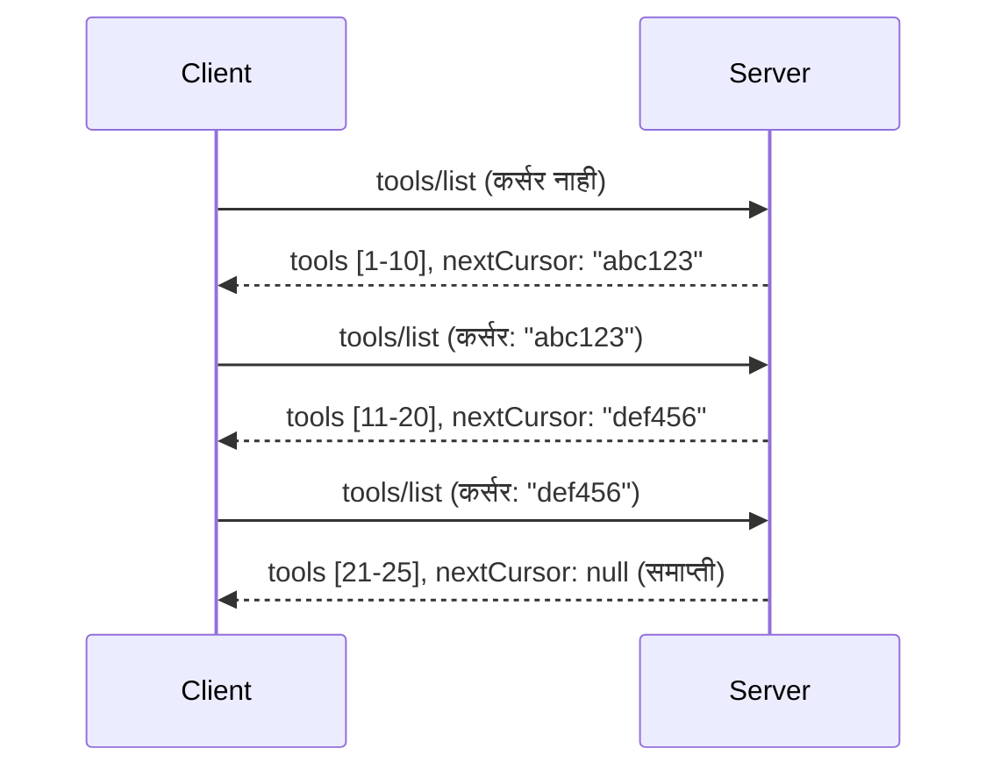

# MCP मध्ये पेजिनेशन आणि मोठ्या परिणाम संच

जेव्हा तुमचा MCP सर्व्हर मोठ्या डेटासेट्ससह हाताळतो - हजारो फाइल्स, डेटाबेस रेकॉर्ड्स किंवा शोध परिणामांची यादी करत असो - तुम्हाला मेमरी कार्यक्षमतेने व्यवस्थापित करण्यासाठी आणि प्रतिसादात्मक वापरकर्ता अनुभव देण्यासाठी पेजिनेशन आवश्यक आहे. ही मार्गदर्शिका MCP मध्ये पेजिनेशन कसे अंमलात आणायचे आणि वापरायचे हे स्पष्ट करते.

## पेजिनेशन का महत्त्वाचे आहे

पेजिनेशनशिवाय, मोठ्या प्रतिसादांमुळे खालील समस्या उद्भवू शकतात:

- **मेमरी संपुष्टात येणे** - एकावेळी लाखो रेकॉर्ड लोड करणे
- **हळू प्रतिसाद वेळा** - सर्व डेटा लोड होईपर्यंत वापरकर्त्यांना वाट पाहावी लागते
- **टाइमआउट त्रुटी** - विनंत्या टाइमआउट मर्यादा ओलांडतात
- **वाईट AI कार्यक्षमता** - LLMs मोठ्या संदर्भामुळे अडचणीत येतात

MCP मध्ये परिणाम संचांमधून विश्वसनीय, सुसंगत पेजिंगसाठी **कर्सर-आधारित पेजिनेशन** वापरले जाते.

---

## MCP पेजिनेशन कसे कार्य करते

### कर्सर संकल्पना

एक **कर्सर** हा एक अस्पष्ट स्ट्रिंग आहे जो परिणाम संचामधील तुमची स्थान दर्शवतो. त्याला एका लांब पुस्तकातल्या बुकमार्कसारखा समजा.



### MCP पद्धतींमधील पेजिनेशन

खालील MCP पद्धती पेजिनेशनला समर्थन देतात:

| पद्धत | परत करते | कर्सर समर्थन |
|--------|---------|----------------|
| `tools/list` | साधनाची व्याख्या | ✅ |
| `resources/list` | संसाधन व्याख्या | ✅ |
| `prompts/list` | प्रॉम्प्ट व्याख्या | ✅ |
| `resources/templates/list` | संसाधन टेम्पलेट्स | ✅ |

---

## सर्व्हर अंमलबजावणी

### Python (FastMCP)

```python
from mcp.server import Server
from mcp.types import Tool, ListToolsResult
import math

app = Server("paginated-server")

# अनुकरण केलेला मोठा डेटासेट
ALL_TOOLS = [
    Tool(name=f"tool_{i}", description=f"Tool number {i}", inputSchema={})
    for i in range(100)
]

PAGE_SIZE = 10

@app.list_tools()
async def list_tools(cursor: str | None = None) -> ListToolsResult:
    """List tools with pagination support."""
    
    # सुरूवातीचा निर्देशांक मिळवण्यासाठी कर्सर डिकोड करा
    start_index = 0
    if cursor:
        try:
            start_index = int(cursor)
        except ValueError:
            start_index = 0
    
    # निकालांचा पृष्ठ मिळवा
    end_index = min(start_index + PAGE_SIZE, len(ALL_TOOLS))
    page_tools = ALL_TOOLS[start_index:end_index]
    
    # पुढचा कर्सर गणना करा
    next_cursor = None
    if end_index < len(ALL_TOOLS):
        next_cursor = str(end_index)
    
    return ListToolsResult(
        tools=page_tools,
        nextCursor=next_cursor
    )
```

### TypeScript

```typescript
import { Server } from "@modelcontextprotocol/sdk/server/index.js";
import { ListToolsResultSchema } from "@modelcontextprotocol/sdk/types.js";

const server = new Server({
  name: "paginated-server",
  version: "1.0.0"
});

// सिम्युलेट केलेला मोठा डेटासेट
const ALL_TOOLS = Array.from({ length: 100 }, (_, i) => ({
  name: `tool_${i}`,
  description: `Tool number ${i}`,
  inputSchema: { type: "object", properties: {} }
}));

const PAGE_SIZE = 10;

server.setRequestHandler(ListToolsResultSchema, async (request) => {
  // कर्सर डीकोड करा
  let startIndex = 0;
  if (request.params?.cursor) {
    startIndex = parseInt(request.params.cursor, 10) || 0;
  }
  
  // निकालाचा पृष्ठ मिळवा
  const endIndex = Math.min(startIndex + PAGE_SIZE, ALL_TOOLS.length);
  const pageTools = ALL_TOOLS.slice(startIndex, endIndex);
  
  // पुढचा कर्सर मोजा
  const nextCursor = endIndex < ALL_TOOLS.length ? String(endIndex) : undefined;
  
  return {
    tools: pageTools,
    nextCursor
  };
});
```

### Java (Spring MCP)

```java
@Service
public class PaginatedToolService {
    
    private static final int PAGE_SIZE = 10;
    private final List<Tool> allTools;
    
    public PaginatedToolService() {
        // मोठा डेटासेट प्रारंभ करा
        this.allTools = IntStream.range(0, 100)
            .mapToObj(i -> new Tool("tool_" + i, "Tool number " + i, Map.of()))
            .collect(Collectors.toList());
    }
    
    @McpMethod("tools/list")
    public ListToolsResult listTools(@Param("cursor") String cursor) {
        // कर्सर डीकोड करा
        int startIndex = 0;
        if (cursor != null && !cursor.isEmpty()) {
            try {
                startIndex = Integer.parseInt(cursor);
            } catch (NumberFormatException e) {
                startIndex = 0;
            }
        }
        
        // निकालांचे पृष्ठ मिळवा
        int endIndex = Math.min(startIndex + PAGE_SIZE, allTools.size());
        List<Tool> pageTools = allTools.subList(startIndex, endIndex);
        
        // पुढचा कर्सर मोजा
        String nextCursor = endIndex < allTools.size() ? String.valueOf(endIndex) : null;
        
        return new ListToolsResult(pageTools, nextCursor);
    }
}
```

---

## क्लायंट अंमलबजावणी

### Python क्लायंट

```python
from mcp import ClientSession

async def get_all_tools(session: ClientSession) -> list:
    """Fetch all tools using pagination."""
    all_tools = []
    cursor = None
    
    while True:
        result = await session.list_tools(cursor=cursor)
        all_tools.extend(result.tools)
        
        if result.nextCursor is None:
            break
        cursor = result.nextCursor
    
    return all_tools

# वापर
async with client_session as session:
    tools = await get_all_tools(session)
    print(f"Found {len(tools)} tools")
```

### TypeScript क्लायंट

```typescript
import { Client } from "@modelcontextprotocol/sdk/client/index.js";

async function getAllTools(client: Client): Promise<Tool[]> {
  const allTools: Tool[] = [];
  let cursor: string | undefined = undefined;
  
  do {
    const result = await client.listTools({ cursor });
    allTools.push(...result.tools);
    cursor = result.nextCursor;
  } while (cursor);
  
  return allTools;
}

// वापर
const tools = await getAllTools(client);
console.log(`Found ${tools.length} tools`);
```

### रिलॅक्स पद्धत (Lazy Loading Pattern)

अत्यंत मोठ्या डेटासेटसाठी, पानं गरजेनुसार लोड करा:

```python
class PaginatedToolIterator:
    """Lazily iterate through paginated tools."""
    
    def __init__(self, session: ClientSession):
        self.session = session
        self.cursor = None
        self.buffer = []
        self.exhausted = False
    
    async def __anext__(self):
        # उपलब्ध असल्यास बफरमधून परत करा
        if self.buffer:
            return self.buffer.pop(0)
        
        # सर्व पानांचा वापर झाला आहे का ते तपासा
        if self.exhausted:
            raise StopAsyncIteration
        
        # पुढील पान मिळवा
        result = await self.session.list_tools(cursor=self.cursor)
        self.buffer = list(result.tools)
        self.cursor = result.nextCursor
        
        if self.cursor is None:
            self.exhausted = True
        
        if not self.buffer:
            raise StopAsyncIteration
        
        return self.buffer.pop(0)
    
    def __aiter__(self):
        return self

# वापर - मोठ्या डेटासेटसाठी स्मृती कार्यक्षम
async for tool in PaginatedToolIterator(session):
    process_tool(tool)
```

---

## संसाधनांसाठी पेजिनेशन

संसाधनांना बहुतेकदा निर्देशिका किंवा मोठ्या डेटासेटसाठी पेजिनेशन आवश्यक असते:

```python
from mcp.server import Server
from mcp.types import Resource, ListResourcesResult
import os

app = Server("file-server")

@app.list_resources()
async def list_resources(cursor: str | None = None) -> ListResourcesResult:
    """List files in directory with pagination."""
    
    directory = "/data/files"
    all_files = sorted(os.listdir(directory))
    
    # कर्सर डीकोड करा (फाइल निर्देशांक)
    start_index = int(cursor) if cursor else 0
    page_size = 20
    end_index = min(start_index + page_size, len(all_files))
    
    # या पानासाठी संसाधनांची यादी तयार करा
    resources = []
    for filename in all_files[start_index:end_index]:
        filepath = os.path.join(directory, filename)
        resources.append(Resource(
            uri=f"file://{filepath}",
            name=filename,
            mimeType="application/octet-stream"
        ))
    
    # पुढील कर्सर कॅल्क्युलेट करा
    next_cursor = str(end_index) if end_index < len(all_files) else None
    
    return ListResourcesResult(
        resources=resources,
        nextCursor=next_cursor
    )
```

---

## कर्सर डिझाइन धोरणे

### धोरण 1: निर्देशांक-आधारित (सोपे)

```python
# कर्सर हे फक्त निर्देशांक आहे
cursor = "50"  # आयटम ५० वर सुरू करा
```

**तरीका:** सोपे, स्टेटलेस
**कमी:** जर आयटम जोडले/काढले गेले तर निकाल हलू शकतो

### धोरण 2: आयडी-आधारित (स्थिर)

```python
# कर्सर म्हणजे शेवटचे पाहिलेले आयडी
cursor = "item_abc123"  # या आयटम नंतर शुरू करा
```

**तरीका:** आयटम बदलले तरी स्थिर
**कमी:** क्रमबद्ध आयडी आवश्यक

### धोरण 3: एन्कोड केलेली अवस्था (कठीण)

```python
import base64
import json

def encode_cursor(state: dict) -> str:
    return base64.b64encode(json.dumps(state).encode()).decode()

def decode_cursor(cursor: str) -> dict:
    return json.loads(base64.b64decode(cursor).decode())

# कर्सरमध्ये अनेक स्थिती फील्ड्स आहेत
cursor = encode_cursor({
    "offset": 50,
    "filter": "active",
    "sort": "name"
})
```

**तरीका:** गुंतागुंतीची अवस्था एन्कोड करू शकते
**कमी:** जास्त क्लिष्ट, मोठे कर्सर स्ट्रिंग्ज

---

## सर्वोत्तम सराव

### 1. योग्य पान आकार निवडा

```python
# डेटा आकाराचा विचार करा
PAGE_SIZE_SMALL_ITEMS = 100   # साधे मेटाडेटा
PAGE_SIZE_MEDIUM_ITEMS = 20   # समृद्ध ऑब्जेक्ट्स
PAGE_SIZE_LARGE_ITEMS = 5     # गुंतागुंतीचा मजकूर
```

### 2. अवैध कर्सर सुंदरपणे हाताळा

```python
@app.list_tools()
async def list_tools(cursor: str | None = None) -> ListToolsResult:
    try:
        start_index = int(cursor) if cursor else 0
        if start_index < 0 or start_index >= len(ALL_TOOLS):
            start_index = 0  # सुरुवातीला रीसेट करा
    except (ValueError, TypeError):
        start_index = 0  # अमान्य कर्सर, नवीन सुरुवात करा
    # ...
```

### 3. एकूण गणना समाविष्ट करा (ऐच्छिक)

```python
return ListToolsResult(
    tools=page_tools,
    nextCursor=next_cursor,
    # काही अंमलबजावणीमध्ये UI प्रगतीसाठी एकूण समाविष्ट आहे
    _meta={"total": len(ALL_TOOLS)}
)
```

### 4. सीमांत प्रकरणांची चाचणी करा

```python
async def test_pagination():
    # रिकामा निकाल संच
    result = await session.list_tools()
    assert result.tools == []
    assert result.nextCursor is None
    
    # एकल पृष्ठ
    result = await session.list_tools()
    assert len(result.tools) <= PAGE_SIZE
    
    # अवैध कर्सर
    result = await session.list_tools(cursor="invalid")
    assert result.tools  # पहिला पृष्ठ परत करावा
```

---

## सामान्य चुका

### ❌ सर्व निकाल परत करून नंतर क्लायंट बाजूने पेजिनेशन करणे

```python
# वाईट: सर्वकाही मेमरीमध्ये लोड करते
@app.list_tools()
async def list_tools() -> ListToolsResult:
    all_tools = load_all_tools()  # १ दशलक्ष साधने!
    return ListToolsResult(tools=all_tools)
```

### ✅ डेटा स्रोतावरच पेजिनेशन करा

```python
# चांगले: फक्त आवश्यक तेच लोड करते
@app.list_tools()
async def list_tools(cursor: str | None = None) -> ListToolsResult:
    offset = int(cursor) if cursor else 0
    tools = await db.query_tools(offset=offset, limit=PAGE_SIZE)
    return ListToolsResult(tools=tools, nextCursor=...)
```

---

## पुढे काय

- [Module 5.14 - Context Engineering](../../05-AdvancedTopics/mcp-contextengineering/README.md)
- [Module 8 - Best Practices](../../08-BestPractices/README.md)
- [3.8 - Testing Your MCP Server](../../03-GettingStarted/08-testing/README.md)

---

## अतिरिक्त संसाधने

- [MCP Specification - Pagination](https://modelcontextprotocol.io/specification/2026-07-28/)
- [Cursor-Based Pagination Explained](https://slack.engineering/evolving-api-pagination-at-slack/)
- [Python SDK pagination tests](https://github.com/modelcontextprotocol/python-sdk/blob/main/tests/client/test_list_methods_cursor.py)

---

<!-- CO-OP TRANSLATOR DISCLAIMER START -->
**अस्वीकरण**:
हा दस्तऐवज AI भाषांतर सेवा [Co-op Translator](https://github.com/Azure/co-op-translator) चा वापर करून अनुवादित केला आहे. जरी आम्ही अचूकतेसाठी प्रयत्न करतो, तरी कृपया लक्षात घ्या की स्वयंचलित भाषांतरांमध्ये त्रुटी किंवा अचूकतेची कमतरता असू शकते. मूळ दस्तऐवज त्याच्या मूळ भाषेत अधिकृत स्रोत मानला पाहिजे. महत्त्वाची माहिती असल्यास, व्यावसायिक मानवी भाषांतराची शिफारस केली जाते. या भाषांतराच्या वापरामुळे उद्भवणाऱ्या कोणत्याही गैरसमज किंवा चुकीच्या अर्थलावणीसाठी आम्ही जबाबदार नाही.
<!-- CO-OP TRANSLATOR DISCLAIMER END -->