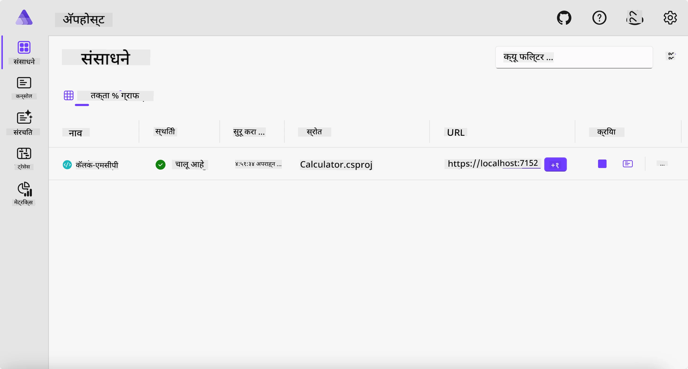
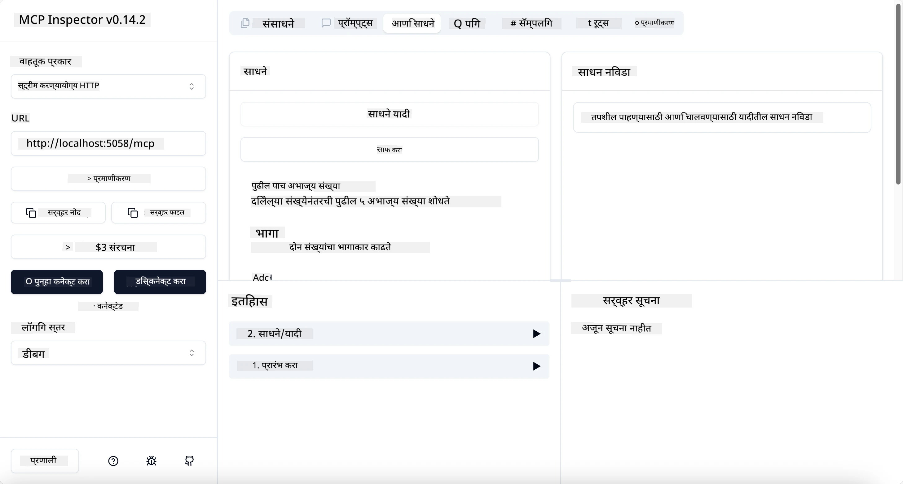
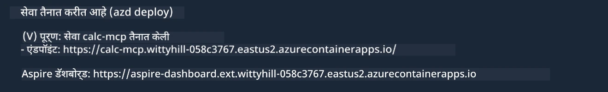

# नमुना

मागील उदाहरण दाखवते की `stdio` प्रकारासह स्थानिक .NET प्रकल्प कसा वापरायचा. आणि कंटेनरमध्ये स्थानिकरित्या सर्व्हर कसा चालवायचा. हे अनेक परिस्थितींमध्ये एक चांगले समाधान आहे. परंतु, सर्व्हर रिमोटली चालू असणे, जसे की क्लाउड वातावरणात, उपयुक्त ठरू शकते. हेच तेथे `http` प्रकार येतो.

`04-PracticalImplementation` फोल्डरमधील समाधानाकडे पाहिल्यावर, ते मागील उदाहरणाच्या तुलनेत खूपच जटिल वाटू शकते. पण प्रत्यक्षात तसे नाही. जर तुम्ही `src/Calculator` प्रकल्पाकडे लक्षपूर्वक पाहिलात, तर तुम्हाला दिसेल की तो प्रामुख्याने मागील उदाहरणातील समान कोड आहे. फरक फक्त इतकाच आहे की आपण HTTP विनंत्या हाताळण्यासाठी वेगळे लायब्ररी `ModelContextProtocol.AspNetCore` वापरत आहोत. आणि आपण `IsPrime` पद्धत खाजगी करण्यासाठी बदलली आहे, ज्याने दाखवायचं आहे की तुमच्या कोडमध्ये खाजगी पद्धती असू शकतात. बाकीचा कोड अगदी त्याच प्रमाणात आहे.

इतर प्रकल्प [Aspire](https://aspire.dev/get-started/what-is-aspire/) कडून आहेत. समाधानामध्ये Aspire असल्याने विकसकाचा अनुभव विकास आणि तपासणी दरम्यान सुधारतो आणि निरीक्षणक्षमतेमध्ये मदत होते. सर्व्हर चालवण्यासाठी हे आवश्यक नाही, पण तुमच्या समाधानात हे असणे चांगली प्रथा आहे.

## सर्व्हर स्थानिकरित्या सुरू करा

1. VS Code (C# DevKit विस्तारासह) मधून `04-PracticalImplementation/samples/csharp` निर्देशिकेकडे जा.
1. सर्व्हर सुरू करण्यासाठी खालील कमांड चालवा:

   ```bash
    dotnet watch run --project ./src/AppHost
   ```

1. जेव्हा वेब ब्राउझर Aspire डॅशबोर्ड उघडेल, तेव्हा `http` URL नोंद करा. ते काहीसे `http://localhost:5058/` सारखे असावे.

   

## MCP Inspector सह Streamable HTTP चे चाचणी करा

तुमच्याकडे Node.js 22.7.5 किंवा त्याहून अधिक आवृत्ती असल्यास, तुम्ही तुमच्या सर्व्हरची चाचणी करण्यासाठी MCP Inspector वापरू शकता.

सर्व्हर सुरू करा आणि टर्मिनलमध्ये खालील कमांड चालवा:

```bash
npx @modelcontextprotocol/inspector http://localhost:5058
```



- ट्रान्सपोर्ट प्रकार म्हणून `Streamable HTTP` निवडा.
- URL फील्डमध्ये, पूर्वी नोंद केलेल्या सर्व्हरचा URL भरा आणि `/mcp` जोडा. ते `http` (नाही `https`) असले पाहिजे, काहीसे `http://localhost:5058/mcp` सारखे.
- कनेक्ट बटण निवडा.

Inspector चे एक चांगले वैशिष्ट्य म्हणजे ते काय चालू आहे यावर चांगली दृश्यता प्रदान करते.

- उपलब्ध टूल्सची यादी करण्याचा प्रयत्न करा
- काही वापरून पाहा, ते मागीलप्रमाणे काम करावे.

## GitHub Copilot Chat सह MCP सर्व्हरची चाचणी करा VS Code मध्ये

Streamable HTTP ट्रान्सपोर्ट GitHub Copilot Chat मध्ये वापरण्यासाठी, आधी तयार केलेल्या `calc-mcp` सर्व्हरच्या कॉन्फिगरेशनमध्ये खालीलप्रमाणे बदल करा:

```jsonc
// .vscode/mcp.json
{
  "servers": {
    "calc-mcp": {
      "type": "http",
      "url": "http://localhost:5058/mcp"
    }
  }
}
```

काही चाचण्या करा:

- "6780 नंतरचे 3 प्रमुख संख्यांचा" मागणी करा. लक्षात घ्या की Copilot नवीन टूल `NextFivePrimeNumbers` वापरेल आणि फक्त पहिले 3 प्रमुख संख्या परत करेल.
- "111 नंतरचे 7 प्रमुख संख्या" मागणी करा, पाहण्यासाठी काय होते.
- "John कडे 24 लॉली आहेत आणि तो त्यांना त्याच्या 3 मुलांमध्ये वाटू इच्छितो. प्रत्येक मुलाकडे किती लॉली आहेत?" असा प्रश्न विचारा, पाहण्यासाठी काय होते.

## सर्व्हर Azure वर तैनात करा

चला, अधिक लोक वापरू शकतील म्हणून सर्व्हर Azure वर तैनात करूया.

टर्मिनलमधून `04-PracticalImplementation/samples/csharp` फोल्डरकडे जा आणि खालील कमांड चालवा:

```bash
azd up
```

तैनाती पूर्ण झाल्यावर, तुम्हाला असे संदेश दिसेल:



URL घ्या आणि ते MCP Inspector आणि GitHub Copilot Chat मध्ये वापरा.

```jsonc
// .vscode/mcp.json
{
  "servers": {
    "calc-mcp": {
      "type": "http",
      "url": "https://calc-mcp.gentleriver-3977fbcf.australiaeast.azurecontainerapps.io/mcp"
    }
  }
}
```

## पुढे काय?

आपण वेगवेगळे ट्रान्सपोर्ट प्रकार आणि चाचणी साधने वापरून पाहतो. आपण तुमचा MCP सर्व्हर Azure वर देखील तैनात करतो. पण जर आपल्या सर्व्हरला खाजगी संसाधनांवर प्रवेश करावा लागला तर? उदाहरणार्थ, डेटाबेस किंवा खाजगी API? पुढील प्रकरणात आपण पाहू की आपला सर्व्हर सुरक्षित कसा करता येईल.

---

<!-- CO-OP TRANSLATOR DISCLAIMER START -->
**अस्वीकरण**:
हा दस्तऐवज AI भाषांतर सेवा [Co-op Translator](https://github.com/Azure/co-op-translator) चा वापर करून अनुवादित केला आहे. जरी आम्ही अचूकतेसाठी प्रयत्न करतो, तरी कृपया लक्षात घ्या की स्वयंचलित भाषांतरांमध्ये त्रुटी किंवा अचूकतेची कमतरता असू शकते. मूळ दस्तऐवज त्याच्या मूळ भाषेत अधिकृत स्रोत मानला पाहिजे. महत्त्वाची माहिती असल्यास, व्यावसायिक मानवी भाषांतराची शिफारस केली जाते. या भाषांतराच्या वापरामुळे उद्भवणाऱ्या कोणत्याही गैरसमज किंवा चुकीच्या अर्थलावणीसाठी आम्ही जबाबदार नाही.
<!-- CO-OP TRANSLATOR DISCLAIMER END -->