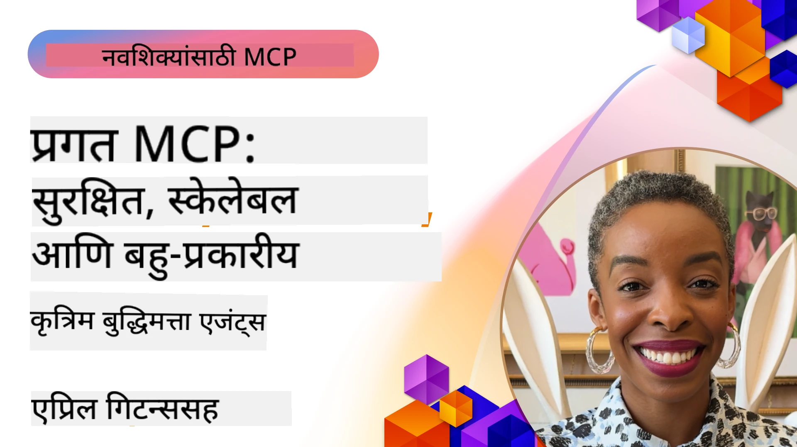

# MCP मध्ये प्रगत विषय

_(हा धडा पाहण्यासाठी वरील प्रतिमा क्लिक करा)_

हा प्रकरण मॉडेल संदर्भ प्रोटोकॉल (MCP) अंमलबजावणीमधील प्रगत विषयांचा एक समूह कव्हर करतो, ज्यामध्ये बहु-मोडल एकत्रीकरण, प्रमाणनीयता, सुरक्षा सर्वोत्तम पद्धती आणि एंटरप्राइझ एकत्रीकरण यांचा समावेश आहे. हे विषय मजबूत आणि उत्पादन-तैयार MCP अनुप्रयोग तयार करण्यासाठी खूप महत्त्वाचे आहेत जे आधुनिक AI प्रणालींच्या गरजा पूर्ण करू शकतात.

## आढावा

हा धडा मॉडेल संदर्भ प्रोटोकॉल अंमलबजावणीतील प्रगत संकल्पना तपासतो, ज्यामध्ये बहु-मोडल एकत्रीकरण, प्रमाणनीयता, सुरक्षा सर्वोत्तम पद्धती आणि एंटरप्राइझ एकत्रीकरण यावर लक्ष केंद्रीत आहे. हे विषय उत्पादन-गुणवत्तेचे MCP अनुप्रयोग तयार करण्यासाठी आवश्यक आहेत जे एंटरप्राइझ वातावरणातील गुंतागुंतीच्या गरजा हाताळू शकतात.

> **सध्याचा तपशील नोट:** MCP `2026-07-28` हे धडा 5.4 आणि 5.6 मध्ये कव्हर केलेले Roots आणि Sampling प्रिमिटिव्ह्स अमान्य करतो. याशिवाय प्रोटोकॉल फीचर्स (5.16) मध्ये संदर्भित प्रायोगिक Tasks वैशिष्ट्य एक समर्पित Tasks विस्तारात हलवले आहे. हे धडे वारसा `2025-11-25` अंमलबजावणींसाठी राखून ठेवले आहेत आणि स्थलांतर मार्गदर्शन समाविष्ट आहे. पाहा [MCP मधील काय बदलले: 2026-07-28 तपशील](../01-CoreConcepts/mcp-2026-07-28.md).

## शिकण्याचे उद्दिष्टे

या धड्याच्या शेवटी, आपण सक्षम असाल:

- MCP फ्रेमवर्कमध्ये बहु-मोडल क्षमता अमलात आणा
- उच्च मागणीच्या परिस्थितीसाठी प्रमाणनीय MCP आर्किटेक्चर्स डिझाइन करा
- MCP च्या सुरक्षा तत्त्वांशी सुसंगत सुरक्षा सर्वोत्तम पद्धती लागू करा
- MCP ला एंटरप्राइझ AI प्रणाली आणि फ्रेमवर्कसह एकत्र करा
- उत्पादन वातावरणातील कार्यक्षमता आणि विश्वासार्हता ऑप्टिमाइझ करा

## धडे आणि नमुना प्रकल्प

| दुवा | शीर्षक | वर्णन |
|------|-------|-------------|
| [5.1 Azure सह एकत्रीकरण](./mcp-integration/README.md) | Azure सह एकत्रीकरण | Azure वर आपला MCP सर्व्हर एकत्र करण्याचा मार्ग शिकाअ |
| [5.2 बहु-मोडल नमुना](./mcp-multi-modality/README.md) | MCP बहु-मोडल नमुने  | ऑडिओ, प्रतिमा आणि बहु-मोडल प्रतिसादासाठी नमुने |
| [5.3 MCP OAuth2 नमुना](../../../05-AdvancedTopics/mcp-oauth2-demo) | MCP OAuth2 डेमो | OAuth2 सह MCP दर्शविणारा मिनिमल स्प्रिंग बूट अ‍ॅप, अधिकृत आणि संसाधन सर्व्हर दोन्ही म्हणून. सुरक्षित टोकन जारीकरण, संरक्षित एन्डपॉइंट्स, Azure कंटेनर अ‍ॅप्स तैनाती, आणि API व्यवस्थापन एकत्रीकरण दर्शवितो. |
| [5.4 Root Contexts](./mcp-root-contexts/README.md) | Root संदर्भ  | वारसा `2025-11-25` Roots प्रिमिटिव्ह आणि सध्याच्या स्थलांतर पर्यायांचा अभ्यास करा (अमान्य केलेले `2026-07-28`) |
| [5.5 Routing](./mcp-routing/README.md) | मार्गदर्शन | विविध प्रकारच्या मार्गदर्शनाचे शिक्षण घ्या |
| [5.6 Sampling](./mcp-sampling/README.md) | Sampling | वारसा `2025-11-25` Sampling प्रिमिटिव्ह आणि सध्याच्या स्थलांतर पर्यायांचा अभ्यास करा (अमान्य केलेले `2026-07-28`) |
| [5.7 Scaling](./mcp-scaling/README.md) | प्रमाणनीयता  | प्रमाणनीयतेविषयी जाणून घ्या |
| [5.8 Security](./mcp-security/README.md) | सुरक्षा  | आपला MCP सर्व्हर सुरक्षित करा |
| [5.9 Web Search नमुना](./web-search-mcp/README.md) | वेब शोध MCP | Python MCP सर्व्हर आणि क्लायंट जे SerpAPI सह रिअल-टाइम वेब, बातम्या, उत्पादन शोध आणि प्रश्नोत्तर एकत्र करतात. बहु-साधन समन्वय, बाह्य API एकत्रीकरण, आणि मजबूत त्रुटी हाताळणी दाखवतो. |
| [5.10 रिअलटाइम स्ट्रीमिंग](./mcp-realtimestreaming/README.md) | स्ट्रीमिंग  | रिअल-टाइम डेटा स्ट्रीमिंग हे आजच्या डेटा-आधारित जगात अत्यावश्यक झाले आहे, जेथे व्यवसाय आणि अनुप्रयोग तात्काळ निर्णय घेण्यासाठी त्वरित माहितीची आवश्यकता आहे.|
| [5.11 रिअलटाइम वेब शोध](./mcp-realtimesearch/README.md) | वेब शोध | रिअल-टाइम वेब शोध अशा प्रकारे MCP कसे रूपांतर करते हे एका प्रमाणित संदर्भ व्यवस्थापन दृष्टिकोनाद्वारे AI मॉडेल्स, शोध इंजिन्स आणि अनुप्रयोगांमध्ये प्रदान करते.| 
| [5.12  Model Context Protocol सर्व्हरसाठी Entra ID प्रमाणीकरण](./mcp-security-entra/README.md) | Entra ID प्रमाणीकरण | Microsoft Entra ID एक मजबूत क्लाऊड-आधारित ओळख आणि प्रवेश व्यवस्थापन उपाय प्रदान करतो, ज्यामुळे केवळ अधिकृत वापरकर्ते आणि अनुप्रयोग आपला MCP सर्व्हर वापरू शकतात.|
| [5.13 Microsoft Foundry एजंट एकत्रीकरण](./mcp-foundry-agent-integration/README.md) | Microsoft Foundry एकत्रीकरण | मॉडेल संदर्भ प्रोटोकॉल सर्व्हरना Microsoft Foundry एजंट्ससह कसे एकत्र करायचे, सामर्थ्यशाली साधन समन्वय आणि एंटरप्राइझ AI क्षमता मानकित बाह्य डेटा स्रोत कनेक्शन्ससह सक्षम करण्याबाबत शिकाअ.|
| [5.14 संदर्भ अभियांत्रिकी](./mcp-contextengineering/README.md) | संदर्भ अभियांत्रिकी | MCP सर्व्हरसाठी संदर्भ अभियांत्रिकी तंत्रांचा भविष्याचा संधी, ज्यात संदर्भ ऑप्टिमायझेशन, डायनॅमिक संदर्भ व्यवस्थापन, आणि MCP फ्रेमवर्कमध्ये प्रभावी प्रॉम्प्ट अभियांत्रिकीच्या रणनीतींचा समावेश आहे.|
| [5.15 MCP कस्टम ट्रान्सपोर्ट](./mcp-transport/README.md) | कस्टम ट्रान्सपोर्ट | विशेष MCP संवाद परिस्थितीसाठी कस्टम ट्रान्सपोर्ट यंत्रणा कशी अमलात आणायची ते शिकाअ.|
| [5.16 प्रोटोकॉल फिचर्स डीप डाईव्ह](./mcp-protocol-features/README.md) | प्रोटोकॉल वैशिष्ट्ये | प्रगत प्रोटोकॉल वैशिष्ट्ये मास्टर करा ज्यात प्रगती सूचना, विनंती रद्दीकरण, संसाधन साच्ये, आणि त्रुटी हाताळणी नमुने यांचा समावेश आहे.|
| [5.17 विरोधात्मक बहु-एजंट विचारसरणी](./mcp-adversarial-agents/README.md) | विरोधात्मक एजंट्स | विरोधी भूमिका असलेल्या दोन एजंटसह एकाच MCP साधन संच शेअर करा, भ्रमांना पकडा, टोकाने स्थिती दाखवा, आणि संरचित वादातून सुधारित आउटपुट निर्माण करा.|

> **ऐतिहासिक `2025-11-25` नोट:** त्या आवृत्तीने प्रायोगिक
> Tasks प्रस्तुत केली आणि अनेक प्रोटोकॉल वैशिष्ट्ये वाढवली. `2026-07-28` येथे Tasks अधिकृत विस्तारात गेले आणि Roots अमान्य झाले. `2025-11-25` वैशिष्ट्य स्थितीचे सध्याचे मार्गदर्शन म्हणून वापर करू नका; पाहा
> [2026-07-28 चेंजलॉग](https://modelcontextprotocol.io/specification/2026-07-28/changelog).

## अतिरिक्त संदर्भ

प्रगत MCP विषयांवरील सर्वात अद्ययावत माहितीसाठी, पहा:
- [MCP दस्तऐवजीकरण](https://modelcontextprotocol.io/)
- [MCP तपशील (2026-07-28)](https://modelcontextprotocol.io/specification/2026-07-28/)
- [GitHub संग्रहालय](https://github.com/modelcontextprotocol)
- [OWASP MCP टॉप 10](https://microsoft.github.io/mcp-azure-security-guide/mcp/) - सुरक्षा धोके आणि प्रतिबंध
- [MCP सुरक्षा परिषद कार्यशाळा (शेरपा)](https://azure-samples.github.io/sherpa/) - प्रायोगिक सुरक्षा प्रशिक्षण

## मुख्य मुद्दे

- बहु-मोडल MCP अंमलबजावण्या AI क्षमतांना फक्त मजकूर प्रक्रियेपलीकडे विस्तारित करतात
- प्रमाणनीयता एंटरप्राइझ तैनातींसाठी अत्यावश्यक आहे आणि क्षैतिज व उभ्या प्रमाणनीयतेद्वारे हाताळली जाऊ शकते
- व्यापक सुरक्षा उपाय डेटा संरक्षित करतात आणि योग्य प्रवेश नियंत्रण सुनिश्चित करतात
- Azure OpenAI आणि Microsoft AI Foundry सारख्या प्लॅटफॉर्म्ससह एंटरप्राइझ एकत्रीकरण MCP क्षमतांना सुधारते
- प्रगत MCP अंमलबजावण्यांना ऑप्टिमाइझ केलेल्या आर्किटेक्चर आणि काळजीपूर्वक संसाधन व्यवस्थापनाचे फायदे होतात

## व्यायाम

विशिष्ट वापर प्रकरणासाठी एंटरप्राइझ-ग्रेड MCP अंमलबजावणी डिझाइन करा:

1. आपल्या वापर प्रकरणासाठी बहु-मोडल गरजा ओळखा
2. संवेदनशील डेटाचे संरक्षण करण्यासाठी आवश्यक सुरक्षा नियंत्रण आखणी करा
3. विविध भारांना हाताळू शकणारी प्रमाणनीय रचना डिझाइन करा
4. एंटरप्राइझ AI प्रणालींसह एकत्रीकरणाच्या बिंदूंची योजना करा
5. संभाव्य कार्यक्षमता अडथळे आणि प्रतिबंधात्मक धोरणांचे दस्तऐवजीकरण करा

## अतिरिक्त स्रोत

- [Azure OpenAI दस्तऐवजीकरण](https://learn.microsoft.com/en-us/azure/ai-services/openai/)
- [Microsoft AI Foundry दस्तऐवजीकरण](https://learn.microsoft.com/en-us/ai-services/)

---

## पुढे काय

या मॉड्युलमधील धडे एक्सप्लोर करा सुरुवात करून: [5.1 MCP Integration](./mcp-integration/README.md)

एकदा आपण हा मॉड्युल पूर्ण केल्यावर, पुढे जा: [मॉड्युल 6: समुदाय योगदान](../06-CommunityContributions/README.md)

---

<!-- CO-OP TRANSLATOR DISCLAIMER START -->
**अस्वीकरण**:
हा दस्तऐवज AI भाषांतर सेवा [Co-op Translator](https://github.com/Azure/co-op-translator) चा वापर करून अनुवादित केला आहे. जरी आम्ही अचूकतेसाठी प्रयत्न करतो, तरी कृपया लक्षात घ्या की स्वयंचलित भाषांतरांमध्ये त्रुटी किंवा अचूकतेची कमतरता असू शकते. मूळ दस्तऐवज त्याच्या मूळ भाषेत अधिकृत स्रोत मानला पाहिजे. महत्त्वाची माहिती असल्यास, व्यावसायिक मानवी भाषांतराची शिफारस केली जाते. या भाषांतराच्या वापरामुळे उद्भवणाऱ्या कोणत्याही गैरसमज किंवा चुकीच्या अर्थलावणीसाठी आम्ही जबाबदार नाही.
<!-- CO-OP TRANSLATOR DISCLAIMER END -->