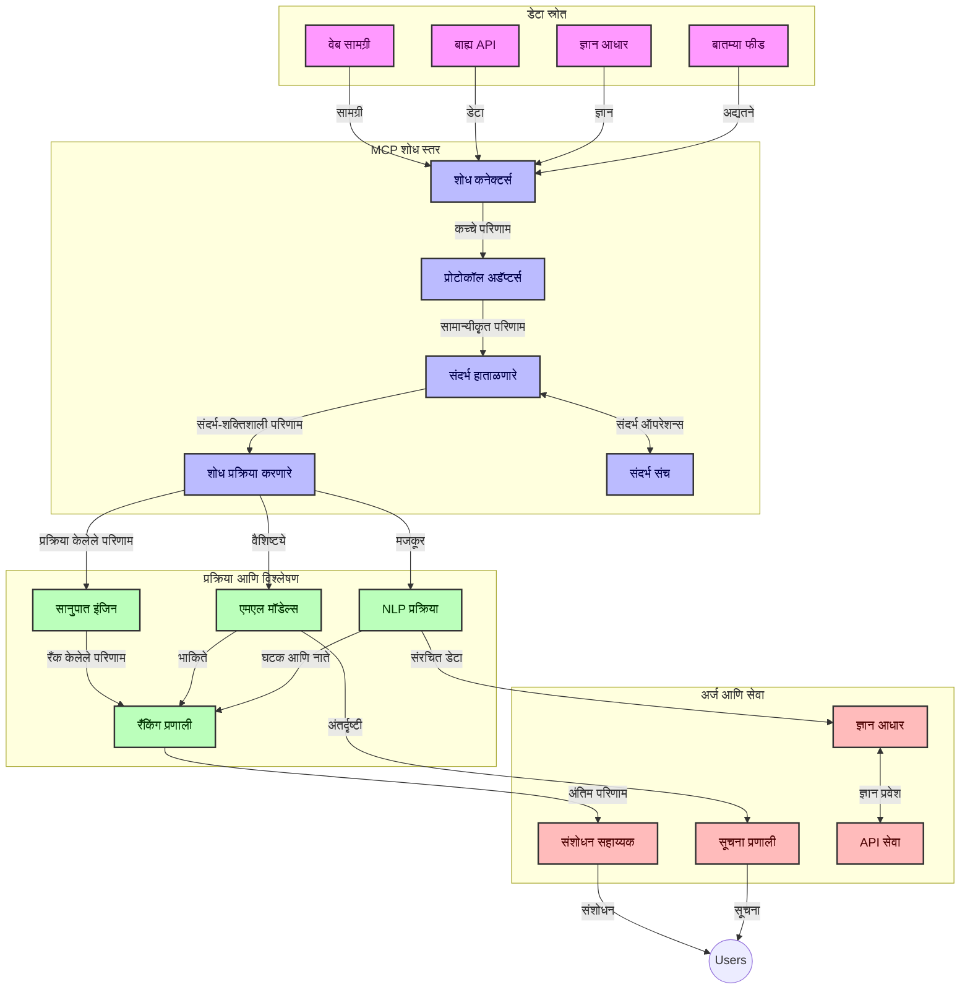
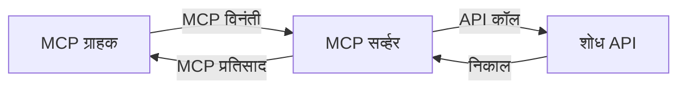
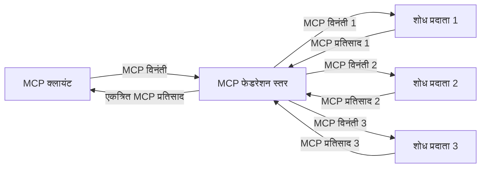

# रिअल-टाइम वेब शोधासाठी मॉडेल संदर्भ प्रोटोकॉल

## आढावा

आजच्या माहिती-आधारित वातावरणात रिअल-टाइम वेब शोध अत्यावश्यक झाला आहे, जिथे अनुप्रयोगांना इंटरनेटवर अद्ययावत माहिती त्वरित प्राप्त करण्याची गरज असते जेणेकरून संबंधित आणि वेळोवेळी उत्तरे दिली जाऊ शकतील. मॉडेल संदर्भ प्रोटोकॉल (MCP) या रिअल-टाइम शोध प्रक्रियांना सुधारण्यामध्ये मोलाची प्रगती साधतो, शोध कार्यक्षमतेत वाढ करतो, संदर्भात्मक अखंडता राखतो आणि एकूण प्रणालीची कामगिरी सुधारतो.

हा मॉड्यूल MCP कसे रिअल-टाइम वेब शोध रूपांतरित करतो हे तपासतो, AI मॉडेल्स, शोध इंजिन आणि अनुप्रयोगांमध्ये संदर्भ व्यवस्थापनासाठी एक मानकीकृत दृष्टिकोन प्रदान करून.

### तुम्ही काय शिकाल

या सर्वसमावेशक मार्गदर्शकात, तुम्हाला कळेल:

- MCP कसा AI मॉडेल्स आणि रिअल-टाइम वेब शोध क्षमतांमध्ये अखंड सेतू तयार करतो
- MCP सह कार्यक्षम आणि स्केलेबल शोध सोल्यूशन्स अंमलबजावणीसाठी आर्किटेक्चरल पॅटर्न
- अनेक क्वेरी आणि संवादांमध्ये शोध संदर्भ कसा जपायचा याच्या तंत्रज्ञान
- विविध शोध परिस्थितीसाठी Python आणि JavaScript मधील व्यावहारिक कोड अंमलबजावणी
- MCP-संचालित शोध प्रणालींमध्ये सानुकूलता, ताजेपणा, आणि कार्यक्षमता यांचा समतोल साधण्याच्या पद्धती

## रिअल-टाइम वेब शोधाचे परिचय

रिअल-टाइम वेब शोध हा एक तंत्रज्ञानाचा दृष्टिकोन आहे जो सतत क्वेरी करणे, वेबवरील माहिती प्रक्रिया करणे आणि विश्लेषण करणे शक्य करतो, जेव्हा ती प्रकाशित किंवा अद्यतनित होते, अशा प्रकारे प्रणालींना न्यूनतम विलंबाने ताजी आणि संबंधित माहिती पुरवता येते. पारंपरिक शोध प्रणाली जे केवळ काही तास किंवा दिवस जुनी निर्देशांकित माहिती वापरतात, त्याप्रमाणे नाही, तर रिअल-टाइम शोध वेबवरची तीव्र जीवन्त माहिती सामावून घेतो ज्यामुळे ऑनलाईन सामग्रीचे वर्तमान स्थिती प्रतिबिंबित होते.

### रिअल-टाइम वेब शोधाच्या मुख्य संकल्पना:

- **सतत क्वेरी प्रक्रिया**: शोध क्वेरी नेहमीच अद्ययावत होणाऱ्या डेटाच्या स्रोतांवर प्रक्रियेत असतात
- **ताजेपणाला प्राधान्य देणे**: प्रणाली ताजी माहितीप्राथमिकतेत इतर गोष्टींपेक्षा ठेवल्या जातात
- **सान्दर्भिक समतोल**: सान्दर्भिकता आणि ताजेपणाचा समतोल राखणे
- **स्केलेबल आर्किटेक्चर**: प्रणाली विविध क्वेरी लोड आणि डेटा प्रमाण हाताळू शकतील
- **संदर्भात्मक समजूत**: वापरकर्त्याचा संदर्भ शोध प्रक्रियेत अहम भूमिका बजावतो
- **गतिशील क्वेरी पुनर्रचना**: संदर्भ आणि मागील निकालांनुसार क्वेरी अनुकूल करणे
- **एकाधिक स्रोत एकत्रीकरण**: विविध शोध प्रदाते आणि वेब स्रोतांपासून प्राप्त निकाल एकत्र करणे
- **अर्थपूर्ण समज**: फक्त कीवर्ड नव्हे तर संदर्भाचा अर्थ समजून प्रश्न आणि सामग्री प्रक्रिया करणे
- **रिअल-टाइम रँकिंग**: नवीन माहिती उपलब्ध होताच निकालांचे स्थानिकरित्या वारंवार समायोजित करणे

### मॉडेल संदर्भ प्रोटोकॉल आणि रिअल-टाइम वेब शोध

मॉडेल संदर्भ प्रोटोकॉल (MCP) रिअल-टाइम वेब शोधात अनेक महत्त्वाच्या आव्हानांना सामोरे जातो:

1. **शोध संदर्भ जपणे**: MCP वितरित शोध घटकांमध्ये संदर्भ जपण्याची पद्धत मानकीकृत करतो, त्यामुळे AI मॉडेल्स व प्रक्रिया नोड्सना संबंधित क्वेरी इतिहास आणि वापरकर्ता प्राधान्ये सहज उपलब्ध होतात.

2. **कार्यक्षम क्वेरी व्यवस्थापन**: संदर्भ प्रसारणासाठी संरचित यंत्रणा प्रदान करून MCP प्रत्येक शोध चक्रात संदर्भ पुनरावृत्तीचा ओवरहेड कमी करतो.

3. **परस्परसंवाद क्षमता**: MCP विविध शोध तंत्रज्ञान आणि AI मॉडेल्समध्ये संदर्भ शेअरिंगसाठी एक सामायिक भाषा तयार करतो, ज्यामुळे अधिक लवचिक आणि विस्तारक्षम आर्किटेक्चर शक्य होते.

4. **शोध-सुधारित संदर्भ**: MCP कार्यान्वयन कुठले संदर्भ घटक प्रभावी शोधासाठी सर्वात संबंधित आहेत हे प्राधान्य देऊ शकतात, कार्यक्षमता आणि अचूकतेसाठी अनुकूलित.

5. **अनुकूली शोध प्रक्रिया**: MCP द्वारे योग्य संदर्भ व्यवस्थापनामुळे शोध प्रणाली वापरकर्त्याच्या बदलत्या गरजा आणि माहिती लँडस्केपनुसार गतिशील समायोजन करू शकतात.

वर्तमानकालीन अनुप्रयोगांमध्ये, जैसे की न्यूज अ‍ॅग्रिगेशन ते संशोधन सहाय्यकपर्यंत, MCP ची वेब शोध तंत्रज्ञानांसह एकत्रीकरण अधिक बुद्धिमान, संदर्भ-जागरूक शोध सक्षम करते, जो वापरकर्त्याच्या संवादांनुसार अधिक संबंधित निकाल पुरवू शकतो.

## शिकण्याचे उद्दिष्टे

या धड्याच्या शेवटी, आपण सक्षम असाल:

- रिअल-टाइम वेब शोधाचे मूलभूत तत्वे आणि आधुनिक अनुप्रयोगांतील त्याच्या आव्हानांची समज
- कसे मॉडेल संदर्भ प्रोटोकॉल (MCP) रिअल-टाइम वेब शोध क्षमता सुधारतो हे स्पष्ट करणे
- लोकप्रिय फ्रेमवर्क्स आणि API वापरून MCP-आधारित शोध सोल्यूशन्सची अंमलबजावणी करणे
- MCP सह स्केलेबल, उच्च कार्यक्षमतेचे शोध आर्किटेक्चर डिझाइन आणि तैनात करणे
- सेमँटिक शोध, संशोधन सहाय्य आणि AI-समृद्ध ब्राउझिंग यांसह विविध वापर प्रकरणांमध्ये MCP संकल्पना लागू करणे
- MCP-आधारित शोध तंत्रज्ञानातील उभरत्या ट्रेंड्स आणि भविष्यकालीन नवकल्पनांचे मूल्यमापन करणे
- वापरकर्त्याच्या संवादांमधून शिकणाऱ्या संदर्भ-जागरूक शोध प्रणाली विकसित करणे
- मानकीकृत MCP प्रोटोकॉल वापरून AI सहाय्यकांमध्ये वेब शोध क्षमता एकत्रित करणे
- संदर्भावर आधारित टप्प्याटप्प्याने निकाल सुधारणारी बहु-स्तरीय शोध पाइपलाइन तयार करणे
- व्यापक संदर्भ जागरूक ठेवताना शोध कार्यक्षमता अनुकूल करणे

### व्याख्या आणि महत्त्व

रिअल-टाइम वेब शोध म्हणजे वेब-आधारित माहितीचे सतत क्वेरी करणे, पुनर्प्राप्ती करणे आणि न्यूनतम विलंबासह वितरण करणे. पारंपरिक शोध इंजिन जे वेबला कालांतरांनी क्रॉल आणि निर्देशांकित करतात, तितके नाही, तर रिअल-टाइम शोध उपलब्ध होताच माहिती समोर आणण्याचा लक्ष्य ठेवतो, ज्यामुळे सर्वात अद्ययावत सामग्री त्वरित प्रवेशयोग्य होते.

रिअल-टाइम वेब शोधाच्या मुख्य वैशिष्ट्यांमध्ये समाविष्ट आहे:

- **ताजेपणा**: अलीकडील सामग्री आणि अद्यतनांना प्राधान्य देणे
- **सतत प्रक्रिया**: नवीन माहिती साठी सतत देखरेख
- **क्वेरी समायोजन**: संदर्भ आणि अभिप्रायावर आधारित शोध क्वेरीज सुधारणा
- **त्वरित वितरण**: शोध निकालांना न्यूनतम विलंबात पुरवणे
- **संदर्भ राखणे**: सुधारित सान्दर्भिकतेसाठी मागच्या क्वेरीजवर आधारित बांधणी

### पारंपरिक वेब शोधातील आव्हाने

पारंपरिक वेब शोध पद्धती रिअल-टाइम परिस्थितीत वापरल्यास अनेक मर्यादा दिसून येतात:

1. **संदर्भ विघटन**: अनेक क्वेरीजमध्ये शोध संदर्भ टिकवणे कठीण
2. **माहिती ताजेपणा**: सर्वात अलीकडील माहिती मिळवणे आणि प्राधान्य देणे कठीण
3. **एकत्रीकरणी गुंतागुंत**: शोध प्रणाली आणि अनुप्रयोगांमधील परस्परसंवाद समस्यां
4. **विलंब समस्या**: व्यापक शोध आणि प्रतिसाद वेळ यांचा समतोल राखणे
5. **सादृश्यता समायोजन**: ताजेपणा प्राधान्य देताना अचूकता आणि सादृश्यता सुनिश्चित करणे

## शोधासाठी मॉडेल संदर्भ प्रोटोकॉल (MCP) समजून घेणे

### शोध संदर्भातील MCP काय आहे?

मॉडेल संदर्भ प्रोटोकॉल (MCP) हा एक मानकीकृत संवाद प्रोटोकॉल आहे जो AI मॉडेल्स आणि अनुप्रयोगांमधील प्रभावी संवाद सुलभ करतो. रिअल-टाइम वेब शोधाच्या संदर्भात, MCP हे फ्रेमवर्क प्रदान करतो:

- क्वेरी साखळीदरम्यान शोध संदर्भ जपणे
- शोध क्वेरी आणि निकालांचे स्वरूप मानकीकृत करणे
- शोध पॅरामीटर्स आणि निकालांचे प्रसारण अनुकूल करणे
- मॉडेल ते शोध इंजिन संवाद वाढवणे

### मुख्य घटक आणि आर्किटेक्चर

रिअल-टाइम वेब शोधासाठी MCP आर्किटेक्चरमध्ये काही मुख्य घटक असतात:

1. **क्वेरी संदर्भ हँडलर्स**: अनेक क्वेरींमध्ये शोध संदर्भाचे व्यवस्थापन आणि जपणूक करतात
2. **शोध प्रक्रिया करणारे**: संदर्भ-जागरूक तंत्रज्ञान वापरून येणाऱ्या शोध विनंत्या प्रक्रिया करतात
3. **प्रोटोकॉल ऍडॉप्टर्स**: वेगवेगळ्या शोध API मध्ये रूपांतरण करताना संदर्भ जपतात
4. **संदर्भ संग्रह**: शोध इतिहास आणि प्राधान्ये कार्यक्षमपणे संचयित आणि पुनर्प्राप्त करतात
5. **शोध कनेक्टर्स**: विविध शोध इंजिन आणि वेब API शी जोडतात



### MCP कसा रिअल-टाइम वेब शोध सुधारतो

MCP पारंपरिक वेब शोध आव्हाने खालीलप्रमाणे हाताळतो:

- **संदर्भात्मक अखंडता**: संपूर्ण शोध सत्रादरम्यान क्वेरींमधील संबंध राखतो
- **ऑप्टिमाइझ्ड प्रसारण**: बुद्धिमान संदर्भ व्यवस्थापनाद्वारे शोध पॅरामीटर्समधील पुनरावृत्ती कमी करतो
- **मानकीकृत इंटरफेस**: शोध घटकांसाठी सुसंगत API पुरवतो
- **कमी विलंब**: कार्यक्षम संदर्भ हाताळणीद्वारे प्रक्रिया ओव्हरहेड कमी करतो
- **वाढलेली सादृश्यता**: अनेक क्वेरींमध्ये वापरकर्त्याचा हेतू जपून शोध सादृश्यता सुधारतो

## एकत्रीकरण व अंमलबजावणी

रिअल-टाइम वेब शोध प्रणाली कार्यक्षमता आणि संदर्भ अखंडता राखण्यासाठी काळजीपूर्वक आर्किटेक्चरल डिझाइन आणि अंमलबजावणी आवश्यक आहे. मॉडेल संदर्भ प्रोटोकॉल AI मॉडेल्स आणि शोध तंत्रज्ञान एकत्र करण्यासाठी मानकीकृत दृष्टिकोन पुरवतो, ज्यामुळे अधिक प्रगत, संदर्भ-जागरूक शोध पाइपलाइन तयार करता येतात.

### शोध आर्किटेक्चरमध्ये MCP एकत्रीकरणाचा आढावा

रिअल-टाइम वेब शोध वातावरणात MCP अंमलबजावणी करताना काही महत्त्वाच्या बाबी विचारात घ्याव्या लागतात:

1. **शोध संदर्भ सिरियलायझेशन**: MCP शोध विनंत्यांमधील संदर्भ माहिती एन्कोड करण्यासाठी कार्यक्षम यंत्रणा पुरवतो, ज्यामुळे आवश्यक संदर्भ प्रक्रियेस संपूर्ण साखळीत पाठवला जातो. यात शोध-संबंधित मेटाडेटासाठी अनुकूलित मानकीकृत सिरियलायझेशन फॉरमॅट्स समाविष्ट आहेत.

2. **स्टेटफुल शोध प्रक्रिया**: MCP एकसंध संदर्भ सादरीकरण टिकवून अधिक बुद्धिमान स्टेटफुल प्रोसेसिंग सक्षम करतो. हे बहु-टप्प्याच्या शोध पाइपलाइनमध्ये विशेषतः उपयुक्त आहे जिथे संदर्भ सुधारणा निकाल सुधारते.

3. **क्वेरी विस्तार आणि सुधारणा**: शोध प्रणालीतील MCP अंमलबजावणी साठवलेल्या संदर्भावर आधारित जटिल क्वेरी विस्तार व सुधारणा करू शकतात, ज्यामुळे शोध सत्र प्रगती करतांना अधिक संबंधित निकाल मिळतात.

4. **निकाल कॅशिंग आणि प्राधान्य देणे**: संदर्भ हाताळणी मानकीकृत करून MCP निकाल कॅशिंग आणि प्राथमिकता व्यवस्थापन मदत करते, ज्यामुळे घटक बदलणाऱ्या संदर्भानुसार समायोजित होऊ शकतात.

5. **शोध फेडरेशन आणि एकत्रीकरण**: MCP शोध संदर्भाचे संरचित सादरीकरण पुरवून अनेक बॅकेंडवर अधिक प्रगत शोध फेडरेशन सक्षम करतो, विविध स्रोतांतील निकाल अधिक अर्थपूर्ण रीतीने एकत्र करणे शक्य होते.

वेगवेगळ्या शोध तंत्रज्ञानामध्ये MCP ची अंमलबजावणी एकसंध संदर्भ व्यवस्थापनाचा दृष्टिकोन तयार करते, ज्यामुळे सानुकूल एकत्रीकरण कोडची गरज कमी होते आणि शोध क्वेरी विकसित होताना अर्थपूर्ण संदर्भ राखण्याची प्रणालीची क्षमता वाढते.

### वेगवेगळ्या वेब शोध अंमलबजावण्यांमधील MCP

या उदाहरणांमध्ये चालू MCP विनिर्देशाचा वापर केला आहे जो JSON-RPC आधारित प्रोटोकॉल आणि वेगळ्या ट्रान्सपोर्ट यंत्रणा यावर केंद्रित आहे. कोड दाखवतो की तुम्ही कसे सानुकूल शोध एकत्रीकरण करू शकता ज्यात MCP प्रोटोकॉलची पूर्ण अनुरूपता राखली जाते.


<details>
<summary>जनरिक शोध API सह Python अंमलबजावणी</summary>

```python
import asyncio
import json
import aiohttp
from typing import Dict, Any, Optional, List
from contextlib import asynccontextmanager
from collections.abc import AsyncIterator

# मानक MCP लायब्ररी आयात करा
from mcp.client.session import ClientSession
from mcp.client.streamable_http import streamablehttp_client
from mcp.types import TextContent, CreateMessageRequestParams, CreateMessageResult
from mcp.server.fastmcp import FastMCP

# वेब शोधासाठी FastMCP सर्व्हर तयार करा
search_server = FastMCP("WebSearch")

# वेब शोध ऑपरेशन्स हाताळण्यासाठी वर्ग
class WebSearchHandler:
    def __init__(self, api_endpoint: str, api_key: str):
        self.api_endpoint = api_endpoint
        self.api_key = api_key
        self.session = None
        
    async def initialize(self):
        """Initialize the HTTP session"""
        self.session = aiohttp.ClientSession(
            headers={"Authorization": f"Bearer {self.api_key}"}
        )
    
    async def close(self):
        """Close the HTTP session"""
        if self.session:
            await self.session.close()
            
    async def perform_search(self, query: str, max_results: int = 5, 
                           include_domains: List[str] = None, 
                           exclude_domains: List[str] = None,
                           time_period: str = "any") -> Dict[str, Any]:
        """Perform web search using the search API"""
        # शोध पॅरामीटर्स तयार करा
        search_params = {
            "q": query,
            "limit": max_results,
            "time": time_period
        }
        
        if include_domains:
            search_params["site"] = ",".join(include_domains)
            
        if exclude_domains:
            search_params["exclude_site"] = ",".join(exclude_domains)
        
        # शोध विनंती करा
        try:
            async with self.session.get(
                self.api_endpoint,
                params=search_params
            ) as response:
                if response.status != 200:
                    error_text = await response.text()
                    raise Exception(f"Search API error: {response.status} - {error_text}")
                
                search_data = await response.json()
                
                # API-विशिष्ट प्रतिसादाला मानक स्वरूपात रूपांतरित करा
                results = []
                for item in search_data.get("results", []):
                    results.append({
                        "title": item.get("title", ""),
                        "url": item.get("url", ""),
                        "snippet": item.get("snippet", ""),
                        "date": item.get("published_date", ""),
                        "source": item.get("source", "")
                    })
                
                return {
                    "query": query,
                    "totalResults": len(results),
                    "results": results
                }
        except Exception as e:
            print(f"Search API request error: {e}")
            raise

# शोध हॅंडलर प्रारंभ करा
search_handler = WebSearchHandler(
    api_endpoint="https://api.search-service.example/search",
    api_key="your-api-key-here"
)

# शोध हॅंडलर व्यवस्थापित करण्यासाठी आयुष्यकाल सेट करा
@asyncio.asynccontextmanager
async def app_lifespan(server: FastMCP):
    """Manage application lifecycle"""
    await search_handler.initialize()
    try:
        yield {"search_handler": search_handler}
    finally:
        await search_handler.close()

# सर्व्हरसाठी आयुष्यकाल सेट करा
search_server = FastMCP("WebSearch", lifespan=app_lifespan)

# वेब शोध साधन नोंदणी करा
@search_server.tool()
async def web_search(query: str, max_results: int = 5, 
                   include_domains: List[str] = None,
                   exclude_domains: List[str] = None,
                   time_period: str = "any") -> Dict[str, Any]:
    """
    Search the web for information
    
    Args:
        query: The search query
        max_results: Maximum number of results to return (default: 5)
        include_domains: List of domains to include in search results
        exclude_domains: List of domains to exclude from search results
        time_period: Time period for results ("day", "week", "month", "any")
        
    Returns:
        Dictionary containing search results
    """
    ctx = search_server.get_context()
    search_handler = ctx.request_context.lifespan_context["search_handler"]
    
    results = await search_handler.perform_search(
        query=query,
        max_results=max_results,
        include_domains=include_domains,
        exclude_domains=exclude_domains,
        time_period=time_period
    )
    
    return results

# उदाहरण क्लायंट वापर
async def client_example():
    # Streamable HTTP वाहतुकीचा वापर करून शोध सर्व्हरशी कनेक्ट करा
    async with streamablehttp_client("http://localhost:8000/mcp") as (read, write, _):
        async with ClientSession(read, write) as session:
            # कनेक्शन प्रारंभ करा
            await session.initialize()
            
            # web_search साधन कॉल करा
            search_results = await session.call_tool(
                "web_search", 
                {
                    "query": "latest developments in AI and Model Context Protocol",
                    "max_results": 5,
                    "time_period": "day",
                    "include_domains": ["github.com", "microsoft.com"]
                }
            )
            
            print(f"Search results: {search_results}")

# सर्व्हर अंमलबजावणी उदाहरण
if __name__ == "__main__":
    # Streamable HTTP वाहतुकीसह सर्व्हर चालवा
    search_server.run(transport="streamable-http")
```
</details> 

<details>
<summary>ब्राउझर-आधारित शोधासह JavaScript अंमलबजावणी</summary>


```javascript
// वेब शोधासाठी MCP सर्व्हर अंमलबजावणी
import { McpServer, ResourceTemplate } from '@modelcontextprotocol/sdk/server/mcp.js';
import { StreamableHTTPServerTransport } from '@modelcontextprotocol/sdk/server/streamableHttp.js';
import { z } from 'zod';

// वेब शोधासाठी MCP सर्व्हर तयार करा
const searchServer = new McpServer({
    name: "BrowserSearch",
    description: "A server that provides web search capabilities"
});

// शोध सेवा वर्ग
class SearchService {
    constructor(searchApiUrl, apiKey) {
        this.searchApiUrl = searchApiUrl;
        this.apiKey = apiKey;
    }

    async performSearch(parameters) {
        const {
            query = '',
            maxResults = 5,
            includeDomains = [],
            excludeDomains = [],
            timePeriod = 'any'
        } = parameters;
        
        // पॅरामीटर्ससह शोध URL तयार करा
        const url = new URL(this.searchApiUrl);
        url.searchParams.append('q', query);
        url.searchParams.append('limit', maxResults);
        url.searchParams.append('time', timePeriod);
        
        if (includeDomains.length > 0) {
            url.searchParams.append('site', includeDomains.join(','));
        }
        
        if (excludeDomains.length > 0) {
            url.searchParams.append('exclude_site', excludeDomains.join(','));
        }
        
        try {
            const response = await fetch(url.toString(), {
                method: 'GET',
                headers: {
                    'Authorization': `Bearer ${this.apiKey}`,
                    'Content-Type': 'application/json'
                }
            });
            
            if (!response.ok) {
                const errorText = await response.text();
                throw new Error(`Search API error: ${response.status} - ${errorText}`);
            }
            
            const searchData = await response.json();
            
            // API-विशिष्ट प्रतिसादाला मानक स्वरूपात रूपांतरित करा
            const results = searchData.results?.map(item => ({
                title: item.title || '',
                url: item.url || '',
                snippet: item.snippet || '',
                date: item.published_date || '',
                source: item.source || ''
            })) || [];
            
            return {
                query,
                totalResults: results.length,
                results
            };
        } catch (error) {
            console.error('Search API request error:', error);
            throw error;
        }
    }
}

// शोध सेवा प्रारंभ करा
const searchService = new SearchService(
    'https://api.search-service.example/search',
    'your-api-key-here'
);

// सर्व्हरसाठी संदर्भ प्रदाता सेटअप करा
searchServer.setContextProvider(() => {
    return {
        searchService
    };
});

// वेब शोध साधन नोंदणी करा
searchServer.tool({
    name: 'web_search',
    description: 'Search the web for information',
    parameters: {
        type: 'object',
        properties: {
            query: {
                type: 'string',
                description: 'The search query'
            },
            maxResults: {
                type: 'integer',
                description: 'Maximum number of results to return',
                default: 5
            },
            includeDomains: {
                type: 'array',
                items: { type: 'string' },
                description: 'List of domains to include in search results'
            },
            excludeDomains: {
                type: 'array',
                items: { type: 'string' },
                description: 'List of domains to exclude from search results'
            },
            timePeriod: {
                type: 'string',
                description: 'Time period for results',
                enum: ['day', 'week', 'month', 'any'],
                default: 'any'
            }
        },
        required: ['query']
    },
    handler: async (params, context) => {
        const { searchService } = context;
        return await searchService.performSearch(params);
    }
});

// शोध सर्व्हरशी कनेक्ट होण्यासाठी उदाहरण क्लायंट कोड
import { Client } from '@modelcontextprotocol/sdk/client/index.js';
import { StreamableHTTPClientTransport } from '@modelcontextprotocol/sdk/client/streamableHttp.js';

async function connectToSearchServer() {
    // शोध सर्व्हरशी कनेक्ट करा
    const transport = new StreamableHTTPClientTransport(
        new URL('http://localhost:8000/mcp')
    );
    
    const client = new Client({
        name: 'search-client',
        version: '1.0.0'
    });
    
    await client.connect(transport);
    
    // शोध साधन चालवा
    const searchResults = await client.callTool({
        name: 'web_search',
        arguments: {
            query: 'Model Context Protocol implementation examples',
            maxResults: 10,
            timePeriod: 'week',
            includeDomains: ['github.com', 'docs.microsoft.com']
        }
    });
    
    console.log('Search results:', searchResults);
    
    // साफसफाई करा
    await client.disconnect();
}

// सर्व्हर सुरू करा
const transport = new StreamableHTTPServerTransport();
await searchServer.connect(transport);
console.log('Search server running at http://localhost:8000/mcp');

// वेगळ्या प्रक्रियेत किंवा सर्व्हर सुरू झाल्यानंतर
// connectToSearchServer().catch(console.error);
```
</details> 


## कोड उदाहरणे विरक्तता

> **महत्त्वाची टीप**: खालील कोड उदाहरणे मॉडेल संदर्भ प्रोटोकॉल (MCP) आणि वेब शोध कार्यक्षमता यांचे एकत्रीकरण सादर करतात. जी अधिकृत MCP SDK च्या पद्धती आणि रचनेचे पालन करतात, परंतु शैक्षणिक उद्देशाने सोप्या स्वरूपात दिली आहेत.
> 
> ही उदाहरणे दर्शवितात:
> 
> 1. **Python अंमलबजावणी**: FastMCP सर्व्हर अंमलबजावणी जी वेब शोध साधन पुरवते आणि बाह्य शोध API शी जोडते. हे उदाहरण योग्य जीवनचक्र व्यवस्थापन, संदर्भ हाताळणी आणि टूल अंमलबजावणी यांचे [अधिकृत MCP Python SDK](https://github.com/modelcontextprotocol/python-sdk) च्या पद्धतीनुसार सादरीकरण करते. या सर्व्हरमध्ये उत्पादनासाठी जुना SSE ट्रान्सपोर्ट बंद करून शिफारस केलेला Streamable HTTP ट्रान्सपोर्ट वापरलेला आहे.
> 
> 2. **JavaScript अंमलबजावणी**: FastMCP पॅटर्न वापरून TypeScript/JavaScript अंमलबजावणी, जी [अधिकृत MCP TypeScript SDK](https://github.com/modelcontextprotocol/typescript-sdk) मध्ये आहे, योग्य टूल व्याख्या आणि क्लायंट कनेक्शन्ससह शोध सर्व्हर तयार करते. सत्र व्यवस्थापन आणि संदर्भ राखणीसाठी अलीकडील शिफारस केलेले पॅटर्न अनुसरले जातात.
> 
> ह्या उदाहरणांसाठी उत्पादन उपयोगासाठी अतिरिक्त त्रुटी हाताळणी, प्रमाणीकरण आणि विशिष्ट API एकत्रीकरण कोड आवश्यक आहे. दाखवलेले शोध API endpoints (`https://api.search-service.example/search`) हे placeholders आहेत आणि खऱ्या शोध सेवा endpoints ने बदलणे आवश्यक आहे.
> 
> पूर्ण अंमलबजावणी तपशील आणि सर्वात ताजे दृष्टिकोनांसाठी, कृपया [अधिकृत MCP विनिर्देश](https://spec.modelcontextprotocol.io/) आणि SDK दस्तऐवज पहा.

## मुख्य संकल्पना

### मॉडेल संदर्भ प्रोटोकॉल (MCP) फ्रेमवर्क

त्याच्या मूळ आधारावर, मॉडेल संदर्भ प्रोटोकॉल AI मॉडेल्स, अनुप्रयोग आणि सेवा यांच्यात संदर्भ विनिमयासाठी एक मानकीकृत मार्ग पुरवतो. रिअल-टाइम वेब शोध मध्ये, हा फ्रेमवर्क सुसंगत, बहु-चरणीय शोध अनुभव तयार करण्यासाठी अत्यावश्यक आहे. प्रमुख घटकांमध्ये समाविष्ट आहे:

1. **क्लायंट-सर्व्हर आर्किटेक्चर**: MCP शोध क्लायंट्स (विनंती करणारे) आणि शोध सर्व्हर (पुरवठादार) यामध्ये स्पष्ट विभाजन ठेवतो, ज्यामुळे लवचिक तैनाती मोडेल शक्य होतात.

2. **JSON-RPC संवाद**: या प्रोटोकॉलमध्ये JSON-RPC संदेश विनिमय वापरला जातो, ज्यामुळे वेब तंत्रज्ञानांशी सुसंगत आणि विभिन्न प्लॅटफॉर्म्सवर सुलभ अंमलबजावणी होऊ शकते.

3. **संदर्भ व्यवस्थापन**: MCP अनेक संवादांमध्ये शोध संदर्भ टिकवण्याकरिता, अपडेट करण्यासाठी आणि उपयोग करण्यासाठी संरचित पद्धती परिभाषित करतो.

4. **टूल व्याख्या**: शोध क्षमतांना मानकीकृत टूल्स म्हणून खुला केला जातो ज्यांचे स्पष्ट परिमाणे आणि परताव्याचे मूल्य असते.

5. **स्ट्रीमिंग समर्थन**: प्रोटोकॉल स्ट्रीमिंग निकालांना समर्थन देतो, जे रिअल-टाइम शोधासाठी आवश्यक आहे जिथे निकाल टप्प्याटप्प्याने येऊ शकतात.

### वेब शोध एकत्रीकरण पॅटर्न्स

MCP वेब शोधासह एकत्र करताना, काही पॅटर्न्स दिसून येतात:

#### 1. थेट शोध प्रदाते एकत्रीकरण



या पॅटर्नमध्ये, MCP सर्व्हर थेट एक किंवा अधिक शोध API शी संवाद करतो, MCP विनंत्यांना API-विशिष्ट कॉल्समध्ये रूपांतरित करून आणि निकाल MCP प्रत्युत्तर म्हणून स्वरूपित करून.

#### 2. संदर्भ जतन करून फेडरेटेड शोध



हा पॅटर्न शोध क्वेरीज अनेक MCP-सुसंगत शोध प्रदात्यांमध्ये वितरित करतो, प्रत्येक जो विविध प्रकारच्या सामग्री किंवा शोध क्षमतांमध्ये विशेष असू शकतो, एकसंध संदर्भ राखून.

#### 3. संदर्भ-सुधारित शोध साखळी


या पॅटर्नमध्ये, शोध प्रक्रिया अनेक टप्प्यांमध्ये विभागली आहे, प्रत्येक टप्प्यात संदर्भ समृद्ध होतो, ज्यामुळे टप्प्याटप्प्याने अधिक संबंधित निकाल मिळतात.

### शोध संदर्भ घटक

MCP-आधारित वेब शोधात, संदर्भ सामान्यतः समाविष्टीत असतो:

- **क्वेरी इतिहास**: सत्रातील मागील शोध क्वेरीज
- **वापरकर्ता प्राधान्ये**: भाषा, प्रदेश, सुरक्षित शोध सेटिंग्ज
- **परस्परसंवाद इतिहास**: कोणते निकाल क्लिक केले, निकालांवर घालवलेला वेळ
- **शोध पॅरामीटर्स**: फिल्टर्स, क्रमवारी आणि इतर शोध नियंत्रणे
- **डोमेन ज्ञान**: विषय-विशिष्ट संदर्भ जो शोधासाठी संबंधित आहे
- **कालदृष्ट्या संदर्भ**: वेळ आधारित सादृश्यता घटक
- **स्रोत प्राधान्ये**: विश्वासू किंवा प्राधान्य दिलेले माहिती स्रोत

## वापर प्रकरणे आणि अनुप्रयोग

### संशोधन आणि माहिती संकलन

MCP संशोधन कार्यप्रवाह सुधारतो:

- शोध सत्रांमध्ये संशोधन संदर्भ जपत
- अधिक प्रगत आणि संदर्भ-सुसंगत क्वेरी सक्षम करत
- बहु-स्रोत शोध फेडरेशनला समर्थन देत
- शोध निकालांमधून ज्ञान संकलनास सुविधा देत

### रिअल-टाइम बातम्या आणि ट्रेंड निरीक्षण

MCP-संचालित शोध बातम्यांचे निरीक्षणासाठी फायदे पुरवतो:

- जवळजवळ रिअल-टाइम नव्या बातम्या शोधणे
- संदर्भानुसार संबंधित माहिती फिल्टर करणे
- विषय व घटक ट्रॅकिंग अनेक स्रोतांवर
- वापरकर्ता संदर्भावर आधारित वैयक्तिकृत बातमी सूचना

### AI-समृद्ध ब्राउझिंग आणि संशोधन

MCP AI-समृद्ध ब्राउझिंगसाठी नवीन संधी निर्माण करतो:

- वर्तमान ब्राउझर क्रियाकलापावर आधारित संदर्भात्मक शोध सूचना
- वेब शोधचे LLM-शक्तीशाली सहाय्यकांसह अखंड एकत्रीकरण
- राखलेला संदर्भसहित बहु-चरण शोध सुधारणा
- वाढलेले तथ्य तपासणी आणि माहिती सत्यापन

## भविष्यकालीन ट्रेंड्स आणि नवकल्पना

### वेब शोधात MCP चे विकास

येत्या काळात, आम्ही अपेक्षा करतो की MCP खालील बाबतीत विकसित होईल:


- **मल्टिमोडल शोध**: मजकूर, प्रतिमा, ऑडिओ, आणि व्हिडिओ शोध यांचा संदर्भ जपून समाकलन
- **विकेंद्रीकृत शोध**: वितरित आणि संघटित शोध पर्यावरणासाठी समर्थन
- **शोध गोपनीयता**: संदर्भ-जाणकार गोपनीयता राखणाऱ्या शोध यंत्रणा
- **प्रश्न समजणे**: निसर्गभाषेतील शोध प्रश्नांचे खोल अर्थपूर्ण विश्लेषण

### तंत्रज्ञानातील संभाव्य प्रगती

उदयोन्मुख तंत्रज्ञान जे MCP शोधाच्या भविष्यात आकार देतील:

1. **न्यूरल शोध आर्किटेक्चर**: MCP साठी अनुकूलित एम्बेडिंग-आधारित शोध प्रणाली
2. **वैयक्तिकृत शोध संदर्भ**: वेळोवेळी वैयक्तिक वापरकर्त्याचे शोध नमुने शिकणे
3. **ज्ञान ग्राफ समाकलन**: क्षेत्रविशिष्ट ज्ञान ग्राफद्वारे संदर्भात्मक शोध सुधारणा
4. **क्रॉस-मोडल संदर्भ**: वेगवेगळ्या शोध माध्यमांत संदर्भ टिकवून ठेवणे

## हँड्स-ऑन सराव

### सराव 1: मूलभूत MCP शोध पाइपलाईन सेट करणे

या सरावात, तुम्हाला शिकायला मिळेल:
- मूलभूत MCP शोध वातावरण कॉन्फिगर करणे
- वेब शोधासाठी संदर्भ हँडलर लागू करणे
- शोध पुनरावृत्त्यांमध्ये संदर्भ जपण्याची चाचणी व मान्यता

### सराव 2: MCP शोधासह संशोधन सहाय्यक तयार करणे

एक संपूर्ण अनुप्रयोग तयार करा जो:
- नैसर्गिक भाषेतील संशोधन प्रश्न प्रक्रिया करतो
- संदर्भ-जाणकार वेब शोध करतो
- एकाधिक स्रोतांमधून माहिती संकलित करतो
- संघटित संशोधन निष्कर्ष सादर करतो

### सराव 3: MCP सह बहु-स्रोत शोध फेडरेशनची अंमलबजावणी

प्रगत सराव जो समाविष्ट करतो:
- संदर्भ-जाणकार प्रश्न अनेक शोध इंजिनांना पाठवणे
- निकालांचे श्रेणीकरण आणि संमिश्रण
- संदर्भात्मक पुनरावृत्ती दूर करण्यात येणे
- स्रोत-विशिष्ट मेटाडेटा हाताळणी

## अतिरिक्त स्रोत

- [Model Context Protocol Specification](https://spec.modelcontextprotocol.io/) - अधिकृत MCP विशिष्ट आणि तपशीलवार प्रोटोकॉल दस्तऐवज
- [Model Context Protocol Documentation](https://modelcontextprotocol.io/) - तपशीलवार धडे आणि अंमलबजावणी मार्गदर्शक
- [MCP Python SDK](https://github.com/modelcontextprotocol/python-sdk) - MCP प्रोटोकॉलचा अधिकृत Python अंमलबजावणी
- [MCP TypeScript SDK](https://github.com/modelcontextprotocol/typescript-sdk) - MCP प्रोटोकॉलचा अधिकृत TypeScript अंमलबजावणी
- [MCP Reference Servers](https://github.com/modelcontextprotocol/servers) - MCP सर्वरचे संदर्भ अंमलबजावणी
- [Bing Web Search API Documentation](https://learn.microsoft.com/en-us/bing/search-apis/bing-web-search/overview) - मायक्रोसॉफ्टचा वेब शोध API
- [Google Custom Search JSON API](https://developers.google.com/custom-search/v1/overview) - गुगलचा प्रोग्रॅम करण्यायोग्य शोध इंजिन
- [SerpAPI Documentation](https://serpapi.com/search-api) - शोध इंजिन परिणाम पृष्ठ API
- [Meilisearch Documentation](https://www.meilisearch.com/docs) - मुक्त-स्रोत शोध इंजिन
- [Elasticsearch Documentation](https://www.elastic.co/guide/index.html) - वितरित शोध आणि विश्लेषण इंजिन
- [LangChain Documentation](https://python.langchain.com/docs/get_started/introduction) - LLMs सह अनुप्रयोग बनवणे

## शिकण्याचे परिणाम

हा मॉड्यूल पूर्ण करून, तुम्ही ते करू शकता:

- रिअल-टाईम वेब शोधाचे मूलभूत तत्त्वे आणि त्यातील आव्हाने समजून घेणे
- Model Context Protocol (MCP) कसा रिअल-टाईम वेब शोध क्षमता वाढवतो ते समजावणे
- लोकप्रिय फ्रेमवर्क आणि API वापरून MCP-आधारित शोध सोल्यूशन्स राबवणे
- MCP सह स्केलेबल, उच्चकार्यक्षम शोध आर्किटेक्चर डिझाइन आणि तैनात करणे
- MCP संकल्पना विविध उपयोगांमध्ये लागू करणे ज्यात अर्थपूर्ण शोध, संशोधन सहाय्यक, आणि AI-समृद्ध ब्राउझिंग यांचा समावेश आहे
- उदयोन्मुख ट्रेंड आणि भविष्यातील नवकल्पना MCP-आधारित शोध तंत्रज्ञानात मूल्यांकन करणे


### विश्वास आणि सुरक्षा विचार

MCP-आधारित वेब शोध सोल्यूशन्सची अंमलबजावणी करताना, MCP विशिष्टातील हे महत्त्वाचे तत्त्व लक्षात ठेवा:

1. **वापरकर्ता संमती आणि नियंत्रण**: वापरकर्त्यांनी स्पष्टपणे संमती द्यावी आणि सर्व डेटा प्रवेश आणि ऑपरेशन्स समजून घ्यावेत. ही गोष्ट विशेषतः वेब शोध अंमलबजावणीसाठी महत्त्वाची आहे जिथे बाह्य डेटा स्रोतांपर्यंत पोहोच होऊ शकते.

2. **डेटा गोपनीयता**: शोध प्रश्न आणि निकालांची योग्य हाताळणी सुनिश्चित करा, विशेषतः जेव्हा ते संवेदनशील माहिती धारण करू शकतात. वापरकर्त्यांच्या डेटाचे संरक्षण करण्यासाठी योग्य प्रवेश नियंत्रण लागू करा.

3. **उपकरण सुरक्षा**: शोध साधनांसाठी योग्य अधिकार आणि पडताळणी करा, कारण ते मनमानी कोड अंमलबजावणीद्वारे संभाव्य सुरक्षा धोके निर्माण करू शकतात. साधनाच्या वर्तनाचे वर्णन अविश्वसनीय समजावे जोपर्यंत ते विश्वसनीय सर्वरकडून मिळालेले नसते.

4. **स्पष्ट दस्तऐवजीकरण**: तुमच्या MCP-आधारित शोध अंमलबजावणीच्या क्षमता, मर्यादा, आणि सुरक्षा विचारांबाबत स्पष्ट दस्तऐवजीकरण द्या, जे MCP विशिष्टीकरणातील अंमलबजावणी मार्गदर्शकानुसार आहे.

5. **सशक्त संमती प्रवाह**: प्रत्येक साधनाचा उपयोग प्राधान्य देण्यापूर्वी ते काय करतात हे स्पष्टपणे समजावून सांगणारे सशक्त संमती आणि अधिकार प्रवाह तयार करा, विशेषतः जे बाह्य वेब संसाधनांशी संवाद साधतात.

MCP सुरक्षा आणि विश्वास विचारांसाठी संपूर्ण तपशीलांसाठी, [अधिकृत दस्तऐवज](https://modelcontextprotocol.io/specification/2025-11-25/basic/security_best_practices) पहा.

## पुढे काय

- [5.12 Entra ID Authentication for Model Context Protocol Servers](../mcp-security-entra/README.md)

---

<!-- CO-OP TRANSLATOR DISCLAIMER START -->
**अस्वीकरण**:
हा दस्तऐवज AI भाषांतर सेवा [Co-op Translator](https://github.com/Azure/co-op-translator) चा वापर करून अनुवादित केला आहे. जरी आम्ही अचूकतेसाठी प्रयत्न करतो, तरी कृपया लक्षात घ्या की स्वयंचलित भाषांतरांमध्ये त्रुटी किंवा अचूकतेची कमतरता असू शकते. मूळ दस्तऐवज त्याच्या मूळ भाषेत अधिकृत स्रोत मानला पाहिजे. महत्त्वाची माहिती असल्यास, व्यावसायिक मानवी भाषांतराची शिफारस केली जाते. या भाषांतराच्या वापरामुळे उद्भवणाऱ्या कोणत्याही गैरसमज किंवा चुकीच्या अर्थलावणीसाठी आम्ही जबाबदार नाही.
<!-- CO-OP TRANSLATOR DISCLAIMER END -->