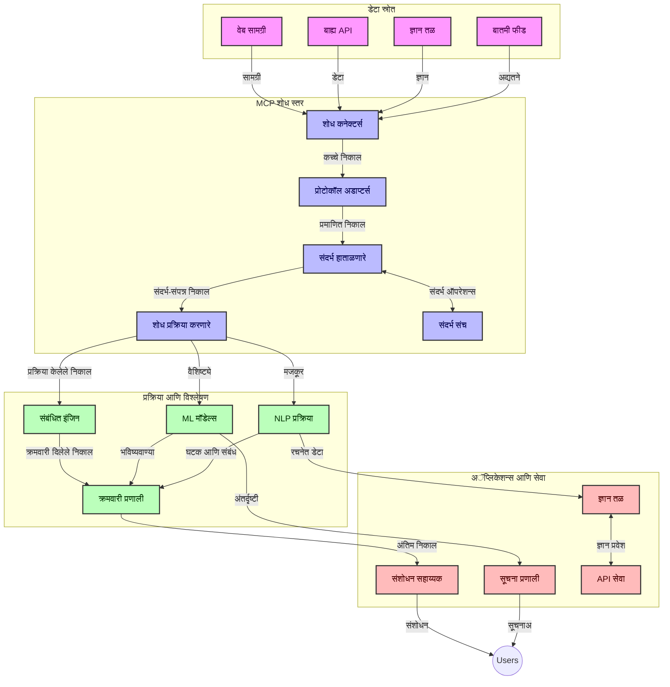
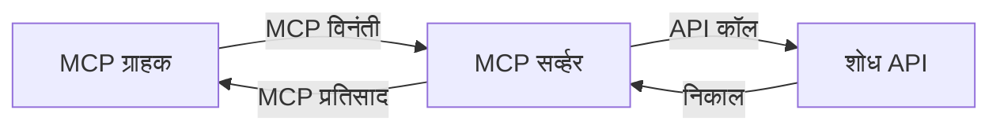
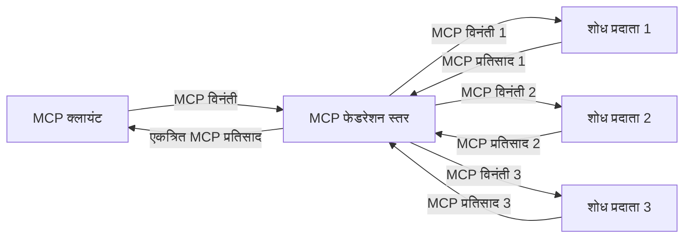
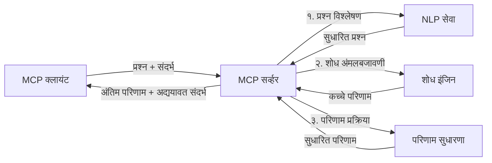

# रिअल-टाइम वेब शोधासाठी मॉडेल संदर्भ प्रोटोकॉल

## आढावा

आजच्या माहिती-चालित वातावरणात, जिथे अनुप्रयोगांना इंटरनेटवर अद्ययावत माहितीवर त्वरित प्रवेश आवश्यक आहे जेणेकरून संबंधित आणि समयोचित प्रतिसाद प्रदान करता येईल, तेथे रिअल-टाइम वेब शोध आवश्यक बनला आहे. मॉडेल संदर्भ प्रोटोकॉल (MCP) हे या रिअल-टाइम शोध प्रक्रियांना अधिक कार्यक्षम बनवण्यास महत्त्वपूर्ण प्रगती दर्शविते, शोधाची कार्यक्षमता वाढवत, संदर्भात्मक अखंडता राखत आणि एकूण प्रणालीची प्रदर्शन सुधारत आहे.

हा मॉड्यूल MCP कसे AI मॉडेल, शोध इंजन आणि अनुप्रयोगांमध्ये संदर्भ व्यवस्थापनासाठी प्रमाणित दृष्टिकोन प्रदान करून रिअल-टाइम वेब शोध रूपांतरित करतो हे तपासतो.

### तुम्हाला काय शिकायला मिळेल

या व्यापक मार्गदर्शकामध्ये तुम्हाला समजेल:

- MCP कसा AI मॉडेल्स आणि रिअल-टाइम वेब शोध क्षमतांमध्ये अखंड पुल तयार करतो
- MCP सह कार्यक्षम आणि प्रमाणानुसार शोध उपाय अंमलात आणण्याची स्थापत्य शिल्पे
- एकाधिक चौकशा आणि परस्परसंवादांमध्ये शोध संदर्भ जपण्यासाठी तंत्रे
- विविध शोध परिस्थितीसाठी Python आणि JavaScript मध्ये प्रत्यक्ष कोड अंमलबजावणी
- MCP-चालित शोध प्रणालींमध्ये सान्दर्भिकता, अलीकडेपणा आणि कार्यक्षमतेत संतुलन साधण्याच्या पद्धती

## रिअल-टाइम वेब शोधाची ओळख

रिअल-टाइम वेब शोध ही एक तांत्रिक पद्धत आहे जी वेब-आधारित माहिती सतत विचारपूस, प्रक्रिया आणि विश्लेषण करण्यास सक्षम करते, जसे ती प्रकाशित किंवा अद्ययावत केली जाते, ज्यामुळे प्रणालींना नूतन आणि संबंधित माहिती कमी विलंबात प्रदान करता येते. पारंपरिक शोध प्रणाल्यांपेक्षा भिन्न जे अनुक्रमित डेटावर चालतात जी तास किंवा दिवस जुनी असू शकते, रिअल-टाइम शोध वेबवरील थेट डेटा प्रक्रिया करतो, ऑनलाइन सामग्रीच्या वर्तमान स्थितीचा प्रतिबिंब असलेली अंतर्दृष्टी आणि माहिती प्रदर्शित करतो.

### रिअल-टाइम वेब शोधाची मुख्य संकल्पना:

- **सतत चौकशी प्रक्रिया**: शोध चौकशा सतत अद्ययावत होणाऱ्या डेटा स्रोतांविरुद्ध प्रक्रिया केल्या जातात
- **अलीकडेपणाला प्राधान्य**: प्रणाली ताजी माहिती प्राधान्य देण्यासाठी डिझाइन केल्या जातात
- **सान्दर्भिकतेचे संतुलन**: सान्दर्भिकता आणि अलीकडेपणा यांच्यात संतुलन राखणे
- **प्रमाणानुसार स्थापत्य**: प्रणालीमध्ये बदलत्या चौकशी भार आणि डेटा प्रमाण हाताळण्याची क्षमता असणे आवश्यक आहे
- **संदर्भात्मक समजूत**: शोध पुनरावृत्तींमध्ये वापरकर्ता संदर्भ राखणे महत्त्वाचे आहे ज्यामुळे अर्थपूर्ण परिणाम प्राप्त होतात
- **गतिक चौकशी पुनर्रचना**: संदर्भ आणि मागील निकालांच्या आधारावर चौकशा अनुक्रियात्मकपणे सुधारित करणे
- **बहु-स्रोत एकत्रीकरण**: विविध शोध प्रदाते आणि वेब स्रोतांच्या निकालांचे संयोजन करणे
- **सांकेतिक समजूत**: फक्त कीवर्ड नव्हे तर अर्थाच्या आधारावर चौकशी आणि सामग्री प्रक्रिया करणे
- **रिअल-टाइम रँकिंग**: नवीन माहिती उपलब्ध होताच परिणाम क्रम तरतरीत सातत्याने समायोजित करणे

### मॉडेल संदर्भ प्रोटोकॉल आणि रिअल-टाइम वेब शोध

मॉडेल संदर्भ प्रोटोकॉल (MCP) रिअल-टाइम वेब शोध वातावरणातील काही महत्त्वाच्या आव्हानांचा निराकरण करतो:

1. **शोध संदर्भ संरक्षण**: MCP, वितरीत शोध घटकांमध्ये संदर्भ कसा ठेवायचा यासाठी प्रमाणित पद्धत तयार करतो, ज्यामुळे AI मॉडेल्स आणि प्रक्रिया नोड्सना संबंधित चौकशी इतिहास आणि वापरकर्ता पसंतींवर प्रवेश मिळतो.

2. **कार्यक्षम चौकशी व्यवस्थापन**: संदर्भ प्रेषणासाठी संरचित यंत्रणा प्रदान करून, MCP प्रत्येक शोध पुनरावृत्तीत संदर्भाची पुनरावृत्ती होण्याचा ओव्हरहेड कमी करतो.

3. **परस्पर-सुसंगतता**: MCP विविध शोध तंत्रज्ञान आणि AI मॉडेल्स दरम्यान संदर्भ सामायिक करण्यासाठी एक सामान्य भाषा तयार करतो, ज्यामुळे अधिक लवचीक आणि विस्तारीत स्थापत्यशास्त्र शक्य होते.

4. **शोध-अनुकूल संदर्भ**: MCP अंमलबजावण्या कार्यक्षमता आणि अचूकतेसाठी प्रभावी शोधासाठी कोणते संदर्भ घटक सर्वाधिक संबंधित आहेत हे प्राधान्य देऊ शकतात.

5. **अनुकूली शोध प्रक्रिया**: MCP द्वारे योग्य संदर्भ व्यवस्थापनामुळे, शोध प्रणाली वापरकर्ता गरजा आणि माहितीच्या दृश्यमानतेनुसार गतिशीलपणे प्रक्रिया समायोजित करू शकतात.

वर्तमान अनुप्रयोगांमध्ये, जसे की बातमी संग्रहणापासून संशोधन सहाय्यकांपर्यंत, MCP आणि वेब शोध तंत्रज्ञानांच्या एकत्रिकरणामुळे अधिक बुद्धिमान, संदर्भ-जाणर शोध शक्य होतो जो वापरकर्ता परस्परसंवाद जसजसा चालू राहतो तसतसे अधिक संबंधित निकाल देऊ शकतो.

## शिक्षणाचे उद्दिष्ट

या धडेच्या शेवटी तुम्ही सक्षम असाल:

- रिअल-टाइम वेब शोधाचे मूलभूत तत्त्व आणि आधुनिक अनुप्रयोगांतील त्याच्या आव्हानांचे ज्ञान मिळवणे
- मॉडेल संदर्भ प्रोटोकॉल (MCP) कसा रिअल-टाइम वेब शोध क्षमता वाढवतो हे समजावून घेणे
- लोकप्रिय फ्रेमवर्क आणि API वापरून MCP-आधारित शोध उपाय अंमलात आणणे
- MCP सह प्रमाणानुसार, उच्च-कार्यक्षमता शोध स्थापत्यशास्त्र डिझाइन आणि तैनात करणे
- सांकेतिक शोध, संशोधन सहाय्य आणि AI-संपन्न ब्राउझिंगसह विविध वापर प्रकरणात MCP संकल्पना लागू करणे
- उदयोन्मुख प्रवाह आणि MCP-आधारित शोध तंत्रज्ञानातील भविष्यकालीन नवकल्पनांचे मूल्यांकन करणे
- वापरकर्ता परस्परसंवादापासून शिकणाऱ्या संदर्भ-जाणर शोध प्रणाली विकसित करणे
- प्रमाणित MCP प्रोटोकॉल वापरून AI सहाय्यकांमध्ये वेब शोध क्षमता एकत्रित करणे
- संदर्भ आधारावर प्रगत होणाऱ्या बहु-स्तरीय शोध पाईपलाइन्स तयार करणे
- व्यापक संदर्भ-जाणरता राखताना शोध कार्यक्षमता ऑप्टिमाइझ करणे

### व्याख्या आणि महत्त्व

रिअल-टाइम वेब शोध म्हणजे कमी विलंबासह वेब-आधारित माहितीचे सतत चौकशी, पुनर्प्राप्ती, आणि वितरण करणे. पारंपरिक शोध इंजिन जे वेबवरवेळीच्या वेळी क्रॉल आणि अनुक्रमित करतात, त्यांच्यापेक्षा वेगळे, रिअल-टाइम शोधची उद्दिष्टे आहे ती माहिती जशी उपलब्ध होते तशी समोर आणणे, ज्यामुळे सर्वात नवीन सामग्री तत्काळ उपलब्ध होते.

रिअल-टाइम वेब शोधाच्या प्रमुख वैशिष्ट्यांमध्ये आहेत:

- **ताजगी**: अलीकडील सामग्री आणि अद्ययावत माहितीला प्राधान्य देणे
- **सतत प्रक्रिया**: नवीन माहितीसाठी सातत्याने निरीक्षण करणे
- **चौकशी अनुकूलन**: संदर्भ आणि अभिप्रायाच्या आधारावर शोध चौकशी सुधारित करणे
- **तत्काळ वितरण**: शोध परिणाम कमी विलंबात प्रदान करणे
- **संदर्भ राखणी**: संबंधिततेसाठी पूर्वीच्या चौकशांवर आधार घेऊन तयार करणे

### पारंपरिक वेब शोधातील आव्हाने

पारंपरिक वेब शोध पद्धती रिअल-टाइम परिस्थितींमध्ये वापरल्यावर अनेक मर्यादा भेडसावतात:

1. **संदर्भ तुटवडा**: अनेक चौकशांमध्ये शोध संदर्भ राखण्यास असमर्थता
2. **माहितीची ताजगी**: सर्वात अलीकडील माहिती मिळवणे आणि तिला प्राधान्य देणे यामध्ये अडचणी
3. **एकत्रिकरण गुंतागुंत**: शोध प्रणाली आणि अनुप्रयोगांमधील परस्पर-सुसंगततेत अडथळे
4. **विलंब समस्या**: सविस्तर शोध आणि प्रतिसाद वेळेच्या गरजा यांच्यात संतुलन राखणे
5. **सान्दर्भिकता समायोजन**: अचूकता आणि सान्दर्भिकता कायम ठेवतानाच अलीकडेपणाला प्राधान्य देणे

## शोधासाठी मॉडेल संदर्भ प्रोटोकॉल (MCP) समजून घेणे

### शोध संदर्भांमध्ये MCP म्हणजे काय?

मॉडेल संदर्भ प्रोटोकॉल (MCP) हा एक प्रमाणित संवाद प्रोटोकॉल आहे जो AI मॉडेल्स आणि अनुप्रयोगांदरम्यान कार्यक्षम संवाद सक्षम करण्यासाठी तयार केला गेला आहे. रिअल-टाइम वेब शोधाच्या संदर्भात, MCP खालील फ्रेमवर्क प्रदान करतो:

- चौकशी अनुक्रमांमध्ये शोध संदर्भ जपणे
- शोध चौकशी आणि निकालांच्या स्वरूपाचे प्रमाणितीकरण
- शोध पॅरामीटर्स आणि निकालांच्या प्रसारणाचे ऑप्टिमायझेशन
- मॉडेल ते शोध इंजन संवाद सुधारित करणे

### मुख्य घटक आणि स्थापत्यशास्त्र

रिअल-टाइम वेब शोधासाठी MCP स्थापत्यशास्त्रात काही मुख्य घटक असतात:

1. **चौकशी संदर्भ हँडलर्स**: अनेक चौकशांमध्ये शोध संदर्भ व्यवस्थापित आणि राखतात
2. **शोध प्रक्रियाकर्ते**: संदर्भ-जाणर तंत्र वापरून येणाऱ्या शोध विनंत्या प्रक्रिया करतात
3. **प्रोटोकॉल अडॅप्टर्स**: वेगवेगळ्या शोध API दरम्यान संदर्भ राखून रूपांतर करतात
4. **संदर्भ साठा**: शोध इतिहास आणि पसंती संस्थीतरीत्या संग्रहित आणि पुनर्प्राप्त करतो
5. **शोध कनेक्टर्स**: विविध शोध इंजिन आणि वेब API शी कनेक्ट करतात



### MCP कसा रिअल-टाइम वेब शोध सुधारतो

MCP पारंपरिक वेब शोध आव्हाने या प्रकारे सोडवतो:

- **संदर्भात्मक अखंडता**: संपूर्ण शोध सत्रात चौकशांमधील नातेसंबंध राखणे
- **ऑप्टिमायझड प्रसारण**: बुद्धिमान संदर्भ व्यवस्थापनाद्वारे शोध पॅरामीटर्समधील पुनरावृत्ती कमी करणे
- **प्रमाणित इंटरफेस**: शोध घटकांसाठी सुसंगत API प्रदान करणे
- **विलंब कमी करणे**: कार्यक्षम संदर्भ हाताळणीमुळे प्रक्रिया अतिरिक्त कमी करणे
- **वाढलेली सान्दर्भिकता**: अनेक चौकशांमध्ये वापरकर्त्याच्या हेतू जपून शोध सान्दर्भिकता सुधारित करणे

## एकत्रिकरण आणि अंमलबजावणी

रिअल-टाइम वेब शोध प्रणालींना कार्यक्षमता आणि संदर्भ अखंडता राखण्यासाठी काळजीपूर्वक स्थापत्य डिझाइन आणि अंमलबजावणीची आवश्यकता असते. मॉडेल संदर्भ प्रोटोकॉल AI मॉडेल्स आणि शोध तंत्रज्ञानांचे प्रमाणित एकत्रिकरण उपलब्ध करून देतो, ज्यामुळे अधिक सुबक, संदर्भ-जाणर शोध पाईपलाइन तयार करता येतात.

### शोध स्थापत्यशास्त्रांमध्ये MCP चे एकत्रिकरण आढावा

रिअल-टाइम वेब शोध वातावरणात MCP अंमलात आणताना काही मुख्य गोष्टी लक्षात घेणे आवश्यक आहे:

1. **शोध संदर्भ सिरियलायझेशन**: MCP शोध विनंत्यांमध्ये संदर्भ माहिती कोडित करण्यासाठी कार्यक्षम यंत्रणा पुरवतो, ज्यामुळे आवश्यक संदर्भ चौकशी संपूर्ण प्रक्रियेत अनुसरतो. यात शोध-संबंधित मेटाडेटासाठी ऑप्टिमाइझ केलेले प्रमाणित सिरियलायझेशन फॉरमॅट्स समाविष्ट आहेत.

2. **राज्यपूर्ण शोध प्रक्रिया**: MCP अनुसरणीय संदर्भ प्रतिमा राखून अधिक बुद्धिमान राज्यपूर्ण प्रक्रिया सक्षम करतो. बहु-स्तरीय शोध पाईपलाइनमध्ये संदर्भ सुधारणा निकाल सुधारण्यात विशेष उपयुक्त आहे.

3. **चौकशी विस्तारीकरण आणि सुधारणा**: एकत्रित संदर्भाच्या आधारावर चौकशी विस्तार आणि सुधारणा करण्यासाठी MCP अंमलबजावणी शोध प्रणालींमध्ये सक्षम होऊ शकते, ज्यामुळे शोध सत्र प्रगत होताना अधिक सान्दर्भिक असे परिणाम मिळतात.

4. **निकाल कॅशिंग आणि प्राधान्यक्रम**: संदर्भ हाताळणी प्रमाणित करून, MCP निकाल कॅशिंग आणि प्राधान्यक्रम व्यवस्थापित करण्यात मदत करतो, ज्यामुळे घटक बदलत्या शोध संदर्भावर अनुकूल होऊ शकतात.

5. **शोध फेडरेशन आणि एकत्रीकरण**: MCP अनेक बॅकएंडवर शोध फेडरेट करण्यासाठी अधिक प्रगत यंत्रणा देतो, ज्यामुळे शोध संदर्भाच्या संरचित प्रतिमांचा वापर करून विविध स्रोतांमधून अधिक अर्थपूर्ण निकाल एकत्रित करता येतात.

विविध शोध तंत्रज्ञानांमध्ये MCP ची अंमलबजावणी संदर्भ व्यवस्थापनासाठी एकसंध दृष्टिकोन तयार करते, ज्यामुळे सानुकूल एकत्रिकरण कोडची गरज कमी होते आणि शोध चौकशा जसजशी प्रगत होतात तसतसे अर्थपूर्ण संदर्भ राखण्याची प्रणालीची क्षमता वाढते.

### विविध वेब शोध अंमलबजावणींमध्ये MCP

या उदाहरणांमध्ये सध्या MCP स्पेसिफिकेशनचा वापर केला आहे ज्यात JSON-RPC आधारित प्रोटोकॉल व वेगवेगळ्या ट्रान्सपोर्ट यंत्रणा आहेत. हे कोड तुम्हाला कस्टम शोध एकत्रिकरण कसे करायचे हे दाखवतो आणि पूर्णतः MCP प्रोटोकॉलशी सुसंगत राहतो.


<details>
<summary>सामान्य शोध API सह Python अंमलबजावणी</summary>

```python
import asyncio
import json
import aiohttp
from typing import Dict, Any, Optional, List
from contextlib import asynccontextmanager
from collections.abc import AsyncIterator

# स्टँडर्ड MCP लायब्ररी इंपोर्ट करा
from mcp.client.session import ClientSession
from mcp.client.streamable_http import streamablehttp_client
from mcp.types import TextContent, CreateMessageRequestParams, CreateMessageResult
from mcp.server.fastmcp import FastMCP

# वेब शोधासाठी FastMCP सर्व्हर तयार करा
search_server = FastMCP("WebSearch")

# वेब शोध ऑपरेशन्स हाताळण्यासाठी वर्ग
class WebSearchHandler:
    def __init__(self, api_endpoint: str, api_key: str):
        self.api_endpoint = api_endpoint
        self.api_key = api_key
        self.session = None
        
    async def initialize(self):
        """Initialize the HTTP session"""
        self.session = aiohttp.ClientSession(
            headers={"Authorization": f"Bearer {self.api_key}"}
        )
    
    async def close(self):
        """Close the HTTP session"""
        if self.session:
            await self.session.close()
            
    async def perform_search(self, query: str, max_results: int = 5, 
                           include_domains: List[str] = None, 
                           exclude_domains: List[str] = None,
                           time_period: str = "any") -> Dict[str, Any]:
        """Perform web search using the search API"""
        # शोध पॅरामीटर्स तयार करा
        search_params = {
            "q": query,
            "limit": max_results,
            "time": time_period
        }
        
        if include_domains:
            search_params["site"] = ",".join(include_domains)
            
        if exclude_domains:
            search_params["exclude_site"] = ",".join(exclude_domains)
        
        # शोध विनंती पार पाडा
        try:
            async with self.session.get(
                self.api_endpoint,
                params=search_params
            ) as response:
                if response.status != 200:
                    error_text = await response.text()
                    raise Exception(f"Search API error: {response.status} - {error_text}")
                
                search_data = await response.json()
                
                # एपीआय-विशिष्ट प्रतिसाद स्टँडर्ड स्वरूपात रूपांतरित करा
                results = []
                for item in search_data.get("results", []):
                    results.append({
                        "title": item.get("title", ""),
                        "url": item.get("url", ""),
                        "snippet": item.get("snippet", ""),
                        "date": item.get("published_date", ""),
                        "source": item.get("source", "")
                    })
                
                return {
                    "query": query,
                    "totalResults": len(results),
                    "results": results
                }
        except Exception as e:
            print(f"Search API request error: {e}")
            raise

# शोध हँडलर प्रारंभ करा
search_handler = WebSearchHandler(
    api_endpoint="https://api.search-service.example/search",
    api_key="your-api-key-here"
)

# शोध हँडलर व्यवस्थापीत करण्यासाठी lifespan सेट करा
@asyncio.asynccontextmanager
async def app_lifespan(server: FastMCP):
    """Manage application lifecycle"""
    await search_handler.initialize()
    try:
        yield {"search_handler": search_handler}
    finally:
        await search_handler.close()

# सर्व्हरसाठी lifespan सेट करा
search_server = FastMCP("WebSearch", lifespan=app_lifespan)

# वेब शोध टूल नोंदणी करा
@search_server.tool()
async def web_search(query: str, max_results: int = 5, 
                   include_domains: List[str] = None,
                   exclude_domains: List[str] = None,
                   time_period: str = "any") -> Dict[str, Any]:
    """
    Search the web for information
    
    Args:
        query: The search query
        max_results: Maximum number of results to return (default: 5)
        include_domains: List of domains to include in search results
        exclude_domains: List of domains to exclude from search results
        time_period: Time period for results ("day", "week", "month", "any")
        
    Returns:
        Dictionary containing search results
    """
    ctx = search_server.get_context()
    search_handler = ctx.request_context.lifespan_context["search_handler"]
    
    results = await search_handler.perform_search(
        query=query,
        max_results=max_results,
        include_domains=include_domains,
        exclude_domains=exclude_domains,
        time_period=time_period
    )
    
    return results

# उदाहरण क्लायंट वापर
async def client_example():
    # Streamable HTTP ट्रान्सपोर्ट वापरून शोध सर्व्हरशी कनेक्ट करा
    async with streamablehttp_client("http://localhost:8000/mcp") as (read, write, _):
        async with ClientSession(read, write) as session:
            # कनेक्शन प्रारंभ करा
            await session.initialize()
            
            # वेब_search टूल कॉल करा
            search_results = await session.call_tool(
                "web_search", 
                {
                    "query": "latest developments in AI and Model Context Protocol",
                    "max_results": 5,
                    "time_period": "day",
                    "include_domains": ["github.com", "microsoft.com"]
                }
            )
            
            print(f"Search results: {search_results}")

# सर्व्हर कार्यान्वयनाचे उदाहरण
if __name__ == "__main__":
    # Streamable HTTP ट्रान्सपोर्टसह सर्व्हर चालवा
    search_server.run(transport="streamable-http")
```
</details> 

<details>
<summary>ब्राउझर-आधारित शोधासह JavaScript अंमलबजावणी</summary>


```javascript
// वेब शोधासाठी MCP सर्व्हर अंमलबजावणी
import { McpServer, ResourceTemplate } from '@modelcontextprotocol/sdk/server/mcp.js';
import { StreamableHTTPServerTransport } from '@modelcontextprotocol/sdk/server/streamableHttp.js';
import { z } from 'zod';

// वेब शोधासाठी MCP सर्व्हर तयार करा
const searchServer = new McpServer({
    name: "BrowserSearch",
    description: "A server that provides web search capabilities"
});

// शोध सेवा वर्ग
class SearchService {
    constructor(searchApiUrl, apiKey) {
        this.searchApiUrl = searchApiUrl;
        this.apiKey = apiKey;
    }

    async performSearch(parameters) {
        const {
            query = '',
            maxResults = 5,
            includeDomains = [],
            excludeDomains = [],
            timePeriod = 'any'
        } = parameters;
        
        // पॅरामीटर्ससह शोध URL तयार करा
        const url = new URL(this.searchApiUrl);
        url.searchParams.append('q', query);
        url.searchParams.append('limit', maxResults);
        url.searchParams.append('time', timePeriod);
        
        if (includeDomains.length > 0) {
            url.searchParams.append('site', includeDomains.join(','));
        }
        
        if (excludeDomains.length > 0) {
            url.searchParams.append('exclude_site', excludeDomains.join(','));
        }
        
        try {
            const response = await fetch(url.toString(), {
                method: 'GET',
                headers: {
                    'Authorization': `Bearer ${this.apiKey}`,
                    'Content-Type': 'application/json'
                }
            });
            
            if (!response.ok) {
                const errorText = await response.text();
                throw new Error(`Search API error: ${response.status} - ${errorText}`);
            }
            
            const searchData = await response.json();
            
            // API-विशिष्ट प्रतिसादाचा सामान्य स्वरूपात रूपांतरण करा
            const results = searchData.results?.map(item => ({
                title: item.title || '',
                url: item.url || '',
                snippet: item.snippet || '',
                date: item.published_date || '',
                source: item.source || ''
            })) || [];
            
            return {
                query,
                totalResults: results.length,
                results
            };
        } catch (error) {
            console.error('Search API request error:', error);
            throw error;
        }
    }
}

// शोध सेवा प्रारंभ करा
const searchService = new SearchService(
    'https://api.search-service.example/search',
    'your-api-key-here'
);

// सर्व्हरसाठी संदर्भ प्रदाता सेटअप करा
searchServer.setContextProvider(() => {
    return {
        searchService
    };
});

// वेब शोध साधन नोंदणी करा
searchServer.tool({
    name: 'web_search',
    description: 'Search the web for information',
    parameters: {
        type: 'object',
        properties: {
            query: {
                type: 'string',
                description: 'The search query'
            },
            maxResults: {
                type: 'integer',
                description: 'Maximum number of results to return',
                default: 5
            },
            includeDomains: {
                type: 'array',
                items: { type: 'string' },
                description: 'List of domains to include in search results'
            },
            excludeDomains: {
                type: 'array',
                items: { type: 'string' },
                description: 'List of domains to exclude from search results'
            },
            timePeriod: {
                type: 'string',
                description: 'Time period for results',
                enum: ['day', 'week', 'month', 'any'],
                default: 'any'
            }
        },
        required: ['query']
    },
    handler: async (params, context) => {
        const { searchService } = context;
        return await searchService.performSearch(params);
    }
});

// शोध सर्व्हरशी जोडण्यासाठी उदाहरण क्लायंट कोड
import { Client } from '@modelcontextprotocol/sdk/client/index.js';
import { StreamableHTTPClientTransport } from '@modelcontextprotocol/sdk/client/streamableHttp.js';

async function connectToSearchServer() {
    // शोध सर्व्हरशी कनेक्ट करा
    const transport = new StreamableHTTPClientTransport(
        new URL('http://localhost:8000/mcp')
    );
    
    const client = new Client({
        name: 'search-client',
        version: '1.0.0'
    });
    
    await client.connect(transport);
    
    // शोध साधन कार्यान्वित करा
    const searchResults = await client.callTool({
        name: 'web_search',
        arguments: {
            query: 'Model Context Protocol implementation examples',
            maxResults: 10,
            timePeriod: 'week',
            includeDomains: ['github.com', 'docs.microsoft.com']
        }
    });
    
    console.log('Search results:', searchResults);
    
    // साफसफाई करा
    await client.disconnect();
}

// सर्व्हर सुरू करा
const transport = new StreamableHTTPServerTransport();
await searchServer.connect(transport);
console.log('Search server running at http://localhost:8000/mcp');

// वेगळ्या प्रक्रियेत किंवा सर्व्हर सुरू झाल्यानंतर
// connectToSearchServer().catch(console.error);
```
</details> 


## कोड उदाहरणांची जबाबदारी

> **महत्त्वाचा टिप**: खालील कोड उदाहरणे मॉडेल संदर्भ प्रोटोकॉल (MCP) चे वेब शोध कार्यक्षमतेसह एकत्रिकरण दर्शवतात. ते अधिकृत MCP SDK च्या नमुन्यांचे पालन करतात, परंतु शैक्षणिक उद्देशांसाठी सुलभ करण्यात आले आहेत.
> 
> ही उदाहरणे दाखवतात:
> 
> 1. **Python अंमलबजावणी**: FastMCP सर्व्हर अंमलबजावणी जी वेब शोध साधन पुरवते आणि बाह्य शोध API शी जोडते. हे उदाहरण योग्य आयुष्यकाल व्यवस्थापन, संदर्भ हाताळणी, आणि साधन अंमलबजावणी दाखवते ज्यात अधिकृत MCP Python SDK [https://github.com/modelcontextprotocol/python-sdk](https://github.com/modelcontextprotocol/python-sdk) च्या नमुन्यांचा वापर केला आहे. हा सर्व्हर शिफारस केलेला Streamable HTTP ट्रान्सपोर्ट वापरतो ज्याने जुन्या SSE ट्रान्सपोर्टची जागा घेतली आहे.
> 
> 2. **JavaScript अंमलबजावणी**: TypeScript/JavaScript अंमलबजावणी जी FastMCP नमुन्यापासून [https://github.com/modelcontextprotocol/typescript-sdk](https://github.com/modelcontextprotocol/typescript-sdk) अधिकृत MCP TypeScript SDK वापरून शोध सर्व्हर तयार करते ज्यात योग्य साधन व्याख्या आणि ग्राहक कनेक्शन्स आहेत. हे सत्र व्यवस्थापन आणि संदर्भ राखण्याच्या नवीनतम शिफारशींचे पालन करते.
> 
> हे उदाहरणे उत्पादन वापरासाठी अतिरिक्त त्रुटी हाताळणी, प्रमाणीकरण, आणि विशिष्ट API एकत्रिकरण कोडची आवश्यकता असू शकते. येथे दर्शविलेले शोध API एंडपॉईंट्स (`https://api.search-service.example/search`) हे प्लेसहोल्डर आहेत आणि खऱ्या शोध सेवा एंडपॉईंट्सने बदलणे आवश्यक आहे.
> 
> पूर्ण अंमलबजावणी तपशीलांसाठी आणि सर्वात अद्ययावत पद्धतींसाठी,
> कृपया [अधिकृत MCP तपशीलवार दस्तऐवज](https://modelcontextprotocol.io/specification/2026-07-28/)
> आणि SDK दस्तऐवज पहा.

## मुख्य संकल्पना

### मॉडेल संदर्भ प्रोटोकॉल (MCP) फ्रेमवर्क

त्याच्या पाया वर, मॉडेल संदर्भ प्रोटोकॉल AI मॉडेल्स, अनुप्रयोग आणि सेवा दरम्यान संदर्भ विनिमयासाठी प्रमाणित पद्धत प्रदान करतो. रिअल-टाइम वेब शोधात, हा फ्रेमवर्क सुसंगत, बहु-टर्न शोध अनुभव तयार करण्यासाठी आवश्यक आहे. प्रमुख घटकांमध्ये आहेत:

1. **ग्राहक-सर्व्हर स्थापत्यशास्त्र**: MCP शोध क्लायंट (विनंती करणारे) आणि शोध सर्व्हर (पुरवठादार) यांच्यात स्पष्ट विभाजन तयार करतो, ज्यामुळे लवचीक तैनाती मॉडेल शक्य होते.

2. **JSON-RPC संवाद**: प्रोटोकॉल संदेश देवाणघेवाणीसाठी JSON-RPC वापरतो, ज्यामुळे वेब तंत्रज्ञानांसोबत सुसंगत राहतो आणि विविध प्लॅटफॉर्मवर अंमलात आणणे सोपे होते.

3. **संदर्भ व्यवस्थापन**: MCP अनेक परस्परसंवादांमध्ये शोध संदर्भ राखण्यासाठी, अद्ययावत करण्यासाठी आणि वापरण्यासाठी संरचित पद्धती परिभाषित करतो.

4. **साधन व्याख्या**: शोध क्षमता प्रमाणित उपकरणांद्वारे परिपूर्ण केलेल्या पॅरामीटर्स आणि परताव्यांसह प्रदर्शित होतात.

5. **स्ट्रीमिंग समर्थन**: प्रोटोकॉल स्ट्रीमिंग निकालांना समर्थन देतो, जे रिअल-टाइम शोधासाठी आवश्यक आहे जिथे निकाल हळूहळू येऊ शकतात.

### वेब शोध एकत्रिकरण नमुने

MCP वेब शोधासह एकत्र करताना, काही नमुने दिसून येतात:

#### 1. थेट शोध प्रदाता एकत्रिकरण



या नमुन्यात MCP सर्व्हर थेट एक किंवा अधिक शोध API शी संपर्क करतो, MCP विनंत्या API-विशिष्ट कॉलमध्ये रूपांतरित करतो आणि निकाल MCP प्रतिसादांमध्ये फॉरमॅट करतो.

#### 2. संदर्भ संरक्षणासह फेडरेटेड शोध



हा नमुना अनेक MCP-योग्य शोध प्रदात्यांमध्ये चौकशी वाटप करतो, प्रत्येक वेगळ्या प्रकारच्या सामग्री किंवा शोध क्षमतांमध्ये विशेष असू शकतो, आणि एकसंध संदर्भ राखतो.

#### 3. संदर्भ-वाढवलेला शोध साखळी



या नमुन्यात, शोध प्रक्रिया अनेक टप्प्यांमध्ये विभागली जाते, प्रत्येक टप्प्यात संदर्भ श्रीमंत बनतो, ज्यामुळे हळूहळू अधिक सान्दर्भिक निकाल मिळतात.

### शोध संदर्भ घटक

MCP-आधारित वेब शोधात संदर्भ सहसा यामध्ये असतो:

- **चौकशीचा इतिहास**: सत्रातील मागील शोध चौकशी
- **वापरकर्ता पसंती**: भाषा, प्रदेश, सुरक्षित शोध सेटिंग्ज
- **परस्परसंवाद इतिहास**: कोणते निकाल क्लिक केले गेले, निकालांवर घालवलेला वेळ
- **शोध पॅरामीटर्स**: फिल्टर्स, क्रमवारी, आणि इतर शोध मॉडिफायर्स
- **डोमेन ज्ञान**: शोधासाठी विषय-संबंधित संदर्भ
- **कालात्मक संदर्भ**: वेळ-आधारित सान्दर्भिकता घटक
- **स्रोत पसंती**: विश्वासार्ह किंवा पसंतीच्या माहिती स्रोत

## वापर प्रकरणे आणि अनुप्रयोग

### संशोधन आणि माहिती संकलन

MCP संशोधन कार्यप्रवाह सुधारतो:

- शोध सत्रांमध्ये संशोधन संदर्भ जपून ठेवणे
- अधिक प्रगत आणि संदर्भानुसार संबंधित चौकशी सक्षम करणे
- बहु-स्रोत शोध फेडरेशन समर्थन
- शोध निकालांमधून ज्ञान काढण्यास मदत करणे

### रिअल-टाइम बातमी आणि ट्रेंड निरीक्षण

MCP-चालित शोध बातमी निरीक्षणासाठी फायदे प्रदान करतो:

- उदयोन्मुख बातमी कथा जवळजवळ रिअल-टाइम शोधणे
- संदर्भात्मकदृष्ट्या संबंधित माहिती फिल्टर करणे
- अनेक स्रोतांमधील विषय आणि घटक ट्रॅकिंग
- वापरकर्ता संदर्भावर आधारित वैयक्तिकृत बातमी सूचना

### AI-समृद्ध ब्राउझिंग आणि संशोधन

MCP AI-समृद्ध ब्राउझिंगसाठी नवीन संधी निर्माण करतो:

- चालू ब्राउझर क्रियाकलापावर आधारित संदर्भात्मक शोध सूचनां
- LLM-समर्थित सहाय्यकांसह वेब शोधाचे अखंड एकत्रीकरण
- राखलेल्या संदर्भासह बहु-टर्न शोध सुधारणा
- वाढलेली तथ्य तपासणी आणि माहिती सत्यापन

## भविष्यातील प्रवाह आणि नवकल्पना

### वेब शोधातील MCP चा विकास

पुढील काळात, आम्ही अपेक्षा करतो की MCP खालील मुद्दे सोडवेल:


- **मल्टीमोडल शोध**: मजकूर, प्रतिमा, आवाज आणि व्हिडिओ शोध यांचे एकत्रीकरण जतन केलेल्या संदर्भासह
- **विकेंद्रीकृत शोध**: वितरित आणि फेडरेटेड शोध परिसंस्था समर्थन
- **शोध गोपनीयता**: संदर्भ-जाणणारे गोपनीयता-संरक्षित शोध यंत्रणा
- **प्रश्न समजणे**: नैसर्गिक भाषा शोध प्रश्नांचे सखोल सांगीतिक विश्लेषण

### तंत्रज्ञानातील संभाव्य प्रगती

उदयोन्मुख तंत्रज्ञान जे MCP शोधाच्या भविष्याकृती घडवतील:

1. **न्यूरल शोध आर्किटेक्चर**: MCP साठी अनुकूल केलेले एम्बेडिंग-आधारित शोध प्रणाली
2. **वैयक्तिकृत शोध संदर्भ**: कालांतराने वैयक्तिक वापरकर्ता शोध नमुने शिकणे
3. **ज्ञान ग्राफ एकत्रीकरण**: विभाग-विशिष्ट ज्ञान ग्राफ द्वारे संदर्भ वाढवलेला शोध
4. **क्रॉस-मोडल संदर्भ**: वेगवेगळ्या शोध प्रकारांमध्ये संदर्भ राखणे

## प्रायोगिक सराव

### सराव 1: एक मूलभूत MCP शोध पाईपलाईन सेट करणे

या सरावात आपण शिकाल कसे:
- एक मूलभूत MCP शोध वातावरण संरचीत करायचे
- वेब शोधासाठी संदर्भ हँडलर अंमलात आणायचे
- शोध पुनरावृत्त्यांदरम्यान संदर्भ जतन होतो का हे तपासणे आणि प्रमाणीकरण करणे

### सराव 2: MCP शोधासह एक संशोधन सहाय्यक तयार करणे

एक संपूर्ण अनुप्रयोग तयार करा जो:
- नैसर्गिक भाषा संशोधन प्रश्न प्रक्रिया करतो
- संदर्भ-संवेदनशील वेब शोध करतो
- अनेक स्रोतांकडून माहिती एकत्र करतो
- संघटित संशोधन निष्कर्ष सादर करतो

### सराव 3: MCP सह बहु-स्रोत शोध महासंघ अंमलात आणणे

प्रगत सराव ज्यामध्ये:
- संदर्भ-जाणणारी प्रश्न पाठवणी अनेक शोध इंजिनांना
- निकाल रँकिंग आणि एकत्रिकरण
- संदर्भानुसार शोध परिणामांची पुनरावृत्ती टाळणे
- स्रोत-विशिष्ट मेटाडेटा हाताळणे

## अतिरिक्त स्त्रोत

- [Model Context Protocol Specification](https://modelcontextprotocol.io/specification/2026-07-28/) - अधिकृत MCP तपशील आणि प्रोटोकॉल दस्तऐवज
- [Model Context Protocol Documentation](https://modelcontextprotocol.io/) - सखोल ट्यूटोरियल्स आणि अंमलबजावणी मार्गदर्शक
- [MCP Python SDK](https://github.com/modelcontextprotocol/python-sdk) - MCP प्रोटोकॉलचा अधिकृत Python अंमलबजावणी
- [MCP TypeScript SDK](https://github.com/modelcontextprotocol/typescript-sdk) - MCP प्रोटोकॉलची अधिकृत TypeScript अंमलबजावणी
- [MCP Reference Servers](https://github.com/modelcontextprotocol/servers) - MCP सर्व्हरचे संदर्भ अंमलबजावणी
- [Bing Web Search API Documentation](https://learn.microsoft.com/en-us/bing/search-apis/bing-web-search/overview) - मायक्रोसॉफ्टचे वेब शोध API
- [Google Custom Search JSON API](https://developers.google.com/custom-search/v1/overview) - गुगलचे प्रोग्रामेबल शोध इंजिन
- [SerpAPI Documentation](https://serpapi.com/search-api) - शोध इंजिन निकाल पृष्ठ API
- [Meilisearch Documentation](https://www.meilisearch.com/docs) - ओपन-सोर्स शोध इंजिन
- [Elasticsearch Documentation](https://www.elastic.co/guide/index.html) - वितरीत शोध आणि विश्लेषण इंजिन
- [LangChain Documentation](https://python.langchain.com/docs/get_started/introduction) - LLMs सह अनुप्रयोग तयार करणे

## शिकण्याचे परिणाम

हा मॉड्यूल पूर्ण केल्यावर, तुम्ही सक्षम असाल:

- रिअल-टाइम वेब शोधाच्या मूलभूत तत्त्वांनाही त्याच्या अडचणी समजून घेणे
- Model Context Protocol (MCP) कसे रिअल-टाइम वेब शोध क्षमतांना वाढवते हे स्पष्ट करणे
- लोकप्रिय फ्रेमवर्क आणि API वापरून MCP-आधारित शोध उपाय अंमलात आणणे
- MCP सह स्केलेबल, उच्च-कार्यक्षम शोध आर्किटेक्चर डिझाइन आणि तैनात करणे
- MCP संकल्पना वेगवेगळ्या उपयोग केसेससाठी लागू करणे जसे की सांगीतिक शोध, संशोधन सहाय्य, आणि AI-संपादित ब्राउझिंग
- एमसीपी-आधारित शोध तंत्रज्ञानातील उदयोन्मुख प्रवाह आणि भविष्यकालीन नवोन्मेषांचे मूल्यमापन करणे


### विश्वास आणि सुरक्षितता विचार

MCP-आधारित वेब शोध उपाय अंमलात आणताना, MCP तपशीलातील या महत्वाच्या तत्त्वांची आठवण ठेवा:

1. **वापरकर्ता संमती आणि नियंत्रण**: वापरकर्त्यांनी सर्व डेटा प्रवेश आणि क्रिया स्पष्टपणे मान्य कराव्या आणि समजाव्या. हे विशेषत: वेब शोधासाठी महत्त्वाचे आहे ज्यात बाह्य डेटा स्रोत वापरले जाऊ शकतात.

2. **डेटा गोपनीयता**: शोध प्रश्न आणि निकाल योग्य प्रकारे हाताळा, विशेषत: जेव्हा त्यात संवेदनशील माहिती असू शकते. वापरकर्ता डेटा संरक्षणासाठी योग्य प्रवेश नियंत्रण लागू करा.

3. **साधन सुरक्षा**: योग्य अधिकृतता आणि प्रमाणीकरण लागू करा कारण शोध साधने आरbitrarily कोड अंमलबजावणीमुळे सुरक्षेच्या धोका असू शकतात. साधनाचा वर्तन वर्णन अविश्वसनीय मानले जाऊ शकते जोपर्यंत ते विश्वसनीय सर्व्हरकडून आलेले नसते.

4. **स्पष्ट दस्तऐवज**: तुमच्या MCP-आधारित शोध अंमलबजावणीच्या क्षमता, मर्यादा आणि सुरक्षा विचारांची स्पष्ट दस्तऐवजीकरण द्या, MCP तपशीलातील अंमलबजावणी मार्गदर्शकांचे अनुसरण करून.

5. **मजबूत संमती प्रवाह**: तुम्ही मजबूत संमती आणि अधिकृतता प्रवाह तयार करा जे प्रत्येक साधन काय करते हे स्पष्टपणे समजावतात, विशेषत: जेव्हा ते बाह्य वेब स्रोतांशी संवाद साधतात.

MCP सुरक्षा आणि विश्वास विचारांवर सर्व तपशीलांसाठी, कृपया पहा
[अधिकृत दस्तऐवज](https://modelcontextprotocol.io/specification/2026-07-28/basic/security_best_practices).

## पुढे काय

- [5.12 Entra ID Authentication for Model Context Protocol Servers](../mcp-security-entra/README.md)

---

<!-- CO-OP TRANSLATOR DISCLAIMER START -->
**अस्वीकरण**:
हा दस्तऐवज AI भाषांतर सेवा [Co-op Translator](https://github.com/Azure/co-op-translator) चा वापर करून अनुवादित केला आहे. जरी आम्ही अचूकतेसाठी प्रयत्न करतो, तरी कृपया लक्षात घ्या की स्वयंचलित भाषांतरांमध्ये त्रुटी किंवा अचूकतेची कमतरता असू शकते. मूळ दस्तऐवज त्याच्या मूळ भाषेत अधिकृत स्रोत मानला पाहिजे. महत्त्वाची माहिती असल्यास, व्यावसायिक मानवी भाषांतराची शिफारस केली जाते. या भाषांतराच्या वापरामुळे उद्भवणाऱ्या कोणत्याही गैरसमज किंवा चुकीच्या अर्थलावणीसाठी आम्ही जबाबदार नाही.
<!-- CO-OP TRANSLATOR DISCLAIMER END -->