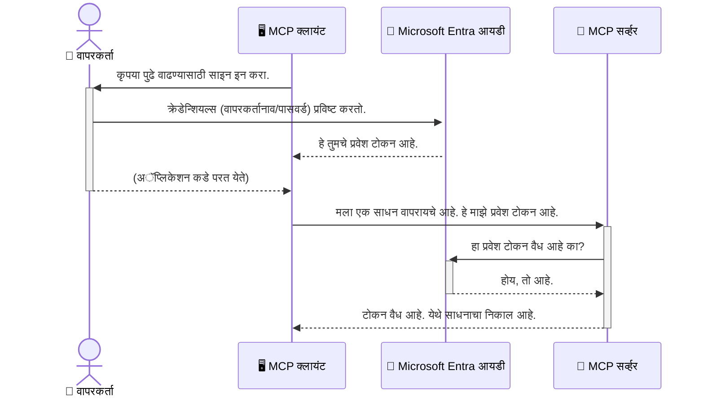

# AI वर्कफ्लो सुरक्षित करणे: मॉडेल कॉन्टेक्स्ट प्रोटोकॉल सर्व्हरसाठी एंत्रा आयडी प्रमाणीकरण

> [!NOTE]
> या धड्यातील रिमोट सर्व्हर कोड वारसाहक्क `/sse` आणि `/message`
> एन्डपॉइंट्सचा संरक्षण करतो आणि MCP `2025-11-25` ला लक्ष्य करतो. त्याची ओळख आणि टोकन-चाचणी
> पद्धती ठेवा, पण नवीन अंमलबजावणीसाठी `2026-07-28`-सुसंगत स्ट्रीमएबल HTTP ट्रान्सपोर्ट वापरा.


## परिचय
तुमचा मॉडेल कॉन्टेक्स्ट प्रोटोकॉल (MCP) सर्व्हर सुरक्षित करणे आपल्या घराच्या मुख्य दरवाजाला लॉक करण्याएवढे महत्त्वाचे आहे. तुमचा MCP सर्व्हर उघडा ठेवणे म्हणजे तुमची उपकरणे आणि डेटा अनधिकृत प्रवेशासाठी उघडे करणे, जे सुरक्षा भंगास कारणीभूत ठरू शकते. मायक्रोसॉफ्ट एंत्रा आयडी एक मजबूत क्लाउड-आधारित ओळख व प्रवेश व्यवस्थापन उपाय प्रदान करतो, जो फक्त अधिकृत वापरकर्ते आणि अनुप्रयोगच तुमच्या MCP सर्व्हरशी संवाद साधू शकतील याची खात्री करतो. या विभागात, आपण एंत्रा आयडी प्रमाणीकरण वापरून आपल्या AI वर्कफ्लो कसे सुरक्षित करायचे ते शिकाल.

## शिकण्याचे उद्दिष्टे
या विभागाच्या शेवटी, आपण खालील गोष्टी करता येतील:

- MCP सर्व्हर सुरक्षित करण्याचे महत्त्व समजून घेणे.
- मायक्रोसॉफ्ट एंत्रा आयडी आणि OAuth 2.0 प्रमाणीकरणाचे प्राथमिकतत्त्व समजावून सांगणे.
- सार्वजनिक आणि गोपनीय क्लायंटमधील फरक ओळखणे.
- स्थानिक (सार्वजनिक क्लायंट) आणि रिमोट (गोपनीय क्लायंट) MCP सर्व्हर परिस्थितींमध्ये एंत्रा आयडी प्रमाणीकरण राबविणे.
- AI वर्कफ्लो विकसित करताना सुरक्षा सर्वोत्तम पद्धती लागू करणे.

## सुरक्षा आणि MCP

जसे तुम्ही तुमच्या घराचा मुख्य दरवाजा अनलॉक्ड ठेवणार नाही, तसेच तुमचा MCP सर्व्हर कोणालाही प्रवेशासाठी उघडा ठेवू नका. तुमचे AI वर्कफ्लो सुरक्षित करणे म्हणजे मजबूत, विश्वसनीय, आणि सुरक्षित अनुप्रयोग तयार करणे आवश्यक आहे. हा अध्याय तुम्हाला मायक्रोसॉफ्ट एंत्रा आयडी वापरून तुमचे MCP सर्व्हर सुरक्षित करण्याबाबत परिचय देईल, ज्यामुळे फक्त अधिकृत वापरकर्ते आणि अनुप्रयोगच तुमच्या उपकरणे आणि डेटा वापरू शकतील.

## MCP सर्व्हरसाठी सुरक्षा का महत्त्वाची आहे

समजा तुमच्या MCP सर्व्हरवर एक साधन आहे जे ईमेल पाठवू शकते किंवा ग्राहक डेटाबेसमध्ये प्रवेश करू शकते. एक असुरक्षित सर्व्हर म्हणजे प्रत्येकजण तो साधन वापरू शकतो, ज्यामुळे अनधिकृत डेटापर्यंत प्रवेश, स्पॅम, किंवा इतर घातक क्रिया होऊ शकतात.

प्रमाणीकरण राबवून, तुम्ही सर्व्हरला केलेल्या प्रत्येक विनंतीची खात्री करता, ज्यामुळे विनंती करणाऱ्या वापरकर्त्याची किंवा अनुप्रयोगाची ओळख सत्यापित होते. हा तुमच्या AI वर्कफ्लो सुरक्षित करण्याचा पहिला आणि सर्वात महत्त्वाचा टप्पा आहे.

## मायक्रोसॉफ्ट एंत्रा आयडी परिचय

[**मायक्रोसॉफ्ट एंत्रा आयडी**](https://adoption.microsoft.com/microsoft-security/entra/) ही एक क्लाउड-आधारित ओळख आणि प्रवेश व्यवस्थापन सेवा आहे. याला तुमच्या अनुप्रयोगांसाठी एक सार्वत्रिक सुरक्षा रक्षक समजा. हे वापरकर्त्यांच्या ओळखीची तपासणी (प्रमाणीकरण) आणि त्यांना काय करता येऊ शकते ते ठरविण्याची (परवानगी) गुंतागुंतीची प्रक्रिया हाताळते.

एंत्रा आयडी वापरल्याने तुम्ही:

- वापरकर्त्यांसाठी सुरक्षित साइन-इन सक्षम करू शकता.
- API आणि सेवा संरक्षित करू शकता.
- केंद्रीकृत ठिकाणाहून प्रवेश धोरणे व्यवस्थापित करू शकता.

MCP सर्व्हरसाठी, एंत्रा आयडी एक मजबूत आणि विश्वासार्ह उपाय प्रदान करतो ज्याद्वारे कोण तुमच्या सर्व्हरच्या क्षमता वापरू शकतो ते नियंत्रित केले जाते.

---

## जादू समजून घेणे: एंत्रा आयडी प्रमाणीकरण कसे कार्य करते

एंत्रा आयडी प्रमाणीकरण हाताळण्यासाठी **OAuth 2.0** सारख्या खुल्या मानकांचा वापर करतो. तपशील काहीसे गुंतागुंतीचे असू शकतात, पण मुख्य कल्पना साधी आहे आणि ही तत्त्वज्ञानी कथनाद्वारे समजून घेता येते.

### OAuth 2.0 चे सौम्य परिचय: व्हॅलेट की

OAuth 2.0 ला समजा तुमच्या कारसाठी एक व्हॅलेट सेवा म्हणून. जेव्हा तुम्ही एखाद्या रेस्टॉरंटमध्ये जाता, तेव्हा तुम्ही व्हॅलेटला तुमची मास्टर की देत नाही. त्याऐवजी तुम्ही एक **व्हॅलेट की** देता ज्यात मर्यादित परवानग्या असतात—ती कार सुरू करू शकते आणि दरवाजे लॉक करू शकते, पण ट्रंक किंवा ग्लोव्ह कंपार्टमेंट उघडू शकत नाही.

या तत्त्वज्ञानी मध्ये:

- **तुम्ही** आहात **वापरकर्ता**.
- **तुमची कार** ही **MCP सर्व्हर** आहे ज्यामध्ये महत्त्वाची उपकरणे आणि डेटा आहे.
- **व्हॅलेट** म्हणजे **मायक्रोसॉफ्ट एंत्रा आयडी**.
- **पार्किंग अटेंडंट** म्हणजे **MCP क्लायंट** (सर्व्हरशी संपर्क साधण्याचा प्रयत्न करणारा अनुप्रयोग).
- **व्हॅलेट की** म्हणजे **प्रवेश टोकन**.

प्रवेश टोकन हे सुरक्षित मजकूर असून, जे MCP क्लायंट ने एंत्रा आयडी कडून साइन-इन केल्यावर प्राप्त केलेले असते. क्लायंट या टोकनसह MCP सर्व्हरला प्रत्येक विनंतीस सादर करतो. सर्व्हर हा टोकन तपासू शकतो ज्यामुळे विनंती वैध आहे आणि क्लायंटकडे आवश्यक परवानग्या आहेत हे सुनिश्चित होते, आणि तुमचे खरे क्रेडेन्शियल्स (जसे की पासवर्ड) हाताळण्याची गरज नसते.

### प्रमाणीकरण प्रवाह

येथे व्यवहारात प्रक्रिया कशी कार्य करते:



### मायक्रोसॉफ्ट ऑथेंटिकेशन लायब्ररीचे (MSAL) परिचय

कोडमध्ये खोल जाण्याआधी, उदाहरणांमध्ये दिसणारी एक महत्त्वाची घटक म्हणजे **मायक्रोसॉफ्ट ऑथेंटिकेशन लायब्ररी (MSAL)**.

MSAL ही मायक्रोसॉफ्टने विकसित केलेली लायब्ररी आहे जी विकासकांसाठी प्रमाणीकरण हाताळणे अत्यंत सोपे बनवते. तुम्हाला सर्व सुरक्षा टोकन्स हाताळण्यासाठी, साइन-इन्स व्यवस्थापित करण्यासाठी आणि सत्र रिफ्रेश करण्यासाठी गुंतागुंतीचा कोड लिहायचा नाही, MSAL हे सर्व काम सहजपणे पार पाडते.

MSAL वापरणे अत्यंत शिफारसीय आहे कारण:

- **हे सुरक्षित आहे:** उद्योग-मानक प्रोटोकॉल आणि सुरक्षा सर्वोत्तम पद्धती लागू करते, ज्यामुळे तुमच्या कोडमधील कमकुवतपणा धोका कमी होतो.
- **हे विकास सुलभ करते:** OAuth 2.0 आणि OpenID कनेक्ट प्रोटोकॉलचा गोंधळ दूर करते, ज्यामुळे काही ओळी कोडने तुमच्या अनुप्रयोगात मजबूत प्रमाणीकरण जोडू शकता.
- **हे देखभाल केले जाते:** मायक्रोसॉफ्ट MSAL ला सक्रियपणे अपडेट व देखभाल करतो जेणेकरून नवीन सुरक्षा धोके आणि प्लॅटफॉर्म बदल हाताळता येतील.

MSAL विविध भाषा आणि अनुप्रयोग फ्रेमवर्क्सना समर्थन देतो, जसे की .NET, JavaScript/TypeScript, Python, Java, Go, आणि मोबाइल प्लॅटफॉर्म्स iOS व Android. याचा अर्थ तुमचा एकसारखा प्रमाणीकरण पद्धत संपूर्ण तंत्रज्ञान स्टॅकमध्ये वापरू शकता.

MSAL बद्दल अधिक जाणून घेण्यासाठी, तुम्ही अधिकृत [MSAL आढावा दस्तऐवज](https://learn.microsoft.com/entra/identity-platform/msal-overview) पाहू शकता.

---

## एंत्रा आयडीसह तुमचा MCP सर्व्हर सुरक्षित करणे: पायऱ्यांनी मार्गदर्शन

आता, आपण स्थानिक MCP सर्व्हर (जो `stdio` वरून संवाद करतो) एंत्रा आयडी वापरून कसा सुरक्षित करायचा ते पाहू. या उदाहरणात **सार्वजनिक क्लायंट** वापरला आहे, जो वापरकर्त्याच्या संगणकावर चालणार्‍या अनुप्रयोगांसाठी योग्य आहे, जसे की डेस्कटॉप अ‍ॅप किंवा स्थानिक विकास सर्व्हर.

### परिदृश्य 1: स्थानिक MCP सर्व्हर सुरक्षित करणे (सार्वजनिक क्लायंटसह)

या परिदृश्यात, आपण असा MCP सर्व्हर पाहणार आहोत जो स्थानिकपणे चालतो, `stdio` वर संवाद साधतो, आणि वापरकर्ता प्रमाणीकरणासाठी एंत्रा आयडी वापरतो. सर्व्हरवर एक साधन असेल जे वापरकर्त्याची प्रोफाइल माहिती मायक्रोसॉफ्ट ग्राफ API कडून आणते.

#### 1. एंत्रा आयडीमध्ये अनुप्रयोग सेटअप करणे

कोड लिहिण्यापूर्वी, तुम्हाला तुमचा अनुप्रयोग मायक्रोसॉफ्ट एंत्रा आयडी मध्ये नोंदणी करावा लागेल. हे एंत्रा आयडीला तुमच्या अनुप्रयोगाची माहिती देते आणि त्याला प्रमाणीकरण सेवा वापरण्यास परवानगी मिळते.

1. **[Microsoft Entra पोर्टल](https://entra.microsoft.com/)** वर जा.
2. **App registrations** मध्ये जा आणि **New registration** क्लिक करा.
3. तुमच्या अनुप्रयोगाला नाव द्या (उदा., "माझा स्थानिक MCP सर्व्हर").
4. **Supported account types** मध्ये **Accounts in this organizational directory only** निवडा.
5. या उदाहरणासाठी **Redirect URI** रिक्त ठेऊ शकता.
6. **Register** क्लिक करा.

एकदा नोंदणी झाल्यावर, **Application (client) ID** आणि **Directory (tenant) ID** टोकाची नोंद ठेवा. तुम्हाला त्यांची कोडमध्ये गरज पडेल.

#### 2. कोड: एक विहंगावलोकन

प्रमाणीकरण हाताळणाऱ्या कोडचे मुख्य भाग पाहूया. या उदाहरणाचा पूर्ण कोड [Entra ID - Local - WAM](https://github.com/Azure-Samples/mcp-auth-servers/tree/main/src/entra-id-local-wam) फोल्डरमध्ये [mcp-auth-servers GitHub रेपॉझिटरी](https://github.com/Azure-Samples/mcp-auth-servers) मध्ये उपलब्ध आहे.

**`AuthenticationService.cs`**

हा वर्ग एंत्रा आयडीशी संवादासाठी जबाबदार आहे.

- **`CreateAsync`**: हा पद्धत MSAL (मायक्रोसॉफ्ट ऑथेंटिकेशन लायब्रेरी) मधून `PublicClientApplication` प्रारंभ करतो. तो तुमच्या अनुप्रयोगाचा `clientId` आणि `tenantId` करत सानुकूलित असतो.
- **`WithBroker`**: विंडोज वेब अकाउंट मॅनेजरसारखा ब्रोकर वापरण्यास सक्षम करतो, जो अधिक सुरक्षित आणि अखंडित सिंगल साइन-ऑन अनुभव देते.
- **`AcquireTokenAsync`**: हा मुख्य पद्धत आहे. सुरुवातीला तो गुप्तपणे टोकन मिळवण्याचा प्रयत्न करतो (जर सत्र वैध असेल तर वापरकर्त्याला पुन्हा साइन-इन करायची गरज नाही). जर गुप्त टोकन न मिळाले तर वापरकर्त्याला साइन-इनसाठी इंटरअॅक्टिव्हप्रमाणे विनंती करते.

```csharp
// Simplified for clarity
public static async Task<AuthenticationService> CreateAsync(ILogger<AuthenticationService> logger)
{
    var msalClient = PublicClientApplicationBuilder
        .Create(_clientId) // Your Application (client) ID
        .WithAuthority(AadAuthorityAudience.AzureAdMyOrg)
        .WithTenantId(_tenantId) // Your Directory (tenant) ID
        .WithBroker(new BrokerOptions(BrokerOptions.OperatingSystems.Windows))
        .Build();

    // ... cache registration ...

    return new AuthenticationService(logger, msalClient);
}

public async Task<string> AcquireTokenAsync()
{
    try
    {
        // Try silent authentication first
        var accounts = await _msalClient.GetAccountsAsync();
        var account = accounts.FirstOrDefault();

        AuthenticationResult? result = null;

        if (account != null)
        {
            result = await _msalClient.AcquireTokenSilent(_scopes, account).ExecuteAsync();
        }
        else
        {
            // If no account, or silent fails, go interactive
            result = await _msalClient.AcquireTokenInteractive(_scopes).ExecuteAsync();
        }

        return result.AccessToken;
    }
    catch (Exception ex)
    {
        _logger.LogError(ex, "An error occurred while acquiring the token.");
        throw; // Optionally rethrow the exception for higher-level handling
    }
}
```

**`Program.cs`**

येथे MCP सर्व्हर सेटअप केला जातो आणि प्रमाणीकरण सेवा एकत्रित केली जाते.

- **`AddSingleton<AuthenticationService>`**: या मेथडने `AuthenticationService` ला डिपेंडन्सी इंजेक्शन कंटेनरमध्ये नोंदणी केली जाते, ज्यामुळे अनुप्रयोगाच्या इतर भागांमध्ये (उदा., आपल्या साधनात) वापरता येते.
- **`GetUserDetailsFromGraph` साधन**: या साधनाला `AuthenticationService` ची उदाहरण आवश्यक आहे. काहीही करण्याआधी, ते `authService.AcquireTokenAsync()` कॉल करते जेणेकरून वैध प्रवेश टोकन मिळवता येईल. प्रमाणीकरण यशस्वी झाल्यास, ते टोकन वापरून मायक्रोसॉफ्ट ग्राफ API कॉल करतो आणि वापरकर्त्याची माहिती आणते.

```csharp
// Simplified for clarity
[McpServerTool(Name = "GetUserDetailsFromGraph")]
public static async Task<string> GetUserDetailsFromGraph(
    AuthenticationService authService)
{
    try
    {
        // This will trigger the authentication flow
        var accessToken = await authService.AcquireTokenAsync();

        // Use the token to create a GraphServiceClient
        var graphClient = new GraphServiceClient(
            new BaseBearerTokenAuthenticationProvider(new TokenProvider(authService)));

        var user = await graphClient.Me.GetAsync();

        return System.Text.Json.JsonSerializer.Serialize(user);
    }
    catch (Exception ex)
    {
        return $"Error: {ex.Message}";
    }
}
```

#### 3. सर्व काही एकत्र कसे काम करते

1. जेव्हा MCP क्लायंट `GetUserDetailsFromGraph` साधन वापरायचा प्रयत्न करतो, तेव्हा साधन प्रथम `AcquireTokenAsync` कॉल करते.
2. `AcquireTokenAsync` MSAL लायब्ररीला वैध टोकन तपासण्यास सांगते.
3. जर टोकन सापडला नाही, तर MSAL ने ब्रोकरद्वारे वापरकर्त्याला एंत्रा आयडी खात्याने साइन-इन करण्यास विनंती केली जाते.
4. वापरकर्त्याने साइन-इन केल्यावर, एंत्रा आयडी प्रवेश टोकन जारी करते.
5. साधन टोकन प्राप्त करते आणि त्याचा वापर करून मायक्रोसॉफ्ट ग्राफ API ला सुरक्षित कॉल करते.
6. वापरकर्त्याची माहिती MCP क्लायंटकडे परत मिळते.

ही प्रक्रिया फक्त प्रमाणीकरण केलेले वापरकर्ते साधन वापरू शकतील याची खात्री करते, ज्यामुळे तुमचा स्थानिक MCP सर्व्हर प्रभावीपणे सुरक्षित होतो.

### परिदृश्य 2: दूरस्थ MCP सर्व्हर सुरक्षित करणे (गोपनीय क्लायंटसह)

जेव्हा तुमचा MCP सर्व्हर दूरस्थ मशीनवर (जसे की क्लाउड सर्व्हर) चालतो आणि HTTP स्ट्रीमिंग सारख्या प्रोटोकॉलवर संवाद करतो, तेव्हा सुरक्षा गरजा वेगळ्या असतात. अशा परिस्थितीत, तुम्हाला **गोपनीय क्लायंट** आणि **Authorization Code Flow** वापरायचा आहे. ही अधिक सुरक्षित पद्धत आहे कारण अनुप्रयोगाचे गुपित ब्राउझरला कधीही प्रकट होत नाही.

या उदाहरणात TypeScript आधारित MCP सर्व्हर वापरले आहे जो Express.js वापरून HTTP विनंत्या हाताळतो.

#### 1. एंत्रा आयडीमध्ये अनुप्रयोग सेटअप करणे

एंत्रा आयडीमध्ये सेटअप सार्वजनिक क्लायंटसारखेच आहे, पण एक महत्त्वाचा फरक म्हणजे तुम्हाला **क्लायंट गुपित** तयार करावे लागते.

1. **[Microsoft Entra पोर्टल](https://entra.microsoft.com/)** वर जा.
2. तुमच्या अ‍ॅप नोंदीत, **Certificates & secrets** टॅब मध्ये जा.
3. **New client secret** क्लिक करा, वर्णन द्या, आणि **Add** क्लिक करा.
4. **महत्त्वाचे:** गुपित मूल्य त्वरीत कॉपी करा. तुम्हाला पुन्हा ते बघता येणार नाही.
5. तुम्हाला **Redirect URI** सुद्धा कॉन्फिगर करावी लागेल. **Authentication** टॅबमध्ये जा, **Add a platform** क्लिक करा, **Web** निवडा, आणि तुमच्या अनुप्रयोगासाठी redirect URI प्रविष्ट करा (उदा., `http://localhost:3001/auth/callback`).

> **⚠️ महत्त्वाची सुरक्षा सूचना:** उत्पादन अनुप्रयोगांसाठी, मायक्रोसॉफ्ट क्लायंट गुपितांच्या ऐवजी **गुपित-मुक्त प्रमाणीकरण** पद्धती जसे की **Managed Identity** किंवा **Workload Identity Federation** वापरण्याचा जोरदार सल्ला देतो. क्लायंट गुपिते सुरक्षा धोका निर्माण करतात कारण ती उघड किंवा दूषित होऊ शकतात. व्यवस्थापित ओळखी कोड किंवा कॉन्फिगरेशनमध्ये क्रेडेन्शियल्स साठविण्याची गरज न ठेवून अधिक सुरक्षित पद्धत देतात.
>
> व्यवस्थापित ओळखी आणि त्या कशा राबवायच्या याबाबत अधिक माहितीसाठी, [Azure संसाधनांसाठी व्यवस्थापित ओळखी आढावा](https://learn.microsoft.com/entra/identity/managed-identities-azure-resources/overview) पहा.

#### 2. कोड: एक विहंगावलोकन

हे उदाहरण सत्र आधारित पद्धत वापरते. वापरकर्ता प्रमाणीकरण केल्यानंतर, सर्व्हर प्रवेश टोकन आणि रिफ्रेश टोकन सत्रात संग्रहित करतो आणि वापरकर्त्यास सत्र टोकन देतो. पुढील विनंत्यांसाठी हा सत्र टोकन वापरला जातो. या उदाहरणाचा पूर्ण कोड [Entra ID - Confidential client](https://github.com/Azure-Samples/mcp-auth-servers/tree/main/src/entra-id-cca-session) फोल्डरमध्ये [mcp-auth-servers GitHub रेपॉझिटरी](https://github.com/Azure-Samples/mcp-auth-servers) मध्ये उपलब्ध आहे.

**`Server.ts`**

हा फाइल Express सर्व्हर आणि MCP ट्रान्सपोर्ट लेयर सेट करतो.

- **`requireBearerAuth`**: हे मिडलवेअर `/sse` आणि `/message` एन्डपॉइंट्सचे संरक्षण करते. ते विनंतीच्या `Authorization` हेडरमध्ये वैध बीयरर टोकन तपासते.
- **`EntraIdServerAuthProvider`**: हा एक खास वर्ग आहे जो `McpServerAuthorizationProvider` इंटरफेस अंमलबजावतो. तो OAuth 2.0 प्रवाह हाताळण्यास जबाबदार आहे.
- **`/auth/callback`**: हा एन्डपॉइंट वापरकर्त्याचे प्रमाणीकरण झाल्यानंतर एंत्रा आयडीकडून रिडायरेक्ट स्वीकारतो. तो authorization code ला प्रवेश टोकन आणि रिफ्रेश टोकनमध्ये विनिमय करतो.

```typescript
// स्पष्टतेसाठी सोपं केलं
const app = express();
const { server } = createServer();
const provider = new EntraIdServerAuthProvider();

// SSE एंडपॉइंटचे संरक्षण करा
app.get("/sse", requireBearerAuth({
  provider,
  requiredScopes: ["User.Read"]
}), async (req, res) => {
  // ... ट्रान्सपोर्टशी कनेक्ट करा ...
});

// संदेश एंडपॉइंटचे संरक्षण करा
app.post("/message", requireBearerAuth({
  provider,
  requiredScopes: ["User.Read"]
}), async (req, res) => {
  // ... संदेश हाताळा ...
});

// OAuth 2.0 कॉलबॅक हाताळा
app.get("/auth/callback", (req, res) => {
  provider.handleCallback(req.query.code, req.query.state)
    .then(result => {
      // ... यश किंवा अपयश हाताळा ...
    });
});
```

**`Tools.ts`**

या फाइलमध्ये त्या साधनांचे परिभाषा आहेत जे MCP सर्व्हर प्रदान करतो. `getUserDetails` साधन मागील उदाहरणाशी सादृश आहे, पण ते सत्रातील प्रवेश टोकन वापरते.

```typescript
// स्पष्टतेसाठी सोपे केलेले
server.setRequestHandler(CallToolRequestSchema, async (request) => {
  const { name } = request.params;
  const context = request.params?.context as { token?: string } | undefined;
  const sessionToken = context?.token;

  if (name === ToolName.GET_USER_DETAILS) {
    if (!sessionToken) {
      throw new AuthenticationError("Authentication token is missing or invalid. Ensure the token is provided in the request context.");
    }

    // सत्र संचयातून एन्त्र ID टोकन मिळवा
    const tokenData = tokenStore.getToken(sessionToken);
    const entraIdToken = tokenData.accessToken;

    const graphClient = Client.init({
      authProvider: (done) => {
        done(null, entraIdToken);
      }
    });

    const user = await graphClient.api('/me').get();

    // ... वापरकर्त्याचे तपशील परत करा ...
  }
});
```

**`auth/EntraIdServerAuthProvider.ts`**

हा वर्ग पुढील लॉजिकसाठी जबाबदार आहे:

- वापरकर्त्याला एंत्रा आयडी साइन-इन पानावर निर्देशित करणे.
- authorization code ला प्रवेश टोकनमध्ये बदलणे.
- टोकन `tokenStore` मध्ये साठविणे.
- प्रवेश टोकन कालबाह्य झाल्यावर रिफ्रेश करणे.


#### 3. हे सर्व एकत्र कसे कार्य करते

1. जेव्हा वापरकर्ता प्रथम MCP सर्व्हरशी कनेक्ट होण्याचा प्रयत्न करतो, तेव्हा `requireBearerAuth` मिडलवेयर पाहते की त्यांच्याकडे वैध सत्र नाही आणि त्यांना Entra ID साइन-इन पृष्ठावर पुनर्निर्देशित करेल.
2. वापरकर्ता त्याच्या Entra ID खात्याने साइन इन करतो.
3. Entra ID वापरकर्त्याला `/auth/callback` एंडपॉइंटवर अधिकृतता कोडसह परत पाठवतो.
4. सर्व्हर कोड बदलून प्रवेश टोकन आणि रिफ्रेश टोकन मिळवतो, ते जतन करतो आणि क्लायंटकडे पाठवण्यासाठी एक सत्र टोकन तयार करतो.
5. क्लायंट आता या सत्र टोकनचा वापर 'Authorization' हेडरमध्ये सर्व पुढील MCP सर्व्हर विनंत्यांसाठी करू शकतो.
6. जेव्हा `getUserDetails` टूल कॉल केले जाते, तेव्हा ते सत्र टोकन वापरून Entra ID प्रवेश टोकन शोधते आणि नंतर ते वापरून Microsoft Graph API कॉल करते.

हा प्रवाह सार्वजनिक क्लायंट प्रवाहापेक्षा अधिक गुंतागुंतीचा आहे, पण इंटरनेट-समोरील एंडपॉइंटसाठी आवश्यक आहे. दूरस्थ MCP सर्व्हर्स सार्वजनिक इंटरनेटवर उपलब्ध असल्याने, त्यांना अनधिकृत प्रवेश आणि संभाव्य हल्ल्यांपासून संरक्षणासाठी अधिक मजबूत सुरक्षा उपायांची गरज आहे.


## सुरक्षा सर्वोत्तम प्रथा

- **नेहमी HTTPS वापरा**: क्लायंट आणि सर्व्हरमधील संवाद एन्क्रिप्ट करा जेणेकरून टोकन्सचा छळ टाळता येईल.
- **भूमिकाधारित प्रवेश नियंत्रण (RBAC) लागू करा**: फक्त वापरकर्ता प्रमाणित आहे का ते तपासू नका; त्यांना काय करण्याची परवानगी आहे ते तपासा. आपण Entra ID मध्ये भूमिका निर्धारित करू शकता आणि आपल्या MCP सर्व्हरमध्ये त्यांची तपासणी करू शकता.
- **निगराणी आणि लेखाजोखा ठेवा**: सर्व प्रमाणिकरण घटना लॉग करा जेणेकरून संशयास्पद क्रियाकलाप लक्षात येतील आणि त्यांना प्रतिसाद देता येईल.
- **दर मर्यादा आणि थ्रॉटलिंग हाताळा**: Microsoft Graph आणि इतर APIs दुरुपयोग टाळण्यासाठी दर मर्यादा लागू करतात. आपल्या MCP सर्व्हरमध्ये HTTP 429 (खूप विनंत्या) प्रतिसादांची सौम्य हाताळणी करण्यासाठी एक्स्पोनेंशियल बॅकऑफ आणि पुनर्प्रयत्न तंत्रज्ञान वापरा. API कॉल कमी करण्यासाठी वारंवार वापरल्या जाणार्‍या डेटाचा कॅशिंगचा विचार करा.
- **टोकन सुरक्षित साठवण**: प्रवेश टोकन्स आणि रिफ्रेश टोकन्स सुरक्षितरितीने साठवा. स्थानिक अनुप्रयोगांसाठी, सिस्टीमच्या सुरक्षित साठवण यंत्रणा वापरा. सर्व्हर अनुप्रयोगांसाठी, एनक्रिप्टेड साठवण किंवा Azure Key Vault सारख्या सुरक्षित की व्यवस्थापन सेवा वापरण्याचा विचार करा.
- **टोकन मुदत पूर्ण होण्यावर उपाय**: प्रवेश टोकन्सची मर्यादित आयुष्य असते. पुनर्प्रमाणीकृत वापरकर्ता अनुभव टिकवण्यासाठी रिफ्रेश टोकन वापरून आपोआप टोकन रिफ्रेशिंग लागू करा.
- **Azure API Management वापरण्याचा विचार करा**: आपल्या MCP सर्व्हरमध्ये थेट सुरक्षा अंमलबजावणी केल्याने आपल्याला तपशीलवार नियंत्रण मिळते, पण API गेटवे, जसे की Azure API Management, त्यांनी प्रमाणिकरण, अधिकृतता, दर मर्यादा, आणि देखरेख अशा अनेक सुरक्षा समस्या स्वयंचलितपणे हाताळून देतात. हे आपले क्लायंट आणि MCP सर्व्हर्स यांच्यामध्ये केंद्रीकृत सुरक्षा स्तर प्रदान करतात. MCP शी API गेटवे वापरण्याबाबत अधिक तपशीलांसाठी, आमच्या [Azure API Management Your Auth Gateway For MCP Servers](https://techcommunity.microsoft.com/blog/integrationsonazureblog/azure-api-management-your-auth-gateway-for-mcp-servers/4402690) पाहा.


## मुख्य धडे

- आपला MCP सर्व्हर सुरक्षित करणे हा आपला डेटा आणि साधने संरक्षित करण्यासाठी अत्यंत महत्त्वाचा आहे.
- Microsoft Entra ID प्रमाणिकरण आणि अधिकृततेसाठी एक मजबूत आणि स्केलेबल उपाय प्रदान करतो.
- स्थानिक अनुप्रयोगांसाठी **सार्वजनिक क्लायंट** आणि दूरस्थ सर्व्हरसाठी **गोपनीय क्लायंट** वापरा.
- वेब अनुप्रयोगांसाठी **Authorization Code Flow** हा सर्वात सुरक्षित पर्याय आहे.


## सराव

1. तुम्ही बनवू इच्छित MCP सर्व्हरबद्दल विचार करा. तो स्थानिक सर्व्हर असेल का दूरस्थ सर्व्हर?
2. तुमच्या उत्तरावरून, तुम्ही सार्वजनिक की गोपनीय क्लायंट वापराल का?
3. Microsoft Graph विरुध्द क्रिया करण्यासाठी तुमचा MCP सर्व्हर कोणती परवानगी मागेल?


## प्रत्यक्ष सराव

### सराव 1: Entra ID मध्ये अनुप्रयोग नोंदणी करा
Microsoft Entra पोर्टलवर जा.
आपल्या MCP सर्व्हरसाठी नवीन अनुप्रयोग नोंदणी करा.
अनुप्रयोग (क्लायंट) ID आणि निर्देशिका (भाडेकरू) ID नोंद करा.

### सराव 2: स्थानिक MCP सर्व्हर सुरक्षित करा (सार्वजनिक क्लायंट)
- वापरकर्ता प्रमाणिकरणासाठी MSAL (Microsoft Authentication Library) समाकलित करण्यासाठी कोड उदाहरणाचे पालन करा.
- Microsoft Graph मधून वापरकर्ता तपशील मिळवणारे MCP टूल कॉल करून प्रमाणिकरण प्रवाह तपासा.

### सराव 3: दूरस्थ MCP सर्व्हर सुरक्षित करा (गोपनीय क्लायंट)
- Entra ID मध्ये गोपनीय क्लायंट नोंदणी करा आणि क्लायंट सीक्रेट तयार करा.
- आपल्या Express.js MCP सर्व्हरमध्ये Authorization Code Flow कॉन्फिगर करा.
- संरक्षित एंडपॉइंट्सची चाचणी करा आणि टोकन-आधारित प्रवेशाची पुष्टी करा.

### सराव 4: सुरक्षा सर्वोत्तम प्रथा लागू करा
- आपल्या स्थानिक किंवा दूरस्थ सर्व्हरसाठी HTTPS सक्षम करा.
- आपल्या सर्व्हर लॉजिकमध्ये भूमिकाधारित प्रवेश नियंत्रण (RBAC) लागू करा.
- टोकन मुदत पूर्ण होण्याचा हाताळणी व सुरक्षित टोकन साठवण जोडा.

## संसाधने

1. **MSAL पुनरावलोकन दस्तऐवज**  
   Microsoft Authentication Library (MSAL) प्लॅटफॉर्म्सवर सुरक्षित टोकन मिळवण्याचा कसा वापर करतो ते शिका:  
   [MSAL Overview on Microsoft Learn](https://learn.microsoft.com/en-gb/entra/msal/overview)

2. **Azure-Samples/mcp-auth-servers GitHub रिपॉझिटरी**  
   MCP सर्व्हरांचे संदर्भ उदाहरणे जे प्रमाणिकरण प्रवाह दाखवतात:  
   [Azure-Samples/mcp-auth-servers on GitHub](https://github.com/Azure-Samples/mcp-auth-servers)

3. **Azure संसाधनांसाठी व्यवस्थापित ओळख पुनरावलोकन**  
   सिस्टीम- किंवा वापरकर्ता-निर्धारित व्यवस्थापित ओळखींचा वापर करून रहस्ये दूर करण्याचा कसा उपाय करा ते समजून घ्या:  
   [Managed Identities Overview on Microsoft Learn](https://learn.microsoft.com/en-us/entra/identity/managed-identities-azure-resources/)

4. **Azure API Management: MCP सर्व्हर्ससाठी आपले प्राधिकरण प्रवेशद्वार**  
   MCP सर्व्हर्ससाठी सुरक्षित OAuth2 गेटवे म्हणून APIM चा वापर कसा करायचा याबाबत सखोल माहिती:  
   [Azure API Management Your Auth Gateway For MCP Servers](https://techcommunity.microsoft.com/blog/integrationsonazureblog/azure-api-management-your-auth-gateway-for-mcp-servers/4402690)

5. **Microsoft Graph परवानग्यांचा संदर्भ**  
   Microsoft Graph साठी प्रतिनिधीत्व केलेल्या आणि अनुप्रयोग परवानग्यांची संपूर्ण यादी:  
   [Microsoft Graph Permissions Reference](https://learn.microsoft.com/zh-tw/graph/permissions-reference)


## शिकण्याचे परिणाम
या विभागानंतर, आपण सक्षम असाल:

- MCP सर्व्हर आणि AI कार्यप्रवाहांसाठी प्रमाणिकरण का अत्यावश्यक आहे हे स्पष्ट करा.
- स्थानिक आणि दूरस्थ MCP सर्व्हर परिस्थितीसाठी Entra ID प्रमाणिकरण सेटअप आणि कॉन्फिगर करा.
- आपल्या सर्व्हरच्या तैनातीवर आधारित योग्य क्लायंट प्रकार (सार्वजनिक किंवा गोपनीय) निवडा.
- सुरक्षित कोडिंग पद्धती, ज्यात टोकन साठवण आणि भूमिकाधारित अधिकृतता यांचा समावेश आहे, लागू करा.
- आपला MCP सर्व्हर आणि त्याच्या साधनांना अनधिकृत प्रवेशापासून आत्मविश्वासाने संरक्षित करा.

## पुढे काय

- [5.13 मॉडेल संदर्भ प्रोटोकॉल (MCP) Microsoft Foundry बरोबर एकत्रीकरण](../mcp-foundry-agent-integration/README.md)

---

<!-- CO-OP TRANSLATOR DISCLAIMER START -->
**अस्वीकरण**:
हा दस्तऐवज AI भाषांतर सेवा [Co-op Translator](https://github.com/Azure/co-op-translator) चा वापर करून अनुवादित केला आहे. जरी आम्ही अचूकतेसाठी प्रयत्न करतो, तरी कृपया लक्षात घ्या की स्वयंचलित भाषांतरांमध्ये त्रुटी किंवा अचूकतेची कमतरता असू शकते. मूळ दस्तऐवज त्याच्या मूळ भाषेत अधिकृत स्रोत मानला पाहिजे. महत्त्वाची माहिती असल्यास, व्यावसायिक मानवी भाषांतराची शिफारस केली जाते. या भाषांतराच्या वापरामुळे उद्भवणाऱ्या कोणत्याही गैरसमज किंवा चुकीच्या अर्थलावणीसाठी आम्ही जबाबदार नाही.
<!-- CO-OP TRANSLATOR DISCLAIMER END -->