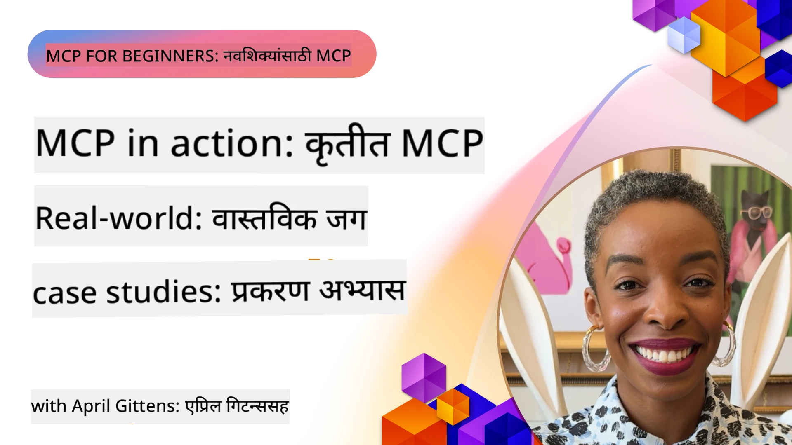

# MCP कृतीत: प्रत्यक्ष प्रकरण अभ्यास

_(या धड्याचा व्हिडिओ पाहण्यासाठी वरील प्रतिमेवर क्लिक करा)_

मॉडेल कॉन्टेक्स्ट प्रोटोकॉल (MCP) AI अनुप्रयोगांनी डेटा, साधने आणि सेवा यांच्याशी संवाद साधण्याची पद्धत बदलत आहे. हा विभाग MCP चे विविध एंटरप्राइझ परिस्थितीतील व्यावहारिक अनुप्रयोग दर्शविणारे प्रत्यक्ष प्रकरण अभ्यास सादर करतो.

## आढावा

हा विभाग MCP अंमलबजावणींचे ठोस उदाहरणे दाखवितो, ज्यामध्ये संस्थांनी या प्रोटोकॉलचा उपयोग कसा करून क्लिष्ट व्यावसायिक आव्हाने सोडवली आहेत हे अधोरेखित केले आहे. या प्रकरण अभ्यासांचे निरीक्षण करून, तुम्हाला MCP च्या बहुमुखी, विस्तारक्षमता आणि प्रत्यक्ष फायद्यांविषयी अंतर्दृष्टी मिळेल.

## मुख्य शिक्षण उद्दिष्टे

या प्रकरण अभ्यासांचा शोध घेऊन, तुम्ही:

- MCP कसे विशिष्ट व्यावसायिक समस्या सोडवण्यासाठी लागू होऊ शकते हे समजून घ्या
- वेगवेगळ्या एकत्रीकरण नमुने आणि वास्तुकला दृष्टिकोण शिकाअ
- एंटरप्राइझ वातावरणातील MCP अंमलबजावणीसाठी सर्वोत्तम पद्धती ओळखा
- प्रत्यक्ष अंमलबजावणींमध्ये उद्भवलेल्या आव्हानांचा आणि उपायांचा अनुभव घ्या
- तुमच्या स्वतःच्या प्रकल्पांमध्ये समान नमुने लागू करण्यासाठी संधी ओळखा

## वैशिष्ट्यीकृत प्रकरण अभ्यास

### 1. [Azure AI ट्रॅव्हल एजंट – संदर्भ अंमलबजावणी](./travelagentsample.md)

हा प्रकरण अभ्यास Microsoft च्या सर्वसमावेशक संदर्भ सोल्यूशनचा अभ्यास करतो जो MCP, Azure OpenAI, आणि Azure AI Search चा उपयोग करून मल्टि-एजंट, AI-चालित प्रवास नियोजन अनुप्रयोग कसा तयार करायचा हे दाखवितो. प्रकल्पात दाखविले आहे:

- MCP द्वारे मल्टि-एजंट समन्वय
- Azure AI Search सह एंटरप्राइझ डेटा एकत्रीकरण
- Azure सेवा वापरून सुरक्षित, स्केलेबल आर्किटेक्चर
- पुनर्वापर करता येणाऱ्या MCP घटकांसह विस्तारयोग्य साधने
- Azure OpenAI द्वारे चालवलेले संवादात्मक वापरकर्ता अनुभव

आर्किटेक्चर आणि अंमलबजावणी तपशील MCP ला समन्वय स्तर म्हणून वापरून क्लिष्ट, मल्टि-एजंट प्रणाली तयार करण्यासाठी मौल्यवान अंतर्दृष्टी प्रदान करतात.

### 2. [YouTube डेटा कडून Azure DevOps आयटम्स अद्ययावत करणे](./UpdateADOItemsFromYT.md)

हा प्रकरण अभ्यास MCP चा वापर करून वर्कफ्लो प्रक्रिया स्वयंचलित करण्याचा व्यावहारिक अनुप्रयोग दाखवितो. यामध्ये दाखवले आहे की MCP साधने कशी वापरली जाऊ शकतात:

- ऑनलाइन प्लॅटफॉर्म्स (YouTube) कडून डेटा काढणे
- Azure DevOps प्रणालीतील वर्क आयटम्स अद्ययावत करणे
- पुनरावृत्ती करण्यायोग्य ऑटोमेशन वर्कफ्लो तयार करणे
- भिन्न प्रणालींमध्ये डेटा एकत्रीत करणे

हा उदाहरण दर्शवितो की अतिशय सोपी MCP अंमलबजावणीही नियमित काम स्वयंचलित करून आणि प्रणालीभर डेटा सुसंगतता सुधारून लक्षणीय कार्यक्षमता वाढ करू शकते.

### 3. [MCP सह रिअल-टाइम डॉक्युमेंटेशन पुनर्प्राप्ती](./docs-mcp/README.md)

हा प्रकरण अभ्यास तुम्हाला Python कन्सोल क्लायंट वापरून Model Context Protocol (MCP) सर्व्हरशी कनेक्ट करून Microsoft च्या डॉक्युमेंटेशनचे रिअल-टाइम, संदर्भ-अनुकूल पुनर्प्राप्ती करण्याचे मार्गदर्शन करतो. तुम्हाला शिकायला मिळेल:

- अधिकृत MCP SDK वापरून Python क्लायंटद्वारे MCP सर्व्हरशी कनेक्ट करणे
- प्रभावी, रिअल-टाइम डेटासाठी स्ट्रीमिंग HTTP क्लायंट वापरणे
- सर्व्हरवरील डॉक्युमेंटेशन साधने कॉल करणे आणि प्रतिसाद थेट कन्सोलमध्ये लॉग करणे
- टर्मिनल सोडल्याशिवाय अद्ययावत Microsoft डॉक्युमेंटेशन तुमच्या वर्कफ्लोमध्ये समाकलित करणे

अध्यायात एक प्रयोगात्मक असाइनमेंट, एक लहान कार्यरत कोड नमुना, आणि अधिक सखोल शिक्षणासाठी अतिरिक्त संसाधने दिली आहेत. MCP कसे डॉक्युमेंटेशन प्रवेश आणि कन्सोल-आधारित वातावरणातील विकासकांची उत्पादकता बदलू शकते हे समजून घेण्यासाठी संपूर्ण मार्गदर्शन आणि कोड दिलेल्या अध्यायात पहा.

### 4. [MCP सह इंटरऐक्टिव स्टडी प्लॅन जनरेटर वेब अॅप](./docs-mcp/README.md)

हा प्रकरण अभ्यास Chainlit आणि Model Context Protocol (MCP) वापरून कोणत्याही विषयासाठी वैयक्तिकृत अध्ययन योजना तयार करणारा इंटरऐक्टिव वेब अॅप कसा तयार करावा हे दाखवितो. वापरकर्ते विषय (जसे "AI-900 प्रमाणपत्र") आणि अध्ययन कालावधी (उदा. ८ आठवडे) निर्दिष्ट करू शकतात, आणि अॅप आठवड्याअंशी आठवड्याचे शिफारस केलेले सामग्री विभाग प्रदान करतो. Chainlit संवादात्मक चॅट इंटरफेस सक्षम करतो, ज्यामुळे अनुभव रुचकर आणि अनुकूलनीय बनतो.

- Chainlit द्वारे चालवलेले संवादात्मक वेब अॅप
- विषय आणि कालावधीसाठी वापरकर्ता-चालित प्रॉम्प्ट
- MCP वापरून आठवड्यातील सामग्री शिफारसी
- चॅट इंटरफेसमध्ये रिअल-टाइम, अनुकूली प्रतिसाद

प्रकल्प दाखवितो की संवादात्मक AI आणि MCP कसे एकत्र करून आधुनिक वेब पर्यावरणात गतिशील, वापरकर्ता-चालित शैक्षणिक साधने तयार करता येतात.

### 5. [VS Code मध्ये MCP सर्व्हरसह इन-एडिटर डॉक्युमेंट्स](./docs-mcp/README.md)

हा प्रकरण अभ्यास दाखवितो की Microsoft Learn Docs थेट तुमच्या VS Code पर्यावरणात MCP सर्व्हर वापरून कसा आणायचा — ब्राउझर टॅब्स बदलण्याचा त्रास नाही! तुम्हाला कसे करायचे ते दिसेल:

- MCP पॅनेल किंवा कमांड पॅलेट वापरून VS Code मध्ये तत्काळ शोधा आणि डॉक वाचा
- संदर्भित डॉक्युमेंटेशन आणि थेट तुमच्या README किंवा कोर्स मार्कडाऊन फाईलमध्ये दुवे घाला
- GitHub Copilot आणि MCP एकत्र वापरा अप्रतिम, AI-चालित डॉक्युमेंटेशन आणि कोड वर्कफ्लो साठी
- रिअल-टाइम फीडबॅक आणि Microsoft स्रोताच्या अचूकता सह तुमचे डॉक्युमेंटेशन सत्यापित आणि सुधारित करा
- सातत्यपूर्ण डॉक्युमेंटेशन प्रमाणीकरणासाठी MCP GitHub वर्कफ्लोमध्ये समाकलित करा

अंमलबजावणीमध्ये समाविष्ट आहे:

- सोपी सेटअप साठी `.vscode/mcp.json` कॉन्फिगरेशनचे उदाहरण
- इन-एडिटर अनुभवाचे स्क्रीनशॉट-आधारित मार्गदर्शक
- Copilot आणि MCP अधिकतम उत्पादकतेसाठी कसे एकत्र करायचे याचे टिप्स

हा परिदृश्य कोर्स लेखक, डॉक्युमेंटेशन लेखक आणि विकासकासाठी आदर्श आहे जे डॉक्युमेंट्स, Copilot, आणि प्रमाणीकरण साधने वापरताना त्यांच्या संपादकात लक्ष केंद्रीत करू इच्छितात—सर्व MCP द्वारे चालवलेले.

### 6. [APIM MCP सर्व्हर निर्मिती](./apimsample.md)

हा प्रकरण अभ्यास Azure API व्यवस्थापन (APIM) वापरून MCP सर्व्हर तयार करण्याबाबत टप्प्याटप्प्याने मार्गदर्शन करतो. यामध्ये समाविष्ट आहे:

- Azure API व्यवस्थापनमध्ये MCP सर्व्हर सेटअप करणे
- MCP साधने म्हणून API ऑपरेशन एक्सपोज करणे
- दरमर्यादा आणि सुरक्षा साठी धोरणे कॉन्फिगर करणे
- Visual Studio Code आणि GitHub Copilot वापरून MCP सर्व्हरची चाचणी करणे

हा उदाहरण Azure ची क्षमता कशी वापरून एक मजबूत MCP सर्व्हर तयार करायचा जो विविध अनुप्रयोगांमध्ये वापरता येईल आणि AI सिस्टम्सचा एंटरप्राइज API सह समाकलन वाढवेल हे दर्शवितो.

### 7. [GitHub MCP रजिस्ट्री — एजंटिक एकत्रीकरणाचा वेग वाढविते](https://github.com/mcp)

हा प्रकरण अभ्यास GitHub च्या MCP रजिस्ट्रीचा अभ्यास करतो, जे सप्टेंबर 2025 मध्ये सुरू करण्यात आले आणि AI परिसंस्थेतल्या एका महत्त्वाच्या आव्हानाला उत्तर देते: Model Context Protocol (MCP) सर्व्हर्सचा विखुरलेला शोध आणि तैनात करणे.

#### आढावा
**MCP रजिस्ट्री** वेगवेगळ्या रिपॉझिटरीज आणि रजिस्ट्रीमध्ये विखुरलेल्या MCP सर्व्हर्सची वाढती समस्या सोडवते, जी आधी समाकलित करणे धीमे आणि त्रुटीप्रवण बनवत होती. हे सर्व्हर्स AI एजंटना API, डेटाबेस, आणि डॉक्युमेंटेशन स्रोतांसारख्या बाह्य प्रणालींसह संवाद साधण्यास सक्षम करतात.

#### समस्या विधान
एजंटिक वर्कफ्लो तयार करणाऱ्या विकासकांना अनेक अडचणी पाळाव्या लागल्या:
- वेगवेगळ्या प्लॅटफॉर्म्सवर MCP सर्व्हर्सची **खराब शोधक्षमता**
- मंचांवर आणि दस्तऐवजात **अतिरिक्त सेटअप प्रश्न**
- **अधिकृत नसलेल्या आणि अविश्वसनीय स्रोतांमुळे सुरक्षा धोके**
- सर्व्हर गुणवत्तेत आणि सुसंगततेत **मानकीकरणाचा अभाव**

#### उपाय वास्तुकला
GitHub ची MCP रजिस्ट्री विश्वसनीय MCP सर्व्हर्सचे केंद्रीकरण करते ज्यामध्ये मुख्य वैशिष्ट्ये आहेत:
- सुव्यवस्थित सेटअपसाठी VS Code द्वारे **एक-क्लिक इंस्टॉल** समाकलन
- स्टार, क्रियाशीलता, आणि समुदाय प्रमाणीकरणाद्वारे **सिग्नल-ओव्हर-नॉईज सॉर्टिंग**
- GitHub Copilot आणि अन्य MCP-सुसंगत साधनांसोबत **थेट समाकलन**
- समुदाय आणि एंटरप्राइझ भागीदार दोघांनाही योगदान देण्याची अनुमती देणारे **खुला योगदान मॉडेल**

#### व्यावसायिक परिणाम
रजिस्ट्रीने मोजता येणारी सुधारणा दिली आहे:
- Microsoft Learn MCP सर्व्हरसारखी उपकरणे वापरणाऱ्या विकासकांसाठी **वेगवान ऑनबोर्डिंग**, जी अधिकृत दस्तऐवज थेट एजंटमध्ये प्रवाहित करतात
- `github-mcp-server` सारख्या विशेषीकृत सर्व्हरमुळे **उत्पादकता सुधारली**, जे नैसर्गिक भाषा GitHub ऑटोमेशन सक्षम करतात (PR तयार करणे, CI पुनरावृत्ती, कोड स्कॅनिंग)
- क्यूरेटेड सूची आणि पारदर्शक कॉन्फिगरेशन मानकेद्वारे **मजबूत परिसंस्था विश्वास**

#### धोरणात्मक मूल्य
एजंट जीवनचक्र व्यवस्थापन आणि पुनरुत्पादनक्षम वर्कफ्लोजमध्ये तज्ञांसाठी, MCP रजिस्ट्री प्रदान करते:
- मानकीकृत घटकांसह **मॉड्यूलर एजंट तैनाती** क्षमता
- सुसंगत चाचणी आणि प्रमाणीकरणासाठी **रजिस्ट्री-बॅक्ड मूल्यांकन पाईपलाइन्स**
- वेगवेगळ्या AI प्लॅटफॉर्म्समध्ये निर्बाध समाकलनासाठी **क्रॉस-टूल परस्परसंवादी**

हा प्रकरण अभ्यास दाखवितो की MCP रजिस्ट्री फक्त निर्देशिका नाही—ती स्केलेबल, प्रत्यक्ष मॉडेल समाकलन आणि एजंटिक प्रणाली तैनातीसाठी एक मूलभूत प्लॅटफॉर्म आहे.

### 8. [एजंटकडून सामाजिक नेटवर्कवर प्रकाशन](./publora-social-publishing.md)

हा प्रकरण अभ्यास एक **लेखनक्षम रिमोट MCP सर्व्हर** दाखवितो — ज्याच्या साधनांनी वापरकर्त्याच्या वतीने अपरिवर्तनीय क्रिया घडवितात — सामाजिक प्रकाशन उदाहरण म्हणून वापरण्यात आले आहे. एक एजंट एक पोस्ट मसुदा तयार करतो, माणूस त्यास मान्यता देतो, आणि सर्व्हर ती नेटवर्कवर वेळापत्रकानुसार प्रकाशित करतो.

प्रकाशनावर लागू असलेल्या डिझाईन अटी आहेत, जे कोणत्याही वाचण्याऐवजी लेखन करणाऱ्या सर्व्हरवर लागू होतात:

- **उघडा शोध, प्रमाणीकरण केलेले कार्य** — `tools/list` निर्बाधपणे उत्तर देते जेणेकरून रजिस्ट्री आणि क्लायंट तपासू शकतील, तर प्रत्येक `tools/call` ला टोकन आवश्यक आहे, अन्यथा `401` आणि `WWW-Authenticate` हेडर परत करते
- **आउट-ऑफ-बँड चरणाशिवाय OAuth नोंदणी** — आजचा डायनॅमिक क्लायंट नोंदणी, ज्यात Client ID Metadata Documents ही `2026-07-28` तपशीलाचा दिशादर्शक आहे
- **टूल नोट्स** (`readOnlyHint`, `destructiveHint`, `idempotentHint`) क्लायंट कशावर पुष्टी करावी यासाठी वापरतात — सक्तीऐवजी संकेत, जे कनेक्टर डिरेक्टरीज आता पुनरावलोकनात अपेक्षित करतात
- **अविकल्पनीय ओळखपत्र**, म्हणजे भ्रामक मूल्य स्पष्टपणे अपयशी ठरते, संभाव्य दिसणाऱ्या मूल्यासंबंधी क्रिया करत नाही
- **पोस्ट तयार करणाऱ्या साधनांवर आयडेम्पोटन्सी कीज**, ज्यामुळे एजंट रनटाइमच्या पुनःप्रयत्नामुळे डुप्लिकेट प्रकाशन होत नाही
- **टूल स्कीमामध्ये वर्णन केलेला नो-ऑप टार्गेट** जो पूर्ण लेखन मार्गाचा उपयोग करतो पण काहीही प्रकाशित करत नाही, पुनरावलोकनकर्ते आणि CI साठी

हा अध्याय तुम्हाला स्वतःची सर्व्हर बनवताना लागू करू शकणारा एक लहान तपासणी यादीसह समाप्त होतो.

## निष्कर्ष

हे आठ सर्वसमावेशक प्रकरण अभ्यास Model Context Protocol च्या विविध प्रत्यक्ष स्थितींमधील अद्भुत बहुमुखीपणा आणि व्यावहारिक अनुप्रयोग दर्शवितात. क्लिष्ट मल्टि-एजंट ट्रॅव्हल योजना प्रणालींनी आणि एंटरप्राइझ API व्यवस्थापनापासून ते सुरळीत डॉक्युमेंटेशन वर्कफ्लोज आणि क्रांतिकारी GitHub MCP रजिस्ट्रीपर्यंत, हे उदाहरण दाखवतात की MCP कसे AI सिस्टम्सना आवश्यक साधने, डेटा, आणि सेवा जोडण्यासाठी मानकीकृत, विस्तारक्षम मार्ग प्रदान करते ज्यामुळे अपवादात्मक मूल्य मिळते.

प्रकरण अभ्यास MCP अंमलबजावणीच्या अनेक परिमाणांवर विस्तारतात:
- **एंटरप्राइझ समाकलन**: Azure API व्यवस्थापन आणि Azure DevOps ऑटोमेशन
- **मल्टि-एजंट समन्वय**: समन्वित AI एजंटसह ट्रॅव्हल नियोजन
- **विकासक उत्पादकता**: VS Code समाकलन आणि रिअल-टाइम डॉक्युमेंटेशन प्रवेश
- **परिसंस्था विकास**: GitHub ची MCP रजिस्ट्री एक मूलभूत प्लॅटफॉर्म म्हणून
- **शैक्षणिक अनुप्रयोग**: इंटरऐक्टिव स्टडी प्लॅन जनरेटर आणि संवादात्मक इंटरफेसेस

या अंमलबजावणींचा अभ्यास करून तुम्हाला महत्त्वपूर्ण अंतर्दृष्टी मिळते:
- **वास्तुशास्त्रीय नमुने** विविध प्रमाण आणि वापर प्रकरणांसाठी
- **अंमलबजावणी धोरणे** कार्यक्षमतेला देखभालीसह संतुलित करणारी
- **सुरक्षा आणि विस्तारक्षमता** उत्पादन तैनातीसाठी
- **सर्वोत्तम पद्धती** MCP सर्व्हर विकास आणि क्लायंट समाकलनासाठी
- **परिसंस्था विचारधारा** एकमेकांशी जोडलेल्या AI-चालित सोल्यूशन्ससाठी

हे उदाहरणे एकत्रितपणे दाखवितात की MCP केवळ सैद्धांतिक चौकट नाही तर एक प्रगल्भ, उत्पादन-तयार प्रोटोकॉल आहे ज्यामुळे क्लिष्ट व्यावसायिक आव्हाने सोडवण्यासाठी व्यावहारिक उपाय सुलभ होतात. तुम्ही सोपी स्वयंचलित साधने तयार करत असला किंवा जटिल मल्टि-एजंट प्रणाली, येथे दाखवलेले नमुने आणि दृष्टिकोन तुमच्या स्वतःच्या MCP प्रकल्पांसाठी एक मजबूत पाया तयार करतात.

## अतिरिक्त साधने

- [Azure AI ट्रॅव्हल एजंट GitHub संग्रह](https://github.com/Azure-Samples/azure-ai-travel-agents)
- [Azure DevOps MCP साधन](https://github.com/microsoft/azure-devops-mcp)
- [Playwright MCP साधन](https://github.com/microsoft/playwright-mcp)
- [Microsoft Docs MCP सर्व्हर](https://github.com/MicrosoftDocs/mcp)
- [GitHub MCP रजिस्ट्री — एजंटिक एकत्रीकरण गती वाढविते](https://github.com/mcp)
- [MCP समुदाय उदाहरणे](https://github.com/microsoft/mcp)

## पुढे काय आहे

- पूर्वी: [मॉड्यूल 8: सर्वोत्तम पद्धती](../08-BestPractices/README.md)
- पुढे: [मॉड्यूल 10: AI वर्कफ्लोज सुलभ करणे: AI टूलकिटसह MCP सर्व्हर तयार करणे](../10-StreamliningAIWorkflowsBuildingAnMCPServerWithAIToolkit/README.md)

---

<!-- CO-OP TRANSLATOR DISCLAIMER START -->
**अस्वीकरण**:
हा दस्तऐवज AI भाषांतर सेवा [Co-op Translator](https://github.com/Azure/co-op-translator) चा वापर करून अनुवादित केला आहे. जरी आम्ही अचूकतेसाठी प्रयत्न करतो, तरी कृपया लक्षात घ्या की स्वयंचलित भाषांतरांमध्ये त्रुटी किंवा अचूकतेची कमतरता असू शकते. मूळ दस्तऐवज त्याच्या मूळ भाषेत अधिकृत स्रोत मानला पाहिजे. महत्त्वाची माहिती असल्यास, व्यावसायिक मानवी भाषांतराची शिफारस केली जाते. या भाषांतराच्या वापरामुळे उद्भवणाऱ्या कोणत्याही गैरसमज किंवा चुकीच्या अर्थलावणीसाठी आम्ही जबाबदार नाही.
<!-- CO-OP TRANSLATOR DISCLAIMER END -->