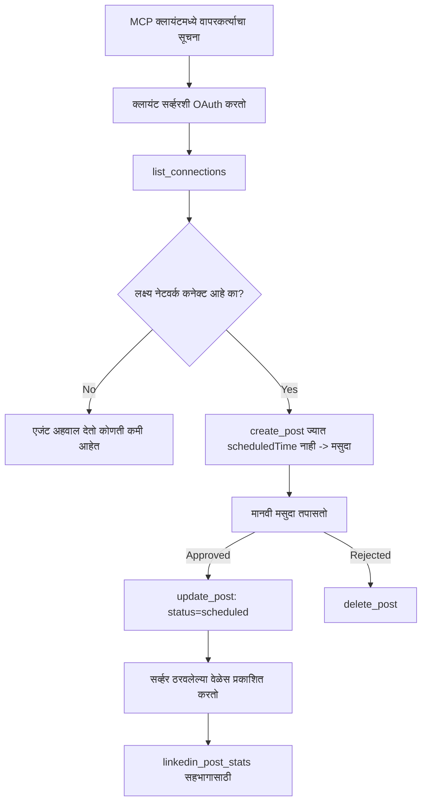

# केस स्टडी: रिमोट MCP सर्व्हरसह एजंटकडून सोशल नेटवर्कवर प्रकाशन

> **सावधान:** अनेक सेवा आणि ओपन-सोर्स प्रकल्प सोशल नेटवर्कवर प्रकाशित करू शकतात, आणि एका टीमद्वारे प्रत्येक नेटवर्कच्या API ला थेट एकत्रित देखील केले जाऊ शकते. खालील परिदृश्य **write-capable रिमोट MCP सर्व्हर** कसा डिझाइन आणि वापरता येतो याचे एक कामाचे उदाहरण म्हणून दिले आहे. Publora ही एक व्यावसायिक सेवा आहे ज्यात एक विनामूल्य स्तर आहे; येथे वर्णन केलेले नमुने कोणत्याही MCP सर्व्हरवर लागू होतात जे वापरकर्त्याच्या वतीने अपरिवर्तनीय क्रिया करतो.

## आढावा

एजंट्स सामग्री तयार करण्यात चांगले असतात पण वितरण करण्यात कमी सक्षम असतात. एक मॉडेल सेकंदांत रिलीज घोषणा लिहू शकते, आणि नंतर काम थांबते: प्रकाशित करणे म्हणजे प्रत्येक नेटवर्कसाठी एक API, प्रत्येक नेटवर्कसाठी एक OAuth अ‍ॅप, आणि प्रत्येकासाठी वेगवेगळे मीडिया नियम. बहुतेक टीम्स हे ब्राउझरमध्ये मजकूर कॉपी करून सोडवतात.

ही केस स्टडी दर्शवते की शेवटचा टप्पा एका रिमोट MCP सर्व्हरद्वारे कसा बंद केला जातो, आणि — ज्याला सॉफ्टवेअर तयार करताना अधिक उपयुक्त आहे — **write-capable** सर्व्हरने कोणती डिझाइन निर्णय योग्य रितीने करणे आवश्यक आहे हे सांगते. डेटा वाचणे माफक असते. प्रकाशित करणे नाही: चुकीची टूल कॉल प्रेक्षकांसमोर दिसते आणि उलटविली जाऊ शकत नाही.

## परिदृश्य

एक लहान विकास-संबंधित टीम एजंटमध्ये पोस्ट ड्राफ्ट करते (Claude, VS Code, Cursor — क्लायंट महत्त्वाचा नाही). ते एजंटने:

- टीमने कोणते सोशल खाते कनेक्ट केले आहे ते पाहणे,
- पोस्ट ड्राफ्ट करणे आणि मनुष्याने मंजूर करण्यासाठी ड्राफ्ट ठेवणे,
- प्रतिमा जोडणे,
- अनेक नेटवर्कवर निवडलेल्या वेळी शेड्यूल करणे,
- आणि नंतर ते कसे काम केले याचा अहवाल देणे.

महत्त्वाचे म्हणजे, ते एजंटला अजूनही प्रयोग करत असताना चुकून प्रकाशित करण्यास *असक्षम* ठेवू इच्छितात.

## वापरलेली साधने

- [Publora MCP Server](https://github.com/publora/mcp-server) — रिमोट MCP सर्व्हर (`streamable-http`) जो प्रकाशित करणे, शेड्यूल करणे, मीडिया आणि LinkedIn विश्लेषण उपकरणे उलगडतो. अधिकृत MCP रजिस्ट्रिमध्ये `com.publora/mcp-server` म्हणून नोंदणीकृत.

## टप्प्याटप्प्याने कार्यपद्धती

1. **सर्व्हर कनेक्ट करा.** OAuth बोलणारे क्लायंट्स PKCE सह ऑथोरायझेशन-कोड फ्लो पूर्ण करतात, ज्यात सर्व्हरच्या स्वत:च्या संमती स्क्रीनचा वापर होतो; ज्यांना OAuth नाही, जसे की हेडलेस CLI, ते हेडरमध्ये Publora API की वापरतात. दोन्ही मार्ग समर्थित आहेत, आणि तुम्हाला कोणता मिळतो ते क्लायंटवर अवलंबून आहे, सर्व्हरवर नाही.
2. **कनेक्शन्सची यादी करा.** एजंट `list_connections` कॉल करतो आणि जोडलेली खाते त्यांचे आयडेंटिफायरसह प्राप्त करतो.
3. **ड्राफ्ट करा.** एजंट *योजलेले वेळ नाही* अशा `create_post` कॉल करतो. पोस्ट ड्राफ्ट म्हणून साठवली जाते — काहीही प्रकाशित होत नाही.
4. **मीडिया जोडा.** सार्वजनिक प्रतिमा URL सध्या त्याच कॉलमध्ये दिले जातात; सर्व्हर त्यांना डाउनलोड आणि सत्यापित करतो.
5. **शेड्यूल करा.** मनुष्य मंजूर केल्यानंतर, `update_post` स्थिती `scheduled` मध्ये ISO 8601 वेळेसह सेट करतो.
6. **मोजा.** LinkedIn साठी, पोस्ट लाईव्ह झाल्यानंतर `linkedin_post_stats` सहभाग परत करते.

## उदाहरण प्रॉम्प्ट

```text
Which social accounts do I have connected?
Draft a post announcing our new changelog page, attach the screenshot at
https://example.com/changelog.png, and keep it as a draft — do not publish it.
Once I approve, schedule it to LinkedIn and Bluesky for tomorrow at 09:00 UTC.
```

## Mermaid फ्लोचार्ट



## तांत्रिक अमल

खालील धडे या केस स्टडीचा हस्तांतरित करण्याजोगा भाग आहेत.

### मुक्त शोध, प्रमाणीकरण केलेले अंमलबजावणी

`tools/list` क्रेडेन्शियलशिवाय उपलब्ध आहे; प्रत्येक `tools/call` एक टोकनची आवश्यकता असते
आणि अन्यथा `401` परत करते, जेथे `WWW-Authenticate` हेडर संरक्षित वस्तूच्या मेटाडेटाकडे निर्देश करतो.
सर्व्हरचा वारसा असलेला एंडपॉइंट
प्रोटोकॉल आवृत्ती `2026-07-28` आधीच्या क्लायंटसाठी प्रमाणीकरणले नसलेल्या `initialize` ला देखील प्रतिसाद देतो;
सध्याचे क्लायंट हे हँडशेक वापरत नाहीत.

हा सर्व्हर-विशिष्ट विभाग रजिस्ट्रि, कॅटलॉग आणि क्लायंटना टूल
नावे, स्कीमा आणि टीपांस गुप्तांशांशिवाय तपासण्याची परवानगी देतो पण अनाम अंमलबजावणी टाळतो.
मुक्त शोध हा एक तैनातीचा पर्याय आहे, MCP ची गरज नाही; संरक्षित तैनातीसाठी `tools/list` ला प्रमाणीकरण आवश्यक असू शकते.


प्रत्येक क्लायंटला विक्रेत्याकडून आधीच जारी केलेले `client_id` आवश्यक होते.


### प्रकाशनापूर्वी अयशस्वी व्हा, क्रियाशील संदेशासह

काही नेटवर्क फक्त मजकूर पोस्ट नाकारतात आणि प्रतिमा किंवा व्हिडिओची आवश्यकता असते. ते पोस्ट शेड्यूल करताना सत्यापित केले जाते, आणि चुका प्लॅटफॉर्म आणि हरवलेल्या आवश्यकतेचे नाव सांगते.

एजंट "इंस्टाग्रामला मीडिया आवश्यक आहे — प्रतिमा किंवा व्हिडिओ जोडा" या त्रुटीवरून आणखी एका फेरफार शिवाय पुनर्प्राप्त करू शकतो. मात्र एक सामान्य `400` वरून पुनर्प्राप्त करू शकत नाही.

### पुनरावृत्ती सुरक्षित करा

सामग्री तयार करणारे दोन टूल्स, `create_post` आणि `update_post`, आयडेंपो्टन्सी की स्वीकारतात: त्याचा पुनर्वापर करून अगदी समान विनंती केल्यास तो मूळ प्रतिसाद पुन्हा वापरतो, दुसरा पोस्ट तयार करत नाही. एजंट रनटाईम टाइमआउटवर पुनर्प्रयत्न करतात; आयडेंपो्टन्सीशिवाय सुस्त प्रतिसाद डुप्लिकेट प्रकाशन ठरतो. इतर लेखन टूल्स — विलोपन, मीडिया टप्पे, LinkedIn प्रतिक्रिया आणि टिप्पणी — यामध्ये नाहीत, त्यामुळे तिथल्या पुनर्प्रयत्न आपोआप सुरक्षित नाही. आपली कोणती म्युटेशन्स सुरक्षीत आहेत आणि कोणती नाहीत हे माहित असणे चांगले.

### काहीही प्रकाशित न करणारी चाचणी करण्याचा मार्ग द्या


सर्व्हर एक राखीव लक्ष्य, `publora-playground` स्वीकारतो, जे खरे ठिकाणाप्रमाणे सत्यापित आणि मान्य केले जाते आणि नंतर टाकले जाते — काहीही थेट खात्यावर पोहोचत नाही. हे टूलच्या स्कीमामध्येच वर्णन केले आहे, जे कोणताही क्लायंट क्रेडेन्शियलशिवाय वाचू शकतो: `create_post` च्या `platforms` फील्डमध्ये हे "खरा कनेक्शन न लागणारे कनेक्शन-टेस्ट लक्ष्य — पोस्ट स्वीकारली जाते आणि टाकली जाते, काहीही प्रकाशित होत नाही" असे दस्तऐवजीकृत आहे. याचा वापर एकटं एन्ट्री म्हणून करून करता येतो: `platforms: ["publora-playground"]`.

हा एकूण पृष्ठभागातील सर्वात उपयुक्त तपशीलांपैकी एक ठरला. कनेक्टर निर्देशिका परीक्षक, योगदानकर्ता आणि CI कोणतीही जोखीम न घेता लेखनाचा पूर्ण मार्ग शेवटपर्यंत तपासू शकतात. कोणत्याही MCP सर्व्हरला ज्यात अपरिवर्तनीय क्रिया असतात, त्यासाठी दस्तऐवजीकृत नो-ऑप लक्ष्य फायद्याचे ठरते.

## परिणाम आणि परिणामकारकता

- प्रकाशित करण्याचा टप्पा ब्राउझरमधून जिथे सामग्री लिहिली जाते त्या चर्चेत केला जातो, आणि ड्राफ्ट-प्रथम सवय मानवी सामील ठेवते. नेमके काय आहे याबाबत स्पष्ट रहा: ड्राफ्ट हा एक परंपरा आहे, सीमा नाही. तोच क्रेडेन्शियल वेळापत्रक किंवा प्रकाशनासाठी वापरता येतो, त्यामुळे ज्यांना खऱ्या मंजुरीचे दार आवश्यक आहे त्यांना ते टूल पृष्ठभागाच्या बाहेर लागू करावे लागते — वेगळे क्रेडेन्शियल किंवा सर्व्हरसमोर धोरण स्तर.
- प्रति-नेटवर्क फरक — मीडिया गरजा, थ्रीडिंग, प्रत्युत्तर नियंत्रण — प्रत्येक एजंटमध्ये नव्हे तर सर्व्हरमध्ये एकदाच हाताळले जातात.
- तोच सर्व्हर अनेक MCP क्लायंटसाठी पूर्व-निर्धारित क्रेडेन्शियलशिवाय बॅकअप करतो.
    सध्याचे क्लायंट्स Client ID Metadata Documents वापरू शकतात; DCR जुने क्लायंटसाठी सहाय्यक आहे
    .
- वरील डिझाइन अटी वापरकर्त्यांसोबत तसेच कनेक्टर-निर्देशिका पुनरावलोकनांनी आकार घेतल्या: अ‍ॅनोटेशन्स, OAuth आणि सुरक्षित चाचणी लक्ष्य प्रत्येक किमान एकाने आवश्यक होते.

## संदर्भ

- [Publora MCP Server (source)](https://github.com/publora/mcp-server)
- [Publora API and MCP documentation](https://docs.publora.com)
- [MCP Registry entry: `com.publora/mcp-server`](https://registry.modelcontextprotocol.io/v0/servers?search=com.publora/mcp-server)
- [MCP specification — Authorization](https://modelcontextprotocol.io/specification/2026-07-28/basic/authorization)
- [MCP specification — Tool annotations](https://modelcontextprotocol.io/docs/concepts/tools)

## पुढे काय

- आपण तयार करत असलेल्या MCP सर्व्हरवरून येथे तीन स्वस्त जिंकणाऱ्या गोष्टी तपासा: प्रत्येक टूलवर अ‍ॅनोटेशन्स, प्रत्येक लेखनावर एकसारखेपणाची की, आणि दस्तऐवजीकृत नो-ऑप लक्ष्य.
- खुल्या-शोध भागाचा प्रयत्न करा: कोणत्याही क्रेडेन्शियलशिवाय सार्वजनिक रिमोट सर्व्हरवर `tools/list` कॉल करा, नंतर टूल कॉल करा आणि `401` आव्हान तपासा.
- तुमच्या क्षेत्रासाठी "पूर्वस्थितीत परत आणणे" म्हणजे काय हे विचार करा. प्रकाशनात ड्राफ्ट आणि वगळणे असतात; जर तुमच्या क्रियांना त्याचे समतुल्य नसेल, तर पुष्टीकरण टूल डिझाइनमध्ये असावे, प्रॉम्प्टमध्ये नाही.

---

<!-- CO-OP TRANSLATOR DISCLAIMER START -->
**अस्वीकरण**:
हा दस्तऐवज AI भाषांतर सेवा [Co-op Translator](https://github.com/Azure/co-op-translator) चा वापर करून अनुवादित केला आहे. जरी आम्ही अचूकतेसाठी प्रयत्न करतो, तरी कृपया लक्षात घ्या की स्वयंचलित भाषांतरांमध्ये त्रुटी किंवा अचूकतेची कमतरता असू शकते. मूळ दस्तऐवज त्याच्या मूळ भाषेत अधिकृत स्रोत मानला पाहिजे. महत्त्वाची माहिती असल्यास, व्यावसायिक मानवी भाषांतराची शिफारस केली जाते. या भाषांतराच्या वापरामुळे उद्भवणाऱ्या कोणत्याही गैरसमज किंवा चुकीच्या अर्थलावणीसाठी आम्ही जबाबदार नाही.
<!-- CO-OP TRANSLATOR DISCLAIMER END -->