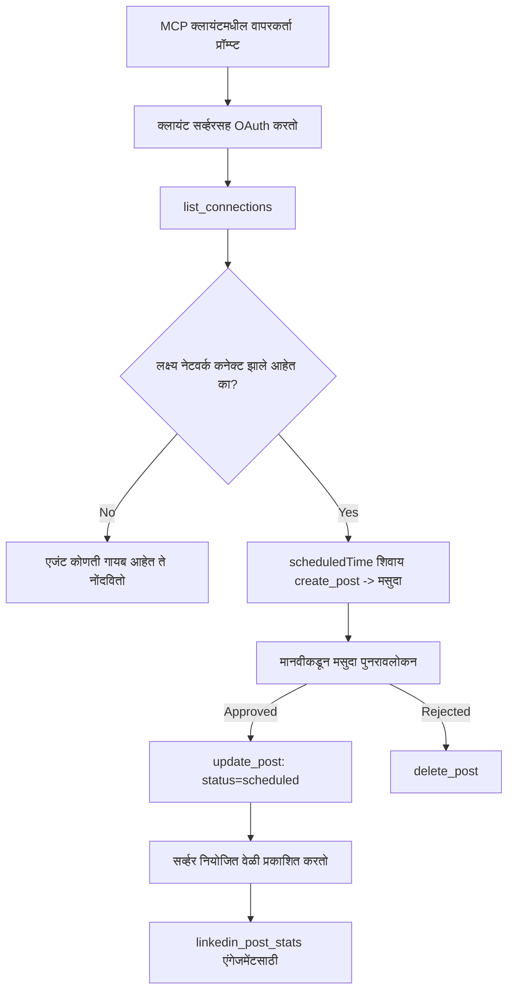

# केस स्टडी: एजंटकडून रिमोट MCP सर्व्हर वापरून सोशल नेटवर्कवर प्रकाशन करणे

> **अस्वीकरण:** अनेक सेवा आणि खुल्या स्रोत प्रकल्प सोशल नेटवर्कवर प्रकाशन करू शकतात, आणि एक टीम प्रत्येक नेटवर्कच्या API ला थेट एकत्र करू शकते. खालील परिस्थिती हे दाखवते की **लेखन-सक्षम रिमोट MCP सर्व्हर** कसा डिझाइन आणि वापरला जाऊ शकतो. Publora ही एक व्यावसायिक सेवा आहे ज्याची एक विनामूल्य टियर देखील आहे; येथे वर्णन केलेले नमुने कोणत्याही वापरकर्त्याच्या वतीने अपरिवर्तनीय क्रिया करणाऱ्या MCP सर्व्हरसाठी लागू होतात.

## आढावा

एजंट सामग्री लिहिण्यात चांगले असतात पण ती वितरित करण्यात कमी चांगले. एखादा मॉडेल सेकंदात एक जाहीरपत्र लिहू शकतो, आणि मग काम थांबते: प्रकाशन म्हणजे प्रत्येक नेटवर्कसाठी API, प्रत्येक नेटवर्कसाठी OAuth अॅप, आणि प्रत्येकासाठी मीडिया नियमांचा वेगळा सेट. बहुतेक टीम ही समस्या हाताने मजकूर ब्राउझरमध्ये कॉपी करून सोडवतात.

ही केस स्टडी कशी शेवटचा टप्पा एका रिमोट MCP सर्व्हरने पूर्ण केला जातो हे पाहते, आणि — जे कोणत्याही नवीन सर्व्हर तयार करणाऱ्यांसाठी अधिक उपयुक्त आहे — **लेखन-सक्षम** सर्व्हर नी कसे डिझाइन निर्णय घ्यावे यावर लक्ष केंद्रित करते. डेटा वाचणे क्षमाशील आहे. प्रकाशन नाही: चुकीचा टूल कॉल प्रेक्षकांसमोर दिसतो आणि मागे घेता येत नाही.

## परिदृश्य

एक छोट्या विकसक-संपर्क टीम एजंटमध्ये (Claude, VS Code, Cursor — क्लायंट कोणताही असो) पोस्ट छांटते. ते एजंट कडून खालील गोष्टी हव्याः

- टीमने कोणते सोशल अकाउंट्स जोडले आहेत ते पाहणे,
- पोस्ट तयार करणे आणि ती मानवी मान्यता साठी मसुदा ठेवणे,
- एक प्रतिमा जोडणे,
- निवडलेल्या वेळेस अनेक नेटवर्कवर वेळापत्रक करणे,
- आणि नंतर कसा परिणाम झाला ते अहवाल देणे.

महत्त्वाचे म्हणजे, ते एजंटला चुकून प्रकाशीत करता येणार नाही याची हमी हवी आहे जेव्हा ते अजून प्रयोग करत आहेत.

## वापरलेली उपकरणे

- [Publora MCP Server](https://github.com/publora/mcp-server) — एक रिमोट MCP सर्व्हर (`streamable-http`) जो प्रकाशन, वेळापत्रक, मीडिया आणि LinkedIn विश्लेषण साधने एक्सपोज करतो. अधिकृत MCP नोंदणीमध्ये `com.publora/mcp-server` म्हणून नोंदणीकृत.

## टप्प्याटप्प्याने कार्यप्रवाह

1. **सर्व्हरशी कनेक्ट करा.** OAuth बोलणारे क्लायंट स्वीकृती-पुष्टी स्क्रीनवर PKCE सह अधिकृत-कोड प्रवाह पूर्ण करतात; ज्यांना ते नाही (जसे की हेडलेस CLI), ते हेडरमध्ये Publora API की वापरतात. दोन्ही मार्ग समर्थित आहेत, आणि कोणता मार्ग वापरायचा हे क्लायंटवर अवलंबून असते, सर्व्हरवर नाही.
2. **कनेक्शन्सची यादी करा.** एजंट `list_connections` कॉल करतो आणि कनेक्ट केलेल्या अकाउंटसह त्यांची ओळख प्राप्त करतो.
3. **मसुदा तयार करा.** एजंट `create_post` कॉल करतो *वेळापत्रक न देता*. पोस्ट मसुदा म्हणून संग्रहित होते — काहीही प्रकाशित होत नाही.
4. **मीडिया जोडा.** सार्वजनिक प्रतिमा URL त्याच कॉलमध्ये दिले जातात; सर्व्हर त्यांना डाउनलोड आणि सत्यापित करतो.
5. **वेळापत्रक ठेवा.** मानवी मान्यता झाल्यावर, `update_post` पोस्टची स्थिती ISO 8601 वेळेसह वेळापत्रक केलेली म्हणून सेट करतो.
6. **मोजमाप करा.** LinkedIn साठी, `linkedin_post_stats` पोस्ट लाइव्ह झाल्यानंतर सहभाग परत करतो.

## उदाहरण प्रांप्ट

```text
Which social accounts do I have connected?
Draft a post announcing our new changelog page, attach the screenshot at
https://example.com/changelog.png, and keep it as a draft — do not publish it.
Once I approve, schedule it to LinkedIn and Bluesky for tomorrow at 09:00 UTC.
```

## Mermaid फ्लोचार्ट



## तांत्रिक अंमलबजावणी

खालील धडे या केस स्टडीचा हस्तांतरित होण्याजोगा भाग आहेत.

### खुले शोध, प्रमाणीकृत कार्यान्वयन

`tools/list` क्रेडेन्शियलशिवाय सेवा केली जाते; प्रत्येक `tools/call` ला टोकन आवश्यक असतो आणि अन्यथा `401` परत करतो ज्यामध्ये `WWW-Authenticate` हेडर सामील असते जो संरक्षित-स्रोत मेटाडेटाकडे निर्देशित करतो. (सर्व्हर एक अवैध `initialize` देखील प्रतिसाद देतो, जो फक्त `2026-07-28` पूर्वीच्या प्रोटोकॉल आवृत्त्यांसाठी महत्त्वाचा आहे; त्या सुधारण्यात संपूर्ण हस्तक्षेप काढून टाकण्यात आला.)

हा विभाग व्यवहारात महत्त्वाचा आहे. नोंदणी, निर्देशिका आणि क्लायंट टूल पृष्ठभाग — नावे, स्कीमा, अ‍ॅनोटेशन्स — गुपित न धरता पाहू शकतात, पण काहीही **गोपनीयतेशिवाय** अंमलात आणले जाऊ शकत नाही. `initialize` साठी टोकन मागणारा सर्व्हर टूलिंगसाठी अप्रत्यक्ष आहे; अनामिक `tools/call` स्वीकारणारा सर्व्हर जबाबदार नसतो.

### नोंदणी: डायनॅमिक क्लायंट नोंदणी आणि त्याचा काय उपयोग आहे

सर्व्हर `/.well-known/oauth-protected-resource` आणि `/.well-known/oauth-authorization-server` जाहिरात करतो, आणि PKCE (`S256`), रिफ्रेश टोकन्स सहित अधिकृत-कोड प्रवाह आणि **डायनॅमिक क्लायंट नोंदणी** समर्थित करतो.

डायनॅमिक नोंदणी अनचूक पावले काढते: न करता प्रत्येक क्लायंटला आधीच दिलेला `client_id` हवा असतो, जे प्रत्येक नवीन क्लायंटसाठी वितरकाला बाह्य विनंती करावी लागते.

याला डिझाइन म्हणून न घेता सुसंगतता कारण म्हणून विचार करा. स्पेसिफिकेशनच्या `2026-07-28` सुधारण्यात डायनॅमिक क्लायंट नोंदणी Client ID Metadata Documents (CIMD) पर्यायामुळे अविशिष्ट केली जाते, ज्यात क्लायंट स्थिर HTTPS URL वर मेटाडाटा दस्तऐवज होस्ट करतो आणि तो URL `client_id` असतो. DCR अजूनही काम करते, पण आजचा सर्व्हर CIMD साठी योजनाबद्ध करावा आणि DCR फक्त जुने क्लायंटसाठी ठेवा.

### टूल अ‍ॅनोटेशन्स हे सजावट नाहीत

प्रत्येक टूल मध्ये `title` आणि लागू सूचनांचा समावेश असतो: `readOnlyHint`, `destructiveHint`, `idempotentHint`, `openWorldHint`.

दोन कारणे त्यात गुंतवणूक करण्यासाठी. पहिलं, क्लायंट वापरकर्त्यासोबत काय पुष्टी करायची ते ठरवण्यासाठी हे संकेत वापरतो — क्लायंट वाचण्यायोग्य शोध स्वयंचालितपणे करू शकतो आणि नष्ट करण्यापूर्वी पुष्टीसाठी थांबू शकतो. या स्पेसिफिकेशनमध्ये स्पष्ट आहे की अ‍ॅनोटेशन्स अविश्वसनीय संकेत आहेत, अधिकार机制 नाहीत: ते काय करायचे हे आकार देतात, सर्व्हरवर काहीही थांबवत नाहीत, आणि सर्व्हरने आपले नियम अजूनही लागू करणे आवश्यक आहे. दुसरे, प्रमुख कनेक्टर निर्देशिका आता पुनरावलोकनासाठी त्यांची गरज करतात; ज्याचा टूल्समध्ये शीर्षक आणि संकेत नसतील त्याला कसेही चांगले काम करत असले तरीही परत पाठवले जाईल.

### ओळखपत्रे बनवू नयेत

प्लॅटफॉर्म ओळखपत्रे `list_connections` द्वारे परत केलेली अस्पष्ट स्ट्रिंग्स आहेत आणि स्कीमा वर्णन स्पष्टपणे सांगते की त्यांना अचूक कॉपी करावे आणि कधीही भाकित (guess) करू नये. सर्व्हर इतर काहीही नाकारतो.

मॉडेल्स सलग भाकिते करतात. कोणताही लेखन-सक्षम सर्व्हर समजेल की ओळखपत्र कधी तरी भासले जाईल आणि तो मार्ग उशिरा पण जोरात अयशस्वी करेल, शक्यतो त्यादृष्टीने योग्य असलेल्या मूल्यावर कृती करण्यापेक्षा.

### प्रकाशनाआधी अयशस्वी व्हा, पण कृतीयोग्य संदेशासह

काही नेटवर्क फक्त मजकूर पोस्ट नाकारतात आणि प्रतिमा किंवा व्हिडिओची गरज असते. ते वेळापत्रक करताना तपासले जाते, आणि त्रुटीमध्ये प्लॅटफॉर्म आणि अनुपस्थित गरज नमूद केलेली असते.

एजंट "Instagram ला मीडिया आवश्यक आहे — प्रतिमा किंवा व्हिडिओ जोडा" पासून दुसरा संवाद न करता बचाव करू शकतो. परंतु सामान्य `400` पासून नाही.

### पुनर्प्रयत्न सुरक्षित बनवा

सामग्री तयार करणारी दोन साधने, `create_post` आणि `update_post`, एक idempotency की स्वीकारतात: तीच विनंती वापरल्यास मूळ प्रतिसाद पुनः मिळतो, दुसरा पोस्ट तयार होत नाही. एजंट रनटाइम टाइमआउटवर पुनर्प्रयत्न करतात; idempotency नसेल तर हळू प्रतिसाद द्विगुण प्रकाशन बनतो. इतर लेखन टूल — वगळणे, मीडिया टप्पे, LinkedIn प्रतिक्रिया आणि टिप्पण्या — ही की स्वीकारत नाहीत, त्यामुळे तिथे पुनर्प्रयत्न आपोआप सुरक्षित नाही. कोणत्या परिवर्तनांना संरक्षण आहे आणि कोणत्या नाही हे जाणून ठेवणे उपयुक्त आहे.

### काहीही प्रकाशित न करणारा चाचणी मार्ग द्या

सर्व्हर `publora-playground` नावाचा राखीव लक्ष्य स्वीकारतो, जो सत्यापित आणि मान्य केला जातो पण नंतर टाकला जातो — काहीही जिवंत खात्यापर्यंत पोहोचत नाही. हे टूल स्कीमाच तसेच वर्णन करते, जे कोणताही क्लायंट क्रेडेन्शियलशिवाय वाचू शकतो: `create_post` च्या `platforms` फील्डमध्ये हे "खरा कनेक्शन नको असलेले कनेक्शन-चाचणी लक्ष्य — पोस्ट मान्य केली जाते आणि टाकली जाते, काहीही प्रकाशित होत नाही" म्हणून दस्तऐवजीकृत आहे. याचा वापर एकट्या एन्ट्री म्हणून `platforms: ["publora-playground"]` द्यून करा.

हा पूर्ण पृष्ठभागातील सर्वांत उपयुक्त तपशीलांपैकी एक ठरला. कनेक्टर निर्देशिका पुनरावलोकक, योगदानकर्ते आणि CI संपूर्ण लेखन मार्ग धोकादायक अभिज्ञापकांशिवाय चालवू शकतात. अपरिवर्तनीय क्रिया करणाऱ्या कोणत्याही MCP सर्व्हरला दस्तऐवजीकृत no-op लक्ष्य लाभदायक आहे.

## निकाल आणि परिणाम

- प्रकाशन टप्पा ब्राउझरमधून त्या एका संभाषणात स्थलांतरित झाला जिथे सामग्री लिहिली जाते, आणि मसुदा-प्रथम सवय मानवी सहभाग टिकवून ठेवते. नेमकं काय आहे ते ठरवा: मसुदा एक परंपरा आहे, सीमा नाही. त्याच क्रेडेन्शियलने वेळापत्रक किंवा प्रकाशन करू शकते, त्यामुळे खऱ्या मान्यता दारासाठी हे टूल पृष्ठभागाबाहेर लागू करावे लागते – वेगळे क्रेडेन्शियल, किंवा सर्व्हरच्या समोर धोरणी स्तर.
- प्रति-नेटवर्क फरक — मीडिया गरजा, साखळी, प्रतिसाद नियंत्रण — एका सर्व्हरमध्ये हाताळले जातात, प्रत्येक एजंटमध्ये नाही.
- समान सर्व्हर अनेक MCP क्लायंट्सला कोणत्याही क्लायंट-विशिष्ट कामाशिवाय पाठबळ पुरवतो, कारण शोध उघडा आहे आणि नोंदणी डायनॅमिक आहे.
- वरील डिझाइन निर्बंध कनेक्टर-निर्देशिका पुनरावलोकनाने तसेच वापरकर्त्यांनी आकारले आहेत: अ‍ॅनोटेशन्स, OAuth आणि सुरक्षित चाचणी लक्ष्य प्रत्येक किमान एका पुनरावलोकनासाठी आवश्यक होते.

## संदर्भ

- [Publora MCP Server (स्रोत)](https://github.com/publora/mcp-server)
- [Publora API आणि MCP दस्तऐवज](https://docs.publora.com)
- [MCP रेजिस्ट्री एन्ट्री: `com.publora/mcp-server`](https://registry.modelcontextprotocol.io/v0/servers?search=com.publora/mcp-server)
- [MCP स्पेसिफिकेशन — अधिकृतता](https://modelcontextprotocol.io/specification/draft/basic/authorization)
- [MCP स्पेसिफिकेशन — टूल अ‍ॅनोटेशन्स](https://modelcontextprotocol.io/docs/concepts/tools)

## पुढे काय

- तुम्ही जे MCP सर्व्हर तयार करत आहात त्यावर या येथील तीन स्वस्त यशे तपासा: प्रत्येक टूलवर अ‍ॅनोटेशन्स, प्रत्येक लेखनावर idempotency की, आणि एक दस्तऐवजीकृत no-op लक्ष्य.
- खुले शोध विभाग वापरून पाहा: कोणत्याही क्रेडेन्शियलशिवाय सार्वजनिक रिमोट सर्व्हरशी `tools/list` कॉल करा, नंतर टूल कॉल करा आणि `401` आव्हान तपासा.
- तुमच्या डोमेनसाठी "undo" काय अर्थ देतो हे विचार करा. प्रकाशनात मसुदे आणि वगळणे असते; जर तुमच्या क्रियांसाठी त्याचा समतुल्य नसेल, तर पुष्टी टूल डिझाइनमध्ये असावी, प्रांप्टमध्ये नव्हे.

---

<!-- CO-OP TRANSLATOR DISCLAIMER START -->
**अस्वीकरण**:
हा दस्तऐवज AI भाषांतर सेवा [Co-op Translator](https://github.com/Azure/co-op-translator) चा वापर करून अनुवादित केला आहे. जरी आम्ही अचूकतेसाठी प्रयत्न करतो, तरी कृपया लक्षात घ्या की स्वयंचलित भाषांतरांमध्ये त्रुटी किंवा अचूकतेची कमतरता असू शकते. मूळ दस्तऐवज त्याच्या मूळ भाषेत अधिकृत स्रोत मानला पाहिजे. महत्त्वाची माहिती असल्यास, व्यावसायिक मानवी भाषांतराची शिफारस केली जाते. या भाषांतराच्या वापरामुळे उद्भवणाऱ्या कोणत्याही गैरसमज किंवा चुकीच्या अर्थलावणीसाठी आम्ही जबाबदार नाही.
<!-- CO-OP TRANSLATOR DISCLAIMER END -->