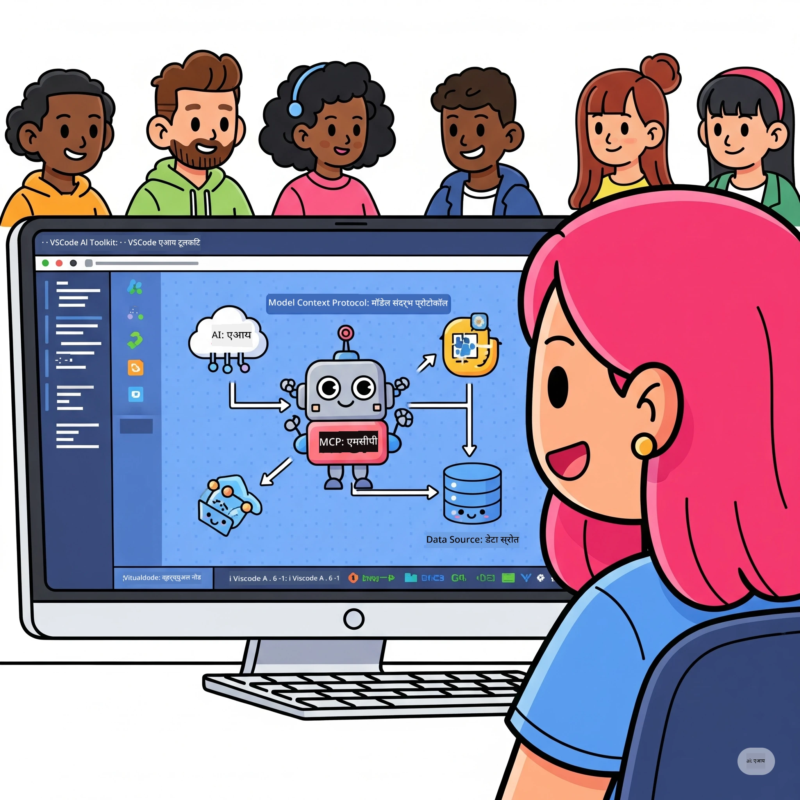

# AI कार्यप्रवाह सुलभ करणे: Microsoft Foundry Toolkit सह MCP सर्व्हर तयार करणे

## 🎯  अवलोकन

_(या धड्याचा व्हिडिओ पाहण्यासाठी वरील प्रतिमेवर क्लिक करा)_

आपले स्वागत आहे **मॉडेल कॉन्टेक्स्ट प्रोटोकॉल (MCP) कार्यशाळेत**! ही सखोल हाताळणी कार्यशाळा दोन प्रगत तंत्रज्ञान एकत्र करून AI अनुप्रयोग विकासात क्रांती घडवते:

> **अनुकूलता सूचना:** कार्यशाळेचा कोड MCP
> `2025-11-25` सह तयार आणि चाचणीला गेलेला आहे, वर दाखवलेल्या बॅजप्रमाणे. वापरा
> [सध्याचा `2026-07-28` स्पेसिफिकेशन](https://modelcontextprotocol.io/specification/2026-07-28/)
> नवीन प्रोटोकॉल अंमलबजावणीसाठी आणि SDK प्रकाशन नोंदी पहा
> प्रयोगशाळा स्थलांतर करण्यापूर्वी.

- **🔗 मॉडेल कॉन्टेक्स्ट प्रोटोकॉल (MCP)**: अखंड AI-टूल समाकलनासाठी खुला मानक
- **🛠️ Microsoft Foundry Toolkit Extension for VS Code**: Microsoft चा सामर्थ्यवान AI विकास विस्तार

### 🎓 आपण काय शिकाल

या कार्यशाळेच्या शेवटी, आपण बुद्धिमान अनुप्रयोग तयार करण्याची कला पारंगत कराल जी AI मॉडेल्सना प्रत्यक्ष टूल्स आणि सेवांशी जोडते. स्वयंचलित चाचणीपासून कस्टम API समाकलनापर्यंत, आपण व्यावहारिक कौशल्ये आत्मसात कराल ज्यामुळे क्लिष्ट व्यावसायिक समस्या सोडवता येतील.

## 🏗️ तंत्रज्ञान स्टॅक

### 🔌 मॉडेल कॉन्टेक्स्ट प्रोटोकॉल (MCP)

MCP हे **"USB-C फॉर AI"** आहे - एक सार्वत्रिक मानक जे AI मॉडेल्सना बाह्य टूल्स आणि डेटा स्रोतांशी जोडते.

**✨ मुख्य वैशिष्ट्ये:**

- 🔄 **मानकीकृत समाकलन**: AI-टूल कनेक्शन्ससाठी सार्वत्रिक इंटरफेस
- 🏛️ **लवचिक आर्किटेक्चर**: stdio/SSE वाहतूक माध्यमाद्वारे स्थानिक आणि रिमोट सर्व्हर्स
- 🧰 **समृद्ध पर्यावरण**: टूल्स, प्रॉम्प्ट्स, आणि संसाधने एका प्रोटोकॉलमध्ये
- 🔒 **एंटरप्राइज-तयार**: अंगभूत सुरक्षा आणि विश्वासार्हता

**🎯 MCP का महत्त्वाचे आहे:**
जसे USB-C केबल गोंधळ दूर करते, तसेच MCP AI एकत्रिकरणांची गुंतागुंत दूर करते. एक प्रोटोकॉल, अमर्याद शक्यता.

### 🤖 Microsoft Foundry Toolkit Extension for VS Code

Microsoft चा प्रमुख AI विकास विस्तार जो VS Code ला AI सामर्थ्यस्थानात रूपांतरित करतो.

**🚀 मुख्य क्षमता:**

- 📦 **मॉडेल कॅटलॉग**: Azure AI, GitHub, Hugging Face, Ollama यांचे मॉडेल्स प्रवेश करा
- ⚡ **लोकल इन्फरंस**: ONNX-सुसंगत CPU/GPU/NPU कार्यान्वयन
- 🏗️ **एजंट बिल्डर**: MCP समाकलनासह व्हिज्युअल AI एजंट विकास
- 🎭 **मल्टी-मोडल**: मजकूर, दृक्‍षण, आणि संरचित आउटपुट सपोर्ट

**💡 विकास फायदे:**

- झिरो-कॉन्फिग मॉडेल तैनात करणे
- व्हिज्युअल प्रॉम्प्ट अभियांत्रिकी
- रिअल-टाइम टेस्टिंग प्लेग्राउंड
- अखंड MCP सर्व्हर समाकलन

## 📚 शिकण्याचा प्रवास

### [🚀 मॉड्यूल 1: Microsoft Foundry Toolkit मूलतत्त्वे](./lab1/README.md)

**कालावधी**: 15 मिनिटे

- 🛠️ VS Code साठी Microsoft Foundry Toolkit स्थापित आणि संरचीत करा
- 🗂️ मॉडेल कॅटलॉग (GitHub, ONNX, OpenAI, Anthropic, Google मधील 100+ मॉडेल्स) अन्वेषण करा
- 🎮 रिअल-टाइम मॉडेल चाचणीसाठी इंटरएक्टिव प्लेग्राउंड मध्ये प्रभुत्व मिळवा
- 🤖 एजंट बिल्डरसह आपला पहिला AI एजंट तयार करा
- 📊 अंगभूत मेट्रिक्स (F1, सान्दर्भिकता, सादृश्यता, सुसंगती) वापरून मॉडेल कामगिरीचे मूल्यांकन करा
- ⚡ बॅच प्रोसेसिंग आणि मल्टी-मोडल सपोर्ट क्षमतांची माहिती घ्या

**🎯 शिकण्याचा निकाल**: Microsoft Foundry Toolkit क्षमतांची सखोल समज मिळवून कार्यक्षम AI एजंट तयार करा

### [🌐 मॉड्यूल 2: MCP सह Microsoft Foundry Toolkit मूलतत्त्वे](./lab2/README.md)

**कालावधी**: 20 मिनिटे

- 🧠 मॉडेल कॉन्टेक्स्ट प्रोटोकॉल (MCP) वास्तुकला आणि संकल्पना समजून घ्या
- 🌐 Microsoft च्या MCP सर्व्हर पर्यावरणाचा अभ्यास करा
- 🤖 Playwright MCP सर्व्हर वापरून ब्राउझर ऑटोमेशन एजंट तयार करा
- 🔧 MCP सर्व्हर Microsoft Foundry Toolkit एजंट बिल्डरसह समाकलित करा
- 📊 आपल्या एजंट्समध्ये MCP टूल्स संरचीत आणि चाचणी करा
- 🚀 उत्पादनासाठी MCP-शक्तीशाली एजंट्स निर्यात आणि तैनात करा

**🎯 शिकण्याचा निकाल**: MCP द्वारे बाह्य साधनांनी सुपरचार्ज्ड AI एजंट तैनात करा

### [🔧 मॉड्यूल 3: Microsoft Foundry Toolkit सह प्रगत MCP विकास](./lab3/README.md)

**कालावधी**: 20 मिनिटे

- 💻 Microsoft Foundry Toolkit वापरून कस्टम MCP सर्व्हर्स तयार करा
- 🐍 नवीनतम MCP Python SDK (वर्जन 1.9.3) संरचीत करा आणि वापरा
- 🔍 डीबगिंगसाठी MCP इन्स्पेक्टर सेट अप करा आणि वापरा
- 🛠️ व्यावसायिक डीबगिंग कार्यप्रवाहांसह वेदर MCP सर्व्हर तयार करा
- 🧪 एजंट बिल्डर आणि इन्स्पेक्टर पर्यावरणांमध्ये MCP सर्व्हर्स डीबग करा

**🎯 शिकण्याचा निकाल**: आधुनिक उपकरणांसह कस्टम MCP सर्व्हर्स विकसित आणि डीबग करा

### [🐙 मॉड्यूल 4: व्यावहारिक MCP विकास - कस्टम GitHub क्लोन सर्व्हर](./lab4/README.md)

**कालावधी**: 30 मिनिटे

- 🏗️ प्रत्यक्ष GitHub क्लोन MCP सर्व्हर विकास कार्यप्रवाहासाठी तयार करा
- 🔄 स्मार्ट रेपॉझिटरी क्लोनिंग अमलात आणा ज्यात वैधता आणि त्रुटी हाताळणी आहे
- 📁 बुद्धिमान डायरेक्टरी व्यवस्थापन आणि VS Code समाकलन तयार करा
- 🤖 GitHub Copilot एजंट मोड कस्टम MCP टूल्ससह वापरा
- 🛡️ उत्पादन-तयार विश्वासार्हता आणि क्रॉस-प्लॅटफॉर्म सुसंगतता लागू करा

**🎯 शिकण्याचा निकाल**: वास्तव विकास कार्यप्रवाह सुलभ करणारा उत्पादन-तयार MCP सर्व्हर तैनात करा

## 💡 प्रत्यक्ष जगातील अनुप्रयोग आणि प्रभाव

### 🏢 एंटरप्राइज वापर प्रकरणे

#### 🔄 DevOps ऑटोमेशन

आपल्या विकास कार्यप्रवाहाला बुद्धिमान ऑटोमेशनने रूपांतरित करा:

- **स्मार्ट रेपॉझिटरी व्यवस्थापन**: AI-चालित कोड पुनरावलोकन आणि मर्ज निर्णय
- **बुद्धिमान CI/CD**: कोड बदलांवर आधारित स्वयंचलित पाइपलाइन अनुकूलन
- **इश्यू ट्रायज**: स्वयंचलित बग वर्गीकरण आणि नेमणूक

#### 🧪 गुणवत्ता आश्वासन क्रांती

AI-शक्तीशाली ऑटोमेशनसह चाचणी सुधारित करा:

- **बुद्धिमान टेस्ट निर्मिती**: स्वयंचलित व्यापक चाचणी संच तयार करा
- **व्हिज्युअल रिग्रेशन टेस्टिंग**: AI-शक्तीशाली UI बदल शोध
- **परफॉर्मन्स मॉनिटरिंग**: सक्रिय समस्या ओळख आणि निराकरण

#### 📊 डेटा पाइपलाइन बुद्धिमत्ता

हुशार डेटा प्रक्रिया कार्यप्रवाह तयार करा:

- **अनुकूली ETL प्रक्रिया**: स्व-ऑप्टिमाइझिंग डेटा रुपांतरण
- **अपवाद शोधणे**: रिअल-टाइम डेटा गुणवत्ता देखरेख
- **बुद्धिमान मार्गदर्शन**: स्मार्ट डेटा प्रवाह व्यवस्थापन

#### 🎧 ग्राहक अनुभव सुधारणा

उत्कृष्ट ग्राहक संवाद तयार करा:

- **संदर्भ-आधारित समर्थन**: ग्राहक इतिहासातील प्रवेश असलेले AI एजंट्स
- **प्रोएक्टिव्ह समस्या निराकरण**: भविष्यवाणी करणारी ग्राहक सेवा
- **मल्टि-चॅनल एकत्रीकरण**: प्लॅटफॉर्मवर एकत्रित AI अनुभव

## 🛠️ पूर्वआवश्यकता आणि सेटअप

### 💻 प्रणाली आवश्यकताएं

| घटक | आवश्यकता | टिप्पण्या |
|-----------|-------------|-------|
| **ऑपरेटिंग सिस्टम** | Windows 10+, macOS 10.15+, Linux | कोणतीही आधुनिक OS |
| **Visual Studio Code** | नवीनतम स्थिर आवृत्ती | Microsoft Foundry Toolkit साठी आवश्यक |
| **Node.js** | v18.0+ आणि npm | MCP सर्व्हर विकासासाठी |
| **Python** | 3.10+ | Python MCP सर्व्हर साठी ऐच्छिक |
| **स्मृती** | किमान 8GB RAM | स्थानिक मॉडेलसाठी 16GB शिफारस केली आहे |

### 🔧 विकास पर्यावरण

#### शिफारस केलेली VS Code विस्तार

- **Microsoft Foundry Toolkit** (ms-windows-ai-studio.windows-ai-studio)
- **Python** (ms-python.python)
- **Python Debugger** (ms-python.debugpy)
- **GitHub Copilot** (GitHub.copilot) - ऐच्छिक पण उपयुक्त

#### ऐच्छिक साधने

- **uv**: आधुनिक Python पॅकेज व्यवस्थापक
- **MCP Inspector**: MCP सर्व्हर साठी दृश्य डिबगिंग टूल
- **Playwright**: वेब ऑटोमेशन उदाहरणांसाठी

## 🎖️ शिकण्याची परिणाम आणि प्रमाणपत्र मार्ग

### 🏆 कौशल्य प्रावीण्य तपासणी यादी

या कार्यशाळा पूर्ण करून, तुम्ही खालील क्षेत्रात प्रावीण्य प्राप्त कराल:

#### 🎯 मुख्य कौशल्ये

- [ ] **MCP प्रोटोकॉल प्रावीण्य**: आर्किटेक्चर आणि अंमलबजावणी नमुन्यांचे खोल ज्ञान
- [ ] **Microsoft Foundry Toolkit कौशल्य**: वेगवान विकासासाठी Microsoft Foundry Toolkit चे तज्ज्ञस्तराचे वापर
- [ ] **कस्टम सर्व्हर विकास**: उत्पादन MCP सर्व्हर्स तयार करा, तैनात करा आणि देखभाल करा
- [ ] **साधन एकत्रीकरण उत्कृष्टता**: विद्यमान विकास कार्यप्रवाहांमध्ये AI सहजपणे जोडणे
- [ ] **समस्यांवर उपाय आणणे**: शिकलेल्या कौशल्यांचा प्रत्यक्ष व्यावसायिक आव्हानांवर उपयोग करा

#### 🔧 तांत्रिक कौशल्ये

- [ ] VS Code मध्ये Microsoft Foundry Toolkit सेटअप आणि कॉन्फिगर करा
- [ ] कस्टम MCP सर्व्हर डिझाइन आणि अंमलबजावणी करा
- [ ] GitHub मॉडेल्सना MCP आर्किटेक्चरशी एकत्र करा
- [ ] Playwright वापरून स्वयंचलित चाचणी कार्यप्रवाह तयार करा
- [ ] उत्पादन वापरासाठी AI एजंटस तैनात करा
- [ ] MCP सर्व्हर कार्यक्षमता डिबग आणि ऑप्टिमाइझ करा

#### 🚀 प्रगत क्षमता

- [ ] एंटरप्राइझ-स्केल AI एकत्रीकरणांची रचना करा
- [ ] AI अनुप्रयोगांसाठी सुरक्षा सर्वोत्तम पद्धती अंमलात आणा
- [ ] स्केलेबल MCP सर्व्हर आर्किटेक्चर डिझाइन करा
- [ ] विशिष्ट क्षेत्रांसाठी सानुकूल साधन साखळ्या तयार करा
- [ ] AI-नेटिव्ह विकासात इतरांना मार्गदर्शन करा

## 📖 अतिरिक्त साधने

- [MCP तपशील (2026-07-28)](https://modelcontextprotocol.io/specification/2026-07-28/)
- [Microsoft Foundry Toolkit GitHub रिपॉझिटरी](https://github.com/microsoft/vscode-ai-toolkit)
- [नमुना MCP सर्व्हर संग्रह](https://github.com/modelcontextprotocol/servers)
- [सर्वोत्तम पद्धती मार्गदर्शक](https://modelcontextprotocol.io/docs/best-practices)
- [OWASP MCP टॉप 10](https://microsoft.github.io/mcp-azure-security-guide/mcp/) - सुरक्षा सर्वोत्तम पद्धती

---

**🚀 तुमच्या AI विकास कार्यप्रवाहातील क्रांती करण्यास तयार आहात?**

मोकळ्या Microsoft Foundry Toolkit आणि MCP सह बुद्धिमान अनुप्रयोगांचा भवितव्य एकत्र तयार करूया!

## पुढे काय

पुढे जा: [Module 11: MCP Server Hands-On Labs](../11-MCPServerHandsOnLabs/README.md)

---

<!-- CO-OP TRANSLATOR DISCLAIMER START -->
**अस्वीकरण**:
हा दस्तऐवज AI भाषांतर सेवा [Co-op Translator](https://github.com/Azure/co-op-translator) चा वापर करून अनुवादित केला आहे. जरी आम्ही अचूकतेसाठी प्रयत्न करतो, तरी कृपया लक्षात घ्या की स्वयंचलित भाषांतरांमध्ये त्रुटी किंवा अचूकतेची कमतरता असू शकते. मूळ दस्तऐवज त्याच्या मूळ भाषेत अधिकृत स्रोत मानला पाहिजे. महत्त्वाची माहिती असल्यास, व्यावसायिक मानवी भाषांतराची शिफारस केली जाते. या भाषांतराच्या वापरामुळे उद्भवणाऱ्या कोणत्याही गैरसमज किंवा चुकीच्या अर्थलावणीसाठी आम्ही जबाबदार नाही.
<!-- CO-OP TRANSLATOR DISCLAIMER END -->