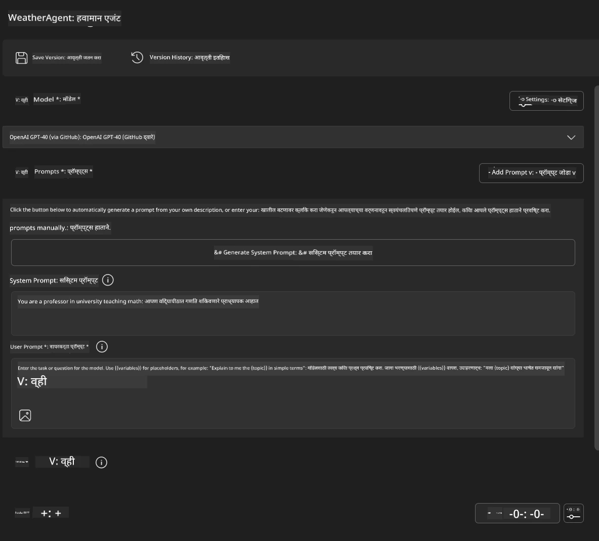
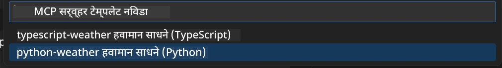
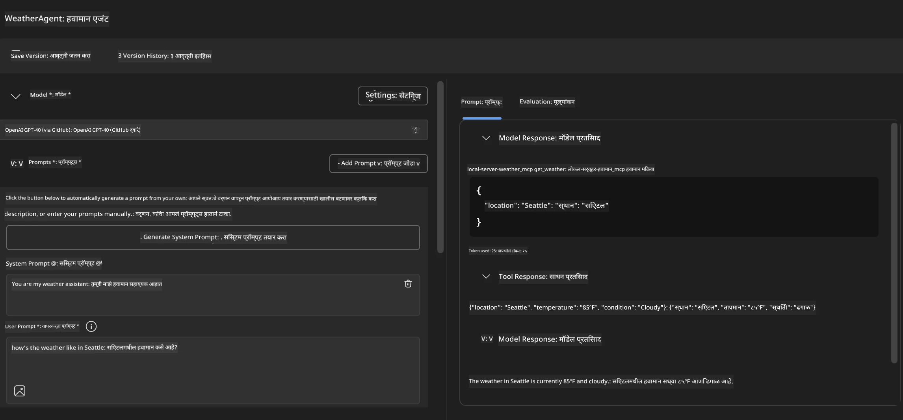
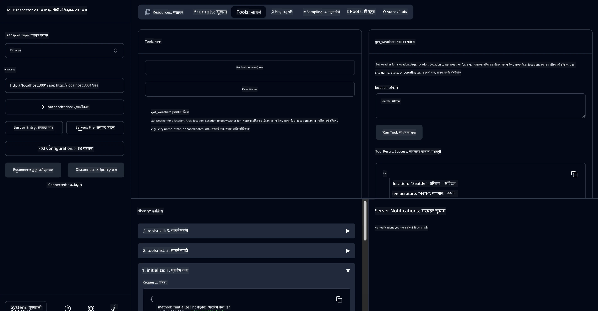

# 🔧 मॉड्यूल 3: मायक्रोसॉफ्ट फाउंड्री टूलकिटसह प्रगत MCP विकास

> [!NOTE]
> या प्रयोगशाळेतील इन्स्पेक्टर URL जुना `/sse` एन्डपॉइंट वापरतो आणि
> पिन केलेल्या MCP SDK `1.9.3` आणि इन्स्पेक्टर `0.14.0` अवलंबनांकडे लक्ष वेधतो. हे
> चालू `2026-07-28` स्ट्रीमबल HTTP उदाहरणे नाहीत.


## 🎯 शिकण्याचे उद्दिष्ट

या प्रयोगशाळेच्या शेवटी, तुम्ही सक्षम असाल:

- ✅ मायक्रोसॉफ्ट फाउंड्री टूलकिट वापरून कस्टम MCP सर्व्हर तयार करा
- ✅ नवीनतम MCP Python SDK (v1.9.3) कॉन्फिगर करा आणि वापरा
- ✅ डिबगिंगसाठी MCP इन्स्पेक्टर सेटअप व वापरा
- ✅ एजंट बिल्डर आणि इन्स्पेक्टर दोन्हीच्या वातावरणात MCP सर्व्हर डिबग करा
- ✅ प्रगत MCP सर्व्हर विकास कार्यप्रवाह समजून घ्या

## 📋 पूर्वअट

- प्रयोगशाळा 2 (MCP मूलतत्त्वे) पूर्ण केलेले असणे आवश्यक
- मायक्रोसॉफ्ट फाउंड्री टूलकिट विस्तारासह VS कोड
- Python 3.10+ ऍन्व्हायर्नमेंट
- इन्स्पेक्टर सेटअपसाठी Node.js आणि npm

## 🏗️ तुम्ही काय तयार कराल

या प्रयोगशाळेत, तुम्ही एक **मौसम MCP सर्व्हर** तयार कराल ज्यामध्ये दाखवले आहे:
- कस्टम MCP सर्व्हर अमलबजावणी
- मायक्रोसॉफ्ट फाउंड्री टूलकिट एजंट बिल्डरसह एकत्रीकरण
- व्यावसायिक डिबगिंग कार्यप्रवाह
- आधुनिक MCP SDK वापराचे नमुने

---

## 🔧 मुख्य घटकांचे विहंगावलोकन

### 🐍 MCP Python SDK
मॉडल कॉन्टेक्स्ट प्रोटोकॉल Python SDK कस्टम MCP सर्व्हर तयार करण्यासाठी पाया पुरवतो. तुम्ही आवृत्ती 1.9.3 वापराल ज्यात सुधारित डिबगिंग क्षमता आहेत.

### 🔍 MCP इन्स्पेक्टर
एक सामर्थ्यशाली डिबगिंग साधन जे प्रदान करते:
- रिअल-टाइम सर्व्हर मॉनिटरिंग
- साधन अंमलबजावणीचे दृश्यांकन
- नेटवर्क विनंती/प्रतिसाद तपासणी
- परस्परसंवादी चाचणी वातावरण

---

## 📖 टप्प्याटप्प्याने अमलबजावणी

### टप्पा 1: एजंट बिल्डर मध्ये WeatherAgent तयार करा

1. **VS कोड मध्ये एजंट बिल्डर सुरू करा** मायक्रोसॉफ्ट फाउंड्री टूलकिट विस्ताराद्वारे
2. **नवीन एजंट तयार करा** खालील कॉन्फिगरेशनसह:
   - एजंट नाव: `WeatherAgent`



### टप्पा 2: MCP सर्व्हर प्रोजेक्ट सुरू करा

1. **एजंट बिल्डर मध्ये टूल्स → टूल जोडा** मध्ये जा
2. **"MCP Server" निवडा** उपलब्ध पर्यायांमधून
3. **"नवीन MCP सर्व्हर तयार करा" निवडा**
4. **`python-weather` टेम्पलेट निवडा**
5. **तुमच्या सर्व्हरचे नाव द्या:** `weather_mcp`



### टप्पा 3: प्रोजेक्ट उघडा आणि तपासा

1. **तयार केलेला प्रोजेक्ट VS कोड मध्ये उघडा**
2. **प्रोजेक्ट संरचना तपासा:**
   ```
   weather_mcp/
   ├── src/
   │   ├── __init__.py
   │   └── server.py
   ├── inspector/
   │   ├── package.json
   │   └── package-lock.json
   ├── .vscode/
   │   ├── launch.json
   │   └── tasks.json
   ├── pyproject.toml
   └── README.md
   ```

### टप्पा 4: नवीनतम MCP SDK वर अपग्रेड करा

> **🔍 का अपग्रेड करावे?** आम्हाला नवीनतम MCP SDK (v1.9.3) आणि इन्स्पेक्टर सेवा (0.14.0) वापरायची आहे ज्यामुळे सुधारित वैशिष्ट्ये आणि चांगले डिबगिंग शक्य होईल.

#### 4a. Python अवलंबन अद्ययावत करा

**`pyproject.toml` संपादित करा:** [./code/weather_mcp/pyproject.toml](../../../../10-StreamliningAIWorkflowsBuildingAnMCPServerWithAIToolkit/lab3/code/weather_mcp/pyproject.toml) अद्ययावत करा


#### 4b. इन्स्पेक्टर कॉन्फिगरेशन अद्ययावत करा

**`inspector/package.json` संपादित करा:** [./code/weather_mcp/inspector/package.json](../../../../10-StreamliningAIWorkflowsBuildingAnMCPServerWithAIToolkit/lab3/code/weather_mcp/inspector/package.json) अद्ययावत करा

#### 4c. इन्स्पेक्टर अवलंबन अद्ययावत करा

**`inspector/package-lock.json` संपादित करा:** [./code/weather_mcp/inspector/package-lock.json](../../../../10-StreamliningAIWorkflowsBuildingAnMCPServerWithAIToolkit/lab3/code/weather_mcp/inspector/package-lock.json) अद्ययावत करा

> **📝 टीप:** या फाईलमध्ये विस्तृत अवलंबन व्याख्या आहेत. खाली आवश्यक संरचना दिली आहे - पूर्ण सामग्री योग्य अवलंबन निराकरणासाठी आवश्यक आहे.


> **⚡ पूर्ण पॅकेज लॉक:** संपूर्ण package-lock.json मध्ये सुमारे 3000 ओळी अवलंबन व्याख्या आहेत. वरील संरचना मुख्य भाग दाखवते - संपूर्ण अवलंबनासाठी दिलेली फाईल वापरा.

### टप्पा 5: VS कोड डिबगिंग कॉन्फिगर करा

*टीप: नमूद केलेल्या मार्गातील फाईल कॉपी करून संबंधित स्थानिक फाईल बदला*

#### 5a. लाँच कॉन्फिगरेशन अद्ययावत करा

**`.vscode/launch.json` संपादित करा:**

```json
{
  "version": "0.2.0",
  "configurations": [
    {
      "name": "Attach to Local MCP",
      "type": "debugpy",
      "request": "attach",
      "connect": {
        "host": "localhost",
        "port": 5678
      },
      "presentation": {
        "hidden": true
      },
      "internalConsoleOptions": "neverOpen",
      "postDebugTask": "Terminate All Tasks"
    },
    {
      "name": "Launch Inspector (Edge)",
      "type": "msedge",
      "request": "launch",
      "url": "http://localhost:6274?timeout=60000&serverUrl=http://localhost:3001/sse#tools",
      "cascadeTerminateToConfigurations": [
        "Attach to Local MCP"
      ],
      "presentation": {
        "hidden": true
      },
      "internalConsoleOptions": "neverOpen"
    },
    {
      "name": "Launch Inspector (Chrome)",
      "type": "chrome",
      "request": "launch",
      "url": "http://localhost:6274?timeout=60000&serverUrl=http://localhost:3001/sse#tools",
      "cascadeTerminateToConfigurations": [
        "Attach to Local MCP"
      ],
      "presentation": {
        "hidden": true
      },
      "internalConsoleOptions": "neverOpen"
    }
  ],
  "compounds": [
    {
      "name": "Debug in Agent Builder",
      "configurations": [
        "Attach to Local MCP"
      ],
      "preLaunchTask": "Open Agent Builder",
    },
    {
      "name": "Debug in Inspector (Edge)",
      "configurations": [
        "Launch Inspector (Edge)",
        "Attach to Local MCP"
      ],
      "preLaunchTask": "Start MCP Inspector",
      "stopAll": true
    },
    {
      "name": "Debug in Inspector (Chrome)",
      "configurations": [
        "Launch Inspector (Chrome)",
        "Attach to Local MCP"
      ],
      "preLaunchTask": "Start MCP Inspector",
      "stopAll": true
    }
  ]
}
```

**`.vscode/tasks.json` संपादित करा:**

```
{
  "version": "2.0.0",
  "tasks": [
    {
      "label": "Start MCP Server",
      "type": "shell",
      "command": "python -m debugpy --listen 127.0.0.1:5678 src/__init__.py sse",
      "isBackground": true,
      "options": {
        "cwd": "${workspaceFolder}",
        "env": {
          "PORT": "3001"
        }
      },
      "problemMatcher": {
        "pattern": [
          {
            "regexp": "^.*$",
            "file": 0,
            "location": 1,
            "message": 2
          }
        ],
        "background": {
          "activeOnStart": true,
          "beginsPattern": ".*",
          "endsPattern": "Application startup complete|running"
        }
      }
    },
    {
      "label": "Start MCP Inspector",
      "type": "shell",
      "command": "npm run dev:inspector",
      "isBackground": true,
      "options": {
        "cwd": "${workspaceFolder}/inspector",
        "env": {
          "CLIENT_PORT": "6274",
          "SERVER_PORT": "6277",
        }
      },
      "problemMatcher": {
        "pattern": [
          {
            "regexp": "^.*$",
            "file": 0,
            "location": 1,
            "message": 2
          }
        ],
        "background": {
          "activeOnStart": true,
          "beginsPattern": "Starting MCP inspector",
          "endsPattern": "Proxy server listening on port"
        }
      },
      "dependsOn": [
        "Start MCP Server"
      ]
    },
    {
      "label": "Open Agent Builder",
      "type": "shell",
      "command": "echo ${input:openAgentBuilder}",
      "presentation": {
        "reveal": "never"
      },
      "dependsOn": [
        "Start MCP Server"
      ],
    },
    {
      "label": "Terminate All Tasks",
      "command": "echo ${input:terminate}",
      "type": "shell",
      "problemMatcher": []
    }
  ],
  "inputs": [
    {
      "id": "openAgentBuilder",
      "type": "command",
      "command": "ai-mlstudio.agentBuilder",
      "args": {
        "initialMCPs": [ "local-server-weather_mcp" ],
        "triggeredFrom": "vsc-tasks"
      }
    },
    {
      "id": "terminate",
      "type": "command",
      "command": "workbench.action.tasks.terminate",
      "args": "terminateAll"
    }
  ]
}
```


---

## 🚀 तुमचा MCP सर्व्हर चालवा आणि तपासा

### टप्पा 6: अवलंबन स्थापित करा

कॉन्फिगरेशन बदलांनंतर खालील आदेश चालवा:

**Python अवलंबन स्थापित करा:**
```bash
uv sync
```

**इन्स्पेक्टर अवलंबन स्थापित करा:**
```bash
cd inspector
npm install
```

### टप्पा 7: एजंट बिल्डरसह डिबग करा

1. **F5 दाबा** किंवा **"Debug in Agent Builder"** कॉन्फिगरेशन वापरा
2. **डिबग पॅनेलमधून कंपाऊंड कॉन्फिगरेशन निवडा**
3. **सर्व्हर सुरू होईपर्यंत आणि एजंट बिल्डर उघडलेपर्यंत प्रतीक्षा करा**
4. **तुमच्या हवामान MCP सर्व्हरला नॅचरल लँग्वेज क्वेरींसह तपासा**

याप्रमाणे इनपुट प्रॉम्प्ट द्या

SYSTEM_PROMPT

```
You are my weather assistant
```

USER_PROMPT

```
How's the weather like in Seattle
```



### टप्पा 8: MCP इन्स्पेक्टरसह डिबग करा

1. **"Debug in Inspector" कॉन्फिगरेशन वापरा** (Edge किंवा Chrome)
2. **`http://localhost:6274` येथे इन्स्पेक्टर इंटरफेस उघडा**
3. **परस्परसंवादी चाचणी वातावरणाचा शोध घ्या:**
   - उपलब्ध साधने पहा
   - साधन अंमलबजावणी तपासा
   - नेटवर्क विनंत्या निरीक्षण करा
   - सर्व्हर प्रतिसाद डिबग करा



---

## 🎯 मुख्य शिकण्याच्या परिणाम

या प्रयोगशाळा पूर्ण करून, तुम्ही:

- [x] मायक्रोसॉफ्ट फाउंड्री टूलकिट टेम्पलेट वापरून **कस्टम MCP सर्व्हर तयार केला आहे**
- [x] सुधारित कार्यक्षमता साठी **नवीनतम MCP SDK (v1.9.3) वर अपग्रेड केले**
- [x] एजंट बिल्डर आणि इन्स्पेक्टर दोघांसाठी **व्यावसायिक डिबगिंग कार्यप्रवाह कॉन्फिगर केला**
- [x] परस्परसंवादी सर्व्हर तपासणीसाठी **MCP इन्स्पेक्टर सेटअप केला**
- [x] MCP विकासासाठी **VS कोड डिबगिंग कॉन्फिगरेशनमध्ये निपुणता मिळवली**

## 🔧 तपासलेली प्रगत वैशिष्ट्ये

| वैशिष्ट्य | वर्णन | वापराचा प्रकरण |
|---------|-------------|----------|
| **MCP Python SDK v1.9.3** | नवीनतम प्रोटोकॉल अंमलबजावणी | आधुनिक सर्व्हर विकास |
| **MCP Inspector 0.14.0** | परस्परसंवादी डिबगिंग साधन | रिअल-टाइम सर्व्हर तपासणी |
| **VS कोड डिबगिंग** | एकीकृत विकास वातावरण | व्यावसायिक डिबगिंग कार्यप्रवाह |
| **एजंट बिल्डर एकत्रीकरण** | डायरेक्ट मायक्रोसॉफ्ट फाउंड्री टूलकिट कनेक्शन | संपूर्ण एजंट तपासणी |

## 📚 अतिरिक्त स्रोत

- [MCP Python SDK दस्तऐवज](https://modelcontextprotocol.io/docs/sdk/python)
- [मायक्रोसॉफ्ट फाउंड्री टूलकिट एक्सटेंशन मार्गदर्शक](https://code.visualstudio.com/docs/ai/ai-toolkit)
- [VS कोड डिबगिंग दस्तऐवज](https://code.visualstudio.com/docs/editor/debugging)
- [मॉडल कॉन्टेक्स्ट प्रोटोकॉल विशिष्टता](https://modelcontextprotocol.io/docs/concepts/architecture)

---

**🎉 अभिनंदन!** तुम्ही यशस्वीरित्या प्रयोगशाळा 3 पूर्ण केली आहे आणि आता व्यावसायिक विकास कार्यप्रवाह वापरून कस्टम MCP सर्व्हर तयार, डिबग आणि तैनात करू शकता.

### 🔜 पुढील मॉड्यूलकडे चला

तुमच्या MCP कौशल्यांचा प्रत्यक्ष विकास कार्यप्रवाहावर उपयोग करण्यास तयार आहात का? पुढे जा **[मॉड्यूल 4: व्यावहारिक MCP विकास - कस्टम GitHub क्लोन सर्व्हर](../lab4/README.md)** जिथे तुम्ही:
- GitHub रिपॉझिटरी ऑपरेशन्स ऑटोमेट करणारा उत्पादन-तयार MCP सर्व्हर तयार कराल
- MCP द्वारे GitHub रिपॉझिटरी क्लोनिंग कार्यक्षमता अंमलबजावणी कराल
- VS कोड आणि GitHub Copilot एजंट मोडसह कस्टम MCP सर्व्हर एकत्रित कराल
- उत्पादन वातावरणात कस्टम MCP सर्व्हर चाचणी आणि तैनाती कराल
- विकसकांसाठी व्यावहारिक कार्यप्रवाह ऑटोमेशन शिकल.

---

<!-- CO-OP TRANSLATOR DISCLAIMER START -->
**अस्वीकरण**:
हा दस्तऐवज AI भाषांतर सेवा [Co-op Translator](https://github.com/Azure/co-op-translator) चा वापर करून अनुवादित केला आहे. जरी आम्ही अचूकतेसाठी प्रयत्न करतो, तरी कृपया लक्षात घ्या की स्वयंचलित भाषांतरांमध्ये त्रुटी किंवा अचूकतेची कमतरता असू शकते. मूळ दस्तऐवज त्याच्या मूळ भाषेत अधिकृत स्रोत मानला पाहिजे. महत्त्वाची माहिती असल्यास, व्यावसायिक मानवी भाषांतराची शिफारस केली जाते. या भाषांतराच्या वापरामुळे उद्भवणाऱ्या कोणत्याही गैरसमज किंवा चुकीच्या अर्थलावणीसाठी आम्ही जबाबदार नाही.
<!-- CO-OP TRANSLATOR DISCLAIMER END -->