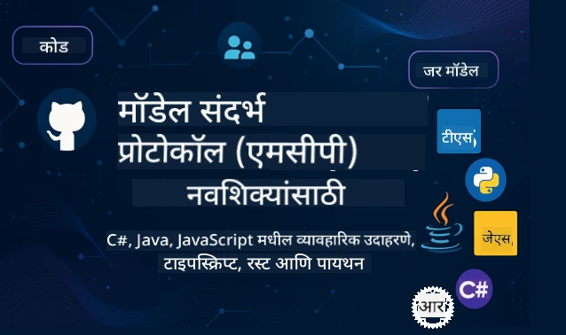

 

[](https://GitHub.com/microsoft/mcp-for-beginners/graphs/contributors)
[](https://GitHub.com/microsoft/mcp-for-beginners/issues)
[](https://GitHub.com/microsoft/mcp-for-beginners/pulls)
[](http://makeapullrequest.com)

[](https://GitHub.com/microsoft/mcp-for-beginners/watchers)
[](https://GitHub.com/microsoft/mcp-for-beginners/fork)
[](https://GitHub.com/microsoft/mcp-for-beginners/stargazers)


[](https://discord.gg/nTYy5BXMWG)

या संसाधनांचा वापर सुरू करण्यासाठी खालील टप्पे अनुसरा:
1. **रिपॉझिटरी फोर्क करा**: क्लिक करा [](https://GitHub.com/microsoft/mcp-for-beginners/fork)
2. **रिपॉझिटरी क्लोन करा**:   `git clone https://github.com/microsoft/mcp-for-beginners.git`
3. **[Microsoft Foundry Discord](https://discord.gg/nTYy5BXMWG) मध्ये सहभागी व्हा** [](https://discord.gg/nTYy5BXMWG)


### 🌐 बहुभाषिक समर्थन

#### GitHub Action द्वारे समर्थित (स्वयंचलित आणि सदैव अद्ययावत)

<!-- CO-OP TRANSLATOR LANGUAGES TABLE START -->
[Arabic](../ar/README.md) | [Bengali](../bn/README.md) | [Bulgarian](../bg/README.md) | [Burmese (Myanmar)](../my/README.md) | [Chinese (Simplified)](../zh-CN/README.md) | [Chinese (Traditional, Hong Kong)](../zh-HK/README.md) | [Chinese (Traditional, Macau)](../zh-MO/README.md) | [Chinese (Traditional, Taiwan)](../zh-TW/README.md) | [Croatian](../hr/README.md) | [Czech](../cs/README.md) | [Danish](../da/README.md) | [Dutch](../nl/README.md) | [Estonian](../et/README.md) | [Finnish](../fi/README.md) | [French](../fr/README.md) | [German](../de/README.md) | [Greek](../el/README.md) | [Hebrew](../he/README.md) | [Hindi](../hi/README.md) | [Hungarian](../hu/README.md) | [Indonesian](../id/README.md) | [Italian](../it/README.md) | [Japanese](../ja/README.md) | [Kannada](../kn/README.md) | [Korean](../ko/README.md) | [Lithuanian](../lt/README.md) | [Malay](../ms/README.md) | [Malayalam](../ml/README.md) | [Marathi](./README.md) | [Nepali](../ne/README.md) | [Nigerian Pidgin](../pcm/README.md) | [Norwegian](../no/README.md) | [Persian (Farsi)](../fa/README.md) | [Polish](../pl/README.md) | [Portuguese (Brazil)](../pt-BR/README.md) | [Portuguese (Portugal)](../pt-PT/README.md) | [Punjabi (Gurmukhi)](../pa/README.md) | [Romanian](../ro/README.md) | [Russian](../ru/README.md) | [Serbian (Cyrillic)](../sr/README.md) | [Slovak](../sk/README.md) | [Slovenian](../sl/README.md) | [Spanish](../es/README.md) | [Swahili](../sw/README.md) | [Swedish](../sv/README.md) | [Tagalog (Filipino)](../tl/README.md) | [Tamil](../ta/README.md) | [Telugu](../te/README.md) | [Thai](../th/README.md) | [Turkish](../tr/README.md) | [Ukrainian](../uk/README.md) | [Urdu](../ur/README.md) | [Vietnamese](../vi/README.md)

> **स्थानिकरित्या क्लोन करायला प्राधान्य देता?**

> या रिपॉझिटरीमध्ये ५०+ भाषांमध्ये अनुवाद समाविष्ट आहेत, ज्यामुळे डाउनलोडचा आकार लक्षणीय वाढतो. अनुवादांशिवाय क्लोन करण्यासाठी, स्पार्स चेकआउट वापरा:
> ```bash
> git clone --filter=blob:none --sparse https://github.com/microsoft/mcp-for-beginners.git
> cd mcp-for-beginners
> git sparse-checkout set --no-cone '/*' '!translations' '!translated_images'
> ```
> यामुळे तुम्हाला या कोर्ससाठी आवश्यक असलेल्या सर्व गोष्टी जलद डाउनलोड करता येतील.
<!-- CO-OP TRANSLATOR LANGUAGES TABLE END -->

# 🚀 मॉडेल कॉन्टेक्स्ट प्रोटोकॉल (MCP) प्रारंभिकांसाठी अभ्यासक्रम

## **C#, Java, JavaScript, Rust, Python, आणि TypeScript मध्ये हस्तगत कोड उदाहरणांसह MCP शिका**

## 🧠 मॉडेल कॉन्टेक्स्ट प्रोटोकॉल अभ्यासक्रमाचा आढावा
तुमच्या मॉडेल कॉन्टेक्स्ट प्रोटोकॉलच्या प्रवासात तुमचे स्वागत आहे! AI अनुप्रयोग वेगवेगळ्या साधने व सेवा कशी संवाद करतात हे तुम्हाला कधीही जाणून घ्यायचं असेल, तर तुम्ही एक सुंदर उपाय शोधत आहात जो विकसकांना बुद्धिमान प्रणाली तयार करण्याचा मार्ग बदलत आहे.

MCP म्हणजे AI अनुप्रयोगांसाठी एक सार्वत्रिक भाषांतर करणारा - जसे USB पोर्ट तुम्हाला कुठलेही उपकरण संगणकाला जोडण्यास परवानगी देतात, तसेच MCP AI मॉडेल कुठल्याही साधन किंवा सेवेची एक सुसंगत पद्धत वापरून कनेक्ट होण्यास अनुमती देतो. तुम्ही तुमचा पहिला चाटबॉट तयार करत असो किंवा गुंतागुंतीच्या AI कामकाजावर काम करत असो, MCP समजून घेण्याने तुम्हाला अधिक सक्षम आणि लवचीय अनुप्रयोग तयार करण्याशक्ती मिळेल.

हा अभ्यासक्रम तुमच्या शिकण्याच्या प्रवासासाठी संयमाने आणि काळजीपूर्वक डिझाइन केला गेला आहे. आपण आधीपासून समजलेल्या सोप्या संकल्पनांपासून सुरुवात करू आणि हळूहळू हातात हात घालून तुमचा कौशल्य वाढवू. प्रत्येक टप्प्यात स्पष्ट स्पष्टीकरणे, व्यावहारिक उदाहरणे, आणि भरपूर प्रोत्साहन असेल.

या प्रवासानंतर, तुम्हाला तुमचा स्वतःचा MCP सर्व्हर तयार करण्याचा आत्मविश्वास असेल, त्यांना लोकप्रिय AI प्लॅटफॉर्मसह एकत्रित कराल, आणि ही तंत्रज्ञान AI विकासाचा भविष्याचा आकार कसा बदलत आहे हे समजून घ्याल. चला हा रोमांचक प्रवास एकत्र सुरू करूया!

### अधिकृत दस्तऐवज आणि तपशील

हे संसाधने तुमच्या समजुतीसह अधिक महत्वाची बनतात, परंतु लगेच सर्व काही वाचण्याचा दबाव घेऊ नका. प्रथम तुम्हाला सर्वात जास्त रस असलेल्या भागांपासून प्रारंभ करा!
- 📘 [MCP दस्तऐवज](https://modelcontextprotocol.io/) – हे तुमच्यासाठी पायरी-पायरीने ट्युटोरियल्स आणि वापरकर्ता मार्गदर्शक आहे. दस्तऐवज नवशिक्यांसाठी लिहिले गेले आहे, ज्यात तुम्ही तुमच्या गतीने अनुसरण करू शकता असे स्पष्ट उदाहरणे दिले आहेत.
- 📜 [MCP तपशील](https://modelcontextprotocol.io/docs/) – हे तुमचे सर्वसमावेशक संदर्भ पुस्तक आहे. अभ्यासक्रमातून पुढे जाऊन तुम्हाला येथे परत येऊन विशिष्ट तपशील शोधता येतील आणि प्रगत वैशिष्ट्ये तपासता येतील.
- 📜 [मूळ MCP तपशील](https://modelcontextprotocol.io/specification/versioning) – यात काही अतिरिक्त तांत्रिक माहिती आहे जी प्रगत अंमलबजावणीसाठी उपयोगी ठरू शकते. तुम्हाला जेव्हाही हवे तेव्हा वापरा, परंतु सुरुवातीला याची काळजी करू नका.
- 🧑‍💻 [MCP GitHub रिपॉझिटरी](https://github.com/modelcontextprotocol) – येथे तुम्हाला अनेक प्रोग्रामिंग भाषांमध्ये SDKs, साधने, आणि कोड नमुने मिळतील. हे व्यावहारिक उदाहरणे आणि वापरासाठी तयार घटकांचे खजिना आहे.
- 🌐 [MCP समुदाय](https://github.com/orgs/modelcontextprotocol/discussions) – MCP संदर्भातील शिका-शिका आणि अनुभवी विकसकांशी चर्चा करा. येथे प्रश्न विचारण्यास आणि ज्ञान मोकळेपणाने वाटण्यास प्रोत्साहन दिले जाते.
  
## शिक्षण उद्दिष्टे

या अभ्यासक्रमाच्या शेवटी, तुमचे आत्मविश्वास आणि उत्साह यामुळे तुमच्या नव्या क्षमतेबद्दल नक्कीच समाधान वाटेल. तुम्ही काय साध्य कराल ते येथे आहे:

• **MCP मूलभूत गोष्टी समजून घ्या**: तुम्हाला मॉडेल कॉन्टेक्स्ट प्रोटोकॉल काय आहे आणि AI अनुप्रयोग कसे एकत्र कार्य करतात याची सखोल समज प्राप्त होईल, सज्जता आणि उदाहरणांसह.

• **तुमचा पहिला MCP सर्व्हर तयार करा**: तुम्ही तुमच्या पसंतीच्या प्रोग्रामिंग भाषेत काम करणारा MCP सर्व्हर तयार कराल, सोप्या उदाहरणांपासून सुरु करुन कौशल्य वाढवत.

• **AI मॉडेल प्रत्यक्ष साधनांशी जोडा**: तुम्ही AI मॉडेल आणि प्रत्यक्ष सेवा यांच्यातील अंतर भरून कसे जोडायचे ते शिकाल आणि तुमच्या अनुप्रयोगांना नवे सामर्थ्य द्याल.

• **सुरक्षा सर्वोत्तम पद्धती अंमलात आणा**: तुमच्या MCP अंमलबजावण्या सुरक्षित ठेवण्यासाठी आवश्यक पद्धती आणि उपाय समजून घ्या, ज्यामुळे तुमचे अनुप्रयोग आणि वापरकर्ते संरक्षित राहतील.

• **आत्मविश्वासासह डिप्लॉय करा**: तुम्हाला तुमचे MCP प्रकल्प विकासापासून उत्पादनापर्यंत कसे नेायचे हे समजेल, आणि प्रत्यक्ष कार्यान्वयनासाठी उपयुक्त रणनीती वापराल.

• **MCP समुदायात सहभागी व्हा**: तुम्ही अशा विकसकांचे भाग व्हाल जे AI अनुप्रयोग विकासाचे भविष्य घडवत आहेत.

## आवश्यक पार्श्वभूमी

MCP ची विशिष्ट माहिती मध्ये डुबकी मारण्यापूर्वी, तुम्हाला काही मूलभूत संकल्पनांशी परिचित करुयात. जर तुम्ही या क्षेत्रात तज्ञ नसाल तरी काळजी करू नका - आम्ही आवश्यक ते सर्व काही समजावून सांगू.

### प्रोटोकॉल समजून घेणे (पायाभूत तत्वे)

प्रोटोकॉल म्हणजे संभाषणासाठी नियमांचा संच आहे, असे समजा. जेव्हा तुम्ही मित्राला कॉल करता, तेव्हा तुम्ही "हॅलो" म्हणता, पालट्या घेता, आणि शेवटी "नमस्कार" म्हणता. संगणक प्रोग्राम्सना प्रभावीपणे संवाद साधण्यासाठी अशाच नियमांची गरज असते.

MCP हा एक प्रोटोकॉल आहे - संमतीने ठरवलेल्या नियमांचा संच जो AI मॉडेल्स आणि अनुप्रयोगांना उपकरणे आणि सेवांशी परिणामकारक संवाद साधण्यास मदत करतो. जसे मानवी संभाषणासाठी नियमांचे असणे संवाद सुलभ करते, तसेच MCP मुळे AI अनुप्रयोग संवाद अधिक विश्वासार्ह आणि सामर्थ्यशाली होतो.

### क्लायंट-सर्व्हर नाते (प्रोग्राम्स कसे एकत्र काम करतात)

तुम्ही दिवसेंदिवस क्लायंट-सर्व्हर नातं वापरता! जेव्हा तुम्ही वेब ब्राउझरचा (क्लायंट) वापर करता एखादी वेबसाइट पाहण्यासाठी, तेव्हा तुम्ही वेब सर्व्हरशी कनेक्ट करता जो वेबपेजची सामग्री पाठवतो. ब्राउझरला माहिती विचारायची कशी हे माहीत असते, आणि सर्व्हरला उत्तर देण्याची क्षमता असते.

MCP मध्ये देखील अशीच नाते आहे: AI मॉडेल्स क्लायंट म्हणून वाटाघाटी करतात, आणि MCP सर्व्हर्स त्यांच्या विनंत्यांना प्रतिसाद देतात. हा एखादा मदतीचा सहाय्यक (सर्व्हर) आहे ज्याला AI विशिष्ट कार्यांसाठी विचारू शकते.

### मानकीकरण का महत्वाचे आहे (सर्वांनी एकत्र काम करणे)

कल्पना करा की प्रत्येक कार उत्पादक वेगळ्या आकाराचे पेट्रोल पंप वापरत असेल - प्रत्येक कारसाठी वेगवेगळा अडेप्टर हवा लागेल! मानकीकरण म्हणजे सर्वांनी एकसारख्या पद्धतीने सहमती दर्शवणे म्हणजे गोष्टी एकत्र सुरळीत चालतात.

MCP AI अनुप्रयोगांसाठी हे मानकीकरण पुरवतो. प्रत्येक AI मॉडेलला प्रत्येक साधनासाठी वेगळा कोड लिहिण्याऐवजी, MCP त्यांना सर्वत्र संवाद करण्याची एकसमान पद्धत पुरवतो. त्यामुळे विकसक एकदाच साधने तयार करतात आणि ती अनेक AI सिस्टम्समध्ये काम करतात.

## 🧭 तुमचा शिक्षणाचा मार्गाचा आढावा

तुमचा MCP प्रवास काळजीपूर्वक रचलेला आहे जेणेकरून तुमचा आत्मविश्वास आणि कौशल्य हळूहळू वाढेल. प्रत्येक टप्पा नवीन संकल्पना ओळख करून देतो आणि आधी शिकलेल्या गोष्टींचा पुष्टी करतो.

### 🌱 पाया टप्पा: मूलभूत गोष्टी समजून घेणे (मॉड्यूल 0-2)

याच्यापासून तुमचा प्रवास सुरू होतो! आम्ही तुमच्यासाठी MCP संकल्पना सोप्प्या उदाहरणांच्या माध्यमातून सादर करू. तुम्हाला कळेल MCP काय आहे, का आहे, आणि AI विकासाच्या विस्तृत जगात हे कसे बसते.

• **मॉड्यूल 0 - MCP परिचय**: आम्ही MCP काय आहे आणि आधुनिक AI अनुप्रयोगांसाठी ते किती महत्त्वाचे आहे हे समजून घेऊ. तुम्हाला वास्तविक उदाहरणांद्वारे MCP चे फायदे दाखवले जातील आणि विकसकांना येणाऱ्या सामान्य समस्या कशा सोडवता येतात हे समजेल.

• **मॉड्यूल 1 - मुख्य संकल्पना समजावून सांगणे**: येथे तुम्हाला MCP चे मूलभूत घटक शिकवले जातील. आम्ही भरपूर उदाहरणे आणि दृष्टांत वापरून ही संकल्पना सोपी आणि सहज समजेल.

• **मॉड्यूल 2 - MCP मध्ये सुरक्षा**: सुरक्षा थोडी भितीदायक वाटू शकते, पण आम्ही दाखवू की MCP मध्ये अंगभूत सुरक्षा वैशिष्ट्ये आहेत आणि ते कसे स्वतः सुरक्षीत ठेवावे याविषयी सर्वोत्तम पद्धती शिकवू.

### 🔨 तयार करण्याचा टप्पा: तुमचा पहिला अंमलबजावणी तयार करणे (मॉड्यूल 3)

आता खरी मजा सुरू होते! तुम्हाला प्रत्यक्ष MCP सर्व्हर आणि क्लायंट तयार करण्याचा अनुभव मिळेल. काळजी करू नका - आम्ही सोप्या उदाहरणांपासून सुरू करून प्रत्येक टप्प्यावर मार्गदर्शन करू.

हा मॉड्यूल अनेक प्रोग्रामिंग भाषांतील हाताने केलेले मार्गदर्शक समाविष्ट करतो. तुम्ही तुमचा पहिला सर्व्हर तयार कराल, क्लायंट बनवून त्याला कनेक्ट कराल, आणि VS कोड सारख्या लोकप्रिय विकास साधनांशी देखील एकत्र करू शकाल.
प्रत्येक मार्गदर्शिका पूर्ण कोड उदाहरणे, समस्या निवारण टिपा आणि आम्ही विशिष्ट डिझाइन निवडी का करतो याचे स्पष्टीकरण समाविष्ट करते. या टप्प्याच्या शेवटी, तुमच्याकडे काम करणाऱ्या MCP अंमलबजावण्या असतील ज्यांचा तुम्ही अभिमान बाळगू शकता!

### 🚀 वाढीचा टप्पा: प्रगत संकल्पना आणि प्रत्यक्ष जगातील अनुप्रयोग (मॉड्यूल ४-५)

मूलभूत गोष्टी आत्मसात केल्यावर, तुम्ही अधिक विकसित MCP वैशिष्ट्ये एक्सप्लोर करण्यासाठी तयार असाल. आम्ही व्यावहारिक अंमलबजावणी धोरणे, डीबगिंग तंत्र आणि मल्टी-मॉडल AI एकत्रीकरणासारख्या प्रगत विषयांचा समावेश करू.

तुम्ही उत्पादन वापरासाठी तुमच्या MCP अंमलबजावण्यांना कशी स्केल करायची आणि Azure सारख्या क्लाउड प्लॅटफॉर्मसह कसे एकत्र करायचे ते देखील शिकाल. हे मॉड्यूल्स तुम्हाला MCP सोल्यूशन्स तयार करण्यासाठी तयार करतात जे प्रत्यक्ष जगातील मागण्या हाताळू शकतील.

### 🌟 प्रावीण्य टप्पा: समुदाय आणि विशेषीकरण (मॉड्यूल ६-११)

शेवटचा टप्पा MCP समुदायात सामील होण्यावर आणि तुम्हाला सर्वाधिक आवडणार्‍या क्षेत्रात विशेषीकरणावर लक्ष केंद्रित करतो. तुम्ही ओपन-सोर्स MCP प्रकल्पात कसे योगदान द्यायचे, प्रगत प्रमाणीकरण नमुने कसे लागू करायचे, आणि व्यापक डेटाबेस-एकत्रित सोल्यूशन्स कसे बनवायचे हे शिकाल.

मॉड्यूल ११ विशेष उल्लेखासाठी पात्र आहे - हा एक पूर्ण १३-लॅब हँड्स-ऑन शिकण्याचा मार्ग आहे जो तुम्हाला PostgreSQL एकत्रीकरणासह उत्पादन-तयार MCP सर्व्हर तयार करायला शिकवतो. हे एक कॅपस्टोन प्रकल्प सारखे आहे जे तुम्ही शिकलेल्या सर्व गोष्टी जोडून आणतो!

### 📚 पूर्ण अभ्यासक्रम रचना

| मॉड्यूल | विषय | वर्णन | दुवा |
|--------|-------|-------------|------|
| **मॉड्यूल १-३: मूलभूत गोष्टी** | | | |
| ०० | MCP परिचय | मॉडेल कॉन्टेक्स्ट प्रोटोकॉलचे अवलोकन आणि AI पाइपलाइन्समधील त्याचे महत्त्व | [अधिक वाचा](./00-Introduction/README.md) |
| ०१ | मुख्य संकल्पना समजावून सांगितल्या | मुख्य MCP संकल्पनांचा सखोल अभ्यास | [अधिक वाचा](./01-CoreConcepts/README.md) |
| ०२ | MCP मध्ये सुरक्षा | सुरक्षा धोके आणि सर्वोत्तम पद्धती | [अधिक वाचा](./02-Security/README.md) |
| ०३ | MCP सह प्रारंभ | पर्यावरण सेटअप, मूलभूत सर्व्हर/क्लायंट, एकत्रीकरण | [अधिक वाचा](./03-GettingStarted/README.md) |
| **मॉड्यूल ३: तुमचा पहिला सर्व्हर आणि क्लायंट तयार करणे** | | | |
| ३.१ | पहिला सर्व्हर | तुमचा पहिला MCP सर्व्हर तयार करा | [मार्गदर्शिका](./03-GettingStarted/01-first-server/README.md) |
| ३.२ | पहिला क्लायंट | मूलभूत MCP क्लायंट विकसित करा | [मार्गदर्शिका](./03-GettingStarted/02-client/README.md) |
| ३.३ | LLM सह क्लायंट | मोठ्या भाषिक मॉडेल्सचे एकत्रीकरण करा | [मार्गदर्शिका](./03-GettingStarted/03-llm-client/README.md) |
| ३.४ | VS कोड एकत्रीकरण | VS कोडमध्ये MCP सर्व्हर वापरा | [मार्गदर्शिका](./03-GettingStarted/04-vscode/README.md) |
| ३.५ | stdio सर्व्हर | stdio ट्रान्सपोर्ट वापरून सर्व्हर तयार करा | [मार्गदर्शिका](./03-GettingStarted/05-stdio-server/README.md) |
| ३.६ | HTTP स्ट्रीमिंग | MCP मध्ये HTTP स्ट्रीमिंग लागू करा | [मार्गदर्शिका](./03-GettingStarted/06-http-streaming/README.md) |
| ३.७ | AI टूलकिट | MCP सह AI टूलकिट वापरा | [मार्गदर्शिका](./03-GettingStarted/07-aitk/README.md) |
| ३.८ | चाचणी | तुमच्या MCP सर्व्हर अंमलबजावणीची चाचणी करा | [मार्गदर्शिका](./03-GettingStarted/08-testing/README.md) |
| ३.९ | डिप्लॉयमेंट | MCP सर्व्हर उत्पादनात तैनात करा | [मार्गदर्शिका](./03-GettingStarted/09-deployment/README.md) |
| ३.१० | प्रगत सर्व्हर वापर | प्रगत वैशिष्ट्यांच्या वापरासाठी आणि सुधारित आर्किटेक्चरसाठी प्रगत सर्व्हर वापरा | [मार्गदर्शिका](./03-GettingStarted/10-advanced/README.md) |
| ३.११ | साधे प्रमाणीकरण | सुरुवातीपासून प्रमाणीकरण आणि RBAC दाखवणारा अध्याय | [मार्गदर्शिका](./03-GettingStarted/11-simple-auth/README.md) |
| **मॉड्यूल ४-५: व्यावहारिक आणि प्रगत** | | | |
| ०४ | व्यावहारिक अंमलबजावणी | SDKs, डीबगिंग, चाचणी, पुन:प्रयोग करता येणाऱ्या प्रॉम्प्ट टेम्पलेट्स | [अधिक वाचा](./04-PracticalImplementation/README.md) |
| ०५ | MCP मधील प्रगत विषय | मल्टी-मॉडल AI, स्केलिंग, एंटरप्राइझ वापर | [अधिक वाचा](./05-AdvancedTopics/README.md) |
| ५.१ | Azure एकत्रीकरण | Azure सह MCP एकत्रीकरण | [मार्गदर्शिका](./05-AdvancedTopics/mcp-integration/README.md) |
| ५.२ | मल्टी-मोडॅलिटी | अनेक मोडॅलिटीसह कार्य करणे | [मार्गदर्शिका](./05-AdvancedTopics/mcp-multi-modality/README.md) |
| ५.३ | OAuth2 डेमो | OAuth2 प्रमाणीकरण लागू करा | [मार्गदर्शिका](./05-AdvancedTopics/mcp-oauth2-demo/README.md) |
| ५.४ | रूट संदर्भ | रूट संदर्भ समजून घ्या आणि लागू करा | [मार्गदर्शिका](./05-AdvancedTopics/mcp-root-contexts/README.md) |
| ५.५ | रूटिंग | MCP रूटिंग धोरणे | [मार्गदर्शिका](./05-AdvancedTopics/mcp-routing/README.md) |
| ५.६ | नमुना घेणे | MCP मधील नमुना घेण्याचे तंत्र | [मार्गदर्शिका](./05-AdvancedTopics/mcp-sampling/README.md) |
| ५.७ | स्केलिंग | MCP अंमलबजावण्या स्केल करा | [मार्गदर्शिका](./05-AdvancedTopics/mcp-scaling/README.md) |
| ५.८ | सुरक्षा | प्रगत सुरक्षा विचार | [मार्गदर्शिका](./05-AdvancedTopics/mcp-security/README.md) |
| ५.९ | वेब शोध | वेब शोध क्षमता लागू करा | [मार्गदर्शिका](./05-AdvancedTopics/web-search-mcp/README.md) |
| ५.१० | रिअलटाइम स्ट्रीमिंग | रिअलटाइम स्ट्रीमिंग कार्यक्षमता तयार करा | [मार्गदर्शिका](./05-AdvancedTopics/mcp-realtimestreaming/README.md) |
| ५.११ | रिअलटाइम शोध | रिअलटाइम शोध लागू करा | [मार्गदर्शिका](./05-AdvancedTopics/mcp-realtimesearch/README.md) |
| ५.१२ | Entra ID प्रमाणीकरण | Microsoft Entra ID सह प्रमाणीकरण | [मार्गदर्शिका](./05-AdvancedTopics/mcp-security-entra/README.md) |
| ५.१३ | Foundry एकत्रीकरण | Azure AI Foundry सह एकत्रीकरण | [मार्गदर्शिका](./05-AdvancedTopics/mcp-foundry-agent-integration/README.md) |
| ५.१४ | संदर्भ अभियांत्रिकी | प्रभावी संदर्भ अभियांत्रिकी तंत्र | [मार्गदर्शिका](./05-AdvancedTopics/mcp-contextengineering/README.md) |
| ५.१५ | MCP कस्टम ट्रान्सपोर्ट | कस्टम ट्रान्सपोर्ट अंमलबजावण्या | [मार्गदर्शिका](./05-AdvancedTopics/mcp-transport/README.md) |
| **मॉड्यूल ६-१०: समुदाय आणि सर्वोत्तम पद्धती** | | | |
| ०६ | समुदाय योगदान | MCP पर्यावरणात कसे योगदान द्यावे | [मार्गदर्शिका](./06-CommunityContributions/README.md) |
| ०७ | प्रारंभिक अंगीकारातून अंतर्दृष्टी | प्रत्यक्ष जगातील अंमलबजावणी कथा | [मार्गदर्शिका](./07-LessonsFromEarlyAdoption/README.md) |
| ०८ | MCP साठी सर्वोत्तम पद्धती | कार्यक्षमता, दोष-तांत्रिकता, लवचिकता | [मार्गदर्शिका](./08-BestPractices/README.md) |
| ०९ | MCP केस स्टडीज | व्यावहारिक अंमलबजावणी उदाहरणे | [मार्गदर्शिका](./09-CaseStudy/README.md) |
| १० | हँड्स-ऑन कार्यशाळा | AI टूलकिटसह MCP सर्व्हर तयार करणे | [लॅब](./10-StreamliningAIWorkflowsBuildingAnMCPServerWithAIToolkit/README.md) |
| **मॉड्यूल ११: MCP सर्व्हर हँड्स-ऑन लॅब** | | | |
| ११ | MCP सर्व्हर डेटाबेस एकत्रीकरण | PostgreSQL एकत्रीकरणासाठी १३-लॅब हँड्स-ऑन शिकण्याचा मार्ग | [लॅब्स](./11-MCPServerHandsOnLabs/README.md) |
| ११.१ | परिचय | डेटाबेस एकत्रीकरण सह MCP चे अवलोकन आणि किरकोळ विश्लेषण वापर केस | [लॅब ००](./11-MCPServerHandsOnLabs/00-Introduction/README.md) |
| ११.२ | मुख्य आर्किटेक्चर | MCP सर्व्हर आर्किटेक्चर, डेटाबेस थर, आणि सुरक्षा नमुने समजून घ्या | [लॅब ०१](./11-MCPServerHandsOnLabs/01-Architecture/README.md) |
| ११.३ | सुरक्षा आणि मल्टी-टेनन्सी | रो लेव्हल सुरक्षा, प्रमाणीकरण, आणि बहुवाढता डेटा प्रवेश | [लॅब ०२](./11-MCPServerHandsOnLabs/02-Security/README.md) |
| ११.४ | पर्यावरण सेटअप | विकास पर्यावरण सेट करणे, Docker, Azure संसाधने | [लॅब ०३](./11-MCPServerHandsOnLabs/03-Setup/README.md) |
| ११.५ | डेटाबेस डिझाइन | PostgreSQL सेटअप, किरकोळ स्कीमा डिझाइन, आणि नमुना डेटा | [लॅब ०४](./11-MCPServerHandsOnLabs/04-Database/README.md) |
| ११.६ | MCP सर्व्हर अंमलबजावणी | डेटाबेस एकत्रीकरणासह FastMCP सर्व्हर तयार करणे | [लॅब ०५](./11-MCPServerHandsOnLabs/05-MCP-Server/README.md) |
| ११.७ | साधने विकसित करणे | डेटाबेस क्वेरी टूल्स आणि स्कीमा इंट्रोस्पेक्शन तयार करणे | [लॅब ०६](./11-MCPServerHandsOnLabs/06-Tools/README.md) |
| ११.८ | सेमॅंटिक सर्च | Azure OpenAI आणि pgvector सह व्हेक्टर एंबेडिंग्ज लागू करणे | [लॅब ०७](./11-MCPServerHandsOnLabs/07-Semantic-Search/README.md) |
| ११.९ | चाचणी आणि डीबगिंग | चाचणी धोरणे, डीबगिंग साधने, आणि प्रमाणीकरण पद्धती | [लॅब ०८](./11-MCPServerHandsOnLabs/08-Testing/README.md) |
| ११.१० | VS कोड एकत्रीकरण | VS कोड MCP एकत्रीकरण आणि AI चॅट वापर कॉन्फिगर करणे | [लॅब ०९](./11-MCPServerHandsOnLabs/09-VS-Code/README.md) |
| ११.११ | डिप्लॉयमेंट धोरणे | Docker डिप्लॉयमेंट, Azure कंटेनर अॅप्स, आणि स्केलिंग विचार | [लॅब १०](./11-MCPServerHandsOnLabs/10-Deployment/README.md) |
| ११.१२ | देखरेख | अ‍ॅप्लिकेशन इन्साइट्स, लॉगिंग, कार्यक्षमता देखरेख | [लॅब ११](./11-MCPServerHandsOnLabs/11-Monitoring/README.md) |
| ११.१३ | सर्वोत्तम पद्धती | कार्यक्षमता ऑप्टिमायझेशन, सुरक्षा मजबूत करणे, आणि उत्पादन टिपा | [लॅब १२](./11-MCPServerHandsOnLabs/12-Best-Practices/README.md) |

### 💻 नमुना कोड प्रकल्प

MCP शिकण्यातील सर्वात उत्साहवर्धक भाग म्हणजे तुमच्या कोड कौशल्यांचा क्रमिक विकास पाहणे. आम्ही आमची कोड उदाहरणे अशा प्रकारे डिझाइन केली आहेत की ती सोपी सुरू होतात आणि तुमच्या समज वाढल्यावर अधिक प्रगत होतात. आम्ही संकल्पना कशा सादर करतो ते असा आहे - असा कोड ज्याला समजणे सोपे आहे पण तो रिअल MCP तत्त्वे दाखवतो, तुम्हाला फक्त काय करत आहे हे नव्हे तर का तसे रचले आहे आणि ते मोठ्या MCP अनुप्रयोगात कसे बसते हे देखील समजेल.

#### मूलभूत MCP कॅल्क्युलेटर नमुने

| भाषा | वर्णन | दुवा |
|----------|-------------|------|
| C# | MCP सर्व्हर उदाहरण | [कोड पहा](./03-GettingStarted/samples/csharp/README.md) |
| Java | MCP कॅल्क्युलेटर | [कोड पहा](./03-GettingStarted/samples/java/calculator/README.md) |
| JavaScript | MCP डेमो | [कोड पहा](./03-GettingStarted/samples/javascript/README.md) |
| Python | MCP सर्व्हर | [कोड पहा](../../03-GettingStarted/samples/python/mcp_calculator_server.py) |
| TypeScript | MCP उदाहरण | [कोड पहा](./03-GettingStarted/samples/typescript/README.md) |
| Rust | MCP उदाहरण | [कोड पहा](./03-GettingStarted/samples/rust/README.md) |

#### प्रगत MCP अंमलबजावण्या

| भाषा | वर्णन | दुवा |
|----------|-------------|------|
| C# | प्रगत नमुना | [कोड पहा](./04-PracticalImplementation/samples/csharp/README.md) |
| Java with Spring | कंटेनर अॅप उदाहरण | [कोड पहा](./04-PracticalImplementation/samples/java/containerapp/README.md) |
| JavaScript | प्रगत नमुना | [कोड पहा](./04-PracticalImplementation/samples/javascript/README.md) |
| Python | क्लिष्ट अंमलबजावणी | [कोड पहा](../../04-PracticalImplementation/samples/python/READMEmd) |
| TypeScript | कंटेनर नमुना | [कोड पहा](./04-PracticalImplementation/samples/typescript/README.md) |

## 🎯 MCP शिकण्यासाठी आवश्यक पूर्वअटी

या अभ्यासक्रमातून जास्तीत जास्त फायदा घेण्यासाठी, तुम्हाला खालीलपैकी किमान एका भाषेत प्रोग्रामींगची मूलभूत माहिती असावी: C#, Java, JavaScript, Python, किंवा TypeScript  
क्लायंट-सर्व्हर मॉडेल आणि API समजून घेणे  
REST आणि HTTP संकल्पना परिचित असणे  
(ऐच्छिक) AI/ML संकल्पनांचा पार्श्वभूमी  
आमच्या समुदाय चर्चेत सहभागी होणे समर्थनासाठी  

## 📚 अध्ययन मार्गदर्शक आणि संसाधने

हा रिपॉझिटरी तुम्हाला प्रभावीपणे मार्गदर्शन करण्यासाठी आणि शिकण्यासाठी अनेक संसाधने समाविष्ट करते:

### अध्ययन मार्गदर्शक

एक व्यापक [अध्ययन मार्गदर्शक](./study_guide.md) उपलब्ध आहे जो तुम्हाला हा रिपॉझिटरी प्रभावीपणे पार पाडण्यास मदत करतो. हा दृष्य अभ्यासक्रम नकाशा सर्व विषय कसे जोडलेले आहेत ते दाखवतो आणि नमुना प्रकल्पांचा प्रभावी वापर कसा करावा हे मार्गदर्शन करतो. जर तुम्ही दृष्य शिकणारा असाल आणि मोठ्या चित्राचा फायदा घ्यायला आवडत असाल, तर हा खास उपयुक्त आहे.

मार्गदर्शक मध्ये समाविष्ट आहे:  
- सर्व कव्हर केलेल्या विषयांचा दृष्य अभ्यासक्रम नकाशा  
- प्रत्येकी रिपॉझिटरी विभागाचा सविस्तर विहंगावलोकन  
- नमुना प्रकल्पांचा वापर कसा करायचा याबाबत मार्गदर्शन  
- वेगवेगळ्या कौशल स्तरांसाठी शिफारस केलेले शिकण्याचे मार्ग  
- तुमच्या शिकण्याच्या प्रवासासाठी पूरक अतिरिक्त संसाधने  

### चेंज्लॉग

आम्ही एका सविस्तर [चेंज्लॉग](./changelog.md) राखतो ज्यात अभ्यासक्रम सामग्रीतील सर्व महत्त्वाच्या अद्यतनांचा मागोवा घेतला जातो, जेणेकरून तुम्हाला नवीनतम सुधारणा आणि भर घालण्यांबाबत जागरूक राहता येईल.  
- नवीन सामग्री समावेश  
- संरचनात्मक बदल  
- वैशिष्ट्य सुधारणा  
- दस्तऐवजीकरण अद्यतने  

## 🛠️ हा अभ्यासक्रम प्रभावीपणे कसा वापरायचा

या मार्गदर्शकातील प्रत्येक धड्यात समाविष्ट आहे:
1. MCP संकल्पनांची स्पष्ट समज  
2. अनेक भाषांमधील थेट कोड उदाहरणे  
3. वास्तविक MCP अनुप्रयोग तयार करण्यासाठी व्यायाम  
4. प्रगत शिकणाऱ्यांसाठी अतिरिक्त संसाधने

## मागणीनुसार सामग्री 

### [MCP देव दिवस जुलै 2025](https://developer.microsoft.com/en-us/reactor/series/S-1563/)
#### [➡️मागणीनुसार पहा - MCP देव दिवस](https://developer.microsoft.com/en-us/reactor/series/S-1563/)
MCP देव दिवसासाठी तयार व्हा, हा दोन दिवसांचा एक आभासी कार्यक्रम आहे जो मॉडेल कॉन्टेक्स्ट प्रोटोकॉल (MCP) या उदयोन्मुख मानकाला समर्पित असून, जो AI मॉडेल्स आणि त्यांच्यावर अवलंबून असलेल्या साधनांचे सेतू बांधतो. आपण आमच्या कार्यक्रम पृष्ठावर नोंदणी करून MCP देव दिवस पाहू शकता: https://aka.ms/mcpdevdays. 

#### [दिवस 1: MCP उत्पादकता, डेवटूल्स, आणि समुदाय:](https://developer.microsoft.com/en-us/reactor/series/S-1563/)

हा दिवस MCP वापरून विकासकाना सक्षम करण्यावर आणि अद्भुत MCP समुदायाची साजरीकरण करण्यावर केंद्रित आहे. आम्ही समुदाय सदस्य आणि भागीदारांसह जसे की Arcade, Block, Okta, आणि Neon यांच्याद्वारे Microsoft सोबत एक खुले, विस्तारक्षम MCP पद्धती तयार करण्याचा सहकार्य कसा करतात हे पाहणार आहोत. VS कोड, Visual Studio, GitHub Copilot आणि लोकप्रिय समुदाय साधनांवर आधारित वास्तविक-विश्वातील डेमो
व्यवहारशीर, संदर्भावर आधारित विकास कार्यपद्धती
समुदाय-नेतृत्वाखालील सत्रे आणि अंतर्दृष्टी
आपण MCP ची सुरुवात करत असाल किंवा आधीच त्याचा वापर करत असाल, दिवस 1 प्रेरणा आणि कृतीक्षम शिकवणुकीसह मार्गदर्शित करेल.

#### [दिवस 2: आत्मविश्वासाने MCP सर्व्हर्स तयार करा](https://developer.microsoft.com/en-us/reactor/series/S-1563/)

हा दिवस MCP तयार करणाऱ्यांसाठी आहे. आपण MCP सर्व्हर्स तयार करण्याच्या अंमलबजावणी धोरणे आणि सर्वोत्तम पद्धतींवर खोलवर चर्चा करणार आहोत आणि आपल्या AI वर्कफ्लोजमध्ये MCP कसे एकत्रित करायचे हे शिकणार आहोत.

#### विषयांमध्ये समाविष्ट आहेत:

- MCP सर्व्हर्स तयार करणे आणि त्यांना एजंट अनुभवांमध्ये एकत्रित करणे  
- प्रॉम्प्ट-चालित विकास  
- सुरक्षा सर्वोत्तम पद्धती  
- Functions, ACA, आणि API Management सारख्या अंगभूत ब्लॉक्सचा वापर  
- रजिस्ट्री समन्वय व साधने (1P + 3P)

आपण विकासक, साधन निर्माते, किंवा AI उत्पादन धोरणकार असाल तर हा दिवस स्केलेबल, सुरक्षित आणि भविष्यात तयार MCP उपाय तयार करण्यासाठी आवश्यक अंतर्दृष्टीने भरलेला आहे.

### MCP बूट कॅम्प ऑगस्ट 2025
MCP सर्व्हर्स कसे तयार करायचे, VS कोडसह कसे समाकलित करायचे आणि Azure वर व्यावसायिकरित्या कसे तैनात करायचे हे गहन व्हिडिओ सत्रांमधून शिका, जे MCP for Beginners अभ्यासक्रमातील सामग्रीवर आधारित आहे. मोठ्या कंपन्या आधीच वापरत असलेल्या तंत्रज्ञानात व्यावहारिक कौशल्य घेऊन जा.

#### [➡️मागणीनुसार MCP बूटकॅम्प पहा | इंग्रजी](https://developer.microsoft.com/en-us/reactor/series/s-1568/)
#### [➡️मागणीनुसार MCP बूटकॅम्प पहा | ब्राझील](https://developer.microsoft.com/en-us/reactor/series/S-1566/)
#### [➡️मागणीनुसार MCP बूटकॅम्प पहा | स्पॅनिश](https://developer.microsoft.com/en-us/reactor/series/S-1567/)

### चला C# सोबत MCP शिका - ट्यूटोरियल सिरीज
चला Model Context Protocol (MCP) बद्दल शिकलो, एक अग्रगण्य फ्रेमवर्क ज्याने AI मॉडेल्स आणि क्लायंट अनुप्रयोगांमधील संवादांचे प्रमाणितीकरण केले आहे. या सुरुवातीसाठी अनुकूल सत्राद्वारे, आम्ही आपल्याला MCP परिचित करून देऊ आणि आपला पहिला MCP सर्व्हर तयार करण्यात मार्गदर्शन करू.
#### C#: [https://aka.ms/letslearnmcp-csharp](https://aka.ms/letslearnmcp-csharp)
#### Java: [https://aka.ms/letslearnmcp-java](https://aka.ms/letslearnmcp-java)
#### JavaScript: [https://aka.ms/letslearnmcp-javascript](https://aka.ms/letslearnmcp-javascript)
#### Python: [https://aka.ms/letslearnmcp-python](https://aka.ms/letslearnmcp-python)

## 🎓 आपली MCP यात्रा सुरू होते

अभिनंदन! आपण एक रोमांचकारी प्रवासाची पहिली पायरी टाकली आहे जिला आपल्या प्रोग्रामिंग कौशल्यांचा विस्तार करेल आणि AI विकासाच्या अग्रेसर टोकाशी जोडेल.

### आपण जे आधीच साध्य केले आहे

या परिचयात्मक वाचनातून, आपण आधीच आपल्या MCP ज्ञानाचा पाया तयार करायला सुरुवात केली आहे. आपल्याला MCP काय आहे, त्याचे महत्त्व का आहे, आणि हा अभ्यासक्रम आपली शिकण्याची यात्रा कशी सहाय्य करेल हे समजले आहे. हा एक मोठा यश आहे आणि या महत्वाच्या तंत्रज्ञानातील आपला कौशल्याचा प्रारंभ आहे.

### पुढील साहस

आपण मॉड्युल्समधून पुढे जाताना लक्षात ठेवा की प्रत्येक तज्ञ कधी तरी एक नवशिकता होता. जे विषय सध्या क्लिष्ट वाटत आहेत ते सराव आणि वापराने सहज होऊन जातील. प्रत्येक लहान पाऊल हे शक्तिशाली कौशल्यांमध्ये वाढेल जी आपल्याला आपल्या विकास कारकीर्दीत लाभ देतील.

### आपला आधार समुदाय

आपण शिकणाऱ्यांचा आणि तज्ञांचा समुदायात सामील होत आहात जे MCP बद्दल उत्साही आहेत आणि इतरांना यशस्वी होण्यासाठी मदत करण्यास उत्सुक आहेत. आपण कोडिंग आव्हानात अडकलात किंवा एखाद्या नवे शोधा शेअर करण्यास उत्सुक असाल, समुदाय आपली यात्रा समर्थित करण्यासाठी येथे आहे.

जर आपण अडकलात किंवा AI अनुप्रयोग तयार करताना कोणतेही प्रश्न असतील तर आपल्या सहशिक्षक आणि अनुभवी विकासकांसह चर्चेत सहभागी व्हा. हा एक सहायक समुदाय आहे जिथे प्रश्न विचारणे स्वागतार्ह आहे आणि ज्ञान मुक्तपणे वाटले जाते.

[](https://discord.gg/nTYy5BXMWG)

आपल्याकडे उत्पादन अभिप्राय किंवा त्रुटी असल्यास भेट द्या:

[](https://aka.ms/foundry/forum)

### सुरू करण्याची तयारी?

आपली MCP साहस आता सुरू होते! आपला पहिला हाताळणी अनुभव घेण्यासाठी Module 0 पासून सुरू करा, किंवा आपण काय तयार करणार ते पाहण्यासाठी नमुना प्रकल्पांचा अन्वेषण करा. लक्षात ठेवा - प्रत्येक तज्ञ नेमकं जिथून सुरुवात केली तिथंच होते, आणि संयम व सरावाने आपण आश्चर्यकारक यश मिळवाल.

Model Context Protocol विकासाच्या जगात आपले स्वागत आहे. चला काहीतरी अद्भुत तयार करूया!

## 🤝 शिकणाऱ्या समुदायात योगदान देणे

हा अभ्यासक्रम आपल्या सारख्या शिकणाऱ्यांच्या योगदानाने मजबूत होतो! आपण टायपो दुरुस्त करत असाल, अधिक स्पष्ट स्पष्टीकरण सुचवत असाल किंवा नवीन उदाहरण जोडत असाल, आपल्या योगदानाने इतर नवशिक्तांना यश मिळवण्यास मदत होते.

कोड नमुन्यांसाठी Microsoft Valued Professional [Shivam Goyal](https://www.linkedin.com/in/shivam2003/) यांचे आभार.

योगदान प्रक्रिया स्वागतार्ह आणि मदत करणारी आहे. बहुतेक योगदानांसाठी Contributor License Agreement (CLA) आवश्यक आहे, पण स्वयंचलित साधने आपल्याला प्रक्रियेत सुलभ मार्गदर्शन करतील.

## 📜 मुक्त स्रोत शिक्षण

हा संपूर्ण अभ्यासक्रम MIT [LICENSE](../../LICENSE) अंतर्गत उपलब्ध आहे, याचा अर्थ आपण तो वापरू, सुधारू आणि मोकळेपणाने सामायिक करू शकता. हे आपले मिशन समर्थन करते की MCP ज्ञान सर्व विकासकांपर्यंत पोहोचवणे.

## 🤝 योगदान मार्गदर्शक तत्वे

हा प्रकल्प योगदान आणि सूचना स्वागत करतो. सर्वाधिक योगदानांसाठी Contributor License Agreement (CLA) सहमत असणे आवश्यक आहे ज्यात आपण आपले योगदान वापरण्याचा अधिकार आपण Microsoft ला दिला आहे असा दावा करता. तपशीलासाठी, भेट द्या <https://cla.opensource.microsoft.com>.

जेव्हा आपण पुल विनंती सबमिट करता, CLA बॉट आपल्याला CLA प्रदान करण्याची गरज आहे का ते आपोआप ठरेल आणि PR योग्य प्रकारे सजवेल (उदा., स्थिती तपासणी, टिप्पणी). फक्त बॉटने दिलेल्या सूचनांचे पालन करा. आपल्याला हा एकदाच संपूर्ण रिपॉझिटरीजसाठी CLA करणे आवश्यक आहे.

या प्रकल्पाने [Microsoft Open Source Code of Conduct](https://opensource.microsoft.com/codeofconduct/) स्वीकारले आहे.
अधिक माहितीसाठी [Code of Conduct FAQ](https://opensource.microsoft.com/codeofconduct/faq/) पहा किंवा कोणत्याही अतिरिक्त प्रश्नांसाठी [opencode@microsoft.com](mailto:opencode@microsoft.com) शी संपर्क करा.

---

*आपली MCP यात्रा सुरू करण्यासाठी तयार आहात का? [Module 00 - MCP परिचय](./00-Introduction/README.md) पासून सुरू करा आणि Model Context Protocol विकासाच्या जगात आपले पहिले पाऊल टाका!*


## 🎒 इतर अभ्यासक्रम
आमची टीम इतरही अभ्यासक्रम तयार करते! पाहा:

<!-- CO-OP TRANSLATOR OTHER COURSES START -->
### LangChain
[](https://aka.ms/langchain4j-for-beginners)
[](https://aka.ms/langchainjs-for-beginners?WT.mc_id=m365-94501-dwahlin)

---

### Azure / Edge / MCP / Agents
[](https://github.com/microsoft/AZD-for-beginners?WT.mc_id=academic-105485-koreyst)
[](https://github.com/microsoft/edgeai-for-beginners?WT.mc_id=academic-105485-koreyst)
[](https://github.com/microsoft/mcp-for-beginners?WT.mc_id=academic-105485-koreyst)
[](https://github.com/microsoft/ai-agents-for-beginners?WT.mc_id=academic-105485-koreyst)

---
 
### Generative AI Series
[](https://github.com/microsoft/generative-ai-for-beginners?WT.mc_id=academic-105485-koreyst)
[-9333EA?style=for-the-badge&labelColor=E5E7EB&color=9333EA)](https://github.com/microsoft/Generative-AI-for-beginners-dotnet?WT.mc_id=academic-105485-koreyst)
[-C084FC?style=for-the-badge&labelColor=E5E7EB&color=C084FC)](https://github.com/microsoft/generative-ai-for-beginners-java?WT.mc_id=academic-105485-koreyst)
[-E879F9?style=for-the-badge&labelColor=E5E7EB&color=E879F9)](https://github.com/microsoft/generative-ai-with-javascript?WT.mc_id=academic-105485-koreyst)

---
 
### Core Learning
[](https://aka.ms/ml-beginners?WT.mc_id=academic-105485-koreyst)
[](https://aka.ms/datascience-beginners?WT.mc_id=academic-105485-koreyst)
[](https://aka.ms/ai-beginners?WT.mc_id=academic-105485-koreyst)
[](https://github.com/microsoft/Security-101?WT.mc_id=academic-96948-sayoung)
[](https://aka.ms/webdev-beginners?WT.mc_id=academic-105485-koreyst)
[](https://aka.ms/iot-beginners?WT.mc_id=academic-105485-koreyst)
[](https://github.com/microsoft/xr-development-for-beginners?WT.mc_id=academic-105485-koreyst)

---
 
### कॉपायलट मालिका
[](https://aka.ms/GitHubCopilotAI?WT.mc_id=academic-105485-koreyst)
[](https://github.com/microsoft/mastering-github-copilot-for-dotnet-csharp-developers?WT.mc_id=academic-105485-koreyst)
[](https://github.com/microsoft/CopilotAdventures?WT.mc_id=academic-105485-koreyst)
<!-- CO-OP TRANSLATOR OTHER COURSES END -->

---

<!-- CO-OP TRANSLATOR DISCLAIMER START -->
**अस्वीकरण**:
हा दस्तऐवज AI अनुवाद सेवा [Co-op Translator](https://github.com/Azure/co-op-translator) वापरून अनुवादित केला आहे. आम्ही अचूकतेसाठी प्रयत्नशील आहोत, परंतु कृपया लक्षात घ्या की स्वयंचलित अनुवादांमध्ये त्रुटी किंवा अपूर्णता असू शकते. मूळ दस्तऐवज त्याच्या स्थानिक भाषेमध्ये अधिकृत स्त्रोत मानला जावा. महत्त्वाची माहिती असल्यास, व्यावसायिक मानवी अनुवाद करण्याचा सल्ला दिला आहे. या अनुवादाच्या वापरामुळे उद्भवलेल्या कोणत्याही चुकांची किंवा गैरसमजुतींची जबाबदारी आम्ही घेत नाही.
<!-- CO-OP TRANSLATOR DISCLAIMER END -->