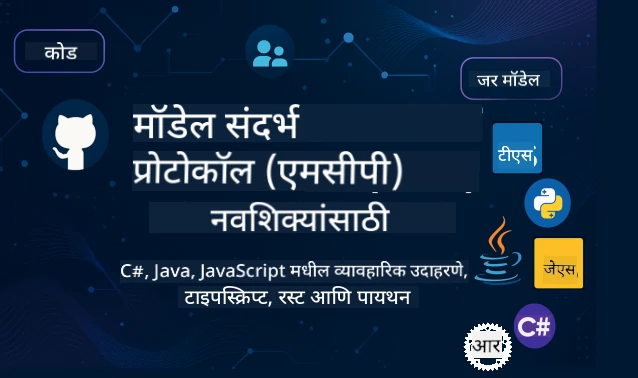

 

[](https://GitHub.com/microsoft/mcp-for-beginners/graphs/contributors)
[](https://GitHub.com/microsoft/mcp-for-beginners/issues)
[](https://GitHub.com/microsoft/mcp-for-beginners/pulls)
[](http://makeapullrequest.com)

[](https://GitHub.com/microsoft/mcp-for-beginners/watchers)
[](https://GitHub.com/microsoft/mcp-for-beginners/fork)
[](https://GitHub.com/microsoft/mcp-for-beginners/stargazers)


[](https://discord.gg/nTYy5BXMWG)

या संसाधनांचा वापर सुरू करण्यासाठी खालील चरणांचे अनुसरण करा:
1. **रेकॉजिटरी फोर्क करा**: क्लिक करा [](https://GitHub.com/microsoft/mcp-for-beginners/fork)
2. **रेकॉजिटरी क्लोन करा**:  `git clone https://github.com/microsoft/mcp-for-beginners.git`
3. **या मध्ये जा** [](https://discord.gg/nTYy5BXMWG)


### 🌐 बहुभाषिक समर्थन

#### GitHub Action द्वारे समर्थित (स्वयंचलित आणि नेहमी अद्ययावत)

<!-- CO-OP TRANSLATOR LANGUAGES TABLE START -->
[Arabic](../ar/README.md) | [Bengali](../bn/README.md) | [Bulgarian](../bg/README.md) | [Burmese (Myanmar)](../my/README.md) | [Chinese (Simplified)](../zh-CN/README.md) | [Chinese (Traditional, Hong Kong)](../zh-HK/README.md) | [Chinese (Traditional, Macau)](../zh-MO/README.md) | [Chinese (Traditional, Taiwan)](../zh-TW/README.md) | [Croatian](../hr/README.md) | [Czech](../cs/README.md) | [Danish](../da/README.md) | [Dutch](../nl/README.md) | [Estonian](../et/README.md) | [Finnish](../fi/README.md) | [French](../fr/README.md) | [German](../de/README.md) | [Greek](../el/README.md) | [Hebrew](../he/README.md) | [Hindi](../hi/README.md) | [Hungarian](../hu/README.md) | [Indonesian](../id/README.md) | [Italian](../it/README.md) | [Japanese](../ja/README.md) | [Kannada](../kn/README.md) | [Korean](../ko/README.md) | [Lithuanian](../lt/README.md) | [Malay](../ms/README.md) | [Malayalam](../ml/README.md) | [Marathi](./README.md) | [Nepali](../ne/README.md) | [Nigerian Pidgin](../pcm/README.md) | [Norwegian](../no/README.md) | [Persian (Farsi)](../fa/README.md) | [Polish](../pl/README.md) | [Portuguese (Brazil)](../pt-BR/README.md) | [Portuguese (Portugal)](../pt-PT/README.md) | [Punjabi (Gurmukhi)](../pa/README.md) | [Romanian](../ro/README.md) | [Russian](../ru/README.md) | [Serbian (Cyrillic)](../sr/README.md) | [Slovak](../sk/README.md) | [Slovenian](../sl/README.md) | [Spanish](../es/README.md) | [Swahili](../sw/README.md) | [Swedish](../sv/README.md) | [Tagalog (Filipino)](../tl/README.md) | [Tamil](../ta/README.md) | [Telugu](../te/README.md) | [Thai](../th/README.md) | [Turkish](../tr/README.md) | [Ukrainian](../uk/README.md) | [Urdu](../ur/README.md) | [Vietnamese](../vi/README.md)

> **स्थानिकरीत्या क्लोन करणे प्राधान्य द्यायचे आहे का?**
>
> ह्या रेकॉजिटरीमध्ये ५०+ भाषांतील भाषांतर आहेत ज्यामुळे डाउनलोड आकार लक्षणीयपणे वाढतो. भाषांतरांशिवाय क्लोन करण्यासाठी sparse checkout वापरा:
>
> **Bash / macOS / Linux:**
> ```bash
> git clone --filter=blob:none --sparse https://github.com/microsoft/mcp-for-beginners.git
> cd mcp-for-beginners
> git sparse-checkout set --no-cone '/*' '!translations' '!translated_images'
> ```
>
> **CMD (Windows):**
> ```cmd
> git clone --filter=blob:none --sparse https://github.com/microsoft/mcp-for-beginners.git
> cd mcp-for-beginners
> git sparse-checkout set --no-cone "/*" "!translations" "!translated_images"
> ```
>
> यामुळे आपल्याला कोर्स पूर्ण करण्यासाठी आवश्यक असलेले सर्व काही मिळेल, तेही अधिक जलद डाउनलोडसह.
<!-- CO-OP TRANSLATOR LANGUAGES TABLE END -->

# 🚀 मॉडेल संदर्भ प्रोटोकॉल (MCP) अभ्यासक्रम सुरुवातीसाठी

## **C#, Java, JavaScript, Rust, Python, आणि TypeScript मध्ये हाताळणी-आधारित कोड उदाहरणांसह MCP शिका**

## 🧠 मॉडेल संदर्भ प्रोटोकॉल अभ्यासक्रमाचे अवलोकन
मॉडेल संदर्भ प्रोटोकॉलमध्ये तुमच्या प्रवासात स्वागत आहे! जर तुम्हाला कधीही कुतूहल वाटले असेल की AI अनुप्रयोग कसे वेगवेगळ्या साधने आणि सेवांशी संवाद साधतात, तर तुम्ही जाणून घेणार आहात तो सुंदर उपाय ज्यामुळे विकसक बुद्धिमान प्रणाली तयार करण्याचा मार्ग बदलत आहे.

MCP ला AI अनुप्रयोगांसाठी एक सार्वत्रिक भाषांतरकार मानू शकता - जसे USB पोर्ट तुमच्या संगणकाला कोणतेही साधन जोडू देतात, त्याप्रमाणे MCP AI मॉडेल्सना कोणत्याही साधन किंवा सेवेशी एकसारख्या पद्धतीने जोडू देतो. तुम्ही तुमचा पहिला चॅटबॉट तयार करत असाल किंवा क्लिष्ट AI कार्यप्रवाहांवर काम करत असाल, MCP समजून घेणे तुम्हाला अधिक सक्षम आणि लवचिक अनुप्रयोग तयार करण्याची ताकद देईल.

हा अभ्यासक्रम तुमच्या शिकण्याच्या प्रवासासाठी संयम आणि काळजीने तयार केला आहे. आपण आधीपासूनच समजणाऱ्या सोप्या संकल्पना वापरून सुरुवात करू आणि नंतर आपल्या आवडत्या प्रोग्रामिंग भाषेमध्ये स्वरूपन-आधारित सरावामुळे तुमचे कौशल्य वाढवू. प्रत्येक टप्प्यात स्पष्ट स्पष्टीकरणे, व्यावहारिक उदाहरणे आणि भरपूर प्रोत्साहन समाविष्ट असेल.

तुम्ही हा प्रवास पूर्ण केल्यावर, तुम्हाला तुमचे स्वतःचे MCP सर्व्हर तयार करण्याचा आत्मविश्वास असेल, प्रसिद्ध AI प्लॅटफॉर्मसह त्यांचा समन्वय कसा करायचा ते समजेल आणि या तंत्रज्ञानामुळे AI विकासाचा भविष्यात कसा बदल होतो आहे हे समजेल. चला एकत्रितपणे हा रोमांचक अनुभव सुरू करूया!

### अधिकृत दस्तऐवज आणि तांत्रिक तपशील

हा अभ्यासक्रम **MCP स्पेसिफिकेशन २०२५-११-२५** (नवीनतम स्थिर आवृत्ती) शी संरेखित आहे. MCP स्पेसिफिकेशन दिनांक-आधारित आवृत्तीकरण वापरते (YYYY-MM-DD फॉर्मॅट) जे साफ प्रोटोकॉल आवृत्ती ट्रॅकिंग सुनिश्चित करते.

हे संसाधने तुमच्या समजुतीनुसार अधिक मौल्यवान होतील, परंतु लगेच सर्व काही वाचण्याचा ताण घेऊ नका. प्रथम तसे क्षेत्रे सुरू करा ज्यात तुमची सर्वात जास्त आवड आहे!
- 📘 [MCP दस्तऐवज](https://modelcontextprotocol.io/) – हा तुम्हाला पाऊलपाऊल ट्युटोरियल्स आणि वापरकर्ता मार्गदर्शकांसाठीचा मुख्य स्त्रोत आहे. दस्तऐवज नवशिक्यांसाठी लिहिला आहे, ज्यामुळे तुम्ही तुमच्या गतीने सोप्या उदाहरणांसह अनुसरण करू शकता.
- 📜 [MCP स्पेसिफिकेशन](https://modelcontextprotocol.io/specification/2025-11-25) – हे तुम्हाला एक व्यापक संदर्भ मॅन्युअल सारखे आहे. अभ्यासक्रमादरम्यान, तुम्हाला विशिष्ट तपशील शोधण्यासाठी आणि प्रगत वैशिष्ट्ये शोधण्यासाठी येथे वेळोवेळी परत येण्याची आवश्यकता भासेल.
- 📜 [MCP स्पेसिफिकेशन आवृत्तीकरण](https://modelcontextprotocol.io/specification/versioning) – यात प्रोटोकॉल आवृत्ती इतिहास आणि MCP ची दिनांक-आधारित आवृत्तीकरण (YYYY-MM-DD) कसे वापरते याची माहिती आहे.
- 🧑‍💻 [MCP GitHub रेकॉजिटरी](https://github.com/modelcontextprotocol) – येथे तुम्हाला SDKs, साधने, आणि अनेक प्रोग्रामिंग भाषांतील कोड नमुने सापडतील. हे व्यावहारिक उदाहरणे आणि तयार वापरासाठी घटकांचे खजिना सारखे आहे.
- 🌐 [MCP समुदाय](https://github.com/orgs/modelcontextprotocol/discussions) – इथे तुम्ही MCP विषयी चर्चा करण्यासाठी इतर शिकणाऱ्या आणि अनुभवी विकसकांसोबत सामील होऊ शकता. हे एक सहायक समुदाय आहे जिथे प्रश्न विचारायला उत्साह आहे आणि ज्ञान मुक्तपणे वाटले जाते.
  
## शैक्षणिक उद्दिष्टे

या अभ्यासक्रमाच्या शेवटी, तुम्हाला तुमच्या नव्या कौशल्यांबद्दल आत्मविश्वास आणि उत्साह वाटेल. येथे तुम्ही काय साध्य कराल:

• **MCP मूलभूत समजून घ्या**: तुम्हाला मॉडेल संदर्भ प्रोटोकॉल काय आहे आणि तो AI अनुप्रयोग कसे एकत्र काम करतात हे कसे बदलत आहे ते समजेल, अशी उदाहरणे आणि उपमांद्वारे जी सहज समजेल.

• **तुमचा पहिला MCP सर्व्हर तयार करा**: तुम्ही तुमच्या पसंतीच्या प्रोग्रामिंग भाषेत कार्यरत MCP सर्व्हर तयार कराल, सोप्या उदाहरणांपासून सुरवात करून कौशल्य क्रमाने वाढवाल.

• **AI मॉडेलना खऱ्या साधनांशी जोडा**: तुम्ही शिकाल AI मॉडेल आणि प्रत्यक्ष सेवा यामध्ये कसे पूल तयार करायचे, ज्यामुळे तुमच्या अनुप्रयोगांना नवीन शक्तिशाली क्षमता मिळतील.

• **सुरक्षा सर्वोत्तम पद्धती अमलात आणा**: तुम्हाला तुमच्या MCP अंमलबजावण्या सुरक्षित ठेवण्याचे आणि वापरकर्त्यांना सुरक्षित ठेवण्याचे मार्ग समजतील.

• **आत्मविश्वासाने तैनात करा**: तुम्हाला माहिती असेल की विकासापासून उत्पादनापर्यंत MCP प्रकल्प कसे नेायचे, यासाठी व्यावहारिक तैनाती धोरणे वापरली जातात.

• **MCP समुदायात सहभागी व्हा**: तुम्ही AI अनुप्रयोग विकासाच्या भविष्यात योगदान देणाऱ्या वाढत्या समुदायाचा भाग व्हाल.

## आवश्यक पार्श्वभूमी

आम्ही MCP विशिष्ट गोष्टीत खोलात जाण्यापूर्वी, काही मूलभूत संकल्पनांशी आरामदायक होऊया. जर तुम्ही या क्षेत्रांत तज्ज्ञ नसाल तरी काळजी करू नका - आम्ही तुम्हाला सर्व काही समजावून सांगू!

### प्रोटोकॉल समजून घ्या (मूलाधार)

प्रोटोकॉल म्हणजे संभाषणाचे नियम असे समजा. जेव्हा तुम्ही मित्राला कॉल करता, तेव्हा तुम्ही दोघेही "हॅलो" म्हणायला आणि नंतर बोलण्यासाठी पालटून काम करण्यासाठी आणि शेवटी "गुडबाय" म्हणायला जाणून असता. संगणक प्रोग्राम्सला अशाच नियमांची गरज असते ज्यामुळे ते परिणामकारक संवाद साधू शकतात.

MCP हा एक प्रोटोकॉल आहे - एक ठराविक नियमांची मालिका ज्यामुळे AI मॉडेल्स आणि अनुप्रयोग साधने आणि सेवांशी फलदायी "संवाद" करू शकतात. जसे संभाषण नियम मानव संवाद सुलभ करतात, तसाच MCP AI अनुप्रयोगांच्या संवादाला अधिक विश्वसनीय आणि सामर्थ्यशाली बनवतो.

### क्लायंट-सर्व्हर संबंध (प्रोग्राम्स कसे एकत्र काम करतात)

तुम्ही रोज क्लायंट-सर्व्हर संबंधांचा वापर करता! जेव्हा तुम्ही वेब ब्राउझर (क्लायंट) वापरून एखादा वेबसाइट भेट देता, तेव्हा तुम्ही त्या वेबसाइटच्या सर्व्हरशी कनेक्ट करता जो तुम्हाला पृष्ठाचा मजकूर पाठवतो. ब्राउझर माहिती कशी मागायची हे जाणते आणि सर्व्हर कसे प्रतिसाद द्यायचा ते माहित असते.

MCP मध्ये देखील अशीच एक संबंध आहे: AI मॉडेल क्लायंट म्हणून काम करतात जे माहिती किंवा क्रिया मागते, तर MCP सर्व्हर त्या क्षमता प्रदान करतात. हे एखाद्या मदतनीस सारखे आहे (सर्व्हर) ज्याला AI विशिष्ट कामे करण्यास सांगू शकते.

### का मानकीकरण महत्त्वाचे आहे (सगळं नीट काम करण्यासाठी)

कल्पना करा की प्रत्येक कार उत्पादक वेगवेगळ्या आकाराचे गॅस पंप वापरत असेल - प्रत्येक कारसाठी तुम्हाला वेगवेगळा अ‍ॅडॉप्टर हवा लागेल! मानकीकरण म्हणजे एकसारख्या पद्धतींवर सहमती साधणे ज्यामुळे सगळे एकत्र सुसंगतपणे काम करतात.

MCP AI अनुप्रयोगांसाठी हे मानकीकरण पुरवतो. प्रत्येक AI मॉडेलला प्रत्येक साधनासाठी वेगळा कोड बनवण्याची गरज नाही; MCP सर्वांसाठी संवादाचे सार्वत्रिक मार्ग तयार करतो. याचा अर्थ विकसक एकदाच साधने तयार करतात आणि ती अनेक AI प्रणालींसोबत वापरली जातात.

## 🧭 तुमचा शिकण्याचा मार्गावरील अवलोकन

तुमचा MCP प्रवास काळजीपूर्वक मांडलेला आहे ज्यामुळे तुमचा आत्मविश्वास आणि कौशल्ये क्रमाने वाढतील. प्रत्येक टप्पा नवीन संकल्पना सादर करतो आणि आधी शिकलात त्यावर पुनरावृत्ती करतो.

### 🌱 मूलाधार टप्पा: मूलतत्त्व समजून घेणे (मॉड्यूल 0-2)

इथे तुमचा प्रवास सुरू होतो! आम्ही MCP संकल्पनांचा परिचय परिचित उपमांसह आणि सोप्या उदाहरणांसह करून देऊ. तुम्हाला MCP काय आहे, तो का आहे आणि AI विकासाच्या मोठ्या जगात त्याचे स्थान काय आहे हे समजेल.

• **मॉड्यूल 0 - MCP परिचय**: आम्ही सुरूवात करू की MCP काय आहे आणि आधुनिक AI अनुप्रयोगांसाठी ते का महत्त्वाचे आहे हे शोधून पाहू. तुम्हाला प्रत्यक्ष MCP कसे कार्यरत आहे याची उदाहरणे दिसतील आणि विकसकांना समसामयिक समस्या कशी सोडवते हे समजेल.

• **मॉड्यूल 1 - मुख्य संकल्पना स्पष्ट करणं**: येथे तुम्हाला MCP चे आवश्यक घटक शिकवले जातील. आम्ही भरपूर उपमा आणि दृश्य उदाहरणे वापरू जेणेकरून ही संकल्पना नैसर्गिक आणि समजण्यास सोपी जातील.

• **मॉड्यूल 2 - MCP मधील सुरक्षा**: सुरक्षा काहीशी भीतीदायक वाटू शकते, परंतु आम्ही दाखवू की MCP मध्ये पूर्वनिर्धारित सुरक्षा वैशिष्ट्ये आहेत आणि तुम्हाला सुरुवातीपासूनच अनुप्रयोगांना सुरक्षित ठेवण्यासाठी सर्वोत्तम पद्धती शिकवू.

### 🔨 बांधकाम टप्पा: तुमच्या पहिल्या अंमलबजावणी तयार करणे (मॉड्यूल 3)

आता खरी मजा सुरू होते! तुम्हाला प्रत्यक्ष MCP सर्व्हर आणि क्लायंट तयार करण्याचा अनुभव मिळेल. काळजी करू नका - आम्ही सोप्या पासून सुरू करून प्रत्येक टप्प्यावर मार्गदर्शन करू.
हा मॉड्यूल विविध हाताळणी मार्गदर्शकांचा समावेश करतो ज्यामुळे तुम्हाला तुमच्या आवडत्या प्रोग्रामिंग भाषेत सराव करण्याची संधी मिळते. तुम्ही तुमचा पहिला सर्व्हर तयार कराल, त्याला जोडण्यासाठी क्लायंट बनवाल, आणि VS Code सारख्या लोकप्रिय विकास साधनांशी एकत्रीकरण देखील कराल.

प्रत्येक मार्गदर्शकात पूर्ण कोड उदाहरणे, समस्या निवारण टिपा, आणि आपण विशिष्ट डिझाइन निवडी का करतो याचे स्पष्टीकरण दिलेले आहे. या टप्प्याच्या शेवटी, तुमच्याकडे काम करणाऱ्या MCP अंमलबजावण्या असतील ज्याचा तुम्हाला अभिमान असेल!

### 🚀 वाढीचा टप्पा: प्रगत संकल्पना आणि व्यावहारिक वापर (मॉड्यूल ४-५)

मूलभूत गोष्टी अवगत झाल्यानंतर, तुम्ही अधिक प्रगत MCP वैशिष्ट्यांचा शोध घेण्यासाठी तयार आहात. आपण व्यावहारिक अंमलबजावणीच्या धोरणांवर, दोष निराकरण तंत्रांवर, आणि बहुअंगी AI एकत्रीकरणासारख्या प्रगत विषयांवर लक्ष देऊ.

तसेच, तुम्हाला उत्पादनासाठी तुमच्या MCP अंमलबजावण्या कशा प्रमाणित करायच्या आणि Azure सारख्या क्लाउड प्लॅटफॉर्मशी एकत्रीकरण कसे करायचे हे शिकायला मिळेल. हे मॉड्यूल तुम्हाला वास्तविक जगातील मागण्या हाताळू शकणारी MCP सोल्यूशन्स तयार करण्यास सक्षम करतात.

### 🌟 प्रावीण्याचा टप्पा: समुदाय आणि विशिष्ट कौशल्ये (मॉड्यूल ६-११)

अंतिम टप्पा ही MCP समुदायामध्ये सहभागी होण्यावर आणि तुम्हाला सर्वाधिक आवडणाऱ्या क्षेत्रांमध्ये विशेष ज्ञान प्राप्त करण्यावर केंद्रित आहे. तुम्ही ओपन सोर्स MCP प्रकल्पांमध्ये कसे योगदान द्यायचे, प्रगत प्रमाणीकरण नमुने कसे राबवायचे, आणि संपूर्ण डेटाबेस एकत्रित सोल्यूशन्स कसे तयार करायचे हे शिकाल.

मॉड्यूल ११ विशेष उल्लेखनीय आहे - हा १३-लॅबचा पूर्ण हाताळणी अभ्यासक्रम आहे जो तुम्हाला PostgreSQL एकत्रीकरणासह उत्पादन-तयार MCP सर्व्हर बांधायला शिकवतो. हे तिथे एक कॅपस्टोन प्रकल्पासारखे आहे जे तुम्हाला शिकलात ते सगळं एकत्र आणतो!

### 📚 पूर्ण अभ्यासक्रमाची रचना

| मॉड्यूल | विषय | वर्णन | दुवा |
|--------|-------|-------------|------|
| **मॉड्यूल ०-३: मूलभूत गोष्टी** | | | |
| ०० | MCP परिचय | मॉडेल कॉन्टेक्स्ट प्रोटोकॉलचे आढावा आणि AI पाईपलाईन्समधील त्याचे महत्त्व | [अधिक वाचा](./00-Introduction/README.md) |
| ०१ | मुख्य संकल्पना समजावून सांगितल्या | मुख्य MCP संकल्पनांचा सखोल अभ्यास | [अधिक वाचा](./01-CoreConcepts/README.md) |
| ०२ | MCP मधील सुरक्षा | सुरक्षा धोके आणि सर्वोत्तम पद्धती | [अधिक वाचा](./02-Security/README.md) |
| ०३ | MCP सह सुरूवात | पर्यावरण सेटअप, मूलभूत सर्व्हर/क्लायंट, एकत्रीकरण | [अधिक वाचा](./03-GettingStarted/README.md) |
| **मॉड्यूल ३: तुमचा पहिला सर्व्हर आणि क्लायंट तयार करणे** | | | |
| ३.१ | पहिला सर्व्हर | तुमचा पहिला MCP सर्व्हर तयार करा | [मार्गदर्शक](./03-GettingStarted/01-first-server/README.md) |
| ३.२ | पहिला क्लायंट | एक मूलभूत MCP क्लायंट विकसित करा | [मार्गदर्शक](./03-GettingStarted/02-client/README.md) |
| ३.३ | LLM सह क्लायंट | मोठ्या भाषा मॉडेल्सचे एकत्रीकरण करा | [मार्गदर्शक](./03-GettingStarted/03-llm-client/README.md) |
| ३.४ | VS Code एकत्रीकरण | MCP सर्व्हर VS Code मध्ये वापरा | [मार्गदर्शक](./03-GettingStarted/04-vscode/README.md) |
| ३.५ | stdio सर्व्हर | stdio ट्रान्सपोर्ट वापरून सर्व्हर तयार करा | [मार्गदर्शक](./03-GettingStarted/05-stdio-server/README.md) |
| ३.६ | HTTP स्ट्रीमिंग | MCP मध्ये HTTP स्ट्रीमिंग अंमलबजावणी करा | [मार्गदर्शक](./03-GettingStarted/06-http-streaming/README.md) |
| ३.७ | AI टूलकिट | MCP सह AI टूलकिट वापरा | [मार्गदर्शक](./03-GettingStarted/07-aitk/README.md) |
| ३.८ | चाचणी | तुमच्या MCP सर्व्हरची चाचणी करा | [मार्गदर्शक](./03-GettingStarted/08-testing/README.md) |
| ३.९ | वितरण | उत्पादनात MCP सर्व्हर तैनात करा | [मार्गदर्शक](./03-GettingStarted/09-deployment/README.md) |
| ३.१० | प्रगत सर्व्हर वापर | प्रगत वैशिष्ट्यांसाठी प्रगत सर्व्हर्स वापरा आणि सुधारित आर्किटेक्चर तयार करा | [मार्गदर्शक](./03-GettingStarted/10-advanced/README.md) |
| ३.११ | साधे प्रमाणीकरण | सुरुवातीपासून प्रमाणीकरण आणि RBAC शिकवणारा अध्याय | [मार्गदर्शक](./03-GettingStarted/11-simple-auth/README.md) |
| ३.१२ | MCP होस्ट्स | Claude Desktop, Cursor, Cline आणि इतर MCP होस्ट्स सेटअप करा | [मार्गदर्शक](./03-GettingStarted/12-mcp-hosts/README.md) |
| ३.१३ | MCP निरीक्षक | Inspector टूलने MCP सर्व्हर डिबग आणि चाचणी करा | [मार्गदर्शक](./03-GettingStarted/13-mcp-inspector/README.md) |
| ३.१४ | सॅम्पलिंग | क्लायंटशी सहकार्य करण्यासाठी सॅम्पलिंग वापरा | [मार्गदर्शक](./03-GettingStarted/14-sampling/README.md) |
| ३.१५ | MCP अ‍ॅप्स | MCP अ‍ॅप्स तयार करा | [मार्गदर्शक](./03-GettingStarted/15-mcp-apps/README.md) |

| **मॉड्यूल ४-५: व्यावहारिक आणि प्रगत** | | | |
| ०४ | व्यावहारिक अंमलबजावणी | SDKs, डिबगींग, चाचणी, पुनर्वापर करण्यायोग्य प्रॉम्प्ट साचे | [अधिक वाचा](./04-PracticalImplementation/README.md) |
| ४.१ | पेजिनेशन | कर्सर-आधारित पेजिनेशनसह मोठ्या निकाल संच हाताळा | [मार्गदर्शक](./04-PracticalImplementation/pagination/README.md) |
| ०५ | MCP मधील प्रगत विषय | बहुआंगी AI, प्रमाणांकन, एंटरप्राइझ वापर | [अधिक वाचा](./05-AdvancedTopics/README.md) |
| ५.१ | Azure एकत्रीकरण | Azure सह MCP एकत्रीकरण | [मार्गदर्शक](./05-AdvancedTopics/mcp-integration/README.md) |
| ५.२ | बहुमाध्यमी | अनेक माध्यमांसह काम करणे | [मार्गदर्शक](./05-AdvancedTopics/mcp-multi-modality/README.md) |
| ५.३ | OAuth2 डेमो | OAuth2 प्रमाणीकरण अंमलबजावणी करा | [मार्गदर्शक](./05-AdvancedTopics/mcp-oauth2-demo/README.md) |
| ५.४ | मूळ संदर्भ | मूळ संदर्भ समजून घ्या आणि राबवा | [मार्गदर्शक](./05-AdvancedTopics/mcp-root-contexts/README.md) |
| ५.५ | राऊटिंग | MCP राऊटिंग धोरणे | [मार्गदर्शक](./05-AdvancedTopics/mcp-routing/README.md) |
| ५.६ | सॅम्पलिंग | MCP मध्ये सॅम्पलिंग तंत्र | [मार्गदर्शक](./05-AdvancedTopics/mcp-sampling/README.md) |
| ५.७ | प्रमाणांकन | MCP अंमलबजावण्या प्रमाणित करा | [मार्गदर्शक](./05-AdvancedTopics/mcp-scaling/README.md) |
| ५.८ | सुरक्षा | प्रगत सुरक्षा बाबींचा विचार करा | [मार्गदर्शक](./05-AdvancedTopics/mcp-security/README.md) |
| ५.९ | वेब शोध | वेब शोध क्षमता अंमलात आणा | [मार्गदर्शक](./05-AdvancedTopics/web-search-mcp/README.md) |
| ५.१० | रिअलटाइम स्ट्रीमिंग | रिअलटाइम स्ट्रीमिंग कार्यक्षमता तयार करा | [मार्गदर्शक](./05-AdvancedTopics/mcp-realtimestreaming/README.md) |
| ५.११ | रिअलटाइम शोध | रिअलटाइम शोध अंमलबजावणी करा | [मार्गदर्शक](./05-AdvancedTopics/mcp-realtimesearch/README.md) |
| ५.१२ | Entra ID प्रमाणीकरण | मायक्रोसॉफ्ट Entra ID सह प्रमाणीकरण | [मार्गदर्शक](./05-AdvancedTopics/mcp-security-entra/README.md) |
| ५.१३ | Foundry एकत्रीकरण | Azure AI Foundry सोबत एकत्रित करा | [मार्गदर्शक](./05-AdvancedTopics/mcp-foundry-agent-integration/README.md) |
| ५.१४ | संदर्भ अभियांत्रिकी | प्रभावी संदर्भ अभियांत्रिकीचे तंत्र | [मार्गदर्शक](./05-AdvancedTopics/mcp-contextengineering/README.md) |
| ५.१५ | MCP सानुकूल ट्रान्सपोर्ट | सानुकूल ट्रान्सपोर्ट अंमलबजावणी | [मार्गदर्शक](./05-AdvancedTopics/mcp-transport/README.md) |
| ५.१६ | प्रोटोकॉल वैशिष्ट्ये | प्रगती सूचना, रद्द करणे, संसाधन सांचे | [मार्गदर्शक](./05-AdvancedTopics/mcp-protocol-features/README.md) |
| **मॉड्यूल ६-१०: समुदाय आणि सर्वोत्तम पद्धती** | | | |
| ०६ | समुदाय योगदान | MCP इकोसिस्टममध्ये कसे योगदान द्यावे | [मार्गदर्शक](./06-CommunityContributions/README.md) |
| ०७ | लवकर स्वीकारण्याच्या अनुभवातून | वास्तविक जगातील अंमलबजावणी कथा | [मार्गदर्शक](./07-LessonsfromEarlyAdoption/README.md) |
| ०८ | MCP साठी सर्वोत्तम पद्धती | कामगिरी, दोष सहनशक्ती, लवचिकता | [मार्गदर्शक](./08-BestPractices/README.md) |
| ०९ | MCP प्रकरण अभ्यास | व्यावहारिक अंमलबजावणी उदाहरणे | [मार्गदर्शक](./09-CaseStudy/README.md) |
| १० | हाताळणी कार्यशाळा | AI टूलकिटसह MCP सर्व्हर तयार करणे | [प्रयोगशाळा](./10-StreamliningAIWorkflowsBuildingAnMCPServerWithAIToolkit/README.md) |
| **मॉड्यूल ११: MCP सर्व्हर हाताळणी प्रयोगशाळा** | | | |
| ११ | MCP सर्व्हर डेटाबेस एकत्रीकरण | PostgreSQL एकत्रीकरणासाठी सर्वसमावेशक १३-लॅब हाताळणी अभ्यासक्रम | [प्रयोगशाळा](./11-MCPServerHandsOnLabs/README.md) |
| ११.१ | परिचय | डेटाबेस एकत्रीकरणासह MCP चे आढावा आणि रिटेल अॅनालिटिक्स वापर प्रकरण | [प्रयोगशाळा ००](./11-MCPServerHandsOnLabs/00-Introduction/README.md) |
| ११.२ | मुख्य आर्किटेक्चर | MCP सर्व्हर आर्किटेक्चर, डेटाबेस स्तर, आणि सुरक्षा नमुने समजून घ्या | [प्रयोगशाळा ०१](./11-MCPServerHandsOnLabs/01-Architecture/README.md) |
| ११.३ | सुरक्षा आणि मल्टी-टेनेन्सी | रो लेव्हल सुरक्षा, प्रमाणीकरण, आणि बहु-भाडेकरू डेटा प्रवेश | [प्रयोगशाळा ०२](./11-MCPServerHandsOnLabs/02-Security/README.md) |
| ११.४ | पर्यावरण सेटअप | विकास पर्यावरण सेटअप, डॉकर, Azure संसाधने | [प्रयोगशाळा ०३](./11-MCPServerHandsOnLabs/03-Setup/README.md) |
| ११.५ | डेटाबेस डिझाइन | PostgreSQL सेटअप, रिटेल स्कीमा डिझाइन, आणि नमुना डेटा | [प्रयोगशाळा ०४](./11-MCPServerHandsOnLabs/04-Database/README.md) |
| ११.६ | MCP सर्व्हर अंमलबजावणी | डेटाबेस एकत्रीकरणासह FastMCP सर्व्हर तयार करणे | [प्रयोगशाळा ०५](./11-MCPServerHandsOnLabs/05-MCP-Server/README.md) |
| ११.७ | साधन विकसन | डेटाबेस क्वेरी साधने आणि स्कीमा निरीक्षण तयार करणे | [प्रयोगशाळा ०६](./11-MCPServerHandsOnLabs/06-Tools/README.md) |
| ११.८ | सेमँटिक शोध | Azure OpenAI आणि pgvector सह व्हेक्टर एंबेडिंग्ज अंमलबजावणी | [प्रयोगशाळा ०७](./11-MCPServerHandsOnLabs/07-Semantic-Search/README.md) |
| ११.९ | चाचणी आणि डिबगींग | चाचणी धोरणे, डिबगींग साधने, आणि प्रमाणीकरण पद्धती | [प्रयोगशाळा ०८](./11-MCPServerHandsOnLabs/08-Testing/README.md) |
| ११.१० | VS Code एकत्रीकरण | VS Code MCP एकत्रीकरण आणि AI चॅट वापर सेटअप | [प्रयोगशाळा ०९](./11-MCPServerHandsOnLabs/09-VS-Code/README.md) |
| ११.११ | वितरण धोरणे | डॉकर वितरण, Azure कंटेनर अ‍ॅप्स, आणि प्रमाणांकन विचार | [प्रयोगशाळा १०](./11-MCPServerHandsOnLabs/10-Deployment/README.md) |
| ११.१२ | निरीक्षण | अनुप्रयोग अंतर्दृष्टी, लॉगिंग, कामगिरी निरीक्षण | [प्रयोगशाळा ११](./11-MCPServerHandsOnLabs/11-Monitoring/README.md) |
| ११.१३ | सर्वोत्तम पद्धती | कामगिरी सुधारणा, सुरक्षा वाढवणे, आणि उत्पादनाचा सल्ला | [प्रयोगशाळा १२](./11-MCPServerHandsOnLabs/12-Best-Practices/README.md) |

### 💻 नमुना कोड प्रकल्प

MCP शिकण्याचा एक सर्वात रोमांचक भाग म्हणजे तुमच्या कोड कौशल्यांचा क्रमिक विकास पाहणे. आम्ही आमची कोड उदाहरणे सोपी ठेवली आहेत आणि जसे तुमची समज वाढते तशी ती अधिक प्रगत बनतात. आम्ही संकल्पना कशा सादर करतो याचा एक भाग येथे आहे - समजायला सोपा पण वास्तवातील MCP तत्त्वे दाखवणारा कोड, ज्यामुळे तुम्हाला फक्त कोड काय करतो हेच नाही तर तो का व कसा रचलेला आहे, आणि तो मोठ्या MCP अ‍ॅप्लिकेशन्समध्ये कसा बसतो हे समजेल.

#### मूलभूत MCP कॅल्क्युलेटर नमुने

| भाषा | वर्णन | दुवा |
|----------|-------------|------|
| C# | MCP सर्व्हर उदाहरण | [कोड पहा](./03-GettingStarted/samples/csharp/README.md) |
| Java | MCP कॅल्क्युलेटर | [कोड पहा](./03-GettingStarted/samples/java/calculator/README.md) |
| JavaScript | MCP डेमो | [कोड पहा](./03-GettingStarted/samples/javascript/README.md) |
| Python | MCP सर्व्हर | [कोड पहा](../../03-GettingStarted/samples/python/mcp_calculator_server.py) |
| TypeScript | MCP उदाहरण | [कोड पहा](./03-GettingStarted/samples/typescript/README.md) |
| Rust | MCP उदाहरण | [कोड पहा](./03-GettingStarted/samples/rust/README.md) |

#### प्रगत MCP अंमलबजावण्या

| भाषा | वर्णन | दुवा |
|----------|-------------|------|
| C# | प्रगत नमुना | [कोड पहा](./04-PracticalImplementation/samples/csharp/README.md) |
| Java with Spring | कंटेनर अ‍ॅप उदाहरण | [कोड पहा](./04-PracticalImplementation/samples/java/containerapp/README.md) |
| JavaScript | प्रगत नमुना | [कोड पहा](./04-PracticalImplementation/samples/javascript/README.md) |
| Python | जटिल अंमलबजावणी | [कोड पहा](./04-PracticalImplementation/samples/python/README.md) |
| TypeScript | कंटेनर नमुना | [कोड पहा](./04-PracticalImplementation/samples/typescript/README.md) |


## 🎯 MCP शिकण्यासाठी आवश्यक पूर्वतयारी

या अभ्यासक्रमातून सर्वाधिक फायदा घेण्यासाठी, तुमच्याकडे असणे आवश्यक आहे:
- खालीलपैकी किमान एका भाषेत प्रोग्रामिंगचे मूलभूत ज्ञान: C#, Java, JavaScript, Python, किंवा TypeScript
- क्लायंट-सर्व्हर मॉडेल आणि API समज
- REST आणि HTTP संकल्पनांची परिचय
- (ऐच्छिक) AI/ML संकल्पनांचा पार्श्वभूमी

- आमच्या समुदाय चर्चेत सामील होऊन समर्थन मिळवा

## 📚 अभ्यास मार्गदर्शक आणि स्रोत

हा रेपॉझिटरी तुम्हाला मार्गदर्शन करण्यासाठी आणि प्रभावी शिकण्यासाठी अनेक संसाधने समाविष्ट करतो:

### अभ्यास मार्गदर्शक

एका सखोल [अभ्यास मार्गदर्शक](./study_guide.md) उपलब्ध आहे जो तुम्हाला या रेपॉझिटरीमध्ये प्रभावीपणे नेव्हिगेट करण्यात मदत करतो. हा दृश्य अभ्यासक्रम नकाशा कॉलेज सर्व विषयांतील कनेक्शन दर्शवितो आणि नमुना प्रकल्पांचा प्रभावी वापर कसा करावा याचे मार्गदर्शन करतो. तुमच्यासाठी फार उपयुक्त आहे जर तुम्ही दृश्यमान शिकणारे असाल आणि मोठा आराखडा पाहायला आवडत असेल.

मार्गदर्शकामध्ये समाविष्ट आहे:
- सर्व विषयांचा दृश्य अभ्यासक्रम नकाशा
- प्रत्येक रेपॉझिटरी विभागाचा सविस्तर तपशील
- नमुना प्रकल्प कसे वापरायचे यासंबंधी मार्गदर्शन
- विविध कौशल्य पातळ्यांसाठी शिफारस केलेले शिक्षण मार्ग
- तुमच्या शिक्षण प्रवासासाठी अतिरिक्त स्रोत

### बदलनोंचा नोंदवही

आम्ही एका सविस्तर [चेंजलॉग](./changelog.md) ठेवतो ज्यामध्ये अभ्यासक्रम सामग्रीतील सर्व महत्वाच्या बदला नोंदवल्या जातात, त्यामुळे तुम्ही नवीनतम सुधारणांबाबत अद्ययावत राहू शकता.
- नवीन सामग्रीचे समावेश
- संरचनात्मक बदल
- फिचर सुधारणा
- दस्तऐवज अद्यतने

## 🛠️ हा अभ्यासक्रम प्रभावीपणे कसा वापरायचा

या मार्गदर्शकातील प्रत्येक धडा यात समाविष्ट आहे:

1. MCP संकल्पनांचे स्पष्ट स्पष्टीकरण  
2. अनेक भाषांमध्ये लाइव्ह कोड उदाहरणे  
3. खऱ्या MCP अनुप्रयोगांसाठी व्यायाम  
4. प्रगत शिकणाऱ्यांसाठी अतिरिक्त स्रोत

### चला MCP C# सोबत शिकू - ट्युटोरियल मालिकाः
Model Context Protocol (MCP) विषयी जाणून घेऊया, एक अत्याधुनिक फ्रेमवर्क जो AI मॉडेल्स आणि क्लायंट अनुप्रयोगांमधील संवादासाठी प्रमाणित इंटरफेस तयार करतो. या प्रारंभी forफ्रेंडली सत्रात, आम्ही तुम्हाला MCP ची ओळख करून देऊ आणि तुमचा पहिला MCP सर्व्हर कसा तयार करायचा याचा मार्गदर्शन करू.
#### C#: [https://aka.ms/letslearnmcp-csharp](https://aka.ms/letslearnmcp-csharp)
#### Java: [https://aka.ms/letslearnmcp-java](https://aka.ms/letslearnmcp-java)
#### JavaScript: [https://aka.ms/letslearnmcp-javascript](https://aka.ms/letslearnmcp-javascript)
#### Python: [https://aka.ms/letslearnmcp-python](https://aka.ms/letslearnmcp-python)

## 🎓 तुमचा MCP प्रवास सुरू

अभिनंदन! तुम्ही एका रोमांचक प्रवासात पहिला टप्पा पार केला आहे ज्यामुळे तुमच्या प्रोग्रामिंग कौशल्यांचा विस्तार होईल आणि तुम्ही AI विकासाच्या आघाडीवर जोडले जाल.

### तुम्ही आधीच काय केलंय

या परिचयिकेच्या वाचनाद्वारे, तुम्ही MCP ज्ञानाचा पाया तयार करायला सुरुवात केली आहे. तुम्हाला MCP काय आहे, त्याचे महत्त्व काय आहे, आणि हा अभ्यासक्रम तुमच्या शिकण्याच्या प्रवासाला कसा पाठिंबा देईल हे समजले आहे. हा एक महत्वाचा मिळकत आहे आणि या महत्त्वाच्या तंत्रज्ञानातील तुमच्या तज्ज्ञतेचा प्रारंभ आहे.

### पुढील साहस

मॉड्युलमधून पुढे जाताना लक्षात ठेवा की प्रत्येक तज्ञ एकदा नवशिकता होता. ज्या संकल्पना तुम्हाला सध्या क्लिष्ट वाटत आहेत त्या सरावाने आणि वापराने सहज समजतील. प्रत्येक लहान पाऊल शक्तिशाली कौशल्यांच्या दिशेने नेईल जे तुमच्या संपूर्ण विकास कारकीर्दीत उपयोगी पडतील.

### तुमचा समर्थन नेटवर्क

तुम्ही अशा शिकणाऱ्या आणि तज्ज्ञांच्या समुदायात सामील होत आहात ज्यांना MCP विषयी आवड आहे आणि ते इतर लोकांना यशस्वी होण्यासाठी मदत करण्यास उत्सुक आहेत. कोडिंग आव्हानावर अडकलात किंवा एखादी नवीन कल्पना शेअर करायची आहे, समुदाय तुमच्या प्रवासाला साथ देण्यासाठी येथे आहे.

जर तुम्हाला अडचण आली किंवा AI अॅप्स तयार करण्याबाबत काही प्रश्न असतील तर इतर शिकणाऱ्यांशी आणि अनुभवी विकासकांशी चर्चा करा. हे एक सहायक समुदाय आहे जिथे प्रश्न विचारले जातात आणि ज्ञान मोकळेपणाने सामायिक केले जाते.

[](https://discord.gg/nTYy5BXMWG)

जर तुम्हाला उत्पादनाबाबत फीडबॅक किंवा अडचणी आल्या तर भेट द्या:

[](https://aka.ms/foundry/forum)

### तयार आहात का सुरूवात करण्यासाठी?

तुमचा MCP प्रवास आत्ताच सुरू होतो! Module 0 पासून सुरू करा आणि तुमचा पहिला प्रायोगिक MCP अनुभव मिळवा, किंवा नमुना प्रकल्पांचा अभ्यास करा जे काही तुम्ही तयार करणार आहात ते पाहण्यासाठी. लक्षात ठेवा - प्रत्येक तज्ञ तिथूनच सुरुवात करतो ज्यावर तुम्ही आहात, आणि संयमाने व सरावाने तुम्हाला आश्चर्यकारक प्रगती करता येईल.

Model Context Protocol विकासाच्या जगात तुमचे स्वागत आहे. चला एकत्र काही अद्भुत निर्माण करूया!

## 🤝 शिकणाऱ्या समुदायात वाटा उचलणे

हा अभ्यासक्रम तुमच्यासारख्या शिकणाऱ्यांच्या योगदानामुळे अधिक मजबूत होतो! तुम्ही चुकलेला शब्द सुधारणे, अधिक स्पष्ट स्पष्टीकरण सुचवणे, किंवा नवीन उदाहरण जोडणे – तुमचे योगदान इतर नवशिकत्यांना यशस्वी होण्यास मदत करते.

Microsoft Valued Professional [Shivam Goyal](https://www.linkedin.com/in/shivam2003/) यांचे आभार कोड नमुने प्रदान केल्याबद्दल.

योगदान प्रक्रिया स्वागतार्ह आणि सहायक बनविण्यासाठी डिझाइन केलेली आहे. बहुतेक योगदानांसाठी Contributor License Agreement (CLA) आवश्यक आहे, पण स्वयंचलित साधने तुम्हाला सहज मार्गदर्शन करतील.

## 📜 मुक्त स्रोत शिक्षण

हा संपूर्ण अभ्यासक्रम MIT [परवाना](../../LICENSE) अंतर्गत उपलब्ध आहे, ज्याचा अर्थ तुम्ही त्याचा मुक्तपणे वापर, सुधारणा आणि शेअर करू शकता. हे आमच्या मिशनला समर्थन देते जेणेकरून MCP ज्ञान विकसकांपर्यंत मुक्तपणे पोहोचवता येईल.

## 🤝 योगदान मार्गदर्शक

हा प्रकल्प योगदान आणि सूचना स्वागत करतो. बहुतेक योगदानांसाठी तुम्हाला Contributor License Agreement (CLA) सहमत असणे आवश्यक आहे, ज्यात तुम्ही तुमच्या योगदानाचा वापर करण्याचा अधिकार आम्हाला दिला असल्याचे घोषित करता. तपशीलांसाठी भेट द्या <https://cla.opensource.microsoft.com>.

जेव्हा तुम्ही पुल विनंती सबमिट करता, तेव्हा CLA बॉट आपोआप ठरवेल कि तुम्हाला CLA प्रदान करणे आवश्यक आहे का आणि ते PR योग्यरित्या सजवेल (उदा., स्थिती तपासणी, टिप्पणी). फक्त बॉट निर्देशांचे पालन करा. संपूर्ण रेपोवर हा एकदाच करावा लागेल.

या प्रकल्पाने [Microsoft Open Source Code of Conduct](https://opensource.microsoft.com/codeofconduct/) स्वीकारला आहे.
अधिक माहितीसाठी पहा [Code of Conduct FAQ](https://opensource.microsoft.com/codeofconduct/faq/) किंवा
[opencode@microsoft.com](mailto:opencode@microsoft.com) वर संपर्क करा.

---

*तयार आहात का तुमचा MCP प्रवास सुरू करण्यासाठी? प्रारंभ करा [Module 00 - Introduction to MCP](./00-Introduction/README.md) पासून आणि Model Context Protocol विकासाच्या जगात पहिले पाऊल टाका!*


## 🎒 इतर कोर्सेस
आमची टीम इतर कोर्सेसही तयार करते! तपासा:

<!-- CO-OP TRANSLATOR OTHER COURSES START -->
### LangChain
[](https://aka.ms/langchain4j-for-beginners)
[](https://aka.ms/langchainjs-for-beginners?WT.mc_id=m365-94501-dwahlin)
[](https://github.com/microsoft/langchain-for-beginners?WT.mc_id=m365-94501-dwahlin)
---

### Azure / Edge / MCP / Agents
[](https://github.com/microsoft/AZD-for-beginners?WT.mc_id=academic-105485-koreyst)
[](https://github.com/microsoft/edgeai-for-beginners?WT.mc_id=academic-105485-koreyst)
[](https://github.com/microsoft/mcp-for-beginners?WT.mc_id=academic-105485-koreyst)
[](https://github.com/microsoft/ai-agents-for-beginners?WT.mc_id=academic-105485-koreyst)

---
 
### जनरेटिव AI मालिका
[](https://github.com/microsoft/generative-ai-for-beginners?WT.mc_id=academic-105485-koreyst)
[-9333EA?style=for-the-badge&labelColor=E5E7EB&color=9333EA)](https://github.com/microsoft/Generative-AI-for-beginners-dotnet?WT.mc_id=academic-105485-koreyst)
[-C084FC?style=for-the-badge&labelColor=E5E7EB&color=C084FC)](https://github.com/microsoft/generative-ai-for-beginners-java?WT.mc_id=academic-105485-koreyst)
[-E879F9?style=for-the-badge&labelColor=E5E7EB&color=E879F9)](https://github.com/microsoft/generative-ai-with-javascript?WT.mc_id=academic-105485-koreyst)

---
 
### मूलभूत शिक्षण
[](https://aka.ms/ml-beginners?WT.mc_id=academic-105485-koreyst)
[](https://aka.ms/datascience-beginners?WT.mc_id=academic-105485-koreyst)
[](https://aka.ms/ai-beginners?WT.mc_id=academic-105485-koreyst)
[](https://github.com/microsoft/Security-101?WT.mc_id=academic-96948-sayoung)
[](https://aka.ms/webdev-beginners?WT.mc_id=academic-105485-koreyst)
[](https://aka.ms/iot-beginners?WT.mc_id=academic-105485-koreyst)
[](https://github.com/microsoft/xr-development-for-beginners?WT.mc_id=academic-105485-koreyst)

---
 
### Copilot मालिका
[](https://aka.ms/GitHubCopilotAI?WT.mc_id=academic-105485-koreyst)
[](https://github.com/microsoft/mastering-github-copilot-for-dotnet-csharp-developers?WT.mc_id=academic-105485-koreyst)
[](https://github.com/microsoft/CopilotAdventures?WT.mc_id=academic-105485-koreyst)
<!-- CO-OP TRANSLATOR OTHER COURSES END -->

---

<!-- CO-OP TRANSLATOR DISCLAIMER START -->
**जाहिरात**:  
हा दस्तऐवज AI अनुवाद सेवा [Co-op Translator](https://github.com/Azure/co-op-translator) वापरून अनुवादित केला आहे. आम्ही अचूकतेसाठी प्रयत्न करतो, परंतु कृपया लक्षात घ्या की स्वयंचलित अनुवादांमध्ये चुका किंवा अचूकतेची कमतरता असू शकते. मूळ दस्तऐवज त्याच्या मूळ भाषेत अधिकृत स्रोत म्हणून स्वीकारला जावा. महत्त्वपूर्ण माहितीसाठी, व्यावसायिक मानवी अनुवादाची शिफारस केली जाते. या अनुवादाच्या वापरातून उद्भवणाऱ्या कोणत्याही गैरसमजुती किंवा चुकीच्या अर्थव्यवस्थेसाठी आम्ही जबाबदार नाही.
<!-- CO-OP TRANSLATOR DISCLAIMER END -->