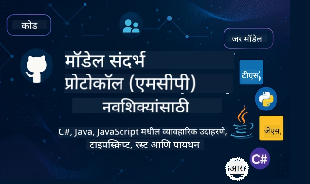

 

[](https://GitHub.com/microsoft/mcp-for-beginners/graphs/contributors)
[](https://GitHub.com/microsoft/mcp-for-beginners/issues)
[](https://GitHub.com/microsoft/mcp-for-beginners/pulls)
[](http://makeapullrequest.com)
[](https://mcptoplist.com/server/mcp.so%2Fmcp-for-beginners%2Fmicrosoft)

[](https://GitHub.com/microsoft/mcp-for-beginners/watchers)
[](https://GitHub.com/microsoft/mcp-for-beginners/fork)
[](https://GitHub.com/microsoft/mcp-for-beginners/stargazers)


[](https://discord.gg/nTYy5BXMWG)

या स्त्रोतांचा वापर सुरू करण्यासाठी खालील चरणांचे अनुसरण करा:
1. **रिपॉझिटरी फॉर्क करा**: क्लिक करा [](https://GitHub.com/microsoft/mcp-for-beginners/fork)
2. **रिपॉझिटरी क्लोन करा**:   `git clone https://github.com/microsoft/mcp-for-beginners.git`
3. **[Microsoft Foundry Discord](https://discord.gg/nTYy5BXMWG) वर सहभागी व्हा**


### 🌐 बहुभाषिक समर्थन

#### GitHub Action द्वारे समर्थित (स्वयंचलित आणि नेहमी अद्ययावत)

<!-- CO-OP TRANSLATOR LANGUAGES TABLE START -->
[Arabic](../ar/README.md) | [Bengali](../bn/README.md) | [Bulgarian](../bg/README.md) | [Burmese (Myanmar)](../my/README.md) | [Chinese (Simplified)](../zh-CN/README.md) | [Chinese (Traditional, Hong Kong)](../zh-HK/README.md) | [Chinese (Traditional, Macau)](../zh-MO/README.md) | [Chinese (Traditional, Taiwan)](../zh-TW/README.md) | [Croatian](../hr/README.md) | [Czech](../cs/README.md) | [Danish](../da/README.md) | [Dutch](../nl/README.md) | [Estonian](../et/README.md) | [Finnish](../fi/README.md) | [French](../fr/README.md) | [German](../de/README.md) | [Greek](../el/README.md) | [Hebrew](../he/README.md) | [Hindi](../hi/README.md) | [Hungarian](../hu/README.md) | [Indonesian](../id/README.md) | [Italian](../it/README.md) | [Japanese](../ja/README.md) | [Kannada](../kn/README.md) | [Khmer](../km/README.md) | [Korean](../ko/README.md) | [Lithuanian](../lt/README.md) | [Malay](../ms/README.md) | [Malayalam](../ml/README.md) | [Marathi](./README.md) | [Nepali](../ne/README.md) | [Nigerian Pidgin](../pcm/README.md) | [Norwegian](../no/README.md) | [Persian (Farsi)](../fa/README.md) | [Polish](../pl/README.md) | [Portuguese (Brazil)](../pt-BR/README.md) | [Portuguese (Portugal)](../pt-PT/README.md) | [Punjabi (Gurmukhi)](../pa/README.md) | [Romanian](../ro/README.md) | [Russian](../ru/README.md) | [Serbian (Cyrillic)](../sr/README.md) | [Slovak](../sk/README.md) | [Slovenian](../sl/README.md) | [Spanish](../es/README.md) | [Swahili](../sw/README.md) | [Swedish](../sv/README.md) | [Tagalog (Filipino)](../tl/README.md) | [Tamil](../ta/README.md) | [Telugu](../te/README.md) | [Thai](../th/README.md) | [Turkish](../tr/README.md) | [Ukrainian](../uk/README.md) | [Urdu](../ur/README.md) | [Vietnamese](../vi/README.md)

> **स्थानिक क्लोन करणे प्राधान्य द्यावे का?**
>
> या रिपॉझिटरीमध्ये ५०+ भाषांमधील भाषांतर आहेत ज्यामुळे डाउनलोडचा आकार मोठा होतो. भाषांतरांशिवाय क्लोन करण्यासाठी, sparse checkout वापरा:
>
> **Bash / macOS / Linux:**
> ```bash
> git clone --filter=blob:none --sparse https://github.com/microsoft/mcp-for-beginners.git
> cd mcp-for-beginners
> git sparse-checkout set --no-cone '/*' '!translations' '!translated_images'
> ```
>
> **CMD (Windows):**
> ```cmd
> git clone --filter=blob:none --sparse https://github.com/microsoft/mcp-for-beginners.git
> cd mcp-for-beginners
> git sparse-checkout set --no-cone "/*" "!translations" "!translated_images"
> ```
>
> हे तुम्हाला कोर्स पूर्ण करण्यासाठी आवश्यक सर्वकाही अधिक वेगाने डाउनलोड करण्याची संधी देते.
<!-- CO-OP TRANSLATOR LANGUAGES TABLE END -->

# 🚀 बिगिनर्ससाठी मॉडेल कंटेक्स्ट प्रोटोकॉल (MCP) अभ्यासक्रम

## **C#, Java, JavaScript, Rust, Python, आणि TypeScript मध्ये हाताने कोड उदाहरणांसह MCP शिकणे**

## 🧠 मॉडेल कंटेक्स्ट प्रोटोकॉल अभ्यासक्रमाचा आढावा
मॉडेल कंटेक्स्ट प्रोटोकॉलमध्ये तुमच्या प्रवासात स्वागत आहे! जर तुम्हाला कधी विचार आला असेल की AI अनुप्रयोग वेगवेगळ्या साधने आणि सेवांशी कसे संवाद साधतात, तर तुम्ही एक सुंदर उपाय शोधणार आहात जो विकासकांना बुद्धिमान प्रणाली तयार करण्याच्या पद्धतींचा बदल घडवून आणत आहे.

MCP ला AI अनुप्रयोगांसाठी एक सार्वत्रिक भाषांतरकार म्हणून विचार करा - जसे USB पोर्ट तुम्हाला कोणतीही साधने तुमच्या संगणकाशी जोडण्याची परवानगी देतात, तसेच MCP AI मॉडेलना कोणत्याही साधन किंवा सेवेशी एकसंध मार्गाने जोडण्याची परवानगी देतो. तुम्ही तुमचा पहिला चॅटबॉट तयार करत असाल किंवा क्लिष्ट AI कार्यप्रवाहांवर काम करत असाल, MCP समजून घेणे तुम्हाला अधिक सक्षम आणि लवचिक अनुप्रयोग तयार करण्याची शक्ती देईल.

हा अभ्यासक्रम तुमच्या शिक्षणाच्या प्रवासासाठी संयमाने आणि काळजीने तयार करण्यात आला आहे. आपण सोप्या संकल्पनांपासून सुरुवात करू जे तुम्हाला आधीच समजतात आणि हळूहळू तुमची कौशल्य हाताळणीच्या माध्यमातून वाढवू. प्रत्येक टप्प्यात स्पष्ट स्पष्टीकरणे, व्यवहारिक उदाहरणे आणि भरपूर प्रोत्साहन समाविष्ट आहे.

जेव्हापर्यंत तुम्ही हा प्रवास पूर्ण कराल, तेव्हापर्यंत तुम्हाला तुमचे स्वतःचे MCP सर्व्हर तयार करण्यास, ते लोकप्रिय AI प्लॅटफॉर्मशी एकत्रित करण्यास आणि या तंत्रज्ञानामुळे AI विकासाचे भविष्य कसे बदलत आहे हे समजून घेण्यास आत्मविश्वास असेल. चला या रोमांचक साहसाला एकत्र सुरुवात करूया!

### अधिकृत दस्तऐवज आणि तपशील

हा अभ्यासक्रम **MCP स्पेसिफिकेशन 2025-11-25** (ताजी स्थिर आवृत्ती) सोबत जुळतो. MCP स्पेसिफिकेशन तारखांवर आधारित आवृत्ती वापरतो (YYYY-MM-DD फॉरमॅट) ज्यामुळे प्रोटोकॉल आवृत्तीचे स्पष्ट ट्रॅकिंग शक्य होते.

> **पुढे पाहणे:** पुढील स्पेसिफिकेशन आवृत्तीसाठी, **2026-07-28**, रिलीज कँडिडेट २८ जुलै २०२६ रोजी पाठविण्यासाठी नियोजित आहे. हा प्रोटोकॉल वाहतुकीच्या स्तरावर स्टेटलेस करतो, एक्सटेंशन्स फ्रेमवर्क (MCP Apps, Tasks) अधिकृत करतो, प्राधिकरण बळकट करतो, आणि Roots, Sampling, आणि Logging यांचे अवांछित ठरवतो. पूर्ण तपशीलासाठी पाहा [MCP मध्ये काय बदलत आहे: 2026-07-28 रिलीज कँडिडेट](./01-CoreConcepts/mcp-2026-07-28-release-candidate.md) .

हे स्त्रोत तुमच्या समज वाढल्यावर अधिक मौल्यवान होतील, पण लगेच सर्व वाचण्याचा दबाव घेऊ नका. तुम्हाला सर्वांत जास्त आवडत असलेल्या विभागांपासून सुरुवात करा!
- 📘 [MCP Documentation](https://modelcontextprotocol.io/) – हे आहे तुमचं मार्गनिर्दर्शक ट्युटोरियल्स आणि वापरकर्ता मार्गदर्शकासाठी. दस्तऐवज बिगिनर्ससाठी लिहिलेला आहे, ज्यामुळे तुम्ही सहजपणे उदाहरणांच्या माध्यमातून शिकू शकता.
- 📜 [MCP Specification](https://modelcontextprotocol.io/specification/2025-11-25) – याला तुमचे सखोल संदर्भ मॅन्युअल म्हणून पाहा. अभ्यासक्रम करत असताना, तुम्ही विशिष्ट तपशील शोधण्यासाठी आणि प्रगत वैशिष्ट्ये पाहण्यासाठी येथे वारंवार येऊ शकता.
- 📜 [MCP Specification Versioning](https://modelcontextprotocol.io/specification/versioning) – यात प्रोटोकॉल ची आवृत्ती इतिहास आणि MCP कसे तारखांवर आधारित आवृत्ती वापरतं (YYYY-MM-DD फॉरमॅट) याची माहिती आहे.
- 🧑‍💻 [MCP GitHub Repository](https://github.com/modelcontextprotocol) – येथे तुम्हाला SDKs, साधने, आणि अनेक प्रोग्रामिंग भाषांमध्ये कोड नमुने सापडतील. हे व्यवहारिक उदाहरणे आणि वापरण्यास तयार घटकांचा खजिना आहे.
- 🌐 [MCP Community](https://github.com/orgs/modelcontextprotocol/discussions) – इथे इतर शिकणाऱ्या आणि अनुभवी विकासकांसह MCP विषयी चर्चा करा. हे सहकार्य करणारे समुदाय आहे जिथे प्रश्नांना स्वागत आहे आणि ज्ञान मुक्तपणे वाटले जाते.
  
## शिकण्याचे उद्दिष्टे

ह्या अभ्यासक्रमाच्या शेवटी, तुम्हाला तुमच्या नव्या कौशल्यांबद्दल आत्मविश्वास आणि उत्साह वाटेल. तुम्ही काय साध्य कराल ते खालीलप्रमाणे:

• **MCP मूलतत्त्वे समजून घेणे**: तुम्हाला Model Context Protocol काय आहे आणि ते AI अनुप्रयोग कसे एकत्र काम करतात हे क्रांतिकारक कसे आहे हे समजेल, उदाहरणे आणि उपमा वापरून जी सोपी समजण्यासाठी आहेत.

• **पहिला MCP सर्व्हर तयार करणे**: तुम्ही तुमच्या प्राधान्य प्रोग्रामिंग भाषेत कार्यरत MCP सर्व्हर तयार कराल, सोप्या उदाहरणांपासून सुरुवात करून हळूहळू तुमचे कौशल्य वाढवाल.

• **AI मॉडेलना खऱ्या साधनांशी जोडणे**: तुम्ही शिकाल की AI मॉडेल आणि प्रत्यक्ष सेवा यामध्ये कसे दुवा तयार करायचा, ज्यामुळे तुमचे अनुप्रयोग अधिक सामर्थ्यशाली होतील.

• **सुरक्षा सर्वोत्तम प्रथांचे पालन करणे**: तुम्हाला कसे तुमच्या MCP अमलबजावणी सुरक्षित ठेवायची हे समजेल, ज्यामुळे आपले अनुप्रयोग आणि वापरकर्ते दोघेही सुरक्षित राहतील.

• **आत्मविश्वासाने तैनात करणे**: तुम्हाला कसे तुमची MCP प्रकल्प विकासापासून उत्पादनापर्यंत नेण्याची माहिती मिळेल, प्रत्यक्ष जगात काम करणाऱ्या तैनातीच्या युक्त्या सह.

• **MCP समुदायात सामील व्हा**: तुम्ही AI अनुप्रयोग विकासाच्या भविष्यात आकार देणाऱ्या वाढत्या समुदायाचा भाग बनाल.

## आवश्यक पार्श्वभूमी

MCP तपशिलात उतरपूर्वी, चला काही मूलभूत संकल्पनांमध्ये आरामदायक होऊया. तुम्ही या क्षेत्रात तज्ज्ञ नसाल तरी काळजी करू नका - आम्ही तुम्हाला आवश्यक सर्व माहिती देऊ!

### प्रोटोकॉल समजून घेणे (आधार)

प्रोटोकॉल म्हणजे संभाषणासाठी नियमांसारखे आहे. जेव्हा तुम्ही मित्राला कॉल करता, तुम्ही दोघेही 'हॅलो' म्हणता, बोलण्याची पालट घेतली जाते, आणि 'गुडबाय' म्हणता जेव्हा संभाषण संपते. संगणकीय प्रोग्रामलाही संवादासाठी असे नियम लागतात.

MCP हा एक प्रोटोकॉल आहे - एक संमती झालेली नियमांची साखळी जी AI मॉडेल्स आणि अनुप्रयोगांना साधने आणि सेवांशी उत्पादक 'संवाद' करण्यास मदत करते. जसे संभाषणाचे नियम मानवी संवाद अधिक सुरळीत करतात, तसेच MCP AI अनुप्रयोग संवाद अधिक विश्वासार्ह आणि सामर्थ्यशाली करते.

### क्लायंट-सर्व्हर नातेसंबंध (प्रोग्राम्स कसे एकत्र काम करतात)

तुम्ही रोज क्लायंट-सर्व्हर नातेसंबंधांचा वापर करता! वेब ब्राउझर (क्लायंट) वापरताना तुम्ही वेबसाइटला भेट देता, तेव्हा तुम्ही वेब सर्व्हरशी कनेक्ट होता ज्याने तुम्हाला पेज सामग्री पाठवते. ब्राउझर माहिती कशी मागवावी ते जाणते आणि सर्व्हर प्रतिसाद कसा द्यावा हे समजते.

MCP मध्ये असेच नाते आहे: AI मॉडेल क्लायंट म्हणून माहिती किंवा क्रिया मागतात, तर MCP सर्व्हर त्या क्षमता पुरवतात. हा एखादा मदत करणारा सहाय्यक आहे (सर्व्हर) ज्याला AI विशिष्ट कार्य करण्यास म्हणू शकतो.

### का मानकीकरण महत्त्वाचे आहे (सांगकाम्याला चालू ठेवणे)

कल्पना करा जर प्रत्येक कार निर्माता वेगवेगळ्या आकाराच्या गॅस पंपचा वापर करत असे - तुम्हाला प्रत्येक कारसाठी वेगळा अडॅप्टर लागेल! मानकीकरण म्हणजे सामान्य दृष्टिकोनांवर सहमती करणे ज्यामुळे गोष्टी सुसंगतपणे कार्य करतात.

MCP AI अनुप्रयोगांसाठी हे मानकीकरण पुरवतो. प्रत्येक AI मॉडेलला प्रत्येक साधनासाठी सानुकूल कोड लिहिण्याऐवजी, MCP त्यांना संवाद साधण्यासाठी सार्वत्रिक मार्ग तयार करतो. याचा अर्थ विकासक एकदा साधने तयार करतात आणि ती अनेक वेगवेगळ्या AI सिस्टीमसह कार्य करतील.

## 🧭 तुमच्या शिकण्याच्या मार्गदर्शकाचा आढावा

तुमचा MCP प्रवास काळजीपूर्वक रचलेला आहे ज्यामुळे तुमचा आत्मविश्वास आणि कौशल्य प्रगतीने वाढेल. प्रत्येक टप्पा नवीन संकल्पनेची ओळख करून देतो आणि आधीच शिकलेल्या गोष्टी मातीत आणतो.

### 🌱 आधारभूत टप्पा: मूलभूत समज (मॉड्यूल्स 0-2)

येथे तुमची साहस सुरू होते! आम्ही तुम्हाला MCP संकल्पना परिचित उपमा आणि सोप्या उदाहरणांसह ओळख करून देऊ. तुम्हाला समजेल MCP काय आहे, ते का आहे, आणि ते AI विकासाच्या मोठ्या जगाशी कसे जुळते.


• **मॉड्यूल 0 - MCP परिचय**: आपण MCP काय आहे आणि आधुनिक AI अनुप्रयोगांसाठी का ती महत्त्वाची आहे हे तपासण्यास सुरुवात करू. आपण कार्यरत असलेल्या MCP चे प्रत्यक्ष उदाहरणे पाहाल आणि विकसितकर्त्यांना येणाऱ्या सामान्य समस्यांवर कसे ते उपाय करते हे समजून घ्याल.

• **मॉड्यूल 1 - मुख्य संकल्पना स्पष्ट**: येथे आपण MCP चे आवश्यक बांधकाम तत्त्वे शिकाल. आपण भरपूर उपमा आणि दृश्य उदाहरणे वापरू जेणेकरून ही संकल्पना नैसर्गिक आणि समजणीय वाटतील.

• **मॉड्यूल 2 - MCP मध्ये सुरक्षा**: सुरक्षा भयानक वाटू शकते, परंतु आम्ही तुम्हाला कसे MCP मध्ये अंगभूत सुरक्षा वैशिष्ट्ये आहेत ते दाखवू आणि उत्तम सराव शिकवू जे तुमच्या अनुप्रयोगांना सुरुवातीपासून सुरक्षित ठेवतात.

### 🔨 बांधणी टप्पा: तुमच्या पहिल्या अंमलबजावणी तयार करणे (मॉड्यूल 3)

आता खऱ्या मजेत सुरूवात होते! तुम्हाला प्रत्यक्षात MCP सर्व्हर आणि क्लायंट बांधण्याचा अनुभव मिळेल. काळजी करू नका - आपण साध्या पासून सुरुवात करू आणि प्रत्येक टप्प्यावर मार्गदर्शन करू.

या मॉड्यूलमध्ये अनेक हाताळणी मार्गदर्शक आहेत जे तुम्हाला तुमच्या पसंतीच्या प्रोग्रामिंग भाषेत सराव करण्याची परवानगी देतात. तुम्ही तुमचा पहिला सर्व्हर तयार कराल, त्याला कनेक्ट होण्यासाठी क्लायंट तयार कराल, आणि VS कोड सारख्या लोकप्रिय विकास साधनांसह एकत्रिकरण देखील कराल.

प्रत्येक मार्गदर्शकात पूर्ण कोड उदाहरणे, त्रुटी निवारण टिपा आणि विशिष्ट डिझाइन निवडी का कराव्यात हे समजावून सांगितले आहे. या टप्प्याच्या शेवटी, तुमच्याकडे कार्यरत MCP अंमलबजावणी असेल ज्यावर तुम्ही अभिमान बाळगू शकाल!

### 🚀 वाढीचा टप्पा: प्रगत संकल्पना आणि प्रत्यक्ष वापर (मॉड्यूल 4-5)

मूलभूत शिकून झाल्यावर, तुम्ही अधिक प्रगत MCP वैशिष्ट्ये तपासण्यास तयार आहात. आपण व्यावहारिक अंमलबजावणी धोरणे, डीबगिंग तंत्र आणि बहु-मोड AI एकत्रिकरण यांसारख्या प्रगत विषयांवर चर्चा करू.

तुम्ही तुमच्या MCP अंमलबजावणी उत्पादनासाठी कशी स्केल करायची आणि Azure सारख्या क्लाऊड प्लॅटफॉर्मशी एकत्रिकरण कसे करायचे हे देखील शिकाल. हे मॉड्यूल तुम्हाला वास्तविक जगाच्या मागण्यांना तोंड देणाऱ्या MCP उपाययोजना तयार करण्यासाठी तयार करतात.

### 🌟 निपुणता टप्पा: समुदाय आणि विशेषीकरण (मॉड्यूल 6-11)

अंतिम टप्पा MCP समुदायात सामील होण्यावर आणि तुम्हाला अधिक रस असलेल्या क्षेत्रात विशेषीकरणावर केंद्रित आहे. तुम्ही ओपन-सोर्स MCP प्रकल्पांना कसा योगदान द्यायचा, प्रगत प्रमाणीकरण नमुने कसे लागू करायचे, आणि व्यापक डेटाबेस-इंटीग्रेटेड उपाय कसे तयार करायचे हे शिकाल.

मॉड्यूल 11 विशेष उल्लेखास पात्र आहे - हे पोस्टग्रेशक्यूएल एकत्रिकरणासह उत्पादन-तयार MCP सर्व्हर तयार करण्याचा एक संपूर्ण 13-लॅब हाताळणी शिकण्याचा मार्ग आहे. हे सारांश प्रकल्पासारखे आहे जे तुम्ही शिकलेल्या सर्व गोष्टी एकत्र आणते!

### 📚 पूर्ण अभ्यासक्रम रचना

| मॉड्यूल | विषय | वर्णन | लिंक |
|--------|-------|-------------|------|
| **मॉड्यूल 0-3: मूलतत्त्वे** | | | |
| 00 | MCP परिचय | मॉडेल कॉन्टेक्स्ट प्रोटोकॉलचा आढावा आणि AI पाइपलाइन्समध्ये त्याचे महत्त्व | [अधिक वाचा](./00-Introduction/README.md) |
| 01 | मुख्य संकल्पना स्पष्ट | मुख्य MCP संकल्पनांचा सखोल शोध | [अधिक वाचा](./01-CoreConcepts/README.md) |
| 1.1 | MCP मध्ये काय बदलत आहे (2026-07-28 RC) | Stateless प्रोटोकॉल, एक्स्टेंशन्स फ्रेमवर्क, आणि पुढील स्पेक आवृत्तीत येणाऱ्या वैशिष्ट्य निरसन | [मार्गदर्शक](./01-CoreConcepts/mcp-2026-07-28-release-candidate.md) |
| 02 | MCP मध्ये सुरक्षा | सुरक्षा धोके आणि उत्तम सराव | [अधिक वाचा](./02-Security/README.md) |
| 03 | MCP सुरू करणे | पर्यावरण सेटअप, मूलभूत सर्व्हर/क्लायंट, एकत्रिकरण | [अधिक वाचा](./03-GettingStarted/README.md) |
| **मॉड्यूल 3: तुमचा पहिला सर्व्हर आणि क्लायंट बांधणी** | | | |
| 3.1 | पहिला सर्व्हर | तुमचा पहिला MCP सर्व्हर तयार करा | [मार्गदर्शक](./03-GettingStarted/01-first-server/README.md) |
| 3.2 | पहिला क्लायंट | एक मूलभूत MCP क्लायंट विकसित करा | [मार्गदर्शक](./03-GettingStarted/02-client/README.md) |
| 3.3 | LLM सह क्लायंट | मोठ्या भाषा मॉडेल्ससह एकत्रित करा | [मार्गदर्शक](./03-GettingStarted/03-llm-client/README.md) |
| 3.4 | VS कोड एकत्रिकरण | VS कोड मध्ये MCP सर्व्हर वापरा | [मार्गदर्शक](./03-GettingStarted/04-vscode/README.md) |
| 3.5 | stdio सर्व्हर | stdio ट्रान्सपोर्ट वापरून सर्व्हर तयार करा | [मार्गदर्शक](./03-GettingStarted/05-stdio-server/README.md) |
| 3.6 | HTTP स्ट्रीमिंग | MCP मध्ये HTTP स्ट्रीमिंग अंमलात आणा | [मार्गदर्शक](./03-GettingStarted/06-http-streaming/README.md) |
| 3.7 | मायक्रोसॉफ्ट फाउंड्री टूलकिट | MCP सह मायक्रोसॉफ्ट फाउंड्री टूलकिट वापरा | [मार्गदर्शक](./03-GettingStarted/07-aitk/README.md) |
| 3.8 | चाचणी | तुमची MCP सर्व्हर अंमलबजावणी तपासा | [मार्गदर्शक](./03-GettingStarted/08-testing/README.md) |
| 3.9 | तैनाती | उत्पादनात MCP सर्व्हर तैनात करा | [मार्गदर्शक](./03-GettingStarted/09-deployment/README.md) |
| 3.10 | प्रगत सर्व्हर वापर | प्रगत वैशिष्ट्य वापरासाठी आणि सुधारित आर्किटेक्चरसाठी प्रगत सर्व्हर वापरा | [मार्गदर्शक](./03-GettingStarted/10-advanced/README.md) |
| 3.11 | साधी प्रमाणीकरण | सुरुवातीपासून प्रमाणीकरण आणि RBAC दाखवणारा अध्याय | [मार्गदर्शक](./03-GettingStarted/11-simple-auth/README.md) |
| 3.12 | MCP होस्ट्स | Claude Desktop, Cursor, Cline आणि इतर MCP होस्ट्स कॉन्फिगर करा | [मार्गदर्शक](./03-GettingStarted/12-mcp-hosts/README.md) |
| 3.13 | MCP इन्स्पेक्टर | इन्स्पेक्टर टूलसह MCP सर्व्हर डीबग आणि तपासा | [मार्गदर्शक](./03-GettingStarted/13-mcp-inspector/README.md) |
| 3.14 | सॅम्पलिंग | क्लायंटसह सहकार्य करण्यासाठी सॅम्पलिंग वापरा | [मार्गदर्शक](./03-GettingStarted/14-sampling/README.md) |
| 3.15 | MCP ॲप्लिकेशन्स | MCP ॲप बनवा | [मार्गदर्शक](./03-GettingStarted/15-mcp-apps/README.md) |
| **मॉड्यूल 4-5: व्यावहारिक आणि प्रगत** | | | |
| 04 | व्यावहारिक अंमलबजावणी | SDKs, डीबगिंग, चाचणी, पुनर्वापरयोग्य प्रॉम्प्ट टेम्प्लेट्स | [अधिक वाचा](./04-PracticalImplementation/README.md) |
| 4.1 | पेजिनेशन | कर्सर-आधारित पेजिनेशनसह मोठ्या परिणाम संच हाताळा | [मार्गदर्शक](./04-PracticalImplementation/pagination/README.md) |
| 05 | MCP मधील प्रगत विषय | बहु-मोड AI, स्केलिंग, उपक्रम वापर | [अधिक वाचा](./05-AdvancedTopics/README.md) |
| 5.1 | Azure एकत्रिकरण | Azure सह MCP एकत्रिकरण | [मार्गदर्शक](./05-AdvancedTopics/mcp-integration/README.md) |
| 5.2 | बहु-मोड | अनेक मोडालिटीजसह कार्य करणे | [मार्गदर्शक](./05-AdvancedTopics/mcp-multi-modality/README.md) |
| 5.3 | OAuth2 डेमो | OAuth2 प्रमाणीकरणाची अंमलबजावणी करा | [मार्गदर्शक](./05-AdvancedTopics/mcp-oauth2-demo/README.md) |
| 5.4 | मूळ संदर्भ | मूळ संदर्भ समजून घ्या आणि अंमलात आणा | [मार्गदर्शक](./05-AdvancedTopics/mcp-root-contexts/README.md) |
| 5.5 | राउटिंग | MCP राउटिंग धोरणे | [मार्गदर्शक](./05-AdvancedTopics/mcp-routing/README.md) |
| 5.6 | सॅम्पलिंग | MCP मधील सॅम्पलिंग तंत्र | [मार्गदर्शक](./05-AdvancedTopics/mcp-sampling/README.md) |
| 5.7 | स्केलिंग | MCP अंमलबजावणी स्केल करा | [मार्गदर्शक](./05-AdvancedTopics/mcp-scaling/README.md) |
| 5.8 | सुरक्षा | प्रगत सुरक्षा विचार | [मार्गदर्शक](./05-AdvancedTopics/mcp-security/README.md) |
| 5.9 | वेब शोध | वेब शोध क्षमता अंमलात आणा | [मार्गदर्शक](./05-AdvancedTopics/web-search-mcp/README.md) |
| 5.10 | रिअलटाइम स्ट्रीमिंग | रिअलटाइम स्ट्रीमिंग कार्यक्षमता तयार करा | [मार्गदर्शक](./05-AdvancedTopics/mcp-realtimestreaming/README.md) |
| 5.11 | रिअलटाइम शोध | रिअलटाइम शोध अंमलात आणा | [मार्गदर्शक](./05-AdvancedTopics/mcp-realtimesearch/README.md) |
| 5.12 | Entra ID प्रमाणीकरण | Microsoft Entra ID सह प्रमाणीकरण | [मार्गदर्शक](./05-AdvancedTopics/mcp-security-entra/README.md) |
| 5.13 | फाउंड्री एकत्रिकरण | Microsoft फाउंड्री सह एकत्रिकरण | [मार्गदर्शक](./05-AdvancedTopics/mcp-foundry-agent-integration/README.md) |
| 5.14 | संदर्भ अभियांत्रिकी | प्रभावी संदर्भ अभियांत्रिकीसाठी तंत्र | [मार्गदर्शक](./05-AdvancedTopics/mcp-contextengineering/README.md) |
| 5.15 | MCP कस्टम ट्रान्सपोर्ट | कस्टम ट्रान्सपोर्ट अंमलबजावणी | [मार्गदर्शक](./05-AdvancedTopics/mcp-transport/README.md) |
| 5.16 | प्रोटोकॉल वैशिष्ट्ये | प्रगती सूचना, रद्द करणे, संसाधन टेम्प्लेट्स | [मार्गदर्शक](./05-AdvancedTopics/mcp-protocol-features/README.md) |
| 5.17 | प्रतिस्पर्धी मल्टी-एजंट युक्तिवाद | दोन एजंट्स सामायिक MCP साधने वापरून विरुद्ध बाजूने युक्तिवाद करतात, ज्याचे मूल्यमापन जज एजंट करतो | [मार्गदर्शक](./05-AdvancedTopics/mcp-adversarial-agents/README.md) |
| **मॉड्यूल 6-10: समुदाय आणि उत्तम सराव** | | | |
| 06 | समुदाय योगदान | MCP पर्यावरणाला कसे योगदान द्यायचे | [मार्गदर्शक](./06-CommunityContributions/README.md) |
| 07 | आरंभीच्या स्वीकारापासून अंतर्दृष्टी | प्रत्यक्ष अंमलबजावणी कथा | [मार्गदर्शक](./07-LessonsfromEarlyAdoption/README.md) |
| 08 | MCP साठी उत्तम सराव | कार्यक्षमता, दोष-तुरुस्ती, सहनशक्ती | [मार्गदर्शक](./08-BestPractices/README.md) |
| 09 | MCP प्रकरण अभ्यास | व्यावहारिक अंमलबजावणी उदाहरणे | [मार्गदर्शक](./09-CaseStudy/README.md) |
| 10 | हाताळणी कार्यशाळा | मायक्रोसॉफ्ट फाउंड्री टूलकिटसह MCP सर्व्हर बांधणी | [प्रयोगशाळा](./10-StreamliningAIWorkflowsBuildingAnMCPServerWithAIToolkit/README.md) |
| **मॉड्यूल 11: MCP सर्व्हर हाताळणी लॅब** | | | |
| 11 | MCP सर्व्हर डेटाबेस एकत्रिकरण | पोस्टग्रेएसक्यूएल एकत्रिकरणासाठी परिसंपन्न 13-लॅब हाताळणी शिकण्याचा मार्ग | [प्रयोगशाळा](./11-MCPServerHandsOnLabs/README.md) |
| 11.1 | परिचय | डेटाबेस एकत्रिकरणासह MCP चे आढावा आणि रिटेल अ‍ॅनालिटिक्स वापर केस | [लॅब 00](./11-MCPServerHandsOnLabs/00-Introduction/README.md) |
| 11.2 | मुख्य आर्किटेक्चर | MCP सर्व्हर आर्किटेक्चर, डेटाबेस स्तर आणि सुरक्षा नमुने समजून घ्या | [लॅब 01](./11-MCPServerHandsOnLabs/01-Architecture/README.md) |
| 11.3 | सुरक्षा आणि मल्टी-टेनंसी | रो लेव्हल सुरक्षा, प्रमाणीकरण, आणि मल्टी-टेनंट डेटा प्रवेश | [लॅब 02](./11-MCPServerHandsOnLabs/02-Security/README.md) |
| 11.4 | पर्यावरण सेटअप | विकास पर्यावरण सेटअप, डॉकर, Azure संसाधने | [लॅब 03](./11-MCPServerHandsOnLabs/03-Setup/README.md) |
| 11.5 | डेटाबेस डिझाइन | पोस्टग्रेएसक्यूएल सेटअप, रिटेल स्कीमा डिझाइन, आणि नमुना डेटा | [लॅब 04](./11-MCPServerHandsOnLabs/04-Database/README.md) |
| 11.6 | MCP सर्व्हर अंमलबजावणी | डेटाबेस एकत्रिकरणासह FastMCP सर्व्हर बांधणी | [लॅब 05](./11-MCPServerHandsOnLabs/05-MCP-Server/README.md) |
| 11.7 | साधन विकास | डेटाबेस क्वेरी साधने आणि स्कीमा इंट्रोस्पेक्शन तयार करणे | [लॅब 06](./11-MCPServerHandsOnLabs/06-Tools/README.md) |
| 11.8 | सेमॅंटिक शोध | Azure OpenAI आणि pgvector वापरून व्हेक्टर एम्बेडिंग अंमलात आणा | [लॅब 07](./11-MCPServerHandsOnLabs/07-Semantic-Search/README.md) |
| 11.9 | चाचणी आणि डीबगिंग | चाचणी धोरणे, डीबगिंग साधने, आणि प्रमाणीकरण पध्दती | [लॅब 08](./11-MCPServerHandsOnLabs/08-Testing/README.md) |
| 11.10 | VS कोड एकत्रिकरण | VS कोड MCP एकत्रिकरण आणि AI चॅट वापर कॉन्फिगर करा | [लॅब 09](./11-MCPServerHandsOnLabs/09-VS-Code/README.md) |
| 11.11 | तैनाती धोरणे | डॉकर तैनाती, Azure कंटेनर ॲप्स, आणि स्केलिंग विचार | [लॅब 10](./11-MCPServerHandsOnLabs/10-Deployment/README.md) |
| 11.12 | मॉनिटरिंग | अ‍ॅप्लिकेशन इनसाइट्स, लॉगिंग, कार्यक्षमता मॉनिटरिंग | [लॅब 11](./11-MCPServerHandsOnLabs/11-Monitoring/README.md) |
| 11.13 | उत्तम सराव | कार्यक्षमता ऑप्टिमायझेशन, सुरक्षा कडक करणे, आणि उत्पादन सल्ले | [लॅब 12](./11-MCPServerHandsOnLabs/12-Best-Practices/README.md) |
| **मॉड्यूल 12: MCP साधने** | | | |
| 12.1 | साधने | Copilot ॲपमध्ये MCP वापर | [ मार्गदर्शक ](./12-tooling/README.md) |

### 💻 नमुना कोड प्रकल्प

MCP शिकण्याचा एक सर्वात रोमांचक भाग म्हणजे तुमच्या कोड कौशल्यांचा प्रगत विकास पाहणे. आमचे कोड उदाहरणे सोप्पे सुरू होतात आणि तुमच्या समजुतीसह अधिक प्रगत होतात. इथे आम्ही संकल्पना कशा परिचय करतो - असा कोड जो समजायला सोपा आहे पण प्रत्यक्ष MCP तत्त्वे दाखवतो, ज्यामुळे तुम्हाला फक्त कोड काय करतो हे नाही तर का असा संरचित आहे आणि कसा मोठ्या MCP अनुप्रयोगांमध्ये बसतो हेही समजेल.

#### मूलभूत MCP कॅल्क्युलेटर नमुने

| भाषा | वर्णन | लिंक |
|----------|-------------|------|

| C# | MCP सर्व्हर उदाहरण | [View Code](./03-GettingStarted/samples/csharp/README.md) |
| Java | MCP कॅल्क्युलेटर | [View Code](./03-GettingStarted/samples/java/calculator/README.md) |
| JavaScript | MCP डेमो | [View Code](./03-GettingStarted/samples/javascript/README.md) |
| Python | MCP सर्व्हर | [View Code](../../03-GettingStarted/samples/python/mcp_calculator_server.py) |
| TypeScript | MCP उदाहरण | [View Code](./03-GettingStarted/samples/typescript/README.md) |
| Rust | MCP उदाहरण | [View Code](./03-GettingStarted/samples/rust/README.md) |

#### प्रगत MCP अंमलबजावणी

| भाषा | वर्णन | दुवा |
|----------|-------------|------|
| C# | प्रगत नमुना | [View Code](./04-PracticalImplementation/samples/csharp/README.md) |
| Java विथ स्प्रिंग | कंटेनर अ‍ॅप उदाहरण | [View Code](./04-PracticalImplementation/samples/java/containerapp/README.md) |
| JavaScript | प्रगत नमुना | [View Code](./04-PracticalImplementation/samples/javascript/README.md) |
| Python | क्लिष्ट अंमलबजावणी | [View Code](./04-PracticalImplementation/samples/python/README.md) |
| TypeScript | कंटेनर नमुना | [View Code](./04-PracticalImplementation/samples/typescript/README.md) |


## 🎯 MCP शिकण्यासाठी पूर्वतयारी

या अभ्यासक्रमातून जास्तीत जास्त फायदा घेण्यासाठी, आपल्याकडे असावे:

- किमान एका या भाषांमध्ये प्रोग्रामिंगची मूलभूत ओळख: C#, Java, JavaScript, Python, किंवा TypeScript
- क्लायंट-सर्व्हर मॉडेल व API समजून घेणे
- REST आणि HTTP संकल्पनांची ओळख
- (पर्यायी) AI/ML संकल्पनांचा मागोवा

- साहाय्यासाठी आमच्या समुदायातील चर्चांमध्ये सहभागी होणे

## 📚 अभ्यास मार्गदर्शिका आणि साधने

या संग्रहात आपल्याला प्रभावीपणे शिकता यावे म्हणून अनेक साधने उपलब्ध आहेत:

### अभ्यास मार्गदर्शिका

एक सर्वसमावेशक [अभ्यास मार्गदर्शिका](./study_guide.md) उपलब्ध आहे जी आपल्याला यादी प्रभावीपणे नेव्हिगेट करण्यात मदत करते. हा व्हिज्युअल अभ्यासक्रम नकाशा दाखवतो की सर्व विषय कसे जोडले गेले आहेत आणि नमुना प्रकल्प कसे वापरायचे याबाबत मार्गदर्शन प्रदान करतो. जर तुम्हाला मोठे चित्र पाहायचे आवडत असेल तर हा मार्गदर्शक विशेषतः उपयुक्त आहे.

मार्गदर्शिकेत समाविष्ट आहे:
- सर्व विषयांचा व्हिज्युअल अभ्यासक्रम नकाशा
- प्रत्येक संचातील तपशीलवार विश्लेषण
- नमुना प्रकल्पांचा उपयोग कसा करावा याचा मार्गदर्शन
- वेगवेगळ्या कौशल्य पातळ्यांसाठी शिका मार्ग सुचवणी
- शिकलोण्याच्या प्रवासाला पूरक अतिरिक्त साधने

### बदलनोंची यादी

आम्ही एक विस्तृत [बदलनोंची यादी](./changelog.md) ठेवतो जी अभ्यासक्रमातील महत्त्वाच्या अद्ययावत गोष्टींचे निरीक्षण करते, ज्यामुळे तुम्हाला सर्वात शेवटच्या सुधारणांबाबत माहिती राहील.
- नव्या विषयांची भर
- संरचनात्मक बदल
- वैशिष्ट्यांचे सुधारणे
- दस्तऐवज अद्यतने

## 🛠️ हा अभ्यासक्रम प्रभावीपणे कसा वापरावा

या मार्गदर्शकातील प्रत्येक धडा समाविष्ट करतो:

1. MCP संकल्पनांची स्पष्ट स्पष्टीकरणे  
2. अनेक भाषांमध्ये थेट कोड उदाहरणे  
3. खऱ्या MCP अनुप्रयोगांची निर्मिती करण्यासाठी व्यायाम  
4. प्रगत शिकणाऱ्यांसाठी अतिरिक्त साधने

### चला C# सह MCP शिका - ट्यूटोरियल मालिकेचे
चला Model Context Protocol (MCP) बद्दल जाणून घेऊया, एक अत्याधुनिक फ्रेमवर्क जो AI मॉडेल्स आणि क्लायंट अनुप्रयोगांमधील संवादांना प्रमाणित करतो. या सुरुवातीच्या सत्राद्वारे, आम्ही तुम्हाला MCP ओळख करून देऊ आणि पहिले MCP सर्व्हर तयार करण्यात मार्गदर्शन करू.
#### C#: [https://aka.ms/letslearnmcp-csharp](https://aka.ms/letslearnmcp-csharp)
#### Java: [https://aka.ms/letslearnmcp-java](https://aka.ms/letslearnmcp-java)
#### JavaScript: [https://aka.ms/letslearnmcp-javascript](https://aka.ms/letslearnmcp-javascript)
#### Python: [https://aka.ms/letslearnmcp-python](https://aka.ms/letslearnmcp-python)

## 🎓 तुमचा MCP प्रवास सुरू होतो

अभिनंदन! तुम्ही नवा प्रवास सुरू केला आहे जो तुमच्या प्रोग्रामिंग कौशल्यांना विस्तृत करेल आणि तुम्हाला AI विकासाच्या अग्रगण्य तंत्रज्ञानाशी जोडेल.

### तुम्ही जे आधीच साध्य केले आहे

या परिचय वाचून, तुम्ही आधीच तुमच्या MCP ज्ञानाचा पाया तयार करायला सुरुवात केली आहे. तुम्हाला MCP काय आहे, का महत्त्वाची आहे, आणि हा अभ्यासक्रम तुमच्या शिकण्यास कसा सहाय्यक ठरेल याचा आढावा घेतला आहे. हे एक महत्त्वाचे यश असून या महत्त्वाच्या तंत्रज्ञानातील तुमच्या तज्ज्ञतेची सुरुवात आहे.

### पुढील साहस

जसे तुम्ही पुढील मॉड्यूल्समध्ये प्रगती कराल, लक्षात ठेवा की प्रत्येक तज्ञ तरी कधी ना कधी नवशिकता होता. आत सध्याची गुंतागुंतीची दिसणारी संकल्पना, सराव आणि वापराने सहज सवय होईल. प्रत्येक छोटा टप्पा प्रगत क्षमतांकडे नेईल ज्याचा उपयोग तुमच्या विकास करिअरमध्ये होईल.

### तुमचा सपोर्ट नेटवर्क

तुम्ही MCP बद्दल आवड असलेला आणि इतरांना मदत करण्यास उत्सुक असलेल्या शिकणाऱ्यांच्या आणि तज्ञांच्या समुदायात सामील होत आहात. तुम्ही कोडिंग आव्हानात अडकले असाल किंवा एखादा नवसंकल्प सादर करत असाल, समुदाय तुमच्या प्रवासाला आधार देण्यासाठी येथे आहे.

जर तुम्ही कुठेतरी अडकलात किंवा AI अॅप्स तयार करताना प्रश्न असतील तर साथीदार शिकणाऱ्यांमध्ये आणि अनुभवी विकसकांमध्ये MCP वर चर्चा करा. हा एक मदत करणारा समुदाय आहे जिथे प्रश्नांना स्वागत आहे आणि ज्ञान मोकळेपणाने शेअर केले जाते.

[](https://discord.gg/nTYy5BXMWG)

उत्पादनाच्या अभिप्रायासाठी किंवा तक्रारींसाठी भेट द्या:

[](https://aka.ms/foundry/forum)

### तयार आहात सुरू करायला?

तुमचा MCP प्रवास आत्ता सुरू होतो! Module 0 पासून सुरुवात करा आणि तुमचा पहिला MCP प्रयोग करा, किंवा नमुना प्रकल्पांमध्ये बघा काय तयार करणार आहात. लक्षात ठेवा – प्रत्येक तज्ञ नेहमी तुमच्या स्थितीसारख्या सुरुवातीस होता, आणि संयम व सरावाने तुम्ही काय साध्य करू शकता हे पाहून तुम्हाला आश्चर्य वाटेल.

Model Context Protocol विकासाच्या जगात स्वागत आहे. चला काहीतरी अद्भुत बनवूया एकत्र!

## 🤝 शिकण्याच्या समुदायात योगदान

हा अभ्यासक्रम शिकणाऱ्यांच्या योगदानांनी अधिक मजबूत होतो! तुम्ही टायपो दुरुस्त करताय, स्पष्ट स्पष्टीकरण सुचवताय, किंवा नवीन उदाहरण जोडताय, तुमची मदत नवीन शिकणाऱ्यांना यशस्वी होण्यासाठी मदत करते.

Microsoft Valued Professional [Shivam Goyal](https://www.linkedin.com/in/shivam2003/) यांचे कोड नमुने देण्यासाठी आभार.

योगदान प्रक्रिया स्वागतार्ह आणि सहायक आहे. बहुतेक योगदानांसाठी Contributor License Agreement (CLA) आवश्यक आहे, पण स्वयंचलित साधने तुम्हाला सोप्या पद्धतीने मार्गदर्शन करतील.

## 📜 मुक्त स्त्रोत शिक्षण

हा संपूर्ण अभ्यासक्रम MIT [LICENSE](../../LICENSE) अंतर्गत उपलब्ध आहे, म्हणजे तुम्ही तो वापरू, सुधारू आणि मुक्तपणे शेअर करू शकता. हे आमच्या मिशनचे समर्थन करते जे MCP ज्ञान विकसकांपर्यंत पोहोचविण्याचे आहे.
## 🤝 योगदान मार्गदर्शक तत्त्वे

हा प्रकल्प योगदान आणि सुचनेचे स्वागत करतो. बहुतेक योगदानांसाठी Contributor License Agreement (CLA) आवश्यक आहे ज्यात तुम्ही तुम्हाला योगदान देण्याचा अधिकार असल्याचे आणि प्रत्यक्ष दिले आहे असे जाहीर करता. तपशीलांसाठी भेट द्या <https://cla.opensource.microsoft.com>.

जेव्हा तुम्ही pull request सबमिट करता, तेव्हा CLA बॉट आपोआप ठरवेल की तुम्हाला CLA प्रदान करावी लागेल का आणि PR योग्यरित्या चिन्हांकित होईल (उदा. स्थिती तपासणी, टिप्पणी). फक्त बॉटद्वारे दिलेली सूचना पाळा. तुम्हाला हे सर्व संग्रहांसाठी फक्त एकदाच करावे लागेल.

ह्या प्रकल्पाने [Microsoft Open Source Code of Conduct](https://opensource.microsoft.com/codeofconduct/) स्वीकारली आहे.
अधिक माहितीसाठी पाहा [Code of Conduct FAQ](https://opensource.microsoft.com/codeofconduct/faq/) किंवा संपर्क करा [opencode@microsoft.com](mailto:opencode@microsoft.com) कोणत्याही अतिरिक्त प्रश्नांसाठी.


---

*तुमचा MCP प्रवास सुरू करायला तयार आहात का? [Module 00 - MCP परिचय](./00-Introduction/README.md) पासून सुरुवात करा आणि Model Context Protocol विकासाच्या जगात तुमचे पहिले पाउल टाका!*


## 🎒 इतर अभ्यासक्रम
आमची टीम इतर अभ्यासक्रम तयार करते! पहा:

<!-- CO-OP TRANSLATOR OTHER COURSES START -->
### LangChain
[](https://aka.ms/langchain4j-for-beginners)
[](https://aka.ms/langchainjs-for-beginners?WT.mc_id=m365-94501-dwahlin)
[](https://github.com/microsoft/langchain-for-beginners?WT.mc_id=m365-94501-dwahlin)
---

### Azure / Edge / MCP / Agents
[](https://github.com/microsoft/AZD-for-beginners?WT.mc_id=academic-105485-koreyst)
[](https://github.com/microsoft/edgeai-for-beginners?WT.mc_id=academic-105485-koreyst)
[](https://github.com/microsoft/mcp-for-beginners?WT.mc_id=academic-105485-koreyst)
[](https://github.com/microsoft/ai-agents-for-beginners?WT.mc_id=academic-105485-koreyst)

---
 
### जनरेटिव AI मालिका
[](https://github.com/microsoft/generative-ai-for-beginners?WT.mc_id=academic-105485-koreyst)
[-9333EA?style=for-the-badge&labelColor=E5E7EB&color=9333EA)](https://github.com/microsoft/Generative-AI-for-beginners-dotnet?WT.mc_id=academic-105485-koreyst)
[-C084FC?style=for-the-badge&labelColor=E5E7EB&color=C084FC)](https://github.com/microsoft/generative-ai-for-beginners-java?WT.mc_id=academic-105485-koreyst)
[-E879F9?style=for-the-badge&labelColor=E5E7EB&color=E879F9)](https://github.com/microsoft/generative-ai-with-javascript?WT.mc_id=academic-105485-koreyst)

---
 
### कोअर शिक्षण
[](https://aka.ms/ml-beginners?WT.mc_id=academic-105485-koreyst)
[](https://aka.ms/datascience-beginners?WT.mc_id=academic-105485-koreyst)
[](https://aka.ms/ai-beginners?WT.mc_id=academic-105485-koreyst)

[](https://github.com/microsoft/Security-101?WT.mc_id=academic-96948-sayoung)
[](https://aka.ms/webdev-beginners?WT.mc_id=academic-105485-koreyst)
[](https://aka.ms/iot-beginners?WT.mc_id=academic-105485-koreyst)
[](https://github.com/microsoft/xr-development-for-beginners?WT.mc_id=academic-105485-koreyst)

---
 
### कॉपायलट मालिकास
[](https://aka.ms/GitHubCopilotAI?WT.mc_id=academic-105485-koreyst)
[](https://github.com/microsoft/mastering-github-copilot-for-dotnet-csharp-developers?WT.mc_id=academic-105485-koreyst)
[](https://github.com/microsoft/CopilotAdventures?WT.mc_id=academic-105485-koreyst)
<!-- CO-OP TRANSLATOR OTHER COURSES END -->

---

<!-- CO-OP TRANSLATOR DISCLAIMER START -->
**अस्वीकरण**:
हा दस्तऐवज AI भाषांतर सेवा [Co-op Translator](https://github.com/Azure/co-op-translator) चा वापर करून अनुवादित केला आहे. जरी आम्ही अचूकतेसाठी प्रयत्न करतो, तरी कृपया लक्षात घ्या की स्वयंचलित भाषांतरांमध्ये त्रुटी किंवा अचूकतेची कमतरता असू शकते. मूळ दस्तऐवज त्याच्या मूळ भाषेत अधिकृत स्रोत मानला पाहिजे. महत्त्वाची माहिती असल्यास, व्यावसायिक मानवी भाषांतराची शिफारस केली जाते. या भाषांतराच्या वापरामुळे उद्भवणाऱ्या कोणत्याही गैरसमज किंवा चुकीच्या अर्थलावणीसाठी आम्ही जबाबदार नाही.
<!-- CO-OP TRANSLATOR DISCLAIMER END -->