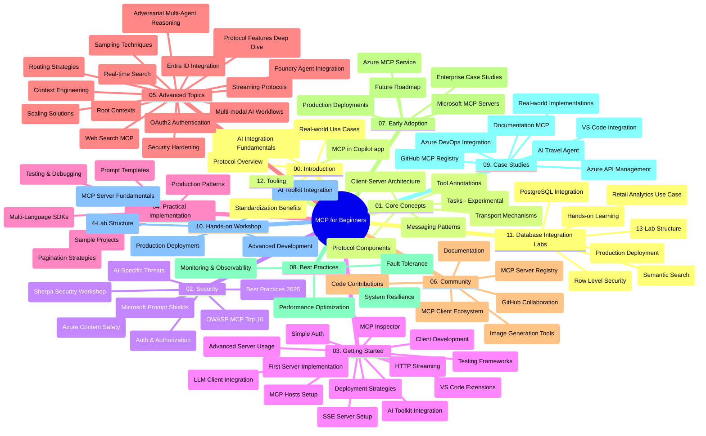

# मॉडेल संदर्भ प्रोटोकॉल (MCP) सुरुवातीसाठी - अभ्यास मार्गदर्शिका

ही अभ्यास मार्गदर्शिका "सुरुवातीसाठी मॉडेल संदर्भ प्रोटोकॉल (MCP)" अभ्यासक्रमासाठी रिपॉझिटरी संरचना आणि सामग्रीचे अवलोकन प्रदान करते. रिपॉझिटरीमध्ये प्रभावीपणे मार्गदर्शन करण्यासाठी आणि उपलब्ध संसाधनांचा जास्तीत जास्त फायदा घेण्यासाठी ह्या मार्गदर्शिकेचा वापर करा.

## रिपॉझिटरीचे सारांश

मॉडेल संदर्भ प्रोटोकॉल (MCP) हा AI मॉडेल्स आणि क्लायंट अनुप्रयोगांमधील परस्परसंवादासाठी एक मानकीकृत फ्रेमवर्क आहे. प्रथम एंथ्रोपिकने तयार केलेला, MCP आता अधिक व्यापक MCP समुदायाद्वारे अधिकृत GitHub संस्थेच्या माध्यमातून व्यवस्थापित केला जातो. ही रिपॉझिटरी C#, Java, JavaScript, Python, आणि TypeScript मध्ये हाताळणीसह कोड उदाहरणांसह व्यापक अभ्यासक्रम प्रदान करते, ज्याचा हेतू AI विकसक, सिस्टीम आर्किटेक्ट आणि सॉफ्टवेअर अभियंत्यांसाठी आहे.

## दृश्य अभ्यासक्रम नकाशा

## रिपॉझिटरीची रचना

ही रिपॉझिटरी बार मुख्य विभागांमध्ये विभागलेली आहे, प्रत्येक MCP च्या विविध पैलूंवर लक्ष केंद्रित करते:

1. **परिचय (00-Introduction/)**
   - मॉडेल संदर्भ प्रोटोकॉलचे अवलोकन
   - AI पाईपलाईन्समध्ये मानकीकरण का महत्वाचे आहे
   - व्यावहारिक वापर प्रकरणे आणि फायदे

2. **कोर संकल्पना (01-CoreConcepts/)**
   - क्लायंट-सर्व्हर आर्किटेक्चर
   - मुख्य प्रोटोकॉल घटक
   - MCP मधील संदेश पाठवण्याचे नमुने
   - वर्तमान तपशील: [MCP मध्ये काय बदलले: 2026-07-28 तपशील](./01-CoreConcepts/mcp-2026-07-28.md) — स्टेटलेस प्रोटोकॉल कोर, विस्तार फ्रेमवर्क, आणि रुचि/नमुना/लॉगिंग समाप्ती

3. **सुरक्षा (02-Security/)**
   - MCP आधारित प्रणालींमधील सुरक्षा धोके
   - सुरक्षित अंमलबजावणीसाठी सर्वोत्तम पद्धती
   - प्रमाणीकरण आणि प्राधिकरण धोरणे
   - हाताळणीसाठी [CIMD आणि DCR प्राधिकरण नमुना](./02-Security/samples/cimd-dcr-auth/README.md)
   - **संपूर्ण सुरक्षा दस्तऐवज**:
     - MCP सुरक्षा सर्वोत्तम पद्धती
     - Azure सामग्री सुरक्षा अंमलबजावणी मार्गदर्शक
     - MCP सुरक्षा नियंत्रण आणि तंत्र
     - MCP सर्वोत्तम पद्धती जलद संदर्भ
   - **महत्त्वाचे सुरक्षा विषय**:
     - प्रॉम्प्ट इंजेक्शन आणि टूल विषबाधा हल्ले
     - सत्र अपहरण आणि भ्रमित डेप्युटी समस्या
     - टोकन पासथ्रू कमकुवतपणा
     - अतिरिक्त परवानग्या आणि प्रवेश नियंत्रण
     - AI घटकांसाठी पुरवठा साखळी सुरक्षा
     - Microsoft प्रॉम्प्ट शील्ड्स एकत्रीकरण

4. **सुरुवात करणे (03-GettingStarted/)**
   - पर्यावरण सेटअप आणि संरचना
   - मूलभूत MCP सर्व्हर आणि क्लायंट तयार करणे
   - विद्यमान अनुप्रयोगांसह एकत्रीकरण
   - विभागांसह समाविष्ट:
     - पहिली सर्व्हर अंमलबजावणी
     - क्लायंट विकास
     - LLM क्लायंट एकत्रीकरण
     - VS कोड एकत्रीकरण
     - सर्व्हर-सेंड इव्हेंट्स (SSE) सर्व्हर
     - प्रगत सर्व्हर वापर
     - HTTP स्ट्रीमिंग
     - AI टूलकिट एकत्रीकरण
     - चाचणी धोरणे
     - तैनात मार्गदर्शक तत्त्वे

5. **व्यावहारिक अंमलबजावणी (04-PracticalImplementation/)**
   - विविध प्रोग्रामिंग भाषांमध्ये SDK चा वापर
   - डीबगिंग, चाचणी, आणि पडताळणी तंत्र
   - पुनर्वापर करण्यायोग्य प्रॉम्प्ट टेम्पलेट आणि कार्यप्रवाह तयार करणे
   - अंमलबजावणी उदाहरणांसह नमुना प्रकल्प

6. **प्रगत विषय (05-AdvancedTopics/)**
   - संदर्भ अभियांत्रिकी तंत्र
   - फाउंड्री एजंट एकत्रीकरण
   - बहुविध AI कार्यप्रवाह 
   - OAuth2 प्रमाणीकरण डेमो
   - रिअल-टाइम शोध क्षमता
   - रिअल-टाइम स्ट्रीमिंग
   - रूट संदर्भ अंमलबजावणी
   - राउटिंग धोरणे
   - नमुना तंत्र
   - स्केलिंग पद्धती
   - सुरक्षा विचार
   - एंट्रा ID सुरक्षा एकत्रीकरण
   - वेब शोध एकत्रीकरण
   - विरोधी बहु-एजंट विचारसरणी (विवाद नमुने)

7. **सामुदायिक योगदान (06-CommunityContributions/)**
   - कोड आणि दस्तऐवजात कसे योगदान द्यावे
   - GitHub च्या माध्यमातून सहकार्य कसे करावे
   - समुदाय-संचालित सुधारणा आणि अभिप्राय
   - विविध MCP क्लायंट वापरणे (Claude Desktop, Cline, VSCode)
   - लोकप्रिय MCP सर्व्हर्ससह काम करणे ज्यात प्रतिमा निर्मिती समाविष्ट आहे

8. **लवकर स्वीकारण्याचे धडे (07-LessonsfromEarlyAdoption/)**
   - वास्तव जागतिक अंमलबजावणी आणि यशोगाथा
   - MCP आधारित समाधान तयार करणे आणि तैनात करणे
   - प्रवाह आणि भविष्यातील मार्गनकाशा
   - **Microsoft MCP सर्व्हर्स मार्गदर्शक**: 10 उत्पादन-तयार Microsoft MCP सर्व्हर्ससाठी व्यापक मार्गदर्शक ज्यात समाविष्ट आहे:
     - Microsoft Learn Docs MCP सर्व्हर
     - Azure MCP सर्व्हर (15+ विशेष कनेक्टर्स)
     - GitHub MCP सर्व्हर
     - Azure DevOps MCP सर्व्हर
     - MarkItDown MCP सर्व्हर
     - SQL Server MCP सर्व्हर
     - Playwright MCP सर्व्हर
     - Dev Box MCP सर्व्हर
     - Microsoft Foundry MCP सर्व्हर
     - Microsoft 365 एजंट टूलकिट MCP सर्व्हर

9. **सर्वोत्तम पद्धतीं (08-BestPractices/)**
   - कार्यक्षमता ट्युनिंग आणि अनुकूलन
   - दोष सहनशील MCP प्रणाली डिझाइन करणे
   - चाचणी आणि टिकाऊपणा धोरणे

10. **केस स्टडीज (09-CaseStudy/)**
    - **सप्तरंगी केस स्टडीज** ज्यात MCP चा विविध संदर्भांमध्ये वापर दाखवला आहे:
    - **Azure AI प्रवास एजंट्स**: Azure OpenAI आणि AI शोधासह बहु-एजंट समन्वय
    - **Azure DevOps एकत्रीकरण**: YouTube डेटा अद्यतनांसह कार्यप्रवाह ऑटोमेशन
    - **रिअल-टाइम दस्तऐवज पुनर्प्राप्ती**: Python कन्सोल क्लायंट सह HTTP स्ट्रीमिंग
    - **परस्पर संवादात्मक अभ्यास योजना जनरेटर**: Chainlit वेब अॅप सह संवादात्मक AI
    - **संपादकामध्ये दस्तऐवज**: VS कोड GitHub Copilot कार्यप्रवाह सह एकत्रीकरण
    - **Azure API व्यवस्थापन**: MCP सर्व्हर निर्मितीसह एंटरप्राइझ API एकत्रीकरण
    - **GitHub MCP रजिस्ट्ररी**: परिसंस्थेचा विकास आणि एजंटिक एकत्रीकरण प्लॅटफॉर्म
    - एंटरप्राइझ एकत्रीकरण, विकसक उत्पादकता, आणि परिसंस्थेच्या विकासासाठी अंमलबजावणी उदाहरणे

11. **हाताळणी कार्यशाळा (10-StreamliningAIWorkflowsBuildingAnMCPServerWithAIToolkit/)**
    - MCP सह AI टूलकिट एकत्र करून व्यापक हाताळणी कार्यशाळा
    - विद्यमान जगाच्या साधनांसह AI मॉडेल्सना जोडणारे बुद्धिमान अनुप्रयोग तयार करणे
    - मूलभूत तत्त्वे, सानुकूलित सर्व्हर विकास, आणि उत्पादन तैनाती धोरणांसह व्यावहारिक मॉड्यूल
    - **लॅब संरचना**:
      - लॅब 1: MCP सर्व्हर मूलतत्त्वे
      - लॅब 2: प्रगत MCP सर्व्हर विकास
      - लॅब 3: AI टूलकिट एकत्रीकरण
      - लॅब 4: उत्पादन तैनात आणि स्केलिंग
    - टप्प्याटप्प्याने निर्देशांसह लॅब-आधारित शिक्षण पद्धत

12. **MCP सर्व्हर डेटाबेस एकत्रीकरण लॅब (11-MCPServerHandsOnLabs/)**
    - पोस्टग्रेएसक्युएल एकत्रीकरणासह उत्पादन-तयार MCP सर्व्हर्स तयार करण्यासाठी **संपूर्ण १३ लॅब शिक्षण मार्ग** 
    - झावा रिटेल वापर प्रकरणाचा वापर करून **खऱ्या जगातील किरकोळ विश्लेषण अंमलबजावणी**
    - रो लेव्हल सिक्युरिटी (RLS), अर्थपूर्ण शोध, आणि बहु-किरायेदार डेटा प्रवेश यांसारख्या **एंटरप्राइझ-ग्रेड नमुने**
    - **पूर्ण लॅब संरचना**:
      - **लॅब ००-०३: मूलतत्त्वे** - परिचय, आर्किटेक्चर, सुरक्षा, पर्यावरण सेटअप
      - **लॅब ०४-०६: MCP सर्व्हर तयार करणे** - डेटाबेस डिझाइन, MCP सर्व्हर अंमलबजावणी, साधन विकास

      - **प्रयोगशाळा 07-09: प्रगत वैशिष्ट्ये** - सैद्धांतिक शोध, चाचणी आणि डीबगिंग, VS कोड एकत्रीकरण
      - **प्रयोगशाळा 10-12: उत्पादन आणि सर्वोत्तम पद्धती** - वितरण, देखरेख, अनुकूलन
    - **समाविष्ट तंत्रज्ञान**: FastMCP फ्रेमवर्क, PostgreSQL, Azure OpenAI, Azure कंटेनर अॅप्स, अनुप्रयोग अंतर्दृष्टी
    - **शिक्षण परिणाम**: उत्पादन-सज्ज MCP सर्व्हर, डेटाबेस समाकलन पद्धती, AI-शक्तीने चालणारी विश्लेषणे, एंटरप्राइझ सुरक्षा

13. **टूलिंग (12-tooling/)**
    - Copilot अॅप आणि इतर साधनांमध्ये MCP कसा वापरायचा ते शिका

## अतिरिक्त साधने

रेपॉजिटरीमध्ये सहाय्यक साधने समाविष्ट आहेत:

- **प्रतिमा फोल्डर**: अभ्यासक्रमभर वापरल्या जाणाऱ्या आकृती आणि चित्रणांचा समावेश
- **भाषांतरं**: दस्तऐवजांची स्वयंचलित भाषांतरांसह बहुभाषिक समर्थन
- **अधिकृत MCP साधने**:
  - [MCP documentation](https://modelcontextprotocol.io/)
  - [MCP specification](https://modelcontextprotocol.io/specification/2026-07-28/)
  - [MCP GitHub Repository](https://github.com/modelcontextprotocol)

## ही रेपॉजिटरी कशी वापरावी

1. **क्रमिक शिक्षण**: रचनेनुसार अध्यायाचा (00 ते 11) अभ्यास करा.
2. **भाषा-विशिष्ट लक्ष केंद्रित करणे**: तुमच्या पसंतीच्या प्रोग्रामिंग भाषेत अंमलबजावणीसाठी सॅम्पल्स डिरेक्टरीज पहा.
3. **प्रायोगिक अंमलबजावणी**: "Getting Started" विभागातून सुरुवात करा आणि तुमचा पहिला MCP सर्व्हर आणि क्लायंट तयार करा.
4. **प्रगत अन्वेषण**: मूलभूत गोष्टी समजल्यावर, प्रगत विषयांमध्ये डुॅब करा आणि तुमचे ज्ञान विस्तृत करा.
5. **समुदायाचा सहभाग**: GitHub चर्चा आणि Discord चॅनेल्सद्वारे MCP समुदायाचा भाग बना आणि तज्ञ व सह-विकसकांशी संपर्क साधा.

## MCP क्लायंट्स आणि साधने

अभ्यासक्रम विविध MCP क्लायंट्स आणि साधने कव्हर करतो:

1. **अधिकृत क्लायंट्स**:
   - Visual Studio Code
   - Visual Studio Code मधील MCP
   - Claude Desktop
   - VSCode मधील Claude
   - Claude API

2. **समुदाय क्लायंट्स**:
   - Cline (टर्मिनल-आधारित)
   - Cursor (कोड संपादक)
   - ChatMCP
   - Windsurf

3. **MCP व्यवस्थापन साधने**:
   - MCP CLI
   - MCP मॅनेजर
   - MCP लिंक
   - MCP राउटर

## लोकप्रिय MCP सर्व्हर

रेपॉजिटरी विविध MCP सर्व्हर्सची माहिती देते, ज्यात:

1. **अधिकृत Microsoft MCP सर्व्हर्स**:
   - Microsoft Learn Docs MCP सर्व्हर
   - Azure MCP सर्व्हर (15+ विशेष कनेक्टर्स)
   - GitHub MCP सर्व्हर
   - Azure DevOps MCP सर्व्हर
   - MarkItDown MCP सर्व्हर
   - SQL Server MCP सर्व्हर
   - Playwright MCP सर्व्हर
   - Dev Box MCP सर्व्हर
   - Microsoft Foundry MCP सर्व्हर
   - Microsoft 365 Agents Toolkit MCP सर्व्हर

2. **अधिकृत संदर्भ सर्व्हर्स**:
   - फाइलसिस्टम
   - Fetch
   - मेमरी
   - अनुक्रमिक विचार

3. **प्रतिमा निर्मिती**:
   - Azure OpenAI DALL-E 3
   - Stable Diffusion WebUI
   - Replicate

4. **विकास साधने**:
   - Git MCP
   - टर्मिनल नियंत्रण
   - कोड सहाय्यक

5. **विशेषीकृत सर्व्हर्स**:
   - Salesforce
   - Microsoft Teams
   - Jira & Confluence

## योगदान द्या

ही रेपॉजिटरी समुदायाकडून योगदानांचे स्वागत करते. MCP परिसंस्थेत प्रभावीपणे योगदान देण्यासाठी Community Contributions विभाग पहा.

----

*हा अभ्यास मार्गदर्शक 9 सप्टेंबर, 2026 रोजी शेवटचा अद्यावत झाला आहे. हा MCP
स्पेसिफिकेशन `2026-07-28` चे प्रतिबिंबित करतो, सध्याचा प्रोटोकॉल सुधारणा. काही प्रत्यक्ष
उदाहरणे स्पष्टपणे `2025-11-25` पर्यंत आवृत्त आहेत तर त्यांचे SDKs आणि साधने
स्टेटलेस प्रोटोकॉल APIs स्वीकारतात.*

---

<!-- CO-OP TRANSLATOR DISCLAIMER START -->
**अस्वीकरण**:
हा दस्तऐवज AI भाषांतर सेवा [Co-op Translator](https://github.com/Azure/co-op-translator) चा वापर करून अनुवादित केला आहे. जरी आम्ही अचूकतेसाठी प्रयत्न करतो, तरी कृपया लक्षात घ्या की स्वयंचलित भाषांतरांमध्ये त्रुटी किंवा अचूकतेची कमतरता असू शकते. मूळ दस्तऐवज त्याच्या मूळ भाषेत अधिकृत स्रोत मानला पाहिजे. महत्त्वाची माहिती असल्यास, व्यावसायिक मानवी भाषांतराची शिफारस केली जाते. या भाषांतराच्या वापरामुळे उद्भवणाऱ्या कोणत्याही गैरसमज किंवा चुकीच्या अर्थलावणीसाठी आम्ही जबाबदार नाही.
<!-- CO-OP TRANSLATOR DISCLAIMER END -->