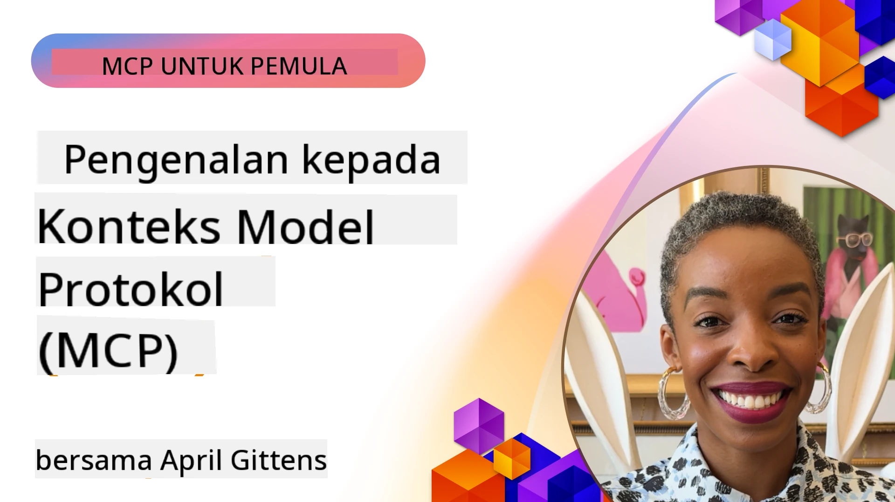
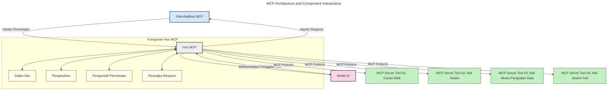
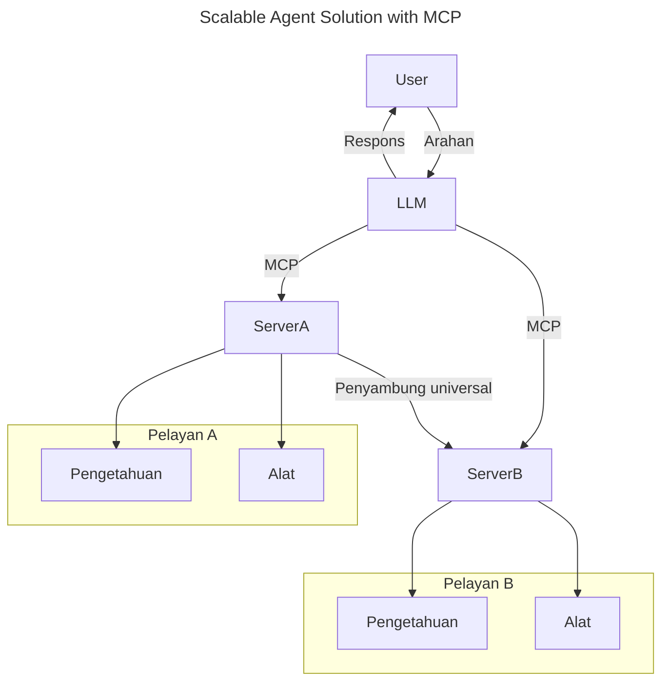
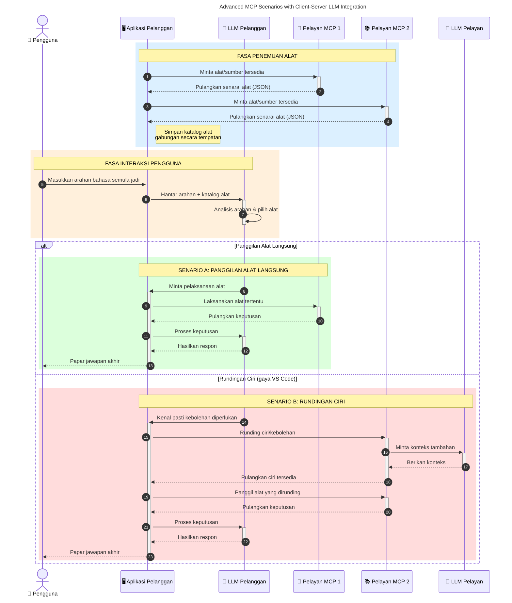

# Pengenalan kepada Protokol Konteks Model (MCP): Mengapa Ia Penting untuk Aplikasi AI yang Boleh Diskalakan

_(Klik imej di atas untuk menonton video pelajaran ini)_

Aplikasi AI generatif adalah satu langkah ke hadapan yang hebat kerana ia sering membenarkan pengguna berinteraksi dengan aplikasi menggunakan arahan bahasa semula jadi. Namun, apabila lebih banyak masa dan sumber dilaburkan dalam aplikasi tersebut, anda ingin memastikan anda boleh dengan mudah mengintegrasikan fungsi dan sumber dengan cara yang mudah untuk diperluas, yang aplikasi anda boleh menyokong lebih daripada satu model digunakan, dan mengendalikan pelbagai kerumitan model. Pendek kata, membina aplikasi Gen AI adalah mudah untuk bermula, tetapi apabila ia berkembang dan menjadi lebih kompleks, anda perlu mula mentakrifkan satu seni bina dan mungkin perlu bergantung pada satu piawaian untuk memastikan aplikasi anda dibina secara konsisten. Di sinilah MCP berperanan untuk mengatur perkara dan menyediakan piawaian.

---

## **🔍 Apakah Protokol Konteks Model (MCP)?**

**Protokol Konteks Model (MCP)** adalah **antara muka terbuka dan piawai** yang membolehkan Model Bahasa Besar (LLM) berinteraksi dengan lancar dengan alat luaran, API, dan sumber data. Ia menyediakan seni bina yang konsisten untuk meningkatkan fungsi model AI melebihi data latihan mereka, membolehkan sistem AI yang lebih bijak, boleh diskalakan, dan lebih responsif.

---

## **🎯 Mengapa Piawaian Dalam AI Penting**

Apabila aplikasi AI generatif menjadi lebih kompleks, adalah penting untuk menerima piawaian yang memastikan **kelebihan skala, keupayaan pengembangan, kebolehlaksanaan,** dan **mengelak dari terperangkap kepada pembekal tunggal**. MCP menangani keperluan ini dengan:

- Menyatupadukan integrasi model-alat
- Mengurangkan penyelesaian khusus yang rapuh dan sekali guna
- Membolehkan pelbagai model dari pembekal berbeza wujud dalam satu ekosistem

**Nota:** Walaupun MCP menganggap dirinya satu piawaian terbuka, tiada rancangan untuk menjadikan MCP piawai melalui badan piawaian sedia ada seperti IEEE, IETF, W3C, ISO, atau mana-mana badan piawaian lain.

---

## **📚 Objektif Pembelajaran**

Menjelang akhir artikel ini, anda akan dapat:

- Mentakrifkan **Protokol Konteks Model (MCP)** dan kes gunanya
- Memahami bagaimana MCP mempiawai komunikasi model-ke-alat
- Mengenal pasti komponen teras seni bina MCP
- Meneroka aplikasi dunia sebenar MCP dalam konteks perusahaan dan pembangunan

---

## **💡 Mengapa Protokol Konteks Model (MCP) Adalah Pendorong Perubahan**

### **🔗 MCP Menyelesaikan Fragmentasi dalam Interaksi AI**

Sebelum MCP, mengintegrasikan model dengan alat memerlukan:

- Kod khusus bagi setiap pasangan alat-model
- API tidak piawai bagi setiap pembekal
- Kerap berlaku gangguan akibat kemas kini
- Skala yang lemah apabila menambah alat lebih banyak

### **✅ Manfaat Piawaian MCP**

| **Manfaat**               | **Huraian**                                                                     |
|--------------------------|--------------------------------------------------------------------------------|
| Interoperabiliti         | LLM berfungsi dengan lancar dengan alat dari pelbagai pembekal                   |
| Konsistensi              | Tingkah laku seragam merentasi platform dan alat                                 |
| Keboleguan               | Alat yang dibina sekali boleh digunakan dalam projek dan sistem lain             |
| Pembangunan Dipercepatkan| Mengurangkan masa pembangunan dengan menggunakan antara muka piawai, plug-and-play|

---

## **🧱 Gambaran Keseluruhan Seni Bina MCP Tahap Tinggi**

MCP mengikuti **model klien-pelayan**, di mana:

- **Hos MCP** menjalankan model AI
- **Klien MCP** memulakan permintaan
- **Pelayan MCP** menyajikan konteks, alat, dan keupayaan

### **Komponen Utama:**

- **Sumber** – Data statik atau dinamik untuk model  
- **Arahan** – Aliran kerja yang telah ditetapkan untuk generasi berpandu  
- **Alat** – Fungsi boleh laksana seperti pencarian, pengiraan  
- **Persampelan** – Tingkah laku agen melalui interaksi berulang (ditinggalkan dalam
    MCP `2026-07-28`; pelaksanaan baharu harus integrasi terus dengan penyedia LLM)

- **Elicitation** – Permintaan yang dimulakan pelayan untuk input pengguna
- **Akar** – Lokasi sistem fail maklumat yang relevan kepada pelayan
    (ditinggalkan dalam MCP `2026-07-28`; pilih parameter alat, URI sumber, atau
    konfigurasi pelayan)

### **Seni Bina Protokol:**

MCP menggunakan seni bina dua lapisan:
- **Lapisan Data**: Mesej JSON-RPC 2.0, metadata bagi setiap permintaan, penemuan, dan
    primitif protokol
- **Lapisan Pengangkutan**: stdio untuk proses tempatan dan HTTP Boleh Alir untuk
    pelayan jauh. HTTP Boleh Alir boleh menggunakan pembingkaian SSE untuk respons aliran,
    tetapi pengangkutan lama HTTP+SSE telah ditinggalkan.

---

## Bagaimana Pelayan MCP Berfungsi

Pelayan MCP beroperasi dengan cara berikut:

- **Aliran Permintaan**:
    1. Permintaan dimulakan oleh pengguna akhir atau perisian yang bertindak atas nama mereka.
    2. **Klien MCP** menghantar permintaan kepada **Hos MCP**, yang menguruskan runtime Model AI.
    3. **Model AI** menerima arahan pengguna dan mungkin meminta akses kepada alat atau data luaran melalui satu atau lebih panggilan alat.
    4. **Hos MCP**, bukan model secara langsung, berkomunikasi dengan **Pelayan MCP** yang sesuai menggunakan protokol piawai.
- **Fungsi Hos MCP**:
    - **Pendaftar Alat**: Menyimpan katalog alat yang tersedia dan keupayaan mereka.
    - **Pengesahan**: Mengesahkan kebenaran akses alat.
    - **Pengendali Permintaan**: Memproses permintaan alat yang diterima dari model.
    - **Pemformat Respons**: Menstrukturkan output alat dalam format yang dapat difahami oleh model.
- **Pelaksanaan Pelayan MCP**:
    - **Hos MCP** mengarahkan panggilan alat kepada satu atau lebih **Pelayan MCP**, masing-masing yang mendedahkan fungsi khusus (contohnya, pencarian, pengiraan, pertanyaan pangkalan data).
    - **Pelayan MCP** menjalankan operasi masing-masing dan mengembalikan hasil kepada **Hos MCP** dalam format konsisten.
    - **Hos MCP** memformat dan menyampaikan hasil ini kepada **Model AI**.
- **Penyempurnaan Respons**:
    - **Model AI** menggabungkan output alat ke dalam respons akhir.
    - **Hos MCP** menghantar respons ini kembali kepada **Klien MCP**, yang menyampaikannya kepada pengguna akhir atau perisian yang memanggil.
    

## 👨‍💻 Cara Membina Pelayan MCP (Dengan Contoh)

Pelayan MCP membolehkan anda memperluas keupayaan LLM dengan menyediakan data dan fungsi. 

Bersedia untuk mencubanya? Berikut adalah SDK khusus bahasa dan/atau set tumpukan dengan contoh mencipta pelayan MCP mudah dalam pelbagai bahasa/tumpukan:

- **Python SDK**: https://github.com/modelcontextprotocol/python-sdk

- **TypeScript SDK**: https://github.com/modelcontextprotocol/typescript-sdk

- **Java SDK**: https://github.com/modelcontextprotocol/java-sdk

- **C#/.NET SDK**: https://github.com/modelcontextprotocol/csharp-sdk

## 🌍 Kes Penggunaan Dunia Sebenar untuk MCP

MCP membolehkan pelbagai aplikasi dengan memperluas keupayaan AI:

| **Aplikasi**                | **Huraian**                                                                   |
|----------------------------|-------------------------------------------------------------------------------|
| Integrasi Data Perusahaan | Sambungkan LLM kepada pangkalan data, CRM, atau alat dalaman                  |
| Sistem AI Agensik          | Dayakan agen autonomi dengan akses alat dan aliran kerja membuat keputusan    |
| Aplikasi Multi-modal       | Gabungkan teks, imej, dan alat audio dalam satu aplikasi AI seragam           |
| Integrasi Data Masa Nyata  | Bawa data langsung ke dalam interaksi AI untuk output yang lebih tepat dan terkini|

### 🧠 MCP = Piawaian Universal untuk Interaksi AI

Protokol Konteks Model (MCP) bertindak sebagai piawaian universal untuk interaksi AI, sama seperti USB-C mempiawai sambungan fizikal untuk peranti. Dalam dunia AI, MCP menyediakan antara muka konsisten, membolehkan model (klien) berintegrasi dengan lancar dengan alat luaran dan penyedia data (pelayan). Ini menghapuskan keperluan untuk pelbagai protokol khusus bagi setiap API atau sumber data.

Di bawah MCP, alat yang serasi MCP (dirujuk sebagai pelayan MCP) mengikuti piawaian bersatu. Pelayan ini boleh menyenaraikan alat atau tindakan yang mereka tawarkan dan melaksanakan tindakan tersebut apabila diminta oleh agen AI. Platform agen AI yang menyokong MCP boleh menemui alat yang tersedia dari pelayan dan memanggilnya melalui protokol piawai ini.

### 💡 Memudahkan akses kepada pengetahuan

Selain menawarkan alat, MCP juga memudahkan akses kepada pengetahuan. Ia membolehkan aplikasi menyediakan konteks kepada model bahasa besar (LLM) dengan menghubungkannya kepada pelbagai sumber data. Contohnya, pelayan MCP mungkin mewakili repositori dokumen syarikat, membolehkan agen mengambil maklumat relevan bila diperlukan. Pelayan lain boleh mengendalikan tindakan tertentu seperti menghantar e-mel atau mengemas kini rekod. Dari perspektif agen, ini hanyalah alat yang boleh digunakannya—sesetengah alat mengembalikan data (konteks pengetahuan), manakala yang lain melaksanakan tindakan. MCP menguruskan kedua-duanya dengan cekap.

Agen yang berhubung dengan pelayan MCP secara automatik mempelajari keupayaan tersedia dan data yang boleh diakses melalui format piawai. Peniadaan piawaian ini membolehkan ketersediaan alat secara dinamik. Contohnya, menambah pelayan MCP baru ke sistem agen membolehkan fungsi pelayan itu digunakan serta-merta tanpa memerlukan penyesuaian lanjut arahan agen.

Integrasi yang dipermudahkan ini selaras dengan aliran yang digambarkan dalam rajah berikut, di mana pelayan menyediakan kedua-dua alat dan pengetahuan, memastikan kerjasama yang lancar antara sistem.

### 👉 Contoh: Penyelesaian Agen Boleh Diskalakan

 Penyambung Universal membolehkan pelayan MCP berkomunikasi dan berkongsi keupayaan antara satu sama lain, membolehkan ServerA mendelegasikan tugas kepada ServerB atau mengakses alat dan pengetahuannya. Ini mengautomasikan penggunaan alat dan data antara pelayan, menyokong seni bina agen yang boleh diskalakan dan modular. Oleh kerana MCP mempiawai pendedahan alat, agen boleh menemui dan mengarahkan permintaan secara dinamik antara pelayan tanpa integrasi yang tetap.

Persekutuan alat dan pengetahuan: Alat dan data boleh diakses merentasi pelayan, membolehkan seni bina agen yang lebih modular dan boleh diskalakan.

### 🔄 Senario Lanjutan MCP dengan Integrasi LLM Pihak Klien

Selain seni bina MCP asas, terdapat senario lanjutan di mana kedua-dua klien dan pelayan mengandungi LLM, membolehkan interaksi yang lebih canggih. Dalam rajah berikut, **Aplikasi Klien** boleh menjadi IDE dengan beberapa alat MCP tersedia untuk digunakan oleh LLM:

## 🔐 Manfaat Praktikal MCP

Berikut adalah manfaat praktikal menggunakan MCP:

- **Kesegaran**: Model boleh mengakses maklumat terkini melebihi data latihan mereka
- **Perluasan Keupayaan**: Model boleh menggunakan alat khusus untuk tugas yang mereka tidak dilatih
- **Pengurangan Halusinasi**: Sumber data luaran menyediakan asas fakta
- **Privasi**: Data sensitif boleh tetap dalam persekitaran selamat daripada ditanam dalam arahan

## 📌 Perkara Penting

Berikut adalah perkara penting untuk menggunakan MCP:

- **MCP** mempiawai cara model AI berinteraksi dengan alat dan data
- Menggalakkan **keupayaan pengembangan, konsistensi, dan interoperabiliti**
- MCP membantu **mengurangkan masa pembangunan, meningkatkan kebolehpercayaan, dan meluaskan keupayaan model**
- Seni bina klien-pelayan **membolehkan aplikasi AI yang fleksibel dan boleh dikembangkan**

## 🧠 Latihan

Fikirkan tentang aplikasi AI yang anda berminat untuk bina.

- Alat atau data luaran manakah yang boleh meningkatkan keupayaannya?
- Bagaimana MCP boleh menjadikan integrasi **lebih mudah dan boleh dipercayai?**

## Sumber Tambahan

- [Repositori GitHub MCP](https://github.com/modelcontextprotocol)

## Apa seterusnya

Seterusnya: [Bab 1: Konsep Teras](../01-CoreConcepts/README.md)

---

<!-- CO-OP TRANSLATOR DISCLAIMER START -->
**Penafian**:
Dokumen ini telah diterjemahkan menggunakan perkhidmatan terjemahan AI [Co-op Translator](https://github.com/Azure/co-op-translator). Walaupun kami berusaha untuk ketepatan, sila ambil maklum bahawa terjemahan automatik mungkin mengandungi kesilapan atau ketidaktepatan. Dokumen asal dalam bahasa asalnya harus dianggap sebagai sumber yang sahih. Untuk maklumat penting, terjemahan oleh manusia profesional adalah disyorkan. Kami tidak bertanggungjawab terhadap sebarang salah faham atau salah tafsir yang timbul daripada penggunaan terjemahan ini.
<!-- CO-OP TRANSLATOR DISCLAIMER END -->