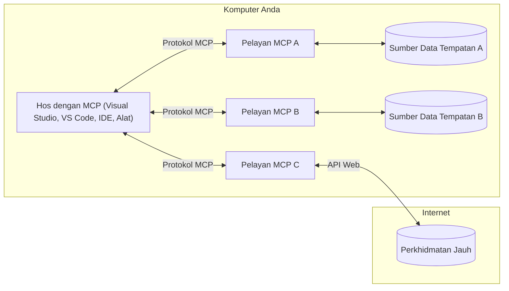

# Konsep Teras MCP: Menguasai Protokol Konteks Model untuk Integrasi AI

[](https://youtu.be/earDzWGtE84)

_(Klik imej di atas untuk menonton video pelajaran ini)_

[Model Context Protocol (MCP)](https://github.com/modelcontextprotocol) adalah rangka kerja berstandard yang kuat yang mengoptimumkan komunikasi antara Model Bahasa Besar (LLM) dan alat, aplikasi, serta sumber data luaran.  
Panduan ini akan membimbing anda melalui konsep teras MCP. Anda akan mempelajari tentang seni bina klien-pelayan, komponen penting, mekanik komunikasi, dan amalan terbaik pelaksanaan.

- **Persetujuan Pengguna Secara Eksplisit**: Semua akses data dan operasi memerlukan kelulusan pengguna secara eksplisit sebelum pelaksanaan. Pengguna mesti memahami dengan jelas data apa yang akan diakses dan tindakan apa yang akan dilakukan, dengan kawalan terperinci ke atas kebenaran dan autorisasi.

- **Perlindungan Privasi Data**: Data pengguna hanya didedahkan dengan persetujuan eksplisit dan mesti dilindungi oleh kawalan akses yang kukuh sepanjang kitaran interaksi. Pelaksanaan mesti menghalang penghantaran data tanpa kebenaran dan mengekalkan sempadan privasi yang ketat.

- **Keselamatan Pelaksanaan Alat**: Setiap panggilan alat memerlukan persetujuan pengguna secara eksplisit dengan pemahaman jelas tentang fungsi alat, parameter, dan potensi impak. Sempadan keselamatan yang kukuh mesti menghalang pelaksanaan alat yang tidak disengajakan, tidak selamat, atau berniat jahat.

- **Keselamatan Lapisan Pengangkutan**: Semua saluran komunikasi harus menggunakan mekanisme penyulitan dan pengesahan yang sesuai. Sambungan jauh harus melaksanakan protokol pengangkutan selamat dan pengurusan kelayakan yang betul.

#### Garis Panduan Pelaksanaan:

- **Pengurusan Kebenaran**: Laksanakan sistem kebenaran terperinci yang membolehkan pengguna mengawal pelayan, alat, dan sumber yang boleh diakses  
- **Pengesahan & Autorisasi**: Gunakan kaedah pengesahan selamat (OAuth, kunci API) dengan pengurusan token dan tamat tempoh yang betul  
- **Pengesahan Input**: Sahkan semua parameter dan input data mengikut skema yang ditetapkan untuk mengelakkan serangan suntikan  
- **Log Audit**: Kekalkan log komprehensif semua operasi untuk pemantauan keselamatan dan pematuhan

## Gambaran Keseluruhan

Pelajaran ini meneroka seni bina asas dan komponen yang membentuk ekosistem Model Context Protocol (MCP). Anda akan mempelajari seni bina klien-pelayan, komponen utama, dan mekanisme komunikasi yang menggerakkan interaksi MCP.

## Objektif Pembelajaran Utama

Menjelang akhir pelajaran ini, anda akan:

- Memahami seni bina klien-pelayan MCP.  
- Mengenal pasti peranan dan tanggungjawab Hos, Klien, dan Pelayan.  
- Menganalisis ciri teras yang menjadikan MCP lapisan integrasi yang fleksibel.  
- Mempelajari bagaimana maklumat mengalir dalam ekosistem MCP.  
- Mendapatkan pandangan praktikal melalui contoh kod dalam .NET, Java, Python, dan JavaScript.

## Seni Bina MCP: Pandangan Mendalam

Ekosistem MCP dibina atas model klien-pelayan. Struktur modular ini membolehkan aplikasi AI berinteraksi dengan alat, pangkalan data, API, dan sumber kontekstual dengan cekap. Mari kita pecahkan seni bina ini kepada komponen terasnya.

Pada terasnya, MCP mengikuti seni bina klien-pelayan di mana aplikasi hos boleh menyambung ke pelbagai pelayan:


- **Hos MCP**: Program seperti VSCode, Claude Desktop, IDE, atau alat AI yang ingin mengakses data melalui MCP  
- **Klien MCP**: Klien protokol yang mengekalkan sambungan 1:1 dengan pelayan  
- **Pelayan MCP**: Program ringan yang masing-masing mendedahkan keupayaan tertentu melalui Model Context Protocol yang berstandard  
- **Sumber Data Tempatan**: Fail, pangkalan data, dan perkhidmatan komputer anda yang boleh diakses dengan selamat oleh pelayan MCP  
- **Perkhidmatan Jauh**: Sistem luaran yang tersedia melalui internet yang boleh disambungkan oleh pelayan MCP melalui API.

Protokol MCP adalah standard yang sedang berkembang menggunakan penomboran versi berasaskan tarikh (format YYYY-MM-DD). Versi protokol semasa ialah **2025-11-25**. Anda boleh melihat kemas kini terkini pada [spesifikasi protokol](https://modelcontextprotocol.io/specification/2025-11-25/)

### 1. Hos

Dalam Model Context Protocol (MCP), **Hos** adalah aplikasi AI yang berfungsi sebagai antara muka utama di mana pengguna berinteraksi dengan protokol. Hos mengkoordinasi dan mengurus sambungan ke pelbagai pelayan MCP dengan mencipta klien MCP khusus untuk setiap sambungan pelayan. Contoh Hos termasuk:

- **Aplikasi AI**: Claude Desktop, Visual Studio Code, Claude Code  
- **Persekitaran Pembangunan**: IDE dan penyunting kod dengan integrasi MCP  
- **Aplikasi Tersuai**: Ejen AI dan alat yang dibina khusus

**Hos** adalah aplikasi yang mengkoordinasi interaksi model AI. Mereka:

- **Mengatur Model AI**: Melaksanakan atau berinteraksi dengan LLM untuk menjana respons dan mengkoordinasi aliran kerja AI  
- **Mengurus Sambungan Klien**: Mencipta dan mengekalkan satu klien MCP bagi setiap sambungan pelayan MCP  
- **Mengawal Antara Muka Pengguna**: Mengendalikan aliran perbualan, interaksi pengguna, dan penyampaian respons  
- **Menguatkuasakan Keselamatan**: Mengawal kebenaran, sekatan keselamatan, dan pengesahan  
- **Mengendalikan Persetujuan Pengguna**: Mengurus kelulusan pengguna untuk perkongsian data dan pelaksanaan alat

### 2. Klien

**Klien** adalah komponen penting yang mengekalkan sambungan satu-ke-satu khusus antara Hos dan pelayan MCP. Setiap klien MCP dihasilkan oleh Hos untuk menyambung ke pelayan MCP tertentu, memastikan saluran komunikasi yang teratur dan selamat. Pelbagai klien membolehkan Hos menyambung ke pelbagai pelayan serentak.

**Klien** adalah komponen penyambung dalam aplikasi hos. Mereka:

- **Komunikasi Protokol**: Menghantar permintaan JSON-RPC 2.0 ke pelayan dengan arahan dan prompt  
- **Rundingan Keupayaan**: Merundingkan ciri dan versi protokol yang disokong dengan pelayan semasa inisialisasi  
- **Pelaksanaan Alat**: Mengurus permintaan pelaksanaan alat dari model dan memproses respons  
- **Kemas Kini Masa Nyata**: Mengendalikan notifikasi dan kemas kini masa nyata dari pelayan  
- **Pemprosesan Respons**: Memproses dan memformat respons pelayan untuk dipaparkan kepada pengguna

### 3. Pelayan

**Pelayan** adalah program yang menyediakan konteks, alat, dan keupayaan kepada klien MCP. Mereka boleh dijalankan secara tempatan (mesin yang sama dengan Hos) atau jauh (pada platform luaran), dan bertanggungjawab mengendalikan permintaan klien serta menyediakan respons berstruktur. Pelayan mendedahkan fungsi tertentu melalui Model Context Protocol yang berstandard.

**Pelayan** adalah perkhidmatan yang menyediakan konteks dan keupayaan. Mereka:

- **Pendaftaran Ciri**: Mendaftar dan mendedahkan primitif yang tersedia (sumber, prompt, alat) kepada klien  
- **Pemprosesan Permintaan**: Menerima dan melaksanakan panggilan alat, permintaan sumber, dan permintaan prompt dari klien  
- **Penyediaan Konteks**: Menyediakan maklumat kontekstual dan data untuk meningkatkan respons model  
- **Pengurusan Keadaan**: Mengekalkan keadaan sesi dan mengendalikan interaksi berkeadaan apabila diperlukan  
- **Notifikasi Masa Nyata**: Menghantar notifikasi tentang perubahan keupayaan dan kemas kini kepada klien yang disambungkan

Pelayan boleh dibangunkan oleh sesiapa untuk meluaskan keupayaan model dengan fungsi khusus, dan mereka menyokong senario pelaksanaan tempatan dan jauh.

### 4. Primitif Pelayan

Pelayan dalam Model Context Protocol (MCP) menyediakan tiga **primitif** teras yang mentakrifkan blok binaan asas untuk interaksi kaya antara klien, hos, dan model bahasa. Primitif ini menentukan jenis maklumat kontekstual dan tindakan yang tersedia melalui protokol.

Pelayan MCP boleh mendedahkan mana-mana gabungan tiga primitif teras berikut:

#### Sumber

**Sumber** adalah sumber data yang menyediakan maklumat kontekstual kepada aplikasi AI. Mereka mewakili kandungan statik atau dinamik yang boleh meningkatkan pemahaman dan pembuatan keputusan model:

- **Data Kontekstual**: Maklumat berstruktur dan konteks untuk penggunaan model AI  
- **Pangkalan Pengetahuan**: Repositori dokumen, artikel, manual, dan kertas penyelidikan  
- **Sumber Data Tempatan**: Fail, pangkalan data, dan maklumat sistem tempatan  
- **Data Luaran**: Respons API, perkhidmatan web, dan data sistem jauh  
- **Kandungan Dinamik**: Data masa nyata yang dikemas kini berdasarkan keadaan luaran

Sumber dikenal pasti oleh URI dan menyokong penemuan melalui kaedah `resources/list` dan pengambilan melalui `resources/read`:

```text
file://documents/project-spec.md
database://production/users/schema
api://weather/current
```

#### Prompt

**Prompt** adalah templat boleh guna semula yang membantu menyusun interaksi dengan model bahasa. Mereka menyediakan corak interaksi berstandard dan aliran kerja berformat:

- **Interaksi Berasaskan Templat**: Mesej dan permulaan perbualan yang telah distrukturkan  
- **Templat Aliran Kerja**: Urutan berstandard untuk tugas dan interaksi biasa  
- **Contoh Few-shot**: Templat berasaskan contoh untuk arahan model  
- **Prompt Sistem**: Prompt asas yang mentakrifkan tingkah laku dan konteks model  
- **Templat Dinamik**: Prompt berparameter yang menyesuaikan dengan konteks tertentu

Prompt menyokong penggantian pembolehubah dan boleh ditemui melalui `prompts/list` dan diambil dengan `prompts/get`:

```markdown
Generate a {{task_type}} for {{product}} targeting {{audience}} with the following requirements: {{requirements}}
```

#### Alat

**Alat** adalah fungsi boleh laksana yang boleh dipanggil oleh model AI untuk melaksanakan tindakan tertentu. Mereka mewakili "kata kerja" dalam ekosistem MCP, membolehkan model berinteraksi dengan sistem luaran:

- **Fungsi Boleh Laksana**: Operasi diskret yang boleh dipanggil model dengan parameter tertentu  
- **Integrasi Sistem Luaran**: Panggilan API, pertanyaan pangkalan data, operasi fail, pengiraan  
- **Identiti Unik**: Setiap alat mempunyai nama, penerangan, dan skema parameter yang tersendiri  
- **I/O Berstruktur**: Alat menerima parameter yang disahkan dan mengembalikan respons berstruktur dan berjenis  
- **Keupayaan Tindakan**: Membolehkan model melaksanakan tindakan dunia nyata dan mendapatkan data langsung

Alat ditakrifkan dengan JSON Schema untuk pengesahan parameter dan ditemui melalui `tools/list` serta dilaksanakan melalui `tools/call`:

```typescript
server.tool(
  "search_products", 
  {
    query: z.string().describe("Search query for products"),
    category: z.string().optional().describe("Product category filter"),
    max_results: z.number().default(10).describe("Maximum results to return")
  }, 
  async (params) => {
    // Laksanakan carian dan kembalikan hasil yang berstruktur
    return await productService.search(params);
  }
);
```

## Primitif Klien

Dalam Model Context Protocol (MCP), **klien** boleh mendedahkan primitif yang membolehkan pelayan meminta keupayaan tambahan dari aplikasi hos. Primitif sisi klien ini membolehkan pelaksanaan pelayan yang lebih kaya dan interaktif yang boleh mengakses keupayaan model AI dan interaksi pengguna.

### Sampling

**Sampling** membolehkan pelayan meminta penyempurnaan model bahasa dari aplikasi AI klien. Primitif ini membolehkan pelayan mengakses keupayaan LLM tanpa menyertakan pergantungan model mereka sendiri:

- **Akses Bebas Model**: Pelayan boleh meminta penyempurnaan tanpa memasukkan SDK LLM atau mengurus akses model  
- **AI Dimulakan Pelayan**: Membolehkan pelayan menjana kandungan secara autonomi menggunakan model AI klien  
- **Interaksi LLM Rekursif**: Menyokong senario kompleks di mana pelayan memerlukan bantuan AI untuk pemprosesan  
- **Penjanaan Kandungan Dinamik**: Membolehkan pelayan mencipta respons kontekstual menggunakan model hos

Sampling dimulakan melalui kaedah `sampling/complete`, di mana pelayan menghantar permintaan penyempurnaan kepada klien.

### Elicitation

**Elicitation** membolehkan pelayan meminta maklumat tambahan atau pengesahan dari pengguna melalui antara muka klien:

- **Permintaan Input Pengguna**: Pelayan boleh meminta maklumat tambahan apabila diperlukan untuk pelaksanaan alat  
- **Dialog Pengesahan**: Meminta kelulusan pengguna untuk operasi sensitif atau berimpak  
- **Aliran Kerja Interaktif**: Membolehkan pelayan mencipta interaksi pengguna langkah demi langkah  
- **Pengumpulan Parameter Dinamik**: Mengumpul parameter yang hilang atau pilihan semasa pelaksanaan alat

Permintaan elicitation dibuat menggunakan kaedah `elicitation/request` untuk mengumpul input pengguna melalui antara muka klien.

### Logging

**Logging** membolehkan pelayan menghantar mesej log berstruktur kepada klien untuk debugging, pemantauan, dan keterlihatan operasi:

- **Sokongan Debugging**: Membolehkan pelayan menyediakan log pelaksanaan terperinci untuk penyelesaian masalah  
- **Pemantauan Operasi**: Menghantar kemas kini status dan metrik prestasi kepada klien  
- **Laporan Ralat**: Menyediakan konteks ralat terperinci dan maklumat diagnostik  
- **Jejak Audit**: Mencipta log komprehensif operasi dan keputusan pelayan

Mesej logging dihantar kepada klien untuk menyediakan ketelusan dalam operasi pelayan dan memudahkan debugging.

## Aliran Maklumat dalam MCP

Model Context Protocol (MCP) mentakrifkan aliran maklumat berstruktur antara hos, klien, pelayan, dan model. Memahami aliran ini membantu menjelaskan bagaimana permintaan pengguna diproses dan bagaimana alat serta data luaran diintegrasikan ke dalam respons model.

- **Hos Memulakan Sambungan**  
  Aplikasi hos (seperti IDE atau antara muka sembang) mewujudkan sambungan ke pelayan MCP, biasanya melalui STDIO, WebSocket, atau pengangkutan lain yang disokong.

- **Rundingan Keupayaan**  
  Klien (terbenam dalam hos) dan pelayan bertukar maklumat tentang ciri, alat, sumber, dan versi protokol yang disokong. Ini memastikan kedua-dua pihak memahami keupayaan yang tersedia untuk sesi tersebut.

- **Permintaan Pengguna**  
  Pengguna berinteraksi dengan hos (contohnya, memasukkan prompt atau arahan). Hos mengumpul input ini dan menyerahkannya kepada klien untuk diproses.

- **Penggunaan Sumber atau Alat**  
  - Klien mungkin meminta konteks atau sumber tambahan dari pelayan (seperti fail, entri pangkalan data, atau artikel pangkalan pengetahuan) untuk memperkayakan pemahaman model.  
  - Jika model menentukan bahawa alat diperlukan (contohnya, untuk mendapatkan data, melakukan pengiraan, atau memanggil API), klien menghantar permintaan panggilan alat kepada pelayan, menyatakan nama alat dan parameter.

- **Pelaksanaan Pelayan**  
  Pelayan menerima permintaan sumber atau alat, melaksanakan operasi yang diperlukan (seperti menjalankan fungsi, membuat pertanyaan pangkalan data, atau mendapatkan fail), dan mengembalikan hasil kepada klien dalam format berstruktur.

- **Penjanaan Respons**  
  Klien menggabungkan respons pelayan (data sumber, output alat, dan lain-lain) ke dalam interaksi model yang sedang berjalan. Model menggunakan maklumat ini untuk menjana respons yang komprehensif dan relevan secara kontekstual.

- **Pembentangan Keputusan**  
  Hos menerima output akhir dari klien dan membentangkannya kepada pengguna, sering kali termasuk teks yang dijana model dan sebarang hasil dari pelaksanaan alat atau pencarian sumber.

Aliran ini membolehkan MCP menyokong aplikasi AI yang maju, interaktif, dan peka konteks dengan menghubungkan model dengan alat dan sumber data luaran secara lancar.

## Seni Bina & Lapisan Protokol

MCP terdiri daripada dua lapisan seni bina yang berbeza yang bekerjasama untuk menyediakan rangka kerja komunikasi lengkap:

### Lapisan Data

**Lapisan Data** melaksanakan protokol MCP teras menggunakan **JSON-RPC 2.0** sebagai asasnya. Lapisan ini mentakrifkan struktur mesej, semantik, dan corak interaksi:

#### Komponen Teras:

- **Protokol JSON-RPC 2.0**: Semua komunikasi menggunakan format mesej JSON-RPC 2.0 yang berstandard untuk panggilan kaedah, respons, dan notifikasi
- **Pengurusan Kitaran Hayat**: Mengendalikan inisialisasi sambungan, rundingan keupayaan, dan penamatan sesi antara klien dan pelayan  
- **Primitif Pelayan**: Membolehkan pelayan menyediakan fungsi teras melalui alat, sumber, dan arahan  
- **Primitif Klien**: Membolehkan pelayan meminta pensampelan dari LLM, mendapatkan input pengguna, dan menghantar mesej log  
- **Pemberitahuan Masa Nyata**: Menyokong pemberitahuan tak segerak untuk kemas kini dinamik tanpa pengimbasan  

#### Ciri-ciri Utama:

- **Rundingan Versi Protokol**: Menggunakan penomboran versi berasaskan tarikh (YYYY-MM-DD) untuk memastikan keserasian  
- **Penemuan Keupayaan**: Klien dan pelayan bertukar maklumat ciri yang disokong semasa inisialisasi  
- **Sesi Berkeadaan**: Mengekalkan keadaan sambungan merentasi pelbagai interaksi untuk kesinambungan konteks  

### Lapisan Pengangkutan

**Lapisan Pengangkutan** menguruskan saluran komunikasi, pembingkaian mesej, dan pengesahan antara peserta MCP:

#### Mekanisme Pengangkutan yang Disokong:

1. **Pengangkutan STDIO**:  
   - Menggunakan aliran input/output standard untuk komunikasi proses langsung  
   - Optimum untuk proses tempatan pada mesin yang sama tanpa beban rangkaian  
   - Lazim digunakan untuk pelaksanaan pelayan MCP tempatan  

2. **Pengangkutan HTTP Boleh Alir**:  
   - Menggunakan HTTP POST untuk mesej klien-ke-pelayan  
   - Pilihan Server-Sent Events (SSE) untuk penstriman pelayan-ke-klien  
   - Membolehkan komunikasi pelayan jauh merentasi rangkaian  
   - Menyokong pengesahan HTTP standard (token pembawa, kunci API, pengepala tersuai)  
   - MCP mengesyorkan OAuth untuk pengesahan berasaskan token yang selamat  

#### Abstraksi Pengangkutan:

Lapisan pengangkutan mengabstrakkan butiran komunikasi daripada lapisan data, membolehkan format mesej JSON-RPC 2.0 yang sama digunakan merentasi semua mekanisme pengangkutan. Abstraksi ini membolehkan aplikasi bertukar antara pelayan tempatan dan jauh dengan lancar.

### Pertimbangan Keselamatan

Pelaksanaan MCP mesti mematuhi beberapa prinsip keselamatan kritikal untuk memastikan interaksi yang selamat, boleh dipercayai, dan terjamin merentasi semua operasi protokol:

- **Persetujuan dan Kawalan Pengguna**: Pengguna mesti memberikan persetujuan jelas sebelum sebarang data diakses atau operasi dilakukan. Mereka harus mempunyai kawalan yang jelas terhadap data yang dikongsi dan tindakan yang dibenarkan, disokong oleh antara muka pengguna intuitif untuk menyemak dan meluluskan aktiviti.

- **Privasi Data**: Data pengguna hanya boleh didedahkan dengan persetujuan jelas dan mesti dilindungi oleh kawalan akses yang sesuai. Pelaksanaan MCP mesti melindungi daripada penghantaran data tanpa kebenaran dan memastikan privasi dikekalkan sepanjang interaksi.

- **Keselamatan Alat**: Sebelum memanggil mana-mana alat, persetujuan jelas pengguna diperlukan. Pengguna harus memahami dengan jelas fungsi setiap alat, dan sempadan keselamatan yang kukuh mesti dikuatkuasakan untuk mengelakkan pelaksanaan alat yang tidak disengajakan atau tidak selamat.

Dengan mengikuti prinsip keselamatan ini, MCP memastikan kepercayaan pengguna, privasi, dan keselamatan dikekalkan merentasi semua interaksi protokol sambil membolehkan integrasi AI yang berkuasa.

## Contoh Kod: Komponen Utama

Berikut adalah contoh kod dalam beberapa bahasa pengaturcaraan popular yang menggambarkan cara melaksanakan komponen pelayan MCP utama dan alat.

### Contoh .NET: Mewujudkan Pelayan MCP Ringkas dengan Alat

Berikut adalah contoh kod .NET praktikal yang menunjukkan cara melaksanakan pelayan MCP ringkas dengan alat tersuai. Contoh ini mempamerkan cara mentakrif dan mendaftar alat, mengendalikan permintaan, dan menyambungkan pelayan menggunakan Protokol Konteks Model.

```csharp
using System;
using System.Threading.Tasks;
using ModelContextProtocol.Server;
using ModelContextProtocol.Server.Transport;
using ModelContextProtocol.Server.Tools;

public class WeatherServer
{
    public static async Task Main(string[] args)
    {
        // Create an MCP server
        var server = new McpServer(
            name: "Weather MCP Server",
            version: "1.0.0"
        );
        
        // Register our custom weather tool
        server.AddTool<string, WeatherData>("weatherTool", 
            description: "Gets current weather for a location",
            execute: async (location) => {
                // Call weather API (simplified)
                var weatherData = await GetWeatherDataAsync(location);
                return weatherData;
            });
        
        // Connect the server using stdio transport
        var transport = new StdioServerTransport();
        await server.ConnectAsync(transport);
        
        Console.WriteLine("Weather MCP Server started");
        
        // Keep the server running until process is terminated
        await Task.Delay(-1);
    }
    
    private static async Task<WeatherData> GetWeatherDataAsync(string location)
    {
        // This would normally call a weather API
        // Simplified for demonstration
        await Task.Delay(100); // Simulate API call
        return new WeatherData { 
            Temperature = 72.5,
            Conditions = "Sunny",
            Location = location
        };
    }
}

public class WeatherData
{
    public double Temperature { get; set; }
    public string Conditions { get; set; }
    public string Location { get; set; }
}
```
  
### Contoh Java: Komponen Pelayan MCP

Contoh ini menunjukkan pelayan MCP yang sama dan pendaftaran alat seperti contoh .NET di atas, tetapi dilaksanakan dalam Java.

```java
import io.modelcontextprotocol.server.McpServer;
import io.modelcontextprotocol.server.McpToolDefinition;
import io.modelcontextprotocol.server.transport.StdioServerTransport;
import io.modelcontextprotocol.server.tool.ToolExecutionContext;
import io.modelcontextprotocol.server.tool.ToolResponse;

public class WeatherMcpServer {
    public static void main(String[] args) throws Exception {
        // Cipta pelayan MCP
        McpServer server = McpServer.builder()
            .name("Weather MCP Server")
            .version("1.0.0")
            .build();
            
        // Daftar alat cuaca
        server.registerTool(McpToolDefinition.builder("weatherTool")
            .description("Gets current weather for a location")
            .parameter("location", String.class)
            .execute((ToolExecutionContext ctx) -> {
                String location = ctx.getParameter("location", String.class);
                
                // Dapatkan data cuaca (dipermudahkan)
                WeatherData data = getWeatherData(location);
                
                // Pulangkan respons yang diformat
                return ToolResponse.content(
                    String.format("Temperature: %.1f°F, Conditions: %s, Location: %s", 
                    data.getTemperature(), 
                    data.getConditions(), 
                    data.getLocation())
                );
            })
            .build());
        
        // Sambungkan pelayan menggunakan pengangkutan stdio
        try (StdioServerTransport transport = new StdioServerTransport()) {
            server.connect(transport);
            System.out.println("Weather MCP Server started");
            // Kekalkan pelayan berjalan sehingga proses dihentikan
            Thread.currentThread().join();
        }
    }
    
    private static WeatherData getWeatherData(String location) {
        // Pelaksanaan akan memanggil API cuaca
        // Dipermudahkan untuk tujuan contoh
        return new WeatherData(72.5, "Sunny", location);
    }
}

class WeatherData {
    private double temperature;
    private String conditions;
    private String location;
    
    public WeatherData(double temperature, String conditions, String location) {
        this.temperature = temperature;
        this.conditions = conditions;
        this.location = location;
    }
    
    public double getTemperature() {
        return temperature;
    }
    
    public String getConditions() {
        return conditions;
    }
    
    public String getLocation() {
        return location;
    }
}
```
  
### Contoh Python: Membina Pelayan MCP

Contoh ini menggunakan fastmcp, jadi sila pastikan anda memasangnya terlebih dahulu:

```python
pip install fastmcp
```
Kod Contoh:

```python
#!/usr/bin/env python3
import asyncio
from fastmcp import FastMCP
from fastmcp.transports.stdio import serve_stdio

# Cipta pelayan FastMCP
mcp = FastMCP(
    name="Weather MCP Server",
    version="1.0.0"
)

@mcp.tool()
def get_weather(location: str) -> dict:
    """Gets current weather for a location."""
    return {
        "temperature": 72.5,
        "conditions": "Sunny",
        "location": location
    }

# Pendekatan alternatif menggunakan kelas
class WeatherTools:
    @mcp.tool()
    def forecast(self, location: str, days: int = 1) -> dict:
        """Gets weather forecast for a location for the specified number of days."""
        return {
            "location": location,
            "forecast": [
                {"day": i+1, "temperature": 70 + i, "conditions": "Partly Cloudy"}
                for i in range(days)
            ]
        }

# Daftar alat kelas
weather_tools = WeatherTools()

# Mulakan pelayan
if __name__ == "__main__":
    asyncio.run(serve_stdio(mcp))
```
  
### Contoh JavaScript: Mewujudkan Pelayan MCP

Contoh ini menunjukkan penciptaan pelayan MCP dalam JavaScript dan cara mendaftar dua alat berkaitan cuaca.

```javascript
// Menggunakan SDK Protokol Konteks Model rasmi
import { McpServer } from "@modelcontextprotocol/sdk/server/mcp.js";
import { StdioServerTransport } from "@modelcontextprotocol/sdk/server/stdio.js";
import { z } from "zod"; // Untuk pengesahan parameter

// Cipta pelayan MCP
const server = new McpServer({
  name: "Weather MCP Server",
  version: "1.0.0"
});

// Takrifkan alat cuaca
server.tool(
  "weatherTool",
  {
    location: z.string().describe("The location to get weather for")
  },
  async ({ location }) => {
    // Ini biasanya akan memanggil API cuaca
    // Dipermudahkan untuk demonstrasi
    const weatherData = await getWeatherData(location);
    
    return {
      content: [
        { 
          type: "text", 
          text: `Temperature: ${weatherData.temperature}°F, Conditions: ${weatherData.conditions}, Location: ${weatherData.location}` 
        }
      ]
    };
  }
);

// Takrifkan alat ramalan
server.tool(
  "forecastTool",
  {
    location: z.string(),
    days: z.number().default(3).describe("Number of days for forecast")
  },
  async ({ location, days }) => {
    // Ini biasanya akan memanggil API cuaca
    // Dipermudahkan untuk demonstrasi
    const forecast = await getForecastData(location, days);
    
    return {
      content: [
        { 
          type: "text", 
          text: `${days}-day forecast for ${location}: ${JSON.stringify(forecast)}` 
        }
      ]
    };
  }
);

// Fungsi pembantu
async function getWeatherData(location) {
  // Mensimulasikan panggilan API
  return {
    temperature: 72.5,
    conditions: "Sunny",
    location: location
  };
}

async function getForecastData(location, days) {
  // Mensimulasikan panggilan API
  return Array.from({ length: days }, (_, i) => ({
    day: i + 1,
    temperature: 70 + Math.floor(Math.random() * 10),
    conditions: i % 2 === 0 ? "Sunny" : "Partly Cloudy"
  }));
}

// Sambungkan pelayan menggunakan pengangkutan stdio
const transport = new StdioServerTransport();
server.connect(transport).catch(console.error);

console.log("Weather MCP Server started");
```
  
Contoh JavaScript ini menunjukkan cara mencipta klien MCP yang menyambung ke pelayan, menghantar arahan, dan memproses respons termasuk sebarang panggilan alat yang dibuat.

## Keselamatan dan Kebenaran

MCP merangkumi beberapa konsep dan mekanisme terbina dalam untuk mengurus keselamatan dan kebenaran sepanjang protokol:

1. **Kawalan Kebenaran Alat**:  
   Klien boleh menentukan alat mana yang dibenarkan digunakan oleh model semasa sesi. Ini memastikan hanya alat yang diberi kuasa secara eksplisit boleh diakses, mengurangkan risiko operasi yang tidak disengajakan atau tidak selamat. Kebenaran boleh dikonfigurasi secara dinamik berdasarkan keutamaan pengguna, polisi organisasi, atau konteks interaksi.

2. **Pengesahan**:  
   Pelayan boleh memerlukan pengesahan sebelum memberi akses kepada alat, sumber, atau operasi sensitif. Ini mungkin melibatkan kunci API, token OAuth, atau skema pengesahan lain. Pengesahan yang betul memastikan hanya klien dan pengguna yang dipercayai boleh memanggil keupayaan sisi pelayan.

3. **Pengesahan Parameter**:  
   Pengesahan parameter dikuatkuasakan untuk semua panggilan alat. Setiap alat mentakrifkan jenis, format, dan kekangan yang dijangka untuk parameternya, dan pelayan mengesahkan permintaan yang diterima dengan sewajarnya. Ini menghalang input yang rosak atau berniat jahat daripada mencapai pelaksanaan alat dan membantu mengekalkan integriti operasi.

4. **Had Kadar**:  
   Untuk mengelakkan penyalahgunaan dan memastikan penggunaan sumber pelayan yang adil, pelayan MCP boleh melaksanakan had kadar untuk panggilan alat dan akses sumber. Had kadar boleh dikenakan per pengguna, per sesi, atau secara global, dan membantu melindungi daripada serangan penafian perkhidmatan atau penggunaan sumber yang berlebihan.

Dengan menggabungkan mekanisme ini, MCP menyediakan asas yang selamat untuk mengintegrasikan model bahasa dengan alat dan sumber data luaran, sambil memberi pengguna dan pembangun kawalan terperinci ke atas akses dan penggunaan.

## Mesej Protokol & Aliran Komunikasi

Komunikasi MCP menggunakan mesej **JSON-RPC 2.0** yang berstruktur untuk memudahkan interaksi yang jelas dan boleh dipercayai antara hos, klien, dan pelayan. Protokol mentakrif corak mesej khusus untuk jenis operasi yang berbeza:

### Jenis Mesej Teras:

#### **Mesej Inisialisasi**  
- Permintaan **`initialize`**: Menubuhkan sambungan dan merundingkan versi protokol serta keupayaan  
- Respons **`initialize`**: Mengesahkan ciri yang disokong dan maklumat pelayan  
- **`notifications/initialized`**: Menandakan bahawa inisialisasi selesai dan sesi sedia  

#### **Mesej Penemuan**  
- Permintaan **`tools/list`**: Menemui alat yang tersedia dari pelayan  
- Permintaan **`resources/list`**: Menyenaraikan sumber yang tersedia (punca data)  
- Permintaan **`prompts/list`**: Mendapatkan templat arahan yang tersedia  

#### **Mesej Pelaksanaan**  
- Permintaan **`tools/call`**: Melaksanakan alat tertentu dengan parameter yang disediakan  
- Permintaan **`resources/read`**: Mendapatkan kandungan dari sumber tertentu  
- Permintaan **`prompts/get`**: Mendapatkan templat arahan dengan parameter pilihan  

#### **Mesej Sisi Klien**  
- Permintaan **`sampling/complete`**: Pelayan meminta penyempurnaan LLM dari klien  
- **`elicitation/request`**: Pelayan meminta input pengguna melalui antara muka klien  
- Mesej Log: Pelayan menghantar mesej log berstruktur ke klien  

#### **Mesej Pemberitahuan**  
- **`notifications/tools/list_changed`**: Pelayan memberitahu klien tentang perubahan alat  
- **`notifications/resources/list_changed`**: Pelayan memberitahu klien tentang perubahan sumber  
- **`notifications/prompts/list_changed`**: Pelayan memberitahu klien tentang perubahan arahan  

### Struktur Mesej:

Semua mesej MCP mengikuti format JSON-RPC 2.0 dengan:  
- **Mesej Permintaan**: Termasuk `id`, `method`, dan `params` pilihan  
- **Mesej Respons**: Termasuk `id` dan sama ada `result` atau `error`  
- **Mesej Pemberitahuan**: Termasuk `method` dan `params` pilihan (tiada `id` atau respons dijangka)  

Komunikasi berstruktur ini memastikan interaksi yang boleh dipercayai, boleh dijejak, dan boleh dikembangkan menyokong senario lanjutan seperti kemas kini masa nyata, rantai alat, dan pengendalian ralat yang kukuh.

## Perkara Penting

- **Seni Bina**: MCP menggunakan seni bina klien-pelayan di mana hos menguruskan pelbagai sambungan klien ke pelayan  
- **Peserta**: Ekosistem merangkumi hos (aplikasi AI), klien (penyambung protokol), dan pelayan (penyedia keupayaan)  
- **Mekanisme Pengangkutan**: Komunikasi menyokong STDIO (tempatan) dan HTTP Boleh Alir dengan SSE pilihan (jauh)  
- **Primitif Teras**: Pelayan mendedahkan alat (fungsi boleh laksana), sumber (punca data), dan arahan (templat)  
- **Primitif Klien**: Pelayan boleh meminta pensampelan (penyempurnaan LLM), elicitation (input pengguna), dan log dari klien  
- **Asas Protokol**: Dibina atas JSON-RPC 2.0 dengan penomboran versi berasaskan tarikh (semasa: 2025-11-25)  
- **Keupayaan Masa Nyata**: Menyokong pemberitahuan untuk kemas kini dinamik dan penyegerakan masa nyata  
- **Keselamatan Diutamakan**: Persetujuan pengguna jelas, perlindungan privasi data, dan pengangkutan selamat adalah keperluan teras  

## Latihan

Reka alat MCP ringkas yang berguna dalam domain anda. Takrifkan:  
1. Nama alat tersebut  
2. Parameter yang diterima  
3. Output yang akan dikembalikan  
4. Cara model boleh menggunakan alat ini untuk menyelesaikan masalah pengguna  

---

## Apa seterusnya

Seterusnya: [Bab 2: Keselamatan](../02-Security/README.md)

---

<!-- CO-OP TRANSLATOR DISCLAIMER START -->
**Penafian**:  
Dokumen ini telah diterjemahkan menggunakan perkhidmatan terjemahan AI [Co-op Translator](https://github.com/Azure/co-op-translator). Walaupun kami berusaha untuk ketepatan, sila ambil maklum bahawa terjemahan automatik mungkin mengandungi kesilapan atau ketidaktepatan. Dokumen asal dalam bahasa asalnya harus dianggap sebagai sumber yang sahih. Untuk maklumat penting, terjemahan profesional oleh manusia adalah disyorkan. Kami tidak bertanggungjawab atas sebarang salah faham atau salah tafsir yang timbul daripada penggunaan terjemahan ini.
<!-- CO-OP TRANSLATOR DISCLAIMER END -->