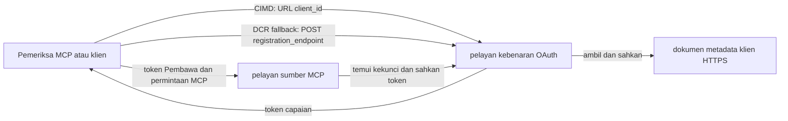

# Contoh Kebenaran CIMD dan DCR

Contoh TypeScript ini membandingkan dua cara klien OAuth boleh memperoleh identiti
sebelum mengakses pelayan MCP yang dilindungi:

- **Dokumen Metadata Pengenal Pelanggan (CIMD)** menggunakan URL HTTPS yang stabil sebagai
  `client_id`. Ini adalah mekanisme yang disukai untuk klien dan pelayan kebenaran
  yang tiada hubungan sedia ada.
- **Pendaftaran Klien Dinamik (DCR)** meminta pelayan kebenaran untuk mencipta
  ID klien tidak jelas semasa masa jalan. MCP `2026-07-28` mengekalkan DCR hanya untuk
  keserasian ke belakang.

Contoh ini menggunakan SDK TypeScript MCP v2 yang stabil dan model permintaan
MCP `2026-07-28` yang tanpa keadaan. Ia berfungsi dengan pelayan kebenaran OAuth 2.1/OpenID
Connect luaran seperti Auth0. Pelayan MCP adalah pelayan sumber: ia memvalidasi token akses
tetapi tidak mengesahkan pengguna atau mengeluarkan token.


## Objektif Pembelajaran

Dengan melengkapkan contoh ini, anda akan boleh:

- Jelaskan mengapa CIMD lebih disukai berbanding DCR untuk klien MCP baru.
- Terbitkan dokumen CIMD yang sah untuk klien asli awam.
- Konfigurasikan pelayan sumber MCP untuk penemuan OAuth dan pengesahan JWT.
- Amalkan CIMD dan DCR dengan pelayan MCP dan pelayan kebenaran yang sama.
- Laksana skop OAuth dalam alat MCP.
- Kenal pasti tanggungjawab yang dimiliki oleh klien, pelayan sumber, dan
  pelayan kebenaran.

## Seni Bina



Pelayan kebenaran memilih dan memvalidasi mekanisme pendaftaran.
Pelayan MCP hanya melihat `client_id` tuntutan disahkan yang terhasil. URL HTTPS
dengan laluan mengenal pasti CIMD. ID tidak jelas tidak cukup untuk membuktikan DCR kerana
klien pra-berdaftar juga boleh menggunakan ID tidak jelas; tetapan opsyenal
`DCR_CLIENT_ID_PREFIX` menyediakan petunjuk demo khusus penyedia.

## Keutamaan Pendaftaran

Klien MCP yang menyokong setiap mekanisme harus menggunakan urutan ini:

1. Gunakan maklumat klien pra-berdaftar apabila ia sudah tersedia.
2. Gunakan CIMD apabila pelayan kebenaran mengiklankan
   `client_id_metadata_document_supported: true`.
3. Gunakan DCR hanya sebagai pilihan apabila pelayan mengiklankan
   `registration_endpoint`.
4. Tanyakan pengguna untuk maklumat klien pra-berdaftar apabila tiada yang di atas
   tersedia.

## Susun Atur Projek

```text
src/
  config.ts          Environment validation
  dcr.ts             DCR compatibility request
  mcp.ts             MCP tools and scope checks
  oauth.ts           Authorization metadata and JWT verification
  register-dcr.ts    DCR command-line helper
  registration.ts    CIMD document and mechanism classification
  server.ts          Express, OAuth discovery, and MCP endpoint
test/
  dcr.test.ts
  oauth.test.ts
  registration.test.ts
  server.test.ts
```

## Prasyarat

- Node.js 20.6 atau yang lebih baru. Skrip menggunakan `--env-file` dan `--import`.
- Pelayan kebenaran OAuth 2.1/OpenID Connect yang menyokong:
  - Aliran kod kebenaran dengan S256 PKCE.
  - Metadata Sumber Dilindungi OAuth dan Penunjuk Sumber.
  - Token akses JWT dan titik akhir JWKS.
  - CIMD, serta DCR jika anda ingin membandingkan pilihan peninggalan.
- MCP Inspector atau klien MCP `2026-07-28` lain.
- URL HTTPS awam untuk dokumen CIMD. Terowong pembangunan sesuai untuk
  makmal; gunakan domain stabil dalam produksi.

## Pasang dan Uji

```bash
npm install
npm run build
npm test
```

Dua belas ujian ini menggunakan kunci tempatan dan titik akhir HTTP palsu. Mereka tidak memerlukan
akaun pelayan kebenaran. Mereka mengesahkan:

- Bentuk dokumen CIMD dan kekangan URL.
- Klasifikasi jujur URL dan ID klien tidak jelas.
- Pengendalian permintaan dan respons DCR.
- Penolakan titik akhir DCR bukan loopback yang tidak selamat.
- Tandatangan JWT, penerbit, penonton, tamat tempoh, ID klien, dan pengesahan skop.
- Panggilan MCP `2026-07-28` dalam proses kepada `registration-info`.

## Konfigurasikan Pelayan Kebenaran

Nama kawalan tepat berbeza mengikut penyedia. Konfigurasikan kebolehan ini:

1. Cipta API atau pelayan sumber yang pengenalannya tepat padan dengan URL MCP anda,
   termasuk `/mcp`, contohnya `http://127.0.0.1:3001/mcp`.
2. Gunakan token akses RS256 dan sertakan tuntutan `client_id` atau `azp`.
3. Tambahkan kebenaran atau skop `tool:greet`.
4. Dayakan aliran kod kebenaran dengan S256 PKCE untuk klien asli awam.
5. Dayakan Dokumen Metadata ID Klien.
6. Untuk perbandingan sahaja, dayakan Pendaftaran Klien Dinamik.
7. Pastikan metadata pelayan kebenaran mengiklankan:
   - `issuer`
   - `authorization_endpoint`
   - `token_endpoint`
   - `jwks_uri`
   - `client_id_metadata_document_supported: true`
   - `registration_endpoint` apabila DCR diaktifkan

### Contoh Auth0

Untuk Auth0, dayakan Pendaftaran Dokumen Metadata ID Klien, Pendaftaran Aplikasi Dinamik OIDC,
dan keserasian Parameter Sumber. Cipta API yang pengenalnya adalah URL MCP tepat dan tambah
kebenaran `tool:greet`.
Benarkan pengguna ujian dan klien pihak ketiga untuk memohon kebenaran itu.

Papan pemuka penyedia dan ketersediaan ciri berubah dari masa ke masa. Semak
dokumentasi penyedia sebelum menggunakan tetapan ini di luar makmal ini.

## Konfigurasikan Contoh

Cipta `.env` dari contoh:

```powershell
Copy-Item .env.example .env
```

Pada cangkang yang serasi bash:

```bash
cp .env.example .env
```

Tetapkan nilai ini:

```dotenv
MCP_SERVER_URL=http://127.0.0.1:3001/mcp
AUTHORIZATION_SERVER_ISSUER=https://your-tenant.example.com/
AUTHORIZATION_SERVER_METADATA_URL=https://your-tenant.example.com/.well-known/openid-configuration
CLIENT_METADATA_URL=https://your-public-host.example.com/client-metadata.json
OAUTH_REDIRECT_URIS=http://127.0.0.1:6274/oauth/callback
DCR_CLIENT_ID_PREFIX=tpc_
```

Butiran penting:

- `AUTHORIZATION_SERVER_ISSUER` mesti tepat padan dengan `issuer` dalam metadata pelayan
  kebenaran yang ditemui, termasuk sebarang slash hujung.
- `MCP_SERVER_URL` mesti padan dengan penonton token akses.
- `CLIENT_METADATA_URL` mesti menggunakan HTTPS, mengandungi laluan bukan akar, dan merupakan
  URL awam yang menyajikan laluan metadata. String pertanyaan dan fragmen
  ditolak supaya laluan dan `client_id` kekal sama.
- `OAUTH_REDIRECT_URIS` ialah senarai benarkan yang dipisahkan koma. Lalai adalah loopback
  balik panggilan MCP Inspector.
- `DCR_CLIENT_ID_PREFIX` adalah pilihan dan khusus penyedia. Biarkan kosong apabila
  penyedia anda tiada awalan DCR yang boleh dipercayai.

## Terbitkan Dokumen CIMD

Mulakan terowong yang memajukan asal HTTPS awamnya ke `127.0.0.1:3001`.
Tetapkan `CLIENT_METADATA_URL` ke asal itu tambah `/client-metadata.json`, kemudian jalankan:

```bash
npm run build
npm start
```

Sahkan kedua-dua dokumen penemuan:

```bash
curl http://127.0.0.1:3001/health
curl http://127.0.0.1:3001/client-metadata.json
curl http://127.0.0.1:3001/.well-known/oauth-protected-resource/mcp
```

`client_id` yang dikembalikan oleh URL metadata HTTPS awam mesti sama tepat dengan URL itu.
Pelayan kebenaran mesti memvalidasi dokumen dan URI redirect sebelum mengeluarkan token.


> [!NOTE]
> Contoh ini menghoskan dokumen klien dan pelayan sumber MCP dalam satu proses
> untuk mengekalkan makmal kecil. Dalam produksi, klien MCP memiliki dan menghoskan dokumen CIMD
> nya secara berasingan daripada pelayan sumber.

## Bandingkan CIMD dan DCR

Mulakan MCP Inspector:

```bash
npx @modelcontextprotocol/inspector
```

Gunakan HTTP Streamable dan sambungkan ke `http://127.0.0.1:3001/mcp`.

### CIMD (Pilihan Utama)


1. Masukkan `CLIENT_METADATA_URL` awam sebagai ID Klien OAuth.
2. Minta `tool:greet` serta sebarang skop identiti yang diperlukan oleh pembekal anda.
3. Selesaikan log masuk dan persetujuan.
4. Panggil `registration-info`. Ia melaporkan `mechanism: "cimd"`.
5. Panggil `greet` untuk mengesahkan pelaksanaan skop.

### DCR (Keserasian Fallback)

1. Kosongkan keadaan OAuth yang disimpan oleh Inspector.
2. Biarkan ID Klien OAuth kosong supaya Inspector boleh menggunakan
   `registration_endpoint` yang diiklankan.
3. Selesaikan log masuk dan persetujuan.
4. Panggil `registration-info`.
5. Jika `DCR_CLIENT_ID_PREFIX` sepadan dengan ID yang dihasilkan oleh pembekal,
   alat ini melaporkan `mechanism: "dcr"`; jika tidak, ia dengan betul
   melaporkan `opaque-client-id`.

Anda juga boleh menunjukkan permintaan pendaftaran secara langsung:

```bash
npm run build
npm run register:dcr
```

Pembantu mencetak ID klien yang dikembalikan tetapi tidak pernah mencetak rahsia klien.
Anggap sebarang rahsia yang dikembalikan sebagai sensitif dan simpan dalam stor rahsia yang betul.

## Alat

| Alat | Skop Diperlukan | Tujuan |
| --- | --- | --- |
| `registration-info` | Klien yang disahkan | Melaporkan jenis ID klien |
| `greet` | `tool:greet` | Menunjukkan kebenaran per alat |

## Nota Keselamatan

- Sahkan tandatangan JWT melalui titik akhir JWKS pelayan kebenaran.
- Perlukan padanan penerbit dan audien yang tepat.
- Perlukan tuntutan tamat tempoh dan ID klien.
- Jangan pernah terima token yang dikeluarkan untuk sumber yang berlainan.
- Jangan sekali-kali teruskan token MCP ke API hiliran.
- Kekalkan kelayakan DCR terikat pada penerbit yang menciptanya.
- Sahkan URI pengalihan CIMD dengan padanan tepat.
- Gunakan kawalan SSRF apabila pelayan kebenaran mengambil URL CIMD.
- Gunakan HTTPS untuk titik akhir kebenaran dan metadata di luar pembangunan
  loopback.
- Jangan simpulkan DCR dari ID klien kabur melainkan pembekal mendokumentasikan
  konvensyen pengecam yang boleh dipercayai.

## Rujukan

- [Spesifikasi kebenaran MCP](https://modelcontextprotocol.io/specification/2026-07-28/basic/authorization)
- [Pendaftaran klien MCP](https://modelcontextprotocol.io/specification/2026-07-28/basic/authorization/client-registration)
- [Amalan keselamatan terbaik MCP](https://modelcontextprotocol.io/specification/2026-07-28/basic/security_best_practices)
- [Panduan kebenaran SDK MCP TypeScript v2](https://ts.sdk.modelcontextprotocol.io/v2/serving/authorization)
- [Pendaftaran Klien Dinamik OAuth (RFC 7591)](https://datatracker.ietf.org/doc/html/rfc7591)
- [Draf Dokumen Metadata ID Klien OAuth](https://datatracker.ietf.org/doc/html/draft-ietf-oauth-client-id-metadata-document-00)

## Penghargaan

Pendekatan pengajaran berdampingan diilhamkan oleh
[Sambego/auth0-xmcp-cimd](https://github.com/Sambego/auth0-xmcp-cimd). Ini
sampel adalah pelaksanaan asli, neutral pembekal yang dibina dengan SDK MCP
TypeScript rasmi v2 untuk kurikulum ini.

---

<!-- CO-OP TRANSLATOR DISCLAIMER START -->
**Penafian**:
Dokumen ini telah diterjemahkan menggunakan perkhidmatan terjemahan AI [Co-op Translator](https://github.com/Azure/co-op-translator). Walaupun kami berusaha untuk ketepatan, sila ambil maklum bahawa terjemahan automatik mungkin mengandungi kesilapan atau ketidaktepatan. Dokumen asal dalam bahasa asalnya harus dianggap sebagai sumber yang sahih. Untuk maklumat penting, terjemahan oleh manusia profesional adalah disyorkan. Kami tidak bertanggungjawab terhadap sebarang salah faham atau salah tafsir yang timbul daripada penggunaan terjemahan ini.
<!-- CO-OP TRANSLATOR DISCLAIMER END -->