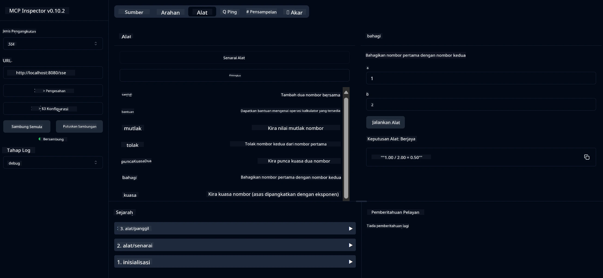

# Perkhidmatan Kalkulator Asas MCP

> [!NOTE]
> Penyelesaian Java ini menggunakan pengangkutan HTTP+SSE lama dan menyasarkan SDK
> yang serasi dengan MCP `2025-11-25`. Ia dikekalkan untuk menyamai kod kursus;
> pelayan jauh baru harus menggunakan sokongan HTTP Boleh-Stream `2026-07-28`.

Perkhidmatan ini menyediakan operasi kalkulator asas melalui Protokol Konteks Model (MCP) menggunakan Spring Boot dengan pengangkutan WebFlux. Ia direka sebagai contoh mudah untuk pemula yang belajar tentang pelaksanaan MCP.

Untuk maklumat lanjut, lihat dokumentasi rujukan [MCP Server Boot Starter](https://docs.spring.io/spring-ai/reference/api/mcp/mcp-server-boot-starter-docs.html).


## Menggunakan Perkhidmatan

Perkhidmatan ini mendedahkan titik akhir API berikut melalui protokol MCP:

- `add(a, b)`: Menambah dua nombor bersama
- `subtract(a, b)`: Menolak nombor kedua daripada nombor pertama
- `multiply(a, b)`: Mendarab dua nombor
- `divide(a, b)`: Membahagikan nombor pertama dengan yang kedua (dengan pemeriksaan sifar)
- `power(base, exponent)`: Mengira kuasa nombor
- `squareRoot(number)`: Mengira punca kuasa dua (dengan pemeriksaan nombor negatif)
- `modulus(a, b)`: Mengira baki pembahagian
- `absolute(number)`: Mengira nilai mutlak

## Kebergantungan

Projek ini memerlukan kebergantungan utama berikut:

```xml
<dependency>
    <groupId>org.springframework.ai</groupId>
    <artifactId>spring-ai-starter-mcp-server-webflux</artifactId>
</dependency>
```

## Membina Projek

Bina projek menggunakan Maven:
```bash
./mvnw clean install -DskipTests
```

## Menjalankan Pelayan

### Menggunakan Java

```bash
java -jar target/calculator-server-0.0.1-SNAPSHOT.jar
```

### Menggunakan MCP Inspector

MCP Inspector adalah alat berguna untuk berinteraksi dengan perkhidmatan MCP. Untuk menggunakannya dengan perkhidmatan kalkulator ini:

1. **Pasang dan jalankan MCP Inspector** dalam tetingkap terminal baru:
   ```bash
   npx @modelcontextprotocol/inspector
   ```

2. **Akses antaramuka web** dengan mengklik URL yang dipaparkan oleh aplikasi (biasanya http://localhost:6274)

3. **Konfigurasikan sambungan**:
   - Tetapkan jenis pengangkutan kepada "SSE"
   - Tetapkan URL ke titik akhir SSE pelayan yang berjalan: `http://localhost:8080/sse`
   - Klik "Sambung"

4. **Gunakan alat**:
   - Klik "Senarai Alat" untuk melihat operasi kalkulator yang tersedia
   - Pilih alat dan klik "Jalankan Alat" untuk melaksanakan operasi



---

<!-- CO-OP TRANSLATOR DISCLAIMER START -->
**Penafian**:
Dokumen ini telah diterjemahkan menggunakan perkhidmatan terjemahan AI [Co-op Translator](https://github.com/Azure/co-op-translator). Walaupun kami berusaha untuk ketepatan, sila ambil maklum bahawa terjemahan automatik mungkin mengandungi kesilapan atau ketidaktepatan. Dokumen asal dalam bahasa asalnya harus dianggap sebagai sumber yang sahih. Untuk maklumat penting, terjemahan oleh manusia profesional adalah disyorkan. Kami tidak bertanggungjawab terhadap sebarang salah faham atau salah tafsir yang timbul daripada penggunaan terjemahan ini.
<!-- CO-OP TRANSLATOR DISCLAIMER END -->