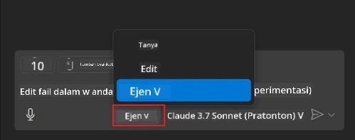
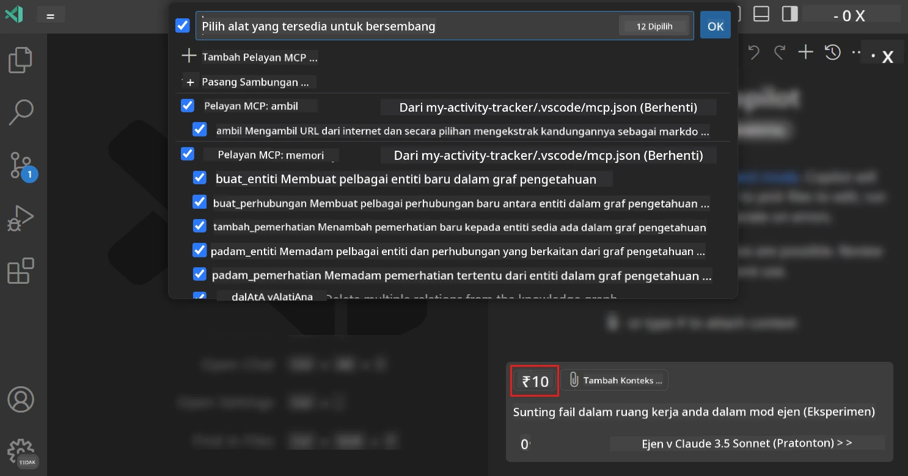
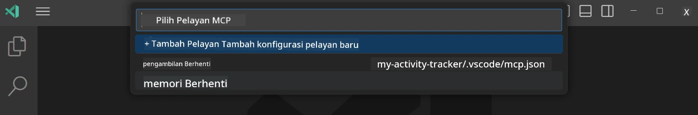
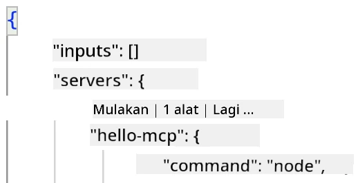
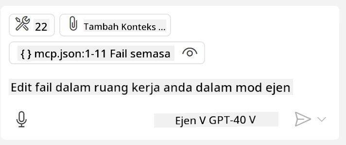
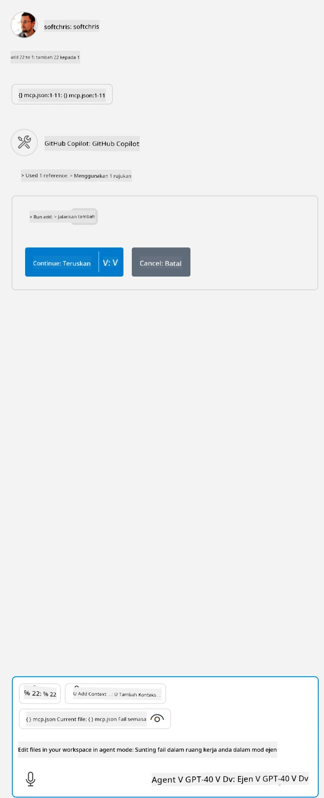

# Menggunakan pelayan daripada mod Agen GitHub Copilot

Visual Studio Code dan GitHub Copilot boleh berfungsi sebagai klien dan menggunakan Pelayan MCP. Kenapa kita mahu lakukan demikian anda mungkin bertanya? Baiklah, itu bermakna apa sahaja ciri yang dimiliki Pelayan MCP kini boleh digunakan dari dalam IDE anda. Bayangkan anda menambah contoh pelayan MCP GitHub, ini akan membolehkan kawalan GitHub melalui arahan bertulis berbanding menaip arahan tertentu di terminal. Atau bayangkan apa sahaja secara umum yang boleh meningkatkan pengalaman pembangun anda semuanya dikawal oleh bahasa semula jadi. Sekarang anda mula melihat kelebihannya bukan?

## Gambaran Keseluruhan

Pelajaran ini menerangkan bagaimana untuk menggunakan Visual Studio Code dan mod Agen GitHub Copilot sebagai klien untuk Pelayan MCP anda.

## Objektif Pembelajaran

Pada akhir pelajaran ini, anda akan boleh:

- Menggunakan Pelayan MCP melalui Visual Studio Code.
- Menjalankan kebolehan seperti alat melalui GitHub Copilot.
- Mengkonfigurasi Visual Studio Code untuk mencari dan mengurus Pelayan MCP anda.

## Penggunaan

Anda boleh mengawal pelayan MCP anda dengan dua cara berbeza:

- Antara muka pengguna, anda akan lihat bagaimana ini dilakukan kemudian dalam bab ini.
- Terminal, adalah mungkin mengawal perkara dari terminal menggunakan `code` boleh laku:

  Untuk menambah pelayan MCP ke profil pengguna anda, gunakan pilihan baris arahan --add-mcp, dan sediakan konfigurasi pelayan JSON dalam bentuk {\"name\":\"server-name\",\"command\":...}.

  ```
  code --add-mcp "{\"name\":\"my-server\",\"command\": \"uvx\",\"args\": [\"mcp-server-fetch\"]}"
  ```

### Tangkapan Skrin





Mari kita bincang lebih lanjut bagaimana kita guna antara muka visual dalam seksyen seterusnya.

## Pendekatan

Beginilah cara kita perlu mendekati ini pada tahap tinggi:

- Mengkonfigurasi sebuah fail untuk mencari Pelayan MCP kita.
- Memulakan/Menyambung kepada pelayan tersebut untuk mendapatkan senarai kebolehannya.
- Menggunakan kebolehan tersebut melalui antara muka GitHub Copilot Chat.

Hebat, sekarang kita faham aliran, mari cuba guna Pelayan MCP melalui Visual Studio Code melalui satu latihan.

## Latihan: Menggunakan pelayan

Dalam latihan ini, kita akan mengkonfigurasi Visual Studio Code untuk mencari pelayan MCP anda supaya ia boleh digunakan dari antara muka GitHub Copilot Chat.

### -0- Langkah awal, aktifkan penemuan Pelayan MCP

Anda mungkin perlu mengaktifkan penemuan Pelayan MCP.

1. Pergi ke `Fail -> Keutamaan -> Tetapan` dalam Visual Studio Code.

1. Cari "MCP" dan aktifkan `chat.mcp.discovery.enabled` dalam fail settings.json.

### -1- Cipta fail konfigurasi

Mulakan dengan mencipta fail konfigurasi dalam direktori root projek anda, anda perlu fail bernama MCP.json dan letakkan di dalam folder bernama .vscode. Ia harus kelihatan seperti ini:

```text
.vscode
|-- mcp.json
```

Seterusnya, mari lihat bagaimana kita boleh tambah entri pelayan.

### -2- Konfigurasi pelayan

Tambahkan kandungan berikut pada *mcp.json*:

```json
{
    "inputs": [],
    "servers": {
       "hello-mcp": {
           "command": "node",
           "args": [
               "build/index.js"
           ]
       }
    }
}
```

Ini contoh mudah di atas bagaimana untuk memulakan pelayan yang ditulis dalam Node.js, untuk runtime lain nyatakan arahan betul untuk memulakan pelayan menggunakan `command` dan `args`.

### -3- Mulakan pelayan

Kini anda telah menambah entri, mari mulakan pelayan:

1. Cari entri anda dalam *mcp.json* dan pastikan anda temui ikon "play":

    

1. Klik ikon "play", anda sepatutnya lihat ikon alat dalam GitHub Copilot Chat bertambah jumlah alat yang ada. Jika anda klik ikon alat tersebut, anda akan lihat senarai alat yang didaftarkan. Anda boleh tandakan/tidak tanda setiap alat bergantung jika anda mahu GitHub Copilot menggunakannya sebagai konteks:

  

1. Untuk menjalankan alat, taip arahan yang anda tahu akan sepadan dengan keterangan salah satu alat anda, contohnya arahan seperti "add 22 to 1":

  

  Anda sepatutnya nampak jawapan mengatakan 23.

## Tugasan

Cuba tambah entri pelayan dalam fail *mcp.json* anda dan pastikan anda boleh mula/berhenti pelayan itu. Pastikan anda juga boleh berkomunikasi dengan alat dalam pelayan anda melalui antara muka GitHub Copilot Chat.

## Penyelesaian

[Penyelesaian](./solution/README.md)

## Perkara Utama

Perkara utama dari bab ini adalah seperti berikut:

- Visual Studio Code ialah klien hebat yang membolehkan anda menggunakan beberapa Pelayan MCP dan alat mereka.
- Antara muka GitHub Copilot Chat adalah cara anda berinteraksi dengan pelayan-pelayan.
- Anda boleh meminta pengguna bagi input seperti kunci API yang boleh diserahkan kepada Pelayan MCP semasa mengkonfigurasi entri pelayan dalam fail *mcp.json*.

## Contoh

- [Kalkulator Java](../samples/java/calculator/README.md)
- [Kalkulator .Net](../../../../03-GettingStarted/samples/csharp)
- [Kalkulator JavaScript](../samples/javascript/README.md)
- [Kalkulator TypeScript](../samples/typescript/README.md)
- [Kalkulator Python](../../../../03-GettingStarted/samples/python)

## Sumber Tambahan

- [Dokumentasi Visual Studio](https://code.visualstudio.com/docs/copilot/chat/mcp-servers)

## Apa Seterusnya

- Seterusnya: [Mencipta Pelayan stdio](../05-stdio-server/README.md)

---

<!-- CO-OP TRANSLATOR DISCLAIMER START -->
**Penafian**:
Dokumen ini telah diterjemahkan menggunakan perkhidmatan terjemahan AI [Co-op Translator](https://github.com/Azure/co-op-translator). Walaupun kami berusaha untuk ketepatan, sila ambil maklum bahawa terjemahan automatik mungkin mengandungi kesilapan atau ketidaktepatan. Dokumen asal dalam bahasa asalnya harus dianggap sebagai sumber yang sahih. Untuk maklumat penting, terjemahan oleh manusia profesional adalah disyorkan. Kami tidak bertanggungjawab terhadap sebarang salah faham atau salah tafsir yang timbul daripada penggunaan terjemahan ini.
<!-- CO-OP TRANSLATOR DISCLAIMER END -->