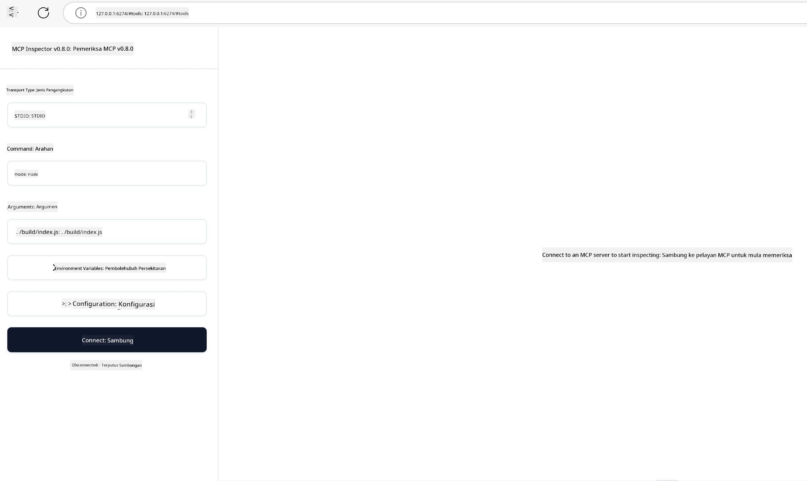

## Ujian dan Pengujian Ralat

Sebelum anda mula menguji pelayan MCP anda, adalah penting untuk memahami alat yang tersedia dan amalan terbaik bagi pengujian ralat. Ujian yang berkesan memastikan pelayan anda berfungsi seperti yang dijangka dan membantu anda mengenal pasti serta menyelesaikan isu dengan cepat. Bahagian berikut menerangkan pendekatan yang disyorkan untuk mengesahkan pelaksanaan MCP anda.

## Gambaran Keseluruhan

Pelajaran ini merangkumi cara memilih pendekatan ujian yang tepat dan alat ujian yang paling berkesan.

## Objektif Pembelajaran

Pada akhir pelajaran ini, anda akan dapat:

- Menerangkan pelbagai pendekatan untuk ujian.
- Menggunakan pelbagai alat untuk menguji kod anda dengan berkesan.


## Menguji Pelayan MCP

MCP menyediakan alat untuk membantu anda menguji dan menguji ralat pelayan anda:

- **MCP Inspector**: Alat baris perintah yang boleh dijalankan sebagai alat CLI dan juga sebagai alat visual.
- **Ujian manual**: Anda boleh menggunakan alat seperti curl untuk menjalankan permintaan web, tetapi mana-mana alat yang boleh menjalankan HTTP juga boleh digunakan.
- **Ujian unit**: Anda boleh menggunakan rangka kerja ujian pilihan anda untuk menguji ciri-ciri kedua-dua pelayan dan pelanggan.

### Menggunakan MCP Inspector

Kami telah menerangkan penggunaan alat ini dalam pelajaran terdahulu tetapi mari kita bincangkan sedikit pada tahap tinggi. Ia adalah alat yang dibina menggunakan Node.js dan anda boleh menggunakannya dengan memanggil pelaksanaan `npx` yang akan memuat turun dan memasang alat tersebut buat sementara waktu dan akan membersihkan dirinya sekali selesai menjalankan permintaan anda.

[MCP Inspector](https://github.com/modelcontextprotocol/inspector) membantu anda:

- **Mengesan Keupayaan Pelayan**: Mengesan secara automatik sumber, alat, dan arahan yang tersedia
- **Menguji Pelaksanaan Alat**: Cuba parameter berbeza dan lihat maklum balas secara masa nyata
- **Melihat Metadata Pelayan**: Mengkaji maklumat pelayan, skema, dan konfigurasi

Contoh biasa penggunaan alat ini adalah seperti berikut:

```bash
npx @modelcontextprotocol/inspector node build/index.js
```

Perintah di atas memulakan MCP dan antara muka visualnya serta melancarkan antara muka web tempatan di penyemak imbas anda. Anda boleh menjangka untuk melihat papan pemuka memaparkan pelayan MCP yang berdaftar, alat, sumber, dan arahan yang ada. Antara muka membolehkan anda menguji pelaksanaan alat secara interaktif, memeriksa metadata pelayan, dan melihat maklum balas secara masa nyata, menjadikannya lebih mudah untuk mengesahkan dan menguji ralat pelaksanaan pelayan MCP anda.

Ini adalah bagaimana rupa antara muka tersebut: 

Anda juga boleh menjalankan alat ini dalam mod CLI di mana anda menambah atribut `--cli`. Berikut adalah contoh menjalankan alat dalam mod "CLI" yang menyenaraikan semua alat di pelayan:

```sh
npx @modelcontextprotocol/inspector --cli node build/index.js --method tools/list
```

### Ujian Manual

Selain menjalankan alat pemeriksa untuk menguji keupayaan pelayan, satu pendekatan serupa adalah menjalankan klien yang boleh menggunakan HTTP contohnya curl.

Dengan curl, anda boleh menguji pelayan MCP secara langsung menggunakan permintaan HTTP:

```bash
# Contoh: Metadata pelayan ujian
curl http://localhost:3000/v1/metadata

# Contoh: Jalankan alat
curl -X POST http://localhost:3000/v1/tools/execute \
  -H "Content-Type: application/json" \
  -d '{"name": "calculator", "parameters": {"expression": "2+2"}}'
```

Seperti yang anda lihat daripada penggunaan curl di atas, anda menggunakan permintaan POST untuk memanggil alat menggunakan beban yang terdiri daripada nama alat dan parameternya. Gunakan pendekatan yang paling sesuai untuk anda. Alat CLI secara umumnya lebih cepat untuk digunakan dan sesuai untuk diskripkan yang boleh berguna dalam persekitaran CI/CD.

### Ujian Unit

Cipta ujian unit untuk alat dan sumber anda bagi memastikan ia berfungsi seperti yang dijangka. Berikut adalah contoh kod ujian.

```python
import pytest

from mcp.server.fastmcp import FastMCP
from mcp.shared.memory import (
    create_connected_server_and_client_session as create_session,
)

# Tandakan keseluruhan modul untuk ujian async
pytestmark = pytest.mark.anyio


async def test_list_tools_cursor_parameter():
    """Test that the cursor parameter is accepted for list_tools.

    Note: FastMCP doesn't currently implement pagination, so this test
    only verifies that the cursor parameter is accepted by the client.
    """

 server = FastMCP("test")

    # Cipta beberapa alat ujian
    @server.tool(name="test_tool_1")
    async def test_tool_1() -> str:
        """First test tool"""
        return "Result 1"

    @server.tool(name="test_tool_2")
    async def test_tool_2() -> str:
        """Second test tool"""
        return "Result 2"

    async with create_session(server._mcp_server) as client_session:
        # Uji tanpa parameter cursor (dikecualikan)
        result1 = await client_session.list_tools()
        assert len(result1.tools) == 2

        # Uji dengan cursor=None
        result2 = await client_session.list_tools(cursor=None)
        assert len(result2.tools) == 2

        # Uji dengan cursor sebagai rentetan
        result3 = await client_session.list_tools(cursor="some_cursor_value")
        assert len(result3.tools) == 2

        # Uji dengan cursor rentetan kosong
        result4 = await client_session.list_tools(cursor="")
        assert len(result4.tools) == 2
    
```

Kod di atas melakukan perkara berikut:

- Memanfaatkan rangka kerja pytest yang membolehkan anda mencipta ujian sebagai fungsi dan menggunakan pernyataan assert.
- Mencipta Pelayan MCP dengan dua alat yang berbeza.
- Menggunakan pernyataan `assert` untuk menyemak bahawa syarat-syarat tertentu dipenuhi.

Lihat [fail penuh di sini](https://github.com/modelcontextprotocol/python-sdk/blob/main/tests/client/test_list_methods_cursor.py)

Berdasarkan fail di atas, anda boleh menguji pelayan anda sendiri untuk memastikan keupayaan dicapai seperti yang sepatutnya.

Semua SDK utama mempunyai seksyen ujian yang serupa jadi anda boleh menyesuaikannya dengan runtime pilihan anda.

## Contoh 

- [Java Calculator](../samples/java/calculator/README.md)
- [.Net Calculator](../../../../03-GettingStarted/samples/csharp)
- [JavaScript Calculator](../samples/javascript/README.md)
- [TypeScript Calculator](../samples/typescript/README.md)
- [Python Calculator](../../../../03-GettingStarted/samples/python) 

## Sumber Tambahan

- [Python SDK](https://github.com/modelcontextprotocol/python-sdk)

## Apa Seterusnya

- Seterusnya: [Pengedaran](../09-deployment/README.md)

---

<!-- CO-OP TRANSLATOR DISCLAIMER START -->
**Penafian**:
Dokumen ini telah diterjemahkan menggunakan perkhidmatan terjemahan AI [Co-op Translator](https://github.com/Azure/co-op-translator). Walaupun kami berusaha untuk ketepatan, sila ambil maklum bahawa terjemahan automatik mungkin mengandungi kesilapan atau ketidaktepatan. Dokumen asal dalam bahasa asalnya harus dianggap sebagai sumber yang sahih. Untuk maklumat penting, terjemahan oleh manusia profesional adalah disyorkan. Kami tidak bertanggungjawab terhadap sebarang salah faham atau salah tafsir yang timbul daripada penggunaan terjemahan ini.
<!-- CO-OP TRANSLATOR DISCLAIMER END -->