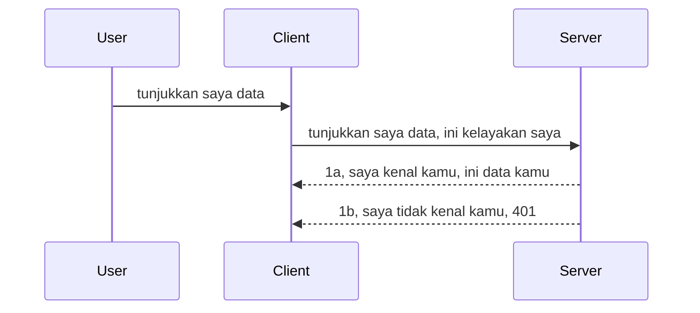

# Simple auth

SDK MCP menyokong penggunaan OAuth 2.1 yang sebenarnya adalah proses yang agak rumit melibatkan konsep seperti pelayan auth, pelayan sumber, menghantar kelayakan, mendapatkan kod, menukar kod untuk token pembawa sehingga anda akhirnya boleh mendapatkan data sumber anda. Jika anda tidak biasa dengan OAuth yang merupakan perkara yang sangat bagus untuk dilaksanakan, adalah idea yang baik untuk bermula dengan tahap asas pengesahan dan membina kepada keselamatan yang lebih baik dan lebih baik. Itulah sebabnya bab ini wujud, untuk membina anda kepada pengesahan yang lebih maju.

## Auth, apa maksud kita?

Auth adalah singkatan bagi pengesahan dan kebenaran. Idenya ialah kita perlu melakukan dua perkara:

- **Pengesahan**, iaitu proses untuk mengetahui sama ada kita membenarkan seseorang memasuki rumah kita, bahawa mereka mempunyai hak untuk "di sini" iaitu mempunyai akses kepada pelayan sumber kita di mana ciri MCP Server kita berada.
- **Kebenaran**, adalah proses untuk mengetahui jika pengguna sepatutnya mempunyai akses kepada sumber tertentu yang mereka minta, contohnya pesanan ini atau produk ini atau sama ada mereka dibenarkan membaca kandungan tetapi tidak memadam sebagai contoh lain.

## Kelayakan: bagaimana kita memberitahu sistem siapa kita

Well, kebanyakan pembangun web di luar sana mula berfikir dari segi menyediakan kelayakan kepada pelayan, biasanya rahsia yang mengatakan jika mereka dibenarkan berada di sini "Pengesahan". Kelayakan ini biasanya adalah versi base64 yang ditulis kod nama pengguna dan kata laluan atau kunci API yang mengenal pasti pengguna tertentu secara unik.

Ini melibatkan penghantaran melalui kepala dipanggil "Authorization" seperti berikut:

```json
{ "Authorization": "secret123" }
```

Ini biasanya dirujuk sebagai pengesahan asas. Bagaimana aliran keseluruhan bekerja adalah seperti berikut:


Sekarang kita faham bagaimana ia berfungsi dari sudut aliran, bagaimana kita melaksanakannya? Well, kebanyakan pelayan web mempunyai konsep dipanggil middleware, satu kod yang berjalan sebagai sebahagian daripada permintaan yang boleh mengesahkan kelayakan, dan jika kelayakan sah boleh membenarkan permintaan tersebut melalui. Jika permintaan tidak mempunyai kelayakan sah maka anda mendapat ralat auth. Mari kita lihat bagaimana ini boleh dilaksanakan:

**Python**

```python
class AuthMiddleware(BaseHTTPMiddleware):
    async def dispatch(self, request, call_next):

        has_header = request.headers.get("Authorization")
        if not has_header:
            print("-> Missing Authorization header!")
            return Response(status_code=401, content="Unauthorized")

        if not valid_token(has_header):
            print("-> Invalid token!")
            return Response(status_code=403, content="Forbidden")

        print("Valid token, proceeding...")
       
        response = await call_next(request)
        # tambah sebarang header pelanggan atau ubah balasan dalam apa-apa cara
        return response


starlette_app.add_middleware(CustomHeaderMiddleware)
```

Di sini kita mempunyai:

- Membuat middleware dipanggil `AuthMiddleware` di mana kaedah `dispatch`nya dipanggil oleh pelayan web.
- Menambah middleware kepada pelayan web:

    ```python
    starlette_app.add_middleware(AuthMiddleware)
    ```

- Menulis logik pengesahan yang memeriksa jika kepala Authorization hadir dan jika rahsia yang dihantar adalah sah:

    ```python
    has_header = request.headers.get("Authorization")
    if not has_header:
        print("-> Missing Authorization header!")
        return Response(status_code=401, content="Unauthorized")

    if not valid_token(has_header):
        print("-> Invalid token!")
        return Response(status_code=403, content="Forbidden")
    ```

    jika rahsia hadir dan sah maka kita membenarkan permintaan melalui dengan memanggil `call_next` dan mengembalikan respons.

    ```python
    response = await call_next(request)
    # tambah mana-mana pengepala pelanggan atau ubah dalam tindak balas dengan cara tertentu
    return response
    ```

Bagaimana ia berfungsi ialah jika permintaan web dibuat ke arah pelayan, middleware akan dipanggil dan dengan pelaksanaan yang diberi ia akan sama ada membenarkan permintaan melalui atau akhirnya mengembalikan ralat yang menunjukkan klien tidak dibenarkan untuk meneruskan.

**TypeScript**

Di sini kita cipta middleware dengan rangka kerja popular Express dan mencegah permintaan sebelum ia sampai ke MCP Server. Ini adalah kod untuk itu:

```typescript
function isValid(secret) {
    return secret === "secret123";
}

app.use((req, res, next) => {
    // 1. Header kebenaran hadir?
    if(!req.headers["Authorization"]) {
        res.status(401).send('Unauthorized');
    }
    
    let token = req.headers["Authorization"];

    // 2. Semak kesahihan.
    if(!isValid(token)) {
        res.status(403).send('Forbidden');
    }

   
    console.log('Middleware executed');
    // 3. Hantar permintaan ke langkah seterusnya dalam saluran permintaan.
    next();
});
```

Dalam kod ini kita:

1. Periksa jika kepala Authorization hadir pada tempat pertama, jika tidak, kita hantar ralat 401.
2. Pastikan kelayakan/token sah, jika tidak, kita hantar ralat 403.
3. Akhirnya lalukan permintaan dalam talian permintaan dan kembalikan sumber yang diminta.

## Latihan: Laksanakan pengesahan

Mari kita ambil pengetahuan kita dan cuba melaksanakannya. Ini adalah pelan:

Server

- Cipta pelayan web dan instans MCP.
- Laksanakan middleware untuk pelayan.

Client

- Hantar permintaan web, dengan kelayakan, melalui kepala.

### -1- Cipta pelayan web dan instans MCP

Dalam langkah pertama kita, kita perlu mencipta instans pelayan web dan MCP Server.

**Python**

Di sini kita cipta instans MCP server, cipta aplikasi web starlette dan hoskan dengan uvicorn.

```python
# mencipta Pelayan MCP

app = FastMCP(
    name="MCP Resource Server",
    instructions="Resource Server that validates tokens via Authorization Server introspection",
    host=settings["host"],
    port=settings["port"],
    debug=True
)

# mencipta aplikasi web starlette
starlette_app = app.streamable_http_app()

# menyajikan aplikasi melalui uvicorn
async def run(starlette_app):
    import uvicorn
    config = uvicorn.Config(
            starlette_app,
            host=app.settings.host,
            port=app.settings.port,
            log_level=app.settings.log_level.lower(),
        )
    server = uvicorn.Server(config)
    await server.serve()

run(starlette_app)
```

Dalam kod ini kita:

- Cipta MCP Server.
- Bina aplikasi web starlette daripada MCP Server, `app.streamable_http_app()`.
- Hos dan sediakan aplikasi web menggunakan uvicorn `server.serve()`.

**TypeScript**

Di sini kita cipta instans MCP Server.

```typescript
const server = new McpServer({
      name: "example-server",
      version: "1.0.0"
    });

    // ... sediakan sumber pelayan, alat, dan arahan ...
```

Penciptaan MCP Server ini perlu berlaku dalam definisi laluan POST /mcp kita, jadi mari kita ambil kod di atas dan pindahkan seperti ini:

```typescript
import express from "express";
import { randomUUID } from "node:crypto";
import { McpServer } from "@modelcontextprotocol/sdk/server/mcp.js";
import { StreamableHTTPServerTransport } from "@modelcontextprotocol/sdk/server/streamableHttp.js";
import { isInitializeRequest } from "@modelcontextprotocol/sdk/types.js"

const app = express();
app.use(express.json());

// Peta untuk menyimpan pengangkutan mengikut ID sesi
const transports: { [sessionId: string]: StreamableHTTPServerTransport } = {};

// Mengendalikan permintaan POST untuk komunikasi klien-ke-pelayan
app.post('/mcp', async (req, res) => {
  // Semak untuk ID sesi yang sedia ada
  const sessionId = req.headers['mcp-session-id'] as string | undefined;
  let transport: StreamableHTTPServerTransport;

  if (sessionId && transports[sessionId]) {
    // Guna semula pengangkutan sedia ada
    transport = transports[sessionId];
  } else if (!sessionId && isInitializeRequest(req.body)) {
    // Permintaan inisialisasi baru
    transport = new StreamableHTTPServerTransport({
      sessionIdGenerator: () => randomUUID(),
      onsessioninitialized: (sessionId) => {
        // Simpan pengangkutan mengikut ID sesi
        transports[sessionId] = transport;
      },
      // Perlindungan DNS rebinding dimatikan secara lalai untuk keserasian ke belakang. Jika anda menjalankan pelayan ini
      // secara tempatan, pastikan untuk tetapkan:
      // enableDnsRebindingProtection: true,
      // allowedHosts: ['127.0.0.1'],
    });

    // Bersihkan pengangkutan apabila ditutup
    transport.onclose = () => {
      if (transport.sessionId) {
        delete transports[transport.sessionId];
      }
    };
    const server = new McpServer({
      name: "example-server",
      version: "1.0.0"
    });

    // ... sediakan sumber pelayan, alat, dan arahan ...

    // Sambungkan ke pelayan MCP
    await server.connect(transport);
  } else {
    // Permintaan tidak sah
    res.status(400).json({
      jsonrpc: '2.0',
      error: {
        code: -32000,
        message: 'Bad Request: No valid session ID provided',
      },
      id: null,
    });
    return;
  }

  // Kendalikan permintaan
  await transport.handleRequest(req, res, req.body);
});

// Pengendali boleh guna semula untuk permintaan GET dan DELETE
const handleSessionRequest = async (req: express.Request, res: express.Response) => {
  const sessionId = req.headers['mcp-session-id'] as string | undefined;
  if (!sessionId || !transports[sessionId]) {
    res.status(400).send('Invalid or missing session ID');
    return;
  }
  
  const transport = transports[sessionId];
  await transport.handleRequest(req, res);
};

// Mengendalikan permintaan GET untuk notifikasi pelayan-ke-klien melalui SSE
app.get('/mcp', handleSessionRequest);

// Mengendalikan permintaan DELETE untuk penamatan sesi
app.delete('/mcp', handleSessionRequest);

app.listen(3000);
```

Sekarang anda lihat bagaimana penciptaan MCP Server dipindahkan ke dalam `app.post("/mcp")`.

Mari kita teruskan ke langkah seterusnya iaitu mencipta middleware supaya kita boleh mengesahkan kelayakan yang masuk.

### -2- Laksanakan middleware untuk pelayan

Mari kita teruskan dengan bahagian middleware seterusnya. Di sini kita akan cipta middleware yang mencari kelayakan di kepala `Authorization` dan mengesahkannya. Jika ia boleh diterima maka permintaan akan berjalan untuk melakukan apa yang perlu (contohnya senaraikan alat, baca sumber atau apa sahaja fungsi MCP yang diminta klien).

**Python**

Untuk cipta middleware, kita perlu cipta kelas yang mewarisi dari `BaseHTTPMiddleware`. Ada dua perkara menarik:

- Permintaan `request`, yang kita baca maklumat kepala dari situ.
- `call_next` callback yang kita perlu panggil jika klien membawa kelayakan yang kita terima.

Pertama, kita perlu layan kes jika kepala `Authorization` tiada:

```python
has_header = request.headers.get("Authorization")

# tiada pengepala hadir, gagal dengan 401, jika tidak teruskan.
if not has_header:
    print("-> Missing Authorization header!")
    return Response(status_code=401, content="Unauthorized")
```

Di sini kita hantar mesej 401 tidak dibenarkan kerana klien gagal pengesahan.

Seterusnya, jika kelayakan dihantar, kita perlu periksa kesahihannya seperti berikut:

```python
 if not valid_token(has_header):
    print("-> Invalid token!")
    return Response(status_code=403, content="Forbidden")
```

Perhatikan bagaimana kita hantar mesej 403 dilarang di atas. Mari lihat middleware penuh di bawah yang melaksanakan semua yang telah kita sebut:

```python
class AuthMiddleware(BaseHTTPMiddleware):
    async def dispatch(self, request, call_next):

        has_header = request.headers.get("Authorization")
        if not has_header:
            print("-> Missing Authorization header!")
            return Response(status_code=401, content="Unauthorized")

        if not valid_token(has_header):
            print("-> Invalid token!")
            return Response(status_code=403, content="Forbidden")

        print("Valid token, proceeding...")
        print(f"-> Received {request.method} {request.url}")
        response = await call_next(request)
        response.headers['Custom'] = 'Example'
        return response

```

Bagus, tetapi bagaimana dengan fungsi `valid_token`? Ini dia di bawah:

```python
# JANGAN gunakan untuk pengeluaran - perbaikilah !!
def valid_token(token: str) -> bool:
    # alih keluar awalan "Bearer "
    if token.startswith("Bearer "):
        token = token[7:]
        return token == "secret-token"
    return False
```

Ini semestinya perlu diperbaiki.

PENTING: Anda TIDAK SEPATUTNYA mempunyai rahsia seperti ini dalam kod. Anda sepatutnya mendapatkan nilai untuk dibandingkan dari sumber data atau dari IDP (penyedia perkhidmatan identiti) atau lebih baik, biar IDP yang lakukan pengesahan.

**TypeScript**

Untuk melaksanakan ini dengan Express, kita perlu panggil kaedah `use` yang menerima fungsi middleware.

Kita perlu:

- Berinteraksi dengan pembolehubah permintaan untuk periksa kelayakan yang dilewatkan dalam sifat `Authorization`.
- Sahkan kelayakan, dan jika betul biarkan permintaan diteruskan supaya permintaan MCP klien melakukan apa yang sepatutnya (contohnya senaraikan alat, baca sumber atau lain berkaitan MCP).

Di sini, kita periksa jika kepala `Authorization` hadir dan jika tidak, kita hentikan permintaan daripada diteruskan:

```typescript
if(!req.headers["authorization"]) {
    res.status(401).send('Unauthorized');
    return;
}
```

Jika kepala tidak dihantar dari awal, anda menerima 401.

Seterusnya, kita periksa jika kelayakan sah, jika tidak kita sekali lagi hentikan permintaan tetapi dengan mesej yang berbeza sedikit:

```typescript
if(!isValid(token)) {
    res.status(403).send('Forbidden');
    return;
} 
```

Perhatikan bagaimana anda sekarang mendapat ralat 403.

Ini adalah kod penuh:

```typescript
app.use((req, res, next) => {
    console.log('Request received:', req.method, req.url, req.headers);
    console.log('Headers:', req.headers["authorization"]);
    if(!req.headers["authorization"]) {
        res.status(401).send('Unauthorized');
        return;
    }
    
    let token = req.headers["authorization"];

    if(!isValid(token)) {
        res.status(403).send('Forbidden');
        return;
    }  

    console.log('Middleware executed');
    next();
});
```

Kita telah sediakan pelayan web untuk menerima middleware untuk periksa kelayakan yang klien harap-harapnya hantar kepada kita. Bagaimana dengan klien itu sendiri?

### -3- Hantar permintaan web dengan kelayakan melalui kepala

Kita perlu pastikan klien menghantar kelayakan melalui kepala. Oleh kerana kita akan guna klien MCP untuk berbuat demikian, kita perlu tahu bagaimana caranya.

**Python**

Untuk klien, kita perlu hantar kepala dengan kelayakan kita seperti ini:

```python
# JANGAN tetapkan nilai secara keras, sekurang-kurangnya simpan dalam pembolehubah persekitaran atau storan yang lebih selamat
token = "secret-token"

async with streamablehttp_client(
        url = f"http://localhost:{port}/mcp",
        headers = {"Authorization": f"Bearer {token}"}
    ) as (
        read_stream,
        write_stream,
        session_callback,
    ):
        async with ClientSession(
            read_stream,
            write_stream
        ) as session:
            await session.initialize()
      
            # TODO, apa yang anda mahu dilakukan di klien, contohnya senaraikan alat, panggil alat dan sebagainya.
```

Perhatikan bagaimana kita mengisi sifat `headers` seperti berikut ` headers = {"Authorization": f"Bearer {token}"}`.

**TypeScript**

Kita boleh selesaikan ini dalam dua langkah:

1. Isi objek konfigurasi dengan kelayakan kita.
2. Hantar objek konfigurasi kepada transport.

```typescript

// JANGAN kodkan nilai secara keras seperti yang ditunjukkan di sini. Sekurang-kurangnya jadikan ia sebagai pembolehubah persekitaran dan gunakan sesuatu seperti dotenv (dalam mod pembangunan).
let token = "secret123"

// tentukan objek pilihan penghantaran klien
let options: StreamableHTTPClientTransportOptions = {
  sessionId: sessionId,
  requestInit: {
    headers: {
      "Authorization": "secret123"
    }
  }
};

// hantar objek pilihan ke penghantaran
async function main() {
   const transport = new StreamableHTTPClientTransport(
      new URL(serverUrl),
      options
   );
```

Di sini anda lihat di atas bagaimana kita perlu cipta objek `options` dan letakkan kepala kita di bawah sifat `requestInit`.

PENTING: Bagaimana kita boleh perbaiki dari sini? Well, pelaksanaan sekarang ada beberapa isu. Pertama sekali, menghantar kelayakan seperti ini agak berisiko kecuali anda sekurang-kurangnya ada HTTPS. Walaupun begitu, kelayakan boleh dicuri jadi anda perlukan sistem yang boleh dengan mudahlah melucutkan token dan tambah pemeriksaan tambahan seperti dari mana di dunia ia datang, adakah permintaan berlaku terlalu kerap (tingkah laku seperti bot), secara ringkas, terdapat banyak kebimbangan.

Namun, harus dikata, untuk API yang sangat ringkas di mana anda tidak mahukan sesiapa pun memanggil API anda tanpa pengesahan dan apa yang kita ada di sini adalah permulaan yang baik.

Dengan itu dikatakan, mari cuba kita kukuhkan keselamatan sedikit dengan menggunakan format piawai seperti JSON Web Token, juga dikenali sebagai JWT atau token "JOT".

## JSON Web Tokens, JWT

Jadi, kita cuba memperbaiki perkara daripada menghantar kelayakan yang sangat ringkas. Apakah peningkatan segera yang kita dapat dengan menggunakan JWT?

- **Peningkatan keselamatan**. Dalam pengesahan asas, anda menghantar nama pengguna dan kata laluan sebagai token base64 (atau anda hantar kunci API) berulang kali yang meningkatkan risiko. Dengan JWT, anda menghantar nama pengguna dan kata laluan dan mendapat token sebagai balasan dan ia juga berjangka masa bermakna ia akan tamat tempoh. JWT membolehkan anda gunakan kawalan akses terperinci menggunakan peranan, skop dan kebenaran.
- **Statelessness dan skalabiliti**. JWT adalah sendiri, ia membawa semua maklumat pengguna dan menghapuskan keperluan menyimpan simpanan sesi di sisi pelayan. Token juga boleh disahkan secara tempatan.
- **Interoperabiliti dan federasi**. JWT adalah teras Open ID Connect dan digunakan dengan penyedia identiti yang diketahui seperti Entra ID, Google Identity dan Auth0. Ia juga membolehkan penggunaan daftar masuk tunggal dan banyak lagi menjadikannya bertaraf perusahaan.
- **Modulariti dan fleksibiliti**. JWT juga boleh digunakan dengan API Gateway seperti Azure API Management, NGINX dan lain-lain. Ia juga menyokong senario pengesahan pengguna dan komunikasi server-ke-perkhidmatan termasuk penyamar dan delegasi.
- **Prestasi dan penyimpanan sementara**. JWT boleh disimpan sementara selepas penyahkodan yang mengurangkan keperluan untuk penguraian semula. Ini membantu terutamanya dengan aplikasi trafik tinggi kerana meningkatkan kelajuan pemprosesan dan mengurangkan beban pada infrastruktur pilihan anda.
- **Ciri-ciri lanjutan**. Ia juga menyokong introspeksi (memeriksa kesahihan pada pelayan) dan pelucutan (menjadikan token tidak sah).

Dengan semua manfaat ini, mari kita lihat bagaimana kita boleh membawa pelaksanaan kita ke tahap seterusnya.

## Menukar pengesahan asas kepada JWT

Jadi, perubahan yang kita perlu lakukan pada peringkat tinggi adalah untuk:

- **Belajar membina token JWT** dan sediakan untuk dihantar dari klien ke pelayan.
- **Sahkan token JWT**, dan jika sah, benarkan klien mendapat sumber kita.
- **Simpan token dengan selamat**. Bagaimana kita menyimpan token ini.
- **Lindungi laluan**. Kita perlu lindungi laluan, dalam kes kita, kita perlu lindungi laluan dan ciri MCP tertentu.
- **Tambah token penyegaran**. Pastikan kita cipta token yang berumur pendek tetapi token penyegaran yang berumur panjang yang boleh digunakan untuk mendapatkan token baru jika ia tamat tempoh. Juga pastikan terdapat titik akhir penyegaran dan strategi putaran.

### -1- Bina token JWT

Pertama sekali, token JWT mempunyai bahagian berikut:

- **header**, algoritma digunakan dan jenis token.
- **payload**, tuntutan, seperti sub (pengguna atau entiti yang token wakili. Dalam senario pengesahan ini biasanya adalah userid), exp (bilakah ia tamat tempoh) peranan (role)
- **tandatangan**, ditandatangan dengan rahsia atau kunci peribadi.

Untuk ini, kita perlu bina header, payload dan token yang ditulis kod.

**Python**

```python

import jwt
import jwt
from jwt.exceptions import ExpiredSignatureError, InvalidTokenError
import datetime

# Kunci rahsia yang digunakan untuk menandatangani JWT
secret_key = 'your-secret-key'

header = {
    "alg": "HS256",
    "typ": "JWT"
}

# maklumat pengguna dan tuntutan serta masa tamatnya
payload = {
    "sub": "1234567890",               # Subjek (ID pengguna)
    "name": "User Userson",                # Tuntutan tersuai
    "admin": True,                     # Tuntutan tersuai
    "iat": datetime.datetime.utcnow(),# Dikeluarkan pada
    "exp": datetime.datetime.utcnow() + datetime.timedelta(hours=1)  # Tamat tempoh
}

# mengekodnya
encoded_jwt = jwt.encode(payload, secret_key, algorithm="HS256", headers=header)
```

Dalam kod di atas kita telah:

- Mendefinisikan header menggunakan HS256 sebagai algoritma dan jenis sebagai JWT.
- Membina payload yang mengandungi subjek atau ID pengguna, nama pengguna, peranan, bila ia dikeluarkan dan bila ia dijangka tamat tempoh yang melaksanakan aspek berjangka masa yang kita sebut tadi.

**TypeScript**

Di sini kita perlu beberapa pergantungan yang akan membantu kita membina token JWT.

Pergantungan

```sh

npm install jsonwebtoken
npm install --save-dev @types/jsonwebtoken
```

Setelah ada itu, mari kita cipta header, payload dan melalui itu cipta token yang ditulis kod.

```typescript
import jwt from 'jsonwebtoken';

const secretKey = 'your-secret-key'; // Gunakan pembolehubah persekitaran dalam pengeluaran

// Takrifkan muatan
const payload = {
  sub: '1234567890',
  name: 'User usersson',
  admin: true,
  iat: Math.floor(Date.now() / 1000), // Dikeluarkan pada
  exp: Math.floor(Date.now() / 1000) + 60 * 60 // Tamat tempoh dalam 1 jam
};

// Takrifkan pengepala (pilihan, jsonwebtoken menetapkan lalai)
const header = {
  alg: 'HS256',
  typ: 'JWT'
};

// Buat token
const token = jwt.sign(payload, secretKey, {
  algorithm: 'HS256',
  header: header
});

console.log('JWT:', token);
```

Token ini:

Ditandatangani menggunakan HS256
Sah untuk 1 jam
Termasuk tuntutan seperti sub, name, admin, iat, dan exp.

### -2- Sahkan token

Kita juga perlu sahkan token, ini sesuatu yang patut kita lakukan di pelayan untuk memastikan apa yang klien hantar benar-benar sah. Terdapat banyak pemeriksaan yang harus kita lakukan di sini dari memeriksa strukturnya hingga kesahihannya. Anda juga digalakkan untuk tambah pemeriksaan lain untuk melihat jika pengguna ada dalam sistem anda dan sebagainya.

Untuk sahkan token, kita perlu menyahkodnya supaya kita boleh baca dan mula memeriksa kesahihannya:

**Python**

```python

# Nyahkod dan sahkan JWT
try:
    decoded = jwt.decode(token, secret_key, algorithms=["HS256"])
    print("✅ Token is valid.")
    print("Decoded claims:")
    for key, value in decoded.items():
        print(f"  {key}: {value}")
except ExpiredSignatureError:
    print("❌ Token has expired.")
except InvalidTokenError as e:
    print(f"❌ Invalid token: {e}")

```

Dalam kod ini, kita panggil `jwt.decode` menggunakan token, kunci rahsia dan algoritma yang dipilih sebagai input. Perhatikan bagaimana kita guna konstruksi cuba-tangkap kerana pengesahan gagal membawa kepada ralat diangkat.

**TypeScript**

Di sini kita perlu panggil `jwt.verify` untuk dapatkan versi terkode dekod token yang kita boleh analisa lebih lanjut. Jika panggilan ini gagal, itu bermakna strukur token tidak betul atau ia tidak sah lagi.

```typescript

try {
  const decoded = jwt.verify(token, secretKey);
  console.log('Decoded Payload:', decoded);
} catch (err) {
  console.error('Token verification failed:', err);
}
```

CATATAN: seperti yang disebut sebelum ini, kita patut buat pemeriksaan tambahan untuk pastikan token ini merujuk kepada pengguna dalam sistem kita dan pastikan pengguna mempunyai hak yang dituntut.

Seterusnya, mari lihat kawalan akses berasaskan peranan, juga dikenali sebagai RBAC.
## Menambah kawalan akses berasaskan peranan

Idenya adalah kita mahu menyatakan bahawa peranan yang berbeza mempunyai kebenaran yang berbeza. Sebagai contoh, kita menganggap admin boleh melakukan segala-galanya dan bahawa pengguna biasa boleh melakukan baca/tulis dan tetamu hanya boleh membaca. Oleh itu, berikut adalah beberapa tahap kebenaran yang mungkin:

- Admin.Write 
- User.Read
- Guest.Read

Mari kita lihat bagaimana kita boleh melaksanakan kawalan sedemikian dengan middleware. Middleware boleh ditambah setiap laluan serta untuk semua laluan.

**Python**

```python
from starlette.middleware.base import BaseHTTPMiddleware
from starlette.responses import JSONResponse
import jwt

# JANGAN letakkan rahsia dalam kod seperti ini, ini hanya untuk tujuan demonstrasi. Baca ia dari tempat yang selamat.
SECRET_KEY = "your-secret-key" # letakkan ini dalam pemboleh ubah persekitaran
REQUIRED_PERMISSION = "User.Read"

class JWTPermissionMiddleware(BaseHTTPMiddleware):
    async def dispatch(self, request, call_next):
        auth_header = request.headers.get("Authorization")
        if not auth_header or not auth_header.startswith("Bearer "):
            return JSONResponse({"error": "Missing or invalid Authorization header"}, status_code=401)

        token = auth_header.split(" ")[1]
        try:
            decoded = jwt.decode(token, SECRET_KEY, algorithms=["HS256"])
        except jwt.ExpiredSignatureError:
            return JSONResponse({"error": "Token expired"}, status_code=401)
        except jwt.InvalidTokenError:
            return JSONResponse({"error": "Invalid token"}, status_code=401)

        permissions = decoded.get("permissions", [])
        if REQUIRED_PERMISSION not in permissions:
            return JSONResponse({"error": "Permission denied"}, status_code=403)

        request.state.user = decoded
        return await call_next(request)


```

Terdapat beberapa cara berbeza untuk menambah middleware seperti di bawah:

```python

# Alt 1: tambah middleware semasa membina aplikasi starlette
middleware = [
    Middleware(JWTPermissionMiddleware)
]

app = Starlette(routes=routes, middleware=middleware)

# Alt 2: tambah middleware selepas aplikasi starlette telah dibina
starlette_app.add_middleware(JWTPermissionMiddleware)

# Alt 3: tambah middleware bagi setiap laluan
routes = [
    Route(
        "/mcp",
        endpoint=..., # pengendali
        middleware=[Middleware(JWTPermissionMiddleware)]
    )
]
```

**TypeScript**

Kita boleh menggunakan `app.use` dan middleware yang akan dijalankan untuk semua permintaan. 

```typescript
app.use((req, res, next) => {
    console.log('Request received:', req.method, req.url, req.headers);
    console.log('Headers:', req.headers["authorization"]);

    // 1. Semak jika header kebenaran telah dihantar

    if(!req.headers["authorization"]) {
        res.status(401).send('Unauthorized');
        return;
    }
    
    let token = req.headers["authorization"];

    // 2. Semak jika token sah
    if(!isValid(token)) {
        res.status(403).send('Forbidden');
        return;
    }  

    // 3. Semak jika pengguna token wujud dalam sistem kami
    if(!isExistingUser(token)) {
        res.status(403).send('Forbidden');
        console.log("User does not exist");
        return;
    }
    console.log("User exists");

    // 4. Sahkan token mempunyai izin yang betul
    if(!hasScopes(token, ["User.Read"])){
        res.status(403).send('Forbidden - insufficient scopes');
    }

    console.log("User has required scopes");

    console.log('Middleware executed');
    next();
});

```

Terdapat beberapa perkara yang boleh kita benarkan middleware kita lakukan dan middleware kita SEPATUTNYA lakukan, iaitu:

1. Semak jika header pengesahan wujud
2. Semak jika token sah, kita memanggil `isValid` yang merupakan kaedah yang kita tulis yang memeriksa integriti dan kesahihan token JWT.
3. Sahkan pengguna wujud dalam sistem kita, kita patut memeriksa ini.

   ```typescript
    // pengguna dalam DB
   const users = [
     "user1",
     "User usersson",
   ]

   function isExistingUser(token) {
     let decodedToken = verifyToken(token);

     // TODO, periksa jika pengguna wujud dalam DB
     return users.includes(decodedToken?.name || "");
   }
   ```

   Di atas, kita telah mencipta senarai `users` yang sangat ringkas, yang sepatutnya sudah tentu berada dalam pangkalan data.

4. Selain itu, kita juga patut memeriksa token mempunyai kebenaran yang betul.

   ```typescript
   if(!hasScopes(token, ["User.Read"])){
        res.status(403).send('Forbidden - insufficient scopes');
   }
   ```

   Dalam kod di atas dari middleware, kita memeriksa bahawa token mengandungi kebenaran User.Read, jika tidak kita menghantar ralat 403. Di bawah adalah kaedah pembantu `hasScopes`.

   ```typescript
   function hasScopes(scope: string, requiredScopes: string[]) {
     let decodedToken = verifyToken(scope);
    return requiredScopes.every(scope => decodedToken?.scopes.includes(scope));
  }
   ```

Have a think which additional checks you should be doing, but these are the absolute minimum of checks you should be doing.

Using Express as a web framework is a common choice. There are helpers library when you use JWT so you can write less code.

- `express-jwt`, helper library that provides a middleware that helps decode your token.
- `express-jwt-permissions`, this provides a middleware `guard` that helps check if a certain permission is on the token.

Here's what these libraries can look like when used:

```typescript
const express = require('express');
const jwt = require('express-jwt');
const guard = require('express-jwt-permissions')();

const app = express();
const secretKey = 'your-secret-key'; // put this in env variable

// Decode JWT and attach to req.user
app.use(jwt({ secret: secretKey, algorithms: ['HS256'] }));

// Check for User.Read permission
app.use(guard.check('User.Read'));

// multiple permissions
// app.use(guard.check(['User.Read', 'Admin.Access']));

app.get('/protected', (req, res) => {
  res.json({ message: `Welcome ${req.user.name}` });
});

// Error handler
app.use((err, req, res, next) => {
  if (err.code === 'permission_denied') {
    return res.status(403).send('Forbidden');
  }
  next(err);
});

```

Kini anda telah melihat bagaimana middleware boleh digunakan untuk kedua-dua pengesahan dan kebenaran, bagaimana pula dengan MCP, adakah ia mengubah cara kita melakukan pengesahan? Mari kita ketahui dalam bahagian seterusnya.

### -3- Tambah RBAC ke MCP

Anda telah melihat setakat ini bagaimana anda boleh menambah RBAC melalui middleware, walau bagaimanapun, untuk MCP tiada cara mudah untuk menambah RBAC per ciri MCP, jadi apa yang kita buat? Baiklah, kita hanya perlu menambah kod seperti ini yang memeriksa dalam kes ini sama ada klien mempunyai hak untuk memanggil alat tertentu:

Anda mempunyai beberapa pilihan berbeza untuk mencapai RBAC per ciri, berikut adalah beberapa:

- Tambah pemeriksaan untuk setiap alat, sumber, prompt di mana anda perlu memeriksa tahap kebenaran.

   **python**

   ```python
   @tool()
   def delete_product(id: int):
      try:
          check_permissions(role="Admin.Write", request)
      catch:
        pass # pelanggan gagal kebenaran, timbulkan ralat kebenaran
   ```

   **typescript**

   ```typescript
   server.registerTool(
    "delete-product",
    {
      title: Delete a product",
      description: "Deletes a product",
      inputSchema: { id: z.number() }
    },
    async ({ id }) => {
      
      try {
        checkPermissions("Admin.Write", request);
        // todo, hantar id ke productService dan remote entry
      } catch(Exception e) {
        console.log("Authorization error, you're not allowed");  
      }

      return {
        content: [{ type: "text", text: `Deletected product with id ${id}` }]
      };
    }
   );
   ```


- Gunakan pendekatan pelayan lanjutan dan pengendali permintaan supaya anda mengurangkan berapa banyak tempat anda perlu membuat pemeriksaan.

   **Python**

   ```python
   
   tool_permission = {
      "create_product": ["User.Write", "Admin.Write"],
      "delete_product": ["Admin.Write"]
   }

   def has_permission(user_permissions, required_permissions) -> bool:
      # user_permissions: senarai kebenaran yang dimiliki oleh pengguna
      # required_permissions: senarai kebenaran yang diperlukan untuk alat
      return any(perm in user_permissions for perm in required_permissions)

   @server.call_tool()
   async def handle_call_tool(
     name: str, arguments: dict[str, str] | None
   ) -> list[types.TextContent]:
    # Anggap request.user.permissions adalah senarai kebenaran untuk pengguna
     user_permissions = request.user.permissions
     required_permissions = tool_permission.get(name, [])
     if not has_permission(user_permissions, required_permissions):
        # Timbulkan ralat "Anda tidak mempunyai kebenaran untuk menggunakan alat {name}"
        raise Exception(f"You don't have permission to call tool {name}")
     # teruskan dan gunakan alat
     # ...
   ```   
   

   **TypeScript**

   ```typescript
   function hasPermission(userPermissions: string[], requiredPermissions: string[]): boolean {
       if (!Array.isArray(userPermissions) || !Array.isArray(requiredPermissions)) return false;
       // Pulangkan benar jika pengguna mempunyai sekurang-kurangnya satu kebenaran yang diperlukan
       
       return requiredPermissions.some(perm => userPermissions.includes(perm));
   }
  
   server.setRequestHandler(CallToolRequestSchema, async (request) => {
      const { params: { name } } = request;
  
      let permissions = request.user.permissions;
  
      if (!hasPermission(permissions, toolPermissions[name])) {
         return new Error(`You don't have permission to call ${name}`);
      }
  
      // teruskan..
   });
   ```

   Nota, anda perlu memastikan middleware anda menetapkan token yang telah disahkod kepada sifat user bagi permintaan supaya kod di atas menjadi mudah.

### Merumuskan

Kini kita telah membincangkan bagaimana untuk menambah sokongan untuk RBAC secara umum dan untuk MCP secara khusus, sudah tiba masanya untuk mencuba melaksanakan keselamatan sendiri untuk memastikan anda faham konsep yang telah disampaikan.

## Tugasan 1: Bina pelayan mcp dan klien mcp menggunakan pengesahan asas

Di sini anda akan mengambil apa yang telah anda pelajari dari segi menghantar kelayakan melalui header.

## Penyelesaian 1

[Penyelesaian 1](./code/basic/README.md)

## Tugasan 2: Naik taraf penyelesaian daripada Tugasan 1 untuk menggunakan JWT

Ambil penyelesaian pertama tetapi kali ini, mari kita tingkatkan lagi. 

Daripada menggunakan Basic Auth, mari kita gunakan JWT. 

## Penyelesaian 2

[Penyelesaian 2](./solution/jwt-solution/README.md)

## Cabaran

Tambah RBAC per alat yang kita terangkan dalam bahagian "Tambah RBAC ke MCP".

## Rumusan

Anda diharapkan telah belajar banyak dalam bab ini, dari tiada keselamatan langsung, kepada keselamatan asas, kepada JWT dan bagaimana ia boleh ditambah ke MCP.

Kita telah membina asas yang kukuh dengan JWT tersuai, tetapi semasa kita berkembang, kita bergerak ke arah model identiti berasaskan piawai. Mengambil IdP seperti Entra atau Keycloak membolehkan kita memindahkan penerbitan token, pengesahan, dan pengurusan kitar hayat kepada platform dipercayai — membebaskan kita untuk memberi tumpuan pada logik aplikasi dan pengalaman pengguna.

Untuk itu, kita mempunyai bab yang lebih [lanjutan tentang Entra](../../05-AdvancedTopics/mcp-security-entra/README.md)

## Apa Seterusnya

- Seterusnya: [Menyiapkan Hos MCP](../12-mcp-hosts/README.md)

---

<!-- CO-OP TRANSLATOR DISCLAIMER START -->
**Penafian**:  
Dokumen ini telah diterjemahkan menggunakan perkhidmatan terjemahan AI [Co-op Translator](https://github.com/Azure/co-op-translator). Walaupun kami berusaha untuk mencapai ketepatan, sila ambil perhatian bahawa terjemahan automatik mungkin mengandungi kesilapan atau ketidaktepatan. Dokumen asal dalam bahasa asalnya hendaklah dianggap sebagai sumber yang sahih. Untuk maklumat penting, terjemahan oleh penterjemah manusia profesional adalah disyorkan. Kami tidak bertanggungjawab atas sebarang salah faham atau salah tafsir yang timbul daripada penggunaan terjemahan ini.
<!-- CO-OP TRANSLATOR DISCLAIMER END -->