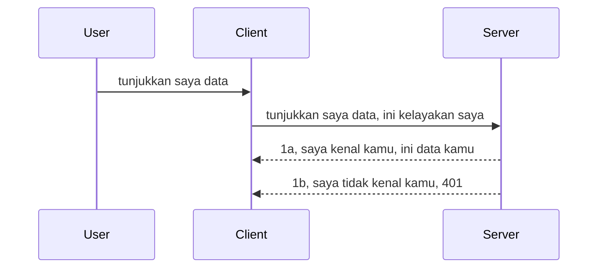

# Pengesahan mudah

SDK MCP menyokong penggunaan OAuth 2.1 yang, secara jujurnya, adalah proses yang agak rumit melibatkan konsep seperti pelayan pengesahan, pelayan sumber, menghantar kelayakan, mendapatkan kod, menukar kod untuk token pemegang sehingga anda akhirnya boleh mendapatkan data sumber anda. Jika anda tidak biasa dengan OAuth yang merupakan sesuatu yang bagus untuk dilaksanakan, adalah idea yang baik untuk mula dengan tahap asas pengesahan dan membangunnya ke tahap keselamatan yang lebih baik. Itulah sebabnya bab ini wujud, untuk membina anda ke pengesahan yang lebih maju.

## Pengesahan, maksud kami apa?

Pengesahan adalah singkatan untuk pengenalan dan kebenaran. Idenya adalah kita perlu melakukan dua perkara:

- **Pengenalan**, ialah proses menentukan sama ada kita membenarkan seseorang masuk ke rumah kita, bahawa mereka mempunyai hak untuk "di sini" iaitu mempunyai akses ke pelayan sumber kami di mana ciri MCP Server kami berada.
- **Kebenaran**, ialah proses untuk mengetahui sama ada seorang pengguna harus mempunyai akses ke sumber tertentu yang mereka minta, contohnya tempahan ini atau produk ini atau sama ada mereka dibenarkan membaca kandungan tetapi tidak menghapus sebagai contoh lain.

## Kelayakan: bagaimana kita memberitahu sistem siapa kita

Baiklah, kebanyakan pembangun web memulakan dengan berfikir dalam istilah memberikan kelayakan kepada pelayan, biasanya rahsia yang berkata jika mereka dibenarkan di sini "Pengenalan". Kelayakan ini biasanya adalah versi base64 yang disulitkan bagi nama pengguna dan kata laluan atau kunci API yang secara unik mengenal pasti pengguna tertentu. 

Ini melibatkan menghantarnya melalui pengepala yang dipanggil "Authorization" seperti berikut:

```json
{ "Authorization": "secret123" }
```

Ini biasanya dipanggil pengenalan asas. Bagaimana peralihan keseluruhan berfungsi adalah seperti berikut:


```mermaid
sequenceDiagram
   participant User
   participant Client
   participant Server

   User->>Client: tunjukkan saya data
   Client->>Server: tunjukkan saya data, ini kelayakan saya
   Server-->>Client: 1a, saya kenal kamu, ini data kamu
   Server-->>Client: 1b, saya tidak kenal kamu, 401 
```

Sekarang kita faham bagaimana ia berfungsi dari segi aliran, bagaimana kita melaksanakannya? Baiklah, kebanyakan pelayan web mempunyai konsep yang dipanggil middleware, satu keping kod yang berjalan sebagai sebahagian daripada permintaan yang boleh mengesahkan kelayakan, dan jika kelayakan adalah sah boleh membenarkan permintaan itu diteruskan. Jika permintaan tidak mempunyai kelayakan yang sah maka anda akan mendapat ralat pengesahan. Mari lihat bagaimana ini boleh dilaksanakan:

**Python**

```python
class AuthMiddleware(BaseHTTPMiddleware):
    async def dispatch(self, request, call_next):

        has_header = request.headers.get("Authorization")
        if not has_header:
            print("-> Missing Authorization header!")
            return Response(status_code=401, content="Unauthorized")

        if not valid_token(has_header):
            print("-> Invalid token!")
            return Response(status_code=403, content="Forbidden")

        print("Valid token, proceeding...")
       
        response = await call_next(request)
        # tambah mana-mana pengepala pelanggan atau ubah dalam respons dengan cara tertentu
        return response


starlette_app.add_middleware(CustomHeaderMiddleware)
```

Di sini kita ada: 

- Membuat middleware yang dipanggil `AuthMiddleware` di mana kaedah `dispatch`nya dipanggil oleh pelayan web. 
- Menambah middleware ke pelayan web:

    ```python
    starlette_app.add_middleware(AuthMiddleware)
    ```

- Menulis logik pengesahan yang memeriksa jika pengepala Authorization wujud dan jika rahsia yang dihantar sah:

    ```python
    has_header = request.headers.get("Authorization")
    if not has_header:
        print("-> Missing Authorization header!")
        return Response(status_code=401, content="Unauthorized")

    if not valid_token(has_header):
        print("-> Invalid token!")
        return Response(status_code=403, content="Forbidden")
    ```

    jika rahsia itu hadir dan sah maka kita membenarkan permintaan diteruskan dengan memanggil `call_next` dan mengembalikan respons.

    ```python
    response = await call_next(request)
    # tambah apa-apa pengepala pelanggan atau ubah suai dalam maklum balas dengan cara tertentu
    return response
    ```

Bagaimana ia berfungsi adalah jika permintaan web dibuat ke arah pelayan middleware akan dipanggil dan berdasarkan pelaksanaan ia sama ada membenarkan permintaan diteruskan atau akhirnya mengembalikan ralat yang menunjukkan klien tidak dibenarkan untuk meneruskan.

**TypeScript**

Di sini kita buat middleware dengan rangka kerja popular Express dan memintas permintaan sebelum ia sampai ke MCP Server. Berikut adalah kod untuk itu:

```typescript
function isValid(secret) {
    return secret === "secret123";
}

app.use((req, res, next) => {
    // 1. Header kebenaran ada?
    if(!req.headers["Authorization"]) {
        res.status(401).send('Unauthorized');
    }
    
    let token = req.headers["Authorization"];

    // 2. Semak kesahihan.
    if(!isValid(token)) {
        res.status(403).send('Forbidden');
    }

   
    console.log('Middleware executed');
    // 3. Hantar permintaan ke langkah seterusnya dalam rantaian permintaan.
    next();
});
```

Dalam kod ini kita:

1. Memeriksa jika pengepala Authorization hadir dari awal, jika tidak, kita hantar ralat 401.
2. Memastikan kelayakan/token adalah sah, jika tidak, kita hantar ralat 403.
3. Akhirnya meneruskan permintaan dalam pipeline permintaan dan mengembalikan sumber yang diminta.

## Latihan: Laksanakan pengesahan

Mari kita gunakan pengetahuan kita dan cuba melaksanakannya. Berikut adalah rancangan:

Pelayan

- Buat pelayan web dan instance MCP.
- Laksanakan middleware untuk pelayan.

Klien 

- Hantar permintaan web, dengan kelayakan, melalui pengepala.

### -1- Buat pelayan web dan instance MCP

> [!WARNING]
> Contoh TypeScript di bawah mensasarkan MCP `2025-11-25`. Ia menjejak pengangkutan
> dengan `mcp-session-id` dan bukan contoh pengangkutan semasa `2026-07-28`. MCP
> `2026-07-28` menghapuskan jabat tangan `initialize` dan ID sesi protokol; pelaksanaan baru
> menggunakan permintaan sendiri. Lihat
> [Apa Yang Berubah dalam MCP: Spesifikasi 2026-07-28](../../01-CoreConcepts/mcp-2026-07-28.md).

Dalam langkah pertama kita, kita perlu membuat instance pelayan web dan MCP Server.

**Python**

Di sini kita membuat instance pelayan MCP, buat aplikasi web starlette dan hoskannya dengan uvicorn.

```python
# membuat Pelayan MCP

app = FastMCP(
    name="MCP Resource Server",
    instructions="Resource Server that validates tokens via Authorization Server introspection",
    host=settings["host"],
    port=settings["port"],
    debug=True
)

# membuat aplikasi web starlette
starlette_app = app.streamable_http_app()

# menyajikan aplikasi melalui uvicorn
async def run(starlette_app):
    import uvicorn
    config = uvicorn.Config(
            starlette_app,
            host=app.settings.host,
            port=app.settings.port,
            log_level=app.settings.log_level.lower(),
        )
    server = uvicorn.Server(config)
    await server.serve()

run(starlette_app)
```

Dalam kod ini kita:

- Membuat MCP Server.
- Membina aplikasi web starlette dari MCP Server, `app.streamable_http_app()`.
- Hos dan servis aplikasi web menggunakan uvicorn `server.serve()`.

**TypeScript**

Di sini kita membuat instance MCP Server.

```typescript
const server = new McpServer({
      name: "example-server",
      version: "1.0.0"
    });

    // ... menyediakan sumber pelayan, alat, dan arahan ...
```

Penciptaan MCP Server ini perlu berlaku dalam definisi laluan POST /mcp kita, jadi mari kita ambil kod di atas dan pindahkan seperti berikut:

```typescript
import express from "express";
import { randomUUID } from "node:crypto";
import { McpServer } from "@modelcontextprotocol/sdk/server/mcp.js";
import { StreamableHTTPServerTransport } from "@modelcontextprotocol/sdk/server/streamableHttp.js";
import { isInitializeRequest } from "@modelcontextprotocol/sdk/types.js"

const app = express();
app.use(express.json());

// Peta untuk menyimpan pengangkutan mengikut ID sesi
const transports: { [sessionId: string]: StreamableHTTPServerTransport } = {};

// Mengendalikan permintaan POST untuk komunikasi klien-ke-pelayan
app.post('/mcp', async (req, res) => {
  // Semak untuk ID sesi yang sedia ada
  const sessionId = req.headers['mcp-session-id'] as string | undefined;
  let transport: StreamableHTTPServerTransport;

  if (sessionId && transports[sessionId]) {
    // Guna semula pengangkutan sedia ada
    transport = transports[sessionId];
  } else if (!sessionId && isInitializeRequest(req.body)) {
    // Permintaan inisialisasi baru
    transport = new StreamableHTTPServerTransport({
      sessionIdGenerator: () => randomUUID(),
      onsessioninitialized: (sessionId) => {
        // Simpan pengangkutan mengikut ID sesi
        transports[sessionId] = transport;
      },
      // Perlindungan DNS rebinding tidak diaktifkan secara lalai untuk keserasian ke belakang. Jika anda menjalankan pelayan ini
      // secara tempatan, pastikan untuk tetapkan:
      // enableDnsRebindingProtection: true,
      // allowedHosts: ['127.0.0.1'],
    });

    // Bersihkan pengangkutan apabila ditutup
    transport.onclose = () => {
      if (transport.sessionId) {
        delete transports[transport.sessionId];
      }
    };
    const server = new McpServer({
      name: "example-server",
      version: "1.0.0"
    });

    // ... sediakan sumber, alat, dan arahan pelayan ...

    // Sambung ke pelayan MCP
    await server.connect(transport);
  } else {
    // Permintaan tidak sah
    res.status(400).json({
      jsonrpc: '2.0',
      error: {
        code: -32000,
        message: 'Bad Request: No valid session ID provided',
      },
      id: null,
    });
    return;
  }

  // Mengendalikan permintaan
  await transport.handleRequest(req, res, req.body);
});

// Pengendali boleh guna semula untuk permintaan GET dan DELETE
const handleSessionRequest = async (req: express.Request, res: express.Response) => {
  const sessionId = req.headers['mcp-session-id'] as string | undefined;
  if (!sessionId || !transports[sessionId]) {
    res.status(400).send('Invalid or missing session ID');
    return;
  }
  
  const transport = transports[sessionId];
  await transport.handleRequest(req, res);
};

// Mengendalikan permintaan GET untuk pemberitahuan pelayan-ke-klien melalui SSE
app.get('/mcp', handleSessionRequest);

// Mengendalikan permintaan DELETE untuk penamatan sesi
app.delete('/mcp', handleSessionRequest);

app.listen(3000);
```

Sekarang anda lihat bagaimana penciptaan MCP Server dialihkan dalam `app.post("/mcp")`.

Mari kita bergerak ke langkah seterusnya iaitu membuat middleware supaya kita boleh mengesahkan kelayakan masuk.

### -2- Laksanakan middleware untuk pelayan

Mari kita teruskan ke bahagian middleware seterusnya. Di sini kita akan mencipta middleware yang mencari kelayakan dalam pengepala `Authorization` dan mengesahkannya. Jika diterima maka permintaan akan diteruskan untuk melakukan apa yang diperlukan (cth: senaraikan alat, baca sumber atau apa sahaja fungsi MCP yang diminta oleh klien).

**Python**

Untuk mencipta middleware, kita perlu membuat kelas yang mewarisi dari `BaseHTTPMiddleware`. Ada dua perkara menarik:

- Permintaan `request` , yang mana kita baca maklumat pengepala darinya.
- `call_next` adalah panggilan balik yang perlu kami panggil jika klien membawa kelayakan yang kami terima.

Pertama, kita perlu tangani kes jika pengepala `Authorization` tiada:

```python
has_header = request.headers.get("Authorization")

# tiada pengepala hadir, gagal dengan 401, jika tidak teruskan.
if not has_header:
    print("-> Missing Authorization header!")
    return Response(status_code=401, content="Unauthorized")
```

Di sini kita hantar mesej 401 tidak dibenarkan kerana klien gagal pengenalan.

Seterusnya, jika kelayakan dihantar, kita perlu semak kesahihannya seperti berikut:

```python
 if not valid_token(has_header):
    print("-> Invalid token!")
    return Response(status_code=403, content="Forbidden")
```

Perhatikan bagaimana kita hantar mesej 403 dilarang di atas. Mari tengok middleware penuh di bawah yang melaksanakan segala yang kita sebutkan tadi:

```python
class AuthMiddleware(BaseHTTPMiddleware):
    async def dispatch(self, request, call_next):

        has_header = request.headers.get("Authorization")
        if not has_header:
            print("-> Missing Authorization header!")
            return Response(status_code=401, content="Unauthorized")

        if not valid_token(has_header):
            print("-> Invalid token!")
            return Response(status_code=403, content="Forbidden")

        print("Valid token, proceeding...")
        print(f"-> Received {request.method} {request.url}")
        response = await call_next(request)
        response.headers['Custom'] = 'Example'
        return response

```

Bagus, tapi bagaimana dengan fungsi `valid_token`? Berikut adalah contohnya:

```python
# JANGAN guna untuk produksi - perbaiki ia !!
def valid_token(token: str) -> bool:
    # keluarkan awalan "Bearer "
    if token.startswith("Bearer "):
        token = token[7:]
        return token == "secret-token"
    return False
```

Ini sememangnya patut diperbaiki. 

PENTING: Anda tidak harus pernah mempunyai rahsia seperti ini dalam kod. Anda seharusnya mendapatkan nilai untuk dibandingkan dari sumber data atau dari IDP (penyedia perkhidmatan identiti) atau lebih baik lagi, biarlah IDP melakukan pengesahan.

**TypeScript**

Untuk melaksanakan ini dengan Express, kita perlu memanggil kaedah `use` yang mengambil fungsi middleware.

Kita perlu:

- Berinteraksi dengan pemboleh ubah permintaan untuk memeriksa kelayakan yang dihantar dalam sifat `Authorization`.
- Mengesahkan kelayakan, dan jika sah membenarkan permintaan diteruskan agar permintaan MCP klien melakukan apa yang patut (cth: senaraikan alat, baca sumber atau apa sahaja berkaitan MCP).

Di sini, kita periksa jika pengepala `Authorization` hadir dan jika tidak, kita hentikan permintaan daripada diteruskan:

```typescript
if(!req.headers["authorization"]) {
    res.status(401).send('Unauthorized');
    return;
}
```

Jika pengepala tidak dihantar dari awal, anda akan menerima 401.

Seterusnya, kita semak jika kelayakan sah, jika tidak kita sekali lagi hentikan permintaan tetapi dengan mesej yang sedikit berbeza:

```typescript
if(!isValid(token)) {
    res.status(403).send('Forbidden');
    return;
} 
```

Perhatikan bagaimana anda sekarang mendapat ralat 403.

Berikut adalah kod penuh:

```typescript
app.use((req, res, next) => {
    console.log('Request received:', req.method, req.url, req.headers);
    console.log('Headers:', req.headers["authorization"]);
    if(!req.headers["authorization"]) {
        res.status(401).send('Unauthorized');
        return;
    }
    
    let token = req.headers["authorization"];

    if(!isValid(token)) {
        res.status(403).send('Forbidden');
        return;
    }  

    console.log('Middleware executed');
    next();
});
```

Kami telah sediakan pelayan web untuk menerima middleware bagi memeriksa kelayakan yang klien harap-harap hantar kepada kami. Bagaimana pula dengan klien itu sendiri?

### -3- Hantar permintaan web dengan kelayakan melalui pengepala

Kita perlu pastikan klien menghantar kelayakan melalui pengepala. Oleh kerana kita akan menggunakan klien MCP untuk itu, kita perlu tahu cara melakukannya.

**Python**

Untuk klien, kita perlu hantar pengepala dengan kelayakan kita seperti berikut:

```python
# JANGAN kodkan nilai secara terus, simpan sekurang-kurangnya dalam pembolehubah persekitaran atau storan yang lebih selamat
token = "secret-token"

async with streamablehttp_client(
        url = f"http://localhost:{port}/mcp",
        headers = {"Authorization": f"Bearer {token}"}
    ) as (
        read_stream,
        write_stream,
        session_callback,
    ):
        async with ClientSession(
            read_stream,
            write_stream
        ) as session:
            await session.initialize()
      
            # TODO, apa yang anda mahu lakukan di klien, contohnya senaraikan alat, panggil alat dan lain-lain.
```

Perhatikan bagaimana kita mengisi sifat `headers` seperti ` headers = {"Authorization": f"Bearer {token}"}`.

**TypeScript**

Kita boleh selesaikan ini dalam dua langkah:

1. Isikan objek konfigurasi dengan kelayakan kita.
2. Hantar objek konfigurasi ke pengangkut.

```typescript

// JANGAN keraskod nilai seperti yang ditunjukkan di sini. Sekurang-kurangnya letakkan ia sebagai pembolehubah persekitaran dan gunakan sesuatu seperti dotenv (dalam mod dev).
let token = "secret123"

// definisikan objek pilihan pengangkutan klien
let options: StreamableHTTPClientTransportOptions = {
  sessionId: sessionId,
  requestInit: {
    headers: {
      "Authorization": "secret123"
    }
  }
};

// hantar objek pilihan kepada pengangkutan
async function main() {
   const transport = new StreamableHTTPClientTransport(
      new URL(serverUrl),
      options
   );
```

Di sini anda lihat bagaimana kita perlu mencipta objek `options` dan letakkan pengepala di bawah sifat `requestInit`.

PENTING: Bagaimana kita memperbaikinya dari sini? Baiklah, pelaksanaan semasa ada beberapa masalah. Mula-mula, menghantar kelayakan seperti ini agak berisiko kecuali anda sekurang-kurangnya ada HTTPS. Walaupun begitu, kelayakan boleh dicuri jadi anda memerlukan sistem di mana token boleh dibatalkan dengan mudah dan tambah pemeriksaan tambahan seperti dari mana asalnya permintaan, adakah permintaan berlaku terlalu kerap (tingkah laku macam bot), ringkasnya ada banyak perkara yang perlu dipertimbangkan. 

Namun begitu, untuk API yang sangat mudah di mana anda tidak mahu sesiapa pun mengakses API anda tanpa pengesahan, apa yang kita ada di sini adalah permulaan yang baik. 

Dengan itu, mari cuba perkuatkan keselamatan sedikit dengan menggunakan format standard seperti JSON Web Token, juga dikenali sebagai JWT atau token "JOT".

## JSON Web Tokens, JWT

Jadi, kita cuba memperbaiki dari menghantar kelayakan yang sangat mudah. Apakah peningkatan segera yang kita dapat dengan menerima JWT?

- **Peningkatan keselamatan**. Dalam pengenalan asas, anda menghantar nama pengguna dan kata laluan sebagai token yang diperoleh dari base64 (atau anda hantar kunci API) berulang kali yang meningkatkan risiko. Dengan JWT, anda hantar nama pengguna dan kata laluan dan dapatkan token sebagai balasan dan ia juga mempunyai had masa bermakna ia akan tamat tempoh. JWT membolehkan anda menggunakan kawalan akses terperinci menggunakan peranan, skop dan kebenaran dengan mudah.
- **Statelessness dan kebolehskalaan**. JWT adalah bebas, mereka membawa semua maklumat pengguna dan menghapuskan keperluan untuk menyimpan sesi pelayan. Token juga boleh disahkan secara tempatan.
- **Keserasian dan federasi**. JWT adalah teras Open ID Connect dan digunakan dengan penyedia identiti dikenali seperti Entra ID, Google Identity dan Auth0. Mereka juga membolehkan penggunaan log masuk tunggal dan banyak lagi menjadikannya tahap perusahaan.
- **Modulariti dan fleksibiliti**. JWT juga boleh digunakan dengan API Gateway seperti Azure API Management, NGINX dan banyak lagi. Ia juga menyokong senario pengesahan pengguna dan komunikasi pelayan-ke-perkhidmatan termasuk pemalsuan identiti dan delegasi.
- **Prestasi dan penyimpanan cache**. JWT boleh disimpan cache selepas penyahkodan yang mengurangkan keperluan untuk penguraian. Ini membantu terutamanya dengan aplikasi trafik tinggi kerana ia meningkatkan kapasiti dan mengurangkan beban pada infrastruktur pilihan anda.
- **Ciri-ciri lanjutan**. Ia juga menyokong introspeksi (memeriksa kesahihan pada pelayan) dan pembatalan (menjadikan token tidak sah).

Dengan semua manfaat ini, mari kita lihat bagaimana kita boleh bawa pelaksanaan kita ke tahap seterusnya.

## Menukar pengesahan asas kepada JWT

Jadi, perubahan yang kita perlu buat di peringkat tinggi adalah:

- **Belajar membina token JWT** dan sediakan ia untuk dihantar dari klien ke pelayan.
- **Sahkan token JWT**, dan jika sah, beri klien akses ke sumber kita.
- **Simpan token dengan selamat**. Bagaimana kita menyimpan token ini.
- **Lindungi laluan**. Kita perlu melindungi laluan, dalam kes kita, kita perlu melindungi laluan dan ciri MCP tertentu.
- **Tambah token segar**. Pastikan kita buat token yang berumur pendek tetapi token segar yang panjang umur yang boleh digunakan untuk mendapatkan token baru jika tamat tempoh. Juga pastikan terdapat titik akhir segar dan strategi penggiliran.

### -1- Bina token JWT

Mula-mula, token JWT mempunyai bahagian berikut:

- **header**, algoritma yang digunakan dan jenis token.
- **payload**, tuntutan, seperti sub (pengguna atau entiti yang token wakili. Dalam senario pengesahan ini biasanya ialah userid), exp (masa tamat tempoh) peranan (role)
- **signature**, ditandatangani dengan rahsia atau kunci peribadi.

Untuk ini, kita perlu bina header, payload dan token yang disulitkan.

**Python**

```python

import jwt
import jwt
from jwt.exceptions import ExpiredSignatureError, InvalidTokenError
import datetime

# Kunci rahsia yang digunakan untuk menandatangani JWT
secret_key = 'your-secret-key'

header = {
    "alg": "HS256",
    "typ": "JWT"
}

# maklumat pengguna dan tuntutan serta masa luputnya
payload = {
    "sub": "1234567890",               # Subjek (ID pengguna)
    "name": "User Userson",                # Tuntutan khusus
    "admin": True,                     # Tuntutan khusus
    "iat": datetime.datetime.utcnow(),# Dikeluarkan pada
    "exp": datetime.datetime.utcnow() + datetime.timedelta(hours=1)  # Luput
}

# kodkan ia
encoded_jwt = jwt.encode(payload, secret_key, algorithm="HS256", headers=header)
```

Dalam kod di atas kita:

- Mendefinisikan header menggunakan HS256 sebagai algoritma dan jenis sebagai JWT.
- Membina payload yang mengandungi subjek atau id pengguna, nama pengguna, peranan, bila dikeluarkan dan bila ditetapkan tamat tempoh dengan itu melaksanakan aspek had masa yang kita sebutkan tadi. 

**TypeScript**

Di sini kita akan perlukan beberapa kebergantungan yang akan bantu kita bina token JWT.

Kebergantungan

```sh

npm install jsonwebtoken
npm install --save-dev @types/jsonwebtoken
```

Sekarang kita ada itu, mari bina header, payload dan daripada itu bina token yang disulitkan.

```typescript
import jwt from 'jsonwebtoken';

const secretKey = 'your-secret-key'; // Gunakan pemboleh ubah persekitaran dalam pengeluaran

// Tetapkan muatan
const payload = {
  sub: '1234567890',
  name: 'User usersson',
  admin: true,
  iat: Math.floor(Date.now() / 1000), // Dikeluarkan pada
  exp: Math.floor(Date.now() / 1000) + 60 * 60 // Tamat tempoh dalam 1 jam
};

// Tetapkan kepala (pilihan, jsonwebtoken menetapkan nilai lalai)
const header = {
  alg: 'HS256',
  typ: 'JWT'
};

// Cipta token
const token = jwt.sign(payload, secretKey, {
  algorithm: 'HS256',
  header: header
});

console.log('JWT:', token);
```

Token ini:

Ditandatangani menggunakan HS256
Sah selama 1 jam
Mengandungi tuntutan seperti sub, name, admin, iat, dan exp.

### -2- Sahkan token

Kita juga perlu sahkan token, ini sesuatu yang kita perlu buat di pelayan untuk pastikan apa yang klien hantar memang sah. Ada banyak pemeriksaan yang perlu dilakukan dari sahkan strukturnya hingga kesahihannya. Anda juga digalakkan menambahkan pemeriksaan lain untuk lihat jika pengguna ada dalam sistem anda dan banyak lagi.

Untuk sahkan token, kita perlu nyahkodnya supaya kita boleh membacanya dan mula semak kesahihannya:

**Python**

```python

# Nyahkod dan sahkan JWT
try:
    decoded = jwt.decode(token, secret_key, algorithms=["HS256"])
    print("✅ Token is valid.")
    print("Decoded claims:")
    for key, value in decoded.items():
        print(f"  {key}: {value}")
except ExpiredSignatureError:
    print("❌ Token has expired.")
except InvalidTokenError as e:
    print(f"❌ Invalid token: {e}")

```


Dalam kod ini, kami memanggil `jwt.decode` menggunakan token, kunci rahsia dan algoritma yang dipilih sebagai input. Perhatikan bagaimana kami menggunakan konstruk try-catch kerana validasi yang gagal menyebabkan ralat dibangkitkan.

**TypeScript**

Di sini kami perlu memanggil `jwt.verify` untuk mendapatkan versi token yang telah didekod yang boleh kami analisis dengan lebih lanjut. Jika panggilan ini gagal, itu bermakna struktur token tidak betul atau ia sudah tidak sah lagi.

```typescript

try {
  const decoded = jwt.verify(token, secretKey);
  console.log('Decoded Payload:', decoded);
} catch (err) {
  console.error('Token verification failed:', err);
}
```

CATATAN: seperti yang dinyatakan sebelum ini, kami harus melakukan pemeriksaan tambahan untuk memastikan token ini menunjukkan seorang pengguna dalam sistem kami dan memastikan pengguna mempunyai hak yang diakuinya.

Seterusnya, mari kita lihat kawalan akses berasaskan peranan, juga dikenali sebagai RBAC.

## Menambah kawalan akses berasaskan peranan

Idea adalah bahawa kami ingin menyatakan bahawa peranan yang berbeza mempunyai kebenaran yang berbeza. Sebagai contoh, kami andaikan seorang admin boleh melakukan segala-galanya dan pengguna biasa boleh membaca/menulis dan tetamu hanya boleh membaca. Oleh itu, berikut adalah beberapa tahap kebenaran yang mungkin:

- Admin.Tulis
- Pengguna.Baca
- Tetamu.Baca

Mari lihat bagaimana kita boleh melaksanakan kawalan seperti ini dengan middleware. Middleware boleh ditambah bagi setiap laluan serta untuk semua laluan.

**Python**

```python
from starlette.middleware.base import BaseHTTPMiddleware
from starlette.responses import JSONResponse
import jwt

# JANGAN letakkan rahsia dalam kod seperti ini, ini hanya untuk tujuan demonstrasi. Baca dari tempat yang selamat.
SECRET_KEY = "your-secret-key" # letakkan ini dalam pembolehubah persekitaran
REQUIRED_PERMISSION = "User.Read"

class JWTPermissionMiddleware(BaseHTTPMiddleware):
    async def dispatch(self, request, call_next):
        auth_header = request.headers.get("Authorization")
        if not auth_header or not auth_header.startswith("Bearer "):
            return JSONResponse({"error": "Missing or invalid Authorization header"}, status_code=401)

        token = auth_header.split(" ")[1]
        try:
            decoded = jwt.decode(token, SECRET_KEY, algorithms=["HS256"])
        except jwt.ExpiredSignatureError:
            return JSONResponse({"error": "Token expired"}, status_code=401)
        except jwt.InvalidTokenError:
            return JSONResponse({"error": "Invalid token"}, status_code=401)

        permissions = decoded.get("permissions", [])
        if REQUIRED_PERMISSION not in permissions:
            return JSONResponse({"error": "Permission denied"}, status_code=403)

        request.state.user = decoded
        return await call_next(request)


```

Terdapat beberapa cara berbeza untuk menambah middleware seperti di bawah:

```python

# Alt 1: tambah middleware semasa membina aplikasi starlette
middleware = [
    Middleware(JWTPermissionMiddleware)
]

app = Starlette(routes=routes, middleware=middleware)

# Alt 2: tambah middleware selepas aplikasi starlette dibina
starlette_app.add_middleware(JWTPermissionMiddleware)

# Alt 3: tambah middleware untuk setiap laluan
routes = [
    Route(
        "/mcp",
        endpoint=..., # pengendali
        middleware=[Middleware(JWTPermissionMiddleware)]
    )
]
```

**TypeScript**

Kami boleh menggunakan `app.use` dan middleware yang akan berjalan untuk semua permintaan.

```typescript
app.use((req, res, next) => {
    console.log('Request received:', req.method, req.url, req.headers);
    console.log('Headers:', req.headers["authorization"]);

    // 1. Semak jika header kebenaran telah dihantar

    if(!req.headers["authorization"]) {
        res.status(401).send('Unauthorized');
        return;
    }
    
    let token = req.headers["authorization"];

    // 2. Semak jika token sah
    if(!isValid(token)) {
        res.status(403).send('Forbidden');
        return;
    }  

    // 3. Semak jika pengguna token wujud dalam sistem kami
    if(!isExistingUser(token)) {
        res.status(403).send('Forbidden');
        console.log("User does not exist");
        return;
    }
    console.log("User exists");

    // 4. Sahkan token mempunyai kebenaran yang betul
    if(!hasScopes(token, ["User.Read"])){
        res.status(403).send('Forbidden - insufficient scopes');
    }

    console.log("User has required scopes");

    console.log('Middleware executed');
    next();
});

```

Terdapat beberapa perkara yang boleh dan SEHARUSNYA middleware kita lakukan, iaitu:

1. Periksa jika header kebenaran ada
2. Periksa jika token sah, kami memanggil `isValid` yang merupakan kaedah yang kami tulis untuk memeriksa integriti dan kesahihan token JWT.
3. Sahkan pengguna wujud dalam sistem kami, kami harus periksa ini.

   ```typescript
    // pengguna dalam DB
   const users = [
     "user1",
     "User usersson",
   ]

   function isExistingUser(token) {
     let decodedToken = verifyToken(token);

     // TODO, semak jika pengguna wujud dalam DB
     return users.includes(decodedToken?.name || "");
   }
   ```

   Di atas, kami telah mencipta senarai `users` yang sangat ringkas, yang sepatutnya berada di dalam pangkalan data tentunya.

4. Selain itu, kami juga harus memeriksa token mempunyai kebenaran yang betul.

   ```typescript
   if(!hasScopes(token, ["User.Read"])){
        res.status(403).send('Forbidden - insufficient scopes');
   }
   ```

   Dalam kod di atas dari middleware, kami memeriksa bahawa token mengandungi kebenaran User.Read, jika tidak kami hantar ralat 403. Di bawah ialah kaedah pembantu `hasScopes`.

   ```typescript
   function hasScopes(scope: string, requiredScopes: string[]) {
     let decodedToken = verifyToken(scope);
    return requiredScopes.every(scope => decodedToken?.scopes.includes(scope));
  }
   ```

Have a think which additional checks you should be doing, but these are the absolute minimum of checks you should be doing.

Using Express as a web framework is a common choice. There are helpers library when you use JWT so you can write less code.

- `express-jwt`, helper library that provides a middleware that helps decode your token.
- `express-jwt-permissions`, this provides a middleware `guard` that helps check if a certain permission is on the token.

Here's what these libraries can look like when used:

```typescript
const express = require('express');
const jwt = require('express-jwt');
const guard = require('express-jwt-permissions')();

const app = express();
const secretKey = 'your-secret-key'; // put this in env variable

// Decode JWT and attach to req.user
app.use(jwt({ secret: secretKey, algorithms: ['HS256'] }));

// Check for User.Read permission
app.use(guard.check('User.Read'));

// multiple permissions
// app.use(guard.check(['User.Read', 'Admin.Access']));

app.get('/protected', (req, res) => {
  res.json({ message: `Welcome ${req.user.name}` });
});

// Error handler
app.use((err, req, res, next) => {
  if (err.code === 'permission_denied') {
    return res.status(403).send('Forbidden');
  }
  next(err);
});

```

Kini anda telah melihat bagaimana middleware boleh digunakan untuk pengesahan dan kebenaran, bagaimana pula dengan MCP, adakah ia mengubah cara kita buat auth? Mari kita cari dalam bahagian seterusnya.

### -3- Tambah RBAC ke MCP

Anda telah lihat setakat ini bagaimana anda boleh menambah RBAC melalui middleware, namun, untuk MCP tiada cara mudah untuk menambah RBAC setiap ciri MCP, jadi apa yang kita lakukan? Baiklah, kita hanya perlu menambah kod seperti ini yang memeriksa dalam kes ini sama ada klien mempunyai hak untuk memanggil alat tertentu:

Anda ada beberapa pilihan berbeza bagaimana untuk melaksanakan RBAC setiap ciri, di sini ada beberapa:

- Tambah pemeriksaan untuk setiap alat, sumber, prompt di mana anda perlu memeriksa tahap kebenaran.

   **python**

   ```python
   @tool()
   def delete_product(id: int):
      try:
          check_permissions(role="Admin.Write", request)
      catch:
        pass # pelanggan gagal kebenaran, tingkatkan ralat kebenaran
   ```

   **typescript**

   ```typescript
   server.registerTool(
    "delete-product",
    {
      title: Delete a product",
      description: "Deletes a product",
      inputSchema: { id: z.number() }
    },
    async ({ id }) => {
      
      try {
        checkPermissions("Admin.Write", request);
        // todo, hantar id ke productService dan remote entry
      } catch(Exception e) {
        console.log("Authorization error, you're not allowed");  
      }

      return {
        content: [{ type: "text", text: `Deletected product with id ${id}` }]
      };
    }
   );
   ```


- Gunakan pendekatan server maju dan pengendali permintaan agar anda mengurangkan berapa banyak tempat anda perlu buat pemeriksaan.

   **Python**

   ```python
   
   tool_permission = {
      "create_product": ["User.Write", "Admin.Write"],
      "delete_product": ["Admin.Write"]
   }

   def has_permission(user_permissions, required_permissions) -> bool:
      # user_permissions: senarai kebenaran yang dimiliki pengguna
      # required_permissions: senarai kebenaran yang diperlukan untuk alat
      return any(perm in user_permissions for perm in required_permissions)

   @server.call_tool()
   async def handle_call_tool(
     name: str, arguments: dict[str, str] | None
   ) -> list[types.TextContent]:
    # Anggap request.user.permissions adalah senarai kebenaran untuk pengguna
     user_permissions = request.user.permissions
     required_permissions = tool_permission.get(name, [])
     if not has_permission(user_permissions, required_permissions):
        # Bangkitkan ralat "Anda tidak mempunyai kebenaran untuk menggunakan alat {name}"
        raise Exception(f"You don't have permission to call tool {name}")
     # teruskan dan panggil alat
     # ...
   ```   
   

   **TypeScript**

   ```typescript
   function hasPermission(userPermissions: string[], requiredPermissions: string[]): boolean {
       if (!Array.isArray(userPermissions) || !Array.isArray(requiredPermissions)) return false;
       // Pulangkan benar jika pengguna mempunyai sekurang-kurangnya satu kebenaran yang diperlukan
       
       return requiredPermissions.some(perm => userPermissions.includes(perm));
   }
  
   server.setRequestHandler(CallToolRequestSchema, async (request) => {
      const { params: { name } } = request;
  
      let permissions = request.user.permissions;
  
      if (!hasPermission(permissions, toolPermissions[name])) {
         return new Error(`You don't have permission to call ${name}`);
      }
  
      // teruskan..
   });
   ```

   Nota, anda perlu pastikan middleware anda menetapkan token yang telah didekod ke dalam sifat pengguna permintaan supaya kod di atas menjadi mudah.

### Kesimpulan

Kini kita telah bincangkan bagaimana menambah sokongan untuk RBAC secara umum dan untuk MCP khususnya, kini masa untuk anda cuba melaksanakan keselamatan sendiri untuk memastikan anda faham konsep yang telah dibentangkan.

## Tugasan 1: Bina pelayan mcp dan klien mcp menggunakan pengesahan asas

Di sini anda akan mengambil apa yang anda pelajari dari segi menghantar kelayakan melalui header.

## Penyelesaian 1

[Penyelesaian 1](./code/basic/README.md)

## Tugasan 2: Tingkatkan penyelesaian dari Tugasan 1 untuk menggunakan JWT

Ambil penyelesaian pertama tetapi kali ini, mari kita perbaiki.

Daripada menggunakan Basic Auth, mari kita gunakan JWT.

## Penyelesaian 2

[Penyelesaian 2](./solution/jwt-solution/README.md)

## Cabaran

Tambah RBAC per alat yang kami terangkan dalam bahagian "Tambah RBAC ke MCP".

## Ringkasan

Anda diharap telah belajar banyak dalam bab ini, dari tiada keselamatan langsung, kepada keselamatan asas, kepada JWT dan bagaimana ia boleh ditambah ke MCP.

Kami telah membina asas kukuh dengan JWT khusus, tetapi apabila kami berkembang, kami bergerak ke arah model identiti berasaskan piawaian. Menggunakan IdP seperti Entra atau Keycloak membolehkan kami melepaskan keluaran token, validasi, dan pengurusan kitaran hayat ke platform yang dipercayai — membebaskan kami untuk fokus pada logik aplikasi dan pengalaman pengguna.

Untuk itu, kami ada bab yang lebih [maju mengenai Entra](../../05-AdvancedTopics/mcp-security-entra/README.md)

## Apa Yang Seterusnya

- Seterusnya: [Menyediakan Hos MCP](../12-mcp-hosts/README.md)

---

<!-- CO-OP TRANSLATOR DISCLAIMER START -->
**Penafian**:
Dokumen ini telah diterjemahkan menggunakan perkhidmatan terjemahan AI [Co-op Translator](https://github.com/Azure/co-op-translator). Walaupun kami berusaha untuk ketepatan, sila ambil maklum bahawa terjemahan automatik mungkin mengandungi kesilapan atau ketidaktepatan. Dokumen asal dalam bahasa asalnya harus dianggap sebagai sumber yang sahih. Untuk maklumat penting, terjemahan oleh manusia profesional adalah disyorkan. Kami tidak bertanggungjawab terhadap sebarang salah faham atau salah tafsir yang timbul daripada penggunaan terjemahan ini.
<!-- CO-OP TRANSLATOR DISCLAIMER END -->