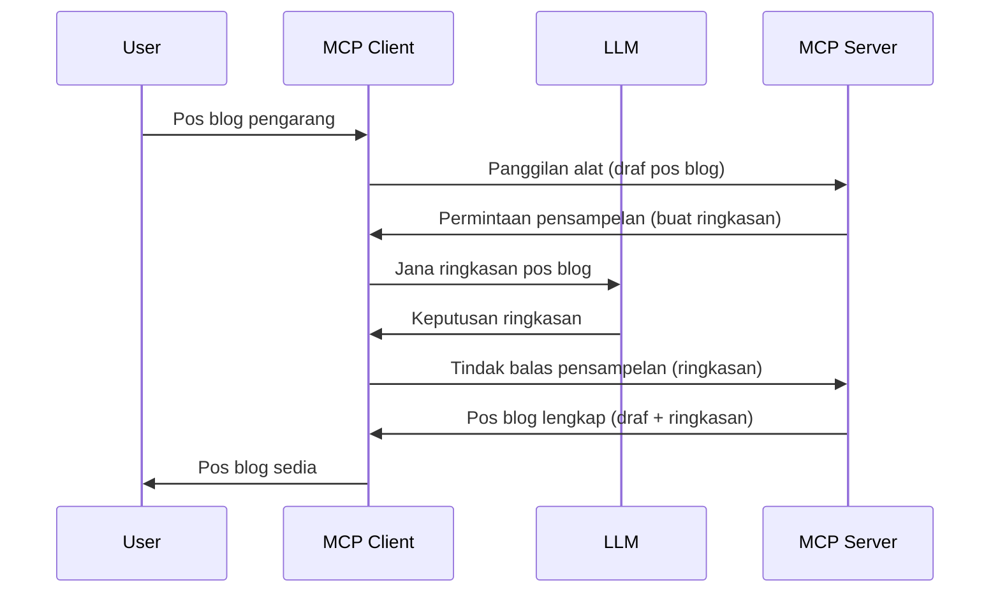

> [!PERINGATAN]
> Pengambilan sampel tidak digalakkan dalam MCP `2026-07-28`. Pelajaran ini kekal untuk
> pelaksanaan warisan. Pelayan baru harus berintegrasi terus dengan API
> penyedia LLM.

# Pengambilan Sampel - mendelegasikan ciri kepada Pelanggan

> Pengambilan sampel kekal dalam spesifikasi `2026-07-28` untuk keserasian dan
> layak untuk dikeluarkan dalam semakan pertama yang dikeluarkan pada atau selepas 28 Julai,
> 2027. Contoh dalam pelajaran ini mungkin menggunakan API SDK yang melaksanakan `2025-11-25`.
> Lihat [Apa Yang Telah Berubah dalam MCP: Spesifikasi 2026-07-28](../../01-CoreConcepts/mcp-2026-07-28.md).

Dalam pelaksanaan warisan, Pengambilan Sampel membenarkan pelayan MCP memohon bantuan daripada LLM
yang diurus oleh pelanggan. Untuk pelaksanaan baru, hubungi penyedia LLM yang dipilih
secara langsung sebagai gantinya.

Mari kita teroka beberapa kes penggunaan dan bagaimana membina penyelesaian yang melibatkan pengambilan sampel.

## Gambaran Keseluruhan

Dalam pelajaran ini, kami memberi tumpuan untuk menerangkan bila dan di mana menggunakan Pengambilan Sampel dan cara mengkonfigurasikannya.

## Objektif Pembelajaran

Dalam bab ini, kita akan:

- Menerangkan apa itu Pengambilan Sampel dan bila menggunakannya.
- Menunjukkan cara mengkonfigurasi Pengambilan Sampel dalam MCP.
- Memberi contoh Pengambilan Sampel dalam tindakan.

## Apa Itu Pengambilan Sampel dan kenapa menggunakannya?

Pengambilan Sampel adalah ciri maju yang berfungsi dengan cara berikut:



### Permintaan Pengambilan Sampel

Baiklah, sekarang kita mempunyai pandangan luas mengenai senario yang munasabah, mari kita bincang tentang permintaan pengambilan sampel yang dihantar oleh pelayan kepada pelanggan. Berikut adalah contoh rupa permintaan tersebut dalam format JSON-RPC:

```json
{
  "jsonrpc": "2.0",
  "id": 1,
  "method": "sampling/createMessage",
  "params": {
    "messages": [
      {
        "role": "user",
        "content": {
          "type": "text",
          "text": "Create a blog post summary of the following blog post: <BLOG POST>"
        }
      }
    ],
    "modelPreferences": {
      "hints": [
        {
          "name": "claude-3-sonnet"
        }
      ],
      "intelligencePriority": 0.8,
      "speedPriority": 0.5
    },
    "systemPrompt": "You are a helpful assistant.",
    "maxTokens": 100
  }
}
```

Terdapat beberapa perkara yang patut diberi perhatian:

- Prompt, di bawah content -> text, adalah prompt kami yang merupakan arahan untuk LLM membuat ringkasan kandungan blog.

- **modelPreferences**. Bahagian ini hanyalah itu, satu keutamaan, satu cadangan konfigurasi yang digunakan dengan LLM. Pengguna boleh memilih sama ada untuk menerima cadangan ini atau mengubahnya. Dalam kes ini terdapat cadangan model untuk digunakan serta keutamaan kelajuan dan kecerdasan.
- **systemPrompt**, ini adalah prompt sistem biasa anda yang memberikan personaliti kepada LLM anda dan mengandungi arahan panduan.
- **maxTokens**, ini adalah satu lagi sifat yang digunakan untuk menyatakan berapakah jumlah token yang disyorkan untuk tugas ini.

### Respons Pengambilan Sampel

Respons ini ialah apa yang MCP Client akhirnya hantar balik kepada MCP Server dan adalah hasil pelanggan memanggil LLM, menunggu respons itu dan kemudian membina mesej ini. Berikut adalah contoh rupa dalam format JSON-RPC:

```json
{
  "jsonrpc": "2.0",
  "id": 1,
  "result": {
    "role": "assistant",
    "content": {
      "type": "text",
      "text": "Here's your abstract <ABSTRACT>"
    },
    "model": "gpt-5",
    "stopReason": "endTurn"
  }
}
```

Perhatikan bagaimana respons adalah abstrak bagi pos blog seperti yang kami minta. Juga perhatikan model yang digunakan bukan yang kami minta tetapi "gpt-5" berbanding "claude-3-sonnet". Ini untuk menggambarkan bahawa pengguna boleh berubah fikiran mengenai apa yang hendak digunakan dan permintaan pengambilan sampel anda adalah cadangan.

Baiklah, sekarang kita faham alur utama, dan tugas berguna yang sesuai untuk digunakan “pembuatan pos blog + abstrak”, mari kita lihat apa yang perlu dilakukan untuk menjadikannya berfungsi.

### Jenis Mesej

Mesej pengambilan sampel tidak terhad kepada teks sahaja tetapi anda juga boleh menghantar imej dan audio. Berikut adalah bagaimana JSON-RPC kelihatan berbeza:

**Teks**

```json
{
  "type": "text",
  "text": "The message content"
}
```

**Kandungan imej**

```json
{
  "type": "image",
  "data": "base64-encoded-image-data",
  "mimeType": "image/jpeg"
}
```

**Kandungan audio**

```json
{
  "type": "audio",
  "data": "base64-encoded-audio-data",
  "mimeType": "audio/wav"
}
```

> NOTA: Untuk status semasa dan panduan migrasi, lihat
> [dokumentasi Pengambilan Sampel yang sudah tidak digunakan](https://modelcontextprotocol.io/specification/2026-07-28/client/sampling).

## Cara Mengkonfigurasi Pengambilan Sampel dalam Pelanggan

> Nota: jika anda hanya membina pelayan, anda tidak perlu buat banyak di sini.

Dalam pelanggan, anda perlu menentukan ciri berikut seperti berikut:

```json
{
  "capabilities": {
    "sampling": {}
  }
}
```

Ini kemudiannya akan diambil apabila pelanggan pilihan anda memulakan dengan pelayan.

## Contoh Pengambilan Sampel dalam Tindakan - Membuat Pos Blog

Mari kita aturkan bersama pelayan pengambilan sampel, kita perlu lakukan perkara berikut:

1. Cipta alat pada Pelayan.
1. Alat tersebut harus mencipta permintaan pengambilan sampel
1. Alat harus menunggu permintaan pengambilan sampel pelanggan dijawab.
1. Kemudian hasil alat harus dihasilkan.

Mari lihat kod langkah demi langkah:

### -1- Cipta alat

**python**

```python
@mcp.tool()
async def create_blog(title: str, content: str, ctx: Context[ServerSession, None]) -> str:
    """Create a blog post and generate a summary"""

```

### -2- Cipta permintaan pengambilan sampel

Luaskan alat anda dengan kod berikut:

**python**

```python
post = BlogPost(
        id=len(posts) + 1,
        title=title,
        content=content,
        abstract=""
    )

prompt = f"Create an abstract of the following blog post: title: {title} and draft: {content} "

result = await ctx.session.create_message(
        messages=[
            SamplingMessage(
                role="user",
                content=TextContent(type="text", text=prompt),
            )
        ],
        max_tokens=100,
)

```

### -3- Tunggu respons dan kembalikan respons

**python**

```python
post.abstract = result.content.text

posts.append(post)

# mengembalikan produk lengkap
return json.dumps({
    "id": post.title,
    "abstract": post.abstract
})
```

### -4- Kod penuh

**python**

```python
from starlette.applications import Starlette
from starlette.routing import Mount, Host

from mcp.server.fastmcp import Context, FastMCP

from mcp.server.session import ServerSession
from mcp.types import SamplingMessage, TextContent

import json


from uuid import uuid4
from typing import List
from pydantic import BaseModel


mcp = FastMCP("Blog post generator")

# app = FastAPI()

posts = []

class BlogPost(BaseModel):
    id: int
    title: str
    content: str
    abstract: str

posts: List[BlogPost] = []

@mcp.tool()
async def create_blog(title: str, content: str, ctx: Context[ServerSession, None]) -> str:
    """Create a blog post and generate a summary"""

    post = BlogPost(
        id=len(posts) + 1,
        title=title,
        content=content,
        abstract=""
    )

    prompt = f"Create an abstract of the following blog post: title: {title} and draft: {content} "

    result = await ctx.session.create_message(
        messages=[
            SamplingMessage(
                role="user",
                content=TextContent(type="text", text=prompt),
            )
        ],
        max_tokens=100,
    )

    post.abstract = result.content.text

    posts.append(post)

    # kembalikan pos blog lengkap
    return json.dumps({
        "id": post.title,
        "abstract": post.abstract
    })

if __name__ == "__main__":
    print("Starting server...")
    # mcp.run()
    mcp.run(transport="streamable-http")

# jalankan aplikasi dengan: python server.py
```

### -5- Uji dalam Visual Studio Code

Untuk menguji ini dalam Visual Studio Code, lakukan perkara berikut:

1. Mulakan pelayan dalam terminal
1. Tambahkannya ke *mcp.json* (dan pastikan ia dimulakan) contohnya seperti berikut:

   ```json
   "servers": {
      "blog-server": {
        "type": "http",
        "url": "http://localhost:8000/mcp"
      }
   }
   ```

1. Taip prompt:

   ```text
   create a blog post named "Where Python comes from", the content is "Python is actually named after Monty Python Flying Circus"
   ```

1. Benarkan pengambilan sampel berlaku. Kali pertama anda menguji ini, anda akan dihidangkan dengan dialog tambahan yang perlu diterima, kemudian anda akan melihat dialog biasa untuk meminta anda menjalankan alat

1. Periksa hasil. Anda akan melihat hasil dirender dengan baik dalam GitHub Copilot Chat tetapi anda juga boleh memeriksa respons JSON mentah.

**Bonus**. Peralatan Visual Studio Code mempunyai sokongan hebat untuk pengambilan sampel. Anda boleh mengkonfigurasi akses Pengambilan Sampel pada pelayan yang dipasang dengan menavigasi seperti berikut:

1. Navigasi ke bahagian sambungan.
1. Pilih ikon gear untuk pelayan yang dipasang dalam bahagian "MCP SERVERS - INSTALLED".
1 Pilih "Configure Model Access", di sini anda boleh memilih Model yang dibenarkan GitHub Copilot gunakan semasa melakukan pengambilan sampel. Anda juga boleh melihat semua permintaan pengambilan sampel yang berlaku baru-baru ini dengan memilih "Show Sampling requests".

## Tugasan

Dalam tugasan ini, anda akan membina Pengambilan Sampel yang sedikit berbeza iaitu integrasi pengambilan sampel yang menyokong penjanaan deskripsi produk. Berikut adalah senario anda:

**Senario**: Pekerja pejabat belakang di e-dagang memerlukan bantuan, ia mengambil masa terlalu lama untuk menjana deskripsi produk. Oleh itu, anda perlu membina penyelesaian di mana anda boleh memanggil alat "create_product" dengan "title" dan "keywords" sebagai argumen dan ia harus menghasilkan produk lengkap termasuk medan "description" yang harus diisi oleh LLM pelanggan.

TIP: gunakankan apa yang anda pelajari tadi untuk membina pelayan dan alatnya menggunakan permintaan pengambilan sampel.

## Penyelesaian

[Penyelesaian](./solution/README.md)

## Kesimpulan Utama

Pengambilan Sampel adalah ciri berkuasa yang membenarkan pelayan mendelegasikan tugasan kepada pelanggan apabila memerlukan bantuan LLM.

## Apa Seterusnya

- [Bab 4 - Pelaksanaan praktikal](../../04-PracticalImplementation/README.md)

---

<!-- CO-OP TRANSLATOR DISCLAIMER START -->
**Penafian**:
Dokumen ini telah diterjemahkan menggunakan perkhidmatan terjemahan AI [Co-op Translator](https://github.com/Azure/co-op-translator). Walaupun kami berusaha untuk ketepatan, sila ambil maklum bahawa terjemahan automatik mungkin mengandungi kesilapan atau ketidaktepatan. Dokumen asal dalam bahasa asalnya harus dianggap sebagai sumber yang sahih. Untuk maklumat penting, terjemahan oleh manusia profesional adalah disyorkan. Kami tidak bertanggungjawab terhadap sebarang salah faham atau salah tafsir yang timbul daripada penggunaan terjemahan ini.
<!-- CO-OP TRANSLATOR DISCLAIMER END -->