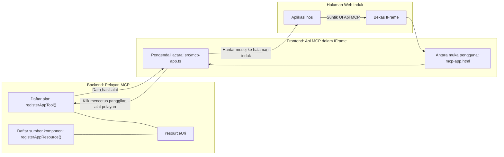
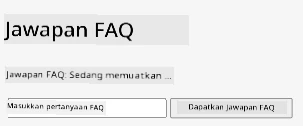
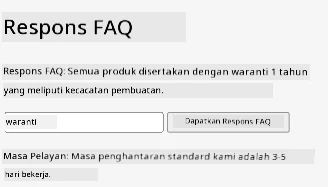
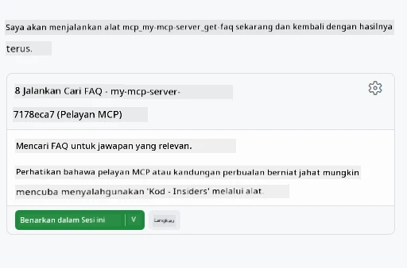

# Aplikasi MCP

Aplikasi MCP adalah paradigma baru dalam MCP. Idéanya ialah bukan sahaja anda membalas dengan data daripada panggilan alat, malah anda juga menyediakan maklumat tentang bagaimana maklumat ini harus berinteraksi. Itu bermakna hasil alat kini boleh mengandungi maklumat UI. Kenapa kita mahu begitu? Baiklah, fikirkan bagaimana anda melakukan perkara hari ini. Anda kemungkinan besar menggunakan hasil daripada Server MCP dengan meletakkan jenis frontend di hadapannya, itu kod yang anda perlu tulis dan selenggara. Kadang-kadang itu yang anda mahu, tetapi kadang-kadang ia akan menjadi hebat jika anda boleh membawa sekeping maklumat yang berdiri sendiri yang mempunyai semuanya daripada data ke antara muka pengguna.

## Gambaran Keseluruhan

Pelajaran ini menyediakan panduan praktikal tentang Aplikasi MCP, bagaimana memulakannya dan bagaimana mengintegrasikannya dalam Aplikasi Web anda yang sedia ada. Aplikasi MCP adalah tambahan yang sangat baru kepada Standard MCP.

## Objektif Pembelajaran

Menjelang akhir pelajaran ini, anda akan boleh:

- Menjelaskan apa itu Aplikasi MCP.
- Bila hendak menggunakan Aplikasi MCP.
- Membangun dan mengintegrasikan Aplikasi MCP anda sendiri.

## Aplikasi MCP - bagaimana ia berfungsi

Idéanya dengan Aplikasi MCP adalah untuk menyediakan tindak balas yang pada dasarnya adalah komponen untuk dirender. Komponen seperti itu boleh mempunyai visual dan interaktiviti, contohnya klik butang, input pengguna dan banyak lagi. Mari mula dengan sisi server dan Server MCP kami. Untuk mencipta komponen Aplikasi MCP anda perlu membuat alat dan juga sumber aplikasi. Dua bahagian ini disambungkan oleh resourceUri.

Berikut adalah contoh. Mari cuba memvisualisasikan apa yang terlibat dan bahagian apa yang melakukan apa:

```text
server.ts -- responsible for registering tools and the component as a UI component
src/
  mcp-app.ts -- wiring up event handlers
mcp-app.html -- the user interface
```

Visual ini menerangkan seni bina untuk mencipta komponen dan logiknya.


Mari cuba terangkan tanggungjawab seterusnya untuk backend dan frontend masing-masing.

### Backend

Terdapat dua perkara yang perlu kita capai di sini:

- Mendaftar alat yang kita mahu berinteraksi.
- Mendefinisikan komponen.

**Mendaftar alat**

```typescript
registerAppTool(
    server,
    "get-time",
    {
      title: "Get Time",
      description: "Returns the current server time.",
      inputSchema: {},
      _meta: { ui: { resourceUri } }, // Menghubungkan alat ini ke sumber UInya
    },
    async () => {
      const time = new Date().toISOString();
      return { content: [{ type: "text", text: time }] };
    },
  );

```

Kod sebelumnya menerangkan kelakuan, di mana ia mendedahkan alat bernama `get-time`. Ia tidak mengambil input tetapi akhirnya menghasilkan masa semasa. Kita mempunyai keupayaan untuk mendefinisikan `inputSchema` untuk alat di mana kita perlu menerima input pengguna.

**Mendaftar komponen**

Dalam fail yang sama, kita juga perlu mendaftar komponen:

```typescript
const resourceUri = "ui://get-time/mcp-app.html";

// Daftarkan sumber, yang mengembalikan HTML/JavaScript yang dibundel untuk UI.
registerAppResource(
  server,
  resourceUri,
  resourceUri,
  { mimeType: RESOURCE_MIME_TYPE },
  async () => {
    const html = await fs.readFile(path.join(DIST_DIR, "mcp-app.html"), "utf-8");

    return {
    contents: [
        { uri: resourceUri, mimeType: RESOURCE_MIME_TYPE, text: html },
    ],
    };
  },
);
```

Perhatikan bagaimana kita menyebut `resourceUri` untuk menghubungkan komponen dengan alatnya. Yang menarik juga adalah callback di mana kita memuatkan fail UI dan mengembalikan komponen.

### Frontend komponen

Sama seperti backend, ada dua bahagian di sini:

- Frontend yang ditulis dalam HTML tulen.
- Kod yang mengendalikan acara dan apa yang perlu dibuat, contohnya memanggil alat atau menghantar mesej ke tetingkap induk.

**Antara muka pengguna**

Mari lihat antara muka pengguna.

```html
<!-- mcp-app.html -->
<!DOCTYPE html>
<html lang="en">
  <head>
    <meta charset="UTF-8" />
    <title>Get Time App</title>
  </head>
  <body>
    <p>
      <strong>Server Time:</strong> <code id="server-time">Loading...</code>
    </p>
    <button id="get-time-btn">Get Server Time</button>
    <script type="module" src="/src/mcp-app.ts"></script>
  </body>
</html>
```

**Penghubung acara**

Bahagian terakhir adalah penghubung acara. Itu bermakna kita mengenal pasti bahagian dalam UI kita yang memerlukan pengendali acara dan apa yang perlu dilakukan jika acara diangkat:

```typescript
// mcp-app.ts

import { App } from "@modelcontextprotocol/ext-apps";

// Dapatkan rujukan elemen
const serverTimeEl = document.getElementById("server-time")!;
const getTimeBtn = document.getElementById("get-time-btn")!;

// Cipta contoh aplikasi
const app = new App({ name: "Get Time App", version: "1.0.0" });

// Tangani keputusan alat dari pelayan. Tetapkan sebelum `app.connect()` untuk mengelakkan
// terlepas keputusan alat awal.
app.ontoolresult = (result) => {
  const time = result.content?.find((c) => c.type === "text")?.text;
  serverTimeEl.textContent = time ?? "[ERROR]";
};

// Sambungkan klik butang
getTimeBtn.addEventListener("click", async () => {
  // `app.callServerTool()` membolehkan antara muka pengguna meminta data segar dari pelayan
  const result = await app.callServerTool({ name: "get-time", arguments: {} });
  const time = result.content?.find((c) => c.type === "text")?.text;
  serverTimeEl.textContent = time ?? "[ERROR]";
});

// Sambung ke hos
app.connect();
```

Seperti yang anda lihat di atas, ini adalah kod biasa untuk memasang elemen DOM kepada acara. Yang patut dipanggil keluar adalah panggilan ke `callServerTool` yang akhirnya memanggil alat di backend.

## Mengendalikan input pengguna

Setakat ini, kita telah melihat komponen yang mempunyai butang yang apabila diklik memanggil alat. Mari kita lihat jika kita boleh tambah lebih elemen UI seperti medan input dan lihat jika kita boleh menghantar argumen ke alat. Mari laksanakan fungsi FAQ. Berikut cara ia harus berfungsi:

- Harus ada butang dan elemen input di mana pengguna menaip kata kunci untuk mencari contohnya "Shipping". Ini harus memanggil alat di backend yang melakukan carian dalam data FAQ.
- Alat yang menyokong carian FAQ yang disebutkan.

Mari tambah sokongan yang diperlukan ke backend terlebih dahulu:

```typescript
const faq: { [key: string]: string } = {
    "shipping": "Our standard shipping time is 3-5 business days.",
    "return policy": "You can return any item within 30 days of purchase.",
    "warranty": "All products come with a 1-year warranty covering manufacturing defects.",
  }

registerAppTool(
    server,
    "get-faq",
    {
      title: "Search FAQ",
      description: "Searches the FAQ for relevant answers.",
      inputSchema: zod.object({
        query: zod.string().default("shipping"),
      }),
      _meta: { ui: { resourceUri: faqResourceUri } }, // Menghubungkan alat ini kepada sumber UI-nya
    },
    async ({ query }) => {
      const answer: string = faq[query.toLowerCase()] || "Sorry, I don't have an answer for that.";
      return { content: [{ type: "text", text: answer }] };
    },
  );
```

Apa yang kita lihat di sini adalah bagaimana kita mengisi `inputSchema` dan memberikannya skema `zod` seperti ini:

```typescript
inputSchema: zod.object({
  query: zod.string().default("shipping"),
})
```

Dalam skema di atas kita mengisytiharkan kita ada parameter input bernama `query` dan ia adalah pilihan dengan nilai lalai "shipping".

Ok, mari beralih ke *mcp-app.html* untuk melihat UI yang perlu kita cipta untuk ini:

```html
<div class="faq">
    <h1>FAQ response</h1>
    <p>FAQ Response: <code id="faq-response">Loading...</code></p>
    <input type="text" id="faq-query" placeholder="Enter FAQ query" />
    <button id="get-faq-btn">Get FAQ Response</button>
  </div>
```

Bagus, sekarang kita ada elemen input dan butang. Mari ke *mcp-app.ts* seterusnya untuk hubungkan acara-acara ini:

```typescript
const getFaqBtn = document.getElementById("get-faq-btn")!;
const faqQueryInput = document.getElementById("faq-query") as HTMLInputElement;

getFaqBtn.addEventListener("click", async () => {
  const query = faqQueryInput.value;
  const result = await app.callServerTool({ name: "get-faq", arguments: { query } });
  const faq = result.content?.find((c) => c.type === "text")?.text;
  faqResponseEl.textContent = faq ?? "[ERROR]";
});
```

Dalam kod di atas kita:

- Mencipta rujukan ke elemen UI yang menarik.
- Mengendalikan klik butang untuk menguraikan nilai elemen input dan kita juga memanggil `app.callServerTool()` dengan `name` dan `arguments` di mana yang terakhir menghantar `query` sebagai nilai.

Apa yang sebenarnya berlaku apabila anda memanggil `callServerTool` adalah ia menghantar mesej ke tetingkap induk dan tetingkap itu akhirnya memanggil Server MCP.

### Cuba ia

Mencubanya kita kini sepatutnya melihat yang berikut:



dan ini ketika kita mencuba dengan input seperti "warranty"



Untuk menjalankan kod ini, lawati [Bahagian Kod](./code/README.md)

## Ujian dalam Visual Studio Code

Visual Studio Code mempunyai sokongan hebat untuk Aplikasi MVP dan mungkin salah satu cara paling mudah untuk menguji Aplikasi MCP anda. Untuk menggunakan Visual Studio Code, tambah entri server ke *mcp.json* seperti ini:

```json
"my-mcp-server-7178eca7": {
    "url": "http://localhost:3001/mcp",
    "type": "http"
  }
```

Kemudian mula server, anda sepatutnya dapat berkomunikasi dengan Aplikasi MVP anda melalui Tetingkap Chat dengan syarat anda telah memasang GitHub Copilot.

dengan mencetuskan melalui prompt, contohnya "#get-faq":



dan sama seperti apabila anda menjalankannya melalui pelayar web, ia mempersembahkan dengan cara yang sama seperti ini:


## Tugasan

Cipta permainan gunting batu kertas. Ia harus terdiri daripada yang berikut:

UI:

- senarai juntai dengan pilihan
- butang untuk menghantar pilihan
- label yang menunjukkan siapa pilih apa dan siapa menang

Server:

- harus ada alat gunting batu kertas yang mengambil "choice" sebagai input. Ia juga harus merender pilihan komputer dan menentukan pemenang

## Penyelesaian

[Penyelesaian](./assignment/README.md)

## Rumusan

Kita telah belajar tentang paradigma baru ini iaitu Aplikasi MCP. Ia adalah paradigma baru yang membolehkan Server MCP mempunyai pendapat tentang bukan sahaja data tetapi juga bagaimana data ini harus dipersembahkan.

Selain itu, kita belajar bahawa Aplikasi MCP ini dihoskan dalam IFrame dan untuk berkomunikasi dengan Server MCP, mereka perlu menghantar mesej ke aplikasi web induk. Terdapat beberapa perpustakaan untuk JavaScript biasa dan React dan lebih banyak lagi yang memudahkan komunikasi ini.

## Pengajaran Penting

Berikut apa yang anda pelajari:

- Aplikasi MCP adalah standard baru yang berguna apabila anda mahu menghantar kedua-dua data dan ciri UI.
- Jenis aplikasi ini dijalankan dalam IFrame atas sebab keselamatan.

## Apa Seterusnya

- [Bab 4](../../04-PracticalImplementation/README.md)

---

<!-- CO-OP TRANSLATOR DISCLAIMER START -->
**Penafian**:  
Dokumen ini telah diterjemahkan menggunakan perkhidmatan terjemahan AI [Co-op Translator](https://github.com/Azure/co-op-translator). Walaupun kami berusaha untuk ketepatan, sila maklum bahawa terjemahan automatik mungkin mengandungi kesilapan atau ketidaktepatan. Dokumen asal dalam bahasa asalnya hendaklah dianggap sebagai sumber rujukan yang sahih. Untuk maklumat penting, terjemahan profesional oleh manusia adalah disyorkan. Kami tidak bertanggungjawab terhadap sebarang salah faham atau salah tafsir yang timbul daripada penggunaan terjemahan ini.
<!-- CO-OP TRANSLATOR DISCLAIMER END -->