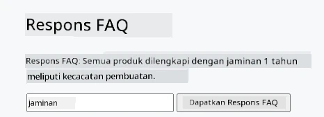
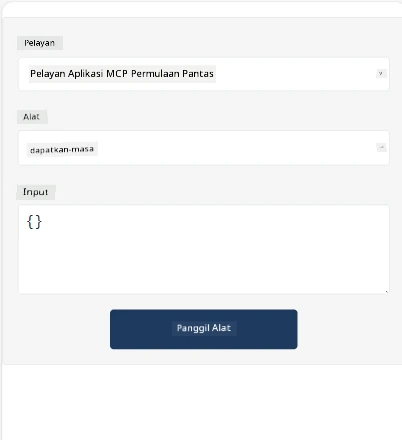
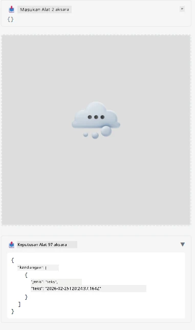

Here's a sample demonstrating MCP App

## Pasang

1. Navigasi ke folder *mcp-app*  
1. Jalankan `npm install`, ini akan memasang kebergantungan frontend dan backend

Sahkan backend boleh disusun dengan menjalankan:

```sh
npx tsc --noEmit
```
  
Tidak akan ada keluaran jika semuanya berjalan lancar.

## Jalankan backend

> Ini memerlukan sedikit kerja tambahan jika anda menggunakan mesin Windows kerana penyelesaian MCP Apps menggunakan perpustakaan `concurrently` untuk menjalankan yang anda perlu cari penggantinya. Berikut adalah baris yang bermasalah dalam *package.json* pada MCP App:

    ```json
    "start": "concurrently \"cross-env NODE_ENV=development INPUT=mcp-app.html vite build --watch\" \"tsx watch main.ts\""
    ```

Aplikasi ini mempunyai dua bahagian, satu bahagian backend dan satu bahagian host.

Mulakan backend dengan memanggil:

```sh
npm start
```
  
Ini akan memulakan backend pada `http://localhost:3001/mcp`. 

> Nota, jika anda menggunakan Codespace, anda mungkin perlu menetapkan keterlihatan port kepada awam. Semak anda boleh capai titik akhir dalam pelayar melalui https://<nama Codespace>.app.github.dev/mcp

## Pilihan -1 Uji aplikasi dalam Visual Studio Code

Untuk menguji penyelesaian dalam Visual Studio Code, lakukan perkara berikut:

- Tambah entri pelayan ke `mcp.json` seperti berikut:

    ```json
    {
        "servers": {
            "my-mcp-server-7178eca7": {
                "url": "http://localhost:3001/mcp",
                "type": "http"
            }
        },
        "inputs": []
    }
    ```
  
1. Klik butang "start" dalam *mcp.json*  
1. Pastikan tetingkap chat terbuka dan taip `get-faq`, anda akan melihat keputusan seperti berikut:

    

## Pilihan -2- Uji aplikasi dengan host

Repo <https://github.com/modelcontextprotocol/ext-apps> mengandungi beberapa host berbeza yang boleh anda gunakan untuk menguji MVP Apps anda.

Kami akan memberikan anda dua pilihan di sini:

### Mesin tempatan

- Navigasi ke *ext-apps* selepas anda menyalin repo tersebut.

- Pasang kebergantungan

   ```sh
   npm install
   ```
  
- Dalam tetingkap terminal berasingan, navigasi ke *ext-apps/examples/basic-host*

    > jika anda menggunakan Codespace, anda perlu pergi ke serve.ts pada baris 27 dan gantikan http://localhost:3001/mcp dengan URL Codespace anda untuk backend, contohnya https://psychic-xylophone-657rpjgvxpc5g64-3001.app.github.dev/mcp

- Jalankan host:

    ```sh
    npm start
    ```
  
    Ini akan menghubungkan host dengan backend dan anda harus melihat aplikasi berjalan seperti berikut:

    

### Codespace

Ia memerlukan sedikit usaha tambahan untuk mendapatkan persekitaran Codespace berfungsi. Untuk menggunakan host melalui Codespace:

- Lihat direktori *ext-apps* dan navigasi ke *examples/basic-host*.  
- Jalankan `npm install` untuk memasang kebergantungan  
- Jalankan `npm start` untuk memulakan host.

## Uji aplikasi

Cuba aplikasi dengan cara berikut:

- Pilih butang "Call Tool" dan anda harus melihat keputusan seperti berikut:

    

Bagus, semuanya berjalan dengan baik.

---

<!-- CO-OP TRANSLATOR DISCLAIMER START -->
**Penafian**:  
Dokumen ini telah diterjemahkan menggunakan perkhidmatan terjemahan AI [Co-op Translator](https://github.com/Azure/co-op-translator). Walaupun kami berusaha untuk ketepatan, sila ambil perhatian bahawa terjemahan automatik mungkin mengandungi kesilapan atau ketidaktepatan. Dokumen asal dalam bahasa asalnya harus dianggap sebagai sumber yang sahih. Untuk maklumat kritikal, penerjemahan profesional oleh manusia adalah disyorkan. Kami tidak bertanggungjawab atas sebarang salah faham atau salah tafsir yang timbul daripada penggunaan terjemahan ini.
<!-- CO-OP TRANSLATOR DISCLAIMER END -->