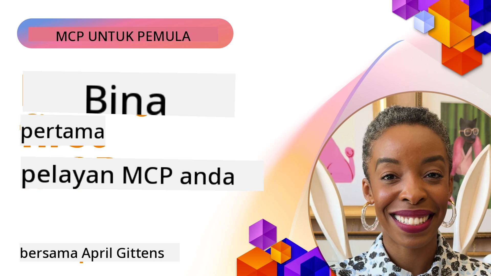

## Memulakan  

_(Klik gambar di atas untuk menonton video pelajaran ini)_

Bahagian ini terdiri daripada beberapa pelajaran:

- **1 Pelayan pertama anda**, dalam pelajaran pertama ini, anda akan belajar cara mencipta pelayan pertama anda dan memeriksanya dengan alat pemeriksa, cara yang berharga untuk menguji dan menyahpepijat pelayan anda, [ke pelajaran](01-first-server/README.md)

- **2 Klien**, dalam pelajaran ini, anda akan belajar cara menulis klien yang boleh menyambung ke pelayan anda, [ke pelajaran](02-client/README.md)

- **3 Klien dengan LLM**, cara yang lebih baik menulis klien adalah dengan menambah LLM kepadanya supaya ia boleh "berunding" dengan pelayan anda tentang apa yang perlu dilakukan, [ke pelajaran](03-llm-client/README.md)

- **4 Menggunakan mod Ejen GitHub Copilot untuk pelayan dalam Visual Studio Code**. Di sini, kita melihat cara menjalankan Pelayan MCP kita dari dalam Visual Studio Code, [ke pelajaran](04-vscode/README.md)

- **5 Pelayan Pengangkutan stdio** pengangkutan stdio ialah standard yang disyorkan untuk komunikasi pelayan-ke-klien MCP tempatan, menyediakan komunikasi berasaskan subproses yang selamat dengan pengasingan proses terbina dalam [ke pelajaran](05-stdio-server/README.md)

- **6 Penstriman HTTP dengan MCP (HTTP Boleh Dialirkan)**. Ketahui tentang pengangkutan penstriman HTTP moden (kaedah yang disyorkan untuk pelayan MCP jauh mengikut [Spesifikasi MCP 2025-11-25](https://spec.modelcontextprotocol.io/specification/2025-11-25/basic/transports/#streamable-http)), pemberitahuan kemajuan, dan cara melaksanakan pelayan dan klien MCP masa nyata dan skalabel menggunakan HTTP Boleh Dialirkan. [ke pelajaran](06-http-streaming/README.md)

- **7 Menggunakan Alat AI untuk VSCode** untuk menggunakan dan menguji Klien dan Pelayan MCP anda [ke pelajaran](07-aitk/README.md)

- **8 Pengujian**. Di sini kita akan memberi tumpuan khas bagaimana kita boleh menguji pelayan dan klien kita dalam pelbagai cara, [ke pelajaran](08-testing/README.md)

- **9 Penyebaran**. Bab ini akan melihat cara berbeza untuk menyebarkan penyelesaian MCP anda, [ke pelajaran](09-deployment/README.md)

- **10 Penggunaan pelayan lanjutan**. Bab ini membincangkan penggunaan pelayan lanjutan, [ke pelajaran](./10-advanced/README.md)

- **11 Pengesahan**. Bab ini membincangkan cara menambah pengesahan mudah, dari Pengesahan Asas hingga menggunakan JWT dan RBAC. Anda digalakkan bermula di sini dan kemudian lihat Topik Lanjutan dalam Bab 5 serta lakukan pengukuhan keselamatan tambahan melalui cadangan dalam Bab 2, [ke pelajaran](./11-simple-auth/README.md)

- **12 Hos MCP**. Konfigurasikan dan gunakan klien hos MCP popular termasuk Claude Desktop, Cursor, Cline, dan Windsurf. Pelajari jenis pengangkutan dan penyelesaian masalah, [ke pelajaran](./12-mcp-hosts/README.md)

- **13 Pemeriksa MCP**. Nyahpepijat dan uji pelayan MCP anda secara interaktif menggunakan alat Pemeriksa MCP. Pelajari alat penyelesaian masalah, sumber, dan mesej protokol, [ke pelajaran](./13-mcp-inspector/README.md)

- **14 Pengambilan Sampel**. Cipta Pelayan MCP yang bekerjasama dengan klien MCP pada tugasan berkaitan LLM. [ke pelajaran](./14-sampling/README.md)

- **15 Aplikasi MCP**. Bina Pelayan MCP yang juga membalas dengan arahan UI, [ke pelajaran](./15-mcp-apps/README.md)

Protokol Konteks Model (MCP) ialah protokol terbuka yang menstandarkan cara aplikasi menyediakan konteks kepada LLM. Fikirkan MCP seperti port USB-C untuk aplikasi AI - ia menyediakan cara standard untuk menyambungkan model AI ke sumber data dan alat yang berbeza.

## Objektif Pembelajaran

Menjelang akhir pelajaran ini, anda akan dapat:

- Menyediakan persekitaran pembangunan untuk MCP dalam C#, Java, Python, TypeScript, dan JavaScript
- Membina dan menyebarkan pelayan MCP asas dengan ciri tersuai (sumber, arahan, dan alat)
- Mewujudkan aplikasi hos yang disambungkan ke pelayan MCP
- Menguji dan menyahpepijat pelaksanaan MCP
- Memahami cabaran penyediaan biasa dan penyelesaiannya
- Menyambungkan pelaksanaan MCP anda ke perkhidmatan LLM popular

## Menyediakan Persekitaran MCP Anda

Sebelum anda mula bekerja dengan MCP, adalah penting untuk menyediakan persekitaran pembangunan anda dan memahami aliran kerja asas. Bahagian ini akan membimbing anda melalui langkah-langkah penyediaan awal untuk memastikan permulaan lancar dengan MCP.

### Prasyarat

Sebelum memulakan pembangunan MCP, pastikan anda mempunyai:

- **Persekitaran Pembangunan**: Untuk bahasa pilihan anda (C#, Java, Python, TypeScript, atau JavaScript)
- **IDE/Penyunting**: Visual Studio, Visual Studio Code, IntelliJ, Eclipse, PyCharm, atau mana-mana penyunting kod moden
- **Pengurus Pakej**: NuGet, Maven/Gradle, pip, atau npm/yarn
- **Kunci API**: Untuk mana-mana perkhidmatan AI yang anda rancangkan untuk digunakan dalam aplikasi hos anda

### SDK Rasmi

Dalam bab-bab yang akan datang anda akan melihat penyelesaian dibina menggunakan Python, TypeScript, Java dan .NET. Berikut adalah semua SDK yang disokong secara rasmi.

MCP menyediakan SDK rasmi untuk pelbagai bahasa (selari dengan [Spesifikasi MCP 2025-11-25](https://spec.modelcontextprotocol.io/specification/2025-11-25/)):
- [SDK C#](https://github.com/modelcontextprotocol/csharp-sdk) - Dipelihara bersama oleh Microsoft
- [SDK Java](https://github.com/modelcontextprotocol/java-sdk) - Dipelihara bersama oleh Spring AI
- [SDK TypeScript](https://github.com/modelcontextprotocol/typescript-sdk) - Pelaksanaan rasmi TypeScript
- [SDK Python](https://github.com/modelcontextprotocol/python-sdk) - Pelaksanaan rasmi Python (FastMCP)
- [SDK Kotlin](https://github.com/modelcontextprotocol/kotlin-sdk) - Pelaksanaan rasmi Kotlin
- [SDK Swift](https://github.com/modelcontextprotocol/swift-sdk) - Dipelihara bersama oleh Loopwork AI
- [SDK Rust](https://github.com/modelcontextprotocol/rust-sdk) - Pelaksanaan rasmi Rust
- [SDK Go](https://github.com/modelcontextprotocol/go-sdk) - Pelaksanaan rasmi Go

## Pekeliling Penting

- Menyediakan persekitaran pembangunan MCP adalah mudah dengan SDK khusus bahasa
- Membina pelayan MCP melibatkan penciptaan dan pendaftaran alat dengan skema yang jelas
- Klien MCP menyambung ke pelayan dan model untuk memanfaatkan keupayaan tambahan
- Pengujian dan penyahpepijatan penting untuk pelaksanaan MCP yang boleh dipercayai
- Pilihan penyebaran merangkumi pembangunan tempatan hingga penyelesaian berasaskan awan

## Amalan

Kami mempunyai satu set contoh yang melengkapkan latihan yang akan anda lihat dalam semua bab dalam bahagian ini. Tambahan pula setiap bab juga mempunyai latihan dan tugasan sendiri

- [Kalkulator Java](./samples/java/calculator/README.md)
- [Kalkulator .Net](../../../03-GettingStarted/samples/csharp)
- [Kalkulator JavaScript](./samples/javascript/README.md)
- [Kalkulator TypeScript](./samples/typescript/README.md)
- [Kalkulator Python](../../../03-GettingStarted/samples/python)

## Sumber Tambahan

- [Membina Ejen menggunakan Model Context Protocol di Azure](https://learn.microsoft.com/azure/developer/ai/intro-agents-mcp)
- [MCP Jauh dengan Azure Container Apps (Node.js/TypeScript/JavaScript)](https://learn.microsoft.com/samples/azure-samples/mcp-container-ts/mcp-container-ts/)
- [Ejen MCP OpenAI .NET](https://learn.microsoft.com/samples/azure-samples/openai-mcp-agent-dotnet/openai-mcp-agent-dotnet/)

## Apa yang seterusnya

Mula dengan pelajaran pertama: [Mencipta Pelayan MCP Pertama Anda](01-first-server/README.md)

Setelah anda lengkapkan modul ini, teruskan ke: [Modul 4: Pelaksanaan Praktikal](../04-PracticalImplementation/README.md)

---

<!-- CO-OP TRANSLATOR DISCLAIMER START -->
**Penafian**:  
Dokumen ini telah diterjemahkan menggunakan perkhidmatan terjemahan AI [Co-op Translator](https://github.com/Azure/co-op-translator). Walaupun kami berusaha untuk ketepatan, harap maklum bahawa terjemahan automatik mungkin mengandungi kesilapan atau ketidaktepatan. Dokumen asal dalam bahasa asalnya hendaklah dianggap sebagai sumber yang sahih. Untuk maklumat penting, terjemahan profesional oleh manusia adalah disyorkan. Kami tidak bertanggungjawab atas sebarang salah faham atau salah tafsir yang timbul daripada penggunaan terjemahan ini.
<!-- CO-OP TRANSLATOR DISCLAIMER END -->