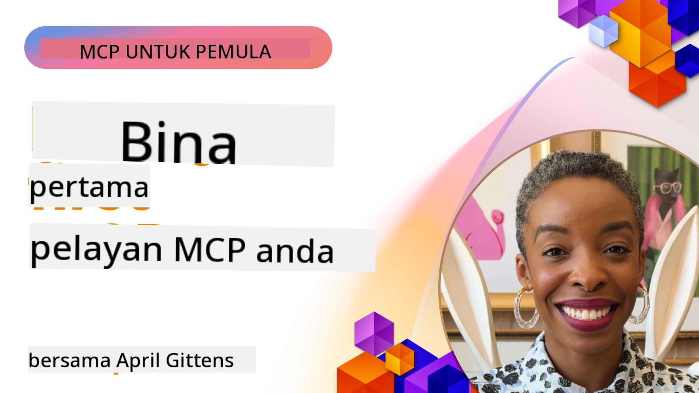

## Bermula  

_(Klik imej di atas untuk menonton video pelajaran ini)_

Bahagian ini terdiri daripada beberapa pelajaran:

- **1 Pelayan pertama anda**, dalam pelajaran pertama ini, anda akan belajar bagaimana untuk membuat pelayan pertama anda dan memeriksanya dengan alat pemeriksa, cara yang berguna untuk menguji dan membaiki pelayan anda, [ke pelajaran](01-first-server/README.md)

- **2 Klien**, dalam pelajaran ini, anda akan belajar cara menulis klien yang boleh berhubung dengan pelayan anda, [ke pelajaran](02-client/README.md)

- **3 Klien dengan LLM**, cara yang lebih baik untuk menulis klien adalah dengan menambah LLM supaya ia boleh "berunding" dengan pelayan anda tentang apa yang perlu dilakukan, [ke pelajaran](03-llm-client/README.md)

- **4 Menggunakan Mod Agen GitHub Copilot Pelayan**. Di sini, kita melihat cara menjalankan Pelayan MCP kita dari dalam Visual Studio Code, [ke pelajaran](04-vscode/README.md)

- **5 Pelayan Pengangkutan stdio** pengangkutan stdio adalah standard yang disyorkan untuk komunikasi pelayan-ke-klien MCP tempatan, menyediakan komunikasi subprocess yang selamat dengan isolasi proses terbina dalam [ke pelajaran](05-stdio-server/README.md)

- **6 Penstriman HTTP dengan MCP (HTTP Boleh Strim)**. Pelajari mengenai
	pengangkutan jauh standard dalam [Spesifikasi MCP 2026-07-28](https://modelcontextprotocol.io/specification/2026-07-28/basic/transports/streamable-http),
	dan juga pelaksanaan sesi berasaskan legasi yang dikekalkan dalam pelajaran.
	[ke pelajaran](06-http-streaming/README.md)

- **7 Menggunakan Toolkit AI untuk VSCode** untuk menggunakan dan menguji Klien dan Pelayan MCP anda [ke pelajaran](07-aitk/README.md)

- **8 Pengujian**. Di sini kita akan memberi tumpuan khusus bagaimana kita boleh menguji pelayan dan klien kita dengan pelbagai cara, [ke pelajaran](08-testing/README.md)

- **9 Penempatan**. Bab ini akan melihat cara-cara berbeza untuk menempatkan penyelesaian MCP anda, [ke pelajaran](09-deployment/README.md)

- **10 Penggunaan pelayan lanjutan**. Bab ini merangkumi penggunaan pelayan lanjutan, [ke pelajaran](./10-advanced/README.md)

- **11 Autentikasi**. Bab ini merangkumi cara menambah autentikasi mudah, dari Basic Auth ke penggunaan JWT dan RBAC. Anda digalakkan untuk mula di sini dan kemudian melihat Topik Lanjutan dalam Bab 5 serta melakukan pengukuhan keselamatan tambahan melalui cadangan dalam Bab 2, [ke pelajaran](./11-simple-auth/README.md)

- **12 Hos MCP**. Konfigurasikan dan gunakan klien hos MCP popular termasuk Claude Desktop, Cursor, Cline, dan Windsurf. Pelajari jenis pengangkutan dan penyelesaian masalah, [ke pelajaran](./12-mcp-hosts/README.md)

- **13 Pemeriksa MCP**. Baiki dan uji pelayan MCP anda secara interaktif menggunakan alat Pemeriksa MCP. Pelajari cara menyelesaikan masalah alat, sumber, dan mesej protokol, [ke pelajaran](./13-mcp-inspector/README.md)

- **14 Pengambilan Sampel**. Pelajari primitif Pengambilan Sampel legasi untuk `2025-11-25` dan
	cara migrasi reka bentuk baru ke integrasi pembekal LLM secara langsung. Pengambilan Sampel
	danar adalah terhenti dalam MCP `2026-07-28`. [ke pelajaran](./14-sampling/README.md)

- **15 Aplikasi MCP**. Bangunkan Pelayan MCP yang juga memberi balasan dengan arahan UI, [ke pelajaran](./15-mcp-apps/README.md)

Protokol Konteks Model (MCP) adalah protokol terbuka yang menstandardkan bagaimana aplikasi menyediakan konteks kepada LLM. Fikirkan MCP seperti port USB-C untuk aplikasi AI - ia menyediakan cara standard untuk menyambungkan model AI ke pelbagai sumber data dan alat.

## Objektif Pembelajaran

Menjelang akhir pelajaran ini, anda akan dapat:

- Sediakan persekitaran pembangunan untuk MCP dalam C#, Java, Python, TypeScript, dan JavaScript
- Bina dan lancarkan pelayan MCP asas dengan ciri tersuai (sumber, galakan, dan alat)
- Cipta aplikasi hos yang menyambung ke pelayan MCP
- Uji dan baiki pelaksanaan MCP
- Fahami cabaran penyediaan biasa dan penyelesaiannya
- Sambungkan pelaksanaan MCP anda ke perkhidmatan LLM popular

## Menyediakan Persekitaran MCP Anda

Sebelum anda mula bekerja dengan MCP, penting untuk mempersiapkan persekitaran pembangunan anda dan memahami aliran kerja asas. Bahagian ini akan membimbing anda melalui langkah penyediaan awal untuk memastikan permulaan yang lancar dengan MCP.

### Prasyarat

Sebelum terjun ke pembangunan MCP, pastikan anda mempunyai:

- **Persekitaran Pembangunan**: Untuk bahasa pilihan anda (C#, Java, Python, TypeScript, atau JavaScript)
- **IDE/Penyunting**: Visual Studio, Visual Studio Code, IntelliJ, Eclipse, PyCharm, atau mana-mana penyunting kod moden
- **Pengurus Pakej**: NuGet, Maven/Gradle, pip, atau npm/yarn
- **Kunci API**: Untuk mana-mana perkhidmatan AI yang anda rancangkan untuk digunakan dalam aplikasi hos anda

### SDK Rasmi

Dalam bab-bab yang akan datang anda akan melihat penyelesaian dibina menggunakan Python, TypeScript,
Java dan .NET. Berikut adalah SDK rasmi.

Sokongan SDK untuk MCP `2026-07-28` diperkenalkan secara berasingan mengikut bahasa.
Sebelum menjalankan contoh, semak versi pakejnya dan nota keluaran SDK
untuk semakan protokol yang disokong. Lihat
[senarai SDK rasmi](https://modelcontextprotocol.io/docs/sdk):
- [SDK C#](https://github.com/modelcontextprotocol/csharp-sdk) - Diselenggara bersama Microsoft
- [SDK Java](https://github.com/modelcontextprotocol/java-sdk) - Diselenggara bersama Spring AI
- [SDK TypeScript](https://github.com/modelcontextprotocol/typescript-sdk) - Pelaksanaan rasmi TypeScript
- [SDK Python](https://github.com/modelcontextprotocol/python-sdk) - Pelaksanaan rasmi Python (FastMCP)
- [SDK Kotlin](https://github.com/modelcontextprotocol/kotlin-sdk) - Pelaksanaan rasmi Kotlin
- [SDK Swift](https://github.com/modelcontextprotocol/swift-sdk) - Diselenggara bersama Loopwork AI
- [SDK Rust](https://github.com/modelcontextprotocol/rust-sdk) - Pelaksanaan rasmi Rust
- [SDK Go](https://github.com/modelcontextprotocol/go-sdk) - Pelaksanaan rasmi Go

## Perkara Penting

- Menyediakan persekitaran pembangunan MCP adalah mudah dengan SDK khusus bahasa
- Membina pelayan MCP melibatkan mencipta dan mendaftar alat dengan skema yang jelas
- Klien MCP menyambung kepada pelayan dan model untuk menggunakan keupayaan dipertingkatkan
- Ujian dan pembaikan adalah penting untuk pelaksanaan MCP yang boleh dipercayai
- Pilihan penempatan merangkumi daripada pembangunan tempatan ke penyelesaian berasaskan awan

## Mencuba Amalan

Kami mempunyai satu set contoh yang melengkapi latihan yang akan anda lihat dalam semua bab di bahagian ini. Selain itu, setiap bab juga mempunyai latihan dan tugasan mereka sendiri

- [Pengira Java](./samples/java/calculator/README.md)
- [Pengira .NET](../../../03-GettingStarted/samples/csharp)
- [Pengira JavaScript](./samples/javascript/README.md)
- [Pengira TypeScript](./samples/typescript/README.md)
- [Pengira Python](../../../03-GettingStarted/samples/python)

## Sumber Tambahan

- [Membina Ejen menggunakan Model Context Protocol di Azure](https://learn.microsoft.com/azure/developer/ai/intro-agents-mcp)
- [MCP Jauh dengan Azure Container Apps (Node.js/TypeScript/JavaScript)](https://learn.microsoft.com/samples/azure-samples/mcp-container-ts/mcp-container-ts/)
- [Ejen MCP OpenAI .NET](https://learn.microsoft.com/samples/azure-samples/openai-mcp-agent-dotnet/openai-mcp-agent-dotnet/)

## Apa seterusnya

Mulakan dengan pelajaran pertama: [Mewujudkan Pelayan MCP pertama anda](01-first-server/README.md)

Setelah anda selesai modul ini, teruskan ke: [Modul 4: Pelaksanaan Praktikal](../04-PracticalImplementation/README.md)

---

<!-- CO-OP TRANSLATOR DISCLAIMER START -->
**Penafian**:
Dokumen ini telah diterjemahkan menggunakan perkhidmatan terjemahan AI [Co-op Translator](https://github.com/Azure/co-op-translator). Walaupun kami berusaha untuk ketepatan, sila ambil maklum bahawa terjemahan automatik mungkin mengandungi kesilapan atau ketidaktepatan. Dokumen asal dalam bahasa asalnya harus dianggap sebagai sumber yang sahih. Untuk maklumat penting, terjemahan oleh manusia profesional adalah disyorkan. Kami tidak bertanggungjawab terhadap sebarang salah faham atau salah tafsir yang timbul daripada penggunaan terjemahan ini.
<!-- CO-OP TRANSLATOR DISCLAIMER END -->