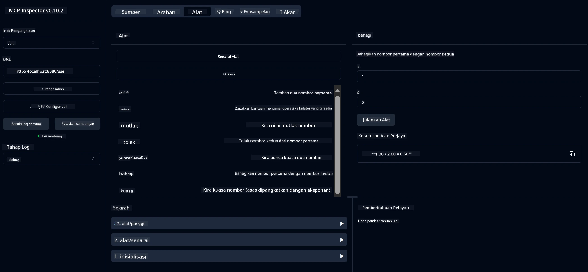

# Perkhidmatan Kalkulator Asas MCP

> [!NOTE]
> Contoh ini menggunakan pengangkutan HTTP+SSE warisan dan menyasarkan SDK yang serasi
> dengan MCP `2025-11-25`. Pelayan jauh baru harus menggunakan sokongan HTTP 
> Streamable `2026-07-28`.

Perkhidmatan ini menyediakan operasi kalkulator asas melalui Protokol Konteks Model (MCP) menggunakan Spring Boot dengan pengangkutan WebFlux. Ia direka sebagai contoh ringkas untuk pemula yang mempelajari pelaksanaan MCP.

Untuk maklumat lanjut, lihat dokumentasi rujukan [MCP Server Boot Starter](https://docs.spring.io/spring-ai/reference/api/mcp/mcp-server-boot-starter-docs.html).

## Gambaran Keseluruhan

Perkhidmatan ini mempamerkan:
- Sokongan untuk SSE (Server-Sent Events)
- Pendaftaran alat automatik menggunakan anotasi `@Tool` Spring AI
- Fungsi kalkulator asas:
  - Penambahan, penolakan, pendaraban, pembahagian
  - Pengiraan kuasa dan punca kuasa dua
  - Modulus (baki) dan nilai mutlak
  - Fungsi bantuan untuk penerangan operasi

## Ciri-ciri

Perkhidmatan kalkulator ini menawarkan keupayaan berikut:

1. **Operasi Aritmetik Asas**:
   - Penambahan dua nombor
   - Penolakan satu nombor daripada nombor lain
   - Pendaraban dua nombor
   - Pembahagian satu nombor dengan nombor lain (dengan pemeriksaan pembahagian sifar)

2. **Operasi Lanjutan**:
   - Pengiraan kuasa (menaikkan asas kepada kuasa)
   - Pengiraan punca kuasa dua (dengan pemeriksaan nombor negatif)
   - Pengiraan modulus (baki)
   - Pengiraan nilai mutlak

3. **Sistem Bantuan**:
   - Fungsi bantuan terbina dalam yang menerangkan semua operasi yang tersedia

## Menggunakan Perkhidmatan

Perkhidmatan ini mendedahkan titik akhir API berikut melalui protokol MCP:

- `add(a, b)`: Menambah dua nombor bersama
- `subtract(a, b)`: Menolak nombor kedua daripada nombor pertama
- `multiply(a, b)`: Mendarab dua nombor
- `divide(a, b)`: Membahagi nombor pertama dengan nombor kedua (dengan pemeriksaan sifar)
- `power(base, exponent)`: Mengira kuasa sesuatu nombor
- `squareRoot(number)`: Mengira punca kuasa dua (dengan pemeriksaan nombor negatif)
- `modulus(a, b)`: Mengira baki pembahagian
- `absolute(number)`: Mengira nilai mutlak
- `help()`: Mendapatkan maklumat tentang operasi yang tersedia

## Klien Ujian

Klien ujian mudah disertakan dalam pakej `com.microsoft.mcp.sample.client`. Kelas `SampleCalculatorClient` menunjukkan operasi yang tersedia dalam perkhidmatan kalkulator.

## Menggunakan Klien LangChain4j

Projek ini termasuk klien contoh LangChain4j dalam `com.microsoft.mcp.sample.client.LangChain4jClient` yang menunjukkan cara mengintegrasikan perkhidmatan kalkulator dengan LangChain4j dan model GitHub:

### Prasyarat

1. **Persediaan Token GitHub**:
   
   Untuk menggunakan model AI GitHub (seperti phi-4), anda memerlukan token capaian peribadi GitHub:

   a. Pergi ke tetapan akaun GitHub anda: https://github.com/settings/tokens
   
   b. Klik "Generate new token" → "Generate new token (classic)"
   
   c. Berikan token anda nama yang menerangkan
   
   d. Pilih skop berikut:
      - `repo` (Kawalan penuh ke atas repositori peribadi)
      - `read:org` (Baca keahlian organisasi dan pasukan, baca projek organisasi)
      - `gist` (Cipta gists)
      - `user:email` (Akses alamat e-mel pengguna (hanya baca))
   
   e. Klik "Generate token" dan salin token baru anda
   
   f. Tetapkan sebagai pemboleh ubah persekitaran:
      
      Pada Windows:
      ```
      set GITHUB_TOKEN=your-github-token
      ```
      
      Pada macOS/Linux:
      ```bash
      export GITHUB_TOKEN=your-github-token
      ```

   g. Untuk persediaan berterusan, tambahkan ke pemboleh ubah persekitaran anda melalui tetapan sistem

2. Tambahkan kebergantungan LangChain4j GitHub ke projek anda (sudah termasuk dalam pom.xml):
   ```xml
   <dependency>
       <groupId>dev.langchain4j</groupId>
       <artifactId>langchain4j-github</artifactId>
       <version>${langchain4j.version}</version>
   </dependency>
   ```

3. Pastikan pelayan kalkulator berjalan pada `localhost:8080`

### Menjalankan Klien LangChain4j

Contoh ini menunjukkan:
- Menyambung ke pelayan MCP kalkulator melalui pengangkutan SSE
- Menggunakan LangChain4j untuk mencipta chatbot yang memanfaatkan operasi kalkulator
- Mengintegrasikan dengan model AI GitHub (sekarang menggunakan model phi-4)

Klien menghantar pertanyaan contoh berikut untuk menunjukkan fungsi:
1. Mengira jumlah dua nombor
2. Mencari punca kuasa dua sesuatu nombor
3. Mendapatkan maklumat bantuan tentang operasi kalkulator yang tersedia

Jalankan contoh dan periksa keluaran konsol untuk melihat bagaimana model AI menggunakan alat kalkulator untuk menjawab pertanyaan.

### Konfigurasi Model GitHub

Klien LangChain4j dikonfigurasikan untuk menggunakan model phi-4 GitHub dengan tetapan berikut:

```java
ChatLanguageModel model = GitHubChatModel.builder()
    .apiKey(System.getenv("GITHUB_TOKEN"))
    .timeout(Duration.ofSeconds(60))
    .modelName("phi-4")
    .logRequests(true)
    .logResponses(true)
    .build();
```

Untuk menggunakan model GitHub yang berbeza, cuma tukar parameter `modelName` ke model lain yang disokong (contoh: "claude-3-haiku-20240307", "llama-3-70b-8192", dan sebagainya).

## Kebergantungan

Projek ini memerlukan kebergantungan utama berikut:

```xml
<!-- For MCP Server -->
<dependency>
    <groupId>org.springframework.ai</groupId>
    <artifactId>spring-ai-starter-mcp-server-webflux</artifactId>
</dependency>

<!-- For LangChain4j integration -->
<dependency>
    <groupId>dev.langchain4j</groupId>
    <artifactId>langchain4j-mcp</artifactId>
    <version>${langchain4j.version}</version>
</dependency>

<!-- For GitHub models support -->
<dependency>
    <groupId>dev.langchain4j</groupId>
    <artifactId>langchain4j-github</artifactId>
    <version>${langchain4j.version}</version>
</dependency>
```

## Membina Projek

Bina projek menggunakan Maven:
```bash
./mvnw clean install -DskipTests
```

## Menjalankan Pelayan

### Menggunakan Java

```bash
java -jar target/calculator-server-0.0.1-SNAPSHOT.jar
```

### Menggunakan Pemeriksa MCP

Pemeriksa MCP adalah alat berguna untuk berinteraksi dengan perkhidmatan MCP. Untuk menggunakannya dengan perkhidmatan kalkulator ini:

1. **Pasang dan jalankan Pemeriksa MCP** dalam tetingkap terminal baru:
   ```bash
   npx @modelcontextprotocol/inspector
   ```

2. **Akses UI web** dengan mengklik URL yang dipaparkan oleh aplikasi (biasanya http://localhost:6274)

3. **Konfigurasikan sambungan**:
   - Tetapkan jenis pengangkutan kepada "SSE"
   - Tetapkan URL ke titik akhir SSE pelayan yang sedang berjalan anda: `http://localhost:8080/sse`
   - Klik "Sambung"

4. **Gunakan alat tersebut**:
   - Klik "Senarai Alat" untuk melihat operasi kalkulator yang tersedia
   - Pilih alat dan klik "Jalankan Alat" untuk melaksanakan operasi



### Menggunakan Docker

Projek ini menyertakan Dockerfile untuk penyebaran berasaskan kontena:

1. **Bina imej Docker**:
   ```bash
   docker build -t calculator-mcp-service .
   ```

2. **Jalankan kontena Docker**:
   ```bash
   docker run -p 8080:8080 calculator-mcp-service
   ```

Ini akan:
- Membangun imej Docker pelbagai peringkat dengan Maven 3.9.9 dan Eclipse Temurin 24 JDK
- Mewujudkan imej kontena yang dioptimumkan
- Membuka perkhidmatan pada port 8080
- Memulakan perkhidmatan kalkulator MCP di dalam kontena

Anda boleh mengakses perkhidmatan di `http://localhost:8080` setelah kontena berjalan.

## Penyelesaian Masalah

### Isu Umum Berkaitan Token GitHub

1. **Isu Kebenaran Token**: Jika anda mendapat ralat 403 Forbidden, periksa bahawa token anda mempunyai kebenaran yang betul seperti yang diterangkan dalam prasyarat.

2. **Token Tidak Dijumpai**: Jika anda mendapat ralat "No API key found", pastikan pemboleh ubah persekitaran GITHUB_TOKEN telah ditetapkan dengan betul.

3. **Had Kadar**: API GitHub mempunyai had kadar. Jika anda mengalami ralat had kadar (kod status 429), tunggu beberapa minit sebelum mencuba lagi.

4. **Tempoh Token Tamat**: Token GitHub boleh tamat tempoh. Jika anda menerima ralat pengesahan selepas beberapa ketika, jana token baru dan kemaskini pemboleh ubah persekitaran anda.

Jika anda memerlukan bantuan lanjut, semak [dokumentasi LangChain4j](https://github.com/langchain4j/langchain4j) atau [dokumentasi API GitHub](https://docs.github.com/en/rest).

---

<!-- CO-OP TRANSLATOR DISCLAIMER START -->
**Penafian**:
Dokumen ini telah diterjemahkan menggunakan perkhidmatan terjemahan AI [Co-op Translator](https://github.com/Azure/co-op-translator). Walaupun kami berusaha untuk ketepatan, sila ambil maklum bahawa terjemahan automatik mungkin mengandungi kesilapan atau ketidaktepatan. Dokumen asal dalam bahasa asalnya harus dianggap sebagai sumber yang sahih. Untuk maklumat penting, terjemahan oleh manusia profesional adalah disyorkan. Kami tidak bertanggungjawab terhadap sebarang salah faham atau salah tafsir yang timbul daripada penggunaan terjemahan ini.
<!-- CO-OP TRANSLATOR DISCLAIMER END -->