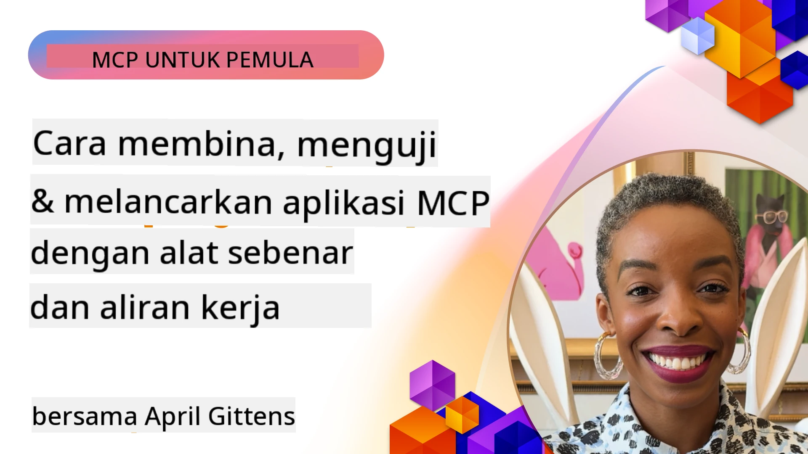
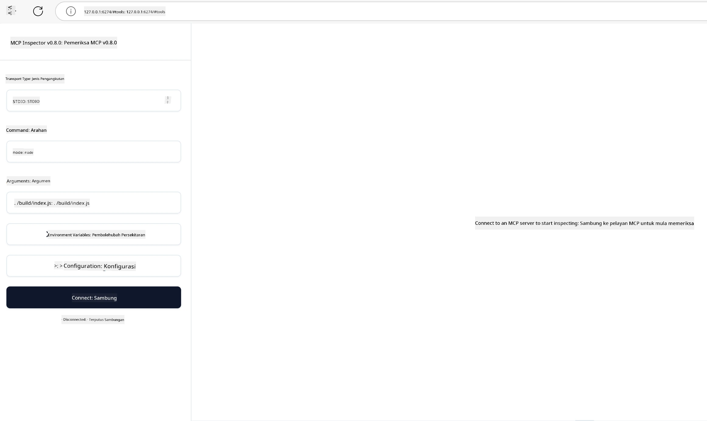

# Pelaksanaan Praktikal

[](https://youtu.be/vCN9-mKBDfQ)

_(Klik gambar di atas untuk menonton video pelajaran ini)_

Pelaksanaan praktikal adalah tempat kuasa Model Context Protocol (MCP) menjadi nyata. Walaupun memahami teori dan seni bina di belakang MCP adalah penting, nilai sebenar muncul apabila anda menerapkan konsep ini untuk membina, menguji, dan melaksanakan penyelesaian yang menyelesaikan masalah dunia sebenar. Bab ini merapatkan jurang antara pengetahuan konseptual dan pembangunan langsung, membimbing anda melalui proses membawa aplikasi berasaskan MCP ke kehidupan sebenar.

Sama ada anda sedang membangunkan pembantu pintar, mengintegrasikan AI ke dalam aliran kerja perniagaan, atau membina alat khusus untuk pemprosesan data, MCP menyediakan asas yang fleksibel. Reka bentuknya yang tidak bergantung kepada bahasa dan SDK rasmi untuk bahasa pengaturcaraan popular menjadikannya boleh diakses oleh pelbagai pemaju. Dengan memanfaatkan SDK ini, anda boleh dengan cepat membuat prototaip, mengulang, dan memperluaskan penyelesaian anda merentasi platform dan persekitaran yang berbeza.

Dalam seksyen berikut, anda akan dapati contoh praktikal, kod sampel, dan strategi pelaksanaan yang menunjukkan cara melaksanakan MCP dalam C#, Java dengan Spring, TypeScript, JavaScript, dan Python. Anda juga akan belajar cara untuk mengesan dan menguji pelayan MCP anda, mengurus API, dan melaksanakan penyelesaian ke awan menggunakan Azure. Sumber langsung ini direka untuk mempercepat pembelajaran anda dan membantu anda membina aplikasi MCP yang kukuh dan siap untuk produksi dengan yakin.

## Gambaran Keseluruhan

Pelajaran ini memfokuskan aspek praktikal pelaksanaan MCP merentasi pelbagai bahasa pengaturcaraan. Kami akan meneroka cara menggunakan SDK MCP dalam C#, Java dengan Spring, TypeScript, JavaScript, dan Python untuk membina aplikasi yang kukuh, mengesan dan menguji pelayan MCP, serta mencipta sumber, arahan, dan alat yang boleh digunakan semula.

## Objektif Pembelajaran

Menjelang tamat pelajaran ini, anda akan dapat:

- Melaksanakan penyelesaian MCP menggunakan SDK rasmi dalam pelbagai bahasa pengaturcaraan
- Mengesan dan menguji pelayan MCP secara sistematik
- Mencipta dan menggunakan ciri pelayan (Sumber, Arahan, dan Alat)
- Mereka bentuk aliran kerja MCP yang berkesan untuk tugasan yang kompleks
- Mengoptimumkan pelaksanaan MCP untuk prestasi dan kebolehpercayaan

## Sumber SDK Rasmi

Model Context Protocol menawarkan SDK rasmi untuk pelbagai bahasa (selaras dengan [Spesifikasi MCP 2025-11-25](https://spec.modelcontextprotocol.io/specification/2025-11-25/)):

- [C# SDK](https://github.com/modelcontextprotocol/csharp-sdk)
- [Java dengan Spring SDK](https://github.com/modelcontextprotocol/java-sdk) **Nota:** memerlukan pergantungan pada [Project Reactor](https://projectreactor.io). (Lihat [isu perbincangan 246](https://github.com/orgs/modelcontextprotocol/discussions/246).)
- [TypeScript SDK](https://github.com/modelcontextprotocol/typescript-sdk)
- [Python SDK](https://github.com/modelcontextprotocol/python-sdk)
- [Kotlin SDK](https://github.com/modelcontextprotocol/kotlin-sdk)
- [Go SDK](https://github.com/modelcontextprotocol/go-sdk)

## Bekerja dengan SDK MCP

Bahagian ini menyediakan contoh praktikal pelaksanaan MCP merentasi pelbagai bahasa pengaturcaraan. Anda boleh dapati kod sampel dalam direktori `samples` yang disusun mengikut bahasa.

### Sampel Tersedia

Repositori ini termasuk [pelaksanaan sampel](../../../04-PracticalImplementation/samples) dalam bahasa berikut:

- [C#](./samples/csharp/README.md)
- [Java dengan Spring](./samples/java/containerapp/README.md)
- [TypeScript](./samples/typescript/README.md)
- [JavaScript](./samples/javascript/README.md)
- [Python](./samples/python/README.md)

Setiap sampel menunjukkan konsep utama MCP dan corak pelaksanaan untuk bahasa dan ekosistem tertentu tersebut.

### Panduan Praktikal

Panduan tambahan untuk pelaksanaan praktikal MCP:

- [Penomboran dan Set Keputusan Besar](./pagination/README.md) - Mengendalikan penomboran berasaskan penunjuk (cursor) untuk alat, sumber, dan set data besar

## Ciri Teras Pelayan

Pelayan MCP boleh melaksanakan sebarang gabungan ciri berikut:

### Sumber

Sumber menyediakan konteks dan data untuk digunakan oleh pengguna atau model AI:

- Repositori dokumen
- Pangkalan pengetahuan
- Sumber data berstruktur
- Sistem fail

### Arahan

Arahan adalah mesej dan aliran kerja bertemplat untuk pengguna:

- Templat perbualan yang telah ditetapkan
- Corak interaksi berpandu
- Struktur dialog khusus

### Alat

Alat adalah fungsi untuk model AI melaksanakan:

- Utiliti pemprosesan data
- Integrasi API luaran
- Keupayaan pengiraan
- Fungsi carian

## Pelaksanaan Sampel: Pelaksanaan C#

Repositori SDK rasmi C# mengandungi beberapa pelaksanaan sampel yang menunjukkan pelbagai aspek MCP:

- **Klien MCP Asas**: Contoh ringkas yang menunjukkan cara mencipta klien MCP dan memanggil alat
- **Pelayan MCP Asas**: Pelaksanaan pelayan minima dengan pendaftaran alat asas
- **Pelayan MCP Lanjutan**: Pelayan penuh dengan pendaftaran alat, pengesahan, dan pengendalian ralat
- **Integrasi ASP.NET**: Contoh menunjukkan integrasi dengan ASP.NET Core
- **Corak Pelaksanaan Alat**: Pelbagai corak untuk melaksanakan alat dengan tahap kerumitan berbeza

SDK MCP C# sedang dalam pratonton dan API mungkin berubah. Kami akan terus mengemas kini blog ini seiring evolusi SDK.

### Ciri Utama

- [C# MCP Nuget ModelContextProtocol](https://www.nuget.org/packages/ModelContextProtocol)
- Membangunkan [Pelayan MCP pertama anda](https://devblogs.microsoft.com/dotnet/build-a-model-context-protocol-mcp-server-in-csharp/).

Untuk sampel pelaksanaan C# lengkap, lawati [repositori sampel SDK C# rasmi](https://github.com/modelcontextprotocol/csharp-sdk)

## Pelaksanaan Sampel: Pelaksanaan Java dengan Spring

SDK Java dengan Spring menawarkan pilihan pelaksanaan MCP yang kukuh dengan ciri gred perusahaan.

### Ciri Utama

- Integrasi Rangka Kerja Spring
- Keselamatan jenis yang kuat
- Sokongan pengaturcaraan reaktif
- Pengendalian ralat yang menyeluruh

Untuk sampel pelaksanaan Java dengan Spring lengkap, lihat [sampel Java dengan Spring](samples/java/containerapp/README.md) dalam direktori sampel.

## Pelaksanaan Sampel: Pelaksanaan JavaScript

SDK JavaScript menyediakan pendekatan ringan dan fleksibel untuk pelaksanaan MCP.

### Ciri Utama

- Sokongan Node.js dan penyemak imbas
- API berasaskan janji (promise)
- Integrasi mudah dengan Express dan rangka kerja lain
- Sokongan WebSocket untuk penstriman

Untuk sampel pelaksanaan JavaScript lengkap, lihat [sampel JavaScript](samples/javascript/README.md) dalam direktori sampel.

## Pelaksanaan Sampel: Pelaksanaan Python

SDK Python menawarkan pendekatan Pythonik untuk pelaksanaan MCP dengan integrasi rangka kerja ML yang cemerlang.

### Ciri Utama

- Sokongan async/await dengan asyncio
- Integrasi FastAPI
- Pendaftaran alat yang mudah
- Integrasi asli dengan perpustakaan ML popular

Untuk sampel pelaksanaan Python lengkap, lihat [sampel Python](samples/python/README.md) dalam direktori sampel.

## Pengurusan API

Pengurusan API Azure adalah jawapan terbaik kepada cara kita boleh melindungi Pelayan MCP. Ianya idea meletakkan instans Pengurusan API Azure di hadapan Pelayan MCP anda dan membiarkannya mengendalikan ciri-ciri yang anda mungkin mahukan seperti:

- had kadar (rate limiting)
- pengurusan token
- pemantauan
- imbangan beban
- keselamatan

### Sampel Azure

Berikut adalah Sampel Azure yang melaksanakan perkara tersebut, iaitu [mencipta Pelayan MCP dan mengamankannya dengan Pengurusan API Azure](https://github.com/Azure-Samples/remote-mcp-apim-functions-python).

Lihat bagaimana aliran kebenaran berlaku pada imej di bawah:


Dalam imej tersebut, perkara berikut berlaku:

- Pengesahan/Kebenaran berlaku menggunakan Microsoft Entra.
- Pengurusan API Azure bertindak sebagai pintu masuk dan menggunakan polisi untuk mengarahkan dan mengurus trafik.
- Azure Monitor merekod semua permintaan untuk analisis lanjut.

#### Aliran Kebenaran

Mari kita lihat aliran kebenaran dengan lebih terperinci:


#### Spesifikasi kebenaran MCP

Ketahui lebih lanjut tentang [spesifikasi Kebenaran MCP](https://spec.modelcontextprotocol.io/specification/2025-11-25/basic/authorization/)

## Melaksanakan Pelayan MCP Jauh ke Azure

Mari lihat jika kita boleh melaksanakan sampel yang disebutkan sebelum ini:

1. Klon repositori

    ```bash
    git clone https://github.com/Azure-Samples/remote-mcp-apim-functions-python.git
    cd remote-mcp-apim-functions-python
    ```

1. Daftarkan pembekal sumber `Microsoft.App`.

   - Jika anda menggunakan Azure CLI, jalankan `az provider register --namespace Microsoft.App --wait`.
   - Jika anda menggunakan Azure PowerShell, jalankan `Register-AzResourceProvider -ProviderNamespace Microsoft.App`. Kemudian jalankan `(Get-AzResourceProvider -ProviderNamespace Microsoft.App).RegistrationState` selepas beberapa ketika untuk memeriksa sama ada pendaftaran selesai.

1. Jalankan arahan [azd](https://aka.ms/azd) ini untuk menyediakan perkhidmatan pengurusan API, aplikasi fungsi (dengan kod) dan semua sumber Azure lain yang diperlukan

    ```shell
    azd up
    ```

    Arahan ini sepatutnya melaksanakan semua sumber awan di Azure

### Uji pelayan anda dengan MCP Inspector

1. Dalam **tingkap terminal baru**, pasang dan jalankan MCP Inspector

    ```shell
    npx @modelcontextprotocol/inspector
    ```

    Anda sepatutnya melihat antara muka seperti:

    

1. CTRL klik untuk memuatkan aplikasi web MCP Inspector dari URL yang dipaparkan oleh aplikasi (contohnya [http://127.0.0.1:6274/#resources](http://127.0.0.1:6274/#resources))
1. Tetapkan jenis pengangkutan kepada `SSE`
1. Tetapkan URL ke titik akhir SSE Pengurusan API yang sedang berjalan anda yang dipaparkan selepas `azd up` dan **Sambung**:

    ```shell
    https://<apim-servicename-from-azd-output>.azure-api.net/mcp/sse
    ```

1. **Senarai Alat**. Klik pada alat dan **Jalankan Alat**.  

Jika semua langkah berfungsi, anda kini sepatutnya tersambung ke pelayan MCP dan telah dapat memanggil alat.

## Pelayan MCP untuk Azure

[Remote-mcp-functions](https://github.com/Azure-Samples/remote-mcp-functions-dotnet): Kumpulan repositori ini adalah templat permulaan pantas untuk membina dan melaksanakan pelayan MCP jauh tersuai menggunakan Azure Functions dengan Python, C# .NET atau Node/TypeScript.

Sampel ini menyediakan penyelesaian lengkap yang membolehkan pembangun:

- Membina dan jalankan secara tempatan: Membangun dan mengesan pelayan MCP pada mesin tempatan
- Melaksanakan ke Azure: Melaksanakan ke awan dengan mudah menggunakan arahan azd up
- Sambung dari klien: Sambung ke pelayan MCP dari pelbagai klien termasuk mod agen Copilot VS Code dan alat MCP Inspector

### Ciri Utama

- Keselamatan secara reka bentuk: Pelayan MCP dilindungi menggunakan kunci dan HTTPS
- Pilihan pengesahan: Menyokong OAuth menggunakan pengesahan terbina dalam dan/atau Pengurusan API
- Pengasingan rangkaian: Membenarkan pengasingan rangkaian menggunakan Rangkaian Maya Azure (VNET)
- Seni bina tanpa pelayan: Memanfaatkan Azure Functions untuk pelaksanaan yang boleh diskalakan dan dipacu peristiwa
- Pembangunan tempatan: Sokongan pembangunan dan pengesanan tempatan yang menyeluruh
- Pelaksanaan mudah: Proses pelaksanaan yang dipermudahkan ke Azure

Repositori ini termasuk semua fail konfigurasi, kod sumber, dan definisi infrastruktur yang diperlukan untuk cepat memulakan pelaksanaan pelayan MCP yang siap produksi.

- [Azure Remote MCP Functions Python](https://github.com/Azure-Samples/remote-mcp-functions-python) - Pelaksanaan sampel MCP menggunakan Azure Functions dengan Python

- [Azure Remote MCP Functions .NET](https://github.com/Azure-Samples/remote-mcp-functions-dotnet) - Pelaksanaan sampel MCP menggunakan Azure Functions dengan C# .NET

- [Azure Remote MCP Functions Node/Typescript](https://github.com/Azure-Samples/remote-mcp-functions-typescript) - Pelaksanaan sampel MCP menggunakan Azure Functions dengan Node/TypeScript.

## Intipati Utama

- SDK MCP menyediakan alat khusus bahasa untuk melaksanakan penyelesaian MCP yang kukuh
- Proses pengesanan dan pengujian adalah kritikal untuk aplikasi MCP yang boleh dipercayai
- Templat arahan yang boleh digunakan semula membolehkan interaksi AI yang konsisten
- Aliran kerja yang direka dengan baik boleh mengatur tugasan kompleks menggunakan pelbagai alat
- Pelaksanaan penyelesaian MCP memerlukan pertimbangan keselamatan, prestasi, dan pengendalian ralat

## Latihan

Reka bentuk aliran kerja MCP praktikal yang menyelesaikan masalah dunia sebenar dalam domain anda:

1. Kenal pasti 3-4 alat yang berguna untuk menyelesaikan masalah ini
2. Cipta rajah aliran kerja yang menunjukkan bagaimana alat-alat ini berinteraksi
3. Laksanakan versi asas salah satu alat menggunakan bahasa pilihan anda
4. Cipta templat arahan yang membantu model menggunakan alat anda dengan efektif

## Sumber Tambahan

---

## Apa Seterusnya

Seterusnya: [Topik Lanjutan](../05-AdvancedTopics/README.md)

---

<!-- CO-OP TRANSLATOR DISCLAIMER START -->
**Penafian**:
Dokumen ini telah diterjemahkan menggunakan perkhidmatan terjemahan AI [Co-op Translator](https://github.com/Azure/co-op-translator). Walaupun kami berusaha untuk ketepatan, sila ambil perhatian bahawa terjemahan automatik mungkin mengandungi kesilapan atau ketidaktepatan. Dokumen asal dalam bahasa asalnya harus dianggap sebagai sumber yang sahih. Untuk maklumat kritikal, terjemahan profesional oleh manusia adalah disyorkan. Kami tidak bertanggungjawab terhadap sebarang salah faham atau salah tafsir yang timbul daripada penggunaan terjemahan ini.
<!-- CO-OP TRANSLATOR DISCLAIMER END -->