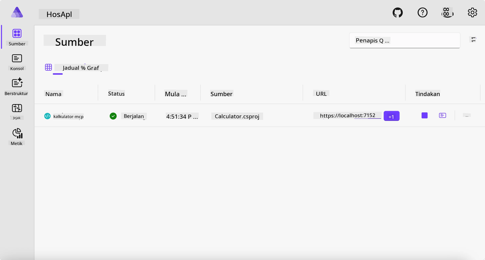
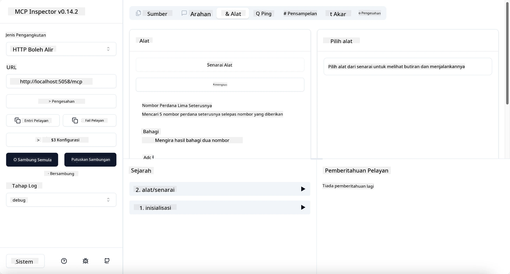
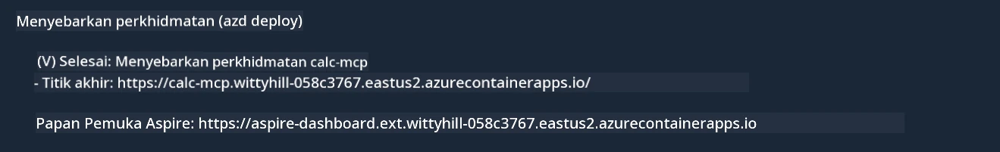

# Contoh

Contoh sebelumnya menunjukkan cara menggunakan projek .NET tempatan dengan jenis `stdio`. Dan bagaimana menjalankan pelayan secara tempatan dalam kontena. Ini adalah penyelesaian yang baik dalam banyak situasi. Walau bagaimanapun, ia boleh berguna untuk mempunyai pelayan yang dijalankan secara jauh, seperti dalam persekitaran awan. Di sinilah jenis `http` digunakan.

Melihat penyelesaian dalam folder `04-PracticalImplementation`, ia mungkin kelihatan lebih rumit daripada yang sebelumnya. Tetapi sebenarnya, ia tidak begitu. Jika anda melihat dengan teliti projek `src/Calculator`, anda akan melihat bahawa ia kebanyakannya kod yang sama seperti contoh sebelumnya. Perbezaan satu-satunya ialah kita menggunakan perpustakaan yang berbeza `ModelContextProtocol.AspNetCore` untuk mengendalikan permintaan HTTP. Dan kita mengubah kaedah `IsPrime` menjadi peribadi, hanya untuk menunjukkan bahawa anda boleh mempunyai kaedah peribadi dalam kod anda. Bahagian kod yang lain sama seperti sebelum ini.

Projek lain adalah daripada [Aspire](https://aspire.dev/get-started/what-is-aspire/). Mempunyai Aspire dalam penyelesaian akan meningkatkan pengalaman pembangun semasa membangun dan menguji serta membantu dengan pengamatan. Ia tidak diperlukan untuk menjalankan pelayan, tetapi ia adalah amalan baik untuk memasukkannya dalam penyelesaian anda.

## Mulakan pelayan secara tempatan

1. Dari VS Code (dengan sambungan C# DevKit), navigasi ke direktori `04-PracticalImplementation/samples/csharp`.
1. Jalankan arahan berikut untuk memulakan pelayan:

   ```bash
    dotnet watch run --project ./src/AppHost
   ```

1. Apabila pelayar web membuka papan pemuka Aspire, ambil perhatian URL `http`. Ia sepatutnya sesuatu seperti `http://localhost:5058/`.

   

## Uji HTTP Streamable dengan MCP Inspector

Jika anda mempunyai Node.js 22.7.5 dan ke atas, anda boleh menggunakan MCP Inspector untuk menguji pelayan anda.

Mulakan pelayan dan jalankan arahan berikut dalam terminal:

```bash
npx @modelcontextprotocol/inspector http://localhost:5058
```



- Pilih `Streamable HTTP` sebagai jenis Pengangkutan.
- Dalam medan Url, masukkan URL pelayan yang dicatat tadi, dan tambah `/mcp`. Ia sepatutnya `http` (bukan `https`) sesuatu seperti `http://localhost:5058/mcp`.
- Pilih butang Sambung.

Salah satu kelebihan Inspector ialah ia menyediakan pandangan yang baik tentang apa yang sedang berlaku.

- Cuba senaraikan alat yang ada
- Cuba beberapa daripadanya, ia sepatutnya berfungsi seperti sebelum ini.

## Uji Pelayan MCP dengan GitHub Copilot Chat dalam VS Code

Untuk menggunakan pengangkutan Streamable HTTP dengan GitHub Copilot Chat, tukar konfigurasi pelayan `calc-mcp` yang dibuat sebelum ini supaya kelihatan seperti berikut:

```jsonc
// .vscode/mcp.json
{
  "servers": {
    "calc-mcp": {
      "type": "http",
      "url": "http://localhost:5058/mcp"
    }
  }
}
```

Lakukan beberapa ujian:

- Minta "3 nombor perdana selepas 6780". Perhatikan bagaimana Copilot akan menggunakan alat baru `NextFivePrimeNumbers` dan hanya memulangkan 3 nombor perdana pertama.
- Minta "7 nombor perdana selepas 111", untuk lihat apa yang berlaku.
- Minta "John mempunyai 24 lolly dan ingin mengagihkannya kepada 3 anaknya. Berapa banyak lolly yang setiap anak ada?", untuk lihat apa yang berlaku.

## Sebarkan pelayan ke Azure

Mari kita sebarkan pelayan ke Azure supaya lebih ramai orang boleh menggunakannya.

Dari terminal, navigasi ke folder `04-PracticalImplementation/samples/csharp` dan jalankan arahan berikut:

```bash
azd up
```

Setelah penyebaran selesai, anda sepatutnya melihat mesej seperti ini:



Ambil URL tersebut dan gunakan dalam MCP Inspector dan GitHub Copilot Chat.

```jsonc
// .vscode/mcp.json
{
  "servers": {
    "calc-mcp": {
      "type": "http",
      "url": "https://calc-mcp.gentleriver-3977fbcf.australiaeast.azurecontainerapps.io/mcp"
    }
  }
}
```

## Apa seterusnya?

Kami cuba pelbagai jenis pengangkutan dan alat ujian. Kami juga menyebarkan pelayan MCP anda ke Azure. Tetapi bagaimana jika pelayan kami perlu mengakses sumber peribadi? Sebagai contoh, pangkalan data atau API peribadi? Dalam bab seterusnya, kita akan lihat bagaimana kita boleh meningkatkan keselamatan pelayan kita.

---

<!-- CO-OP TRANSLATOR DISCLAIMER START -->
**Penafian**:
Dokumen ini telah diterjemahkan menggunakan perkhidmatan terjemahan AI [Co-op Translator](https://github.com/Azure/co-op-translator). Walaupun kami berusaha untuk ketepatan, sila ambil maklum bahawa terjemahan automatik mungkin mengandungi kesilapan atau ketidaktepatan. Dokumen asal dalam bahasa asalnya harus dianggap sebagai sumber yang sahih. Untuk maklumat penting, terjemahan oleh manusia profesional adalah disyorkan. Kami tidak bertanggungjawab terhadap sebarang salah faham atau salah tafsir yang timbul daripada penggunaan terjemahan ini.
<!-- CO-OP TRANSLATOR DISCLAIMER END -->