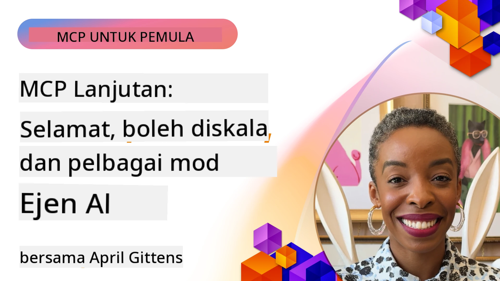

# Topik Lanjutan dalam MCP

_(Klik imej di atas untuk menonton video pelajaran ini)_

Bab ini merangkumi satu siri topik lanjutan dalam pelaksanaan Protokol Konteks Model (MCP), termasuk integrasi multi-modal, kebolehan skala, amalan keselamatan terbaik, dan integrasi perusahaan. Topik-topik ini penting untuk membina aplikasi MCP yang kukuh dan sedia untuk produksi yang mampu memenuhi tuntutan sistem AI moden.

## Gambaran Keseluruhan

Pelajaran ini meneroka konsep lanjutan dalam pelaksanaan Protokol Konteks Model, memfokuskan pada integrasi multi-modal, kebolehan skala, amalan keselamatan terbaik, dan integrasi perusahaan. Topik-topik ini penting untuk membina aplikasi MCP gred produksi yang dapat mengendalikan keperluan kompleks dalam persekitaran perusahaan.

> **Nota spesifikasi semasa:** MCP `2026-07-28` menamatkan primitif Roots dan
> Sampling yang dibincangkan dalam pelajaran 5.4 dan 5.6. Ia juga memindahkan
> ciri bertugas eksperimen yang dirujuk dalam Ciri-ciri Protokol (5.16) ke
> sambungan bertugas khusus. Pelajaran-pelajaran itu dikekalkan untuk
> pelaksanaan warisan `2025-11-25` dan termasuk panduan migrasi. Lihat
> [Apa yang Berubah dalam MCP: Spesifikasi 2026-07-28](../01-CoreConcepts/mcp-2026-07-28.md).

## Objektif Pembelajaran

Menjelang akhir pelajaran ini, anda akan dapat:

- Melaksanakan keupayaan multi-modal dalam rangka kerja MCP
- Merekabentuk seni bina MCP yang boleh diskala untuk senario permintaan tinggi
- Mengaplikasi amalan keselamatan terbaik yang selaras dengan prinsip keselamatan MCP
- Mengintegrasikan MCP dengan sistem dan rangka kerja AI perusahaan
- Mengoptimumkan prestasi dan kebolehpercayaan dalam persekitaran produksi

## Pelajaran dan Projek Contoh

| Pautan | Tajuk | Penerangan |
|------|-------|-------------|
| [5.1 Integrasi dengan Azure](./mcp-integration/README.md) | Integrasi dengan Azure | Pelajari bagaimana untuk mengintegrasikan Server MCP anda di Azure |
| [5.2 Contoh multi modal](./mcp-multi-modality/README.md) | Contoh multi modal MCP | Contoh untuk audio, imej dan respons multi modal |
| [5.3 Contoh MCP OAuth2](../../../05-AdvancedTopics/mcp-oauth2-demo) | Demo MCP OAuth2 | Aplikasi Spring Boot minimal yang menunjukkan OAuth2 dengan MCP, kedua-duanya sebagai Server Kebenaran dan Sumber. Menunjukkan penerbitan token selamat, titik akhir terlindung, penyebaran Aplikasi Kontena Azure, dan integrasi Pengurusan API. |
| [5.4 Konteks Akar](./mcp-root-contexts/README.md) | Konteks akar | Pelajari primitif Roots warisan `2025-11-25` dan pilihan migrasi semasa (ditamatkan dalam `2026-07-28`) |
| [5.5 Penghalaan](./mcp-routing/README.md) | Penghalaan | Pelajari pelbagai jenis penghalaan |
| [5.6 Persampelan](./mcp-sampling/README.md) | Persampelan | Pelajari primitif Sampling warisan `2025-11-25` dan pilihan migrasi semasa (ditamatkan dalam `2026-07-28`) |
| [5.7 Penskalakan](./mcp-scaling/README.md) | Penskalakan | Pelajari mengenai penskalakan |
| [5.8 Keselamatan](./mcp-security/README.md) | Keselamatan | Amankan Server MCP anda |
| [5.9 Contoh Carian Web](./web-search-mcp/README.md) | Carian Web MCP | Server dan klien MCP Python yang menggabungkan dengan SerpAPI untuk carian web, berita, produk dan soal jawab masa nyata. Menunjukkan orkestrasi pelbagai alat, integrasi API luaran, dan pengendalian ralat yang mantap. |
| [5.10 Penstriman Masa Nyata](./mcp-realtimestreaming/README.md) | Penstriman | Penstriman data masa nyata telah menjadi penting dalam dunia berasaskan data hari ini, di mana perniagaan dan aplikasi memerlukan akses segera ke maklumat untuk membuat keputusan tepat pada masanya.|
| [5.11 Carian Web Masa Nyata](./mcp-realtimesearch/README.md) | Carian Web | Carian web masa nyata bagaimana MCP mengubah carian web masa nyata dengan menyediakan pendekatan standard untuk pengurusan konteks merentasi model AI, enjin carian, dan aplikasi.| 
| [5.12 Pengesahan Entra ID untuk Server Protokol Konteks Model](./mcp-security-entra/README.md) | Pengesahan Entra ID | Microsoft Entra ID menyediakan penyelesaian pengurusan identiti dan akses berasaskan awan yang kukuh, membantu memastikan hanya pengguna dan aplikasi yang diberi kuasa boleh berinteraksi dengan server MCP anda.|
| [5.13 Integrasi Ejen Microsoft Foundry](./mcp-foundry-agent-integration/README.md) | Integrasi Microsoft Foundry | Pelajari bagaimana untuk mengintegrasikan server Protokol Konteks Model dengan ejen Microsoft Foundry, membolehkan orkestrasi alat yang kuat dan keupayaan AI perusahaan dengan sambungan sumber data luaran yang standard.|
| [5.14 Kejuruteraan Konteks](./mcp-contextengineering/README.md) | Kejuruteraan Konteks | Peluang masa depan teknik kejuruteraan konteks untuk server MCP, termasuk pengoptimuman konteks, pengurusan konteks dinamik, dan strategi untuk kejuruteraan prompt yang berkesan dalam rangka kerja MCP.|
| [5.15 Pengangkutan Tersuai MCP](./mcp-transport/README.md) | Pengangkutan Tersuai | Pelajari cara melaksanakan mekanisme pengangkutan tersuai untuk senario komunikasi MCP khusus.|
| [5.16 Penyelaman Mendalam Ciri Protokol](./mcp-protocol-features/README.md) | Ciri Protokol | Kuasai ciri protokol lanjutan termasuk notifikasi kemajuan, pembatalan permintaan, templat sumber, dan pola pengendalian ralat.|
| [5.17 Penalaran Multi-Ejen Bertentangan](./mcp-adversarial-agents/README.md) | Ejen Bertentangan | Gunakan dua ejen dengan posisi bertentangan, berkongsi satu set alat MCP, untuk menangkap halusinasi, mendedah kes tepi, dan menghasilkan output yang lebih kalibrasi melalui perdebatan berstruktur.|

> **Nota sejarah `2025-11-25`:** semakan tersebut memperkenalkan ciri
> Bertugas eksperimen dan mengembangkan beberapa ciri protokol. Dalam `2026-07-28`, Bertugas dipindahkan ke
> sambungan rasmi dan Roots telah ditamatkan. Jangan gunakan
> status ciri `2025-11-25` sebagai panduan semasa; lihat
> [log perubahan 2026-07-28](https://modelcontextprotocol.io/specification/2026-07-28/changelog).

## Rujukan Tambahan

Untuk maklumat terkini mengenai topik MCP lanjutan, rujuk:
- [Dokumentasi MCP](https://modelcontextprotocol.io/)
- [Spesifikasi MCP (2026-07-28)](https://modelcontextprotocol.io/specification/2026-07-28/)
- [Repositori GitHub](https://github.com/modelcontextprotocol)
- [OWASP MCP Top 10](https://microsoft.github.io/mcp-azure-security-guide/mcp/) - Risiko keselamatan dan mitigasi
- [Bengkel Sidang Kemuncak Keselamatan MCP (Sherpa)](https://azure-samples.github.io/sherpa/) - Latihan keselamatan praktikal

## Intipati Utama

- Pelaksanaan MCP multi-modal meluaskan kebolehan AI melebihi pemprosesan teks
- Kebolehan skala penting untuk penyebaran perusahaan dan boleh diatasi melalui penskalaan mendatar dan menegak
- Langkah keselamatan menyeluruh melindungi data dan memastikan kawalan akses yang betul
- Integrasi perusahaan dengan platform seperti Azure OpenAI dan Microsoft AI Foundry mempertingkatkan kebolehan MCP
- Pelaksanaan MCP lanjutan mendapat manfaat daripada seni bina yang dioptimumkan dan pengurusan sumber yang teliti

## Latihan

Reka bentuk pelaksanaan MCP gred perusahaan untuk kes penggunaan tertentu:

1. Kenal pasti keperluan multi-modal untuk kes penggunaan anda
2. Gariskan kawalan keselamatan yang diperlukan untuk melindungi data sensitif
3. Reka seni bina boleh skala yang boleh mengendalikan beban yang berubah-ubah
4. Rancang titik integrasi dengan sistem AI perusahaan
5. Dokumentasikan potensi kekangan prestasi dan strategi mitigasi

## Sumber Tambahan

- [Dokumentasi Azure OpenAI](https://learn.microsoft.com/en-us/azure/ai-services/openai/)
- [Dokumentasi Microsoft AI Foundry](https://learn.microsoft.com/en-us/ai-services/)

---

## Apa seterusnya

Terokai pelajaran dalam modul ini bermula dengan: [5.1 Integrasi MCP](./mcp-integration/README.md)

Setelah anda menamatkan modul ini, teruskan ke: [Modul 6: Sumbangan Komuniti](../06-CommunityContributions/README.md)

---

<!-- CO-OP TRANSLATOR DISCLAIMER START -->
**Penafian**:
Dokumen ini telah diterjemahkan menggunakan perkhidmatan terjemahan AI [Co-op Translator](https://github.com/Azure/co-op-translator). Walaupun kami berusaha untuk ketepatan, sila ambil maklum bahawa terjemahan automatik mungkin mengandungi kesilapan atau ketidaktepatan. Dokumen asal dalam bahasa asalnya harus dianggap sebagai sumber yang sahih. Untuk maklumat penting, terjemahan oleh manusia profesional adalah disyorkan. Kami tidak bertanggungjawab terhadap sebarang salah faham atau salah tafsir yang timbul daripada penggunaan terjemahan ini.
<!-- CO-OP TRANSLATOR DISCLAIMER END -->