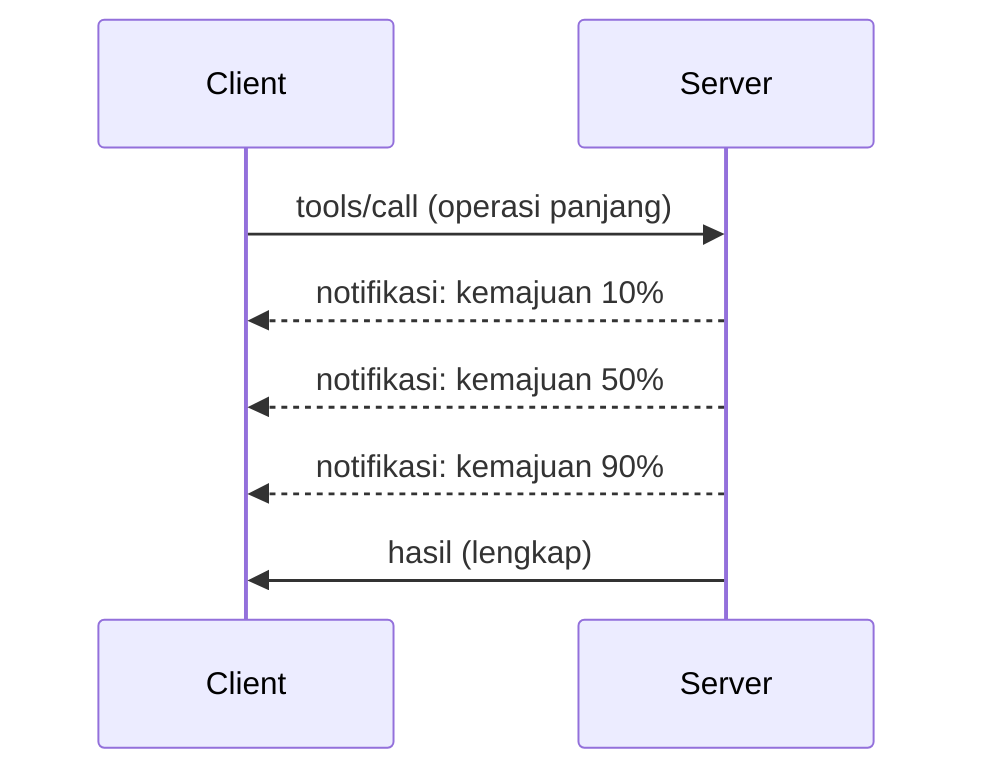

# Perincian Ciri Protokol MCP

Panduan ini meneroka ciri protokol MCP yang maju yang melangkaui pengendalian alat dan sumber asas. Memahami ciri-ciri ini membantu anda membina pelayan MCP yang lebih kukuh, mesra pengguna, dan sedia untuk produksi.

> **Skop MCP `2026-07-28`:** permulaan dan penutupan proses pelayan kekal
> sebagai kebimbangan aplikasi, tetapi jabat tangan `initialize` MCP dan sesi peringkat protokol
> dialih keluar. Bahagian Logging di bawah dikekalkan untuk
> pelaksanaan warisan; pelayan baru harus menggunakan `stderr` atau OpenTelemetry. Tugas kini adalah
> peluasan versi berasingan. Lihat
> [Apa Yang Berubah dalam MCP: Spesifikasi 2026-07-28](../../01-CoreConcepts/mcp-2026-07-28.md).

## Ciri-Ciri Yang Dibahas

1. **Pemberitahuan Kemajuan** - Melaporkan kemajuan bagi operasi yang berjalan lama
2. **Pembatalan Permintaan** - Membenarkan klien membatalkan permintaan yang sedang diproses
3. **Templat Sumber** - URI sumber dinamik dengan parameter
4. **Kitaran Hayat Aplikasi** - Permulaan dan penutupan proses pelayan
5. **Kawalan Logging (Warisan)** - Pengaturan logging MCP yang telah usang
6. **Pola Pengendalian Ralat** - Respons ralat yang konsisten

---

## 1. Pemberitahuan Kemajuan

Untuk operasi yang mengambil masa (pemprosesan data, muat turun fail, panggilan API), pemberitahuan kemajuan memastikan pengguna dimaklumkan.

### Cara Ia Berfungsi



### Pelaksanaan Python

```python
from mcp.server import Server, NotificationOptions
from mcp.types import ProgressNotification
import asyncio

app = Server("progress-server")

@app.tool()
async def process_large_file(file_path: str, ctx) -> str:
    """Process a large file with progress updates."""
    
    # Dapatkan saiz fail untuk pengiraan kemajuan
    file_size = os.path.getsize(file_path)
    processed = 0
    
    with open(file_path, 'rb') as f:
        while chunk := f.read(8192):
            # Proses pek
            await process_chunk(chunk)
            processed += len(chunk)
            
            # Hantar notifikasi kemajuan
            progress = (processed / file_size) * 100
            await ctx.send_notification(
                ProgressNotification(
                    progressToken=ctx.request_id,
                    progress=progress,
                    total=100,
                    message=f"Processing: {progress:.1f}%"
                )
            )
    
    return f"Processed {file_size} bytes"

@app.tool()
async def batch_operation(items: list[str], ctx) -> str:
    """Process multiple items with progress."""
    
    results = []
    total = len(items)
    
    for i, item in enumerate(items):
        result = await process_item(item)
        results.append(result)
        
        # Laporkan kemajuan selepas setiap item
        await ctx.send_notification(
            ProgressNotification(
                progressToken=ctx.request_id,
                progress=i + 1,
                total=total,
                message=f"Processed {i + 1}/{total}: {item}"
            )
        )
    
    return f"Completed {total} items"
```

### Pelaksanaan TypeScript

```typescript
import { Server } from "@modelcontextprotocol/sdk/server/index.js";

server.setRequestHandler(CallToolSchema, async (request, extra) => {
  const { name, arguments: args } = request.params;
  
  if (name === "process_data") {
    const items = args.items as string[];
    const results = [];
    
    for (let i = 0; i < items.length; i++) {
      const result = await processItem(items[i]);
      results.push(result);
      
      // Hantar pemberitahuan kemajuan
      await extra.sendNotification({
        method: "notifications/progress",
        params: {
          progressToken: request.id,
          progress: i + 1,
          total: items.length,
          message: `Processing item ${i + 1}/${items.length}`
        }
      });
    }
    
    return { content: [{ type: "text", text: JSON.stringify(results) }] };
  }
});
```

### Pengendalian Klien (Python)

```python
async def handle_progress(notification):
    """Handle progress notifications from server."""
    params = notification.params
    print(f"Progress: {params.progress}/{params.total} - {params.message}")

# Daftar pengendali
session.on_notification("notifications/progress", handle_progress)

# Panggil alat (kemas kini kemajuan akan tiba melalui pengendali)
result = await session.call_tool("process_large_file", {"file_path": "/data/large.csv"})
```

---

## 2. Pembatalan Permintaan

Membenarkan klien membatalkan permintaan yang tidak lagi diperlukan atau mengambil masa terlalu lama.

### Pelaksanaan Python

```python
from mcp.server import Server
from mcp.types import CancelledError
import asyncio

app = Server("cancellable-server")

@app.tool()
async def long_running_search(query: str, ctx) -> str:
    """Search that can be cancelled."""
    
    results = []
    
    try:
        for page in range(100):  # Cari melalui banyak halaman
            # Periksa jika pembatalan diminta
            if ctx.is_cancelled:
                raise CancelledError("Search cancelled by user")
            
            # Mensimulasikan carian halaman
            page_results = await search_page(query, page)
            results.extend(page_results)
            
            # Lewat kecil membolehkan pemeriksaan pembatalan
            await asyncio.sleep(0.1)
            
    except CancelledError:
        # Kembalikan keputusan separa
        return f"Cancelled. Found {len(results)} results before cancellation."
    
    return f"Found {len(results)} total results"

@app.tool()
async def download_file(url: str, ctx) -> str:
    """Download with cancellation support."""
    
    async with aiohttp.ClientSession() as session:
        async with session.get(url) as response:
            total_size = int(response.headers.get('content-length', 0))
            downloaded = 0
            chunks = []
            
            async for chunk in response.content.iter_chunked(8192):
                if ctx.is_cancelled:
                    return f"Download cancelled at {downloaded}/{total_size} bytes"
                
                chunks.append(chunk)
                downloaded += len(chunk)
            
            return f"Downloaded {downloaded} bytes"
```

### Melaksanakan Konteks Pembatalan

```python
class CancellableContext:
    """Context object that tracks cancellation state."""
    
    def __init__(self, request_id: str):
        self.request_id = request_id
        self._cancelled = asyncio.Event()
        self._cancel_reason = None
    
    @property
    def is_cancelled(self) -> bool:
        return self._cancelled.is_set()
    
    def cancel(self, reason: str = "Cancelled"):
        self._cancel_reason = reason
        self._cancelled.set()
    
    async def check_cancelled(self):
        """Raise if cancelled, otherwise continue."""
        if self.is_cancelled:
            raise CancelledError(self._cancel_reason)
    
    async def sleep_or_cancel(self, seconds: float):
        """Sleep that can be interrupted by cancellation."""
        try:
            await asyncio.wait_for(
                self._cancelled.wait(),
                timeout=seconds
            )
            raise CancelledError(self._cancel_reason)
        except asyncio.TimeoutError:
            pass  # Tamat masa biasa, teruskan
```

### Pembatalan Pihak Klien

```python
import asyncio

async def search_with_timeout(session, query, timeout=30):
    """Search with automatic cancellation on timeout."""
    
    task = asyncio.create_task(
        session.call_tool("long_running_search", {"query": query})
    )
    
    try:
        result = await asyncio.wait_for(task, timeout=timeout)
        return result
    except asyncio.TimeoutError:
        # Permintaan pembatalan
        await session.send_notification({
            "method": "notifications/cancelled",
            "params": {"requestId": task.request_id, "reason": "Timeout"}
        })
        return "Search timed out"
```

---

## 3. Templat Sumber

Templat sumber membenarkan pembinaan URI dinamik dengan parameter, berguna untuk API dan pangkalan data.

### Mendefinisikan Templat

```python
from mcp.server import Server
from mcp.types import ResourceTemplate

app = Server("template-server")

@app.list_resource_templates()
async def list_templates() -> list[ResourceTemplate]:
    """Return available resource templates."""
    return [
        ResourceTemplate(
            uriTemplate="db://users/{user_id}",
            name="User Profile",
            description="Fetch user profile by ID",
            mimeType="application/json"
        ),
        ResourceTemplate(
            uriTemplate="api://weather/{city}/{date}",
            name="Weather Data",
            description="Historical weather for city and date",
            mimeType="application/json"
        ),
        ResourceTemplate(
            uriTemplate="file://{path}",
            name="File Content",
            description="Read file at given path",
            mimeType="text/plain"
        )
    ]

@app.read_resource()
async def read_resource(uri: str) -> str:
    """Read resource, expanding template parameters."""
    
    # Analisis URI untuk mendapatkan parameter
    if uri.startswith("db://users/"):
        user_id = uri.split("/")[-1]
        return await fetch_user(user_id)
    
    elif uri.startswith("api://weather/"):
        parts = uri.replace("api://weather/", "").split("/")
        city, date = parts[0], parts[1]
        return await fetch_weather(city, date)
    
    elif uri.startswith("file://"):
        path = uri.replace("file://", "")
        return await read_file(path)
    
    raise ValueError(f"Unknown resource URI: {uri}")
```

### Pelaksanaan TypeScript

```typescript
server.setRequestHandler(ListResourceTemplatesSchema, async () => {
  return {
    resourceTemplates: [
      {
        uriTemplate: "github://repos/{owner}/{repo}/issues/{issue_number}",
        name: "GitHub Issue",
        description: "Fetch a specific GitHub issue",
        mimeType: "application/json"
      },
      {
        uriTemplate: "db://tables/{table}/rows/{id}",
        name: "Database Row",
        description: "Fetch a row from a database table",
        mimeType: "application/json"
      }
    ]
  };
});

server.setRequestHandler(ReadResourceSchema, async (request) => {
  const uri = request.params.uri;
  
  // Mengurai URI isu GitHub
  const githubMatch = uri.match(/^github:\/\/repos\/([^/]+)\/([^/]+)\/issues\/(\d+)$/);
  if (githubMatch) {
    const [_, owner, repo, issueNumber] = githubMatch;
    const issue = await fetchGitHubIssue(owner, repo, parseInt(issueNumber));
    return {
      contents: [{
        uri,
        mimeType: "application/json",
        text: JSON.stringify(issue, null, 2)
      }]
    };
  }
  
  throw new Error(`Unknown resource URI: ${uri}`);
});
```

---

## 4. Kitaran Hayat Aplikasi

Bahagian ini membahas permulaan dan penutupan proses aplikasi, bukan jabat tangan
MCP `initialize` yang telah dialih keluar. Pengendalian kitaran hayat yang betul memastikan pengurusan sumber yang bersih.


### Pengurusan Kitaran Hayat Python

```python
from mcp.server import Server
from contextlib import asynccontextmanager

app = Server("lifecycle-server")

# Keadaan dikongsi
db_connection = None
cache = None

@asynccontextmanager
async def lifespan(server: Server):
    """Manage server lifecycle."""
    global db_connection, cache
    
    # Permulaan
    print("🚀 Server starting...")
    db_connection = await create_database_connection()
    cache = await create_cache_client()
    print("✅ Resources initialized")
    
    yield  # Pelayan berjalan di sini
    
    # Penutupan
    print("🛑 Server shutting down...")
    await db_connection.close()
    await cache.close()
    print("✅ Resources cleaned up")

app = Server("lifecycle-server", lifespan=lifespan)

@app.tool()
async def query_database(sql: str) -> str:
    """Use the shared database connection."""
    result = await db_connection.execute(sql)
    return str(result)
```

### Kitaran Hayat TypeScript

```typescript
import { Server } from "@modelcontextprotocol/sdk/server/index.js";

class ManagedServer {
  private server: Server;
  private dbConnection: DatabaseConnection | null = null;
  
  constructor() {
    this.server = new Server({
      name: "lifecycle-server",
      version: "1.0.0"
    });
    
    this.setupHandlers();
  }
  
  async start() {
    // Inisialisasi sumber
    console.log("🚀 Server starting...");
    this.dbConnection = await createDatabaseConnection();
    console.log("✅ Database connected");
    
    // Mulakan pelayan
    await this.server.connect(transport);
  }
  
  async stop() {
    // Bersihkan sumber
    console.log("🛑 Server shutting down...");
    if (this.dbConnection) {
      await this.dbConnection.close();
    }
    await this.server.close();
    console.log("✅ Cleanup complete");
  }
  
  private setupHandlers() {
    this.server.setRequestHandler(CallToolSchema, async (request) => {
      // Gunakan this.dbConnection dengan selamat
      // ...
    });
  }
}

// Penggunaan dengan penutupan yang teratur
const server = new ManagedServer();

process.on('SIGINT', async () => {
  await server.stop();
  process.exit(0);
});

await server.start();
```

---

## 5. Kawalan Logging (Warisan)

> [!WARNING]
> Logging MCP sudah usang dalam `2026-07-28` dan layak untuk dikeluarkan dalam
> semakan spesifikasi pertama yang dikeluarkan pada atau selepas 28 Julai 2027. Contoh-contoh
> di bawah adalah untuk keserasian dengan pelaksanaan lebih lama. Gunakan `stderr` dengan
> stdio dan OpenTelemetry untuk pemerhatian struktur dalam pelayan baru.

Versi MCP warisan menyokong tahap logging sisi pelayan yang boleh dikawal oleh klien.

### Melaksanakan Tahap Logging

```python
from mcp.server import Server
from mcp.types import LoggingLevel
import logging

app = Server("logging-server")

# Peta tahap MCP kepada tahap log Python
LEVEL_MAP = {
    LoggingLevel.DEBUG: logging.DEBUG,
    LoggingLevel.INFO: logging.INFO,
    LoggingLevel.WARNING: logging.WARNING,
    LoggingLevel.ERROR: logging.ERROR,
}

logger = logging.getLogger("mcp-server")

@app.set_logging_level()
async def set_logging_level(level: LoggingLevel) -> None:
    """Handle client request to change logging level."""
    python_level = LEVEL_MAP.get(level, logging.INFO)
    logger.setLevel(python_level)
    logger.info(f"Logging level set to {level}")

@app.tool()
async def debug_operation(data: str) -> str:
    """Tool with various logging levels."""
    logger.debug(f"Processing data: {data}")
    
    try:
        result = process(data)
        logger.info(f"Successfully processed: {result}")
        return result
    except Exception as e:
        logger.error(f"Processing failed: {e}")
        raise
```

### Menghantar Mesej Log ke Klien

```python
@app.tool()
async def complex_operation(input: str, ctx) -> str:
    """Operation that logs to client."""
    
    # Hantar pemberitahuan log kepada pelanggan
    await ctx.send_log(
        level="info",
        message=f"Starting complex operation with input: {input}"
    )
    
    # Lakukan kerja...
    result = await do_work(input)
    
    await ctx.send_log(
        level="debug",
        message=f"Operation complete, result size: {len(result)}"
    )
    
    return result
```

---

## 6. Pola Pengendalian Ralat

Pengendalian ralat yang konsisten meningkatkan pembaikan dan pengalaman pengguna.

### Kod Ralat MCP

```python
from mcp.types import McpError, ErrorCode

class ToolError(McpError):
    """Base class for tool errors."""
    pass

class ValidationError(ToolError):
    """Invalid input parameters."""
    def __init__(self, message: str):
        super().__init__(ErrorCode.INVALID_PARAMS, message)

class NotFoundError(ToolError):
    """Requested resource not found."""
    def __init__(self, resource: str):
        super().__init__(ErrorCode.INVALID_REQUEST, f"Not found: {resource}")

class PermissionError(ToolError):
    """Access denied."""
    def __init__(self, action: str):
        super().__init__(ErrorCode.INVALID_REQUEST, f"Permission denied: {action}")

class InternalError(ToolError):
    """Internal server error."""
    def __init__(self, message: str):
        super().__init__(ErrorCode.INTERNAL_ERROR, message)
```

### Respons Ralat Berstruktur

```python
@app.tool()
async def safe_operation(input: str) -> str:
    """Tool with comprehensive error handling."""
    
    # Sahkan input
    if not input:
        raise ValidationError("Input cannot be empty")
    
    if len(input) > 10000:
        raise ValidationError(f"Input too large: {len(input)} chars (max 10000)")
    
    try:
        # Semak kebenaran
        if not await check_permission(input):
            raise PermissionError(f"read {input}")
        
        # Laksanakan operasi
        result = await perform_operation(input)
        
        if result is None:
            raise NotFoundError(input)
        
        return result
        
    except ConnectionError as e:
        raise InternalError(f"Database connection failed: {e}")
    except TimeoutError as e:
        raise InternalError(f"Operation timed out: {e}")
    except Exception as e:
        # Log ralat tidak dijangka
        logger.exception(f"Unexpected error in safe_operation")
        raise InternalError(f"Unexpected error: {type(e).__name__}")
```

### Pengendalian Ralat dalam TypeScript

```typescript
import { McpError, ErrorCode } from "@modelcontextprotocol/sdk/types.js";

function validateInput(data: unknown): asserts data is ValidInput {
  if (typeof data !== "object" || data === null) {
    throw new McpError(
      ErrorCode.InvalidParams,
      "Input must be an object"
    );
  }
  // Lebih pengesahan...
}

server.setRequestHandler(CallToolSchema, async (request) => {
  try {
    validateInput(request.params.arguments);
    
    const result = await performOperation(request.params.arguments);
    
    return {
      content: [{ type: "text", text: JSON.stringify(result) }]
    };
    
  } catch (error) {
    if (error instanceof McpError) {
      throw error;  // Sudah menjadi ralat MCP
    }
    
    // Tukar ralat lain
    if (error instanceof NotFoundError) {
      throw new McpError(ErrorCode.InvalidRequest, error.message);
    }
    
    // Ralat tidak diketahui
    console.error("Unexpected error:", error);
    throw new McpError(
      ErrorCode.InternalError,
      "An unexpected error occurred"
    );
  }
});
```

---

## Ciri Sensitif Versi

### Peluasan Tugas

Tugas adalah peluasan rasmi yang versi berasingan dalam MCP `2026-07-28`. Sebuah
pelayan mungkin mengembalikan pemegang tugas dari panggilan alat, dan klien mengendalikan tugas
dengan `tasks/get`, `tasks/update`, dan `tasks/cancel`. API Tugas eksperimental
`2025-11-25` tidak serasi ke belakang, dan `tasks/list` tidak lagi
wujud.

### Anotasi Alat

Anotasi alat menerangkan tingkah laku seperti baca sahaja, destruktif, idempoten,
atau operasi dunia terbuka. Ia adalah petunjuk dan tidak harus dianggap sebagai jaminan
keselamatan atau kebenaran yang dipercayai kecuali ia datang dari pelayan yang dipercayai.

---

## Apa Seterusnya

- [Modul 8 - Amalan Terbaik](../../08-BestPractices/README.md)
- [5.14 - Kejuruteraan Konteks](../mcp-contextengineering/README.md)
- [Perubahan Spesifikasi MCP](https://modelcontextprotocol.io/specification/2026-07-28/changelog)

---

## Sumber Tambahan

- [Spesifikasi MCP 2026-07-28](https://modelcontextprotocol.io/specification/2026-07-28/)
- [Kod Ralat JSON-RPC 2.0](https://www.jsonrpc.org/specification#error_object)
- [Contoh SDK Python](https://github.com/modelcontextprotocol/python-sdk/tree/main/examples)
- [Contoh SDK TypeScript](https://github.com/modelcontextprotocol/typescript-sdk/tree/main/examples)

---

<!-- CO-OP TRANSLATOR DISCLAIMER START -->
**Penafian**:
Dokumen ini telah diterjemahkan menggunakan perkhidmatan terjemahan AI [Co-op Translator](https://github.com/Azure/co-op-translator). Walaupun kami berusaha untuk ketepatan, sila ambil maklum bahawa terjemahan automatik mungkin mengandungi kesilapan atau ketidaktepatan. Dokumen asal dalam bahasa asalnya harus dianggap sebagai sumber yang sahih. Untuk maklumat penting, terjemahan oleh manusia profesional adalah disyorkan. Kami tidak bertanggungjawab terhadap sebarang salah faham atau salah tafsir yang timbul daripada penggunaan terjemahan ini.
<!-- CO-OP TRANSLATOR DISCLAIMER END -->