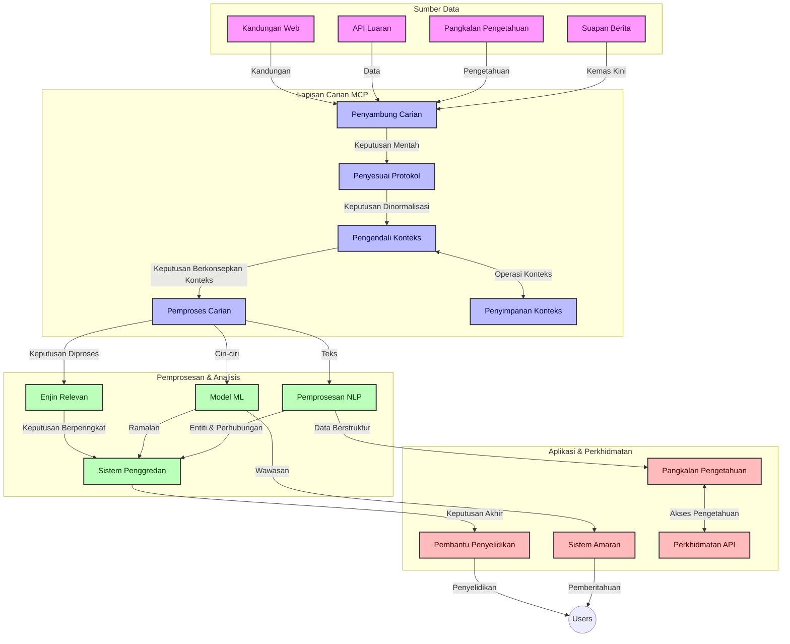
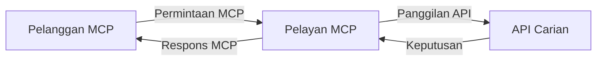
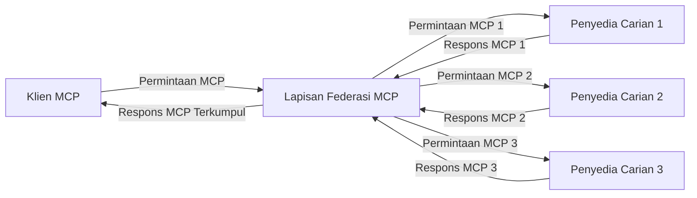
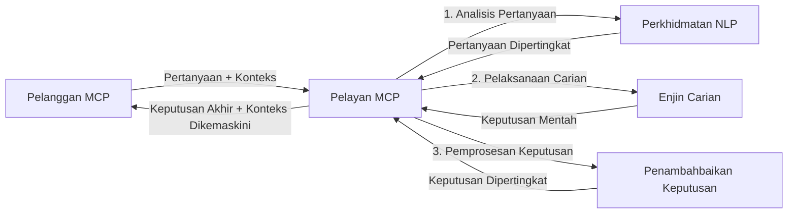

# Protokol Konteks Model untuk Carian Web Masa Nyata

## Gambaran Keseluruhan

Carian web masa nyata telah menjadi penting dalam persekitaran yang dipacu maklumat hari ini, di mana aplikasi memerlukan akses segera kepada maklumat terkini di seluruh internet untuk menyediakan respons yang relevan dan tepat pada masanya. Protokol Konteks Model (MCP) mewakili kemajuan penting dalam mengoptimumkan proses carian masa nyata ini, meningkatkan kecekapan carian, mengekalkan integriti konteks, dan memperbaiki prestasi sistem secara keseluruhan.

Modul ini meneroka bagaimana MCP mengubah carian web masa nyata dengan menyediakan pendekatan standard untuk pengurusan konteks merentasi model AI, enjin carian, dan aplikasi.

### Apa yang Akan Anda Pelajari

Dalam panduan komprehensif ini, anda akan menemui:

- Bagaimana MCP mewujudkan jambatan lancar antara model AI dan keupayaan carian web masa nyata
- Corak seni bina untuk melaksanakan penyelesaian carian yang cekap dan boleh diskala dengan MCP
- Teknik untuk mengekalkan konteks carian merentasi pelbagai pertanyaan dan interaksi
- Pelaksanaan kod praktikal dalam Python dan JavaScript untuk pelbagai senario carian
- Kaedah untuk mengimbangkan relevansi, kesegeraan, dan prestasi dalam sistem carian yang dikuasakan MCP

## Pengenalan kepada Carian Web Masa Nyata

Carian web masa nyata adalah pendekatan teknologi yang membolehkan pertanyaan berterusan, pemprosesan, dan analisis maklumat berasaskan web ketika ia diterbitkan atau dikemas kini, membolehkan sistem menyediakan maklumat segar dan relevan dengan latensi yang minimum. Berbeza dengan sistem carian tradisional yang beroperasi pada data yang diindeks yang mungkin berusia beberapa jam atau hari, proses carian masa nyata menggunakan data langsung dari web, menyampaikan pandangan dan maklumat yang mencerminkan keadaan semasa kandungan dalam talian.

### Konsep Teras Carian Web Masa Nyata:

- **Pemprosesan Pertanyaan Berterusan**: Pertanyaan carian diproses terhadap sumber data yang sentiasa dikemas kini
- **Keutamaan Kesegeraan**: Sistem direka untuk mengutamakan maklumat terkini
- **Imbangan Relevansi**: Mengekalkan imbangan antara relevansi dan kesegeraan
- **Seni Bina Boleh Diskala**: Sistem mesti menangani beban pertanyaan dan volum data yang berubah-ubah
- **Pemahaman Kontekstual**: Mengekalkan konteks pengguna merentasi iterasi carian adalah penting untuk hasil yang bermakna
- **Pembentukan Semula Pertanyaan Dinamik**: Memodifikasi pertanyaan secara adaptif berdasarkan konteks dan hasil sebelumnya
- **Integrasi Pelbagai Sumber**: Menggabungkan hasil dari pelbagai penyedia carian dan sumber web
- **Pemahaman Semantik**: Memproses pertanyaan dan kandungan berdasarkan makna dan bukan hanya kata kunci
- **Pengurutan Masa Nyata**: Sentiasa melaraskan pengurutan hasil apabila maklumat baru menjadi tersedia

### Protokol Konteks Model dan Carian Web Masa Nyata

Protokol Konteks Model (MCP) menangani beberapa cabaran kritikal dalam persekitaran carian web masa nyata:

1. **Pemeliharaan Konteks Carian**: MCP menstandardkan cara konteks dikekalkan merentasi komponen carian yang diedarkan, memastikan model AI dan nod pemprosesan mempunyai akses kepada sejarah pertanyaan dan keutamaan pengguna yang relevan.

2. **Pengurusan Pertanyaan yang Cekap**: Dengan menyediakan mekanisme berstruktur untuk penghantaran konteks, MCP mengurangkan beban mengulangi konteks dalam setiap iterasi carian.

3. **Kebolehmampuan Antara**: MCP mewujudkan bahasa umum untuk perkongsian konteks antara teknologi carian dan model AI yang pelbagai, membolehkan seni bina yang lebih fleksibel dan boleh dikembangkan.

4. **Konteks Dioptimumkan untuk Carian**: Pelaksanaan MCP boleh mengutamakan elemen konteks yang paling relevan untuk carian yang berkesan, mengoptimumkan untuk prestasi dan ketepatan.

5. **Pemprosesan Carian Adaptif**: Dengan pengurusan konteks yang betul melalui MCP, sistem carian boleh menyesuaikan pemprosesan secara dinamik berdasarkan keperluan pengguna dan landskap maklumat yang berkembang.

Dalam aplikasi moden seperti agregasi berita dan pembantu penyelidikan, integrasi MCP dengan teknologi carian web membolehkan carian yang lebih pintar, peka konteks yang dapat menyediakan hasil yang semakin relevan apabila interaksi pengguna berterusan.

## Objektif Pembelajaran

Pada akhir pelajaran ini, anda akan dapat:

- Memahami asas-asas carian web masa nyata dan cabarannya dalam aplikasi moden
- Menjelaskan bagaimana Protokol Konteks Model (MCP) meningkatkan keupayaan carian web masa nyata
- Melaksanakan penyelesaian carian berasaskan MCP menggunakan rangka kerja dan API yang popular
- Reka bentuk dan gubal seni bina carian yang boleh diskala dan berprestasi tinggi dengan MCP
- Menerapkan konsep MCP kepada pelbagai kes penggunaan termasuk carian semantik, bantuan penyelidikan, dan pelayaran yang dipertingkat AI
- Menilai tren terkini dan inovasi masa depan dalam teknologi carian berasaskan MCP
- Membangunkan sistem carian peka konteks yang belajar daripada interaksi pengguna
- Mengintegrasikan keupayaan carian web ke dalam pembantu AI menggunakan protokol MCP yang distandardkan
- Membina saluran carian berperingkat yang secara berperingkat memperhalusi hasil berdasarkan konteks
- Mengoptimumkan prestasi carian sambil mengekalkan kesedaran konteks yang menyeluruh

### Definisi dan Kepentingan

Carian web masa nyata melibatkan pertanyaan, pengambilan, dan pengehantaran maklumat berasaskan web secara berterusan dengan latensi yang minimum. Berbeza dengan enjin carian tradisional yang secara berkala mengimbas dan mengindeks web, carian masa nyata bertujuan untuk memaparkan maklumat apabila ia menjadi tersedia, membolehkan akses segera kepada kandungan paling terkini.

Ciri utama carian web masa nyata termasuk:

- **Kesegeraan**: Mengutamakan kandungan dan kemas kini terbaru
- **Pemprosesan Berterusan**: Sentiasa memantau maklumat baru
- **Penyesuaian Pertanyaan**: Memperhalusi pertanyaan carian berdasarkan konteks dan maklum balas
- **Pengehantaran Segera**: Menyediakan hasil carian dengan kelewatan yang minimum
- **Penahanan Konteks**: Membina berdasarkan pertanyaan sebelumnya untuk relevansi yang lebih baik

### Cabaran dalam Carian Web Tradisional

Pendekatan carian web tradisional menghadapi beberapa had apabila digunakan dalam situasi masa nyata:

1. **Pengpecahan Konteks**: Kesukaran mengekalkan konteks carian merentasi pelbagai pertanyaan
2. **Kesegeraan Maklumat**: Cabaran dalam mengakses dan mengutamakan maklumat terkini
3. **Kompleksiti Integrasi**: Masalah dengan kebolehmampuan antara sistem carian dan aplikasi
4. **Isu Latensi**: Mengimbangkan carian menyeluruh dengan keperluan masa respons
5. **Penalaan Relevansi**: Memastikan ketepatan dan relevansi sambil mengutamakan kesegeraan

## Memahami Protokol Konteks Model (MCP) untuk Carian

### Apakah MCP dalam Konteks Carian?

Protokol Konteks Model (MCP) adalah protokol komunikasi standard yang direka untuk memudahkan interaksi efisien antara model AI dan aplikasi. Dalam konteks carian web masa nyata, MCP menyediakan kerangka untuk:

- Memelihara konteks carian sepanjang urutan pertanyaan
- Menstandardkan format pertanyaan carian dan hasil
- Mengoptimumkan penghantaran parameter carian dan hasil
- Meningkatkan komunikasi antara model dan enjin carian

### Komponen Teras dan Seni Bina

Seni bina MCP untuk carian web masa nyata terdiri daripada beberapa komponen utama:

1. **Pengurus Konteks Pertanyaan**: Mengurus dan mengekalkan konteks carian merentasi pelbagai pertanyaan
2. **Pemproses Carian**: Memproses permintaan carian masuk menggunakan teknik peka konteks
3. **Penyesuai Protokol**: Menukar antara API carian yang berbeza sambil mengekalkan konteks
4. **Stor Konteks**: Menyimpan dan mengambil sejarah carian serta keutamaan secara cekap
5. **Penyambung Carian**: Menyambung ke pelbagai enjin carian dan API web



### Bagaimana MCP Meningkatkan Carian Web Masa Nyata

MCP menangani cabaran carian web tradisional melalui:

- **Keterusan Kontekstual**: Mengekalkan hubungan antara pertanyaan sepanjang sesi carian
- **Penghantaran Dioptimumkan**: Mengurangkan pengulangan parameter carian melalui pengurusan konteks yang bijak
- **Antara Muka Standard**: Menyediakan API yang konsisten untuk komponen carian
- **Pengurangan Latensi**: Meminimumkan beban pemprosesan melalui pengurusan konteks yang cekap
- **Relevansi Dipertingkatkan**: Memperbaiki relevansi carian dengan mengekalkan niat pengguna merentasi pelbagai pertanyaan

## Integrasi dan Pelaksanaan

Sistem carian web masa nyata memerlukan reka bentuk seni bina dan pelaksanaan yang teliti untuk mengekalkan kedua-dua prestasi dan integriti konteks. Protokol Konteks Model menawarkan pendekatan standard untuk mengintegrasikan model AI dan teknologi carian, membolehkan saluran carian yang lebih canggih dan peka konteks.

### Gambaran Keseluruhan Integrasi MCP dalam Seni Bina Carian

Melaksanakan MCP dalam persekitaran carian web masa nyata melibatkan beberapa pertimbangan utama:

1. **Penyerialan Konteks Carian**: MCP menyediakan mekanisme cekap untuk mengekod maklumat kontekstual dalam permintaan carian, memastikan bahawa konteks penting mengikuti pertanyaan sepanjang saluran pemprosesan. Ini termasuk format serialisasi standard yang dioptimumkan untuk metadata berkaitan carian.

2. **Pemprosesan Carian Berstatus**: MCP membolehkan pemprosesan berstatus yang lebih bijak dengan mengekalkan representasi konteks yang konsisten merentasi iterasi carian. Ini sangat berguna dalam saluran carian berperingkat di mana penambahbaikan konteks memperbaiki hasil.

3. **Pengembangan dan Penambahbaikan Pertanyaan**: Pelaksanaan MCP dalam sistem carian boleh memudahkan pengembangan dan penambahbaikan pertanyaan yang canggih berdasarkan konteks terkumpul, membolehkan hasil yang semakin relevan apabila sesi carian berterusan.

4. **Penimbanan dan Keutamaan Hasil**: Dengan menstandardkan pengendalian konteks, MCP membantu mengurus penimbanan dan keutamaan hasil, membolehkan komponen menyesuaikan diri berdasarkan konteks carian yang berkembang.

5. **Federasi dan Agregasi Carian**: MCP memudahkan federasi carian yang lebih canggih merentasi pelbagai backend dengan menyediakan representasi berstruktur konteks carian, membolehkan agregasi hasil yang lebih bermakna dari sumber yang pelbagai.

Pelaksanaan MCP merentasi pelbagai teknologi carian mencipta pendekatan terpadu untuk pengurusan konteks, mengurangkan keperluan kod integrasi khusus sambil meningkatkan keupayaan sistem untuk mengekalkan konteks bermakna semasa pertanyaan carian berkembang.

### MCP dalam Pelbagai Pelaksanaan Carian Web

Contoh-contoh ini mengikuti spesifikasi MCP semasa yang memfokuskan pada protokol berasaskan JSON-RPC dengan mekanisme pengangkutan berbeza. Kod menunjukkan bagaimana anda boleh melaksanakan integrasi carian tersuai sambil mengekalkan keserasian penuh dengan protokol MCP.


<details>
<summary>Pelaksanaan Python dengan API Carian Generic</summary>

```python
import asyncio
import json
import aiohttp
from typing import Dict, Any, Optional, List
from contextlib import asynccontextmanager
from collections.abc import AsyncIterator

# Import perpustakaan MCP standard
from mcp.client.session import ClientSession
from mcp.client.streamable_http import streamablehttp_client
from mcp.types import TextContent, CreateMessageRequestParams, CreateMessageResult
from mcp.server.fastmcp import FastMCP

# Cipta pelayan FastMCP untuk carian web
search_server = FastMCP("WebSearch")

# Kelas untuk mengendalikan operasi carian web
class WebSearchHandler:
    def __init__(self, api_endpoint: str, api_key: str):
        self.api_endpoint = api_endpoint
        self.api_key = api_key
        self.session = None
        
    async def initialize(self):
        """Initialize the HTTP session"""
        self.session = aiohttp.ClientSession(
            headers={"Authorization": f"Bearer {self.api_key}"}
        )
    
    async def close(self):
        """Close the HTTP session"""
        if self.session:
            await self.session.close()
            
    async def perform_search(self, query: str, max_results: int = 5, 
                           include_domains: List[str] = None, 
                           exclude_domains: List[str] = None,
                           time_period: str = "any") -> Dict[str, Any]:
        """Perform web search using the search API"""
        # Bina parameter carian
        search_params = {
            "q": query,
            "limit": max_results,
            "time": time_period
        }
        
        if include_domains:
            search_params["site"] = ",".join(include_domains)
            
        if exclude_domains:
            search_params["exclude_site"] = ",".join(exclude_domains)
        
        # Lakukan permintaan carian
        try:
            async with self.session.get(
                self.api_endpoint,
                params=search_params
            ) as response:
                if response.status != 200:
                    error_text = await response.text()
                    raise Exception(f"Search API error: {response.status} - {error_text}")
                
                search_data = await response.json()
                
                # Tukar respons khusus API kepada format standard
                results = []
                for item in search_data.get("results", []):
                    results.append({
                        "title": item.get("title", ""),
                        "url": item.get("url", ""),
                        "snippet": item.get("snippet", ""),
                        "date": item.get("published_date", ""),
                        "source": item.get("source", "")
                    })
                
                return {
                    "query": query,
                    "totalResults": len(results),
                    "results": results
                }
        except Exception as e:
            print(f"Search API request error: {e}")
            raise

# Inisialisasi pengendali carian
search_handler = WebSearchHandler(
    api_endpoint="https://api.search-service.example/search",
    api_key="your-api-key-here"
)

# Tetapkan jangka hayat untuk mengurus pengendali carian
@asyncio.asynccontextmanager
async def app_lifespan(server: FastMCP):
    """Manage application lifecycle"""
    await search_handler.initialize()
    try:
        yield {"search_handler": search_handler}
    finally:
        await search_handler.close()

# Tetapkan jangka hayat untuk pelayan
search_server = FastMCP("WebSearch", lifespan=app_lifespan)

# Daftar alat carian web
@search_server.tool()
async def web_search(query: str, max_results: int = 5, 
                   include_domains: List[str] = None,
                   exclude_domains: List[str] = None,
                   time_period: str = "any") -> Dict[str, Any]:
    """
    Search the web for information
    
    Args:
        query: The search query
        max_results: Maximum number of results to return (default: 5)
        include_domains: List of domains to include in search results
        exclude_domains: List of domains to exclude from search results
        time_period: Time period for results ("day", "week", "month", "any")
        
    Returns:
        Dictionary containing search results
    """
    ctx = search_server.get_context()
    search_handler = ctx.request_context.lifespan_context["search_handler"]
    
    results = await search_handler.perform_search(
        query=query,
        max_results=max_results,
        include_domains=include_domains,
        exclude_domains=exclude_domains,
        time_period=time_period
    )
    
    return results

# Contoh penggunaan klien
async def client_example():
    # Sambungkan ke pelayan carian menggunakan pengangkutan HTTP Streamable
    async with streamablehttp_client("http://localhost:8000/mcp") as (read, write, _):
        async with ClientSession(read, write) as session:
            # Mulakan sambungan
            await session.initialize()
            
            # Panggil alat carian web
            search_results = await session.call_tool(
                "web_search", 
                {
                    "query": "latest developments in AI and Model Context Protocol",
                    "max_results": 5,
                    "time_period": "day",
                    "include_domains": ["github.com", "microsoft.com"]
                }
            )
            
            print(f"Search results: {search_results}")

# Contoh pelaksanaan pelayan
if __name__ == "__main__":
    # Jalankan pelayan dengan pengangkutan HTTP Streamable
    search_server.run(transport="streamable-http")
```
</details> 

<details>
<summary>Pelaksanaan JavaScript dengan Carian Berasaskan Pelayar</summary>


```javascript
// Pelaksanaan pelayan MCP untuk carian web
import { McpServer, ResourceTemplate } from '@modelcontextprotocol/sdk/server/mcp.js';
import { StreamableHTTPServerTransport } from '@modelcontextprotocol/sdk/server/streamableHttp.js';
import { z } from 'zod';

// Cipta pelayan MCP untuk carian web
const searchServer = new McpServer({
    name: "BrowserSearch",
    description: "A server that provides web search capabilities"
});

// Kelas perkhidmatan carian
class SearchService {
    constructor(searchApiUrl, apiKey) {
        this.searchApiUrl = searchApiUrl;
        this.apiKey = apiKey;
    }

    async performSearch(parameters) {
        const {
            query = '',
            maxResults = 5,
            includeDomains = [],
            excludeDomains = [],
            timePeriod = 'any'
        } = parameters;
        
        // Bina URL carian dengan parameter
        const url = new URL(this.searchApiUrl);
        url.searchParams.append('q', query);
        url.searchParams.append('limit', maxResults);
        url.searchParams.append('time', timePeriod);
        
        if (includeDomains.length > 0) {
            url.searchParams.append('site', includeDomains.join(','));
        }
        
        if (excludeDomains.length > 0) {
            url.searchParams.append('exclude_site', excludeDomains.join(','));
        }
        
        try {
            const response = await fetch(url.toString(), {
                method: 'GET',
                headers: {
                    'Authorization': `Bearer ${this.apiKey}`,
                    'Content-Type': 'application/json'
                }
            });
            
            if (!response.ok) {
                const errorText = await response.text();
                throw new Error(`Search API error: ${response.status} - ${errorText}`);
            }
            
            const searchData = await response.json();
            
            // Tukar tindak balas khusus API ke format standard
            const results = searchData.results?.map(item => ({
                title: item.title || '',
                url: item.url || '',
                snippet: item.snippet || '',
                date: item.published_date || '',
                source: item.source || ''
            })) || [];
            
            return {
                query,
                totalResults: results.length,
                results
            };
        } catch (error) {
            console.error('Search API request error:', error);
            throw error;
        }
    }
}

// Inisialisasi perkhidmatan carian
const searchService = new SearchService(
    'https://api.search-service.example/search',
    'your-api-key-here'
);

// Sediakan pembekal konteks untuk pelayan
searchServer.setContextProvider(() => {
    return {
        searchService
    };
});

// Daftar alat carian web
searchServer.tool({
    name: 'web_search',
    description: 'Search the web for information',
    parameters: {
        type: 'object',
        properties: {
            query: {
                type: 'string',
                description: 'The search query'
            },
            maxResults: {
                type: 'integer',
                description: 'Maximum number of results to return',
                default: 5
            },
            includeDomains: {
                type: 'array',
                items: { type: 'string' },
                description: 'List of domains to include in search results'
            },
            excludeDomains: {
                type: 'array',
                items: { type: 'string' },
                description: 'List of domains to exclude from search results'
            },
            timePeriod: {
                type: 'string',
                description: 'Time period for results',
                enum: ['day', 'week', 'month', 'any'],
                default: 'any'
            }
        },
        required: ['query']
    },
    handler: async (params, context) => {
        const { searchService } = context;
        return await searchService.performSearch(params);
    }
});

// Contoh kod klien untuk menyambung ke pelayan carian
import { Client } from '@modelcontextprotocol/sdk/client/index.js';
import { StreamableHTTPClientTransport } from '@modelcontextprotocol/sdk/client/streamableHttp.js';

async function connectToSearchServer() {
    // Sambung ke pelayan carian
    const transport = new StreamableHTTPClientTransport(
        new URL('http://localhost:8000/mcp')
    );
    
    const client = new Client({
        name: 'search-client',
        version: '1.0.0'
    });
    
    await client.connect(transport);
    
    // Jalankan alat carian
    const searchResults = await client.callTool({
        name: 'web_search',
        arguments: {
            query: 'Model Context Protocol implementation examples',
            maxResults: 10,
            timePeriod: 'week',
            includeDomains: ['github.com', 'docs.microsoft.com']
        }
    });
    
    console.log('Search results:', searchResults);
    
    // Bersihkan
    await client.disconnect();
}

// Mulakan pelayan
const transport = new StreamableHTTPServerTransport();
await searchServer.connect(transport);
console.log('Search server running at http://localhost:8000/mcp');

// Dalam proses berasingan atau selepas pelayan dimulakan
// connectToSearchServer().catch(console.error);
```
</details> 


## Penafian Contoh Kod

> **Nota Penting**: Contoh kod di bawah menunjukkan integrasi Protokol Konteks Model (MCP) dengan fungsi carian web. Walaupun mereka mengikuti corak dan struktur SDK MCP rasmi, mereka telah dipermudahkan untuk tujuan pendidikan.
> 
> Contoh-contoh ini memaparkan:
> 
> 1. **Pelaksanaan Python**: Pelaksanaan pelayan FastMCP yang menyediakan alat carian web dan menyambung ke API carian luaran. Contoh ini menunjukkan pengurusan jangka hayat yang betul, pengendalian konteks, dan pelaksanaan alat mengikut corak SDK Python MCP rasmi. Pelayan ini menggunakan pengangkutan HTTP Streamable yang disyorkan yang telah menggantikan pengangkutan SSE lama untuk pengedaran produksi.
> 
> 2. **Pelaksanaan JavaScript**: Pelaksanaan TypeScript/JavaScript menggunakan corak FastMCP daripada SDK TypeScript MCP rasmi untuk mencipta pelayan carian dengan definisi alat dan sambungan klien yang betul. Ia mengikuti corak yang disyorkan terkini untuk pengurusan sesi dan pemeliharaan konteks.
> 
> Contoh-contoh ini memerlukan pengendalian ralat tambahan, pengesahan, dan kod integrasi API khusus untuk penggunaan produksi. Titik akhir API carian yang ditunjukkan (`https://api.search-service.example/search`) adalah tempat letak dan perlu digantikan dengan titik akhir perkhidmatan carian sebenar.
> 
> Untuk butiran pelaksanaan lengkap dan pendekatan terkini,
> rujuk [spesifikasi MCP rasmi](https://modelcontextprotocol.io/specification/2026-07-28/)
> dan dokumentasi SDK.

## Konsep Teras

### Kerangka Protokol Konteks Model (MCP)

Pada asasnya, Protokol Konteks Model menyediakan cara standard bagi model AI, aplikasi, dan perkhidmatan untuk bertukar konteks. Dalam carian web masa nyata, kerangka ini penting untuk mencipta pengalaman carian pelbagai pusingan yang koheren. Komponen utama termasuk:

1. **Seni Bina Pelanggan-Pelayan**: MCP menetapkan pemisahan jelas antara pelanggan carian (peminta) dan pelayan carian (penyedia), membenarkan model penyebaran yang fleksibel.

2. **Komunikasi JSON-RPC**: Protokol menggunakan JSON-RPC untuk pertukaran mesej, menjadikannya serasi dengan teknologi web dan mudah dilaksanakan merentasi pelbagai platform.

3. **Pengurusan Konteks**: MCP mentakrifkan kaedah berstruktur untuk mengekalkan, mengemas kini, dan memanfaatkan konteks carian merentasi pelbagai interaksi.

4. **Definisi Alat**: Keupayaan carian didedahkan sebagai alat standard dengan parameter dan nilai yang dipanggil yang terperinci.

5. **Sokongan Penstriman**: Protokol menyokong hasil penstriman, penting untuk carian masa nyata di mana hasil mungkin tiba secara berperingkat.

### Corak Integrasi Carian Web

Apabila mengintegrasikan MCP dengan carian web, beberapa corak muncul:

#### 1. Integrasi Penyedia Carian Terus



Dalam corak ini, pelayan MCP berinteraksi secara langsung dengan satu atau lebih API carian, menterjemah permintaan MCP ke dalam panggilan API khusus dan memformat hasil sebagai respons MCP.

#### 2. Carian Berfederasi dengan Pemeliharaan Konteks



Corak ini mengagihkan pertanyaan carian merentasi pelbagai penyedia carian yang serasi MCP, masing-masing mungkin mengkhusus dalam jenis kandungan atau keupayaan carian yang berbeza-beza, sambil mengekalkan konteks yang bersatu.

#### 3. Rantaian Carian Dipertingkatkan Konteks



Dalam corak ini, proses carian dibahagikan kepada beberapa peringkat, dengan konteks diperkaya pada setiap langkah, menghasilkan keputusan yang semakin relevan.

### Komponen Konteks Carian

Dalam carian web berasaskan MCP, konteks biasanya termasuk:

- **Sejarah Pertanyaan**: Pertanyaan carian sebelumnya dalam sesi
- **Keutamaan Pengguna**: Bahasa, wilayah, tetapan carian selamat
- **Sejarah Interaksi**: Hasil yang diklik, masa yang diluangkan pada hasil
- **Parameter Carian**: Penapis, susunan penapisan, dan pengubah carian lain
- **Pengetahuan Domain**: Konteks khusus subjek yang relevan dengan carian
- **Konteks Temporal**: Faktor relevansi berasaskan masa
- **Keutamaan Sumber**: Sumber maklumat yang dipercayai atau dipilih

## Kes Penggunaan dan Aplikasi

### Penyelidikan dan Pengumpulan Maklumat

MCP mempertingkatkan aliran kerja penyelidikan dengan:

- Memelihara konteks penyelidikan merentasi sesi carian
- Membolehkan pertanyaan yang lebih canggih dan relevan secara kontekstual
- Menyokong federasi carian pelbagai sumber
- Memudahkan pengekstrakan pengetahuan daripada hasil carian

### Pemantauan Berita dan Tren Masa Nyata

Carian dikuasakan MCP menawarkan kelebihan untuk pemantauan berita:

- Penemuan cerita berita muncul hampir masa nyata
- Penapisan konteks maklumat yang relevan
- Penjejakan topik dan entiti merentasi pelbagai sumber
- Amaran berita yang diperibadikan berdasarkan konteks pengguna

### Pelayaran dan Penyelidikan Dipertingkatkan AI

MCP mencipta kemungkinan baru untuk pelayaran dipertingkatkan AI:

- Cadangan carian kontekstual berdasarkan aktiviti pelayar semasa
- Integrasi lancar carian web dengan pembantu yang dikuasakan LLM
- Penambahbaikan carian pelbagai pusingan dengan konteks yang dijaga
- Peningkatan pemeriksaan fakta dan pengesahan maklumat

## Tren dan Inovasi Masa Depan

### Evolusi MCP dalam Carian Web

Melihat ke hadapan, kami menjangka MCP akan berkembang untuk menangani:


- **Carian Multimodal**: Menggabungkan carian teks, imej, audio, dan video dengan konteks yang dipelihara
- **Carian Terdesentralisasi**: Menyokong ekosistem carian teragih dan federasi
- **Privasi Carian**: Mekanisme carian yang memelihara privasi yang sedar konteks
- **Pemahaman Pertanyaan**: Penguraian semantik mendalam pertanyaan carian bahasa semula jadi

### Kemajuan Potensi dalam Teknologi

Teknologi baru yang akan membentuk masa depan carian MCP:

1. **Seni Bina Carian Neural**: Sistem carian berasaskan penanaman teroptimasi untuk MCP
2. **Konteks Carian Peribadi**: Mempelajari corak carian pengguna individu dari masa ke masa
3. **Integrasi Graf Pengetahuan**: Carian kontekstual dipertingkatkan oleh graf pengetahuan khusus domain
4. **Konteks Merentas Modal**: Mengekalkan konteks merentas modal carian yang berbeza

## Latihan Praktikal

### Latihan 1: Menyediakan Saluran Carian MCP Asas

Dalam latihan ini, anda akan belajar bagaimana untuk:
- Mengkonfigurasi persekitaran carian MCP asas
- Melaksanakan pengendali konteks untuk carian web
- Menguji dan mengesahkan pemeliharaan konteks merentas iterasi carian

### Latihan 2: Membina Pembantu Penyelidikan dengan Carian MCP

Cipta aplikasi lengkap yang:
- Memproses soalan penyelidikan bahasa semula jadi
- Melakukan carian web yang sedar konteks
- Mensintesis maklumat dari pelbagai sumber
- Membentangkan dapatan penyelidikan yang tersusun

### Latihan 3: Melaksanakan Persekutuan Carian Berbilang Sumber dengan MCP

Latihan lanjutan yang merangkumi:
- Penghantaran pertanyaan sedar konteks ke pelbagai enjin carian
- Penarafan dan agregasi keputusan
- Deduplicasi kontekstual keputusan carian
- Mengendalikan metadata khusus sumber

## Sumber Tambahan

- [Spesifikasi Protokol Konteks Model](https://modelcontextprotocol.io/specification/2026-07-28/) - Spesifikasi rasmi MCP dan dokumentasi protokol terperinci
- [Dokumentasi Protokol Konteks Model](https://modelcontextprotocol.io/) - Tutorial terperinci dan panduan pelaksanaan
- [MCP Python SDK](https://github.com/modelcontextprotocol/python-sdk) - Pelaksanaan rasmi Python untuk protokol MCP
- [MCP TypeScript SDK](https://github.com/modelcontextprotocol/typescript-sdk) - Pelaksanaan rasmi TypeScript untuk protokol MCP
- [Pelayan Rujukan MCP](https://github.com/modelcontextprotocol/servers) - Pelaksanaan rujukan pelayan MCP
- [Dokumentasi API Carian Web Bing](https://learn.microsoft.com/en-us/bing/search-apis/bing-web-search/overview) - API carian web Microsoft
- [Google Custom Search JSON API](https://developers.google.com/custom-search/v1/overview) - Enjin carian yang boleh diprogram Google
- [Dokumentasi SerpAPI](https://serpapi.com/search-api) - API halaman keputusan enjin carian
- [Dokumentasi Meilisearch](https://www.meilisearch.com/docs) - Enjin carian sumber terbuka
- [Dokumentasi Elasticsearch](https://www.elastic.co/guide/index.html) - Enjin carian teragih dan analitik
- [Dokumentasi LangChain](https://python.langchain.com/docs/get_started/introduction) - Membangun aplikasi dengan LLM

## Hasil Pembelajaran

Dengan menyelesaikan modul ini, anda akan dapat:

- Memahami asas carian web masa nyata dan cabarannya
- Menjelaskan bagaimana Protokol Konteks Model (MCP) meningkatkan keupayaan carian web masa nyata
- Melaksanakan penyelesaian carian berasaskan MCP menggunakan rangka kerja dan API popular
- Mereka bentuk dan melancarkan seni bina carian skala besar berprestasi tinggi dengan MCP
- Mengaplikasikan konsep MCP kepada pelbagai kes penggunaan termasuk carian semantik, pembantu penyelidikan, dan pelayaran dibantu AI
- Menilai trend baru dan inovasi masa depan dalam teknologi carian berasaskan MCP


### Pertimbangan Kepercayaan dan Keselamatan

Apabila melaksanakan penyelesaian carian web berasaskan MCP, ingat prinsip penting dari spesifikasi MCP ini:

1. **Persetujuan dan Kawalan Pengguna**: Pengguna mesti memberikan persetujuan secara jelas dan memahami semua akses data serta operasi. Ini sangat penting untuk pelaksanaan carian web yang mungkin mengakses sumber data luaran.

2. **Privasi Data**: Pastikan pengendalian yang sesuai untuk pertanyaan carian dan keputusan, terutamanya apabila ia mungkin mengandungi maklumat sensitif. Laksanakan kawalan akses yang sesuai untuk melindungi data pengguna.

3. **Keselamatan Alat**: Laksanakan kebenaran dan pengesahan yang betul untuk alat carian, kerana mereka mewakili risiko keselamatan melalui pelaksanaan kod sewenang-wenangnya. Penerangan tingkah laku alat harus dianggap tidak dipercayai kecuali diperoleh dari pelayan yang dipercayai.

4. **Dokumentasi Jelas**: Sediakan dokumentasi jelas mengenai keupayaan, had, dan pertimbangan keselamatan pelaksanaan carian berasaskan MCP anda, mengikut garis panduan pelaksanaan dari spesifikasi MCP.

5. **Aliran Persetujuan Mantap**: Bangunkan aliran persetujuan dan kebenaran yang mantap yang menerangkan dengan jelas apa yang dilakukan setiap alat sebelum membenarkan penggunaannya, terutamanya untuk alat yang berinteraksi dengan sumber web luaran.

Untuk maklumat lengkap mengenai keselamatan dan pertimbangan kepercayaan MCP, rujuk
[dokumentasi rasmi](https://modelcontextprotocol.io/specification/2026-07-28/basic/security_best_practices).

## Apa yang seterusnya

- [5.12 Pengesahan Entra ID untuk Pelayan Protokol Konteks Model](../mcp-security-entra/README.md)

---

<!-- CO-OP TRANSLATOR DISCLAIMER START -->
**Penafian**:
Dokumen ini telah diterjemahkan menggunakan perkhidmatan terjemahan AI [Co-op Translator](https://github.com/Azure/co-op-translator). Walaupun kami berusaha untuk ketepatan, sila ambil maklum bahawa terjemahan automatik mungkin mengandungi kesilapan atau ketidaktepatan. Dokumen asal dalam bahasa asalnya harus dianggap sebagai sumber yang sahih. Untuk maklumat penting, terjemahan oleh manusia profesional adalah disyorkan. Kami tidak bertanggungjawab terhadap sebarang salah faham atau salah tafsir yang timbul daripada penggunaan terjemahan ini.
<!-- CO-OP TRANSLATOR DISCLAIMER END -->