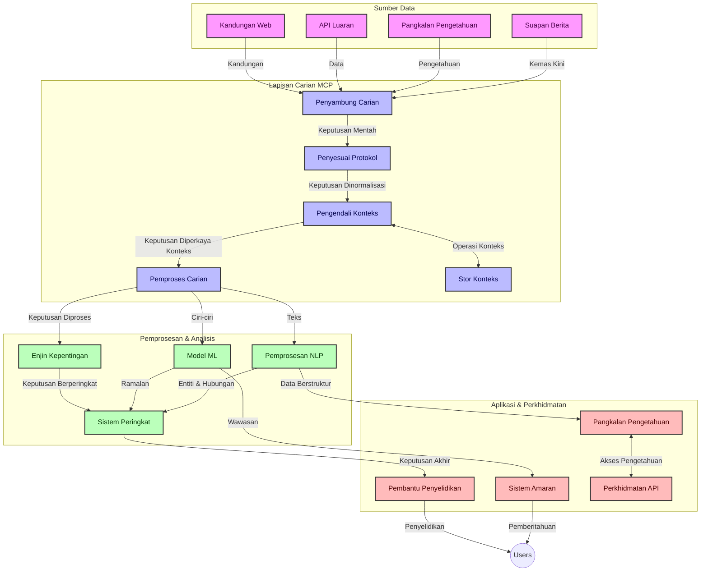
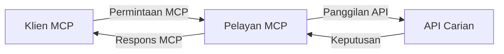
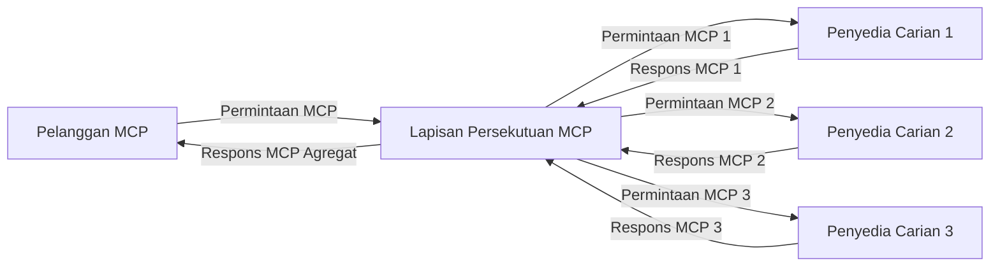
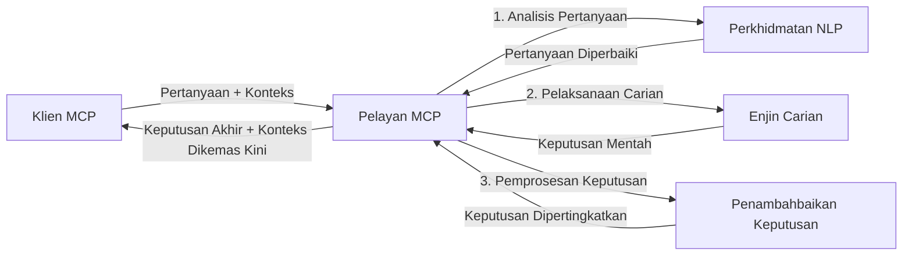

# Protokol Konteks Model untuk Carian Web Masa Nyata

## Gambaran Keseluruhan

Carian web masa nyata telah menjadi penting dalam persekitaran berasaskan maklumat hari ini, di mana aplikasi memerlukan akses segera kepada maklumat terkini di seluruh internet untuk menyediakan respons yang relevan dan tepat pada masanya. Protokol Konteks Model (MCP) mewakili kemajuan penting dalam mengoptimumkan proses carian masa nyata ini, meningkatkan kecekapan carian, mengekalkan integriti konteks, dan memperbaiki prestasi sistem secara keseluruhan.

Modul ini meneroka bagaimana MCP mengubah carian web masa nyata dengan menyediakan pendekatan piawai untuk pengurusan konteks merentas model AI, enjin carian, dan aplikasi.

### Apa Yang Akan Anda Pelajari

Dalam panduan komprehensif ini, anda akan menemui:

- Bagaimana MCP mencipta jambatan lancar antara model AI dan keupayaan carian web masa nyata
- Corak seni bina untuk melaksanakan penyelesaian carian yang cekap dan boleh diskalakan dengan MCP
- Teknik untuk mengekalkan konteks carian merentas beberapa pertanyaan dan interaksi
- Pelaksanaan kod praktikal dalam Python dan JavaScript untuk pelbagai senario carian
- Kaedah mengimbangi relevansi, kemaskinian, dan prestasi dalam sistem carian berkuasa MCP

## Pengenalan kepada Carian Web Masa Nyata

Carian web masa nyata adalah pendekatan teknologi yang membolehkan pertanyaan, pemprosesan, dan analisis maklumat berasaskan web secara berterusan sebaik ia diterbitkan atau dikemas kini, membolehkan sistem menyediakan maklumat segar dan relevan dengan kelewatan minimum. Berbeza dengan sistem carian tradisional yang beroperasi ke atas data berindeks yang mungkin berumur berjam atau hari, proses carian masa nyata memproses data langsung dari web, menyampaikan pandangan dan maklumat yang mencerminkan keadaan semasa kandungan dalam talian.

### Konsep Teras Carian Web Masa Nyata:

- **Pemprosesan Pertanyaan Berterusan**: Pertanyaan carian diproses terhadap sumber data yang sentiasa dikemas kini
- **Keutamaan Kemaskinian**: Sistem direka untuk mengutamakan maklumat yang segar
- **Pengimbangan Relevansi**: Mengekalkan imbangan antara relevansi dan kemaskinian
- **Seni Bina Boleh Diskalakan**: Sistem mesti mampu mengendalikan beban pertanyaan dan jumlah data yang berubah-ubah
- **Pemahaman Kontekstual**: Mengekalkan konteks pengguna merentas iterasi carian adalah penting untuk keputusan yang bermakna
- **Pemformulasian Semula Pertanyaan Dinamik**: Mengubahsuai pertanyaan secara adaptif berdasarkan konteks dan keputusan sebelumnya
- **Integrasi Berbilang Sumber**: Menggabungkan keputusan dari pelbagai penyedia carian dan sumber web
- **Pemahaman Semantik**: Memproses pertanyaan dan kandungan berdasarkan makna bukan hanya kata kunci
- **Penyusunan Masa Nyata**: Menyesuaikan kedudukan keputusan secara berterusan apabila maklumat baru tersedia

### Protokol Konteks Model dan Carian Web Masa Nyata

Protokol Konteks Model (MCP) menangani beberapa cabaran kritikal dalam persekitaran carian web masa nyata:

1. **Pemeliharaan Konteks Carian**: MCP piawai bagaimana konteks dikekalkan merentas komponen carian teragih, memastikan model AI dan nod pemprosesan mempunyai akses kepada sejarah pertanyaan yang relevan dan keutamaan pengguna.

2. **Pengurusan Pertanyaan yang Cekap**: Dengan menyediakan mekanisme terstruktur untuk penghantaran konteks, MCP mengurangkan beban mengulang konteks dalam setiap iterasi carian.

3. **Kebolehoperasian**: MCP mewujudkan bahasa biasa untuk perkongsian konteks antara teknologi carian dan model AI yang pelbagai, membolehkan seni bina yang lebih fleksibel dan boleh dikembangkan.

4. **Konteks Dioptimumkan untuk Carian**: Pelaksanaan MCP boleh mengutamakan elemen konteks yang paling relevan untuk carian yang berkesan, mengoptimumkan prestasi dan ketepatan.

5. **Pemprosesan Carian Adaptif**: Dengan pengurusan konteks yang betul melalui MCP, sistem carian boleh menyesuaikan pemprosesan secara dinamik berdasarkan keperluan pengguna dan lanskap maklumat yang berubah.

Dalam aplikasi moden yang merangkumi agregasi berita hingga pembantu penyelidikan, pengintegrasian MCP dengan teknologi carian web membolehkan carian yang lebih pintar, sedar konteks yang boleh menyediakan hasil yang semakin relevan seiring interaksi pengguna berterusan.

## Objektif Pembelajaran

Pada akhir pelajaran ini, anda akan dapat:

- Memahami asas carian web masa nyata dan cabarannya dalam aplikasi moden
- Menerangkan bagaimana Protokol Konteks Model (MCP) meningkatkan keupayaan carian web masa nyata
- Melaksanakan penyelesaian carian berasaskan MCP menggunakan kerangka kerja dan API popular
- Merekabentuk dan melaksanakan seni bina carian berskala besar dan berprestasi tinggi dengan MCP
- Menerapkan konsep MCP kepada pelbagai kes penggunaan termasuk carian semantik, bantuan penyelidikan, dan pelayaran yang dipertingkatkan AI
- Menilai trend muncul dan inovasi masa depan dalam teknologi carian berasaskan MCP
- Membangunkan sistem carian sedar konteks yang belajar dari interaksi pengguna
- Mengintegrasikan keupayaan carian web ke dalam pembantu AI menggunakan protokol MCP piawai
- Mewujudkan saluran carian berperingkat yang memperkemaskan keputusan secara beransur-ansur berdasarkan konteks
- Mengoptimumkan prestasi carian sambil mengekalkan kesedaran konteks yang menyeluruh

### Definisi dan Kepentingan

Carian web masa nyata melibatkan pertanyaan berterusan, pengambilan, dan penyampaian maklumat berasaskan web dengan kelewatan minimum. Berbeza dengan enjin carian tradisional yang secara berkala merayapi dan mengindeks web, carian masa nyata bertujuan menonjolkan maklumat sebaik ia tersedia, membolehkan akses segera kepada kandungan terkini.

Ciri utama carian web masa nyata termasuk:

- **Kesegaran**: Mengutamakan kandungan dan kemaskini terkini
- **Pemprosesan Berterusan**: Sentiasa memantau maklumat baru
- **Penyesuaian Pertanyaan**: Memperhalusi pertanyaan carian berdasarkan konteks dan maklum balas
- **Penghantaran Segera**: Menyediakan hasil carian dengan kelewatan minimum
- **Pengekalan Konteks**: Membina berdasarkan pertanyaan sebelumnya untuk relevansi yang lebih baik

### Cabaran dalam Carian Web Tradisional

Pendekatan carian web tradisional menghadapi beberapa batasan apabila digunakan untuk senario masa nyata:

1. **Pecahan Konteks**: Sukar mengekalkan konteks carian merentas beberapa pertanyaan
2. **Kesegaran Maklumat**: Cabaran dalam mengakses dan mengutamakan maklumat terkini
3. **Kerumitan Integrasi**: Masalah kebolehoperasian antara sistem carian dan aplikasi
4. **Isu Kelewatan**: Mengimbangi carian menyeluruh dengan keperluan masa respons
5. **Penalaan Relevansi**: Memastikan ketepatan dan relevansi sambil mengutamakan kemaskinian

## Memahami Protokol Konteks Model (MCP) untuk Carian

### Apakah MCP dalam Konteks Carian?

Protokol Konteks Model (MCP) adalah protokol komunikasi piawai yang direka untuk memudahkan interaksi cekap antara model AI dan aplikasi. Dalam konteks carian web masa nyata, MCP menyediakan rangka kerja untuk:

- Memelihara konteks carian sepanjang urutan pertanyaan
- Piawai format pertanyaan carian dan hasil
- Mengoptimumkan penghantaran parameter dan hasil carian
- Meningkatkan komunikasi antara model dan enjin carian

### Komponen Teras dan Seni Bina

Seni bina MCP untuk carian web masa nyata terdiri daripada beberapa komponen utama:

1. **Pengurus Konteks Pertanyaan**: Mengurus dan mengekalkan konteks carian merentas beberapa pertanyaan
2. **Pemproses Carian**: Memproses permintaan carian masuk menggunakan teknik sedar konteks
3. **Penyesuai Protokol**: Menukar antara API carian berbeza sambil mengekalkan konteks
4. **Stor Konteks**: Menyimpan dan mengambil sejarah carian dan keutamaan dengan cekap
5. **Penyambung Carian**: Menyambung ke pelbagai enjin carian dan API web



### Bagaimana MCP Meningkatkan Carian Web Masa Nyata

MCP menangani cabaran carian web tradisional melalui:

- **Kesinambungan Kontekstual**: Mengekalkan hubungan antara pertanyaan sepanjang sesi carian
- **Penghantaran Dioptimumkan**: Mengurangkan pengulangan dalam parameter carian melalui pengurusan konteks pintar
- **Antara Muka Piawai**: Menyediakan API konsisten untuk komponen carian
- **Pengurangan Kelewatan**: Meminimumkan beban pemprosesan melalui pengendalian konteks yang cekap
- **Peningkatan Relevansi**: Memperbaiki relevansi carian dengan mengekalkan niat pengguna merentas beberapa pertanyaan

## Integrasi dan Pelaksanaan

Sistem carian web masa nyata memerlukan reka bentuk seni bina dan pelaksanaan yang teliti untuk mengekalkan prestasi dan integriti konteks. Protokol Konteks Model menawarkan pendekatan piawai untuk mengintegrasikan model AI dan teknologi carian, membolehkan saluran carian yang lebih canggih dan sedar konteks.

### Gambaran Keseluruhan Integrasi MCP dalam Seni Bina Carian

Pelaksanaan MCP dalam persekitaran carian web masa nyata melibatkan beberapa pertimbangan utama:

1. **Penjeruman Konteks Carian**: MCP menyediakan mekanisme cekap untuk menyandikan maklumat kontekstual dalam permintaan carian, memastikan konteks penting mengikuti pertanyaan sepanjang saluran pemprosesan. Ini termasuk format penjeruman piawai yang dioptimumkan untuk metadata berkaitan carian.

2. **Pemprosesan Carian Stateful**: MCP membolehkan pemprosesan berstate yang lebih pintar dengan mengekalkan representasi konteks yang konsisten merentas iterasi carian. Ini sangat bernilai dalam saluran carian berperingkat di mana penambahbaikan konteks memperbaiki hasil.

3. **Pengembangan dan Penambahbaikan Pertanyaan**: Pelaksanaan MCP dalam sistem carian boleh memudahkan pengembangan dan penambahbaikan pertanyaan yang canggih berdasarkan konteks terkumpul, membolehkan hasil yang semakin relevan sepanjang sesi carian.

4. **Penimbunan dan Keutamaan Keputusan**: Dengan piawai pengendalian konteks, MCP membantu mengurus penimbunan hasil dan keutamaan, membolehkan komponen menyesuaikan berdasarkan konteks carian yang berkembang.

5. **Federasi dan Agregasi Carian**: MCP memudahkan federasi carian yang lebih canggih merentas pelbagai backend dengan menyediakan representasi berstruktur konteks carian, membolehkan agregasi hasil yang lebih bermakna dari sumber yang pelbagai.

Pelaksanaan MCP merentas pelbagai teknologi carian mewujudkan pendekatan bersatu untuk pengurusan konteks, mengurangkan keperluan untuk kod integrasi tersuai sambil meningkatkan kemampuan sistem mengekalkan konteks bermakna seiring evolusi pertanyaan carian.

### MCP dalam Pelbagai Pelaksanaan Carian Web

Contoh-contoh ini mengikuti spesifikasi MCP semasa yang memberi fokus kepada protokol berasaskan JSON-RPC dengan mekanisme pengangkutan berbeza. Kod tersebut menunjukkan bagaimana anda boleh melaksanakan integrasi carian tersuai sambil mengekalkan keserasian penuh dengan protokol MCP.


<details>
<summary>Pelaksanaan Python dengan API Carian Generik</summary>

```python
import asyncio
import json
import aiohttp
from typing import Dict, Any, Optional, List
from contextlib import asynccontextmanager
from collections.abc import AsyncIterator

# Import perpustakaan MCP standard
from mcp.client.session import ClientSession
from mcp.client.streamable_http import streamablehttp_client
from mcp.types import TextContent, CreateMessageRequestParams, CreateMessageResult
from mcp.server.fastmcp import FastMCP

# Buat server FastMCP untuk carian web
search_server = FastMCP("WebSearch")

# Kelas untuk mengendalikan operasi carian web
class WebSearchHandler:
    def __init__(self, api_endpoint: str, api_key: str):
        self.api_endpoint = api_endpoint
        self.api_key = api_key
        self.session = None
        
    async def initialize(self):
        """Initialize the HTTP session"""
        self.session = aiohttp.ClientSession(
            headers={"Authorization": f"Bearer {self.api_key}"}
        )
    
    async def close(self):
        """Close the HTTP session"""
        if self.session:
            await self.session.close()
            
    async def perform_search(self, query: str, max_results: int = 5, 
                           include_domains: List[str] = None, 
                           exclude_domains: List[str] = None,
                           time_period: str = "any") -> Dict[str, Any]:
        """Perform web search using the search API"""
        # Bentuk parameter carian
        search_params = {
            "q": query,
            "limit": max_results,
            "time": time_period
        }
        
        if include_domains:
            search_params["site"] = ",".join(include_domains)
            
        if exclude_domains:
            search_params["exclude_site"] = ",".join(exclude_domains)
        
        # Laksanakan permintaan carian
        try:
            async with self.session.get(
                self.api_endpoint,
                params=search_params
            ) as response:
                if response.status != 200:
                    error_text = await response.text()
                    raise Exception(f"Search API error: {response.status} - {error_text}")
                
                search_data = await response.json()
                
                # Tukar respons khusus API kepada format standard
                results = []
                for item in search_data.get("results", []):
                    results.append({
                        "title": item.get("title", ""),
                        "url": item.get("url", ""),
                        "snippet": item.get("snippet", ""),
                        "date": item.get("published_date", ""),
                        "source": item.get("source", "")
                    })
                
                return {
                    "query": query,
                    "totalResults": len(results),
                    "results": results
                }
        except Exception as e:
            print(f"Search API request error: {e}")
            raise

# Inisialisasi pengendali carian
search_handler = WebSearchHandler(
    api_endpoint="https://api.search-service.example/search",
    api_key="your-api-key-here"
)

# Sediakan lifespan untuk mengurus pengendali carian
@asyncio.asynccontextmanager
async def app_lifespan(server: FastMCP):
    """Manage application lifecycle"""
    await search_handler.initialize()
    try:
        yield {"search_handler": search_handler}
    finally:
        await search_handler.close()

# Tetapkan lifespan untuk server
search_server = FastMCP("WebSearch", lifespan=app_lifespan)

# Daftarkan alat carian web
@search_server.tool()
async def web_search(query: str, max_results: int = 5, 
                   include_domains: List[str] = None,
                   exclude_domains: List[str] = None,
                   time_period: str = "any") -> Dict[str, Any]:
    """
    Search the web for information
    
    Args:
        query: The search query
        max_results: Maximum number of results to return (default: 5)
        include_domains: List of domains to include in search results
        exclude_domains: List of domains to exclude from search results
        time_period: Time period for results ("day", "week", "month", "any")
        
    Returns:
        Dictionary containing search results
    """
    ctx = search_server.get_context()
    search_handler = ctx.request_context.lifespan_context["search_handler"]
    
    results = await search_handler.perform_search(
        query=query,
        max_results=max_results,
        include_domains=include_domains,
        exclude_domains=exclude_domains,
        time_period=time_period
    )
    
    return results

# Contoh penggunaan klien
async def client_example():
    # Sambungkan ke server carian menggunakan pengangkutan HTTP Boleh alir
    async with streamablehttp_client("http://localhost:8000/mcp") as (read, write, _):
        async with ClientSession(read, write) as session:
            # Inisialisasi sambungan
            await session.initialize()
            
            # Panggil alat carian web
            search_results = await session.call_tool(
                "web_search", 
                {
                    "query": "latest developments in AI and Model Context Protocol",
                    "max_results": 5,
                    "time_period": "day",
                    "include_domains": ["github.com", "microsoft.com"]
                }
            )
            
            print(f"Search results: {search_results}")

# Contoh pelaksanaan server
if __name__ == "__main__":
    # Jalankan server dengan pengangkutan HTTP Boleh alir
    search_server.run(transport="streamable-http")
```
</details> 

<details>
<summary>Pelaksanaan JavaScript dengan Carian Berasaskan Pelayar</summary>


```javascript
// Pelaksanaan pelayan MCP untuk carian web
import { McpServer, ResourceTemplate } from '@modelcontextprotocol/sdk/server/mcp.js';
import { StreamableHTTPServerTransport } from '@modelcontextprotocol/sdk/server/streamableHttp.js';
import { z } from 'zod';

// Cipta pelayan MCP untuk carian web
const searchServer = new McpServer({
    name: "BrowserSearch",
    description: "A server that provides web search capabilities"
});

// Kelas perkhidmatan carian
class SearchService {
    constructor(searchApiUrl, apiKey) {
        this.searchApiUrl = searchApiUrl;
        this.apiKey = apiKey;
    }

    async performSearch(parameters) {
        const {
            query = '',
            maxResults = 5,
            includeDomains = [],
            excludeDomains = [],
            timePeriod = 'any'
        } = parameters;
        
        // Bentuk URL carian dengan parameter
        const url = new URL(this.searchApiUrl);
        url.searchParams.append('q', query);
        url.searchParams.append('limit', maxResults);
        url.searchParams.append('time', timePeriod);
        
        if (includeDomains.length > 0) {
            url.searchParams.append('site', includeDomains.join(','));
        }
        
        if (excludeDomains.length > 0) {
            url.searchParams.append('exclude_site', excludeDomains.join(','));
        }
        
        try {
            const response = await fetch(url.toString(), {
                method: 'GET',
                headers: {
                    'Authorization': `Bearer ${this.apiKey}`,
                    'Content-Type': 'application/json'
                }
            });
            
            if (!response.ok) {
                const errorText = await response.text();
                throw new Error(`Search API error: ${response.status} - ${errorText}`);
            }
            
            const searchData = await response.json();
            
            // Tukar respons khusus API kepada format standard
            const results = searchData.results?.map(item => ({
                title: item.title || '',
                url: item.url || '',
                snippet: item.snippet || '',
                date: item.published_date || '',
                source: item.source || ''
            })) || [];
            
            return {
                query,
                totalResults: results.length,
                results
            };
        } catch (error) {
            console.error('Search API request error:', error);
            throw error;
        }
    }
}

// Inisialisasi perkhidmatan carian
const searchService = new SearchService(
    'https://api.search-service.example/search',
    'your-api-key-here'
);

// Sediakan penyedia konteks untuk pelayan
searchServer.setContextProvider(() => {
    return {
        searchService
    };
});

// Daftar alat carian web
searchServer.tool({
    name: 'web_search',
    description: 'Search the web for information',
    parameters: {
        type: 'object',
        properties: {
            query: {
                type: 'string',
                description: 'The search query'
            },
            maxResults: {
                type: 'integer',
                description: 'Maximum number of results to return',
                default: 5
            },
            includeDomains: {
                type: 'array',
                items: { type: 'string' },
                description: 'List of domains to include in search results'
            },
            excludeDomains: {
                type: 'array',
                items: { type: 'string' },
                description: 'List of domains to exclude from search results'
            },
            timePeriod: {
                type: 'string',
                description: 'Time period for results',
                enum: ['day', 'week', 'month', 'any'],
                default: 'any'
            }
        },
        required: ['query']
    },
    handler: async (params, context) => {
        const { searchService } = context;
        return await searchService.performSearch(params);
    }
});

// Contoh kod klien untuk menyambung ke pelayan carian
import { Client } from '@modelcontextprotocol/sdk/client/index.js';
import { StreamableHTTPClientTransport } from '@modelcontextprotocol/sdk/client/streamableHttp.js';

async function connectToSearchServer() {
    // Sambung ke pelayan carian
    const transport = new StreamableHTTPClientTransport(
        new URL('http://localhost:8000/mcp')
    );
    
    const client = new Client({
        name: 'search-client',
        version: '1.0.0'
    });
    
    await client.connect(transport);
    
    // Jalankan alat carian
    const searchResults = await client.callTool({
        name: 'web_search',
        arguments: {
            query: 'Model Context Protocol implementation examples',
            maxResults: 10,
            timePeriod: 'week',
            includeDomains: ['github.com', 'docs.microsoft.com']
        }
    });
    
    console.log('Search results:', searchResults);
    
    // Bersihkan
    await client.disconnect();
}

// Mula pelayan
const transport = new StreamableHTTPServerTransport();
await searchServer.connect(transport);
console.log('Search server running at http://localhost:8000/mcp');

// Dalam proses berasingan atau selepas pelayan dimulakan
// connectToSearchServer().catch(console.error);
```
</details> 


## Penafian Contoh Kod

> **Nota Penting**: Contoh kod di bawah menunjukkan integrasi Protokol Konteks Model (MCP) dengan fungsi carian web. Walaupun ia mengikuti corak dan struktur SDK rasmi MCP, ia telah dipermudahkan untuk tujuan pendidikan.
> 
> Contoh-contoh ini memaparkan:
> 
> 1. **Pelaksanaan Python**: Pelaksanaan pelayan FastMCP yang menyediakan alat carian web dan menyambung ke API carian luaran. Contoh ini menunjukkan pengurusan tempoh hayat, pengendalian konteks, dan pelaksanaan alat yang betul mengikut corak [SDK Python MCP rasmi](https://github.com/modelcontextprotocol/python-sdk). Pelayan menggunakan pengangkutan HTTP Boleh Strema yang disyorkan yang telah menggantikan pengangkutan SSE lama untuk penerapan produksi.
> 
> 2. **Pelaksanaan JavaScript**: Pelaksanaan TypeScript/JavaScript menggunakan corak FastMCP daripada [SDK TypeScript MCP rasmi](https://github.com/modelcontextprotocol/typescript-sdk) untuk mencipta pelayan carian dengan definisi alat yang betul dan sambungan klien. Ia mengikuti corak yang disyorkan terkini untuk pengurusan sesi dan pemeliharaan konteks.
> 
> Contoh-contoh ini memerlukan pengendalian ralat tambahan, pengesahan, dan kod integrasi API khusus untuk kegunaan produksi. Titik akhir API carian yang ditunjukkan (`https://api.search-service.example/search`) adalah tempat letak dan perlu digantikan dengan titik akhir perkhidmatan carian sebenar.
> 
> Untuk butiran pelaksanaan lengkap dan pendekatan terkini, sila rujuk [spesifikasi MCP rasmi](https://spec.modelcontextprotocol.io/) dan dokumentasi SDK.

## Konsep Teras

### Rangka Kerja Protokol Konteks Model (MCP)

Pada asasnya, Protokol Konteks Model menyediakan cara piawai bagi model AI, aplikasi, dan perkhidmatan bertukar konteks. Dalam carian web masa nyata, rangka kerja ini penting untuk mewujudkan pengalaman carian pelbagai pusingan yang koheren. Komponen utama termasuk:

1. **Seni Bina Klien-Pelayan**: MCP menetapkan pemisahan jelas antara klien carian (peminta) dan pelayan carian (penyedia), membolehkan model penyebaran yang fleksibel.

2. **Komunikasi JSON-RPC**: Protokol menggunakan JSON-RPC untuk pertukaran mesej, menjadikannya serasi dengan teknologi web dan mudah dilaksanakan merentas platform berbeza.

3. **Pengurusan Konteks**: MCP mentakrifkan kaedah berstruktur untuk mengekalkan, mengemas kini, dan memanfaatkan konteks carian merentas banyak interaksi.

4. **Definisi Alat**: Keupayaan carian didedahkan sebagai alat piawai dengan parameter dan nilai pulangan yang ditakrifkan dengan jelas.

5. **Sokongan Penstriman**: Protokol menyokong penstriman hasil, penting untuk carian masa nyata di mana hasil mungkin tiba secara progresif.

### Corak Integrasi Carian Web

Apabila mengintegrasikan MCP dengan carian web, beberapa corak muncul:

#### 1. Integrasi Penyedia Carian Terus



Dalam corak ini, pelayan MCP berinteraksi terus dengan satu atau lebih API carian, menterjemah permintaan MCP ke panggilan khusus API dan memformat hasil sebagai respons MCP.

#### 2. Carian Berfederasi dengan Penyelenggaraan Konteks



Corak ini mengagihkan pertanyaan carian merentas beberapa penyedia carian yang serasi MCP, yang mungkin khusus dalam pelbagai jenis kandungan atau keupayaan carian, sambil mengekalkan konteks bersatu.

#### 3. Rantai Carian Dipertingkatkan Konteks



Dalam corak ini, proses carian dibahagikan ke dalam beberapa peringkat, dengan konteks diperkaya pada setiap langkah, menghasilkan hasil yang semakin relevan.

### Komponen Konteks Carian

Dalam carian web berasaskan MCP, konteks biasanya termasuk:

- **Sejarah Pertanyaan**: Pertanyaan carian sebelumnya dalam sesi
- **Keutamaan Pengguna**: Bahasa, rantau, tetapan carian selamat
- **Sejarah Interaksi**: Keputusan yang diklik, masa yang dihabiskan pada keputusan
- **Parameter Carian**: Penapis, susunan sort, dan pengubah carian lain
- **Pengetahuan Domain**: Konteks khusus subjek yang relevan dengan carian
- **Konteks Temporal**: Faktor relevansi berasaskan masa
- **Keutamaan Sumber**: Sumber maklumat yang dipercayai atau diutamakan

## Kes Penggunaan dan Aplikasi

### Penyelidikan dan Pengumpulan Maklumat

MCP meningkatkan aliran kerja penyelidikan dengan:

- Memelihara konteks penyelidikan merentas sesi carian
- Membolehkan pertanyaan yang lebih canggih dan relevan secara kontekstual
- Menyokong federasi carian berbilang sumber
- Memudahkan pengekstrakan pengetahuan dari hasil carian

### Pemantauan Berita dan Trend Masa Nyata

Carian berkuasa MCP menawarkan kelebihan untuk pemantauan berita:

- Penemuan kisah berita yang muncul hampir secara masa nyata
- Penapisan kontekstual maklumat yang relevan
- Penjejakan topik dan entiti merentas pelbagai sumber
- Amaran berita yang diperibadikan berdasarkan konteks pengguna

### Pelayaran dan Penyelidikan Dipertingkatkan AI

MCP mencipta kemungkinan baru untuk pelayaran dipertingkatkan AI:

- Cadangan carian kontekstual berdasarkan aktiviti pelayar semasa
- Integrasi lancar carian web dengan pembantu berkuasa LLM
- Penambahbaikan carian pelbagai pusingan dengan konteks yang dikekalkan
- Pemeriksaan fakta dan pengesahan maklumat yang dipertingkatkan

## Trend dan Inovasi Masa Depan

### Evolusi MCP dalam Carian Web

Melalui pandangan ke hadapan, kami menjangkakan MCP akan berkembang untuk menangani:


- **Carian Multimodal**: Mengintegrasikan carian teks, imej, audio, dan video dengan konteks yang dipelihara
- **Carian Desentralisasi**: Menyokong ekosistem carian teragih dan federasi
- **Privasi Carian**: Mekanisme carian yang memelihara privasi berasaskan konteks
- **Pemahaman Pertanyaan**: Parsing semantik mendalam untuk pertanyaan carian bahasa semula jadi

### Kemajuan Potensi dalam Teknologi

Teknologi yang sedang muncul yang akan membentuk masa depan carian MCP:

1. **Seni Bina Carian Neural**: Sistem carian berasaskan embedding yang dioptimumkan untuk MCP
2. **Konteks Carian Peribadi**: Mempelajari corak carian pengguna individu dari masa ke masa
3. **Integrasi Graf Pengetahuan**: Carian kontekstual dipertingkatkan oleh graf pengetahuan khusus domain
4. **Konteks Merentas Mod**: Mengekalkan konteks merentas modaliti carian yang berbeza

## Latihan Praktikal

### Latihan 1: Menyediakan Pipeline Carian MCP Asas

Dalam latihan ini, anda akan mempelajari bagaimana untuk:
- Menyediakan persekitaran carian MCP asas
- Melaksanakan pengendali konteks untuk carian web
- Menguji dan mengesahkan pemeliharaan konteks merentas iterasi carian

### Latihan 2: Membangun Pembantu Penyelidikan dengan Carian MCP

Buat aplikasi lengkap yang:
- Memproses soalan penyelidikan berbahasa semula jadi
- Melaksanakan carian web yang sedar konteks
- Mensintesis maklumat daripada pelbagai sumber
- Membentangkan hasil penyelidikan yang teratur

### Latihan 3: Melaksanakan Federasi Carian Multi-Sumber dengan MCP

Latihan lanjutan yang meliputi:
- Penghantaran pertanyaan sedar konteks ke enjin carian pelbagai
- Pengranking dan penggabungan keputusan
- Dedulplikasi kontekstual keputusan carian
- Mengendalikan metadata khusus sumber

## Sumber Tambahan

- [Spesifikasi Model Context Protocol](https://spec.modelcontextprotocol.io/) - Spesifikasi rasmi MCP dan dokumentasi protokol terperinci
- [Dokumentasi Model Context Protocol](https://modelcontextprotocol.io/) - Tutorial terperinci dan panduan pelaksanaan
- [SDK Python MCP](https://github.com/modelcontextprotocol/python-sdk) - Pelaksanaan Python rasmi protokol MCP
- [SDK TypeScript MCP](https://github.com/modelcontextprotocol/typescript-sdk) - Pelaksanaan TypeScript rasmi protokol MCP
- [Server Rujukan MCP](https://github.com/modelcontextprotocol/servers) - Pelaksanaan rujukan server MCP
- [Dokumentasi API Carian Web Bing](https://learn.microsoft.com/en-us/bing/search-apis/bing-web-search/overview) - API carian web Microsoft
- [API Carian Tersuai JSON Google](https://developers.google.com/custom-search/v1/overview) - Enjin carian boleh atur Google
- [Dokumentasi SerpAPI](https://serpapi.com/search-api) - API halaman keputusan enjin carian
- [Dokumentasi Meilisearch](https://www.meilisearch.com/docs) - Enjin carian sumber terbuka
- [Dokumentasi Elasticsearch](https://www.elastic.co/guide/index.html) - Enjin carian dan analitik teragih
- [Dokumentasi LangChain](https://python.langchain.com/docs/get_started/introduction) - Membina aplikasi dengan LLM

## Hasil Pembelajaran

Dengan menyiapkan modul ini, anda akan dapat:

- Memahami asas-asas carian web masa nyata dan cabarannya
- Menjelaskan bagaimana Model Context Protocol (MCP) meningkatkan keupayaan carian web masa nyata
- Melaksanakan penyelesaian carian berasaskan MCP menggunakan rangka kerja dan API popular
- Mereka bentuk dan melaksanakan seni bina carian yang boleh diskalakan dan berprestasi tinggi dengan MCP
- Menerapkan konsep MCP pada pelbagai kes penggunaan termasuk carian semantik, bantuan penyelidikan, dan pelayaran berasaskan AI
- Menilai trend yang muncul dan inovasi masa depan dalam teknologi carian berasaskan MCP


### Pertimbangan Kepercayaan dan Keselamatan

Apabila melaksanakan penyelesaian carian web berasaskan MCP, ingat prinsip penting ini daripada spesifikasi MCP:

1. **Persetujuan dan Kawalan Pengguna**: Pengguna mesti memberi persetujuan secara jelas dan memahami semua akses data dan operasi. Ini amat penting untuk pelaksanaan carian web yang mungkin mengakses sumber data luaran.

2. **Privasi Data**: Pastikan perlakuan yang sewajarnya terhadap pertanyaan dan keputusan carian, terutamanya apabila mengandungi maklumat sensitif. Laksanakan kawalan akses yang sesuai untuk melindungi data pengguna.

3. **Keselamatan Alat**: Laksanakan pengesahan dan kebenaran yang betul untuk alat carian, kerana ia mewakili risiko keselamatan melalui pelaksanaan kod arbitrari. Penerangan tingkah laku alat harus dianggap tidak dipercayai melainkan diperoleh daripada server yang dipercayai.

4. **Dokumentasi Jelas**: Sediakan dokumentasi yang jelas mengenai kebolehan, had, dan pertimbangan keselamatan pelaksanaan carian berasaskan MCP anda, mengikut panduan pelaksanaan daripada spesifikasi MCP.

5. **Aliran Persetujuan yang Kukuh**: Bina aliran persetujuan dan kebenaran yang kukuh yang menerangkan dengan jelas apa yang dilakukan oleh setiap alat sebelum membenarkan penggunaannya, terutamanya untuk alat yang berinteraksi dengan sumber web luaran.

Untuk butiran lengkap mengenai keselamatan dan pertimbangan kepercayaan MCP, rujuk [dokumentasi rasmi](https://modelcontextprotocol.io/specification/2025-11-25/basic/security_best_practices).

## Apa Yang Seterusnya 

- [5.12 Pengesahan Entra ID untuk Server Model Context Protocol](../mcp-security-entra/README.md)

---

<!-- CO-OP TRANSLATOR DISCLAIMER START -->
**Penafian**:
Dokumen ini telah diterjemahkan menggunakan perkhidmatan terjemahan AI [Co-op Translator](https://github.com/Azure/co-op-translator). Walaupun kami berusaha untuk ketepatan, sila ambil maklum bahawa terjemahan automatik mungkin mengandungi kesilapan atau ketidaktepatan. Dokumen asal dalam bahasa asalnya harus dianggap sebagai sumber yang sahih. Untuk maklumat penting, terjemahan oleh manusia profesional adalah disyorkan. Kami tidak bertanggungjawab terhadap sebarang salah faham atau salah tafsir yang timbul daripada penggunaan terjemahan ini.
<!-- CO-OP TRANSLATOR DISCLAIMER END -->