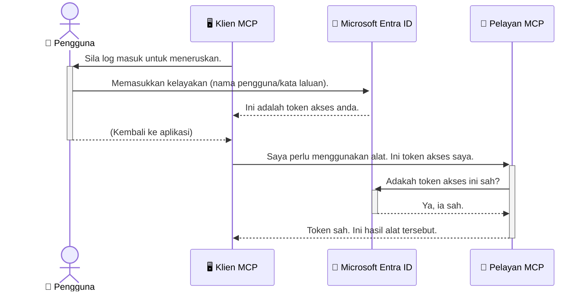

# Memastikan Aliran Kerja AI: Pengesahan Entra ID untuk Pelayan Protokol Konteks Model

> [!NOTE]
> Kod pelayan jauh dalam pelajaran ini melindungi titik akhir `/sse` dan `/message` lama
> dan mensasarkan MCP `2025-11-25`. Kekalkan identiti dan amalan pengesahan tokennya,
> tetapi gunakan pengangkutan HTTP Streamable yang serasi `2026-07-28` untuk
> pelaksanaan baharu.

## Pengenalan
Memastikan pelayan Protokol Konteks Model (MCP) anda selamat adalah sama penting seperti mengunci pintu depan rumah anda. Meninggalkan pelayan MCP anda terbuka mendedahkan alat dan data anda kepada akses tanpa kebenaran, yang boleh menyebabkan pelanggaran keselamatan. Microsoft Entra ID menyediakan penyelesaian pentadbiran identiti dan akses berasaskan awan yang kukuh, membantu memastikan hanya pengguna dan aplikasi yang dibenarkan boleh berinteraksi dengan pelayan MCP anda. Dalam bahagian ini, anda akan belajar cara melindungi aliran kerja AI anda menggunakan pengesahan Entra ID.

## Objektif Pembelajaran
Menjelang akhir bahagian ini, anda akan dapat:

- Memahami kepentingan memastikan pelayan MCP selamat.
- Menerangkan asas-asas Microsoft Entra ID dan pengesahan OAuth 2.0.
- Mengenal pasti perbezaan antara klien awam dan sulit.
- Melaksanakan pengesahan Entra ID dalam senario pelayan MCP tempatan (klien awam) dan jauh (klien sulit).
- Mengaplikasi amalan keselamatan terbaik semasa membangunkan aliran kerja AI.

## Keselamatan dan MCP

Sama seperti anda tidak akan membiarkan pintu depan rumah anda tidak dikunci, anda juga tidak sepatutnya membiarkan pelayan MCP anda terbuka untuk sesiapa mengakses. Memastikan aliran kerja AI anda selamat adalah penting untuk membina aplikasi yang kukuh, boleh dipercayai, dan selamat. Bab ini akan memperkenalkan anda kepada penggunaan Microsoft Entra ID untuk memastikan pelayan MCP anda selamat, memastikan hanya pengguna dan aplikasi yang dibenarkan boleh berinteraksi dengan alat dan data anda.

## Mengapa Keselamatan Penting untuk Pelayan MCP

Bayangkan pelayan MCP anda mempunyai alat yang boleh menghantar emel atau mengakses pangkalan data pelanggan. Pelayan yang tidak selamat bermakna sesiapa sahaja boleh menggunakan alat itu, menyebabkan akses data tanpa kebenaran, spam, atau aktiviti berniat jahat lain.

Dengan melaksanakan pengesahan, anda memastikan setiap permintaan ke pelayan anda disahkan, mengesahkan identiti pengguna atau aplikasi yang membuat permintaan. Ini adalah langkah pertama dan paling kritikal dalam memastikan aliran kerja AI anda selamat.

## Pengenalan kepada Microsoft Entra ID

[**Microsoft Entra ID**](https://adoption.microsoft.com/microsoft-security/entra/) ialah perkhidmatan pentadbiran identiti dan akses berasaskan awan. Anggap ia sebagai pengawal keselamatan sejagat untuk aplikasi anda. Ia mengendalikan proses yang rumit untuk mengesahkan identiti pengguna (pengesahan) dan menentukan apa yang mereka dibenarkan lakukan (kebenaran).

Dengan menggunakan Entra ID, anda boleh:

- Mengaktifkan log masuk yang selamat untuk pengguna.
- Melindungi API dan perkhidmatan.
- Mengurus dasar akses dari lokasi pusat.

Untuk pelayan MCP, Entra ID menyediakan penyelesaian yang kukuh dan dipercayai secara meluas untuk mengurus siapa yang boleh mengakses keupayaan pelayan anda.

---

## Memahami Keajaiban: Bagaimana Pengesahan Entra ID Berfungsi

Entra ID menggunakan piawaian terbuka seperti **OAuth 2.0** untuk mengendalikan pengesahan. Walaupun butiran boleh menjadi kompleks, konsep terasnya adalah mudah dan boleh difahami melalui analogi.

### Pengenalan Lembut kepada OAuth 2.0: Kunci Valet

Fikirkan OAuth 2.0 seperti perkhidmatan valet untuk kereta anda. Apabila anda tiba di restoran, anda tidak memberikan kunci induk anda kepada valet. Sebaliknya, anda memberikan **kunci valet** yang mempunyai kebenaran terhad—ia boleh menghidupkan kereta dan mengunci pintu, tetapi tidak boleh membuka but atau petak sarung tangan.

Dalam analogi ini:

- **Anda** ialah **Pengguna**.
- **Kereta anda** ialah **Pelayan MCP** dengan alat dan data berharga.
- **Valet** ialah **Microsoft Entra ID**.
- **Juruparkir** ialah **Klien MCP** (aplikasi yang cuba mengakses pelayan).
- **Kunci Valet** ialah **Token Akses**.

Token akses ialah rentetan teks selamat yang diterima klien MCP daripada Entra ID selepas anda log masuk. Klien kemudian mengemukakan token ini kepada pelayan MCP dengan setiap permintaan. Pelayan boleh mengesahkan token untuk memastikan permintaan itu sah dan klien mempunyai kebenaran yang diperlukan, tanpa perlu mengendalikan kelayakan sebenar anda (seperti kata laluan).

### Aliran Pengesahan

Berikut adalah bagaimana proses itu berfungsi secara amali:



### Memperkenalkan Microsoft Authentication Library (MSAL)

Sebelum kita menyelami kod, penting untuk memperkenalkan komponen utama yang akan anda lihat dalam contoh: **Microsoft Authentication Library (MSAL)**.

MSAL ialah perpustakaan yang dibangunkan oleh Microsoft yang memudahkan pembangun mengendalikan pengesahan. Daripada anda perlu menulis semua kod rumit untuk mengendalikan token keselamatan, mengurus log masuk, dan memanjangkan sesi, MSAL mengendalikan kerja berat.

Menggunakan perpustakaan seperti MSAL sangat disarankan kerana:

- **Ia Selamat:** Ia melaksanakan protokol piawaian industri dan amalan keselamatan terbaik, mengurangkan risiko kelemahan dalam kod anda.
- **Ia Memudahkan Pembangunan:** Ia mengabstrakkan kerumitan protokol OAuth 2.0 dan OpenID Connect, membolehkan anda menambah pengesahan kukuh ke aplikasi anda dengan beberapa baris kod sahaja.
- **Ia Diselenggara:** Microsoft secara aktif menyelenggara dan mengemas kini MSAL untuk menangani ancaman keselamatan baharu dan perubahan platform.

MSAL menyokong pelbagai bahasa dan rangka kerja aplikasi, termasuk .NET, JavaScript/TypeScript, Python, Java, Go, dan platform mudah alih seperti iOS dan Android. Ini bermakna anda boleh menggunakan corak pengesahan yang konsisten di seluruh tumpukan teknologi anda.

Untuk mengetahui lebih lanjut tentang MSAL, anda boleh rujuk dokumentasi rasmi [gambaran keseluruhan MSAL](https://learn.microsoft.com/entra/identity-platform/msal-overview).

---

## Memastikan Pelayan MCP Anda Selamat dengan Entra ID: Panduan Langkah demi Langkah

Sekarang, mari kita lalui cara untuk memastikan pelayan MCP tempatan (yang berkomunikasi melalui `stdio`) menggunakan Entra ID. Contoh ini menggunakan **klien awam**, sesuai untuk aplikasi yang berjalan pada mesin pengguna, seperti aplikasi desktop atau pelayan pembangunan tempatan.

### Senario 1: Memastikan Pelayan MCP Tempatan (dengan Klien Awam)

Dalam senario ini, kita lihat pelayan MCP yang berjalan secara tempatan, berkomunikasi melalui `stdio`, dan menggunakan Entra ID untuk mengesahkan pengguna sebelum membenarkan akses kepada alatnya. Pelayan akan mempunyai satu alat yang mengambil maklumat profil pengguna dari API Microsoft Graph.

#### 1. Menyediakan Aplikasi dalam Entra ID

Sebelum menulis sebarang kod, anda perlu mendaftarkan aplikasi anda dalam Microsoft Entra ID. Ini memberitahu Entra ID mengenai aplikasi anda dan memberikan kebenaran untuk menggunakan perkhidmatan pengesahan.

1. Navigasi ke **[portal Microsoft Entra](https://entra.microsoft.com/)**.
2. Pergi ke **Pendaftaran Aplikasi** dan klik **Pendaftaran baru**.
3. Berikan nama kepada aplikasi anda (contoh, "Pelayan MCP Tempatan Saya").
4. Untuk **Jenis akaun yang disokong**, pilih **Akaun dalam direktori organisasi ini sahaja**.
5. Anda boleh biarkan **URI Redirect** kosong untuk contoh ini.
6. Klik **Daftar**.

Setelah didaftarkan, ambil perhatian **ID Aplikasi (klien)** dan **ID Direktori (penyewa)**. Anda akan memerlukan ini dalam kod anda.

#### 2. Kod: Penjelasan

Mari lihat bahagian utama kod yang mengendalikan pengesahan. Kod penuh untuk contoh ini tersedia dalam folder [Entra ID - Tempatan - WAM](https://github.com/Azure-Samples/mcp-auth-servers/tree/main/src/entra-id-local-wam) di repositori [mcp-auth-servers GitHub](https://github.com/Azure-Samples/mcp-auth-servers).

**`AuthenticationService.cs`**

Kelas ini bertanggungjawab mengendalikan interaksi dengan Entra ID.

- **`CreateAsync`**: Kaedah ini memulakan `PublicClientApplication` dari MSAL (Microsoft Authentication Library). Ia dikonfigurasikan dengan `clientId` dan `tenantId` aplikasi anda.
- **`WithBroker`**: Ini membolehkan penggunaan broker (seperti Windows Web Account Manager), yang menyediakan pengalaman log masuk tunggal yang lebih selamat dan lancar.
- **`AcquireTokenAsync`**: Ini adalah kaedah teras. Ia pertama kali cuba mendapatkan token secara senyap (maknanya pengguna tidak perlu log masuk semula jika sudah ada sesi sah). Jika token senyap tidak dapat diperoleh, ia akan meminta pengguna log masuk secara interaktif.

```csharp
// Simplified for clarity
public static async Task<AuthenticationService> CreateAsync(ILogger<AuthenticationService> logger)
{
    var msalClient = PublicClientApplicationBuilder
        .Create(_clientId) // Your Application (client) ID
        .WithAuthority(AadAuthorityAudience.AzureAdMyOrg)
        .WithTenantId(_tenantId) // Your Directory (tenant) ID
        .WithBroker(new BrokerOptions(BrokerOptions.OperatingSystems.Windows))
        .Build();

    // ... cache registration ...

    return new AuthenticationService(logger, msalClient);
}

public async Task<string> AcquireTokenAsync()
{
    try
    {
        // Try silent authentication first
        var accounts = await _msalClient.GetAccountsAsync();
        var account = accounts.FirstOrDefault();

        AuthenticationResult? result = null;

        if (account != null)
        {
            result = await _msalClient.AcquireTokenSilent(_scopes, account).ExecuteAsync();
        }
        else
        {
            // If no account, or silent fails, go interactive
            result = await _msalClient.AcquireTokenInteractive(_scopes).ExecuteAsync();
        }

        return result.AccessToken;
    }
    catch (Exception ex)
    {
        _logger.LogError(ex, "An error occurred while acquiring the token.");
        throw; // Optionally rethrow the exception for higher-level handling
    }
}
```

**`Program.cs`**

Di sinilah pelayan MCP disediakan dan perkhidmatan pengesahan diintegrasikan.

- **`AddSingleton<AuthenticationService>`**: Ini mendaftar `AuthenticationService` dengan bekas suntikan kebergantungan, supaya ia boleh digunakan oleh bahagian lain aplikasi (seperti alat kami).
- **`GetUserDetailsFromGraph` tool**: Alat ini memerlukan instans `AuthenticationService`. Sebelum melakukan apa-apa, ia memanggil `authService.AcquireTokenAsync()` untuk mendapatkan token akses yang sah. Jika pengesahan berjaya, ia menggunakan token tersebut untuk memanggil API Microsoft Graph dan mengambil maklumat pengguna.

```csharp
// Simplified for clarity
[McpServerTool(Name = "GetUserDetailsFromGraph")]
public static async Task<string> GetUserDetailsFromGraph(
    AuthenticationService authService)
{
    try
    {
        // This will trigger the authentication flow
        var accessToken = await authService.AcquireTokenAsync();

        // Use the token to create a GraphServiceClient
        var graphClient = new GraphServiceClient(
            new BaseBearerTokenAuthenticationProvider(new TokenProvider(authService)));

        var user = await graphClient.Me.GetAsync();

        return System.Text.Json.JsonSerializer.Serialize(user);
    }
    catch (Exception ex)
    {
        return $"Error: {ex.Message}";
    }
}
```

#### 3. Bagaimana Ia Berfungsi Bersama

1. Apabila klien MCP cuba menggunakan alat `GetUserDetailsFromGraph`, alat itu pertama kali memanggil `AcquireTokenAsync`.
2. `AcquireTokenAsync` mencetuskan perpustakaan MSAL untuk memeriksa token yang sah.
3. Jika tiada token ditemui, MSAL, melalui broker, akan meminta pengguna untuk log masuk menggunakan akaun Entra ID mereka.
4. Setelah pengguna log masuk, Entra ID mengeluarkan token akses.
5. Alat menerima token tersebut dan menggunakannya untuk membuat panggilan selamat ke API Microsoft Graph.
6. Maklumat pengguna dikembalikan kepada klien MCP.

Proses ini memastikan hanya pengguna yang diautentikasi sahaja boleh menggunakan alat tersebut, dengan berkesan memastikan pelayan MCP tempatan anda selamat.

### Senario 2: Memastikan Pelayan MCP Jauh (dengan Klien Sulit)

Apabila pelayan MCP anda berjalan pada mesin jauh (seperti pelayan awan) dan berkomunikasi melalui protokol seperti HTTP Streaming, keperluan keselamatan adalah berbeza. Dalam kes ini, anda harus menggunakan **klien sulit** dan **Aliran Kod Kebenaran**. Ini adalah kaedah yang lebih selamat kerana rahsia aplikasi tidak pernah didedahkan kepada pelayar.

Contoh ini menggunakan pelayan MCP berasaskan TypeScript yang menggunakan Express.js untuk mengendalikan permintaan HTTP.

#### 1. Menyediakan Aplikasi dalam Entra ID

Persediaan di Entra ID adalah serupa dengan klien awam, tetapi dengan satu perbezaan utama: anda perlu membuat **rahsia klien**.

1. Navigasi ke **[portal Microsoft Entra](https://entra.microsoft.com/)**.
2. Dalam pendaftaran aplikasi anda, pergi ke tab **Sijil & rahsia**.
3. Klik **Rahsia klien baharu**, beri penerangan, dan klik **Tambah**.
4. **Penting:** Salin nilai rahsia dengan segera. Anda tidak akan dapat melihatnya lagi.
5. Anda juga perlu mengkonfigurasi **URI Redirect**. Pergi ke tab **Pengesahan**, klik **Tambah platform**, pilih **Web**, dan masukkan URI redirect untuk aplikasi anda (contoh, `http://localhost:3001/auth/callback`).

> **⚠️ Nota Keselamatan Penting:** Untuk aplikasi pengeluaran, Microsoft sangat mengesyorkan menggunakan kaedah pengesahan tanpa rahsia seperti **Identiti Terurus** atau **Persekutuan Identiti Beban Kerja** daripada menggunakan rahsia klien. Rahsia klien membawa risiko keselamatan kerana boleh terdedah atau dikompromi. Identiti terurus menyediakan pendekatan yang lebih selamat dengan menghapuskan keperluan menyimpan kelayakan dalam kod atau konfigurasi anda.
>
> Untuk maklumat lebih lanjut tentang identiti terurus dan cara melaksanakannya, lihat [Gambaran keseluruhan identiti terurus untuk sumber Azure](https://learn.microsoft.com/entra/identity/managed-identities-azure-resources/overview).

#### 2. Kod: Penjelasan

Contoh ini menggunakan pendekatan berasaskan sesi. Apabila pengguna mengesahkan, pelayan menyimpan token akses dan token penyegaran dalam sesi dan memberi pengguna token sesi. Token sesi ini kemudiannya digunakan untuk permintaan berikutnya. Kod penuh untuk contoh ini tersedia dalam folder [Entra ID - Klien sulit](https://github.com/Azure-Samples/mcp-auth-servers/tree/main/src/entra-id-cca-session) di repositori [mcp-auth-servers GitHub](https://github.com/Azure-Samples/mcp-auth-servers).

**`Server.ts`**

Fail ini menyediakan pelayan Express dan lapisan pengangkutan MCP.

- **`requireBearerAuth`**: Ini ialah middleware yang melindungi titik akhir `/sse` dan `/message`. Ia memeriksa token pembawa yang sah dalam header `Authorization` permintaan.
- **`EntraIdServerAuthProvider`**: Ini ialah kelas khusus yang melaksanakan antara muka `McpServerAuthorizationProvider`. Ia bertanggungjawab mengendalikan aliran OAuth 2.0.
- **`/auth/callback`**: Titik akhir ini mengendalikan pengalihan dari Entra ID selepas pengguna mengesahkan. Ia menukar kod kebenaran kepada token akses dan token penyegaran.

```typescript
// Dipermudahkan untuk kejelasan
const app = express();
const { server } = createServer();
const provider = new EntraIdServerAuthProvider();

// Lindungi titik akhir SSE
app.get("/sse", requireBearerAuth({
  provider,
  requiredScopes: ["User.Read"]
}), async (req, res) => {
  // ... sambungkan ke pengangkutan ...
});

// Lindungi titik akhir mesej
app.post("/message", requireBearerAuth({
  provider,
  requiredScopes: ["User.Read"]
}), async (req, res) => {
  // ... kendalikan mesej ...
});

// Kendalikan panggilan balik OAuth 2.0
app.get("/auth/callback", (req, res) => {
  provider.handleCallback(req.query.code, req.query.state)
    .then(result => {
      // ... kendalikan kejayaan atau kegagalan ...
    });
});
```

**`Tools.ts`**

Fail ini mentakrifkan alat yang disediakan pelayan MCP. Alat `getUserDetails` serupa dengan contoh sebelumnya, tetapi ia mendapatkan token akses dari sesi.

```typescript
// Dipermudahkan untuk kejelasan
server.setRequestHandler(CallToolRequestSchema, async (request) => {
  const { name } = request.params;
  const context = request.params?.context as { token?: string } | undefined;
  const sessionToken = context?.token;

  if (name === ToolName.GET_USER_DETAILS) {
    if (!sessionToken) {
      throw new AuthenticationError("Authentication token is missing or invalid. Ensure the token is provided in the request context.");
    }

    // Dapatkan token Entra ID dari penyimpanan sesi
    const tokenData = tokenStore.getToken(sessionToken);
    const entraIdToken = tokenData.accessToken;

    const graphClient = Client.init({
      authProvider: (done) => {
        done(null, entraIdToken);
      }
    });

    const user = await graphClient.api('/me').get();

    // ... pulangkan butiran pengguna ...
  }
});
```

**`auth/EntraIdServerAuthProvider.ts`**

Kelas ini mengendalikan logik untuk:

- Mengalihkan pengguna ke halaman log masuk Entra ID.
- Menukar kod kebenaran kepada token akses.
- Menyimpan token dalam `tokenStore`.
- Memanjangkan token akses apabila ia tamat tempoh.


#### 3. Bagaimana Semua Ini Berfungsi Bersama

1. Apabila pengguna pertama kali cuba menyambung ke pelayan MCP, middleware `requireBearerAuth` akan melihat bahawa mereka tidak mempunyai sesi yang sah dan akan mengalih mereka ke halaman log masuk Entra ID.
2. Pengguna log masuk dengan akaun Entra ID mereka.
3. Entra ID mengalihkan pengguna kembali ke titik akhir `/auth/callback` dengan kod kebenaran.
4. Pelayan menukar kod tersebut dengan token akses dan token penyegaran, menyimpannya, dan mencipta token sesi yang dihantar ke klien.
5. Klien kini boleh menggunakan token sesi ini dalam header `Authorization` untuk semua permintaan masa depan ke pelayan MCP.
6. Apabila alat `getUserDetails` dipanggil, ia menggunakan token sesi untuk mencari token akses Entra ID dan kemudian menggunakan itu untuk memanggil Microsoft Graph API.

Aliran ini lebih kompleks daripada aliran klien awam, tetapi diperlukan untuk titik akhir yang berhadapan dengan internet. Oleh kerana pelayan MCP jauh boleh diakses melalui internet awam, mereka memerlukan langkah keselamatan yang lebih kukuh untuk melindungi daripada akses tidak sah dan potensi serangan.


## Amalan Terbaik Keselamatan

- **Sentiasa gunakan HTTPS**: Enkripsi komunikasi antara klien dan pelayan untuk melindungi token daripada dicegat.
- **Laksanakan Kawalan Akses Berdasarkan Peranan (RBAC)**: Jangan hanya periksa *jika* pengguna diautentikasi; periksa *apa* yang mereka dibenarkan lakukan. Anda boleh mentakrifkan peranan dalam Entra ID dan menyemaknya dalam pelayan MCP anda.
- **Pantau dan audit**: Log semua acara pengesahan supaya anda boleh mengesan dan bertindak balas terhadap aktiviti mencurigakan.
- **Urus had kadar dan throttling**: Microsoft Graph dan API lain melaksanakan had kadar untuk mengelakkan penyalahgunaan. Laksanakan exponential backoff dan logik cuba semula dalam pelayan MCP anda untuk mengendalikan respons HTTP 429 (Terlalu Banyak Permintaan) dengan baik. Pertimbangkan caching data yang sering diakses untuk mengurangkan panggilan API.
- **Penyimpanan token yang selamat**: Simpan token akses dan token penyegaran dengan selamat. Untuk aplikasi tempatan, gunakan mekanisme penyimpanan selamat sistem. Untuk aplikasi pelayan, pertimbangkan menggunakan penyimpanan rentas atau perkhidmatan pengurusan kunci selamat seperti Azure Key Vault.
- **Pengendalian tempoh tamat token**: Token akses mempunyai jangka hayat yang terhad. Laksanakan penyegaran token automatik menggunakan token penyegaran untuk mengekalkan pengalaman pengguna yang lancar tanpa memerlukan pengesahan semula.
- **Pertimbangkan menggunakan Pengurusan API Azure**: Walaupun melaksanakan keselamatan secara terus dalam pelayan MCP anda memberikan kawalan terperinci, Gerbang API seperti Pengurusan API Azure boleh mengendalikan banyak kebimbangan keselamatan ini secara automatik, termasuk pengesahan, kebenaran, had kadar, dan pemantauan. Mereka menyediakan lapisan keselamatan berpusat yang duduk di antara klien anda dan pelayan MCP anda. Untuk maklumat lanjut mengenai menggunakan Gerbang API dengan MCP, lihat [Azure API Management Your Auth Gateway For MCP Servers](https://techcommunity.microsoft.com/blog/integrationsonazureblog/azure-api-management-your-auth-gateway-for-mcp-servers/4402690).


##  Pengajaran Utama

- Mengekalkan keselamatan pelayan MCP anda adalah penting untuk melindungi data dan alat anda.
- Microsoft Entra ID menyediakan penyelesaian yang kukuh dan boleh berkembang untuk pengesahan dan kebenaran.
- Gunakan **klien awam** untuk aplikasi tempatan dan **klien sulit** untuk pelayan jauh.
- Aliran **Kod Kebenaran** adalah pilihan paling selamat untuk aplikasi web.


## Latihan

1. Fikirkan tentang pelayan MCP yang mungkin anda bina. Adakah ia pelayan tempatan atau pelayan jauh?
2. Berdasarkan jawapan anda, adakah anda akan menggunakan klien awam atau sulit?
3. Apakah keizinan yang akan diminta oleh pelayan MCP anda untuk melaksanakan tindakan terhadap Microsoft Graph?


## Latihan Praktikal

### Latihan 1: Daftar Aplikasi dalam Entra ID
Navigasi ke portal Microsoft Entra.
Daftar aplikasi baru untuk pelayan MCP anda.
Rekodkan ID Aplikasi (klien) dan ID Direktori (penyewa).

### Latihan 2: Amankan Pelayan MCP Tempatan (Klien Awam)
- Ikuti contoh kod untuk mengintegrasikan MSAL (Perpustakaan Pengesahan Microsoft) untuk pengesahan pengguna.
- Uji aliran pengesahan dengan memanggil alat MCP yang mengambil butiran pengguna dari Microsoft Graph.

### Latihan 3: Amankan Pelayan MCP Jauh (Klien Sulit)
- Daftar klien sulit dalam Entra ID dan cipta rahsia klien.
- Konfigurasikan pelayan Express.js MCP anda untuk menggunakan Aliran Kod Kebenaran.
- Uji titik akhir terlindung dan sahkan akses berdasarkan token.

### Latihan 4: Gunakan Amalan Terbaik Keselamatan
- Aktifkan HTTPS untuk pelayan tempatan atau jauh anda.
- Laksanakan kawalan akses berdasarkan peranan (RBAC) dalam logik pelayan anda.
- Tambah pengendalian tamat tempoh token dan penyimpanan token yang selamat.

## Sumber

1. **Dokumentasi Gambaran Keseluruhan MSAL**  
   Ketahui bagaimana Microsoft Authentication Library (MSAL) membolehkan pemerolehan token yang selamat merentasi platform:  
   [MSAL Overview on Microsoft Learn](https://learn.microsoft.com/en-gb/entra/msal/overview)

2. **Repositori GitHub Azure-Samples/mcp-auth-servers**  
   Implementasi rujukan pelayan MCP yang menunjukkan aliran pengesahan:  
   [Azure-Samples/mcp-auth-servers on GitHub](https://github.com/Azure-Samples/mcp-auth-servers)

3. **Gambaran Keseluruhan Identiti Terurus untuk Sumber Azure**  
   Fahami bagaimana untuk menghapuskan rahsia dengan menggunakan identiti terurus yang diberikan oleh sistem atau pengguna:  
   [Managed Identities Overview on Microsoft Learn](https://learn.microsoft.com/en-us/entra/identity/managed-identities-azure-resources/)

4. **Pengurusan API Azure: Gerbang Pengesahan Anda untuk Pelayan MCP**  
   Penjelasan mendalam menggunakan APIM sebagai gerbang OAuth2 yang selamat untuk pelayan MCP:  
   [Azure API Management Your Auth Gateway For MCP Servers](https://techcommunity.microsoft.com/blog/integrationsonazureblog/azure-api-management-your-auth-gateway-for-mcp-servers/4402690)

5. **Rujukan Kebenaran Microsoft Graph**  
   Senarai komprehensif kebenaran yang didelagasi dan permohonan untuk Microsoft Graph:  
   [Microsoft Graph Permissions Reference](https://learn.microsoft.com/zh-tw/graph/permissions-reference)


## Hasil Pembelajaran
Selepas menyelesaikan bahagian ini, anda akan dapat:

- Menyatakan mengapa pengesahan adalah kritikal untuk pelayan MCP dan aliran kerja AI.
- Menyediakan dan mengkonfigurasi pengesahan Entra ID untuk kedua-dua senario pelayan MCP tempatan dan jauh.
- Memilih jenis klien yang sesuai (awam atau sulit) berdasarkan penyebaran pelayan anda.
- Melaksanakan amalan pengkodan selamat, termasuk penyimpanan token dan kebenaran berasaskan peranan.
- Melindungi pelayan MCP anda dan alat-alatnya daripada akses tidak sah dengan yakin.

## Apa Seterusnya 

- [5.13 Model Context Protocol (MCP) Integration with Microsoft Foundry](../mcp-foundry-agent-integration/README.md)

---

<!-- CO-OP TRANSLATOR DISCLAIMER START -->
**Penafian**:
Dokumen ini telah diterjemahkan menggunakan perkhidmatan terjemahan AI [Co-op Translator](https://github.com/Azure/co-op-translator). Walaupun kami berusaha untuk ketepatan, sila ambil maklum bahawa terjemahan automatik mungkin mengandungi kesilapan atau ketidaktepatan. Dokumen asal dalam bahasa asalnya harus dianggap sebagai sumber yang sahih. Untuk maklumat penting, terjemahan oleh manusia profesional adalah disyorkan. Kami tidak bertanggungjawab terhadap sebarang salah faham atau salah tafsir yang timbul daripada penggunaan terjemahan ini.
<!-- CO-OP TRANSLATOR DISCLAIMER END -->