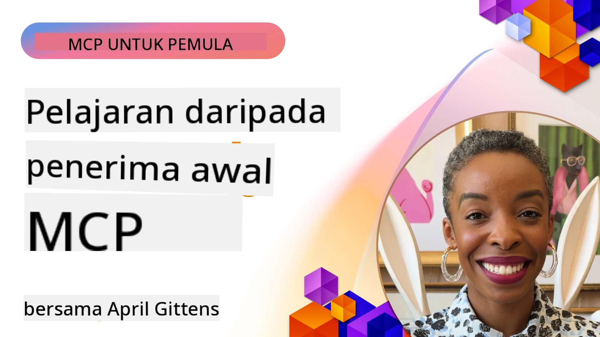

# 🌟 Pengajaran daripada Pengguna Awal

[](https://youtu.be/jds7dSmNptE)

_(Klik pada imej di atas untuk menonton video pengajaran ini)_

## 🎯 Apa yang Modul Ini Liputi

Modul ini meneroka bagaimana organisasi sebenar dan pemaju menggunakan Model Context Protocol (MCP) untuk menyelesaikan cabaran sebenar dan memacu inovasi. Melalui kajian kes yang terperinci, projek praktikal, dan contoh yang praktikal, anda akan menemui bagaimana MCP membolehkan integrasi AI yang selamat, boleh diskalakan yang menghubungkan model bahasa, alat, dan data perusahaan.

### 📚 Lihat MCP dalam Tindakan

Mahu melihat prinsip-prinsip ini diterapkan pada alat bersedia pengeluaran? Lihat [**10 Microsoft MCP Servers Yang Mempertingkatkan Produktiviti Pemaju**](microsoft-mcp-servers.md), yang memaparkan server MCP Microsoft sebenar yang boleh anda gunakan hari ini.

## Gambaran Keseluruhan

Pengajaran ini meneroka bagaimana pengguna awal telah menggunakan Model Context Protocol (MCP) untuk menyelesaikan cabaran dunia nyata dan memacu inovasi merentasi industri. Melalui kajian kes terperinci dan projek praktikal, anda akan melihat bagaimana MCP membolehkan integrasi AI yang distandardkan, selamat, dan boleh diskalakan—menghubungkan model bahasa besar, alat, dan data perusahaan dalam kerangka yang bersatu. Anda akan mendapat pengalaman praktikal mereka bentuk dan membina penyelesaian berasaskan MCP, belajar daripada corak pelaksanaan yang terbukti, dan menemui amalan terbaik untuk melaksanakan MCP dalam persekitaran pengeluaran. Pengajaran ini juga menonjolkan trend yang muncul, arah masa depan, dan sumber terbuka untuk membantu anda kekal di barisan hadapan teknologi MCP dan ekosistem yang berkembang.

## Objektif Pembelajaran

- Menganalisis pelaksanaan MCP dunia nyata merentasi pelbagai industri
- Reka dan bina aplikasi lengkap berasaskan MCP
- Meneroka trend yang muncul dan arah masa depan dalam teknologi MCP
- Gunakan amalan terbaik dalam senario pembangunan sebenar

## Pelaksanaan MCP Dunia Nyata

### Kajian Kes 1: Automasi Sokongan Pelanggan Enterprise

Sebuah korporat multinasional melaksanakan penyelesaian berasaskan MCP untuk menstandardkan interaksi AI merentasi sistem sokongan pelanggan mereka. Ini membolehkan mereka:

- Mewujudkan antara muka bersatu untuk pelbagai pembekal LLM
- Menyenggara pengurusan prompt yang konsisten merentasi jabatan
- Melaksanakan kawalan keselamatan dan pematuhan yang kukuh
- Mudah bertukar antara model AI yang berbeza berdasarkan keperluan tertentu

**Pelaksanaan Teknikal:**

```python
# Pelaksanaan pelayan MCP Python untuk sokongan pelanggan
import logging
import asyncio
from modelcontextprotocol import create_server, ServerConfig
from modelcontextprotocol.server import MCPServer
from modelcontextprotocol.transports import create_http_transport
from modelcontextprotocol.resources import ResourceDefinition
from modelcontextprotocol.prompts import PromptDefinition
from modelcontextprotocol.tool import ToolDefinition

# Konfigurasikan pencatatan
logging.basicConfig(level=logging.INFO)

async def main():
    # Buat konfigurasi pelayan
    config = ServerConfig(
        name="Enterprise Customer Support Server",
        version="1.0.0",
        description="MCP server for handling customer support inquiries"
    )
    
    # Mulakan pelayan MCP
    server = create_server(config)
    
    # Daftarkan sumber pangkalan pengetahuan
    server.resources.register(
        ResourceDefinition(
            name="customer_kb",
            description="Customer knowledge base documentation"
        ),
        lambda params: get_customer_documentation(params)
    )
    
    # Daftarkan templat arahan
    server.prompts.register(
        PromptDefinition(
            name="support_template",
            description="Templates for customer support responses"
        ),
        lambda params: get_support_templates(params)
    )
    
    # Daftarkan alat sokongan
    server.tools.register(
        ToolDefinition(
            name="ticketing",
            description="Create and update support tickets"
        ),
        handle_ticketing_operations
    )
    
    # Mulakan pelayan dengan pengangkutan HTTP
    transport = create_http_transport(port=8080)
    await server.run(transport)

if __name__ == "__main__":
    asyncio.run(main())
```

**Keputusan:** Pengurangan kos model sebanyak 30%, peningkatan konsistensi tindak balas sebanyak 45%, dan pematuhan yang dipertingkatkan merentasi operasi global.

### Kajian Kes 2: Pembantu Diagnostik Penjagaan Kesihatan

Penyedia penjagaan kesihatan membangunkan infrastruktur MCP untuk mengintegrasikan pelbagai model AI perubatan khusus sambil memastikan data pesakit sensitif kekal dilindungi:

- Penukaran lancar antara model perubatan umum dan khusus
- Kawalan privasi ketat dan jejak audit
- Integrasi dengan sistem Rekod Kesihatan Elektronik (EHR) sedia ada
- Kejuruteraan prompt yang konsisten untuk terminologi perubatan

**Pelaksanaan Teknikal:**

```csharp
// C# MCP host application implementation in healthcare application
using Microsoft.Extensions.DependencyInjection;
using ModelContextProtocol.SDK.Client;
using ModelContextProtocol.SDK.Security;
using ModelContextProtocol.SDK.Resources;

public class DiagnosticAssistant
{
    private readonly MCPHostClient _mcpClient;
    private readonly PatientContext _patientContext;
    
    public DiagnosticAssistant(PatientContext patientContext)
    {
        _patientContext = patientContext;
        
        // Configure MCP client with healthcare-specific settings
        var clientOptions = new ClientOptions
        {
            Name = "Healthcare Diagnostic Assistant",
            Version = "1.0.0",
            Security = new SecurityOptions
            {
                Encryption = EncryptionLevel.Medical,
                AuditEnabled = true
            }
        };
        
        _mcpClient = new MCPHostClientBuilder()
            .WithOptions(clientOptions)
            .WithTransport(new HttpTransport("https://healthcare-mcp.example.org"))
            .WithAuthentication(new HIPAACompliantAuthProvider())
            .Build();
    }
    
    public async Task<DiagnosticSuggestion> GetDiagnosticAssistance(
        string symptoms, string patientHistory)
    {
        // Create request with appropriate resources and tool access
        var resourceRequest = new ResourceRequest
        {
            Name = "patient_records",
            Parameters = new Dictionary<string, object>
            {
                ["patientId"] = _patientContext.PatientId,
                ["requestingProvider"] = _patientContext.ProviderId
            }
        };
        
        // Request diagnostic assistance using appropriate prompt
        var response = await _mcpClient.SendPromptRequestAsync(
            promptName: "diagnostic_assistance",
            parameters: new Dictionary<string, object>
            {
                ["symptoms"] = symptoms,
                patientHistory = patientHistory,
                relevantGuidelines = _patientContext.GetRelevantGuidelines()
            });
            
        return DiagnosticSuggestion.FromMCPResponse(response);
    }
}
```

**Keputusan:** Cadangan diagnostik yang dipertingkatkan untuk doktor sambil mengekalkan pematuhan penuh HIPAA dan pengurangan ketara dalam penukaran konteks antara sistem.

### Kajian Kes 3: Analisis Risiko Perkhidmatan Kewangan

Institusi kewangan melaksanakan MCP untuk menstandardkan proses analisis risiko mereka merentasi jabatan yang berbeza:

- Mewujudkan antara muka bersatu untuk model risiko kredit, pengesanan penipuan, dan risiko pelaburan
- Melaksanakan kawalan akses dan pemversian model yang ketat
- Menjamin audibiliti semua cadangan AI
- Menyenggara format data yang konsisten merentasi sistem yang pelbagai

**Pelaksanaan Teknikal:**

```java
// Pelayan MCP Java untuk penilaian risiko kewangan
import org.mcp.server.*;
import org.mcp.security.*;

public class FinancialRiskMCPServer {
    public static void main(String[] args) {
        // Buat pelayan MCP dengan ciri pematuhan kewangan
        MCPServer server = new MCPServerBuilder()
            .withModelProviders(
                new ModelProvider("risk-assessment-primary", new AzureOpenAIProvider()),
                new ModelProvider("risk-assessment-audit", new LocalLlamaProvider())
            )
            .withPromptTemplateDirectory("./compliance/templates")
            .withAccessControls(new SOCCompliantAccessControl())
            .withDataEncryption(EncryptionStandard.FINANCIAL_GRADE)
            .withVersionControl(true)
            .withAuditLogging(new DatabaseAuditLogger())
            .build();
            
        server.addRequestValidator(new FinancialDataValidator());
        server.addResponseFilter(new PII_RedactionFilter());
        
        server.start(9000);
        
        System.out.println("Financial Risk MCP Server running on port 9000");
    }
}
```

**Keputusan:** Pematuhan peraturan yang dipertingkatkan, kitaran pelaksanaan model 40% lebih pantas, dan konsistensi penilaian risiko yang diperbaiki merentasi jabatan.

### Kajian Kes 4: Server Playwright MCP Microsoft untuk Automasi Pelayar

Microsoft membangunkan [Server Playwright MCP](https://github.com/microsoft/playwright-mcp) untuk membolehkan automasi pelayar yang selamat dan distandardkan melalui Model Context Protocol. Server bersedia pengeluaran ini membolehkan ejen AI dan LLM berinteraksi dengan pelayar web secara terkawal, boleh diaudit, dan boleh dikembangkan—membolehkan kes penggunaan seperti ujian web automatik, pengekstrakan data, dan aliran kerja hujung ke hujung.

> **🎯 Alat Sedia Pengeluaran**
> 
> Kajian kes ini memaparkan server MCP sebenar yang boleh anda gunakan hari ini! Ketahui lebih lanjut mengenai Server Playwright MCP dan 9 server MCP Microsoft lain yang bersedia pengeluaran dalam [**Panduan Server MCP Microsoft**](microsoft-mcp-servers.md#8--playwright-mcp-server).

**Ciri Utama:**
- Mendedahkan kemampuan automasi pelayar (navigasi, isian borang, tangkapan skrin, dsb.) sebagai alat MCP
- Melaksanakan kawalan akses ketat dan sandboxing untuk mengelakkan tindakan tidak dibenarkan
- Menyediakan log audit terperinci untuk semua interaksi pelayar
- Menyokong integrasi dengan Azure OpenAI dan pembekal LLM lain untuk automasi berasaskan ejen
- Menyokong Ejen Pengkodan GitHub Copilot dengan kemampuan pelayaran web

**Pelaksanaan Teknikal:**

```typescript
// TypeScript: Mendaftar alat automasi pelayar Playwright dalam pelayan MCP
import { createServer, ToolDefinition } from 'modelcontextprotocol';
import { launch } from 'playwright';

const server = createServer({
  name: 'Playwright MCP Server',
  version: '1.0.0',
  description: 'MCP server for browser automation using Playwright'
});

// Daftar alat untuk menavigasi ke URL dan menangkap tangkapan skrin
server.tools.register(
  new ToolDefinition({
    name: 'navigate_and_screenshot',
    description: 'Navigate to a URL and capture a screenshot',
    parameters: {
      url: { type: 'string', description: 'The URL to visit' }
    }
  }),
  async ({ url }) => {
    const browser = await launch();
    const page = await browser.newPage();
    await page.goto(url);
    const screenshot = await page.screenshot();
    await browser.close();
    return { screenshot };
  }
);

// Mulakan pelayan MCP
server.listen(8080);
```

**Keputusan:**

- Membolehkan automasi pelayar secara programatik yang selamat untuk ejen AI dan LLM
- Mengurangkan usaha ujian manual dan meningkatkan liputan ujian untuk aplikasi web
- Menyediakan kerangka kerja boleh guna semula dan boleh dikembangkan untuk integrasi alat berasaskan pelayar dalam persekitaran perusahaan
- Menyokong kemampuan pelayaran web GitHub Copilot

**Rujukan:**

- [Repositori GitHub Server Playwright MCP](https://github.com/microsoft/playwright-mcp)
- [Penyelesaian AI dan Automasi Microsoft](https://azure.microsoft.com/en-us/products/ai-services/)

### Kajian Kes 5: Azure MCP – Model Context Protocol Tahap Perusahaan sebagai Perkhidmatan

Azure MCP Server ([https://aka.ms/azmcp](https://aka.ms/azmcp)) ialah pelaksanaan MCP tahap perusahaan yang diurus oleh Microsoft, direka untuk menyediakan kemampuan server MCP yang boleh diskalakan, selamat, dan mematuhi peraturan sebagai perkhidmatan awan. Azure MCP membolehkan organisasi melaksanakan, mengurus, dan mengintegrasikan server MCP dengan Azure AI, data, dan perkhidmatan keselamatan dengan cepat, mengurangkan beban operasi dan mempercepat penerimaan AI.

> **🎯 Alat Sedia Pengeluaran**
> 
> Ini adalah server MCP sebenar yang boleh anda gunakan hari ini! Ketahui lebih lanjut mengenai Server Foundry MCP Microsoft dalam [**Panduan Server MCP Microsoft**](microsoft-mcp-servers.md).


- Penghosan server MCP sepenuhnya diurus dengan skala, pemantauan, dan keselamatan terbina dalam
- Integrasi asli dengan Azure OpenAI, Azure AI Search, dan perkhidmatan Azure lain
- Pengesahan dan kebenaran perusahaan melalui Microsoft Entra ID
- Sokongan untuk alat khusus, templat prompt, dan penyambung sumber
- Pematuhan dengan keselamatan dan keperluan peraturan perusahaan

**Pelaksanaan Teknikal:**

```yaml
# Example: Azure MCP server deployment configuration (YAML)
apiVersion: mcp.microsoft.com/v1
kind: McpServer
metadata:
  name: enterprise-mcp-server
spec:
  modelProviders:
    - name: azure-openai
      type: AzureOpenAI
      endpoint: https://<your-openai-resource>.openai.azure.com/
      apiKeySecret: <your-azure-keyvault-secret>
  tools:
    - name: document_search
      type: AzureAISearch
      endpoint: https://<your-search-resource>.search.windows.net/
      apiKeySecret: <your-azure-keyvault-secret>
  authentication:
    type: EntraID
    tenantId: <your-tenant-id>
  monitoring:
    enabled: true
    logAnalyticsWorkspace: <your-log-analytics-id>
```

**Keputusan:**
- Mengurangkan masa untuk nilai bagi projek AI perusahaan dengan menyediakan platform server MCP siap guna dan mematuhi
- Memudahkan integrasi LLM, alat, dan sumber data perusahaan
- Meningkatkan keselamatan, kebolehamatan, dan kecekapan operasi untuk beban kerja MCP
- Memperbaiki kualiti kod dengan amalan terbaik SDK Azure dan corak pengesahan terkini

**Rujukan:**
- [Dokumentasi Azure MCP](https://aka.ms/azmcp)
- [Repositori GitHub Server Azure MCP](https://github.com/Azure/azure-mcp)
- [Perkhidmatan AI Azure](https://azure.microsoft.com/en-us/products/ai-services/)
- [Pusat MCP Microsoft](https://mcp.azure.com)

## Kajian Kes 6: NLWeb 
MCP (Model Context Protocol) ialah protokol yang sedang berkembang untuk Chatbot dan pembantu AI berinteraksi dengan alat. Setiap instans NLWeb juga merupakan server MCP, yang menyokong satu kaedah teras, ask, yang digunakan untuk bertanya kepada laman web soalan dalam bahasa semula jadi. Respons yang dikembalikan menggunakan schema.org, sebuah kosa kata yang digunakan meluas untuk menerangkan data web. Secara longgar, MCP adalah NLWeb seperti Http kepada HTML. NLWeb menggabungkan protokol, format Schema.org, dan kod contoh untuk membantu laman web dengan cepat mewujudkan endpoint ini, memberi manfaat kepada kedua-dua manusia melalui antara muka perbualan dan mesin melalui interaksi agen-ke-agen secara semula jadi.

Terdapat dua komponen berbeza kepada NLWeb.
- Satu protokol, sangat mudah untuk bermula, untuk berinteraksi dengan laman web dalam bahasa semula jadi dan satu format, menggunakan json dan schema.org untuk jawapan yang dikembalikan. Lihat dokumentasi API REST untuk maklumat lanjut.
- Satu pelaksanaan mudah (1) yang memanfaatkan markup sedia ada, untuk laman yang boleh diabstrakkan sebagai senarai item (produk, resipi, tarikan, ulasan, dsb.). Bersama-sama dengan set widget antara muka pengguna, laman web boleh dengan mudah menyediakan antara muka perbualan kepada kandungan mereka. Lihat dokumentasi Life of a chat query untuk maklumat lanjut tentang cara ini berfungsi.
 
**Rujukan:**
- [Dokumentasi Azure MCP](https://aka.ms/azmcp)
- [NLWeb](https://github.com/microsoft/NlWeb)

### Kajian Kes 7: Server Foundry MCP Microsoft – Integrasi Ejen AI Enterprise

Server Foundry MCP Microsoft mempamerkan bagaimana MCP boleh digunakan untuk mengatur dan mengurus ejen AI dan aliran kerja dalam persekitaran perusahaan. Dengan mengintegrasikan MCP dengan Microsoft Foundry, organisasi boleh menstandardkan interaksi ejen, menggunakan pengurusan aliran kerja Foundry, dan memastikan pelaksanaan yang selamat dan boleh diskalakan.

> **🎯 Alat Sedia Pengeluaran**
> 
> Ini adalah server MCP sebenar yang boleh anda gunakan hari ini! Ketahui lebih lanjut mengenai Server Foundry MCP Microsoft dalam [**Panduan Server MCP Microsoft**](microsoft-mcp-servers.md#9--microsoft-foundry-mcp-server).

**Ciri Utama:**
- Akses komprehensif ke ekosistem AI Azure, termasuk katalog model dan pengurusan pelaksanaan
- Pengindeksan ilmu dengan Azure AI Search untuk aplikasi RAG
- Alat penilaian untuk prestasi model AI dan jaminan kualiti
- Integrasi dengan Microsoft Foundry Catalog dan Labs untuk model penyelidikan terkini
- Pengurusan dan penilaian ejen untuk senario pengeluaran

**Keputusan:**
- Prototaip cepat dan pemantauan kukuh aliran kerja ejen AI
- Integrasi lancar dengan perkhidmatan Azure AI untuk senario maju
- Antara muka bersatu untuk membina, melaksanakan, dan memantau saluran ejen
- Keselamatan, pematuhan, dan kecekapan operasi yang dipertingkatkan untuk perusahaan
- Percepatan penerimaan AI sambil mengekalkan kawalan ke atas proses berasaskan ejen yang kompleks

**Rujukan:**
- [Repositori GitHub Server Foundry MCP Microsoft](https://github.com/azure-ai-foundry/mcp-foundry)
- [Mengintegrasi Ejen Azure AI dengan MCP (Blog Microsoft Foundry)](https://devblogs.microsoft.com/foundry/integrating-azure-ai-agents-mcp/)

### Kajian Kes 8: Foundry MCP Playground – Eksperimen dan Prototaip

Foundry MCP Playground menawarkan persekitaran siap guna untuk bereksperimen dengan server MCP dan integrasi Microsoft Foundry. Pemaju boleh dengan cepat membuat prototaip, menguji, dan menilai model AI dan aliran kerja ejen menggunakan sumber daripada Microsoft Foundry Catalog dan Labs. Playground mempermudah penyediaan, menyediakan projek contoh, dan menyokong pembangunan kolaboratif, memudahkan penerokaan amalan terbaik dan senario baru dengan beban minimum. Ia amat berguna untuk pasukan yang ingin mengesahkan idea, berkongsi eksperimen, dan mempercepat pembelajaran tanpa memerlukan infrastruktur yang kompleks. Dengan menurunkan halangan kemasukan, playground membantu memupuk inovasi dan sumbangan komuniti dalam ekosistem MCP dan Microsoft Foundry.

**Rujukan:**

- [Repositori GitHub Foundry MCP Playground](https://github.com/azure-ai-foundry/foundry-mcp-playground)

### Kajian Kes 9: Server Microsoft Learn Docs MCP – Akses Dokumentasi Berkuasa AI

Server Microsoft Learn Docs MCP ialah perkhidmatan dihoskan awan yang menyediakan pembantu AI dengan akses masa nyata ke dokumentasi rasmi Microsoft melalui Model Context Protocol. Server bersedia pengeluaran ini menghubungkan ke ekosistem Microsoft Learn yang komprehensif dan membolehkan carian semantik merentasi semua sumber rasmi Microsoft.

> **🎯 Alat Sedia Pengeluaran**
> 
> Ini adalah server MCP sebenar yang boleh anda gunakan hari ini! Ketahui lebih lanjut mengenai Server Microsoft Learn Docs MCP dalam [**Panduan Server MCP Microsoft**](microsoft-mcp-servers.md#1--microsoft-learn-docs-mcp-server).

**Ciri Utama:**
- Akses masa nyata ke dokumentasi rasmi Microsoft, dokumentasi Azure, dan dokumentasi Microsoft 365
- Keupayaan carian semantik maju yang memahami konteks dan niat
- Maklumat sentiasa dikemaskini apabila kandungan Microsoft Learn diterbitkan
- Liputan komprehensif merentasi Microsoft Learn, dokumentasi Azure, dan sumber Microsoft 365
- Mengembalikan hingga 10 bahagian kandungan berkualiti tinggi dengan tajuk artikel dan URL

**Kenapa Ini Kritikal:**
- Menyelesaikan masalah "pengetahuan AI yang ketinggalan zaman" untuk teknologi Microsoft
- Memastikan pembantu AI mempunyai akses ke ciri terbaru .NET, C#, Azure, dan Microsoft 365
- Menyediakan maklumat berautoriti, pihak pertama untuk penjanaan kod yang tepat
- Penting untuk pemaju yang bekerja dengan teknologi Microsoft yang berkembang pesat

**Keputusan:**
- Ketepatan kod yang dihasilkan AI untuk teknologi Microsoft bertambah dengan ketara
- Mengurangkan masa yang dihabiskan untuk mencari dokumentasi semasa dan amalan terbaik
- Produktiviti pemaju dipertingkatkan dengan pengambilan dokumentasi berasaskan konteks
- Integrasi lancar dengan aliran kerja pembangunan tanpa meninggalkan IDE

**Rujukan:**
- [Repositori GitHub Server Microsoft Learn Docs MCP](https://github.com/MicrosoftDocs/mcp)
- [Dokumentasi Microsoft Learn](https://learn.microsoft.com/)

## Projek Praktikal

### Projek 1: Bina Server MCP Pelbagai Pembekal

**Objektif:** Cipta server MCP yang boleh menghala permintaan ke pelbagai pembekal model AI berdasarkan kriteria tertentu.

**Keperluan:**

- Sokong sekurang-kurangnya tiga pembekal model yang berbeza (contohnya, OpenAI, Anthropic, model tempatan)
- Laksanakan mekanisme penghalaan berdasarkan metadata permintaan
- Cipta sistem konfigurasi untuk menguruskan kelayakan pembekal
- Tambah penyimpanan cache untuk mengoptimumkan prestasi dan kos
- Bina papan pemuka ringkas untuk memantau penggunaan

**Langkah Pelaksanaan:**

1. Sediakan infrastruktur asas server MCP
2. Laksanakan penyesuai pembekal untuk setiap perkhidmatan model AI
3. Cipta logik penghalaan berdasarkan atribut permintaan
4. Tambah mekanisme cache untuk permintaan kerap
5. Bangunkan papan pemuka pemantauan
6. Uji dengan pelbagai corak permintaan

**Teknologi:** Pilih daripada Python (.NET/Java/Python bergantung kepada pilihan anda), Redis untuk cache, dan rangka kerja web ringkas untuk papan pemuka.

### Projek 2: Sistem Pengurusan Prompt Enterprise

**Objektif:** Bangunkan sistem berasaskan MCP untuk mengurus, memversi, dan melaksanakan templat prompt merentasi organisasi.

**Keperluan:**


- Cipta repositori berpusat untuk templat arahan
- Laksanakan versi dan aliran kerja kelulusan
- Bina keupayaan pengujian templat dengan input contoh
- Bangunkan kawalan akses berasaskan peranan
- Cipta API untuk pengambilan dan penyebaran templat

**Langkah Pelaksanaan:**

1. Reka skema pangkalan data untuk penyimpanan templat
2. Cipta API teras untuk operasi CRUD templat
3. Laksanakan sistem versi
4. Bina aliran kerja kelulusan
5. Bangunkan rangka kerja pengujian
6. Cipta antara muka web mudah untuk pengurusan
7. Integrasi dengan pelayan MCP

**Teknologi:** Pilihan rangka kerja backend anda, pangkalan data SQL atau NoSQL, dan rangka kerja frontend untuk antara muka pengurusan.

### Projek 3: Platform Penjanaan Kandungan Berasaskan MCP

**Objektif:** Bina platform penjanaan kandungan yang memanfaatkan MCP untuk memberikan hasil konsisten merentas pelbagai jenis kandungan.

**Keperluan:**

- Sokong pelbagai format kandungan (catatan blog, media sosial, salinan pemasaran)
- Laksanakan penjanaan berasaskan templat dengan pilihan penyesuaian
- Cipta sistem semakan dan maklum balas kandungan
- Jejaki metrik prestasi kandungan
- Sokong versi kandungan dan iterasi

**Langkah Pelaksanaan:**

1. Sediakan infrastruktur klien MCP
2. Cipta templat untuk pelbagai jenis kandungan
3. Bina saluran penjanaan kandungan
4. Laksanakan sistem semakan
5. Bangunkan sistem penjejakan metrik
6. Cipta antara muka pengguna untuk pengurusan templat dan penjanaan kandungan

**Teknologi:** Bahasa pengaturcaraan pilihan anda, rangka kerja web, dan sistem pangkalan data.

## Arah Masa Depan untuk Teknologi MCP

### Tren Muncul

1. **MCP Pelbagai Mod**
   - Pengembangan MCP untuk menstandardkan interaksi dengan model imej, audio, dan video
   - Pembangunan keupayaan penaakulan silang mod
   - Format arahan standard untuk pelbagai modaliti

2. **Infrastruktur MCP Federasi**
   - Rangkaian MCP teragih yang boleh berkongsi sumber merentas organisasi
   - Protokol standard untuk perkongsian model yang selamat
   - Teknik pengiraan yang memelihara privasi

3. **Pasar MCP**
   - Ekosistem untuk berkongsi dan memonetisasi templat dan plugin MCP
   - Proses jaminan kualiti dan pensijilan
   - Integrasi dengan pasar model

4. **MCP untuk Pengkomputeran Edge**
   - Penyesuaian piawaian MCP untuk peranti edge dengan sumber terhad
   - Protokol dioptimumkan untuk persekitaran jalur lebar rendah
   - Pelaksanaan MCP khusus untuk ekosistem IoT

5. **Rangka Kerja Peraturan**
   - Pembangunan sambungan MCP untuk pematuhan peraturan
   - Jejak audit standard dan antara muka kebolehterangan
   - Integrasi dengan rangka kerja tadbir urus AI yang muncul

### Penyelesaian MCP dari Microsoft

Microsoft dan Azure telah membangunkan beberapa repositori sumber terbuka untuk membantu pembangun melaksanakan MCP dalam pelbagai senario:

#### Organisasi Microsoft

1. [playwright-mcp](https://github.com/microsoft/playwright-mcp) - Pelayan MCP Playwright untuk automasi dan pengujian pelayar
2. [files-mcp-server](https://github.com/microsoft/files-mcp-server) - Pelaksanaan pelayan MCP OneDrive untuk pengujian tempatan dan sumbangan komuniti
3. [NLWeb](https://github.com/microsoft/NlWeb) - NLWeb adalah koleksi protokol terbuka dan alat sumber terbuka yang berkaitan. Fokus utamanya adalah menubuhkan lapisan asas untuk Web AI

#### Organisasi Azure-Samples

1. [mcp](https://github.com/Azure-Samples/mcp) - Pautan kepada contoh, alat, dan sumber untuk membina dan mengintegrasi pelayan MCP di Azure menggunakan pelbagai bahasa
2. [mcp-auth-servers](https://github.com/Azure-Samples/mcp-auth-servers) - Pelayan MCP rujukan yang menunjukkan pengesahan dengan spesifikasi Model Context Protocol semasa
3. [remote-mcp-functions](https://github.com/Azure-Samples/remote-mcp-functions) - Halaman pendaratan untuk pelaksanaan Pelayan MCP Jauh dalam Azure Functions dengan pautan ke repos bahasa khusus
4. [remote-mcp-functions-python](https://github.com/Azure-Samples/remote-mcp-functions-python) - Templat permulaan pantas untuk membina dan menyebarkan pelayan MCP jauh tersuai menggunakan Azure Functions dengan Python
5. [remote-mcp-functions-dotnet](https://github.com/Azure-Samples/remote-mcp-functions-dotnet) - Templat permulaan pantas untuk membina dan menyebarkan pelayan MCP jauh tersuai menggunakan Azure Functions dengan .NET/C#
6. [remote-mcp-functions-typescript](https://github.com/Azure-Samples/remote-mcp-functions-typescript) - Templat permulaan pantas untuk membina dan menyebarkan pelayan MCP jauh tersuai menggunakan Azure Functions dengan TypeScript
7. [remote-mcp-apim-functions-python](https://github.com/Azure-Samples/remote-mcp-apim-functions-python) - Pengurusan API Azure sebagai AI Gateway ke pelayan MCP Jauh menggunakan Python
8. [AI-Gateway](https://github.com/Azure-Samples/AI-Gateway) - Eksperimen APIM ❤️ AI termasuk keupayaan MCP, integrasi dengan Azure OpenAI dan AI Foundry

Repositori ini menyediakan pelbagai pelaksanaan, templat, dan sumber untuk bekerja dengan Model Context Protocol merentas pelbagai bahasa pengaturcaraan dan perkhidmatan Azure. Ia merangkumi pelbagai kes penggunaan dari pelaksanaan pelayan asas hingga pengesahan, penyebaran awan, dan senario integrasi perusahaan.

#### Direktori Sumber MCP

Direktori [Sumber MCP](https://github.com/microsoft/mcp/tree/main/Resources) dalam repositori MCP Microsoft rasmi menyediakan koleksi sumber contoh terkurasi, templat arahan, dan definisi alat untuk digunakan dengan pelayan Model Context Protocol. Direktori ini direka untuk membantu pembangun memulakan dengan cepat dengan MCP dengan menawarkan blok binaan boleh guna semula dan contoh amalan terbaik untuk:

- **Templat Arahan:** Templat arahan siap guna untuk tugas dan senario AI biasa, yang boleh diadaptasi untuk pelaksanaan pelayan MCP anda sendiri.
- **Definisi Alat:** Skema dan metadata alat contoh untuk menstandardkan integrasi dan panggilan alat merentas pelayan MCP berbeza.
- **Sumber Contoh:** Definisi sumber contoh untuk sambungan ke sumber data, API, dan perkhidmatan luaran dalam rangka kerja MCP.
- **Pelaksanaan Rujukan:** Contoh praktikal yang menunjukkan cara menyusun dan mengatur sumber, arahan, dan alat dalam projek MCP dunia sebenar.

Sumber ini mempercepat pembangunan, mempromosikan standardisasi, dan membantu memastikan amalan terbaik apabila membina dan menyebarkan penyelesaian berasaskan MCP.

#### Direktori Sumber MCP

- [Sumber MCP (Prompt Contoh, Alat, dan Definisi Sumber)](https://github.com/microsoft/mcp/tree/main/Resources)

### Peluang Penyelidikan

- Teknik pengoptimuman arahan yang cekap dalam rangka kerja MCP
- Model keselamatan untuk penyebaran MCP pelbagai penyewa
- Penanda aras prestasi merentas pelaksanaan MCP berbeza
- Kaedah pengesahan formal untuk pelayan MCP

## Kesimpulan

Model Context Protocol (MCP) dengan pantas membentuk masa depan integrasi AI yang standard, selamat, dan boleh beroperasi antara satu sama lain merentas industri. Melalui kajian kes dan projek amali dalam pelajaran ini, anda telah melihat bagaimana penerima awal—termasuk Microsoft dan Azure—memanfaatkan MCP untuk menyelesaikan cabaran dunia sebenar, mempercepat pengambilan AI, dan memastikan pematuhan, keselamatan, dan kebolehskalaan. Pendekatan modular MCP membolehkan organisasi menyambungkan model bahasa besar, alat, dan data perusahaan dalam rangka kerja yang bersatu dan boleh diaudit. Semasa MCP terus berkembang, kekal berinteraksi dengan komuniti, meneroka sumber terbuka, dan menerapkan amalan terbaik akan menjadi kunci untuk membina penyelesaian AI yang kukuh dan bersedia untuk masa hadapan.

## Sumber Tambahan

- [Repositori GitHub MCP Foundry](https://github.com/azure-ai-foundry/mcp-foundry)
- [Foundry MCP Playground](https://github.com/azure-ai-foundry/foundry-mcp-playground)
- [Mengintegrasi Ejen Azure AI dengan MCP (Blog Microsoft Foundry)](https://devblogs.microsoft.com/foundry/integrating-azure-ai-agents-mcp/)
- [Repositori GitHub MCP (Microsoft)](https://github.com/microsoft/mcp)
- [Direktori Sumber MCP (Prompt Contoh, Alat, dan Definisi Sumber)](https://github.com/microsoft/mcp/tree/main/Resources)
- [Komuniti & Dokumentasi MCP](https://modelcontextprotocol.io/introduction)
- [Spesifikasi MCP (2026-07-28)](https://modelcontextprotocol.io/specification/2026-07-28/)
- [Dokumentasi Azure MCP](https://aka.ms/azmcp)
- [OWASP MCP Top 10](https://microsoft.github.io/mcp-azure-security-guide/mcp/) - Amalan terbaik keselamatan
- [Repositori GitHub Pelayan MCP Playwright](https://github.com/microsoft/playwright-mcp)
- [Pelayan MCP Fail (OneDrive)](https://github.com/microsoft/files-mcp-server)
- [Azure-Samples MCP](https://github.com/Azure-Samples/mcp)
- [Pelayan Pengesahan MCP (Azure-Samples)](https://github.com/Azure-Samples/mcp-auth-servers)
- [Fungsi MCP Jauh (Azure-Samples)](https://github.com/Azure-Samples/remote-mcp-functions)
- [Fungsi MCP Jauh Python (Azure-Samples)](https://github.com/Azure-Samples/remote-mcp-functions-python)
- [Fungsi MCP Jauh .NET (Azure-Samples)](https://github.com/Azure-Samples/remote-mcp-functions-dotnet)
- [Fungsi MCP Jauh TypeScript (Azure-Samples)](https://github.com/Azure-Samples/remote-mcp-functions-typescript)
- [Fungsi MCP APIM Jauh Python (Azure-Samples)](https://github.com/Azure-Samples/remote-mcp-apim-functions-python)
- [AI-Gateway (Azure-Samples)](https://github.com/Azure-Samples/AI-Gateway)
- [Penyelesaian AI dan Automasi Microsoft](https://azure.microsoft.com/en-us/products/ai-services/)

## Latihan

1. Analisa salah satu kajian kes dan cadangkan pendekatan pelaksanaan alternatif.
2. Pilih satu idea projek dan cipta spesifikasi teknikal terperinci.
3. Selidik satu industri yang tidak disentuh dalam kajian kes dan gariskan bagaimana MCP boleh menangani cabaran khususnya.
4. Terokai salah satu arah masa depan dan cipta konsep untuk sambungan MCP baru untuk menyokongnya.

## Apa Seterusnya

Terokai lagi: [Pelayan MCP Microsoft](./microsoft-mcp-servers.md)

Teruskan ke: [Modul 8: Amalan Terbaik](../08-BestPractices/README.md)

---

<!-- CO-OP TRANSLATOR DISCLAIMER START -->
**Penafian**:
Dokumen ini telah diterjemahkan menggunakan perkhidmatan terjemahan AI [Co-op Translator](https://github.com/Azure/co-op-translator). Walaupun kami berusaha untuk ketepatan, sila ambil maklum bahawa terjemahan automatik mungkin mengandungi kesilapan atau ketidaktepatan. Dokumen asal dalam bahasa asalnya harus dianggap sebagai sumber yang sahih. Untuk maklumat penting, terjemahan oleh manusia profesional adalah disyorkan. Kami tidak bertanggungjawab terhadap sebarang salah faham atau salah tafsir yang timbul daripada penggunaan terjemahan ini.
<!-- CO-OP TRANSLATOR DISCLAIMER END -->