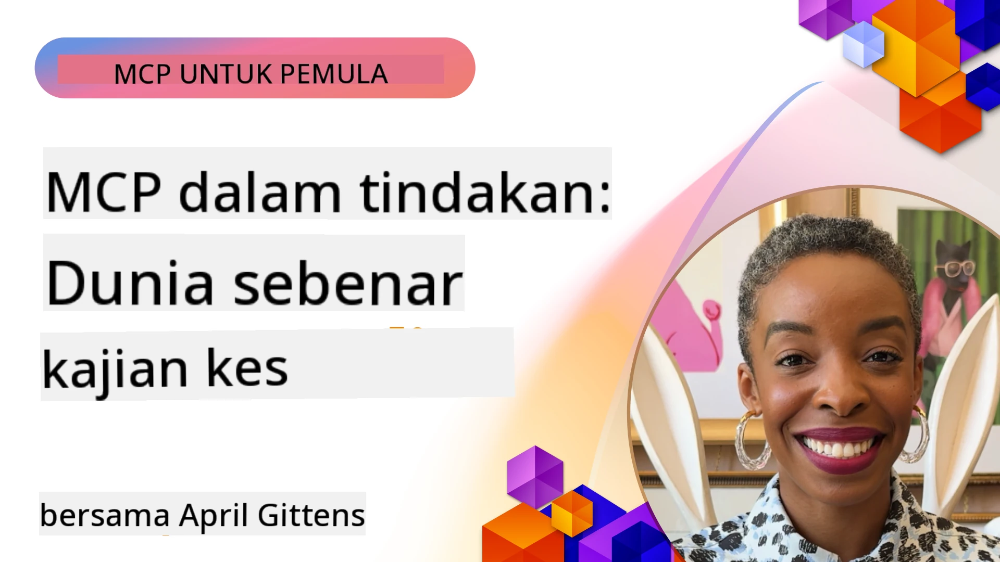

# MCP dalam Tindakan: Kajian Kes Dunia Sebenar

_(Klik imej di atas untuk menonton video pengajaran ini)_

Protokol Konteks Model (MCP) sedang merubah cara aplikasi AI berinteraksi dengan data, alat, dan perkhidmatan. Bahagian ini mempersembahkan kajian kes dunia sebenar yang menunjukkan aplikasi praktikal MCP dalam pelbagai senario perusahaan.

## Gambaran Keseluruhan

Bahagian ini memaparkan contoh-contoh konkrit pelaksanaan MCP, menonjolkan bagaimana organisasi memanfaatkan protokol ini untuk menyelesaikan cabaran perniagaan yang kompleks. Dengan meneliti kajian kes ini, anda akan mendapat wawasan mengenai kepelbagaian, kebolehskalaan, dan manfaat praktikal MCP dalam senario dunia sebenar.

## Objektif Pembelajaran Utama

Dengan meneroka kajian kes ini, anda akan:

- Memahami bagaimana MCP boleh digunakan untuk menyelesaikan masalah perniagaan tertentu
- Mempelajari tentang pelbagai corak integrasi dan pendekatan seni bina
- Mengenali amalan terbaik untuk melaksanakan MCP dalam persekitaran perusahaan
- Mendapat wawasan tentang cabaran dan penyelesaian yang dihadapi dalam pelaksanaan dunia sebenar
- Mengenal pasti peluang untuk menerapkan corak serupa dalam projek anda sendiri

## Kajian Kes Utama

### 1. [Ejen Perjalanan Azure AI – Pelaksanaan Rujukan](./travelagentsample.md)

Kajian kes ini mengkaji penyelesaian rujukan menyeluruh Microsoft yang menunjukkan cara membina aplikasi perancangan perjalanan berbilang ejen yang dikuasakan AI menggunakan MCP, Azure OpenAI, dan Azure AI Search. Projek ini mempamerkan:

- Orkestrasi berbilang ejen melalui MCP
- Integrasi data perusahaan dengan Azure AI Search
- Seni bina yang selamat dan boleh diskala menggunakan perkhidmatan Azure
- Alat yang boleh dikembangkan dengan komponen MCP yang boleh digunakan semula
- Pengalaman pengguna perbualan dikuasakan oleh Azure OpenAI

Butiran seni bina dan pelaksanaan memberikan wawasan berharga dalam membina sistem berbilang ejen yang kompleks dengan MCP sebagai lapisan koordinasi.

### 2. [Mengemas Kini Item Azure DevOps dari Data YouTube](./UpdateADOItemsFromYT.md)

Kajian kes ini menunjukkan aplikasi praktikal MCP untuk mengautomasikan proses aliran kerja. Ia menunjukkan bagaimana alat MCP boleh digunakan untuk:

- Mengekstrak data dari platform dalam talian (YouTube)
- Mengemas kini item kerja dalam sistem Azure DevOps
- Membuat aliran kerja automasi yang boleh diulang
- Mengintegrasi data merentasi sistem yang berbeza

Contoh ini menggambarkan bagaimana pelaksanaan MCP yang agak mudah dapat memberikan peningkatan kecekapan yang ketara dengan mengautomasikan tugas rutin dan meningkatkan konsistensi data merentasi sistem.

### 3. [Pengambilan Dokumentasi Masa Nyata dengan MCP](./docs-mcp/README.md)

Kajian kes ini membimbing anda melalui cara menyambungkan klien konsol Python ke pelayan Model Context Protocol (MCP) untuk mengambil dan merekod dokumentasi Microsoft yang kontekstual dan masa nyata. Anda akan belajar bagaimana untuk:

- Sambung ke pelayan MCP menggunakan klien Python dan SDK rasmi MCP
- Menggunakan klien HTTP aliran untuk pengambilan data masa nyata yang cekap
- Memanggil alat dokumentasi di pelayan dan merekod respons terus ke konsol
- Mengintegrasikan dokumentasi Microsoft yang terkini ke dalam aliran kerja anda tanpa meninggalkan terminal

Bab ini termasuk tugasan praktikal, contoh kod kerja minima, dan pautan ke sumber tambahan untuk pembelajaran lebih mendalam. Lihat langkah penuh dan kod di bab yang dipautkan untuk memahami bagaimana MCP boleh mengubah akses dokumentasi dan produktiviti pembangun dalam persekitaran berasaskan konsol.

### 4. [Aplikasi Web Penjana Pelan Studi Interaktif dengan MCP](./docs-mcp/README.md)

Kajian kes ini menunjukkan bagaimana membina aplikasi web interaktif menggunakan Chainlit dan Model Context Protocol (MCP) untuk menjana pelan studi peribadi bagi mana-mana topik. Pengguna boleh menentukan subjek (seperti "sijil AI-900") dan tempoh belajar (contoh, 8 minggu), dan aplikasi akan memberikan pecahan mingguan kandungan yang disyorkan. Chainlit membolehkan antara muka sembang perbualan, menjadikan pengalaman itu menarik dan adaptif.

- Aplikasi web perbualan dikuasakan oleh Chainlit
- Arahan yang dipandu pengguna untuk topik dan tempoh
- Cadangan kandungan mingguan menggunakan MCP
- Respons adaptif masa nyata dalam antara muka sembang

Projek ini menggambarkan bagaimana AI perbualan dan MCP boleh digabungkan untuk mencipta alat pendidikan dinamik yang dipandu pengguna dalam persekitaran web moden.

### 5. [Dokumen Dalam Penyunting dengan Pelayan MCP dalam VS Code](./docs-mcp/README.md)

Kajian kes ini menunjukkan bagaimana anda boleh membawa Microsoft Learn Docs terus ke dalam persekitaran VS Code anda menggunakan pelayan MCP—tidak perlu lagi bertukar tab pelayar! Anda akan melihat bagaimana untuk:

- Mencari dan membaca dokumen dalam VS Code menggunakan panel MCP atau palet arahan
- Merujuk dokumentasi dan memasukkan pautan terus ke dalam README atau fail markdown kursus anda
- Menggunakan GitHub Copilot dan MCP bersama untuk aliran kerja dokumentasi dan kod bertenaga AI yang lancar
- Mengesahkan dan menambah baik dokumentasi dengan maklum balas masa nyata dan ketepatan dari Microsoft
- Mengintegrasi MCP dengan aliran kerja GitHub untuk pengesahan dokumentasi berterusan

Pelaksanaan termasuk:

- Konfigurasi contoh `.vscode/mcp.json` untuk persediaan mudah
- Panduan berasaskan tangkapan skrin pengalaman dalam penyunting
- Petua untuk menggabungkan Copilot dan MCP bagi produktiviti maksimum

Senario ini sesuai untuk penulis kursus, penulis dokumentasi, dan pembangun yang mahu kekal fokus dalam penyunting mereka sambil bekerja dengan dokumen, Copilot, dan alat pengesahan—semuanya dikuasakan oleh MCP.

### 6. [Penciptaan Pelayan MCP APIM](./apimsample.md)

Kajian kes ini menyediakan panduan langkah demi langkah tentang cara mencipta pelayan MCP menggunakan Pengurusan API Azure (APIM). Ia merangkumi:

- Menyediakan pelayan MCP dalam Pengurusan API Azure
- Mendedahkan operasi API sebagai alat MCP
- Mengkonfigurasi polisi untuk had kadar dan keselamatan
- Menguji pelayan MCP menggunakan Visual Studio Code dan GitHub Copilot

Contoh ini menggambarkan bagaimana menggunakan keupayaan Azure untuk mencipta pelayan MCP yang kukuh yang boleh digunakan dalam pelbagai aplikasi, meningkatkan integrasi sistem AI dengan API perusahaan.

### 7. [Daftar MCP GitHub — Mempercepat Integrasi Agentik](https://github.com/mcp)

Kajian kes ini mengkaji bagaimana Daftar MCP GitHub, yang dilancarkan pada September 2025, menangani cabaran kritikal dalam ekosistem AI: penemuan dan penyebaran pelayan Model Context Protocol (MCP) yang terpecah-belah.

#### Gambaran Keseluruhan
**Daftar MCP** menyelesaikan masalah semakin meningkat pelayan MCP yang tersebar di seluruh repositori dan daftar, yang sebelum ini menjadikan integrasi lambat dan mudah berlaku kesilapan. Pelayan-pelayan ini membolehkan ejen AI berinteraksi dengan sistem luaran seperti API, pangkalan data, dan sumber dokumentasi.

#### Pernyataan Masalah
Pembangun yang membina aliran kerja agentik menghadapi beberapa cabaran:
- **Penemuan yang lemah** pelayan MCP di pelbagai platform
- **Soalan penyediaan berulang** tersebar di forum dan dokumentasi
- **Risiko keselamatan** dari sumber yang tidak disahkan dan tidak dipercayai
- **Kekurangan standardisasi** dalam kualiti dan keserasian pelayan

#### Seni Bina Penyelesaian
Daftar MCP GitHub memusatkan pelayan MCP yang dipercayai dengan ciri utama:
- **Pemasangan satu klik** integrasi melalui VS Code untuk persediaan yang lancar
- **Pengurusan isyarat berbanding bunyi** berdasarkan bintang, aktiviti, dan pengesahan komuniti
- **Integrasi langsung** dengan GitHub Copilot dan alat kompatibel MCP lain
- **Model sumbangan terbuka** membolehkan komuniti dan rakan kongsi perusahaan menyumbang

#### Impak Perniagaan
Daftar ini telah memberikan peningkatan yang ketara:
- **Penyesuaian lebih cepat** untuk pembangun menggunakan alat seperti Pelayan MCP Microsoft Learn, yang menstrim dokumentasi rasmi terus ke ejen
- **Produktiviti meningkat** melalui pelayan khusus seperti `github-mcp-server`, yang membolehkan automasi GitHub berbahasa semula jadi (penciptaan PR, rerun CI, imbasan kod)
- **Kepercayaan ekosistem lebih kuat** melalui senarai terpilih dan standard konfigurasi telus

#### Nilai Strategik
Bagi pengamal yang mengkhusus dalam pengurusan kitaran hayat ejen dan aliran kerja boleh dikeluarkan, Daftar MCP menyediakan:
- **Keupayaan penggubahan modul ejen** dengan komponen standard
- **Saluran penilaian berasaskan daftar** untuk ujian dan pengesahan konsisten
- **Interoperabiliti merentas alat** membolehkan integrasi lancar merentasi pelbagai platform AI

Kajian kes ini menunjukkan bahawa Daftar MCP lebih dari sekadar direktori—ia adalah platform asas untuk integrasi model boleh diskala dunia sebenar dan penyebaran sistem agentik.

### 8. [Penerbitan ke Rangkaian Sosial dari Ejen](./publora-social-publishing.md)

Kajian kes ini menerangkan **pelayan MCP jauh yang boleh menulis** — satu yang alatan pelayannya melakukan tindakan tidak boleh balik bagi pihak pengguna — menggunakan penerbitan sosial sebagai contoh kerja. Seorang ejen menyediakan draf pos, manusia meluluskan, dan pelayan menjadualkan pos tersebut di rangkaian sosial.

Bahagian menarik adalah kekangan reka bentuk yang dikenakan oleh penerbitan, yang terpakai kepada mana-mana pelayan yang menulis bukannya membaca:

- **Penemuan terbuka, pelaksanaan disahkan** — `tools/list` dijawab tanpa kelayakan supaya daftar dan klien dapat meneliti, manakala setiap `tools/call` memerlukan token dan jika tidak akan mengembalikan `401` dengan header `WWW-Authenticate`
- **Pendaftaran OAuth tanpa langkah luar jalur** — pendaftaran klien dinamik hari ini, dengan Dokumen Metadata ID Klien sebagai arah spesifikasi `2026-07-28`
- **Anotasi alat** (`readOnlyHint`, `destructiveHint`, `idempotentHint`) yang digunakan klien untuk memutuskan apa yang perlu disahkan — petunjuk bukannya penguatkuasaan, dan sesuatu yang direktori penyambung kini jangkakan pada semakan
- **Pengenal pasti yang tidak boleh dicipta** supaya nilai halusinasi gagal dengan jelas dan tidak bertindak pada nilai yang kelihatan munasabah
- **Kunci idempotensi pada alat pencipta pos**, supaya cubaan semula ejen runtime tidak menjadi penerbitan berganda
- **Sasaran no-op yang diterangkan dalam skema alat** yang menguji jalan tulis penuh dan tidak menerbitkan apa-apa, untuk penilai dan CI

Bab ini ditutup dengan senarai semak ringkas yang boleh anda gunakan pada pelayan yang anda bina.

## Kesimpulan

Lapan kajian kes yang menyeluruh ini menunjukkan kepelbagaian yang luar biasa dan aplikasi praktikal Protokol Konteks Model di pelbagai senario dunia sebenar. Dari sistem perancangan perjalanan berbilang ejen yang kompleks dan pengurusan API perusahaan sehingga aliran kerja dokumentasi yang lancar dan Daftar MCP GitHub yang revolusioner, contoh ini mempamerkan bagaimana MCP menyediakan cara yang standard dan boleh diskala untuk menyambungkan sistem AI dengan alat, data, dan perkhidmatan yang mereka perlukan untuk memberikan nilai yang luar biasa.

Kajian kes merangkumi pelbagai dimensi pelaksanaan MCP:
- **Integrasi Perusahaan**: Pengurusan API Azure dan automasi Azure DevOps
- **Orkestrasi Berbilang Ejen**: Perancangan perjalanan dengan ejen AI yang diselaraskan
- **Produktiviti Pembangun**: Integrasi VS Code dan akses dokumentasi masa nyata
- **Pembangunan Ekosistem**: Daftar MCP GitHub sebagai platform asas
- **Aplikasi Pendidikan**: Penjana pelan studi interaktif dan antara muka perbualan

Dengan mempelajari pelaksanaan ini, anda mendapat wawasan penting tentang:
- **Corak seni bina** untuk skala dan kes penggunaan berlainan
- **Strategi pelaksanaan** yang mengimbangi fungsi dengan kebolehpengurusan
- **Pertimbangan keselamatan dan kebolehskalaan** untuk penyebaran pengeluaran
- **Amalan terbaik** untuk pembangunan pelayan MCP dan integrasi klien
- **Pemikiran ekosistem** untuk membina penyelesaian berinterkoneksi dikuasakan AI

Contoh-contoh ini bersama-sama menunjukkan bahawa MCP bukan sekadar rangka kerja teoretikal tetapi protokol matang dan siap produksi yang membolehkan penyelesaian praktikal kepada cabaran perniagaan yang kompleks. Sama ada anda membina alat automasi mudah atau sistem berbilang ejen yang canggih, corak dan pendekatan yang digambarkan di sini menyediakan asas kukuh untuk projek MCP anda sendiri.

## Sumber Tambahan

- [Repositori GitHub Ejen Perjalanan Azure AI](https://github.com/Azure-Samples/azure-ai-travel-agents)
- [Alat MCP Azure DevOps](https://github.com/microsoft/azure-devops-mcp)
- [Alat MCP Playwright](https://github.com/microsoft/playwright-mcp)
- [Pelayan MCP Microsoft Docs](https://github.com/MicrosoftDocs/mcp)
- [Daftar MCP GitHub — Mempercepat Integrasi Agentik](https://github.com/mcp)
- [Contoh Komuniti MCP](https://github.com/microsoft/mcp)

## Apa Seterusnya

- Sebelumnya: [Modul 8: Amalan Terbaik](../08-BestPractices/README.md)
- Seterusnya: [Modul 10: Menyederhanakan Aliran Kerja AI: Membina Pelayan MCP dengan AI Toolkit](../10-StreamliningAIWorkflowsBuildingAnMCPServerWithAIToolkit/README.md)

---

<!-- CO-OP TRANSLATOR DISCLAIMER START -->
**Penafian**:
Dokumen ini telah diterjemahkan menggunakan perkhidmatan terjemahan AI [Co-op Translator](https://github.com/Azure/co-op-translator). Walaupun kami berusaha untuk ketepatan, sila ambil maklum bahawa terjemahan automatik mungkin mengandungi kesilapan atau ketidaktepatan. Dokumen asal dalam bahasa asalnya harus dianggap sebagai sumber yang sahih. Untuk maklumat penting, terjemahan oleh manusia profesional adalah disyorkan. Kami tidak bertanggungjawab terhadap sebarang salah faham atau salah tafsir yang timbul daripada penggunaan terjemahan ini.
<!-- CO-OP TRANSLATOR DISCLAIMER END -->