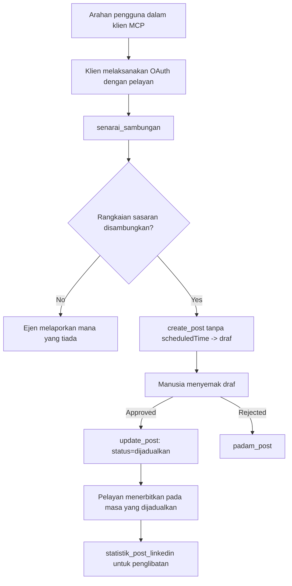

# Kajian Kes: Menerbitkan ke Rangkaian Sosial dari Agen dengan Pelayan MCP Jauh

> **Penafian:** Beberapa perkhidmatan dan projek sumber terbuka boleh menerbitkan ke rangkaian sosial, dan satu pasukan juga boleh mengintegrasikan API setiap rangkaian secara langsung. Senario di bawah disediakan sebagai satu contoh bagaimana sebuah **pelayan MCP jauh yang boleh menulis** boleh direka bentuk dan digunakan. Publora adalah perkhidmatan komersial dengan tahap percuma; corak yang diterangkan di sini terpakai kepada mana-mana pelayan MCP yang melakukan tindakan tidak boleh balik atas nama pengguna.

## Gambaran Keseluruhan

Agen mahir dalam merangka kandungan tetapi kurang mahir dalam menghantarnya. Model boleh menulis pengumuman siaran dalam beberapa saat, dan kemudian kerja berhenti: menerbitkannya memerlukan satu API bagi setiap rangkaian, satu aplikasi OAuth bagi setiap rangkaian, dan satu set peraturan media yang berbeza untuk setiap satu. Kebanyakan pasukan menyelesaikan masalah ini dengan menyalin teks ke dalam pelayar secara manual.

Kajian kes ini melihat bagaimana langkah terakhir itu diselesaikan dengan satu pelayan MCP jauh, dan — lebih berguna untuk sesiapa yang membina satu — pada keputusan reka bentuk yang mesti dipatuhi oleh pelayan **yang boleh menulis**. Membaca data adalah mudah dimaafkan. Menerbitkan tidak: panggilan alat yang salah kelihatan oleh khalayak dan tidak boleh dipadamkan.

## Senario

Satu pasukan kecil perhubungan pembangun merangka pos di dalam agen (Claude, VS Code, Cursor — pelanggan tidak penting). Mereka mahu agen itu:

- melihat akaun sosial mana yang telah disambungkan oleh pasukan,
- merangka pos dan menyimpannya sebagai draf untuk diluluskan oleh manusia,
- melampirkan imej,
- menjadualkannya ke beberapa rangkaian pada masa yang dipilih,
- dan kemudian melaporkan bagaimana prestasinya.

Yang penting, mereka mahu agen itu *tidak boleh* menerbitkan secara tidak sengaja semasa mereka masih mencuba.

## Alat Digunakan

- [Publora MCP Server](https://github.com/publora/mcp-server) — pelayan MCP jauh (`streamable-http`) yang mendedahkan alat penerbitan, penjadualan, media dan analitik LinkedIn. Berdaftar dalam daftar MCP rasmi sebagai `com.publora/mcp-server`.

## Aliran Kerja Langkah-demi-Langkah

1. **Sambungkan pelayan.** Pelanggan yang menggunakan OAuth melengkapkan aliran kod kebenaran dengan PKCE terhadap skrin persetujuan pelayan sendiri; pelanggan yang tidak, seperti CLI tanpa kepala, menggunakan kunci API Publora dalam header. Kedua-dua laluan disokong, dan anda dapat yang mana bergantung pada pelanggan, bukan pada pelayan.
2. **Senaraikan sambungan.** Agen memanggil `list_connections` dan menerima akaun yang disambungkan dengan pengecam mereka.
3. **Rangka.** Agen memanggil `create_post` *tanpa* masa yang dijadualkan. Pos disimpan sebagai draf — tiada apa-apa diterbitkan.
4. **Lampirkan media.** URL imej awam dihantar dalam panggilan yang sama; pelayan memuat turun dan mengesahkannya.
5. **Jadualkan.** Selepas manusia meluluskan, `update_post` menetapkan status kepada dijadualkan dengan masa ISO 8601.
6. **Ukur.** Bagi LinkedIn, `linkedin_post_stats` mengembalikan penglibatan setelah pos hidup.

## Contoh Petikan Arahan

```text
Which social accounts do I have connected?
Draft a post announcing our new changelog page, attach the screenshot at
https://example.com/changelog.png, and keep it as a draft — do not publish it.
Once I approve, schedule it to LinkedIn and Bluesky for tomorrow at 09:00 UTC.
```

## Carta Alir Mermaid



## Pelaksanaan Teknikal

Pengajaran di bawah adalah bahagian yang boleh dialihkan dari kajian kes ini.

### Penemuan terbuka, pelaksanaan diautentikasi

`tools/list` dihidangkan tanpa kelayakan; setiap `tools/call` memerlukan token
dan jika tidak akan mengembalikan `401` dengan header `WWW-Authenticate` yang menunjuk kepada
metadata sumber yang dilindungi. Titik akhir warisan pelayan juga menjawab
`initialize` tanpa pengesahan untuk pelanggan pada versi protokol sebelum
`2026-07-28`; pelanggan semasa tidak menggunakan jabat tangan itu.

Perpisahan khusus pelayan ini membolehkan daftar, katalog, dan pelanggan memeriksa nama alat,
skema, dan anotasi tanpa rahsia sambil menghalang pelaksanaan tanpa nama.
Penemuan terbuka adalah pilihan penyebaran, bukan keperluan MCP; penyebaran yang
dilindungi juga mungkin memerlukan kebenaran untuk `tools/list`.

### Pendaftaran: pendaftaran pelanggan dinamik, dan apa yang menggantikannya

Pelayan mengiklankan `/.well-known/oauth-protected-resource` dan `/.well-known/oauth-authorization-server`, dan menyokong aliran kod kebenaran dengan PKCE (`S256`), token penyegaran, dan **pendaftaran pelanggan dinamik**.

Pendaftaran dinamik menghapuskan langkah manual untuk pelanggan warisan: tanpa ia,
setiap pelanggan memerlukan `client_id` yang diterbitkan sebelumnya dari vendor.

Anggap ini sebagai tingkah laku keserasian dan bukan reka bentuk yang hendak ditiru. Semakan spesifikasi `2026-07-28` menghentikan pendaftaran pelanggan dinamik demi Dokumen Metadata ID Pelanggan, di mana pelanggan menjadi hos dokumen metadata pada URL HTTPS yang stabil dan URL itu *adalah* `client_id`. DCR masih berfungsi buat masa ini, tetapi pelayan yang dibina hari ini harus merancang untuk CIMD dan mengekalkan DCR hanya untuk pelanggan lama.

### Anotasi alat bukan hiasan

Setiap alat membawa `title` dan petunjuk yang terpakai: `readOnlyHint`, `destructiveHint`, `idempotentHint`, `openWorldHint`.

Dua sebab untuk melabur pada mereka. Pertama, pelanggan menggunakan petunjuk untuk memutuskan apa yang perlu disahkan dengan pengguna — pelanggan boleh menjalankan pencarian baca sahaja secara automatik dan berhenti untuk kelulusan sebelum memadamkan. Spesifikasi jelas bahawa anotasi adalah petunjuk yang tidak dipercayai, bukan mekanisme kebenaran: ia membentuk apa yang pelanggan tawarkan untuk lakukan, ia tidak menghentikan apa-apa pada pelayan, dan pelayan mesti tetap menguatkuasakan peraturannya sendiri. Kedua, direktori penyambung utama kini *memerlukan* mereka untuk ulasan; pelayan yang alatnya tidak mempunyai tajuk dan petunjuk akan ditolak kembali walaupun berfungsi dengan baik.

### Buat pengecam tidak boleh direka

Pengecam platform adalah rentetan tidak telus yang dikembalikan oleh `list_connections`, dan penerangan skema menyatakan secara eksplisit bahawa ia mesti disalin secara tepat dan tidak pernah diteka. Pelayan menolak apa-apa selain itu.

Model adalah peneka yang biasa. Mana-mana pelayan yang boleh menulis harus menganggap pengecam akhirnya akan dihallusinasikan dan menyebabkan laluan itu gagal dengan kuat dan awal, daripada bertindak atas nilai yang kelihatan munasabah.

### Gagal sebelum menerbitkan, dengan mesej boleh tindakan

Sesetengah rangkaian enggan pos hanya teks dan memerlukan imej atau video. Itu disahkan apabila pos dijadualkan, dan ralat menamakan platform dan keperluan yang hilang.

Agen boleh pulih dari "Instagram memerlukan media — lampirkan imej atau video" tanpa pusingan ulang lain. Ia tidak boleh pulih daripada `400` generik.

### Buat percubaan semula selamat

Dua alat yang mencipta kandungan, `create_post` dan `update_post`, menerima kekunci idempotensi: menggunakannya semula dengan permintaan yang sama mengulang respons asal dan bukannya mencipta pos kedua. Persekitaran agen cuba semula apabila tamat masa; tanpa idempotensi, respons lambat menjadi penerbitan berganda. Alat tulis lain — pemadaman, langkah media, reaksi dan komen LinkedIn — tidak mengambilnya, jadi percubaan semula di situ tidak secara automatik selamat. Patut tahu mutasi mana yang dilindungi dan mana yang tidak.

### Sediakan cara untuk menguji yang tidak menerbitkan apa-apa

Pelayan menerima sasaran terpelihara, `publora-playground`, yang disahkan dan diakui seperti destinasi sebenar dan kemudian dibuang — tiada apa yang sampai ke akaun hidup. Ia diterangkan dalam skema alat itu sendiri, yang mana mana-mana pelanggan boleh baca tanpa kelayakan: medan `platforms` dalam `create_post` mendokumentasikannya sebagai "sasaran ujian sambungan yang tidak memerlukan sambungan sebenar — pos diakui dan dibuang, tiada apa diterbitkan". Pangilannya dengan melepasnya sebagai entri sahaja: `platforms: ["publora-playground"]`.

Ini ternyata menjadi salah satu perincian paling berguna di seluruh permukaan. Penyemak direktori penyambung, penyumbang dan CI boleh menguji laluan tulis penuh dari hujung ke hujung tanpa risiko kepada khalayak sebenar. Mana-mana pelayan MCP dengan tindakan tidak boleh balik mendapat manfaat daripada sasaran tiada operasi yang didokumentasikan.

## Keputusan dan Impak

- Langkah penerbitan berpindah dari pelayar kepada perbualan yang sama di mana kandungan ditulis, dan tabiat draf terlebih dahulu mengekalkan manusia dalam pekeliling. Tepatkan apa itu: draf adalah konvensyen, bukan sempadan. Kelayakan yang sama boleh menjadualkan atau menerbitkan, jadi sesiapa yang memerlukan gerbang kelulusan sebenar mesti menguatkuasakannya di luar permukaan alat — kelayakan berasingan, atau lapisan dasar polisi di hadapan pelayan.
- Perbezaan per rangkaian — keperluan media, penulisan bersiri, kawalan balasan — ditangani sekali dalam pelayan dan bukan dalam setiap agen yang berkomunikasi dengannya.
- Pelayan yang sama menyokong beberapa pelanggan MCP tanpa kelayakan yang dikeluarkan dahulu.
    Pelanggan semasa boleh menggunakan Dokumen Metadata ID Pelanggan; DCR kekal sebagai sandaran
    untuk pelanggan lama.
- Kekangan reka bentuk di atas dibentuk oleh ulasan direktori penyambung sama banyak seperti oleh pengguna: anotasi, OAuth dan sasaran ujian selamat masing-masing diperlukan oleh sekurang-kurangnya satu daripada mereka.

## Rujukan

- [Publora MCP Server (sumber)](https://github.com/publora/mcp-server)
- [Dokumentasi API dan MCP Publora](https://docs.publora.com)
- [Entri Daftar MCP: `com.publora/mcp-server`](https://registry.modelcontextprotocol.io/v0/servers?search=com.publora/mcp-server)
- [Spesifikasi MCP — Kebenaran](https://modelcontextprotocol.io/specification/2026-07-28/basic/authorization)
- [Spesifikasi MCP — Anotasi alat](https://modelcontextprotocol.io/docs/concepts/tools)

## Langkah Seterusnya

- Ambil pelayan MCP yang anda bina dan periksa tiga keuntungan termurah di sini: anotasi pada setiap alat, kekunci idempotensi pada setiap penulisan, dan sasaran tiada operasi yang didokumentasikan.
- Cuba perpisahan penemuan terbuka: panggil `tools/list` terhadap pelayan jauh awam tanpa kelayakan, kemudian panggil alat dan periksa cabaran `401`.
- Pertimbangkan apa maksud "undo" untuk domain anda. Penerbitan ada draf dan pemadaman; jika tindakan anda tiada yang setara, pengesahan patut dalam reka bentuk alat, bukan dalam arahan.

---

<!-- CO-OP TRANSLATOR DISCLAIMER START -->
**Penafian**:
Dokumen ini telah diterjemahkan menggunakan perkhidmatan terjemahan AI [Co-op Translator](https://github.com/Azure/co-op-translator). Walaupun kami berusaha untuk ketepatan, sila ambil maklum bahawa terjemahan automatik mungkin mengandungi kesilapan atau ketidaktepatan. Dokumen asal dalam bahasa asalnya harus dianggap sebagai sumber yang sahih. Untuk maklumat penting, terjemahan oleh manusia profesional adalah disyorkan. Kami tidak bertanggungjawab terhadap sebarang salah faham atau salah tafsir yang timbul daripada penggunaan terjemahan ini.
<!-- CO-OP TRANSLATOR DISCLAIMER END -->