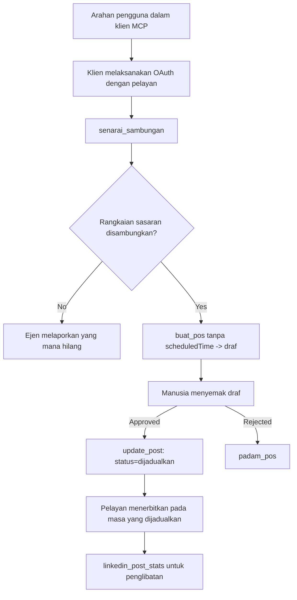

# Kajian Kes: Menerbitkan ke Rangkaian Sosial dari Ejen dengan Pelayan MCP Jauh

> **Penafian:** Beberapa perkhidmatan dan projek sumber terbuka boleh menerbitkan ke rangkaian sosial, dan satu pasukan juga boleh mengintegrasikan API setiap rangkaian secara langsung. Senario di bawah disediakan sebagai satu contoh kerja bagaimana **pelayan MCP jauh yang boleh menulis** boleh direka dan digunakan. Publora adalah perkhidmatan komersial dengan lapisan percuma; corak yang diterangkan di sini terpakai kepada mana-mana pelayan MCP yang melakukan tindakan yang tidak boleh dibatalkan bagi pihak pengguna.

## Gambaran Keseluruhan

Ejen bagus untuk merangka kandungan dan lemah untuk menyampaikannya. Model boleh menulis pengumuman pelepasan dalam beberapa saat, dan kemudian kerja berhenti: menerbitkannya bermakna satu API bagi setiap rangkaian, satu aplikasi OAuth bagi setiap rangkaian, dan satu set peraturan media yang berbeza bagi setiap satu. Kebanyakan pasukan menyelesaikan ini dengan menyalin teks ke dalam pelayar secara manual.

Kajian kes ini melihat bagaimana langkah terakhir itu ditutup dengan satu pelayan MCP jauh, dan — yang lebih berguna kepada sesiapa yang membinanya — pada keputusan reka bentuk yang perlu dibuat oleh pelayan yang **boleh menulis**. Membaca data adalah memaafkan. Menerbitkan tidak: panggilan alat yang salah dapat dilihat oleh penonton dan tidak boleh dibatalkan.

## Senario

Satu pasukan kecil perhubungan pembangun merangka siaran di dalam ejen (Claude, VS Code, Cursor — klien tidak penting). Mereka mahu ejen itu:

- melihat akaun sosial mana yang telah disambungkan oleh pasukan,
- merangka siaran dan menyimpannya sebagai draf untuk diluluskan oleh manusia,
- melampirkan imej,
- menjadualkannya ke beberapa rangkaian pada masa yang dipilih,
- dan kemudian melaporkan prestasinya.

Yang penting, mereka mahu ejen itu *tidak boleh* menerbit secara tidak sengaja semasa mereka masih mencuba.

## Alat Digunakan

- [Publora MCP Server](https://github.com/publora/mcp-server) — pelayan MCP jauh (`streamable-http`) yang menyediakan alat penerbitan, penjadualan, media dan analitik LinkedIn. Berdaftar dalam daftar MCP rasmi sebagai `com.publora/mcp-server`.

## Aliran Kerja Langkah demi Langkah

1. **Sambungkan pelayan.** Klien yang menggunakan OAuth melengkapkan aliran kod autorisasi dengan PKCE terhadap skrin persetujuan pelayan sendiri; klien yang tidak, seperti CLI tanpa kepala, menggunakan kunci API Publora dalam header. Kedua-dua laluan disokong, dan yang mana anda dapat bergantung pada klien, bukan pada pelayan.
2. **Senaraikan sambungan.** Ejen memanggil `list_connections` dan menerima akaun yang disambungkan dengan pengenalnya.
3. **Rangka.** Ejen memanggil `create_post` *tanpa* masa yang dijadualkan. Siaran disimpan sebagai draf — tiada apa yang diterbitkan.
4. **Lampirkan media.** URL imej awam dihantar dalam panggilan yang sama; pelayan memuat turun dan mengesahkannya.
5. **Jadualkan.** Selepas manusia meluluskan, `update_post` menetapkan status sebagai dijadualkan dengan masa ISO 8601.
6. **Ukur.** Untuk LinkedIn, `linkedin_post_stats` mengembalikan penglibatan setelah siaran aktif.

## Contoh Arahan

```text
Which social accounts do I have connected?
Draft a post announcing our new changelog page, attach the screenshot at
https://example.com/changelog.png, and keep it as a draft — do not publish it.
Once I approve, schedule it to LinkedIn and Bluesky for tomorrow at 09:00 UTC.
```

## Carta Alir Mermaid



## Pelaksanaan Teknikal

Pengajaran di bawah adalah bahagian boleh alih daripada kajian kes ini.

### Penemuan terbuka, pelaksanaan disahihkan

`tools/list` dilayani tanpa kelayakan; setiap `tools/call` memerlukan token dan jika tidak akan mengembalikan `401` dengan header `WWW-Authenticate` yang menunjuk pada metadata sumber terlindung. (Pelayan juga menjawab `initialize` tanpa pengesahan, yang hanya penting untuk klien pada versi protokol sebelum `2026-07-28`; pindaan itu membuang sambutan tangan sepenuhnya.)

Pisahan ini penting dalam praktik. Daftar, katalog dan klien boleh meneliti permukaan alat — nama, skema, anotasi — tanpa memegang rahsia, manakala tiada apa yang boleh *dijalankan* secara tanpa nama. Pelayan yang meminta token untuk `initialize` secara berkesan tidak dapat dilihat oleh alat; pelayan yang membenarkan `tools/call` secara tanpa nama adalah risiko.

### Pendaftaran: pendaftaran klien dinamik, dan apa yang menggantikannya

Pelayan mengiklankan `/.well-known/oauth-protected-resource` dan `/.well-known/oauth-authorization-server`, dan menyokong aliran kod autorisasi dengan PKCE (`S256`), token segar semula, dan **pendaftaran klien dinamik**.

Pendaftaran dinamik menghapuskan langkah manual: tanpa ia setiap klien memerlukan `client_id` yang dikeluarkan terlebih dahulu, yang bermakna permintaan luar jalur kepada vendor untuk setiap klien baru.

Anggap ini sebagai tingkah laku keserasian dan bukannya sebagai reka bentuk yang perlu ditiru. Pindaan `2026-07-28` spesifikasi tidak lagi menggunakan pendaftaran klien dinamik dan menggantikannya dengan Dokumen Metadata ID Klien, di mana klien menghoskan dokumen metadata di URL HTTPS stabil dan URL itu *adalah* `client_id`. DCR masih berfungsi buat masa ini, tetapi pelayan yang dibina hari ini harus merancang untuk CIMD dan mengekalkan DCR hanya untuk klien lama.

### Anotasi alat bukan sekadar hiasan

Setiap alat membawa `title` dan petunjuk yang berkenaan: `readOnlyHint`, `destructiveHint`, `idempotentHint`, `openWorldHint`.

Dua sebab untuk melabur pada mereka. Pertama, klien menggunakan petunjuk untuk memutuskan apa yang perlu disahkan dengan pengguna — klien boleh menjalankan carian baca sahaja secara automatik dan berhenti untuk kelulusan sebelum memadam. Spesifikasi jelas bahawa anotasi adalah petunjuk yang tidak dipercayai, bukan mekanisme kebenaran: mereka membentuk apa yang ditawarkan klien lakukan, mereka tidak menghentikan apa-apa di pelayan, dan pelayan masih mesti menguatkuasakan peraturannya sendiri. Kedua, direktori penghubung utama kini *mewajibkannya* untuk semakan; pelayan yang alatnya tiada tajuk dan petunjuk akan dikembalikan tidak kira seberapa baik ia berfungsi.

### Jadikan pengenalan tidak boleh direka cipta

Pengenal platform adalah rentetan tidak telus yang dikembalikan oleh `list_connections`, dan penerangan skema menyatakan secara eksplisit bahawa ia mesti disalin secara tepat dan tidak boleh diteka. Pelayan menolak apa-apa selain itu.

Model adalah peneka fasih. Mana-mana pelayan yang boleh menulis harus menganggap pengenalan akhirnya akan dihalusinasi dan membuat laluan itu gagal dengan kuat dan awal, daripada bertindak pada nilai yang kelihatan munasabah.

### Gagal sebelum menerbitkan, dengan mesej boleh bertindak

Beberapa rangkaian menolak siaran teks sahaja dan memerlukan imej atau video. Itu disahkan apabila siaran dijadualkan, dan ralat menyebut platform dan keperluan yang hilang.

Ejen boleh pulih daripada "Instagram memerlukan media — lampirkan imej atau video" tanpa pusingan ulang. Ia tidak boleh pulih daripada `400` umum.

### Jadikan cubaan semula selamat

Dua alat yang mencipta kandungan, `create_post` dan `update_post`, menerima kunci idempotensi: menggunakannya semula dengan permintaan yang sama mengulangi respons asal dan bukannya mencipta siaran kedua. Masa jalan ejen mencuba semula pada tamat masa; tanpa idempotensi, respons perlahan menjadi penerbitan berganda. Alat tulis lain — penghapusan, langkah media, reaksi dan komen LinkedIn — tidak mengambilnya, jadi cubaan semula di situ tidak automatiknya selamat. Wajar tahu mutasi anda sendiri yang dilindungi dan yang tidak.

### Sediakan cara menguji tanpa menerbitkan apa-apa

Pelayan menerima sasaran yang dikhaskan, `publora-playground`, yang disahkan dan diiktiraf seperti destinasi sebenar dan kemudian dibuang — tiada apa yang sampai ke akaun langsung. Ia diterangkan dalam skema alat itu sendiri, yang boleh dibaca mana-mana klien tanpa kelayakan: medan `platforms` bagi `create_post` mendokumentasikannya sebagai "sasaran ujian sambungan yang tidak memerlukan sambungan sebenar — siaran diiktiraf dan dibuang, tiada apa yang diterbitkan". Panggil dengan memberikannya sebagai satu-satunya entri: `platforms: ["publora-playground"]`.

Ini ternyata menjadi salah satu butiran paling berguna pada keseluruhan permukaan. Pemeriksa direktori penghubung, penyumbang dan CI boleh menjalankan laluan tulis penuh dari awal ke akhir tanpa risiko kepada penonton sebenar. Mana-mana pelayan MCP dengan tindakan yang tidak boleh dibatalkan mendapat manfaat dari sasaran tiada operasi yang didokumentasikan.

## Keputusan dan Impak

- Langkah penerbitan dipindahkan dari pelayar ke perbualan yang sama di mana kandungan ditulis, dan tabiat draf terlebih dahulu memastikan manusia terlibat. Jadilah tepat tentang apa itu: draf adalah konvensyen, bukan sempadan. Kredensial yang sama boleh menjadual atau menerbitkan, jadi sesiapa yang memerlukan pintu pagar kelulusan sebenar mesti menguatkuasakan di luar permukaan alat — kredensial berasingan, atau lapisan polisi di hadapan pelayan.
- Perbezaan bagi setiap rangkaian — keperluan media, pengurusan thread, kawalan balasan — diurus sekali dalam pelayan daripada dalam setiap ejen yang bercakap dengannya.
- Pelayan yang sama menyokong beberapa klien MCP tanpa kerja per klien, kerana penemuan terbuka dan pendaftaran dinamik.
- Kekangan reka bentuk di atas dibentuk oleh semakan direktori penghubung sama banyaknya seperti oleh pengguna: anotasi, OAuth dan sasaran ujian selamat masing-masing diperlukan oleh sekurang-kurangnya seorang daripada mereka.

## Rujukan

- [Publora MCP Server (sumber)](https://github.com/publora/mcp-server)
- [Dokumentasi API dan MCP Publora](https://docs.publora.com)
- [Entri Daftar MCP: `com.publora/mcp-server`](https://registry.modelcontextprotocol.io/v0/servers?search=com.publora/mcp-server)
- [Spesifikasi MCP — Kebenaran](https://modelcontextprotocol.io/specification/draft/basic/authorization)
- [Spesifikasi MCP — Anotasi alat](https://modelcontextprotocol.io/docs/concepts/tools)

## Apa Seterusnya

- Ambil pelayan MCP yang anda bina dan periksa tiga kemenangan paling murah di sini: anotasi pada setiap alat, kunci idempotensi pada setiap penulisan, dan sasaran tiada operasi yang didokumentasikan.
- Cuba pisahan penemuan terbuka: panggil `tools/list` terhadap pelayan jauh awam tanpa kelayakan, kemudian panggil alat dan periksa cabaran `401`.
- Pertimbangkan apa maksud "batal" untuk domain anda. Menerbit mempunyai draf dan penghapusan; jika tindakan anda tiada sepadan, pengesahan patut berada dalam reka bentuk alat, bukan dalam arahan.

---

<!-- CO-OP TRANSLATOR DISCLAIMER START -->
**Penafian**:
Dokumen ini telah diterjemahkan menggunakan perkhidmatan terjemahan AI [Co-op Translator](https://github.com/Azure/co-op-translator). Walaupun kami berusaha untuk ketepatan, sila ambil maklum bahawa terjemahan automatik mungkin mengandungi kesilapan atau ketidaktepatan. Dokumen asal dalam bahasa asalnya harus dianggap sebagai sumber yang sahih. Untuk maklumat penting, terjemahan oleh manusia profesional adalah disyorkan. Kami tidak bertanggungjawab terhadap sebarang salah faham atau salah tafsir yang timbul daripada penggunaan terjemahan ini.
<!-- CO-OP TRANSLATOR DISCLAIMER END -->