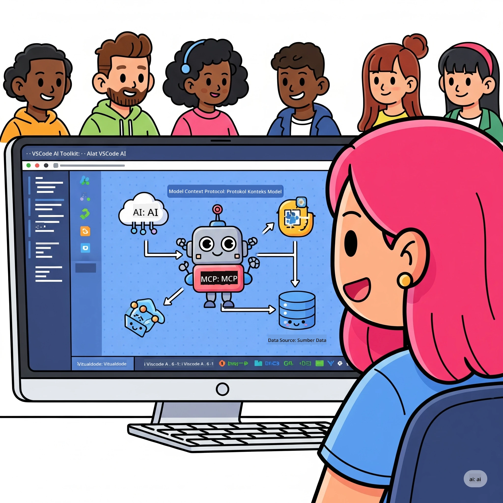
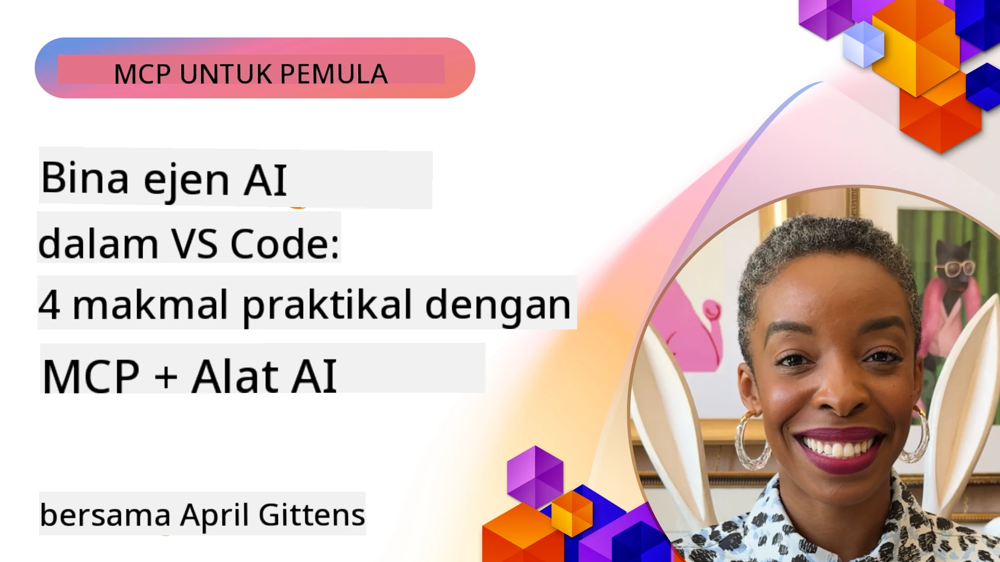

# Mempermudah Aliran Kerja AI: Membangun Server MCP dengan Microsoft Foundry Toolkit

## 🎯  Gambaran Keseluruhan

_(Klik imej di atas untuk melihat video pelajaran ini)_

Selamat datang ke **Model Context Protocol (MCP) Workshop**! Bengkel praktikal yang menyeluruh ini menggabungkan dua teknologi terkini untuk merevolusikan pembangunan aplikasi AI:

> **Nota keserasian:** kod bengkel dibina dan diuji dengan MCP
> `2025-11-25`, seperti yang ditunjukkan oleh lencana di atas. Gunakan
> [spesifikasi terkini `2026-07-28`](https://modelcontextprotocol.io/specification/2026-07-28/)
> untuk pelaksanaan protokol baru dan semak nota keluaran SDK sebelum
> memindahkan makmal.

- **🔗 Model Context Protocol (MCP)**: Standard terbuka untuk integrasi alat AI tanpa gangguan
- **🛠️ Sambungan Microsoft Foundry Toolkit untuk VS Code**: Sambungan pembangunan AI yang mantap daripada Microsoft

### 🎓 Apa Yang Akan Anda Pelajari

Pada akhir bengkel ini, anda akan menguasai seni membina aplikasi pintar yang menghubungkan model AI dengan alat dan perkhidmatan dunia nyata. Dari ujian automatik ke integrasi API khusus, anda akan memperoleh kemahiran praktikal untuk menyelesaikan cabaran perniagaan yang kompleks.

## 🏗️ Timbunan Teknologi

### 🔌 Model Context Protocol (MCP)

MCP adalah **"USB-C untuk AI"** - satu standard universal yang menghubungkan model AI kepada alat dan sumber data luaran.

**✨ Ciri-ciri Utama:**

- 🔄 **Integrasi Piawai**: Antara muka universal untuk sambungan alat AI
- 🏛️ **Seni Bina Fleksibel**: Server tempatan & jauh melalui pengangkutan stdio/SSE
- 🧰 **Ekosistem Kaya**: Alat, arahan, dan sumber dalam satu protokol
- 🔒 **Sedia Enterprise**: Keselamatan dan kebolehpercayaan terbina dalam

**🎯 Mengapa MCP Penting:**
Sama seperti USB-C menghapuskan kekacauan kabel, MCP menghapuskan kerumitan integrasi AI. Satu protokol, kemungkinan tanpa had.

### 🤖 Sambungan Microsoft Foundry Toolkit untuk VS Code

Sambungan pembangunan AI utama Microsoft yang mengubah VS Code menjadi kuasa AI.

**🚀 Keupayaan Teras:**

- 📦 **Katalog Model**: Akses model dari Azure AI, GitHub, Hugging Face, Ollama
- ⚡ **Inferens Tempatan**: Pelaksanaan CPU/GPU/NPU dioptimumkan ONNX
- 🏗️ **Pembina Agen**: Pembangunan agen AI visual dengan integrasi MCP
- 🎭 **Mod Berbilang**: Sokongan teks, penglihatan, dan output berstruktur

**💡 Manfaat Pembangunan:**

- Pelaksanaan model tanpa konfigurasi
- Kejuruteraan arahan visual
- Kawasan ujian masa nyata
- Integrasi server MCP tanpa gangguan

## 📚 Perjalanan Pembelajaran

### [🚀 Modul 1: Asas Microsoft Foundry Toolkit](./lab1/README.md)

**Tempoh**: 15 minit

- 🛠️ Pasang dan konfigurasi Microsoft Foundry Toolkit untuk VS Code
- 🗂️ Terokai Katalog Model (100+ model dari GitHub, ONNX, OpenAI, Anthropic, Google)
- 🎮 Kuasai Interactive Playground untuk ujian model masa nyata
- 🤖 Bina agen AI pertama anda dengan Agent Builder
- 📊 Nilai prestasi model menggunakan metrik terbina dalam (F1, kepentingan, kesamaan, koheren)
- ⚡ Pelajari pemprosesan kelompok dan keupayaan mod berbilang

**🎯 Hasil Pembelajaran**: Cipta agen AI berfungsi dengan pemahaman menyeluruh terhadap keupayaan Microsoft Foundry Toolkit

### [🌐 Modul 2: MCP dengan Asas Microsoft Foundry Toolkit](./lab2/README.md)

**Tempoh**: 20 minit

- 🧠 Kuasai seni bina dan konsep Model Context Protocol (MCP)
- 🌐 Terokai ekosistem server MCP Microsoft
- 🤖 Bina agen automasi pelayar menggunakan server Playwright MCP
- 🔧 Integrasi server MCP dengan Microsoft Foundry Toolkit Agent Builder
- 📊 Konfigurasi dan uji alat MCP dalam agen anda
- 🚀 Eksport dan guna agen yang dikuasakan MCP untuk produksi

**🎯 Hasil Pembelajaran**: Lancarkan agen AI yang dipertingkatkan dengan alat luaran melalui MCP

### [🔧 Modul 3: Pembangunan MCP Lanjutan dengan Microsoft Foundry Toolkit](./lab3/README.md)

**Tempoh**: 20 minit

- 💻 Cipta server MCP tersuai menggunakan Microsoft Foundry Toolkit
- 🐍 Konfigurasi dan gunakan SDK Python MCP terkini (v1.9.3)
- 🔍 Pasang dan gunakan MCP Inspector untuk penyahpepijatan
- 🛠️ Bina Server MCP Cuaca dengan aliran kerja penyahpepijatan profesional
- 🧪 Penyahpepijatan server MCP dalam persekitaran Agent Builder dan Inspector

**🎯 Hasil Pembelajaran**: Bangunkan dan nyahpepijat server MCP tersuai dengan peralatan moden

### [🐙 Modul 4: Pembangunan MCP Praktikal - Server Klon GitHub Tersuai](./lab4/README.md)

**Tempoh**: 30 minit

- 🏗️ Bina Server MCP Klon GitHub dunia sebenar untuk aliran kerja pembangunan
- 🔄 Laksanakan pengklonan repositori pintar dengan pengesahan dan pengendalian ralat
- 📁 Cipta pengurusan direktori pintar dan integrasi VS Code
- 🤖 Gunakan Mod Agen GitHub Copilot dengan alat MCP tersuai
- 🛡️ Terapkan kebolehpercayaan sedia produksi dan keserasian pelbagai platform

**🎯 Hasil Pembelajaran**: Lancarkan server MCP sedia produksi yang mempermudah aliran kerja pembangunan sebenar

## 💡 Aplikasi Dunia Nyata & Impak

### 🏢 Kes Penggunaan Enterprise

#### 🔄 Automasi DevOps

Transformasikan aliran kerja pembangunan anda dengan automasi pintar:

- **Pengurusan Repositori Pintar**: Semakan kod dan keputusan gabungan berpandukan AI
- **CI/CD Pintar**: Pengoptimuman saluran automatik berdasarkan perubahan kod
- **Triage Isu**: Pengkelasan pepijat dan penugasan automatik

#### 🧪 Revolusi Jaminan Kualiti

Tingkatkan ujian dengan automasi dipacu AI:

- **Penjanaan Ujian Pintar**: Cipta suite ujian komprehensif secara automatik
- **Ujian Regresi Visual**: Pengesanan perubahan UI dipacu AI
- **Pemantauan Prestasi**: Pengenalpastian dan penyelesaian isu secara proaktif

#### 📊 Kecerdasan Saluran Data

Bina aliran pemprosesan data yang lebih pintar:

- **Proses ETL Adaptif**: Transformasi data yang mengoptimumkan diri sendiri
- **Pengesanan Anomali**: Pemantauan kualiti data masa nyata
- **Penghalaan Pintar**: Pengurusan aliran data pintar

#### 🎧 Peningkatan Pengalaman Pelanggan

Cipta interaksi pelanggan yang luar biasa:

- **Sokongan Sadar Konteks**: Agen AI dengan akses kepada sejarah pelanggan
- **Penyelesaian Isu Proaktif**: Perkhidmatan pelanggan ramalan
- **Integrasi Pelbagai Saluran**: Pengalaman AI bersepadu di pelbagai platform

## 🛠️ Prasyarat & Persediaan

### 💻 Keperluan Sistem

| Komponen | Keperluan | Nota |
|-----------|-------------|-------|
| **Sistem Operasi** | Windows 10+, macOS 10.15+, Linux | Mana-mana OS moden |
| **Visual Studio Code** | Versi stabil terkini | Diperlukan untuk Microsoft Foundry Toolkit |
| **Node.js** | v18.0+ dan npm | Untuk pembangunan server MCP |
| **Python** | 3.10+ | Opsional untuk server MCP Python |
| **Memori** | Minimum 8GB RAM | 16GB disarankan untuk model tempatan |

### 🔧 Persekitaran Pembangunan

#### Sambungan VS Code Disyorkan

- **Microsoft Foundry Toolkit** (ms-windows-ai-studio.windows-ai-studio)
- **Python** (ms-python.python)
- **Python Debugger** (ms-python.debugpy)
- **GitHub Copilot** (GitHub.copilot) - Pilihan tetapi berguna

#### Alat Pilihan

- **uv**: Pengurus pakej Python moden
- **MCP Inspector**: Alat penyahpepijatan visual untuk server MCP
- **Playwright**: Untuk contoh automasi web

## 🎖️ Hasil Pembelajaran & Laluan Pensijilan

### 🏆 Senarai Semak Penguasaan Kemahiran

Dengan menyelesaikan bengkel ini, anda akan mencapai penguasaan dalam:

#### 🎯 Kompetensi Teras

- [ ] **Penguasaan Protokol MCP**: Pemahaman mendalam tentang seni bina dan corak pelaksanaan
- [ ] **Kemahiran Microsoft Foundry Toolkit**: Penggunaan tahap pakar Microsoft Foundry Toolkit untuk pembangunan pantas
- [ ] **Pembangunan Server Tersuai**: Bina, lancar, dan pelihara server MCP produksi
- [ ] **Kejuruan Integrasi Alat**: Sambungkan AI dengan aliran kerja pembangunan sedia ada tanpa gangguan
- [ ] **Aplikasi Penyelesaian Masalah**: Guna kemahiran yang dipelajari untuk cabaran perniagaan sebenar

#### 🔧 Kemahiran Teknikal

- [ ] Pasang dan konfigurasi Microsoft Foundry Toolkit dalam VS Code
- [ ] Reka dan laksanakan server MCP tersuai
- [ ] Integrasikan Model GitHub dengan seni bina MCP
- [ ] Bina aliran kerja ujian automatik dengan Playwright
- [ ] Lancarkan agen AI untuk penggunaan produksi
- [ ] Nyahpepijat dan optimakan prestasi server MCP

#### 🚀 Keupayaan Lanjutan

- [ ] Mereka seni bina integrasi AI berskala perusahaan
- [ ] Laksanakan amalan keselamatan terbaik untuk aplikasi AI
- [ ] Reka seni bina server MCP yang boleh diskala
- [ ] Cipta rangkaian alat tersuai untuk domain tertentu
- [ ] Bimbing orang lain dalam pembangunan AI asli

## 📖 Sumber Tambahan

- [Spesifikasi MCP (2026-07-28)](https://modelcontextprotocol.io/specification/2026-07-28/)
- [Repositori GitHub Microsoft Foundry Toolkit](https://github.com/microsoft/vscode-ai-toolkit)
- [Koleksi Server MCP Contoh](https://github.com/modelcontextprotocol/servers)
- [Panduan Amalan Terbaik](https://modelcontextprotocol.io/docs/best-practices)
- [OWASP MCP Top 10](https://microsoft.github.io/mcp-azure-security-guide/mcp/) - Amalan keselamatan terbaik

---

**🚀 Sedia untuk merevolusikan aliran kerja pembangunan AI anda?**

Mari bina masa depan aplikasi pintar bersama-sama dengan MCP dan Microsoft Foundry Toolkit!

## Apa Seterusnya

Teruskan ke: [Modul 11: MCP Server Hands-On Labs](../11-MCPServerHandsOnLabs/README.md)

---

<!-- CO-OP TRANSLATOR DISCLAIMER START -->
**Penafian**:
Dokumen ini telah diterjemahkan menggunakan perkhidmatan terjemahan AI [Co-op Translator](https://github.com/Azure/co-op-translator). Walaupun kami berusaha untuk ketepatan, sila ambil maklum bahawa terjemahan automatik mungkin mengandungi kesilapan atau ketidaktepatan. Dokumen asal dalam bahasa asalnya harus dianggap sebagai sumber yang sahih. Untuk maklumat penting, terjemahan oleh manusia profesional adalah disyorkan. Kami tidak bertanggungjawab terhadap sebarang salah faham atau salah tafsir yang timbul daripada penggunaan terjemahan ini.
<!-- CO-OP TRANSLATOR DISCLAIMER END -->