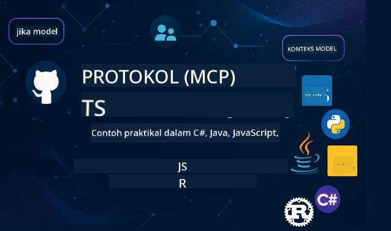

 

[](https://GitHub.com/microsoft/mcp-for-beginners/graphs/contributors)
[](https://GitHub.com/microsoft/mcp-for-beginners/issues)
[](https://GitHub.com/microsoft/mcp-for-beginners/pulls)
[](http://makeapullrequest.com)

[](https://GitHub.com/microsoft/mcp-for-beginners/watchers)
[](https://GitHub.com/microsoft/mcp-for-beginners/fork)
[](https://GitHub.com/microsoft/mcp-for-beginners/stargazers)


[](https://discord.gg/nTYy5BXMWG)

Ikuti langkah ini untuk mula menggunakan sumber-sumber ini:
1. **Fork Repositori**: Klik [](https://GitHub.com/microsoft/mcp-for-beginners/fork)
2. **Clone Repositori**:   `git clone https://github.com/microsoft/mcp-for-beginners.git`
3. **Sertai** [](https://discord.gg/nTYy5BXMWG)


### 🌐 Sokongan Pelbagai Bahasa

#### Disokong melalui GitHub Action (Automatik & Sentiasa Dikemaskini)

<!-- CO-OP TRANSLATOR LANGUAGES TABLE START -->
[Arabic](../ar/README.md) | [Bengali](../bn/README.md) | [Bulgarian](../bg/README.md) | [Burmese (Myanmar)](../my/README.md) | [Chinese (Simplified)](../zh-CN/README.md) | [Chinese (Traditional, Hong Kong)](../zh-HK/README.md) | [Chinese (Traditional, Macau)](../zh-MO/README.md) | [Chinese (Traditional, Taiwan)](../zh-TW/README.md) | [Croatian](../hr/README.md) | [Czech](../cs/README.md) | [Danish](../da/README.md) | [Dutch](../nl/README.md) | [Estonian](../et/README.md) | [Finnish](../fi/README.md) | [French](../fr/README.md) | [German](../de/README.md) | [Greek](../el/README.md) | [Hebrew](../he/README.md) | [Hindi](../hi/README.md) | [Hungarian](../hu/README.md) | [Indonesian](../id/README.md) | [Italian](../it/README.md) | [Japanese](../ja/README.md) | [Kannada](../kn/README.md) | [Korean](../ko/README.md) | [Lithuanian](../lt/README.md) | [Malay](./README.md) | [Malayalam](../ml/README.md) | [Marathi](../mr/README.md) | [Nepali](../ne/README.md) | [Nigerian Pidgin](../pcm/README.md) | [Norwegian](../no/README.md) | [Persian (Farsi)](../fa/README.md) | [Polish](../pl/README.md) | [Portuguese (Brazil)](../pt-BR/README.md) | [Portuguese (Portugal)](../pt-PT/README.md) | [Punjabi (Gurmukhi)](../pa/README.md) | [Romanian](../ro/README.md) | [Russian](../ru/README.md) | [Serbian (Cyrillic)](../sr/README.md) | [Slovak](../sk/README.md) | [Slovenian](../sl/README.md) | [Spanish](../es/README.md) | [Swahili](../sw/README.md) | [Swedish](../sv/README.md) | [Tagalog (Filipino)](../tl/README.md) | [Tamil](../ta/README.md) | [Telugu](../te/README.md) | [Thai](../th/README.md) | [Turkish](../tr/README.md) | [Ukrainian](../uk/README.md) | [Urdu](../ur/README.md) | [Vietnamese](../vi/README.md)

> **Lebih Suka Clone Secara Tempatan?**

> Repositori ini merangkumi lebih 50+ terjemahan bahasa yang secara signifikan meningkatkan saiz muat turun. Untuk clone tanpa terjemahan, gunakan sparse checkout:
> ```bash
> git clone --filter=blob:none --sparse https://github.com/microsoft/mcp-for-beginners.git
> cd mcp-for-beginners
> git sparse-checkout set --no-cone '/*' '!translations' '!translated_images'
> ```
> Ini memberikan anda semua yang anda perlukan untuk menyelesaikan kursus dengan muat turun yang lebih pantas.
<!-- CO-OP TRANSLATOR LANGUAGES TABLE END -->

# 🚀 Kurikulum Protokol Konteks Model (MCP) untuk Pemula

## **Belajar MCP dengan Contoh Kod Praktikal dalam C#, Java, JavaScript, Rust, Python, dan TypeScript**

## 🧠 Gambaran Keseluruhan Kurikulum Protokol Konteks Model
Selamat datang ke perjalanan anda ke dalam Protokol Konteks Model! Jika anda pernah tertanya-tanya bagaimana aplikasi AI berkomunikasi dengan pelbagai alat dan perkhidmatan, anda akan menemui solusi elegan yang sedang mengubah cara pembangun membina sistem pintar.

Fikirkan MCP sebagai penterjemah universal untuk aplikasi AI - sama seperti port USB membolehkan anda menyambungkan mana-mana peranti ke komputer anda, MCP membolehkan model AI disambungkan ke mana-mana alat atau perkhidmatan secara standard. Sama ada anda membina chatbot pertama anda atau bekerja pada aliran kerja AI yang kompleks, memahami MCP akan memberi anda kuasa untuk mencipta aplikasi yang lebih berkeupayaan dan fleksibel.

Kurikulum ini direka dengan kesabaran dan perhatian untuk perjalanan pembelajaran anda. Kami akan bermula dengan konsep mudah yang anda sudah fahami dan secara beransur-ansur membina kepakaran anda melalui amalan langsung dalam bahasa pengaturcaraan kegemaran anda. Setiap langkah termasuk penjelasan jelas, contoh praktikal, dan banyak galakan sepanjang perjalanan.

Pada masa anda melengkapkan perjalanan ini, anda akan mempunyai keyakinan untuk membina pelayan MCP anda sendiri, mengintegrasikannya dengan platform AI popular, dan memahami bagaimana teknologi ini membentuk masa depan pembangunan AI. Marilah kita mulakan pengembaraan menarik ini bersama!

### Dokumentasi Rasmi dan Spesifikasi

Sumber ini menjadi lebih bernilai apabila pemahaman anda bertambah, tetapi jangan rasa tertekan untuk membaca semuanya segera. Mula dengan kawasan yang paling menarik minat anda!
- 📘 [Dokumentasi MCP](https://modelcontextprotocol.io/) – Ini adalah sumber utama anda untuk tutorial langkah demi langkah dan panduan pengguna. Dokumentasi ditulis dengan pemula dalam fikiran, memberikan contoh jelas yang anda boleh ikuti mengikut kadar anda sendiri.
- 📜 [Spesifikasi MCP](https://modelcontextprotocol.io/docs/) – Fikirkan ini sebagai manual rujukan menyeluruh anda. Semasa anda melalui kurikulum, anda akan kembali ke sini untuk mencari maklumat spesifik dan meneroka ciri lanjutan.
- 📜 [Spesifikasi MCP Asal](https://modelcontextprotocol.io/specification/versioning) – Ini mengandungi maklumat teknikal tambahan yang boleh membantu untuk pelaksanaan lanjutan. Ia tersedia apabila anda memerlukannya, tetapi jangan risau jika anda baru bermula.
- 🧑‍💻 [Repositori GitHub MCP](https://github.com/modelcontextprotocol) – Di sini anda akan menemui SDK, alat, dan contoh kod dalam pelbagai bahasa pengaturcaraan. Ia seperti peti harta karun contoh praktikal dan komponen siap guna.
- 🌐 [Komuniti MCP](https://github.com/orgs/modelcontextprotocol/discussions) – Sertai pelajar dan pembangun berpengalaman dalam perbincangan tentang MCP. Ia adalah komuniti sokongan di mana soalan dialu-alukan dan pengetahuan dikongsi secara terbuka.
  
## Objektif Pembelajaran

Menjelang akhir kurikulum ini, anda akan berasa yakin dan teruja dengan kemahiran baru anda. Berikut adalah apa yang anda akan capai:

• **Memahami asas MCP**: Anda akan memahami apa itu Protokol Konteks Model dan mengapa ia merevolusikan cara aplikasi AI bekerjasama, menggunakan analogi dan contoh yang mudah difahami.

• **Membina pelayan MCP pertama anda**: Anda akan mencipta pelayan MCP berfungsi dalam bahasa pengaturcaraan pilihan anda, bermula dengan contoh mudah dan meningkatkan kemahiran secara berperingkat.

• **Menyambungkan model AI ke alat sebenar**: Anda akan belajar bagaimana menjembatani jurang antara model AI dan perkhidmatan sebenar, memberikan aplikasi anda keupayaan baru yang berkuasa.

• **Melaksanakan amalan keselamatan terbaik**: Anda akan memahami cara menjaga pelaksanaan MCP anda supaya selamat dan terjamin, melindungi aplikasi dan pengguna anda.

• **Menyebarkan dengan keyakinan**: Anda akan tahu bagaimana membawa projek MCP anda dari pembangunan ke pengeluaran, dengan strategi penyebaran praktikal yang berkesan dalam dunia sebenar.

• **Sertai komuniti MCP**: Anda akan menjadi sebahagian daripada komuniti pembangun yang berkembang yang sedang membentuk masa depan pembangunan aplikasi AI. 

## Latar Belakang Asas

Sebelum kita menyelami MCP secara khusus, mari pastikan anda selesa dengan beberapa konsep asas. Jangan risau jika anda bukan pakar dalam bidang ini – kami akan terangkan segala yang anda perlu tahu sepanjang perjalanan!

### Memahami Protokol (Asas)

Fikirkan protokol seperti peraturan untuk satu perbualan. Apabila anda menelefon kawan, anda berdua tahu untuk mengucapkan "hello" apabila menjawab, bergilir-gilir bercakap, dan mengucapkan "goodbye" apabila selesai. Program komputer juga memerlukan peraturan seumpama itu untuk berkomunikasi dengan berkesan.

MCP adalah protokol - satu set peraturan yang dipersetujui yang membantu model dan aplikasi AI mengadakan "perbualan" yang produktif dengan alat dan perkhidmatan. Sama seperti peraturan perbualan memudahkan komunikasi manusia menjadi lebih lancar, MCP membuat komunikasi aplikasi AI menjadi lebih boleh dipercayai dan berkuasa.

### Hubungan Pelanggan-Pelayan (Cara Program Bekerjasama)

Anda sudah menggunakan hubungan pelanggan-pelayan setiap hari! Apabila anda menggunakan pelayar web (pelanggan) untuk melawat laman web, anda berhubung dengan pelayan yang menghantar kandungan laman web tersebut. Pelayar tahu cara meminta maklumat, dan pelayan tahu cara memberi tindak balas.

Dalam MCP, kita mempunyai hubungan yang serupa: model AI bertindak sebagai pelanggan yang meminta maklumat atau tindakan, manakala pelayan MCP menyediakan keupayaan tersebut. Ia seperti mempunyai pembantu yang membantu (pelayan) yang boleh diminta oleh AI untuk melaksanakan tugas khusus.

### Mengapa Penyeragaman Penting (Memastikan Keserasian)

Bayangkan jika setiap pengeluar kereta menggunakan pam petrol berbentuk berlainan – anda perlu penyesuai yang berbeza untuk setiap kereta! Penyeragaman bermaksud kita bersetuju menggunakan pendekatan yang sama supaya segala-galanya boleh bekerjasama dengan lancar.

MCP menyediakan penyeragaman ini untuk aplikasi AI. Daripada setiap model AI memerlukan kod khusus untuk setiap alat, MCP mencipta cara universal untuk mereka berkomunikasi. Ini bermakna pembangun boleh membina alat sekali dan alat itu berfungsi dengan banyak sistem AI berbeza.

## 🧭 Gambaran Keseluruhan Laluan Pembelajaran Anda

Perjalanan MCP anda disusun dengan teliti untuk membina keyakinan dan kemahiran secara progresif. Setiap fasa memperkenalkan konsep baru sambil mengukuhkan apa yang telah anda pelajari.

### 🌱 Fasa Asas: Memahami Asas (Modul 0-2)

Di sinilah pengembaraan anda bermula! Kami akan memperkenalkan konsep MCP menggunakan analogi yang biasa dan contoh mudah. Anda akan faham apa itu MCP, mengapa ia wujud, dan bagaimana ia sesuai dalam dunia pembangunan AI yang lebih luas.

• **Modul 0 - Pengenalan kepada MCP**: Kami akan bermula dengan meneroka apa itu MCP dan mengapa ia sangat penting untuk aplikasi AI moden. Anda akan melihat contoh MCP dalam tindakan dunia nyata dan faham bagaimana ia menyelesaikan masalah biasa yang dihadapi pembangun.

• **Modul 1 - Penjelasan Konsep Teras**: Di sini anda akan belajar blok bangunan utama MCP. Kami menggunakan banyak analogi dan contoh visual untuk memastikan konsep ini mudah difahami.

• **Modul 2 - Keselamatan dalam MCP**: Keselamatan mungkin kedengaran menakutkan, tetapi kami akan tunjukkan bagaimana MCP mempunyai ciri keselamatan terbina dalam dan mengajar anda amalan terbaik yang melindungi aplikasi anda dari awal.

### 🔨 Fasa Membina: Membina Pelaksanaan Pertama Anda (Modul 3)

Sekarang keseronokan sebenar bermula! Anda akan mendapat pengalaman praktikal membina pelayan dan pelanggan MCP yang sebenar. Jangan risau – kami akan bermula secara mudah dan membimbing anda melalui setiap langkah.

Modul ini mengandungi beberapa panduan praktikal yang membolehkan anda berlatih dalam bahasa pengaturcaraan pilihan anda. Anda akan mencipta pelayan pertama, membina pelanggan untuk menyambung kepadanya, dan bahkan mengintegrasi dengan alat pembangunan popular seperti VS Code.
Setiap panduan merangkumi contoh kod lengkap, petua penyelesaian masalah, dan penjelasan mengapa kami membuat pilihan reka bentuk tertentu. Pada akhir fasa ini, anda akan mempunyai pelaksanaan MCP yang berfungsi dan boleh dibanggakan!

### 🚀 Fasa Pertumbuhan: Konsep Lanjutan dan Aplikasi Dunia Sebenar (Modul 4-5)

Dengan penguasaan asas, anda sudah bersedia untuk menerokai ciri MCP yang lebih canggih. Kami akan membincangkan strategi pelaksanaan praktikal, teknik penyahpepijatan, dan topik lanjutan seperti integrasi AI berbilang modaliti.

Anda juga akan belajar bagaimana untuk mengembangkan pelaksanaan MCP anda bagi kegunaan pengeluaran dan mengintegrasi dengan platform awan seperti Azure. Modul-modul ini menyediakan anda untuk membina penyelesaian MCP yang mampu memenuhi tuntutan dunia sebenar.

### 🌟 Fasa Penguasaan: Komuniti dan Kepakaran (Modul 6-11)

Fasa akhir memberi tumpuan kepada menyertai komuniti MCP dan memfokuskan kepakaran dalam bidang yang paling diminati anda. Anda akan belajar cara menyumbang kepada projek MCP sumber terbuka, melaksanakan corak pengesahan lanjutan, dan membina penyelesaian bersepadu pangkalan data yang komprehensif.

Modul 11 layak mendapat sebutan khas - ia merupakan laluan pembelajaran praktikal 13 makmal yang lengkap yang mengajar anda membina pelayan MCP yang sedia untuk pengeluaran dengan integrasi PostgreSQL. Ia seperti projek penutup yang menggabungkan segala yang telah anda pelajari!

### 📚 Struktur Kurikulum Lengkap

| Modul | Topik | Penerangan | Pautan |
|--------|-------|-------------|------|
| **Modul 1-3: Asas** | | | |
| 00 | Pengenalan MCP | Gambaran keseluruhan Protokol Konteks Model dan kepentingannya dalam saluran AI | [Baca lanjut](./00-Introduction/README.md) |
| 01 | Penjelasan Konsep Teras | Eksplorasi mendalam konsep teras MCP | [Baca lanjut](./01-CoreConcepts/README.md) |
| 02 | Keselamatan dalam MCP | Ancaman keselamatan dan amalan terbaik | [Baca lanjut](./02-Security/README.md) |
| 03 | Memulakan dengan MCP | Penetapan persekitaran, pelayan/klien asas, integrasi | [Baca lanjut](./03-GettingStarted/README.md) |
| **Modul 3: Membina Pelayan & Klien Pertama Anda** | | | |
| 3.1 | Pelayan Pertama | Cipta pelayan MCP pertama anda | [Panduan](./03-GettingStarted/01-first-server/README.md) |
| 3.2 | Klien Pertama | Bangunkan klien MCP asas | [Panduan](./03-GettingStarted/02-client/README.md) |
| 3.3 | Klien dengan LLM | Integrasi model bahasa besar | [Panduan](./03-GettingStarted/03-llm-client/README.md) |
| 3.4 | Integrasi VS Code | Gunakan pelayan MCP dalam VS Code | [Panduan](./03-GettingStarted/04-vscode/README.md) |
| 3.5 | Pelayan stdio | Cipta pelayan menggunakan pengangkutan stdio | [Panduan](./03-GettingStarted/05-stdio-server/README.md) |
| 3.6 | Penstriman HTTP | Laksanakan penstriman HTTP dalam MCP | [Panduan](./03-GettingStarted/06-http-streaming/README.md) |
| 3.7 | Toolkit AI | Gunakan AI Toolkit dengan MCP | [Panduan](./03-GettingStarted/07-aitk/README.md) |
| 3.8 | Pengujian | Uji pelaksanaan pelayan MCP anda | [Panduan](./03-GettingStarted/08-testing/README.md) |
| 3.9 | Penyebaran | Sebarkan pelayan MCP ke pengeluaran | [Panduan](./03-GettingStarted/09-deployment/README.md) |
| 3.10 | Penggunaan pelayan lanjutan | Gunakan pelayan lanjutan untuk penggunaan ciri lanjutan dan seni bina yang dipertingkatkan | [Panduan](./03-GettingStarted/10-advanced/README.md) |
| 3.11 | Pengesahan mudah | Bab yang menunjukkan pengesahan dari awal dan RBAC | [Panduan](./03-GettingStarted/11-simple-auth/README.md) |
| **Modul 4-5: Praktikal & Lanjutan** | | | |
| 04 | Pelaksanaan Praktikal | SDK, penyahpepijatan, pengujian, templat arahan boleh guna semula | [Baca lanjut](./04-PracticalImplementation/README.md) |
| 05 | Topik Lanjutan dalam MCP | AI berbilang modaliti, penskalaan, kegunaan perusahaan | [Baca lanjut](./05-AdvancedTopics/README.md) |
| 5.1 | Integrasi Azure | Integrasi MCP dengan Azure | [Panduan](./05-AdvancedTopics/mcp-integration/README.md) |
| 5.2 | Multi-modality | Bekerja dengan pelbagai modaliti | [Panduan](./05-AdvancedTopics/mcp-multi-modality/README.md) |
| 5.3 | Demo OAuth2 | Melaksanakan pengesahan OAuth2 | [Panduan](./05-AdvancedTopics/mcp-oauth2-demo/README.md) |
| 5.4 | Konteks Akar | Memahami dan melaksanakan konteks akar | [Panduan](./05-AdvancedTopics/mcp-root-contexts/README.md) |
| 5.5 | Penghalaan | Strategi penghalaan MCP | [Panduan](./05-AdvancedTopics/mcp-routing/README.md) |
| 5.6 | Pensampelan | Teknik pensampelan dalam MCP | [Panduan](./05-AdvancedTopics/mcp-sampling/README.md) |
| 5.7 | Penskalaan | Mengembangkan pelaksanaan MCP | [Panduan](./05-AdvancedTopics/mcp-scaling/README.md) |
| 5.8 | Keselamatan | Pertimbangan keselamatan lanjutan | [Panduan](./05-AdvancedTopics/mcp-security/README.md) |
| 5.9 | Carian Web | Melaksanakan keupayaan carian web | [Panduan](./05-AdvancedTopics/web-search-mcp/README.md) |
| 5.10 | Penstriman Masa Sebenar | Membina fungsi penstriman masa sebenar | [Panduan](./05-AdvancedTopics/mcp-realtimestreaming/README.md) |
| 5.11 | Carian Masa Sebenar | Melaksanakan carian masa sebenar | [Panduan](./05-AdvancedTopics/mcp-realtimesearch/README.md) |
| 5.12 | Pengesahan Entra ID | Pengesahan dengan Microsoft Entra ID | [Panduan](./05-AdvancedTopics/mcp-security-entra/README.md) |
| 5.13 | Integrasi Foundry | Integrasi dengan Azure AI Foundry | [Panduan](./05-AdvancedTopics/mcp-foundry-agent-integration/README.md) |
| 5.14 | Kejuruteraan Konteks | Teknik untuk kejuruteraan konteks efektif | [Panduan](./05-AdvancedTopics/mcp-contextengineering/README.md) |
| 5.15 | Pengangkutan Khusus MCP | Pelaksanaan pengangkutan khusus | [Panduan](./05-AdvancedTopics/mcp-transport/README.md) |
| **Modul 6-10: Komuniti & Amalan Terbaik** | | | |
| 06 | Sumbangan Komuniti | Cara menyumbang kepada ekosistem MCP | [Panduan](./06-CommunityContributions/README.md) |
| 07 | Wawasan dari Penggunaan Awal | Kisah pelaksanaan dunia sebenar | [Panduan](./07-LessonsFromEarlyAdoption/README.md) |
| 08 | Amalan Terbaik bagi MCP | Prestasi, ketahanan kesalahan, ketahanan | [Panduan](./08-BestPractices/README.md) |
| 09 | Kajian Kes MCP | Contoh pelaksanaan praktikal | [Panduan](./09-CaseStudy/README.md) |
| 10 | Bengkel Praktikal | Membina Pelayan MCP dengan AI Toolkit | [Makmal](./10-StreamliningAIWorkflowsBuildingAnMCPServerWithAIToolkit/README.md) |
| **Modul 11: Makmal Praktikal Pelayan MCP** | | | |
| 11 | Integrasi Pangkalan Data Pelayan MCP | Laluan pembelajaran praktikal 13 makmal untuk integrasi PostgreSQL | [Makmal](./11-MCPServerHandsOnLabs/README.md) |
| 11.1 | Pengenalan | Gambaran keseluruhan MCP dengan integrasi pangkalan data dan kes penggunaan analitik runcit | [Makmal 00](./11-MCPServerHandsOnLabs/00-Introduction/README.md) |
| 11.2 | Seni Bina Teras | Memahami seni bina pelayan MCP, lapisan pangkalan data, dan corak keselamatan | [Makmal 01](./11-MCPServerHandsOnLabs/01-Architecture/README.md) |
| 11.3 | Keselamatan & Multi-Penyewa | Keselamatan Peringkat Baris, pengesahan, dan akses data berbilang penyewa | [Makmal 02](./11-MCPServerHandsOnLabs/02-Security/README.md) |
| 11.4 | Penetapan Persekitaran | Menyiapkan persekitaran pembangunan, Docker, sumber Azure | [Makmal 03](./11-MCPServerHandsOnLabs/03-Setup/README.md) |
| 11.5 | Reka Bentuk Pangkalan Data | Persediaan PostgreSQL, reka bentuk skema runcit, dan data contoh | [Makmal 04](./11-MCPServerHandsOnLabs/04-Database/README.md) |
| 11.6 | Pelaksanaan Pelayan MCP | Membina pelayan FastMCP dengan integrasi pangkalan data | [Makmal 05](./11-MCPServerHandsOnLabs/05-MCP-Server/README.md) |
| 11.7 | Pembangunan Alat | Mencipta alat carian pangkalan data dan introspeksi skema | [Makmal 06](./11-MCPServerHandsOnLabs/06-Tools/README.md) |
| 11.8 | Carian Semantik | Melaksanakan penjajaran vektor dengan Azure OpenAI dan pgvector | [Makmal 07](./11-MCPServerHandsOnLabs/07-Semantic-Search/README.md) |
| 11.9 | Pengujian & Penyahpepijatan | Strategi pengujian, alat penyahpepijatan, dan pendekatan pengesahan | [Makmal 08](./11-MCPServerHandsOnLabs/08-Testing/README.md) |
| 11.10 | Integrasi VS Code | Mengkonfigurasi integrasi MCP VS Code dan penggunaan AI Chat | [Makmal 09](./11-MCPServerHandsOnLabs/09-VS-Code/README.md) |
| 11.11 | Strategi Penyebaran | Penyebaran Docker, Azure Container Apps, dan pertimbangan penskalaan | [Makmal 10](./11-MCPServerHandsOnLabs/10-Deployment/README.md) |
| 11.12 | Pemantauan | Application Insights, logging, pemantauan prestasi | [Makmal 11](./11-MCPServerHandsOnLabs/11-Monitoring/README.md) |
| 11.13 | Amalan Terbaik | Pengoptimuman prestasi, pengukuhan keselamatan, dan petua pengeluaran | [Makmal 12](./11-MCPServerHandsOnLabs/12-Best-Practices/README.md) |

### 💻 Projek Kod Sampel

Salah satu bahagian paling menarik dalam mempelajari MCP adalah melihat kemahiran kod anda berkembang secara berperingkat. Kami telah mereka contoh kod kami supaya bermula dengan ringkas dan berkembang menjadi lebih sofistikated dengan pemahaman anda yang semakin mendalam. Berikut adalah cara kami memperkenalkan konsep – dengan kod yang mudah difahami tetapi menunjukkan prinsip sebenar MCP, anda akan memahami bukan sahaja apa yang kod ini lakukan, tetapi mengapa ia disusun sedemikian dan bagaimana ia sesuai dalam aplikasi MCP yang lebih besar.

#### Contoh Kalkulator MCP Asas

| Bahasa | Penerangan | Pautan |
|----------|-------------|------|
| C# | Contoh Pelayan MCP | [Lihat Kod](./03-GettingStarted/samples/csharp/README.md) |
| Java | Kalkulator MCP | [Lihat Kod](./03-GettingStarted/samples/java/calculator/README.md) |
| JavaScript | Demo MCP | [Lihat Kod](./03-GettingStarted/samples/javascript/README.md) |
| Python | Pelayan MCP | [Lihat Kod](../../03-GettingStarted/samples/python/mcp_calculator_server.py) |
| TypeScript | Contoh MCP | [Lihat Kod](./03-GettingStarted/samples/typescript/README.md) |
| Rust | Contoh MCP | [Lihat Kod](./03-GettingStarted/samples/rust/README.md) |

#### Pelaksanaan MCP Lanjutan

| Bahasa | Penerangan | Pautan |
|----------|-------------|------|
| C# | Contoh Lanjutan | [Lihat Kod](./04-PracticalImplementation/samples/csharp/README.md) |
| Java dengan Spring | Contoh Aplikasi Kontena | [Lihat Kod](./04-PracticalImplementation/samples/java/containerapp/README.md) |
| JavaScript | Contoh Lanjutan | [Lihat Kod](./04-PracticalImplementation/samples/javascript/README.md) |
| Python | Pelaksanaan Kompleks | [Lihat Kod](../../04-PracticalImplementation/samples/python/READMEmd) |
| TypeScript | Contoh Kontena | [Lihat Kod](./04-PracticalImplementation/samples/typescript/README.md) |


## 🎯 Prasyarat untuk Mempelajari MCP

Untuk mendapat manfaat maksimum dari kurikulum ini, anda harus mempunyai:

- Pengetahuan asas pengaturcaraan dalam sekurang-kurangnya salah satu bahasa berikut: C#, Java, JavaScript, Python, atau TypeScript
- Pemahaman model klien-pelayan dan API
- Kefahaman tentang konsep REST dan HTTP
- (Pilihan) Latar belakang dalam konsep AI/ML

- Menyertai perbincangan komuniti kami untuk sokongan

## 📚 Panduan Belajar & Sumber

Repositori ini mengandungi beberapa sumber untuk membantu anda menavigasi dan belajar dengan berkesan:

### Panduan Belajar

Panduan [Belajar](./study_guide.md) yang komprehensif disediakan untuk membantu anda menavigasi repositori ini dengan berkesan. Peta kurikulum visual ini menunjukkan bagaimana semua topik berhubung dan menyediakan panduan bagaimana menggunakan projek sampel dengan berkesan. Ia sangat berguna jika anda seorang pelajar visual yang suka melihat gambaran besar.

Panduan ini merangkumi:
- Peta kurikulum visual yang menunjukkan semua topik yang diliputi
- Pecahan terperinci setiap bahagian repositori
- Panduan cara menggunakan projek sampel
- Laluan pembelajaran yang disyorkan untuk tahap kemahiran berbeza
- Sumber tambahan untuk melengkapkan perjalanan pembelajaran anda

### Log Perubahan

Kami mengekalkan [Log Perubahan](./changelog.md) yang terperinci yang menjejaki semua kemas kini penting kepada bahan kurikulum, supaya anda boleh sentiasa mengikuti peningkatan dan penambahan terkini.
- Penambahan kandungan baru
- Perubahan struktur
- Penambahbaikan ciri
- Kemas kini dokumentasi

## 🛠️ Cara Menggunakan Kurikulum Ini Secara Berkesan

Setiap pelajaran dalam panduan ini merangkumi:
1. Penjelasan jelas tentang konsep MCP  
2. Contoh kod langsung dalam pelbagai bahasa  
3. Latihan untuk membina aplikasi MCP sebenar  
4. Sumber tambahan untuk pelajar lanjutan

## Kandungan Atas Permintaan 

### [Hari Pembangun MCP Julai 2025](https://developer.microsoft.com/en-us/reactor/series/S-1563/)
#### [➡️Tonton Atas Permintaan - Hari Pembangun MCP](https://developer.microsoft.com/en-us/reactor/series/S-1563/)
Bersiap sedia untuk dua hari wawasan teknikal mendalam, hubungan komuniti, dan pembelajaran secara langsung di Hari Pembangun MCP, acara maya yang didedikasikan untuk Protokol Konteks Model (MCP) — standard baru yang menghubungkan model AI dan alat yang mereka gunakan.
Anda boleh menonton Hari Pembangun MCP dengan mendaftar di halaman acara kami: https://aka.ms/mcpdevdays. 

#### [Hari 1: Produktiviti MCP, Alat Pembangun, & Komuniti:](https://developer.microsoft.com/en-us/reactor/series/S-1563/)

Adalah tentang memberi kuasa kepada pembangun untuk menggunakan MCP dalam aliran kerja pembangun mereka dan meraikan komuniti MCP yang hebat. Kami akan disertai oleh ahli komuniti dan rakan kongsi seperti Arcade, Block, Okta, dan Neon untuk melihat bagaimana mereka bekerjasama dengan Microsoft membentuk ekosistem MCP yang terbuka dan boleh dikembangkan. Demonstrasi dunia nyata merentasi VS Code, Visual Studio, GitHub Copilot, dan alat komuniti popular
Aliran kerja pembangun berasaskan konteks yang praktikal
Sesi dan wawasan yang dipimpin komuniti
Sama ada anda baru bermula dengan MCP atau sudah membina dengannya, Hari 1 akan menetapkan pentas dengan inspirasi dan petua yang boleh dilaksanakan.

#### [Hari 2: Membangun Pelayan MCP dengan Keyakinan](https://developer.microsoft.com/en-us/reactor/series/S-1563/)

Adalah untuk pembangun MCP. Kami akan mendalami strategi pelaksanaan dan amalan terbaik untuk mencipta pelayan MCP dan mengintegrasikan MCP ke dalam aliran kerja AI anda.

#### Topik termasuk:

- Membangun Pelayan MCP dan mengintegrasikannya ke dalam pengalaman agen
- Pembangunan berasaskan arahan prompt
- Amalan keselamatan terbaik
- Menggunakan blok binaan seperti Fungsi, ACA, dan Pengurusan API
- Penyelarasan pendaftar dan alat (1P + 3P)

Jika anda seorang pembangun, pembina alat, atau perancang produk AI, hari ini penuh dengan wawasan yang anda perlukan untuk membina penyelesaian MCP yang boleh diskalakan, selamat, dan bersedia untuk masa depan.

### Kem Boot MCP Ogos 2025
Belajar dalam sesi video intensif bagaimana mencipta pelayan MCP, mengintegrasi dengan VS Code, dan mengedar secara profesional di Azure berdasarkan kandungan dari kurikulum MCP untuk Pemula. Dapatkan kemahiran praktikal dalam teknologi yang syarikat besar sudah gunakan.

#### [➡️Tonton Atas Permintaan Kem Boot MCP | Bahasa Inggeris](https://developer.microsoft.com/en-us/reactor/series/s-1568/)
#### [➡️Tonton Atas Permintaan Kem Boot MCP | Brasil](https://developer.microsoft.com/en-us/reactor/series/S-1566/)
#### [➡️Tonton Atas Permintaan Kem Boot MCP | Sepanyol](https://developer.microsoft.com/en-us/reactor/series/S-1567/)

### Mari Belajar MCP dengan C# - Siri Tutorial
Mari belajar tentang Protokol Konteks Model (MCP), rangka kerja terkini yang direka untuk menstandardkan interaksi antara model AI dan aplikasi klien. Melalui sesi mesra pemula ini, kami akan memperkenalkan anda kepada MCP dan membimbing anda mencipta pelayan MCP pertama anda.
#### C#: [https://aka.ms/letslearnmcp-csharp](https://aka.ms/letslearnmcp-csharp)
#### Java: [https://aka.ms/letslearnmcp-java](https://aka.ms/letslearnmcp-java)
#### JavaScript: [https://aka.ms/letslearnmcp-javascript](https://aka.ms/letslearnmcp-javascript)
#### Python: [https://aka.ms/letslearnmcp-python](https://aka.ms/letslearnmcp-python)

## 🎓 Perjalanan MCP Anda Bermula

Tahniah! Anda baru sahaja mengambil langkah pertama dalam perjalanan menarik yang akan memperluaskan keupayaan pengaturcaraan anda dan menghubungkan anda kepada teknologi AI terkini.

### Apa yang Telah Anda Capai

Dengan membaca pengenalan ini, anda telah mula membina asas pengetahuan MCP anda. Anda memahami apa itu MCP, mengapa ia penting, dan bagaimana kurikulum ini akan menyokong perjalanan pembelajaran anda. Itu adalah pencapaian besar dan permulaan kepakaran anda dalam teknologi penting ini.

### Pengembaraan Di Hadapan

Semasa anda maju melalui modul, ingat bahawa setiap pakar pernah menjadi pemula. Konsep yang mungkin kelihatan rumit kini akan menjadi mudah apabila anda berlatih dan mengaplikasikannya. Setiap langkah kecil membina keupayaan kuat yang akan membantu anda sepanjang kerjaya pembangunan anda.

### Rangkaian Sokongan Anda

Anda menyertai komuniti pelajar dan pakar yang bersemangat mengenai MCP dan ingin membantu orang lain berjaya. Sama ada anda tersekat pada cabaran pengkodan atau teruja untuk berkongsi penemuan, komuniti di sini untuk menyokong perjalanan anda.

Jika anda tersekat atau mempunyai soalan tentang membina aplikasi AI. Sertai pelajar lain dan pembangun berpengalaman dalam perbincangan tentang MCP. Ia adalah komuniti penyokong di mana soalan dialu-alukan dan ilmu dikongsi secara bebas.

[](https://discord.gg/nTYy5BXMWG)

Jika anda mempunyai maklum balas produk atau kesilapan semasa membina, lawati:

[](https://aka.ms/foundry/forum)

### Sedia Untuk Bermula?

Pengembaraan MCP anda bermula sekarang! Mulakan dengan Modul 0 untuk menyelami pengalaman MCP pertama anda secara langsung, atau teroka projek contoh untuk melihat apa yang akan anda bina. Ingat - setiap pakar bermula di tempat anda sekarang, dan dengan kesabaran dan latihan, anda akan terkejut dengan apa yang boleh anda capai.

Selamat datang ke dunia pembangunan Protokol Konteks Model. Mari bina sesuatu yang hebat bersama!

## 🤝 Menyumbang kepada Komuniti Pembelajaran

Kurikulum ini menjadi lebih kukuh dengan sumbangan daripada pelajar seperti anda! Sama ada anda membetulkan kesalahan ejaan, mencadangkan penerangan yang lebih jelas, atau menambah contoh baru, sumbangan anda membantu pemula lain berjaya.

Terima kasih kepada Profesional Bernilai Microsoft [Shivam Goyal](https://www.linkedin.com/in/shivam2003/) atas sumbangan contoh kod.

Proses sumbangan direka untuk mesra dan menyokong. Kebanyakan sumbangan memerlukan Perjanjian Lesen Penyumbang (CLA), tetapi alat automatik akan membimbing anda melalui proses dengan lancar.

## 📜 Pembelajaran Sumber Terbuka

Keseluruhan kurikulum ini tersedia di bawah lesen MIT [LICENSE](../../LICENSE), bermakna anda boleh menggunakan, mengubah suai, dan berkongsi secara bebas. Ini menyokong misi kami untuk menjadikan pengetahuan MCP boleh diakses oleh pembangun di mana-mana.
## 🤝 Garis Panduan Sumbangan

Projek ini mengalu-alukan sumbangan dan cadangan. Kebanyakan sumbangan memerlukan anda bersetuju dengan
Perjanjian Lesen Penyumbang (CLA) yang menyatakan bahawa anda mempunyai hak untuk, dan sebenarnya memberi,
hak kepada kami untuk menggunakan sumbangan anda. Untuk maklumat lanjut, lawati <https://cla.opensource.microsoft.com>.

Apabila anda menghantar permintaan tarik, bot CLA akan secara automatik menentukan sama ada anda perlu menyediakan
CLA dan menghiasi PR dengan sewajarnya (contohnya, semakan status, komen). Ikuti sahaja arahan
yang diberikan oleh bot. Anda hanya perlu melakukan ini sekali untuk semua repositori yang menggunakan CLA kami.

Projek ini telah mengamalkan [Kod Etika Sumber Terbuka Microsoft](https://opensource.microsoft.com/codeofconduct/).
Untuk maklumat lanjut, lihat [Soalan Lazim Kod Etika](https://opensource.microsoft.com/codeofconduct/faq/) atau
hubungi [opencode@microsoft.com](mailto:opencode@microsoft.com) bagi sebarang soalan atau komen tambahan.

---

*Bersedia memulakan perjalanan MCP anda? Mulakan dengan [Modul 00 - Pengenalan kepada MCP](./00-Introduction/README.md) dan ambil langkah pertama anda ke dunia pembangunan Protokol Konteks Model!*


## 🎒 Kursus Lain
Pasukan kami menghasilkan kursus lain! Lihat:

<!-- CO-OP TRANSLATOR OTHER COURSES START -->
### LangChain
[](https://aka.ms/langchain4j-for-beginners)
[](https://aka.ms/langchainjs-for-beginners?WT.mc_id=m365-94501-dwahlin)

---

### Azure / Edge / MCP / Agen
[](https://github.com/microsoft/AZD-for-beginners?WT.mc_id=academic-105485-koreyst)
[](https://github.com/microsoft/edgeai-for-beginners?WT.mc_id=academic-105485-koreyst)
[](https://github.com/microsoft/mcp-for-beginners?WT.mc_id=academic-105485-koreyst)
[](https://github.com/microsoft/ai-agents-for-beginners?WT.mc_id=academic-105485-koreyst)

---
 
### Siri AI Generatif
[](https://github.com/microsoft/generative-ai-for-beginners?WT.mc_id=academic-105485-koreyst)
[-9333EA?style=for-the-badge&labelColor=E5E7EB&color=9333EA)](https://github.com/microsoft/Generative-AI-for-beginners-dotnet?WT.mc_id=academic-105485-koreyst)
[-C084FC?style=for-the-badge&labelColor=E5E7EB&color=C084FC)](https://github.com/microsoft/generative-ai-for-beginners-java?WT.mc_id=academic-105485-koreyst)
[-E879F9?style=for-the-badge&labelColor=E5E7EB&color=E879F9)](https://github.com/microsoft/generative-ai-with-javascript?WT.mc_id=academic-105485-koreyst)

---
 
### Pembelajaran Teras
[](https://aka.ms/ml-beginners?WT.mc_id=academic-105485-koreyst)
[](https://aka.ms/datascience-beginners?WT.mc_id=academic-105485-koreyst)
[](https://aka.ms/ai-beginners?WT.mc_id=academic-105485-koreyst)
[](https://github.com/microsoft/Security-101?WT.mc_id=academic-96948-sayoung)
[](https://aka.ms/webdev-beginners?WT.mc_id=academic-105485-koreyst)
[](https://aka.ms/iot-beginners?WT.mc_id=academic-105485-koreyst)
[](https://github.com/microsoft/xr-development-for-beginners?WT.mc_id=academic-105485-koreyst)

---
 
### Siri Copilot
[](https://aka.ms/GitHubCopilotAI?WT.mc_id=academic-105485-koreyst)
[](https://github.com/microsoft/mastering-github-copilot-for-dotnet-csharp-developers?WT.mc_id=academic-105485-koreyst)
[](https://github.com/microsoft/CopilotAdventures?WT.mc_id=academic-105485-koreyst)
<!-- CO-OP TRANSLATOR OTHER COURSES END -->

---

<!-- CO-OP TRANSLATOR DISCLAIMER START -->
**Penafian**:
Dokumen ini telah diterjemahkan menggunakan perkhidmatan terjemahan AI [Co-op Translator](https://github.com/Azure/co-op-translator). Walaupun kami berusaha untuk ketepatan, sila ambil maklum bahawa terjemahan automatik mungkin mengandungi kesilapan atau ketidaktepatan. Dokumen asal dalam bahasa asalnya harus dianggap sebagai sumber yang sah. Untuk maklumat penting, terjemahan manusia profesional adalah disyorkan. Kami tidak bertanggungjawab atas sebarang salah faham atau salah tafsir yang timbul daripada penggunaan terjemahan ini.
<!-- CO-OP TRANSLATOR DISCLAIMER END -->