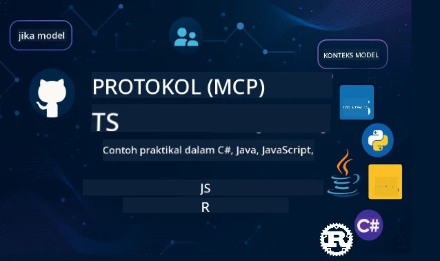

 

[](https://GitHub.com/microsoft/mcp-for-beginners/graphs/contributors)
[](https://GitHub.com/microsoft/mcp-for-beginners/issues)
[](https://GitHub.com/microsoft/mcp-for-beginners/pulls)
[](http://makeapullrequest.com)

[](https://GitHub.com/microsoft/mcp-for-beginners/watchers)
[](https://GitHub.com/microsoft/mcp-for-beginners/fork)
[](https://GitHub.com/microsoft/mcp-for-beginners/stargazers)


[](https://discord.gg/nTYy5BXMWG)

Ikuti langkah-langkah ini untuk mula menggunakan sumber ini:
1. **Fork Repositori**: Klik [](https://GitHub.com/microsoft/mcp-for-beginners/fork)
2. **Clone Repositori**:   `git clone https://github.com/microsoft/mcp-for-beginners.git`
3. **Sertai** [](https://discord.gg/nTYy5BXMWG)


### 🌐 Sokongan Pelbagai Bahasa

#### Disokong melalui GitHub Action (Automatik & Sentiasa Terkini)

<!-- CO-OP TRANSLATOR LANGUAGES TABLE START -->
[Arabic](../ar/README.md) | [Bengali](../bn/README.md) | [Bulgarian](../bg/README.md) | [Burmese (Myanmar)](../my/README.md) | [Chinese (Simplified)](../zh-CN/README.md) | [Chinese (Traditional, Hong Kong)](../zh-HK/README.md) | [Chinese (Traditional, Macau)](../zh-MO/README.md) | [Chinese (Traditional, Taiwan)](../zh-TW/README.md) | [Croatian](../hr/README.md) | [Czech](../cs/README.md) | [Danish](../da/README.md) | [Dutch](../nl/README.md) | [Estonian](../et/README.md) | [Finnish](../fi/README.md) | [French](../fr/README.md) | [German](../de/README.md) | [Greek](../el/README.md) | [Hebrew](../he/README.md) | [Hindi](../hi/README.md) | [Hungarian](../hu/README.md) | [Indonesian](../id/README.md) | [Italian](../it/README.md) | [Japanese](../ja/README.md) | [Kannada](../kn/README.md) | [Korean](../ko/README.md) | [Lithuanian](../lt/README.md) | [Malay](./README.md) | [Malayalam](../ml/README.md) | [Marathi](../mr/README.md) | [Nepali](../ne/README.md) | [Nigerian Pidgin](../pcm/README.md) | [Norwegian](../no/README.md) | [Persian (Farsi)](../fa/README.md) | [Polish](../pl/README.md) | [Portuguese (Brazil)](../pt-BR/README.md) | [Portuguese (Portugal)](../pt-PT/README.md) | [Punjabi (Gurmukhi)](../pa/README.md) | [Romanian](../ro/README.md) | [Russian](../ru/README.md) | [Serbian (Cyrillic)](../sr/README.md) | [Slovak](../sk/README.md) | [Slovenian](../sl/README.md) | [Spanish](../es/README.md) | [Swahili](../sw/README.md) | [Swedish](../sv/README.md) | [Tagalog (Filipino)](../tl/README.md) | [Tamil](../ta/README.md) | [Telugu](../te/README.md) | [Thai](../th/README.md) | [Turkish](../tr/README.md) | [Ukrainian](../uk/README.md) | [Urdu](../ur/README.md) | [Vietnamese](../vi/README.md)

> **Lebih Suka Clone Secara Tempatan?**
>
> Repositori ini termasuk lebih 50+ terjemahan bahasa yang secara signifikan meningkatkan saiz muat turun. Untuk clone tanpa terjemahan, gunakan sparse checkout:
>
> **Bash / macOS / Linux:**
> ```bash
> git clone --filter=blob:none --sparse https://github.com/microsoft/mcp-for-beginners.git
> cd mcp-for-beginners
> git sparse-checkout set --no-cone '/*' '!translations' '!translated_images'
> ```
>
> **CMD (Windows):**
> ```cmd
> git clone --filter=blob:none --sparse https://github.com/microsoft/mcp-for-beginners.git
> cd mcp-for-beginners
> git sparse-checkout set --no-cone "/*" "!translations" "!translated_images"
> ```
>
> Ini memberikan anda segala yang anda perlukan untuk menyelesaikan kursus dengan muat turun yang lebih pantas.
<!-- CO-OP TRANSLATOR LANGUAGES TABLE END -->

# 🚀 Kurikulum Protokol Konteks Model (MCP) untuk Pemula

## **Belajar MCP dengan Contoh Kod Praktikal dalam C#, Java, JavaScript, Rust, Python, dan TypeScript**

## 🧠 Gambaran Keseluruhan Kurikulum Protokol Konteks Model
Selamat datang ke perjalanan anda dalam Model Context Protocol! Jika anda pernah tertanya-tanya bagaimana aplikasi AI berkomunikasi dengan pelbagai alat dan perkhidmatan, anda akan menemui penyelesaian elegan yang sedang mengubah cara pembangun membina sistem pintar.

Anggap MCP sebagai penterjemah sejagat untuk aplikasi AI - seperti bagaimana port USB membolehkan anda menyambungkan mana-mana peranti ke komputer anda, MCP membolehkan model AI disambungkan ke sebarang alat atau perkhidmatan secara piawai. Sama ada anda membina chatbot pertama anda atau bekerja pada aliran kerja AI yang kompleks, memahami MCP akan memberi anda kuasa untuk mencipta aplikasi yang lebih berkemampuan dan fleksibel.

Kurikulum ini direka dengan kesabaran dan penjagaan untuk perjalanan pembelajaran anda. Kami akan bermula dengan konsep mudah yang sudah anda fahami dan secara beransur-ansur membina kepakaran anda melalui amalan langsung dalam bahasa pengaturcaraan kegemaran anda. Setiap langkah merangkumi penjelasan yang jelas, contoh praktikal, dan sokongan yang banyak sepanjang perjalanan.

Apabila anda selesai menjalani perjalanan ini, anda akan mempunyai keyakinan untuk membina pelayan MCP anda sendiri, menyatukannya dengan platform AI popular, dan memahami bagaimana teknologi ini membentuk masa depan pembangunan AI. Mari kita mulakan pengembaraan menarik ini bersama-sama!

### Dokumentasi Rasmi dan Spesifikasi

Kurikulum ini selaras dengan **Spesifikasi MCP 2025-11-25** (rilis stabil terkini). Spesifikasi MCP menggunakan penomboran versi berdasarkan tarikh (format YYYY-MM-DD) untuk memastikan penjejakan versi protokol yang jelas.

Sumber ini menjadi lebih bernilai seiring pertumbuhan pemahaman anda, tetapi jangan berasa tertekan untuk membaca semuanya serta-merta. Mulakan dengan bidang yang paling menarik minat anda!
- 📘 [Dokumentasi MCP](https://modelcontextprotocol.io/) – Ini adalah sumber utama anda untuk tutorial langkah demi langkah dan panduan pengguna. Dokumentasi ini ditulis dengan pemula dalam fikiran, menyediakan contoh jelas yang boleh anda ikuti mengikut kadar anda sendiri.
- 📜 [Spesifikasi MCP](https://modelcontextprotocol.io/specification/2025-11-25) – Anggap ini sebagai manual rujukan komprehensif anda. Semasa anda mengikut kurikulum, anda akan kerap kembali ke sini untuk melihat butiran tertentu dan meneroka ciri lanjutan.
- 📜 [Pengenalan Versi Spesifikasi MCP](https://modelcontextprotocol.io/specification/versioning) – Ini mengandungi maklumat mengenai sejarah versi protokol dan bagaimana MCP menggunakan penomboran versi berdasarkan tarikh (format YYYY-MM-DD).
- 🧑‍💻 [Repositori GitHub MCP](https://github.com/modelcontextprotocol) – Di sini anda akan menemui SDK, alat, dan contoh kod dalam pelbagai bahasa pengaturcaraan. Ia seperti khazanah contoh praktikal dan komponen sedia guna.
- 🌐 [Komuniti MCP](https://github.com/orgs/modelcontextprotocol/discussions) – Sertai rakan pelajar dan pembangun berpengalaman dalam perbincangan tentang MCP. Ia adalah komuniti yang menyokong di mana soalan dialu-alukan dan pengetahuan dikongsi secara percuma.
  
## Objektif Pembelajaran

Menjelang akhir kurikulum ini, anda akan berasa yakin dan teruja dengan kebolehan baru anda. Berikut adalah apa yang akan anda capai:

• **Memahami asas MCP**: Anda akan memahami apa itu Model Context Protocol dan mengapa ia merevolusikan cara aplikasi AI bekerjasama, menggunakan analogi dan contoh yang mudah difahami.

• **Membina pelayan MCP pertama anda**: Anda akan mencipta pelayan MCP yang berfungsi dalam bahasa pengaturcaraan pilihan anda, bermula dengan contoh mudah dan membina kemahiran anda langkah demi langkah.

• **Menyambungkan model AI ke alat sebenar**: Anda akan belajar bagaimana untuk merapatkan jurang antara model AI dan perkhidmatan sebenar, memberi aplikasi anda kebolehan baru yang hebat.

• **Melaksanakan amalan keselamatan terbaik**: Anda akan memahami cara menjaga pelaksanaan MCP anda selamat, melindungi aplikasi dan pengguna anda.

• **Mengeluarkan dengan keyakinan**: Anda akan tahu cara membawa projek MCP anda dari pembangunan ke pengeluaran, dengan strategi pengeluaran praktikal yang berkesan dalam dunia sebenar.

• **Menjadi sebahagian daripada komuniti MCP**: Anda akan menjadi sebahagian daripada komuniti pembangun yang berkembang yang membentuk masa depan pembangunan aplikasi AI.

## Latar Belakang Penting

Sebelum kita menyelami butiran MCP, mari pastikan anda selesa dengan beberapa konsep asas. Jangan risau jika anda bukan pakar dalam bidang ini - kami akan terangkan semua yang anda perlu tahu semasa perjalanan!

### Memahami Protokol (Asas)

Anggap protokol seperti peraturan untuk satu perbualan. Apabila anda menghubungi kawan, anda berdua tahu untuk mengucapkan "halo" apabila menjawab, bergilir bercakap, dan mengucapkan "selamat tinggal" apabila selesai. Program komputer memerlukan peraturan serupa untuk berkomunikasi dengan berkesan.

MCP adalah satu protokol - satu set peraturan yang dipersetujui yang membantu model AI dan aplikasi mengadakan "perbualan" yang produktif dengan alat dan perkhidmatan. Sama seperti peraturan perbualan membuat komunikasi manusia lebih lancar, MCP menjadikan komunikasi aplikasi AI lebih boleh dipercayai dan berkuasa.

### Hubungan Pelanggan-Pelayan (Bagaimana Program Bekerjasama)

Anda sudah menggunakan hubungan pelanggan-pelayan setiap hari! Apabila anda menggunakan pelayar web (pelanggan) untuk melawati laman web, anda menyambung ke pelayan web yang menghantar kandungan halaman. Pelayar tahu cara bertanya maklumat, dan pelayan tahu cara menjawab.

Dalam MCP, kita mempunyai hubungan serupa: model AI bertindak sebagai pelanggan yang meminta maklumat atau tindakan, sementara pelayan MCP menyediakan keupayaan tersebut. Ia seperti mempunyai pembantu yang berguna (pelayan) yang boleh diminta AI untuk melaksanakan tugas tertentu.

### Mengapa Pensijilan Piawai Penting (Membuat Perkara Berfungsi Bersama)

Bayangkan jika setiap pengilang kereta menggunakan bentuk pam minyak yang berbeza - anda memerlukan penyesuai berbeza untuk setiap kereta! Pensijilan piawai bermaksud bersetuju tentang pendekatan biasa supaya semua perkara boleh berfungsi bersama-sama dengan lancar.

MCP menyediakan pensijilan piawai untuk aplikasi AI. Sebaliknya setiap model AI memerlukan kod khusus untuk bekerja dengan setiap alat, MCP mewujudkan cara universal bagi mereka berkomunikasi. Ini bermakna pembangun boleh membina alat sekali dan ia akan berfungsi dengan banyak sistem AI yang berbeza.

## 🧭 Gambaran Keseluruhan Laluan Pembelajaran Anda

Perjalanan MCP anda disusun dengan teliti untuk membina keyakinan dan kemahiran anda secara berperingkat. Setiap fasa memperkenalkan konsep baru sambil menguatkan apa yang telah anda pelajari.

### 🌱 Fasa Asas: Memahami Asas (Modul 0-2)

Di sinilah pengembaraan anda bermula! Kami akan memperkenalkan konsep MCP menggunakan analogi yang biasa dan contoh mudah. Anda akan faham apa itu MCP, mengapa ia wujud, dan bagaimana ia sesuai dengan dunia pembangunan AI yang lebih besar.

• **Modul 0 - Pengenalan kepada MCP**: Kami bermula dengan meneroka apa itu MCP dan mengapa ia sangat penting untuk aplikasi AI moden. Anda akan melihat contoh dunia sebenar MCP berfungsi dan memahami bagaimana ia menyelesaikan masalah biasa yang dihadapi pembangun.

• **Modul 1 - Konsep Teras Dijelaskan**: Di sini anda belajar blok binaan penting MCP. Kami akan menggunakan banyak analogi dan contoh visual supaya konsep ini terasa semula jadi dan mudah difahami.

• **Modul 2 - Keselamatan dalam MCP**: Keselamatan mungkin kedengaran menakutkan, tetapi kami akan menunjukkan bagaimana MCP mempunyai ciri keselamatan terbina dalam dan mengajar anda amalan terbaik yang melindungi aplikasi anda dari awal.

### 🔨 Fasa Pembinaan: Mewujudkan Pelaksanaan Pertama Anda (Modul 3)

Kini bermulalah keseronokan sebenar! Anda akan mendapat pengalaman praktikal membina pelayan dan pelanggan MCP sebenar. Jangan risau - kami akan bermula dengan mudah dan membimbing anda melalui setiap langkah.
Modul ini termasuk pelbagai panduan praktikal yang membolehkan anda berlatih dalam bahasa pengaturcaraan pilihan anda. Anda akan mencipta pelayan pertama anda, membina klien untuk menyambung kepadanya, dan bahkan mengintegrasikan dengan alat pembangunan popular seperti VS Code.

Setiap panduan menyertakan contoh kod lengkap, tip penyelesaian masalah, dan penjelasan mengapa kami membuat pilihan reka bentuk tertentu. Menjelang akhir fasa ini, anda akan mempunyai pelaksanaan MCP yang berfungsi yang boleh anda banggakan!

### 🚀 Fasa Pertumbuhan: Konsep Lanjutan dan Aplikasi Dunia Sebenar (Modul 4-5)

Dengan asas-asas dikuasai, anda bersedia untuk meneroka ciri MCP yang lebih canggih. Kami akan merangkumi strategi pelaksanaan praktikal, teknik penyahpepijatan, dan topik lanjutan seperti integrasi AI multi-modal.

Anda juga akan belajar cara menyesuaikan pelaksanaan MCP untuk kegunaan pengeluaran dan integrasi dengan platform awan seperti Azure. Modul ini menyediakan anda untuk membina penyelesaian MCP yang boleh menangani tuntutan dunia sebenar.

### 🌟 Fasa Penguasaan: Komuniti dan Pengkhususan (Modul 6-11)

Fasa akhir memberi fokus kepada menyertai komuniti MCP dan mengkhusus dalam bidang yang paling menarik minat anda. Anda akan belajar cara menyumbang kepada projek MCP sumber terbuka, melaksanakan corak pengesahan lanjutan, dan membina penyelesaian lengkap dengan integrasi pangkalan data.

Modul 11 layak diberi perhatian khusus - ia adalah laluan pembelajaran praktikal lengkap dengan 13 makmal yang mengajar anda membina pelayan MCP yang sedia untuk pengeluaran dengan integrasi PostgreSQL. Ia seperti projek kemuncak yang menggabungkan segala yang telah anda pelajari!

### 📚 Struktur Kurikulum Lengkap

| Modul | Topik | Penerangan | Pautan |
|--------|-------|-------------|------|
| **Modul 0-3: Asas** | | | |
| 00 | Pengenalan kepada MCP | Gambaran keseluruhan Protokol Konteks Model dan kepentingannya dalam saluran AI | [Baca lebih lanjut](./00-Introduction/README.md) |
| 01 | Konsep Teras Diterangkan | Eksplorasi mendalam konsep teras MCP | [Baca lebih lanjut](./01-CoreConcepts/README.md) |
| 02 | Keselamatan dalam MCP | Ancaman keselamatan dan amalan terbaik | [Baca lebih lanjut](./02-Security/README.md) |
| 03 | Memulakan MCP | Persediaan persekitaran, pelayan/klien asas, integrasi | [Baca lebih lanjut](./03-GettingStarted/README.md) |
| **Modul 3: Membangun Pelayan & Klien Pertama Anda** | | | |
| 3.1 | Pelayan Pertama | Cipta pelayan MCP pertama anda | [Panduan](./03-GettingStarted/01-first-server/README.md) |
| 3.2 | Klien Pertama | Bangunkan klien MCP asas | [Panduan](./03-GettingStarted/02-client/README.md) |
| 3.3 | Klien dengan LLM | Integrasi model bahasa besar | [Panduan](./03-GettingStarted/03-llm-client/README.md) |
| 3.4 | Integrasi VS Code | Gunakan pelayan MCP dalam VS Code | [Panduan](./03-GettingStarted/04-vscode/README.md) |
| 3.5 | Pelayan stdio | Cipta pelayan menggunakan pengangkutan stdio | [Panduan](./03-GettingStarted/05-stdio-server/README.md) |
| 3.6 | Penstriman HTTP | Laksanakan penstriman HTTP dalam MCP | [Panduan](./03-GettingStarted/06-http-streaming/README.md) |
| 3.7 | Alat AI | Gunakan AI Toolkit dengan MCP | [Panduan](./03-GettingStarted/07-aitk/README.md) |
| 3.8 | Ujian | Uji pelaksanaan pelayan MCP anda | [Panduan](./03-GettingStarted/08-testing/README.md) |
| 3.9 | Pelaksanaan | Lancarkan pelayan MCP ke pengeluaran | [Panduan](./03-GettingStarted/09-deployment/README.md) |
| 3.10 | Penggunaan pelayan lanjutan | Gunakan pelayan lanjutan untuk ciri lanjutan dan seni bina yang dipertingkatkan | [Panduan](./03-GettingStarted/10-advanced/README.md) |
| 3.11 | Pengesahan mudah | Bab yang menunjukkan pengesahan dari awal dan RBAC | [Panduan](./03-GettingStarted/11-simple-auth/README.md) |
| 3.12 | Hos MCP | Konfigurasikan Claude Desktop, Cursor, Cline, dan hos MCP lain | [Panduan](./03-GettingStarted/12-mcp-hosts/README.md) |
| 3.13 | Pemeriksa MCP | Nyahpepijat dan uji pelayan MCP dengan alat Inspector | [Panduan](./03-GettingStarted/13-mcp-inspector/README.md) |
| 3.14 | Pengambilan sampel | Gunakan sampel untuk bekerjasama dengan klien | [Panduan](./03-GettingStarted/14-sampling/README.md) |
| 3.15 | Aplikasi MCP | Bangunkan Aplikasi MCP | [Panduan](./03-GettingStarted/15-mcp-apps/README.md) |

| **Modul 4-5: Praktikal & Lanjutan** | | | |
| 04 | Pelaksanaan Praktikal | SDK, penyahpepijatan, ujian, templat prompt boleh guna semula | [Baca lebih lanjut](./04-PracticalImplementation/README.md) |
| 4.1 | Penomboran halaman | Urus set keputusan besar dengan penomboran halaman berasaskan kursor | [Panduan](./04-PracticalImplementation/pagination/README.md) |
| 05 | Topik Lanjutan dalam MCP | AI multi-modal, skala, penggunaan perusahaan | [Baca lebih lanjut](./05-AdvancedTopics/README.md) |
| 5.1 | Integrasi Azure | Integrasi MCP dengan Azure | [Panduan](./05-AdvancedTopics/mcp-integration/README.md) |
| 5.2 | Multi-modaliti | Bekerja dengan pelbagai modaliti | [Panduan](./05-AdvancedTopics/mcp-multi-modality/README.md) |
| 5.3 | Demonstrasi OAuth2 | Laksanakan pengesahan OAuth2 | [Panduan](./05-AdvancedTopics/mcp-oauth2-demo/README.md) |
| 5.4 | Konteks Akar | Fahami dan laksanakan konteks akar | [Panduan](./05-AdvancedTopics/mcp-root-contexts/README.md) |
| 5.5 | Penghalaan | Strategi penghalaan MCP | [Panduan](./05-AdvancedTopics/mcp-routing/README.md) |
| 5.6 | Pengambilan sampel | Teknik pengambilan sampel dalam MCP | [Panduan](./05-AdvancedTopics/mcp-sampling/README.md) |
| 5.7 | Penyesuaian skala | Skala pelaksanaan MCP | [Panduan](./05-AdvancedTopics/mcp-scaling/README.md) |
| 5.8 | Keselamatan | Pertimbangan keselamatan lanjutan | [Panduan](./05-AdvancedTopics/mcp-security/README.md) |
| 5.9 | Carian Web | Laksanakan keupayaan carian web | [Panduan](./05-AdvancedTopics/web-search-mcp/README.md) |
| 5.10 | Penstriman Masa Nyata | Bangunkan fungsi penstriman masa nyata | [Panduan](./05-AdvancedTopics/mcp-realtimestreaming/README.md) |
| 5.11 | Carian Masa Nyata | Laksanakan carian masa nyata | [Panduan](./05-AdvancedTopics/mcp-realtimesearch/README.md) |
| 5.12 | Pengesahan Entra ID | Pengesahan dengan Microsoft Entra ID | [Panduan](./05-AdvancedTopics/mcp-security-entra/README.md) |
| 5.13 | Integrasi Foundry | Integrasi dengan Azure AI Foundry | [Panduan](./05-AdvancedTopics/mcp-foundry-agent-integration/README.md) |
| 5.14 | Kejuruteraan Konteks | Teknik untuk kejuruteraan konteks yang berkesan | [Panduan](./05-AdvancedTopics/mcp-contextengineering/README.md) |
| 5.15 | Pengangkutan Tersuai MCP | Pelaksanaan Pengangkutan Tersuai | [Panduan](./05-AdvancedTopics/mcp-transport/README.md) |
| 5.16 | Ciri Protokol | Pemberitahuan kemajuan, pembatalan, templat sumber | [Panduan](./05-AdvancedTopics/mcp-protocol-features/README.md) |
| **Modul 6-10: Komuniti & Amalan Terbaik** | | | |
| 06 | Sumbangan Komuniti | Cara menyumbang kepada ekosistem MCP | [Panduan](./06-CommunityContributions/README.md) |
| 07 | Pelajaran dari Penerimaan Awal | Cerita pelaksanaan dunia sebenar | [Panduan](./07-LessonsfromEarlyAdoption/README.md) |
| 08 | Amalan Terbaik untuk MCP | Prestasi, ketahanan ralat, ketahanan | [Panduan](./08-BestPractices/README.md) |
| 09 | Kajian Kes MCP | Contoh pelaksanaan praktikal | [Panduan](./09-CaseStudy/README.md) |
| 10 | Bengkel Praktikal | Membangun Pelayan MCP dengan AI Toolkit | [Makmal](./10-StreamliningAIWorkflowsBuildingAnMCPServerWithAIToolkit/README.md) |
| **Modul 11: Makmal Praktikal Pelayan MCP** | | | |
| 11 | Integrasi Pangkalan Data Pelayan MCP | Laluan pembelajaran praktikal lengkap 13 makmal untuk integrasi PostgreSQL | [Makmal](./11-MCPServerHandsOnLabs/README.md) |
| 11.1 | Pengenalan | Gambaran keseluruhan MCP dengan integrasi pangkalan data dan kes penggunaan analitik runcit | [Makmal 00](./11-MCPServerHandsOnLabs/00-Introduction/README.md) |
| 11.2 | Seni Bina Teras | Memahami seni bina pelayan MCP, lapisan pangkalan data, dan corak keselamatan | [Makmal 01](./11-MCPServerHandsOnLabs/01-Architecture/README.md) |
| 11.3 | Keselamatan & Multi-Penyewa | Keselamatan Tahap Baris, pengesahan, dan akses data multi-penyewa | [Makmal 02](./11-MCPServerHandsOnLabs/02-Security/README.md) |
| 11.4 | Persediaan Persekitaran | Menyediakan persekitaran pembangunan, Docker, sumber Azure | [Makmal 03](./11-MCPServerHandsOnLabs/03-Setup/README.md) |
| 11.5 | Reka Bentuk Pangkalan Data | Penyediaan PostgreSQL, reka bentuk skema runcit, dan data contoh | [Makmal 04](./11-MCPServerHandsOnLabs/04-Database/README.md) |
| 11.6 | Pelaksanaan Pelayan MCP | Membangun pelayan FastMCP dengan integrasi pangkalan data | [Makmal 05](./11-MCPServerHandsOnLabs/05-MCP-Server/README.md) |
| 11.7 | Pembangunan Alat | Mencipta alat pertanyaan pangkalan data dan introspeksi skema | [Makmal 06](./11-MCPServerHandsOnLabs/06-Tools/README.md) |
| 11.8 | Carian Semantik | Melaksanakan penanaman vektor dengan Azure OpenAI dan pgvector | [Makmal 07](./11-MCPServerHandsOnLabs/07-Semantic-Search/README.md) |
| 11.9 | Ujian & Penyahpepijatan | Strategi ujian, alat penyahpepijatan, dan pendekatan pengesahan | [Makmal 08](./11-MCPServerHandsOnLabs/08-Testing/README.md) |
| 11.10 | Integrasi VS Code | Menyediakan integrasi VS Code MCP dan penggunaan AI Chat | [Makmal 09](./11-MCPServerHandsOnLabs/09-VS-Code/README.md) |
| 11.11 | Strategi Pelaksanaan | Pelaksanaan Docker, Azure Container Apps, dan pertimbangan penyesuaian skala | [Makmal 10](./11-MCPServerHandsOnLabs/10-Deployment/README.md) |
| 11.12 | Pemantauan | Application Insights, pencatatan, pemantauan prestasi | [Makmal 11](./11-MCPServerHandsOnLabs/11-Monitoring/README.md) |
| 11.13 | Amalan Terbaik | Pengoptimuman prestasi, pengukuhan keselamatan, dan tip pengeluaran | [Makmal 12](./11-MCPServerHandsOnLabs/12-Best-Practices/README.md) |

### 💻 Projek Kod Contoh

Salah satu bahagian paling menarik dalam pembelajaran MCP ialah melihat kemahiran kod anda berkembang secara progresif. Kami telah mereka contoh kod kami supaya bermula dengan mudah dan menjadi lebih canggih apabila kefahaman anda mendalam. Berikut cara kami memperkenalkan konsep - dengan kod yang mudah difahami tetapi menunjukkan prinsip MCP sebenar, anda akan memahami bukan sahaja apa yang kod ini lakukan, tetapi mengapa ia disusun sebegini dan bagaimana ia sesuai dalam aplikasi MCP yang lebih besar.

#### Contoh Kalkulator MCP Asas

| Bahasa | Penerangan | Pautan |
|----------|-------------|------|
| C# | Contoh Pelayan MCP | [Lihat Kod](./03-GettingStarted/samples/csharp/README.md) |
| Java | Kalkulator MCP | [Lihat Kod](./03-GettingStarted/samples/java/calculator/README.md) |
| JavaScript | Demo MCP | [Lihat Kod](./03-GettingStarted/samples/javascript/README.md) |
| Python | Pelayan MCP | [Lihat Kod](../../03-GettingStarted/samples/python/mcp_calculator_server.py) |
| TypeScript | Contoh MCP | [Lihat Kod](./03-GettingStarted/samples/typescript/README.md) |
| Rust | Contoh MCP | [Lihat Kod](./03-GettingStarted/samples/rust/README.md) |

#### Pelaksanaan MCP Lanjutan

| Bahasa | Penerangan | Pautan |
|----------|-------------|------|
| C# | Contoh Lanjutan | [Lihat Kod](./04-PracticalImplementation/samples/csharp/README.md) |
| Java dengan Spring | Contoh Aplikasi Kontena | [Lihat Kod](./04-PracticalImplementation/samples/java/containerapp/README.md) |
| JavaScript | Contoh Lanjutan | [Lihat Kod](./04-PracticalImplementation/samples/javascript/README.md) |
| Python | Pelaksanaan Kompleks | [Lihat Kod](./04-PracticalImplementation/samples/python/README.md) |
| TypeScript | Contoh Kontena | [Lihat Kod](./04-PracticalImplementation/samples/typescript/README.md) |


## 🎯 Prasyarat untuk Pembelajaran MCP

Untuk mendapatkan manfaat maksimum dari kurikulum ini, anda perlu:
- Pengetahuan asas pengaturcaraan dalam sekurang-kurangnya salah satu daripada bahasa berikut: C#, Java, JavaScript, Python, atau TypeScript  
- Pemahaman tentang model klien-server dan API  
- Kefahaman tentang konsep REST dan HTTP  
- (Pilihan) Latar belakang dalam konsep AI/ML  

- Menyertai perbincangan komuniti kami untuk sokongan  

## 📚 Panduan Belajar & Sumber

Repositori ini mengandungi beberapa sumber untuk membantu anda menavigasi dan belajar dengan berkesan:

### Panduan Belajar

Sebuah [Panduan Belajar](./study_guide.md) yang komprehensif disediakan untuk membantu anda menavigasi repositori ini dengan berkesan. Peta kurikulum visual ini menunjukkan bagaimana semua topik berkait dan memberikan panduan bagaimana menggunakan projek contoh dengan berkesan. Ia amat berguna jika anda seorang pelajar visual yang suka melihat gambaran keseluruhan.

Panduan ini merangkumi:  
- Peta kurikulum visual yang menunjukkan semua topik yang diliputi  
- Perincian terperinci bagi setiap seksyen repositori  
- Panduan cara menggunakan projek contoh  
- Laluan pembelajaran yang disyorkan untuk pelbagai tahap kemahiran  
- Sumber tambahan untuk melengkapkan perjalanan pembelajaran anda  

### Log Perubahan

Kami mengekalkan [Log Perubahan](./changelog.md) yang terperinci yang menjejaki semua kemaskini penting kepada bahan kurikulum, jadi anda boleh sentiasa mengikuti peningkatan dan penambahan terkini.  
- Penambahan kandungan baru  
- Perubahan struktur  
- Peningkatan ciri  
- Kemaskini dokumentasi  

## 🛠️ Cara Menggunakan Kurikulum Ini Dengan Berkesan

Setiap pelajaran dalam panduan ini termasuk:

1. Penjelasan yang jelas tentang konsep MCP  
2. Contoh kod secara langsung dalam pelbagai bahasa  
3. Latihan untuk membina aplikasi MCP sebenar  
4. Sumber tambahan untuk pelajar lanjutan  

### Mari Belajar MCP dengan C# - Siri Tutorial  
Mari belajar mengenai Model Context Protocol (MCP), sebuah rangka kerja canggih yang direka untuk menstandardkan interaksi antara model AI dan aplikasi klien. Melalui sesi mesra pemula ini, kami akan memperkenalkan MCP dan membimbing anda mencipta pelayan MCP pertama anda.  
#### C#: [https://aka.ms/letslearnmcp-csharp](https://aka.ms/letslearnmcp-csharp)  
#### Java: [https://aka.ms/letslearnmcp-java](https://aka.ms/letslearnmcp-java)  
#### JavaScript: [https://aka.ms/letslearnmcp-javascript](https://aka.ms/letslearnmcp-javascript)  
#### Python: [https://aka.ms/letslearnmcp-python](https://aka.ms/letslearnmcp-python)  

## 🎓 Perjalanan MCP Anda Bermula

Tahniah! Anda baru sahaja mengambil langkah pertama dalam perjalanan yang menarik yang akan memperluaskan keupayaan pengaturcaraan anda dan menghubungkan anda dengan perkembangan terkini dalam pembangunan AI.

### Apa Yang Sudah Anda Capai

Dengan membaca pengenalan ini, anda sudah mula membina asas pengetahuan MCP anda. Anda faham apa itu MCP, mengapa ia penting, dan bagaimana kurikulum ini akan membantu perjalanan pembelajaran anda. Itu adalah pencapaian signifikan dan permulaan kepakaran anda dalam teknologi penting ini.

### Pengembaraan Di Hadapan

Semasa anda meneruskan modul-modul, ingat bahawa setiap pakar pernah menjadi pemula. Konsep yang mungkin kelihatan rumit sekarang akan menjadi kebiasaan apabila anda berlatih dan mengaplikasikannya. Setiap langkah kecil membina keupayaan hebat yang akan membantu sepanjang kerjaya pembangunan anda.

### Rangkaian Sokongan Anda

Anda menyertai komuniti pelajar dan pakar yang berminat dengan MCP dan bersemangat membantu orang lain berjaya. Sama ada anda tersekat pada cabaran pengaturcaraan atau teruja berkongsi kejayaan, komuniti ini ada untuk menyokong perjalanan anda.

Jika anda tersekat atau mempunyai sebarang pertanyaan tentang membina aplikasi AI, sertailah pelajar lain dan pemaju berpengalaman dalam perbincangan tentang MCP. Ia adalah komuniti yang menyokong di mana soalan dialu-alukan dan pengetahuan dikongsi dengan bebas.

[](https://discord.gg/nTYy5BXMWG)

Jika anda mempunyai maklum balas produk atau kesilapan semasa membina, sila lawati:

[](https://aka.ms/foundry/forum)

### Sedia untuk Mula?

Pengembaraan MCP anda bermula sekarang! Mula dengan Modul 0 untuk menyelami pengalaman MCP praktikal pertama anda, atau terokai projek contoh untuk melihat apa yang akan anda bina. Ingat - setiap pakar bermula tepat di tempat anda sekarang, dan dengan kesabaran serta latihan, anda akan terkejut dengan apa yang anda boleh capai.

Selamat datang ke dunia pembangunan Model Context Protocol. Mari bina sesuatu yang hebat bersama!

## 🤝 Menyumbang kepada Komuniti Pembelajaran

Kurikulum ini menjadi lebih kuat dengan sumbangan dari pelajar seperti anda! Sama ada anda membetulkan typo, mencadangkan penerangan yang lebih jelas, atau menambah contoh baru, sumbangan anda membantu pemula lain berjaya.

Terima kasih kepada Microsoft Valued Professional [Shivam Goyal](https://www.linkedin.com/in/shivam2003/) atas sumbangan contoh kod.

Proses sumbangan direka untuk mesra dan menyokong. Kebanyakan sumbangan memerlukan Perjanjian Lesen Penyumbang (CLA), tetapi alat automatik akan membimbing anda melalui proses dengan lancar.

## 📜 Pembelajaran Sumber Terbuka

Keseluruhan kurikulum ini tersedia di bawah lesen MIT [LICENSE](../../LICENSE), bermakna anda boleh menggunakan, mengubah suai, dan berkongsi secara bebas. Ini menyokong misi kami untuk menjadikan pengetahuan MCP boleh diakses oleh pembangun di mana-mana.

## 🤝 Garis Panduan Sumbangan

Projek ini mengalu-alukan sumbangan dan cadangan. Kebanyakan sumbangan memerlukan anda bersetuju dengan Perjanjian Lesen Penyumbang (CLA) yang menyatakan bahawa anda mempunyai hak, dan benar-benar memberikan kami hak untuk menggunakan sumbangan anda. Untuk butiran, lawati <https://cla.opensource.microsoft.com>.

Apabila anda menghantar permintaan tarik, bot CLA akan secara automatik menentukan sama ada anda perlu menyediakan CLA dan menghiasi PR dengan sewajarnya (contoh, pemeriksaan status, komen). Ikut sahaja arahan yang disediakan oleh bot. Anda hanya perlu melakukannya sekali sahaja untuk semua repositori yang menggunakan CLA kami.

Projek ini telah mengamalkan [Kod Etika Sumber Terbuka Microsoft](https://opensource.microsoft.com/codeofconduct/). Untuk maklumat lanjut lihat [Soalan Lazim Kod Etika](https://opensource.microsoft.com/codeofconduct/faq/) atau hubungi [opencode@microsoft.com](mailto:opencode@microsoft.com) untuk sebarang pertanyaan atau komen tambahan.

---

*Bersedia untuk memulakan perjalanan MCP anda? Mulakan dengan [Modul 00 - Pengenalan kepada MCP](./00-Introduction/README.md) dan ambil langkah pertama anda dalam dunia pembangunan Model Context Protocol!*


## 🎒 Kursus Lain  
Pasukan kami menghasilkan kursus lain! Semak:  

<!-- CO-OP TRANSLATOR OTHER COURSES START -->  
### LangChain  
[](https://aka.ms/langchain4j-for-beginners)  
[](https://aka.ms/langchainjs-for-beginners?WT.mc_id=m365-94501-dwahlin)  
[](https://github.com/microsoft/langchain-for-beginners?WT.mc_id=m365-94501-dwahlin)  
---  

### Azure / Edge / MCP / Agen  
[](https://github.com/microsoft/AZD-for-beginners?WT.mc_id=academic-105485-koreyst)  
[](https://github.com/microsoft/edgeai-for-beginners?WT.mc_id=academic-105485-koreyst)  
[](https://github.com/microsoft/mcp-for-beginners?WT.mc_id=academic-105485-koreyst)  
[](https://github.com/microsoft/ai-agents-for-beginners?WT.mc_id=academic-105485-koreyst)  

---  
 
### Siri AI Generatif  
[](https://github.com/microsoft/generative-ai-for-beginners?WT.mc_id=academic-105485-koreyst)  
[-9333EA?style=for-the-badge&labelColor=E5E7EB&color=9333EA)](https://github.com/microsoft/Generative-AI-for-beginners-dotnet?WT.mc_id=academic-105485-koreyst)  
[-C084FC?style=for-the-badge&labelColor=E5E7EB&color=C084FC)](https://github.com/microsoft/generative-ai-for-beginners-java?WT.mc_id=academic-105485-koreyst)  
[-E879F9?style=for-the-badge&labelColor=E5E7EB&color=E879F9)](https://github.com/microsoft/generative-ai-with-javascript?WT.mc_id=academic-105485-koreyst)  

---  
 
### Pembelajaran Teras  
[](https://aka.ms/ml-beginners?WT.mc_id=academic-105485-koreyst)  
[](https://aka.ms/datascience-beginners?WT.mc_id=academic-105485-koreyst)  
[](https://aka.ms/ai-beginners?WT.mc_id=academic-105485-koreyst)  
[](https://github.com/microsoft/Security-101?WT.mc_id=academic-96948-sayoung)  
[](https://aka.ms/webdev-beginners?WT.mc_id=academic-105485-koreyst)  
[](https://aka.ms/iot-beginners?WT.mc_id=academic-105485-koreyst)  
[](https://github.com/microsoft/xr-development-for-beginners?WT.mc_id=academic-105485-koreyst)  

---  
 
### Siri Copilot  

[](https://aka.ms/GitHubCopilotAI?WT.mc_id=academic-105485-koreyst)
[](https://github.com/microsoft/mastering-github-copilot-for-dotnet-csharp-developers?WT.mc_id=academic-105485-koreyst)
[](https://github.com/microsoft/CopilotAdventures?WT.mc_id=academic-105485-koreyst)
<!-- CO-OP TRANSLATOR OTHER COURSES END -->

---

<!-- CO-OP TRANSLATOR DISCLAIMER START -->
**Penafian**:  
Dokumen ini telah diterjemahkan menggunakan perkhidmatan terjemahan AI [Co-op Translator](https://github.com/Azure/co-op-translator). Walaupun kami berusaha untuk ketepatan, sila ambil maklum bahawa terjemahan automatik mungkin mengandungi kesilapan atau ketidaktepatan. Dokumen asal dalam bahasa asalnya hendaklah dianggap sebagai sumber rasmi. Untuk maklumat penting, terjemahan oleh penterjemah profesional adalah disyorkan. Kami tidak bertanggungjawab atas sebarang salah faham atau salah tafsir yang timbul daripada penggunaan terjemahan ini.
<!-- CO-OP TRANSLATOR DISCLAIMER END -->