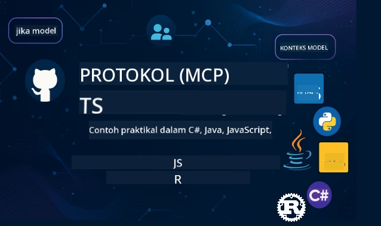

 

[](https://GitHub.com/microsoft/mcp-for-beginners/graphs/contributors)
[](https://GitHub.com/microsoft/mcp-for-beginners/issues)
[](https://GitHub.com/microsoft/mcp-for-beginners/pulls)
[](http://makeapullrequest.com)
[](https://mcptoplist.com/server/mcp.so%2Fmcp-for-beginners%2Fmicrosoft)

[](https://GitHub.com/microsoft/mcp-for-beginners/watchers)
[](https://GitHub.com/microsoft/mcp-for-beginners/fork)
[](https://GitHub.com/microsoft/mcp-for-beginners/stargazers)


[](https://discord.gg/nTYy5BXMWG)

Ikuti langkah-langkah ini untuk memulakan menggunakan sumber ini:
1. **Fork Repositori**: Klik [](https://GitHub.com/microsoft/mcp-for-beginners/fork)
2. **Clone Repositori**:   `git clone https://github.com/microsoft/mcp-for-beginners.git`
3. **Sertai** [](https://discord.gg/nTYy5BXMWG)


### 🌐 Sokongan Pelbagai Bahasa

#### Disokong melalui GitHub Action (Automatik & Sentiasa Dikemas Kini)

<!-- CO-OP TRANSLATOR LANGUAGES TABLE START -->
[Arabic](../ar/README.md) | [Bengali](../bn/README.md) | [Bulgarian](../bg/README.md) | [Burmese (Myanmar)](../my/README.md) | [Chinese (Simplified)](../zh-CN/README.md) | [Chinese (Traditional, Hong Kong)](../zh-HK/README.md) | [Chinese (Traditional, Macau)](../zh-MO/README.md) | [Chinese (Traditional, Taiwan)](../zh-TW/README.md) | [Croatian](../hr/README.md) | [Czech](../cs/README.md) | [Danish](../da/README.md) | [Dutch](../nl/README.md) | [Estonian](../et/README.md) | [Finnish](../fi/README.md) | [French](../fr/README.md) | [German](../de/README.md) | [Greek](../el/README.md) | [Hebrew](../he/README.md) | [Hindi](../hi/README.md) | [Hungarian](../hu/README.md) | [Indonesian](../id/README.md) | [Italian](../it/README.md) | [Japanese](../ja/README.md) | [Kannada](../kn/README.md) | [Khmer](../km/README.md) | [Korean](../ko/README.md) | [Lithuanian](../lt/README.md) | [Malay](./README.md) | [Malayalam](../ml/README.md) | [Marathi](../mr/README.md) | [Nepali](../ne/README.md) | [Nigerian Pidgin](../pcm/README.md) | [Norwegian](../no/README.md) | [Persian (Farsi)](../fa/README.md) | [Polish](../pl/README.md) | [Portuguese (Brazil)](../pt-BR/README.md) | [Portuguese (Portugal)](../pt-PT/README.md) | [Punjabi (Gurmukhi)](../pa/README.md) | [Romanian](../ro/README.md) | [Russian](../ru/README.md) | [Serbian (Cyrillic)](../sr/README.md) | [Slovak](../sk/README.md) | [Slovenian](../sl/README.md) | [Spanish](../es/README.md) | [Swahili](../sw/README.md) | [Swedish](../sv/README.md) | [Tagalog (Filipino)](../tl/README.md) | [Tamil](../ta/README.md) | [Telugu](../te/README.md) | [Thai](../th/README.md) | [Turkish](../tr/README.md) | [Ukrainian](../uk/README.md) | [Urdu](../ur/README.md) | [Vietnamese](../vi/README.md)

> **Lebih suka Clone Secara Tempatan?**
>
> Repositori ini termasuk lebih dari 50 terjemahan bahasa yang secara signifikan meningkatkan saiz muat turun. Untuk clone tanpa terjemahan, gunakan sparse checkout:
>
> **Bash / macOS / Linux:**
> ```bash
> git clone --filter=blob:none --sparse https://github.com/microsoft/mcp-for-beginners.git
> cd mcp-for-beginners
> git sparse-checkout set --no-cone '/*' '!translations' '!translated_images'
> ```
>
> **CMD (Windows):**
> ```cmd
> git clone --filter=blob:none --sparse https://github.com/microsoft/mcp-for-beginners.git
> cd mcp-for-beginners
> git sparse-checkout set --no-cone "/*" "!translations" "!translated_images"
> ```
>
> Ini memberi anda segala yang anda perlukan untuk menyelesaikan kursus dengan muat turun lebih cepat.
<!-- CO-OP TRANSLATOR LANGUAGES TABLE END -->

# 🚀 Kurikulum Model Context Protocol (MCP) untuk Pemula

## **Belajar MCP dengan Contoh Kod Praktikal dalam C#, Java, JavaScript, Rust, Python, dan TypeScript**

## 🧠 Gambaran Keseluruhan Kurikulum Model Context Protocol
Selamat datang ke perjalanan anda ke dalam Model Context Protocol! Jika anda pernah tertanya-tanya bagaimana aplikasi AI berkomunikasi dengan alat dan perkhidmatan yang berbeza, anda akan menemui penyelesaian elegan yang sedang mengubah cara pembangun membina sistem pintar.

Fikirkan MCP sebagai penterjemah universal untuk aplikasi AI - seperti bagaimana port USB membolehkan anda menyambung mana-mana peranti ke komputer anda, MCP membolehkan model AI menyambung ke mana-mana alat atau perkhidmatan secara standard. Sama ada anda membina chatbot pertama anda atau bekerja pada aliran kerja AI yang kompleks, memahami MCP akan memberi anda kuasa untuk mencipta aplikasi yang lebih cekap dan fleksibel.

Kurikulum ini direka dengan sabar dan penuh perhatian untuk perjalanan pembelajaran anda. Kami akan bermula dengan konsep mudah yang anda sudah fahami dan secara beransur-ansur membina kepakaran anda melalui latihan praktikal dalam bahasa pengaturcaraan kegemaran anda. Setiap langkah termasuk penjelasan yang jelas, contoh praktikal, dan dorongan yang banyak sepanjang perjalanan.

Selepas anda selesai perjalanan ini, anda akan mempunyai keyakinan untuk membina pelayan MCP anda sendiri, mengintegrasikannya dengan platform AI popular, dan memahami bagaimana teknologi ini membentuk masa depan pembangunan AI. Mari kita mulakan pengembaraan menarik ini bersama!

### Dokumentasi dan Spesifikasi Rasmi

Kurikulum ini selaras dengan **Spesifikasi MCP 2025-11-25** (rilis stabil terkini). Spesifikasi MCP menggunakan penomboran versi berasaskan tarikh (format YYYY-MM-DD) untuk memastikan penjejakan versi protokol yang jelas.

> **Melihat ke hadapan:** calon pelepasan untuk versi spesifikasi seterusnya, **2026-07-28**, dijadualkan dilancarkan pada 28 Julai 2026. Ia menjadikan protokol tanpa keadaan pada lapisan pengangkutan, meresmikan rangka kerja Extensions (Aplikasi MCP, Tugasan), menguatkan kebenaran, dan menghentikan penggunaan Roots, Sampling, dan Logging. Lihat [Apa yang Berubah dalam MCP: Calon Pelepasan 2026-07-28](./01-CoreConcepts/mcp-2026-07-28-release-candidate.md) untuk penjelasan penuh.

Sumber ini menjadi lebih bernilai apabila pemahaman anda berkembang, tetapi jangan rasa tertekan untuk membaca semuanya segera. Mulakan dengan bidang yang paling menarik minat anda!
- 📘 [Dokumentasi MCP](https://modelcontextprotocol.io/) – Ini adalah sumber utama anda untuk tutorial langkah demi langkah dan panduan pengguna. Dokumentasi ini ditulis dengan pemula dalam fikiran, memberikan contoh jelas yang boleh anda ikuti pada kadar sendiri.
- 📜 [Spesifikasi MCP](https://modelcontextprotocol.io/specification/2025-11-25) – Anggap ini sebagai manual rujukan lengkap anda. Semasa anda mengikuti kurikulum, anda akan kembali ke sini untuk melihat butiran khusus dan meneroka ciri lanjutan.
- 📜 [Penomboran Versi Spesifikasi MCP](https://modelcontextprotocol.io/specification/versioning) – Ini mengandungi maklumat mengenai sejarah versi protokol dan bagaimana MCP menggunakan penomboran versi berasaskan tarikh (format YYYY-MM-DD).
- 🧑‍💻 [Repositori MCP GitHub](https://github.com/modelcontextprotocol) – Di sini anda akan menjumpai SDK, alat, dan contoh kod dalam pelbagai bahasa pengaturcaraan. Ia seperti khazanah contoh praktikal dan komponen sedia guna.
- 🌐 [Komuniti MCP](https://github.com/orgs/modelcontextprotocol/discussions) – Sertai pelajar dan pembangun berpengalaman dalam perbincangan tentang MCP. Ia adalah komuniti yang menyokong di mana soalan dialu-alukan dan pengetahuan dikongsi dengan bebas.
  
## Objektif Pembelajaran

Menjelang akhir kurikulum ini, anda akan merasa yakin dan teruja dengan kebolehan baru anda. Ini yang akan anda capai:

• **Memahami asas MCP**: Anda akan memahami apa itu Model Context Protocol dan mengapa ia merevolusikan bagaimana aplikasi AI bekerjasama, menggunakan perumpamaan dan contoh yang masuk akal.

• **Membina pelayan MCP pertama anda**: Anda akan mencipta pelayan MCP yang berfungsi dalam bahasa pengaturcaraan pilihan anda, bermula dengan contoh mudah dan meningkatkan kemahiran secara langkah demi langkah.

• **Menyambungkan model AI kepada alat sebenar**: Anda akan belajar bagaimana merapatkan jurang antara model AI dan perkhidmatan sebenar, memberikan aplikasi anda keupayaan baru yang hebat.

• **Melaksanakan amalan keselamatan terbaik**: Anda akan memahami cara memastikan pelaksanaan MCP anda selamat dan terjamin, melindungi aplikasi dan pengguna anda.

• **Membuat pelaksanaan dengan yakin**: Anda akan tahu bagaimana membawa projek MCP dari pembangunan ke pengeluaran, dengan strategi pelaksanaan praktikal yang berfungsi dalam dunia sebenar.

• **Bergabung dengan komuniti MCP**: Anda akan menjadi sebahagian daripada komuniti pembangun yang berkembang yang membentuk masa depan pembangunan aplikasi AI. 

## Latar Belakang Penting

Sebelum kita selami perkara khusus MCP, mari pastikan anda selesa dengan beberapa konsep asas. Jangan risau jika anda bukan pakar dalam bidang ini - kami akan terangkan semua yang anda perlu tahu sepanjang perjalanan!

### Memahami Protokol (Asas)

Fikirkan protokol seperti peraturan untuk perbualan. Apabila anda menelefon seorang kawan, anda berdua tahu untuk mengucapkan "hello" apabila mengangkat, bergilir bercakap, dan mengucapkan "selamat tinggal" apabila selesai. Program komputer memerlukan peraturan serupa untuk berkomunikasi dengan berkesan.

MCP adalah protokol - satu set peraturan yang dipersetujui yang membantu model AI dan aplikasi membuat "perbualan" yang produktif dengan alat dan perkhidmatan. Sama seperti peraturan perbualan membuat komunikasi manusia lebih lancar, MCP menjadikan komunikasi aplikasi AI lebih boleh dipercayai dan berkuasa.

### Hubungan Klien-Pelayan (Bagaimana Program Bekerjasama)

Anda sudah menggunakan hubungan klien-pelayan setiap hari! Apabila anda menggunakan pelayar web (klien) untuk melawat laman web, anda menyambung ke pelayan web yang menghantar kandungan halaman kepada anda. Pelayar tahu cara meminta maklumat, dan pelayan tahu cara memberi maklum balas.

Dalam MCP, kita mempunyai hubungan serupa: model AI berperanan sebagai klien yang meminta maklumat atau tindakan, manakala pelayan MCP menyediakan keupayaan tersebut. Ia seperti mempunyai pembantu yang membantu (pelayan) yang boleh diminta oleh AI untuk melaksanakan tugasan tertentu.

### Mengapa Penyeragaman Penting (Membuat Perkara Berfungsi Bersama)

Bayangkan jika setiap pengeluar kereta menggunakan pam minyak dengan bentuk berbeza — anda perlu penyesuai berbeza untuk setiap kereta! Penyeragaman bermakna bersetuju dengan pendekatan yang sama supaya perkara berfungsi bersama dengan lancar.

MCP menyediakan penyeragaman ini untuk aplikasi AI. Daripada setiap model AI memerlukan kod khusus untuk berfungsi dengan setiap alat, MCP mencipta cara universal untuk mereka berkomunikasi. Ini bermakna pembangun boleh membina alat sekali sahaja dan ia akan berfungsi dengan banyak sistem AI yang berbeza.

## 🧭 Gambaran Laluan Pembelajaran Anda

Perjalanan MCP anda disusun dengan rapi untuk membina keyakinan dan kemahiran secara berperingkat. Setiap fasa memperkenalkan konsep baru sambil mengukuhkan apa yang sudah anda pelajari.

### 🌱 Fasa Asas: Memahami Asas (Modul 0-2)

Ini adalah permulaan pengembaraan anda! Kami akan memperkenalkan anda kepada konsep MCP menggunakan perumpamaan biasa dan contoh mudah. Anda akan memahami apa itu MCP, mengapa ia wujud, dan bagaimana ia sesuai dalam dunia pembangunan AI yang lebih besar.


• **Modul 0 - Pengenalan kepada MCP**: Kita akan mulakan dengan meneroka apa itu MCP dan mengapa ia sangat penting untuk aplikasi AI moden. Anda akan melihat contoh dunia nyata MCP beraksi dan memahami bagaimana ia menyelesaikan masalah biasa yang dihadapi pembangun.

• **Modul 1 - Konsep Teras Dijelaskan**: Di sini anda akan belajar blok binaan penting MCP. Kami akan menggunakan banyak analogi dan contoh visual untuk memastikan konsep ini terasa semula jadi dan mudah difahami.

• **Modul 2 - Keselamatan dalam MCP**: Keselamatan mungkin nampak menakutkan, tetapi kami akan tunjukkan bagaimana MCP merangkumi ciri keselamatan terbina dalam dan mengajar anda amalan terbaik yang melindungi aplikasi anda dari awal.

### 🔨 Fasa Pembinaan: Mencipta Pelaksanaan Pertama Anda (Modul 3)

Kini keseronokan sebenar bermula! Anda akan mendapat pengalaman praktikal membina pelayan dan pelanggan MCP sebenar. Jangan risau - kami akan mulakan dengan mudah dan membimbing anda melalui setiap langkah.

Modul ini merangkumi pelbagai panduan praktikal yang membolehkan anda berlatih dalam bahasa pengaturcaraan pilihan anda. Anda akan mencipta pelayan pertama anda, membina pelanggan untuk menyambung kepadanya, dan juga mengintegrasikannya dengan alat pembangunan popular seperti VS Code.

Setiap panduan merangkumi contoh kod lengkap, petua menyelesaikan masalah, dan penjelasan mengapa kami membuat pilihan reka bentuk tertentu. Pada akhir fasa ini, anda akan mempunyai pelaksanaan MCP yang berfungsi yang anda boleh banggakan!

### 🚀 Fasa Berkembang: Konsep Lanjutan dan Aplikasi Dunia Nyata (Modul 4-5)

Dengan asas dikuasai, anda sudah bersedia untuk meneroka ciri MCP yang lebih canggih. Kami akan membincangkan strategi pelaksanaan praktikal, teknik debugging, dan topik lanjutan seperti integrasi AI multimodal.

Anda juga akan belajar bagaimana untuk menskala pelaksanaan MCP anda untuk penggunaan produksi dan mengintegrasi dengan platform awan seperti Azure. Modul-modul ini menyediakan anda untuk membina penyelesaian MCP yang dapat menangani tuntutan dunia nyata.

### 🌟 Fasa Penguasaan: Komuniti dan Pengkhususan (Modul 6-11)

Fasa terakhir memberi tumpuan kepada menyertai komuniti MCP dan mengkhusus dalam bidang yang paling anda minati. Anda akan belajar bagaimana menyumbang ke projek sumber terbuka MCP, melaksanakan corak pengesahan lanjutan, dan membina penyelesaian terintegrasi pangkalan data yang komprehensif.

Modul 11 layak disebut secara khusus - ia adalah laluan pembelajaran praktikal 13 makmal lengkap yang mengajar anda membina pelayan MCP yang sedia untuk produksi dengan integrasi PostgreSQL. Ia seperti projek puncak yang menggabungkan segala yang telah anda pelajari!

### 📚 Struktur Kurikulum Lengkap

| Modul | Topik | Penerangan | Pautan |
|--------|-------|-------------|------|
| **Modul 0-3: Asas** | | | |
| 00 | Pengenalan kepada MCP | Gambaran keseluruhan Protokol Konteks Model dan kepentingannya dalam saluran AI | [Baca lebih lanjut](./00-Introduction/README.md) |
| 01 | Konsep Teras Dijelaskan | Eksplorasi mendalam konsep teras MCP | [Baca lebih lanjut](./01-CoreConcepts/README.md) |
| 1.1 | Apa Yang Berubah di MCP (2026-07-28 RC) | Protokol tanpa status, rangka kerja Sambungan, dan penghapusan ciri yang akan datang dalam versi spesifikasi seterusnya | [Panduan](./01-CoreConcepts/mcp-2026-07-28-release-candidate.md) |
| 02 | Keselamatan dalam MCP | Ancaman keselamatan dan amalan terbaik | [Baca lebih lanjut](./02-Security/README.md) |
| 03 | Bermula dengan MCP | Persediaan persekitaran, pelayan/pelanggan asas, integrasi | [Baca lebih lanjut](./03-GettingStarted/README.md) |
| **Modul 3: Membina Pelayan & Pelanggan Pertama Anda** | | | |
| 3.1 | Pelayan Pertama | Cipta pelayan MCP pertama anda | [Panduan](./03-GettingStarted/01-first-server/README.md) |
| 3.2 | Pelanggan Pertama | Bangunkan pelanggan MCP asas | [Panduan](./03-GettingStarted/02-client/README.md) |
| 3.3 | Pelanggan dengan LLM | Integrasi model bahasa besar | [Panduan](./03-GettingStarted/03-llm-client/README.md) |
| 3.4 | Integrasi VS Code | Gunakan pelayan MCP dalam VS Code | [Panduan](./03-GettingStarted/04-vscode/README.md) |
| 3.5 | Pelayan stdio | Cipta pelayan menggunakan pengangkutan stdio | [Panduan](./03-GettingStarted/05-stdio-server/README.md) |
| 3.6 | Penstriman HTTP | Laksanakan penstriman HTTP dalam MCP | [Panduan](./03-GettingStarted/06-http-streaming/README.md) |
| 3.7 | Alat Microsoft Foundry | Gunakan Microsoft Foundry Toolkit dengan MCP | [Panduan](./03-GettingStarted/07-aitk/README.md) |
| 3.8 | Ujian | Uji pelaksanaan pelayan MCP anda | [Panduan](./03-GettingStarted/08-testing/README.md) |
| 3.9 | Penyebaran | Sebarkan pelayan MCP ke produksi | [Panduan](./03-GettingStarted/09-deployment/README.md) |
| 3.10 | Penggunaan pelayan lanjutan | Gunakan pelayan lanjutan untuk ciri lanjutan dan seni bina yang dipertingkatkan | [Panduan](./03-GettingStarted/10-advanced/README.md) |
| 3.11 | Pengesahan ringkas | Bab yang menunjukkan pengesahan dari awal dan RBAC | [Panduan](./03-GettingStarted/11-simple-auth/README.md) |
| 3.12 | Hos MCP | Konfigurasikan Claude Desktop, Cursor, Cline, dan hos MCP lain | [Panduan](./03-GettingStarted/12-mcp-hosts/README.md) |
| 3.13 | Pemeriksa MCP | Debug dan uji pelayan MCP dengan alat Pemeriksa | [Panduan](./03-GettingStarted/13-mcp-inspector/README.md) |
| 3.14 | Pengambilan Sampel | Gunakan pengambilan sampel untuk kerjasama dengan pelanggan | [Panduan](./03-GettingStarted/14-sampling/README.md) |
| 3.15 | Aplikasi MCP | Bangunkan Aplikasi MCP | [Panduan](./03-GettingStarted/15-mcp-apps/README.md) |
| **Modul 4-5: Praktikal & Lanjutan** | | | |
| 04 | Pelaksanaan Praktikal | SDK, debugging, ujian, templat prompt boleh guna semula | [Baca lebih lanjut](./04-PracticalImplementation/README.md) |
| 4.1 | Penjulukan | Mengendalikan set keputusan besar dengan penjulukan berasaskan kursor | [Panduan](./04-PracticalImplementation/pagination/README.md) |
| 05 | Topik Lanjutan dalam MCP | AI multimodal, penskalaan, penggunaan korporat | [Baca lebih lanjut](./05-AdvancedTopics/README.md) |
| 5.1 | Integrasi Azure | Integrasi MCP dengan Azure | [Panduan](./05-AdvancedTopics/mcp-integration/README.md) |
| 5.2 | Multi-modaliti | Bekerja dengan pelbagai modaliti | [Panduan](./05-AdvancedTopics/mcp-multi-modality/README.md) |
| 5.3 | Demo OAuth2 | Melaksanakan pengesahan OAuth2 | [Panduan](./05-AdvancedTopics/mcp-oauth2-demo/README.md) |
| 5.4 | Konteks Akar | Fahami dan laksanakan konteks akar | [Panduan](./05-AdvancedTopics/mcp-root-contexts/README.md) |
| 5.5 | Penentuan Laluan | Strategi penentuan laluan MCP | [Panduan](./05-AdvancedTopics/mcp-routing/README.md) |
| 5.6 | Pengambilan Sampel | Teknik pengambilan sampel dalam MCP | [Panduan](./05-AdvancedTopics/mcp-sampling/README.md) |
| 5.7 | Penskalaan | Skala pelaksanaan MCP | [Panduan](./05-AdvancedTopics/mcp-scaling/README.md) |
| 5.8 | Keselamatan | Pertimbangan keselamatan lanjutan | [Panduan](./05-AdvancedTopics/mcp-security/README.md) |
| 5.9 | Carian Web | Laksanakan keupayaan carian web | [Panduan](./05-AdvancedTopics/web-search-mcp/README.md) |
| 5.10 | Penstriman Masa Nyata | Bina fungsi penstriman masa nyata | [Panduan](./05-AdvancedTopics/mcp-realtimestreaming/README.md) |
| 5.11 | Carian Masa Nyata | Laksanakan carian masa nyata | [Panduan](./05-AdvancedTopics/mcp-realtimesearch/README.md) |
| 5.12 | Pengesahan Entra ID | Pengesahan dengan Microsoft Entra ID | [Panduan](./05-AdvancedTopics/mcp-security-entra/README.md) |
| 5.13 | Integrasi Foundry | Integrasi dengan Microsoft Foundry | [Panduan](./05-AdvancedTopics/mcp-foundry-agent-integration/README.md) |
| 5.14 | Kejuruteraan Konteks | Teknik untuk kejuruteraan konteks yang berkesan | [Panduan](./05-AdvancedTopics/mcp-contextengineering/README.md) |
| 5.15 | Pengangkutan Khusus MCP | Pelaksanaan pengangkutan khusus | [Panduan](./05-AdvancedTopics/mcp-transport/README.md) |
| 5.16 | Ciri Protokol | Pemberitahuan kemajuan, pembatalan, templat sumber | [Panduan](./05-AdvancedTopics/mcp-protocol-features/README.md) |
| 5.17 | Pemikiran Pelbagai Ejen Adversari | Dua ejen berhujah dari sisi bertentangan menggunakan alat MCP bersama, dinilai oleh ejen hakim | [Panduan](./05-AdvancedTopics/mcp-adversarial-agents/README.md) |
| **Modul 6-10: Komuniti & Amalan Terbaik** | | | |
| 06 | Sumbangan Komuniti | Bagaimana menyumbang kepada ekosistem MCP | [Panduan](./06-CommunityContributions/README.md) |
| 07 | Pengajaran dari Penggunaan Awal | Cerita pelaksanaan dunia nyata | [Panduan](./07-LessonsfromEarlyAdoption/README.md) |
| 08 | Amalan Terbaik untuk MCP | Prestasi, toleransi ralat, ketahanan | [Panduan](./08-BestPractices/README.md) |
| 09 | Kajian Kes MCP | Contoh pelaksanaan praktikal | [Panduan](./09-CaseStudy/README.md) |
| 10 | Bengkel Praktikal | Membina Pelayan MCP dengan Microsoft Foundry Toolkit | [Makmal](./10-StreamliningAIWorkflowsBuildingAnMCPServerWithAIToolkit/README.md) |
| **Modul 11: Makmal Praktikal Pelayan MCP** | | | |
| 11 | Integrasi Pangkalan Data Pelayan MCP | Laluan pembelajaran praktikal 13 makmal lengkap untuk integrasi PostgreSQL | [Makmal](./11-MCPServerHandsOnLabs/README.md) |
| 11.1 | Pengenalan | Gambaran keseluruhan MCP dengan integrasi pangkalan data dan kes penggunaan analitik runcit | [Makmal 00](./11-MCPServerHandsOnLabs/00-Introduction/README.md) |
| 11.2 | Seni Bina Teras | Memahami seni bina pelayan MCP, lapisan pangkalan data, dan corak keselamatan | [Makmal 01](./11-MCPServerHandsOnLabs/01-Architecture/README.md) |
| 11.3 | Keselamatan & Multi-Penyewa | Keselamatan Tahap Baris, pengesahan, dan akses data pelbagai penyewa | [Makmal 02](./11-MCPServerHandsOnLabs/02-Security/README.md) |
| 11.4 | Persediaan Persekitaran | Menyediakan persekitaran pembangunan, Docker, sumber Azure | [Makmal 03](./11-MCPServerHandsOnLabs/03-Setup/README.md) |
| 11.5 | Reka Bentuk Pangkalan Data | Persediaan PostgreSQL, reka bentuk skema runcit, dan data contoh | [Makmal 04](./11-MCPServerHandsOnLabs/04-Database/README.md) |
| 11.6 | Pelaksanaan Pelayan MCP | Membina pelayan FastMCP dengan integrasi pangkalan data | [Makmal 05](./11-MCPServerHandsOnLabs/05-MCP-Server/README.md) |
| 11.7 | Pembangunan Alat | Mencipta alat pertanyaan pangkalan data dan introspeksi skema | [Makmal 06](./11-MCPServerHandsOnLabs/06-Tools/README.md) |
| 11.8 | Carian Semantik | Melaksanakan penanaman vektor dengan Azure OpenAI dan pgvector | [Makmal 07](./11-MCPServerHandsOnLabs/07-Semantic-Search/README.md) |
| 11.9 | Ujian & Debugging | Strategi ujian, alat debugging, dan pendekatan pengesahan | [Makmal 08](./11-MCPServerHandsOnLabs/08-Testing/README.md) |
| 11.10 | Integrasi VS Code | Menyediakan integrasi MCP VS Code dan penggunaan AI Chat | [Makmal 09](./11-MCPServerHandsOnLabs/09-VS-Code/README.md) |
| 11.11 | Strategi Penyebaran | Penyebaran Docker, Azure Container Apps, dan pertimbangan penskalaan | [Makmal 10](./11-MCPServerHandsOnLabs/10-Deployment/README.md) |
| 11.12 | Pemantauan | Application Insights, pencatatan, pemantauan prestasi | [Makmal 11](./11-MCPServerHandsOnLabs/11-Monitoring/README.md) |
| 11.13 | Amalan Terbaik | Pengoptimuman prestasi, pengukuhan keselamatan, dan petua produksi | [Makmal 12](./11-MCPServerHandsOnLabs/12-Best-Practices/README.md) |
| **Modul 12: Alat MCP** | | | |
| 12.1 | Alat | Penggunaan MCP dalam Aplikasi Copilot | [ Panduan ](./12-tooling/README.md) |

### 💻 Projek Kod Contoh

Salah satu bahagian paling menarik dalam mempelajari MCP adalah melihat kemahiran kod anda berkembang secara progresif. Kami telah reka contoh kod kami untuk bermula dengan mudah dan menjadi lebih canggih apabila pemahaman anda mendalam. Ini cara kami memperkenalkan konsep - dengan kod yang mudah difahami tetapi menunjukkan prinsip MCP sebenar, anda akan faham bukan sahaja apa yang kod ini lakukan, tetapi mengapa ia distrukturkan dengan cara ini dan bagaimana ia sesuai dalam aplikasi MCP yang lebih besar.

#### Contoh Kalkulator MCP Asas

| Bahasa | Penerangan | Pautan |
|----------|-------------|------|

| C# | Contoh Pelayan MCP | [Lihat Kod](./03-GettingStarted/samples/csharp/README.md) |
| Java | Kalkulator MCP | [Lihat Kod](./03-GettingStarted/samples/java/calculator/README.md) |
| JavaScript | Demo MCP | [Lihat Kod](./03-GettingStarted/samples/javascript/README.md) |
| Python | Pelayan MCP | [Lihat Kod](../../03-GettingStarted/samples/python/mcp_calculator_server.py) |
| TypeScript | Contoh MCP | [Lihat Kod](./03-GettingStarted/samples/typescript/README.md) |
| Rust | Contoh MCP | [Lihat Kod](./03-GettingStarted/samples/rust/README.md) |

#### Pelaksanaan MCP Lanjutan

| Bahasa | Penerangan | Pautan |
|----------|-------------|------|
| C# | Contoh Lanjutan | [Lihat Kod](./04-PracticalImplementation/samples/csharp/README.md) |
| Java dengan Spring | Contoh Aplikasi Kontena | [Lihat Kod](./04-PracticalImplementation/samples/java/containerapp/README.md) |
| JavaScript | Contoh Lanjutan | [Lihat Kod](./04-PracticalImplementation/samples/javascript/README.md) |
| Python | Pelaksanaan Kompleks | [Lihat Kod](./04-PracticalImplementation/samples/python/README.md) |
| TypeScript | Contoh Kontena | [Lihat Kod](./04-PracticalImplementation/samples/typescript/README.md) |


## 🎯 Prasyarat untuk Mempelajari MCP

Untuk mendapatkan manfaat maksimum daripada kurikulum ini, anda perlu mempunyai:

- Pengetahuan asas pengaturcaraan dalam sekurang-kurangnya salah satu daripada bahasa berikut: C#, Java, JavaScript, Python, atau TypeScript
- Pemahaman tentang model klien-pelayan dan API
- Kefahaman tentang konsep REST dan HTTP
- (Pilihan) Latar belakang dalam konsep AI/ML

- Menyertai perbincangan komuniti kami untuk sokongan

## 📚 Panduan Belajar & Sumber

Repositori ini merangkumi beberapa sumber untuk membantu anda menavigasi dan belajar dengan berkesan:

### Panduan Belajar

Panduan [Panduan Belajar](./study_guide.md) yang menyeluruh disediakan untuk membantu anda menavigasi repositori ini dengan berkesan. Peta kurikulum visual ini menunjukkan bagaimana semua topik berkaitan dan memberikan panduan cara menggunakan projek contoh dengan berkesan. Ia amat membantu jika anda seorang pembelajar visual yang suka melihat gambaran keseluruhan.

Panduan ini merangkumi:
- Peta kurikulum visual yang menunjukkan semua topik yang diliputi
- Butiran pecahan setiap bahagian repositori
- Panduan cara menggunakan projek contoh
- Laluan pembelajaran yang disyorkan untuk tahap kemahiran yang berbeza
- Sumber tambahan untuk melengkapkan perjalanan pembelajaran anda

### Log Perubahan

Kami menyelenggara [Log Perubahan](./changelog.md) yang terperinci yang menjejaki semua kemas kini penting kepada bahan kurikulum, supaya anda boleh sentiasa mengikuti peningkatan dan penambahan terkini.
- Penambahan kandungan baru
- Perubahan struktur
- Penambahbaikan ciri
- Kemas kini dokumentasi

## 🛠️ Cara Menggunakan Kurikulum Ini Dengan Berkesan

Setiap pelajaran dalam panduan ini termasuk:

1. Penjelasan jelas tentang konsep MCP  
2. Contoh kod langsung dalam pelbagai bahasa  
3. Latihan untuk membina aplikasi MCP sebenar  
4. Sumber tambahan untuk pelajar lanjutan

### Mari Belajar MCP dengan C# - Siri Tutorial
Mari kita pelajari tentang Model Context Protocol (MCP), kerangka kerja canggih yang direka untuk menstandardkan interaksi antara model AI dan aplikasi klien. Melalui sesi mesra pemula ini, kami akan memperkenalkan anda kepada MCP dan membimbing anda untuk mencipta pelayan MCP pertama anda.
#### C#: [https://aka.ms/letslearnmcp-csharp](https://aka.ms/letslearnmcp-csharp)
#### Java: [https://aka.ms/letslearnmcp-java](https://aka.ms/letslearnmcp-java)
#### JavaScript: [https://aka.ms/letslearnmcp-javascript](https://aka.ms/letslearnmcp-javascript)
#### Python: [https://aka.ms/letslearnmcp-python](https://aka.ms/letslearnmcp-python)

## 🎓 Perjalanan MCP Anda Bermula

Tahniah! Anda baru sahaja mengambil langkah pertama dalam perjalanan yang menarik yang akan meluaskan keupayaan pengaturcaraan anda dan menghubungkan anda dengan teknologi AI terkini.

### Apa Yang Anda Telah Capai

Dengan membaca pengenalan ini, anda telah mula membina asas pengetahuan MCP anda. Anda memahami apa itu MCP, mengapa ia penting, dan bagaimana kurikulum ini akan menyokong perjalanan pembelajaran anda. Itu adalah pencapaian besar dan permulaan kepakaran anda dalam teknologi penting ini.

### Pengembaraan di Hadapan

Semasa anda maju melalui modul-modul, ingatlah bahawa setiap pakar pernah menjadi pemula. Konsep yang mungkin kelihatan kompleks sekarang akan menjadi kebiasaan apabila anda berlatih dan mengaplikasikannya. Setiap langkah kecil membina keupayaan hebat yang akan membantu anda sepanjang kerjaya pembangunan anda.

### Rangkaian Sokongan Anda

Anda menyertai komuniti pelajar dan pakar yang bersemangat tentang MCP dan berbesar hati membantu orang lain berjaya. Sama ada anda tersekat pada cabaran pengkodan atau teruja untuk berkongsi pencapaian baru, komuniti sedia menyokong perjalanan anda.

Jika anda tersekat atau ada sebarang soalan tentang membina aplikasi AI. Sertai pelajar lain dan pembangun berpengalaman dalam perbincangan tentang MCP. Ia adalah komuniti yang menyokong di mana soalan dialu-alukan dan ilmu dikongsi dengan bebas.

[](https://discord.gg/nTYy5BXMWG)

Jika anda mempunyai maklum balas produk atau ralat semasa pembinaan lawati:

[](https://aka.ms/foundry/forum)

### Sedia untuk Bermula?

Pengembaraan MCP anda bermula sekarang! Mulakan dengan Modul 0 untuk menyelami pengalaman MCP pertama anda secara langsung, atau terokai projek contoh untuk melihat apa yang akan anda bina. Ingat - setiap pakar bermula tepat di tempat anda sekarang, dan dengan kesabaran dan latihan, anda akan terkejut dengan apa yang anda boleh capai.

Selamat datang ke dunia pembangunan Model Context Protocol. Mari bina sesuatu yang hebat bersama-sama!

## 🤝 Menyumbang kepada Komuniti Pembelajaran

Kurikulum ini menjadi lebih kukuh dengan sumbangan dari pelajar seperti anda! Sama ada anda membetulkan kesalahan taip, mencadangkan penjelasan yang lebih jelas, atau menambah contoh baru, sumbangan anda membantu pemula lain berjaya.

Terima kasih kepada Profesional Berharga Microsoft [Shivam Goyal](https://www.linkedin.com/in/shivam2003/) yang menyumbang contoh kod.

Proses sumbangan direka untuk mesra dan menyokong. Kebanyakan sumbangan memerlukan Perjanjian Lesen Penyumbang (CLA), tetapi alat automatik akan membimbing anda melalui proses dengan lancar.

## 📜 Pembelajaran Sumber Terbuka

Seluruh kurikulum ini tersedia di bawah MIT [LESEN](../../LICENSE), bermakna anda boleh menggunakan, mengubah suai, dan berkongsi secara bebas. Ini menyokong misi kami untuk menjadikan pengetahuan MCP boleh diakses oleh pembangun di mana-mana.
## 🤝 Garis Panduan Sumbangan

Projek ini mengalu-alukan sumbangan dan cadangan. Kebanyakan sumbangan memerlukan anda bersetuju dengan
Perjanjian Lesen Penyumbang (CLA) yang menyatakan bahawa anda mempunyai hak untuk, dan sebenarnya memberi kami,
hak untuk menggunakan sumbangan anda. Untuk butiran, lawati <https://cla.opensource.microsoft.com>.

Apabila anda menghantar permintaan tarik, bot CLA secara automatik akan menentukan sama ada anda perlu menyediakan
CLA dan menghiasi PR dengan sewajarnya (contoh, pemeriksaan status, komen). Ikuti sahaja arahan
yang diberikan oleh bot. Anda hanya perlu melakukan ini sekali untuk semua repos yang menggunakan CLA kami.

Projek ini telah mengamalkan [Kod Etika Sumber Terbuka Microsoft](https://opensource.microsoft.com/codeofconduct/).
Untuk maklumat lanjut lihat [Soalan Lazim Kod Etika](https://opensource.microsoft.com/codeofconduct/faq/) atau
hubungi [opencode@microsoft.com](mailto:opencode@microsoft.com) untuk sebarang soalan atau komen tambahan.

---

*Bersedia untuk memulakan perjalanan MCP anda? Mula dengan [Modul 00 - Pengenalan kepada MCP](./00-Introduction/README.md) dan ambil langkah pertama anda ke dunia pembangunan Model Context Protocol!*


## 🎒 Kursus Lain
Pasukan kami menghasilkan kursus lain! Semak:

<!-- CO-OP TRANSLATOR OTHER COURSES START -->
### LangChain
[](https://aka.ms/langchain4j-for-beginners)
[](https://aka.ms/langchainjs-for-beginners?WT.mc_id=m365-94501-dwahlin)
[](https://github.com/microsoft/langchain-for-beginners?WT.mc_id=m365-94501-dwahlin)
---

### Azure / Edge / MCP / Agen
[](https://github.com/microsoft/AZD-for-beginners?WT.mc_id=academic-105485-koreyst)
[](https://github.com/microsoft/edgeai-for-beginners?WT.mc_id=academic-105485-koreyst)
[](https://github.com/microsoft/mcp-for-beginners?WT.mc_id=academic-105485-koreyst)
[](https://github.com/microsoft/ai-agents-for-beginners?WT.mc_id=academic-105485-koreyst)

---
 
### Siri AI Generatif
[](https://github.com/microsoft/generative-ai-for-beginners?WT.mc_id=academic-105485-koreyst)
[-9333EA?style=for-the-badge&labelColor=E5E7EB&color=9333EA)](https://github.com/microsoft/Generative-AI-for-beginners-dotnet?WT.mc_id=academic-105485-koreyst)
[-C084FC?style=for-the-badge&labelColor=E5E7EB&color=C084FC)](https://github.com/microsoft/generative-ai-for-beginners-java?WT.mc_id=academic-105485-koreyst)
[-E879F9?style=for-the-badge&labelColor=E5E7EB&color=E879F9)](https://github.com/microsoft/generative-ai-with-javascript?WT.mc_id=academic-105485-koreyst)

---
 
### Pembelajaran Teras
[](https://aka.ms/ml-beginners?WT.mc_id=academic-105485-koreyst)
[](https://aka.ms/datascience-beginners?WT.mc_id=academic-105485-koreyst)
[](https://aka.ms/ai-beginners?WT.mc_id=academic-105485-koreyst)

[](https://github.com/microsoft/Security-101?WT.mc_id=academic-96948-sayoung)
[](https://aka.ms/webdev-beginners?WT.mc_id=academic-105485-koreyst)
[](https://aka.ms/iot-beginners?WT.mc_id=academic-105485-koreyst)
[](https://github.com/microsoft/xr-development-for-beginners?WT.mc_id=academic-105485-koreyst)

---
 
### Siri Copilot
[](https://aka.ms/GitHubCopilotAI?WT.mc_id=academic-105485-koreyst)
[](https://github.com/microsoft/mastering-github-copilot-for-dotnet-csharp-developers?WT.mc_id=academic-105485-koreyst)
[](https://github.com/microsoft/CopilotAdventures?WT.mc_id=academic-105485-koreyst)
<!-- CO-OP TRANSLATOR OTHER COURSES END -->

---

<!-- CO-OP TRANSLATOR DISCLAIMER START -->
**Penafian**:
Dokumen ini telah diterjemahkan menggunakan perkhidmatan terjemahan AI [Co-op Translator](https://github.com/Azure/co-op-translator). Walaupun kami berusaha untuk ketepatan, sila ambil maklum bahawa terjemahan automatik mungkin mengandungi kesilapan atau ketidaktepatan. Dokumen asal dalam bahasa asalnya harus dianggap sebagai sumber yang sahih. Untuk maklumat penting, terjemahan oleh manusia profesional adalah disyorkan. Kami tidak bertanggungjawab terhadap sebarang salah faham atau salah tafsir yang timbul daripada penggunaan terjemahan ini.
<!-- CO-OP TRANSLATOR DISCLAIMER END -->