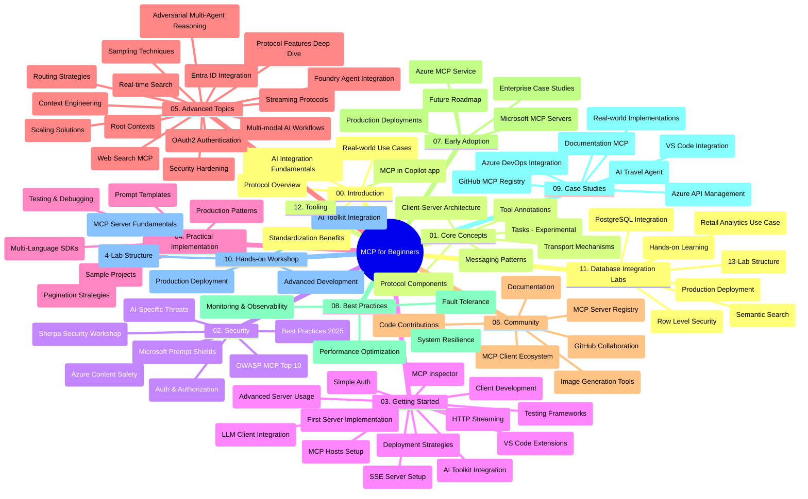

# Protokol Konteks Model (MCP) untuk Pemula - Panduan Kajian

Panduan kajian ini memberi gambaran keseluruhan struktur dan kandungan repositori untuk kurikulum "Protokol Konteks Model (MCP) untuk Pemula". Gunakan panduan ini untuk menavigasi repositori dengan cekap dan memanfaatkan sumber yang tersedia dengan sebaiknya.

## Gambaran Keseluruhan Repositori

Protokol Konteks Model (MCP) adalah rangka kerja standard untuk interaksi antara model AI dan aplikasi klien. Pada asalnya dibuat oleh Anthropic, MCP kini diselenggara oleh komuniti MCP yang lebih luas melalui organisasi GitHub rasmi. Repositori ini menyediakan kurikulum komprehensif dengan contoh kod langsung dalam C#, Java, JavaScript, Python, dan TypeScript, direka untuk pembangun AI, arkitek sistem, dan jurutera perisian.

## Peta Kurikulum Visual

## Struktur Repositori

Repositori ini diatur ke dalam dua belas bahagian utama, yang masing-masing menumpukan pada aspek berbeza MCP:

1. **Pengenalan (00-Introduction/)**
   - Gambaran keseluruhan Protokol Konteks Model
   - Mengapa standardisasi penting dalam saluran AI
   - Kes penggunaan praktikal dan manfaat

2. **Konsep Teras (01-CoreConcepts/)**
   - Seni bina klien-pelayan
   - Komponen utama protokol
   - Corak pemesejan dalam MCP
   - Spesifikasi semasa: [Apa yang Berubah dalam MCP: Spesifikasi 2026-07-28](./01-CoreConcepts/mcp-2026-07-28.md) — teras protokol tanpa keadaan, rangka kerja Sambungan, dan penghapusan Roots/Sampling/Logging

3. **Keselamatan (02-Security/)**
   - Ancaman keselamatan dalam sistem berasaskan MCP
   - Amalan terbaik untuk menjamin pelaksanaan
   - Strategi pengesahan dan kebenaran
   - Contoh langsung [kebenaran CIMD dan DCR](./02-Security/samples/cimd-dcr-auth/README.md)
   - **Dokumentasi Keselamatan Komprehensif**:
     - Amalan Terbaik Keselamatan MCP
     - Panduan Pelaksanaan Keselamatan Kandungan Azure
     - Kawalan dan Teknik Keselamatan MCP
     - Rujukan Pantas Amalan Terbaik MCP
   - **Topik Keselamatan Utama**:
     - Serangan suntikan prompt dan pencemaran alat
     - Pembajakan sesi dan masalah delegasi keliru
     - Kelemahan laluan token
     - Kebenaran berlebihan dan kawalan akses
     - Keselamatan rantaian bekalan bagi komponen AI
     - Integrasi Microsoft Prompt Shields

4. **Memulakan (03-GettingStarted/)**
   - Persediaan dan konfigurasi persekitaran
   - Membuat pelayan dan klien MCP asas
   - Integrasi dengan aplikasi sedia ada
   - Merangkumi seksyen untuk:
     - Pelaksanaan pelayan pertama
     - Pembangunan klien
     - Integrasi klien LLM
     - Integrasi VS Code
     - Pelayan Server-Sent Events (SSE)
     - Penggunaan pelayan lanjutan
     - Penstriman HTTP
     - Integrasi AI Toolkit
     - Strategi pengujian
     - Garis panduan penyebaran

5. **Pelaksanaan Praktikal (04-PracticalImplementation/)**
   - Menggunakan SDK merentas bahasa pengaturcaraan yang berbeza
   - Teknik penyahpepijatan, pengujian, dan pengesahan
   - Membuat templat prompt dan aliran kerja boleh guna semula
   - Projek contoh dengan contoh pelaksanaan

6. **Topik Lanjutan (05-AdvancedTopics/)**
   - Teknik kejuruteraan konteks
   - Integrasi agen Foundry
   - Aliran kerja AI multimodal 
   - Demo pengesahan OAuth2
   - Keupayaan carian masa nyata
   - Penstriman masa nyata
   - Pelaksanaan konteks akar
   - Strategi penghalaan
   - Teknik pensampelan
   - Pendekatan skala
   - Pertimbangan keselamatan
   - Integrasi keselamatan Entra ID
   - Integrasi carian web
   - Penalaran multi-agen adversari (corak perdebatan)

7. **Sumbangan Komuniti (06-CommunityContributions/)**
   - Cara menyumbang kod dan dokumentasi
   - Bekerjasama melalui GitHub
   - Penambahbaikan dan maklum balas yang dipacu komuniti
   - Menggunakan pelbagai klien MCP (Claude Desktop, Cline, VSCode)
   - Bekerja dengan pelayan MCP popular termasuk penjanaan imej

8. **Pengajaran dari Penggunaan Awal (07-LessonsfromEarlyAdoption/)**
   - Pelaksanaan dunia nyata dan kisah kejayaan
   - Membina dan menyebarkan penyelesaian berasaskan MCP
   - Tren dan peta jalan masa hadapan
   - **Panduan Pelayan MCP Microsoft**: Panduan komprehensif untuk 10 pelayan MCP Microsoft yang sedia produksi termasuk:
     - Pelayan MCP Dokumentasi Microsoft Learn
     - Pelayan MCP Azure (15+ penyambung khusus)
     - Pelayan MCP GitHub
     - Pelayan MCP Azure DevOps
     - Pelayan MCP MarkItDown
     - Pelayan MCP SQL Server
     - Pelayan MCP Playwright
     - Pelayan MCP Dev Box
     - Pelayan MCP Microsoft Foundry
     - Pelayan MCP Microsoft 365 Agents Toolkit

9. **Amalan Terbaik (08-BestPractices/)**
   - Penalaan prestasi dan pengoptimuman
   - Mereka bentuk sistem MCP toleran-ralat
   - Strategi pengujian dan ketahanan

10. **Kajian Kes (09-CaseStudy/)**
    - **Tujuh kajian kes komprehensif** yang menunjukkan kepelbagaian MCP merentas pelbagai senario:
    - **Ejen Perjalanan AI Azure**: Orkestrasi pelbagai agen dengan Azure OpenAI dan AI Search
    - **Integrasi Azure DevOps**: Automasi proses aliran kerja dengan kemas kini data YouTube
    - **Dapatan Dokumentasi Masa Nyata**: Klien konsol Python dengan penstriman HTTP
    - **Penjana Pelan Kajian Interaktif**: Aplikasi web Chainlit dengan AI perbualan
    - **Dokumentasi Dalam Editor**: Integrasi VS Code dengan aliran kerja GitHub Copilot
    - **Pengurusan API Azure**: Integrasi API perusahaan dengan penciptaan pelayan MCP
    - **Daftar MCP GitHub**: Pembangunan ekosistem dan platform integrasi agenik
    - Contoh pelaksanaan merangkumi integrasi perusahaan, produktiviti pembangun, dan pembangunan ekosistem

11. **Bengkel Praktikal (10-StreamliningAIWorkflowsBuildingAnMCPServerWithAIToolkit/)**
    - Bengkel praktikal menyeluruh menggabungkan MCP dengan AI Toolkit
    - Membina aplikasi pintar yang menghubungkan model AI dengan alat dunia nyata
    - Modul praktikal merangkumi asas, pembangunan pelayan khusus, dan strategi penyebaran produksi
    - **Struktur Makmal**:
      - Makmal 1: Asas Pelayan MCP
      - Makmal 2: Pembangunan Pelayan MCP Lanjutan
      - Makmal 3: Integrasi AI Toolkit
      - Makmal 4: Penyebaran dan Skala Produksi
    - Pendekatan pembelajaran berasaskan makmal dengan arahan langkah demi langkah

12. **Makmal Integrasi Pangkalan Data Pelayan MCP (11-MCPServerHandsOnLabs/)**
    - **Jalur pembelajaran 13 makmal komprehensif** untuk membina pelayan MCP sedia produksi dengan integrasi PostgreSQL
    - **Pelaksanaan analitik runcit dunia nyata** menggunakan kes penggunaan Zava Retail
    - **Corak gred perusahaan** termasuk Keselamatan Tahap Baris (RLS), carian semantik, dan akses data pelbagai penyewa
    - **Struktur Makmal Lengkap**:
      - **Makmal 00-03: Asas** - Pengenalan, Seni Bina, Keselamatan, Persediaan Persekitaran
      - **Makmal 04-06: Membina Pelayan MCP** - Reka Bentuk Pangkalan Data, Pelaksanaan Pelayan MCP, Pembangunan Alat
      - **Makmal 07-09: Ciri Lanjutan** - Carian Semantik, Pengujian & Penyahpepijatan, Integrasi VS Code
      - **Makmal 10-12: Produksi & Amalan Terbaik** - Penyebaran, Pemantauan, Pengoptimuman
    - **Teknologi yang Diliputi**: Rangka kerja FastMCP, PostgreSQL, Azure OpenAI, Azure Container Apps, Application Insights
    - **Hasil Pembelajaran**: Pelayan MCP sedia produksi, corak integrasi pangkalan data, analitik dipacu AI, keselamatan perusahaan

13. **Alat (12-tooling/)**
    - Belajar cara menggunakan MCP dalam aplikasi Copilot dan alat lain

## Sumber Tambahan

Repositori termasuk sumber sokongan:

- **Folder imej**: Mengandungi diagram dan ilustrasi yang digunakan sepanjang kurikulum
- **Terjemahan**: Sokongan pelbagai bahasa dengan terjemahan automatik dokumentasi
- **Sumber MCP Rasmi**:
  - [Dokumentasi MCP](https://modelcontextprotocol.io/)
  - [Spesifikasi MCP](https://modelcontextprotocol.io/specification/2026-07-28/)
  - [Repositori MCP GitHub](https://github.com/modelcontextprotocol)

## Cara Menggunakan Repositori Ini

1. **Pembelajaran Berurutan**: Ikuti bab secara teratur (00 hingga 11) untuk pengalaman pembelajaran yang tersusun.
2. **Fokus Bahasa Tertentu**: Jika anda berminat pada bahasa pengaturcaraan tertentu, terokai direktori sampel untuk pelaksanaan dalam bahasa pilihan anda.
3. **Pelaksanaan Praktikal**: Mula dengan seksyen "Memulakan" untuk menyediakan persekitaran anda dan membuat pelayan serta klien MCP pertama anda.
4. **Eksplorasi Lanjutan**: Setelah selesa dengan asas, selami topik lanjutan untuk mengembangkan pengetahuan anda.
5. **Penglibatan Komuniti**: Sertai komuniti MCP melalui perbincangan GitHub dan saluran Discord untuk berhubung dengan pakar dan pembangun lain.

## Klien dan Alat MCP

Kurikulum merangkumi pelbagai klien dan alat MCP:

1. **Klien Rasmi**:
   - Visual Studio Code 
   - MCP dalam Visual Studio Code
   - Claude Desktop
   - Claude dalam VSCode 
   - Claude API

2. **Klien Komuniti**:
   - Cline (berbasis terminal)
   - Cursor (penyunting kod)
   - ChatMCP
   - Windsurf

3. **Alat Pengurusan MCP**:
   - MCP CLI
   - MCP Manager
   - MCP Linker
   - MCP Router

## Pelayan MCP Popular

Repositori memperkenalkan pelbagai pelayan MCP, termasuk:

1. **Pelayan MCP Microsoft Rasmi**:
   - Pelayan MCP Dokumentasi Microsoft Learn
   - Pelayan MCP Azure (15+ penyambung khusus)
   - Pelayan MCP GitHub
   - Pelayan MCP Azure DevOps
   - Pelayan MCP MarkItDown
   - Pelayan MCP SQL Server
   - Pelayan MCP Playwright
   - Pelayan MCP Dev Box
   - Pelayan MCP Microsoft Foundry
   - Pelayan MCP Microsoft 365 Agents Toolkit

2. **Pelayan Rujukan Rasmi**:
   - Sistem fail
   - Fetch
   - Memori
   - Pemikiran Berurutan

3. **Penjanaan Imej**:
   - Azure OpenAI DALL-E 3
   - Stable Diffusion WebUI
   - Replicate

4. **Alat Pembangunan**:
   - Git MCP
   - Kawalan Terminal
   - Pembantu Kod

5. **Pelayan Pakar**:
   - Salesforce
   - Microsoft Teams
   - Jira & Confluence

## Menyumbang

Repositori ini mengalu-alukan sumbangan dari komuniti. Lihat bahagian Sumbangan Komuniti untuk panduan tentang cara menyumbang secara efektif ke ekosistem MCP.

----

*Panduan kajian ini dikemas kini kali terakhir pada 9 September 2026. Ia mencerminkan MCP
Spesifikasi `2026-07-28`, semakan protokol semasa. Beberapa contoh langsung
kekal dengan versi eksklusif `2025-11-25` sementara SDK dan alat mereka
menggunakan API protokol tanpa keadaan.*

---

<!-- CO-OP TRANSLATOR DISCLAIMER START -->
**Penafian**:
Dokumen ini telah diterjemahkan menggunakan perkhidmatan terjemahan AI [Co-op Translator](https://github.com/Azure/co-op-translator). Walaupun kami berusaha untuk ketepatan, sila ambil maklum bahawa terjemahan automatik mungkin mengandungi kesilapan atau ketidaktepatan. Dokumen asal dalam bahasa asalnya harus dianggap sebagai sumber yang sahih. Untuk maklumat penting, terjemahan oleh manusia profesional adalah disyorkan. Kami tidak bertanggungjawab terhadap sebarang salah faham atau salah tafsir yang timbul daripada penggunaan terjemahan ini.
<!-- CO-OP TRANSLATOR DISCLAIMER END -->