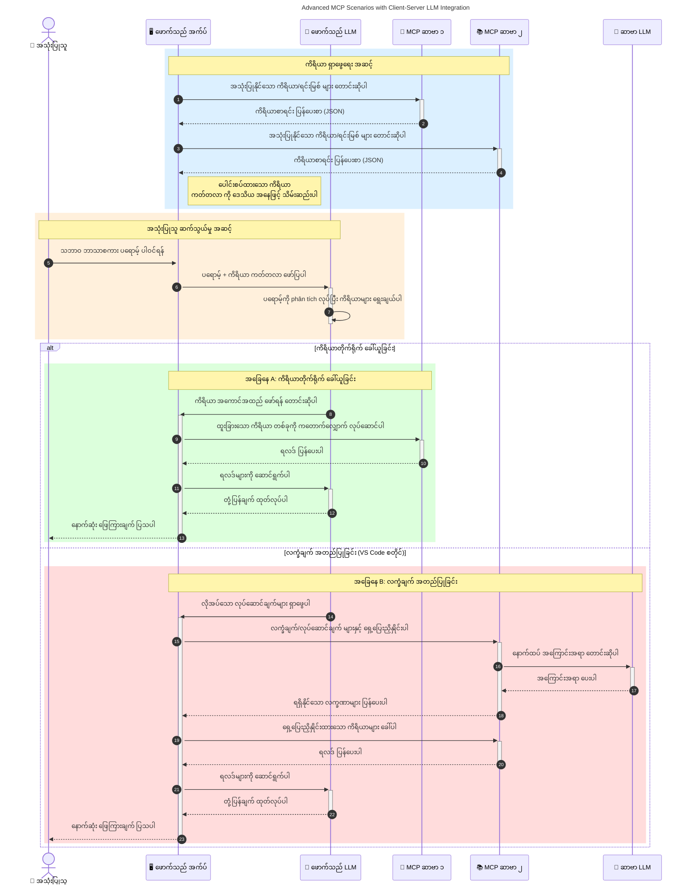

# Model Context Protocol (MCP) ကို မိတ်ဆက်ခြင်း: Scalable AI Applications များအတွက် ဘာကြောင့် အရေးကြီးသလဲ

[](https://youtu.be/agBbdiOPLQA)

_(ဒီသင်ခန်းစာရဲ့ ဗီဒီယိုကို ကြည့်ရန် ဓာတ်ပုံကိုနှိပ်ပါ)_

Generative AI applications များသည် သဘာဝဘာသာစကားပြောဆိုမှု prompts များဖြင့် အသုံးပြုသူနှင့် ဆက်သွယ်နိုင်စေသောအတွက် တိုးတက်မှုကြီးတစ်ခုဖြစ်သည်။ သို့သော် ဤအမျိုးအစား အက်ပ်များတွင် အချိန်နှင့် အရင်းအမြစ်များ ပိုမိုချရင်းဖြင့်၊ လွယ်ကူစွာ တိုးချဲ့နိုင်သည့် ဖန်တီးမှုများနှင့် အရင်းအမြစ်များ ထည့်သွင်းနိုင်ခြင်း၊ ကိုးကားမည့်မော်ဒယ်အရေအတွက် များခြင်းနှင့် မော်ဒယ်အထူးသဖြင့် ထိန်းချုပ်နိုင်ခြင်းတို့အတွက် အဆင်ပြေစေဖို့လိုအပ်သည်။ အဓိကအားဖြင့် Generative AI applications တည်ဆောက်ခြင်းမှာ စမယ့်အဆင်ပြေရာသော်၊ အဆင့်မြင့်လာသည်နှင့်အညီ ပိုမိုရှုပ်ထွေးလာပြီး၊ ငါတို့သည် အဆောက်အအုံသတ်မှတ်ရန်လိုအပ်လာပြီး၊ အဲဒီအတွက် စံနမူနာတစ်ခုအနေဖြင့် MCP ကိုအသုံးပြုမှသာ အက်ပ်များကို ယှဉ်တွဲတည်ဆောက်နိုင်မည်ဖြစ်သည်။ MCP သည် အရာအားလုံးကို စနစ်တကျစီမံပေးပြီး စံနမူနာဖြစ်စေသည်။

---

## **🔍 Model Context Protocol (MCP) ဆိုတာဘာလဲ?**

**Model Context Protocol (MCP)** သည် ကြီးမားသော ဘာသာစကားမော်ဒယ် (LLMs) များအား ပြီးပြည့်စုံစွာ tools, APIs နှင့် data sources ပေါ်တွင် ပေါင်းစည်းအသုံးပြုရန် ထောက်ပံ့ပေးသည့် **ဖွင့်လှစ်ထားသော၊ စံချိန်စနစ်တကျ ရုပ်ထွက်ကိုင်တွယ်မှု အင်တာဖေ့စ်** ဖြစ်သည်။ ၎င်းသည် AI မော်ဒယ်၏ လေ့လာမှုဒေတာအပြင်ပိုင်း၌ လှုပ်ရှားနိုင်စေပြီး၊ ပိုမို တိုင်းတာနိုင်သော၊ ပြန်လည်တုံ့ပြန်ချက်မြန်သော AI စနစ်များ ဖန်တီးရန် အတည်ပြုနိုင်သည်။

---

## **🎯 AI တွင် စံချိန်စနစ်တက်မှု အကြောင်းအရာ**

Generative AI applications များ ရှုပ်ထွေးလာသည်နှင့်အမျှ, **တိုးချဲ့နိုင်မှု၊ တိုးတက်နိုင်မှု၊ ပြုပြင်ထိန်းသိမ်းနိုင်မှု** နှင့် **vendor ပိတ်မိမှုရှောင်ရှားမှု** အတွက် စံချိန်စနစ်တက်မှုကို အရေးကြီးလျက် ရရှိစေရန် လိုအပ်သည်။ MCP သည် အောက်ပါအတိုင်း ပြဋ္ဌာန်းသည်။

- မော်ဒယ်-ကိရိယာ ပေါင်းစည်းမှုများကို တစ်နေရာတည်းဖြင့် ဆက်လက်နိုင်စေရန်
- နှိုးဆွ ပိုမိုသော တစ်ခုတည်းနှင့်မတူညီသော ဇို့ထုတ်ဖြစ်စေသော ဖြေရှင်းချက်များ လျှော့ချရန်
- vendor များအမျိုးမျိုးမှ မော်ဒယ်များစုပေါင်းအသုံးပြုနိုင်သည့် ပတ်ဝန်းကျင်တစ်ခုတွင် ရှိစေရန်

**မှတ်ချက်။** MCP သည် ဖွင့်လှစ်ထားသော စံချိန်အဖြစ် ကြေညာထားသော်လည်း IEEE, IETF, W3C, ISO သို့မဟုတ် အခြားသော စံချိန်အဖွဲ့အစည်းများမှ စံချိန်တင်ရန် မရှိသေးပါ။

---

## **📚 သင်ယူရန် ရည်ရွယ်ချက်များ**

ဤဆောင်းပါးအဆုံးတွင် သင်သည် အောက်ပါအချက်များ အောင်မြင်စွာသိရှိနိုင်မည်။

- **Model Context Protocol (MCP)** ကို သတ်မှတ်နိုင်ပြီး၊ ၎င်း၏ အသုံးပြုမှုများကို နားလည်နိုင်မည်
- MCP သည် မော်ဒယ်နှင့် ကိရိယာများအကြား ဆက်သွယ်မှုကို မည်သို့ စံချိန်တင်သည်ကို နားလည်သိရှိနိုင်မည်
- MCP အဆောက်အအုံ၏ အဓိကအစိတ်အပိုင်းများကို ရှာဖွေ မြင်သာနိုင်မည်
- MCP ၏ စီးပွားရေးနှင့် ဖွံ့ဖြိုးတိုးတက်ရေးလောက၌ ဖြစ်ပေါ်နေသော အသုံးပြုမှုများကို လေ့လာနိုင်မည်

---

## **💡 Model Context Protocol (MCP) သည် ဘာကြောင့် အရေးကြီးသနည်း**

### **🔗 MCP သည် AI ဆက်သွယ်မှုများတွင် ခွဲခြားထားခြင်းကို ဖြေရှင်းပေးသည်**

MCP မတိုင်မီ၊ မော်ဒယ်များနှင့် ကိရိယာများ ပေါင်းစပ်ရန် အောက်ပါအတိုင်း လုပ်ဆောင်ရသည်။

- ကိရိယာ-မော်ဒယ် တစ်စုံတစ်ရာ နှိုင်းကားချက် အတွက် သီးသန့်ကုဒ်ရေးခြင်း
- vendor တစ်ဦးချင်း APIs မဟုတ်ခြင်းများကို အသုံးပြုခြင်း
- update များကြောင့် မကြာခဏ ချိုးဖောက်ခြင်းများ ဖြစ်ပေါ်ခြင်း
- ကိရိယာများပိုမိုတိုးလာခြင်းနှင့် လုပ်ဆောင်ချက်လျော့နည်းခြင်း

### **✅ MCP စံချိန်တင်မှု၏ အကျိုးကျေးဇူးများ**

| **အကျိုး**               | **ဖော်ပြချက်**                                                                 |
|--------------------------|--------------------------------------------------------------------------------|
| ဆက်စပ်နိုင်မှု              | LLM များက vendor များအမျိုးမျိုးရှိ ကိရိယာများနှင့် အဆင်ပြေစွာ ဆက်သွယ်နိုင်ခြင်း            |
| တည်ငြိမ်မှု               | ပြင်ပပလက်ဖောင်းနှင့် ကိရိယာများတွင် တပြိုင်နက် အသုံးပြုမှုနှင့် အပြုအမူ တစ်ပြိုင်နက်ဖြစ်စေခြင်း           |
| ထပ်မံအသုံးပြုနိုင်မှု      | တစ်ကြိမ် တည်ဆောက်ပြီးနောက် အခြားအစီအစဉ်နှင့် စနစ်များတွင် အသုံးပြုနိုင်ခြင်း                       |
| ဖွံ့ဖြိုးတိုးတက်ရာအလျှော့ချခြင်း | စံချိန်တင်ထားသော plug-and-play အင်တာဖေ့စ်များအသုံးပြုခြင်းမှဖြစ်ပြီး ဖွံ့ဖြိုးရေး အချိန်လျော့ကျစေခြင်း                |

---

## **🧱 MCP အဆောက်အအုံအမြင့်အလယ်လေးများ ရှင်းပြချက်**

MCP သည် **client-server မော်ဒယ်** ကို လိုက်နာပြီး၊

- **MCP Hosts** များသည် AI မော်ဒယ်များကို ချီဆက်လုပ်ဆောင်သည်။
- **MCP Clients** များသည် တောင်းဆိုမှုများကို စတင်သည်။
- **MCP Servers** များသည် context, ကိရိယာများနှင့် စွမ်းဆောင်ရည်များကို ဝန်ဆောင်မှုပေးသည်။

### **အဓိက အစိတ်အပိုင်းများ -**

- **Resources** – မော်ဒယ်များအတွက် တည်ငြိမ် သို့မဟုတ် dynamic ဒေတာများ  
- **Prompts** – ဦးတည်မှု ဓာတ်ကို ထောက်ပံ့သော နည်းလမ်းများ  
- **Tools** – ရှာဖွေခြင်း၊ တွက်ချက်ခြင်း ကဲ့သို့ အလုပ်အကိုင်လုပ်သည့် function များ  
- **Sampling** – recursive interaction များမှတဆင့် အေးဂျင့်ဆန်သော ပြုမူ (MCP `2026-07-28` တွင် ဖျက်ထားပြီး၊ အသစ်တည်ဆောက်ရာတွင် LLM provider နှင့် တိုက်ရိုက် ပေါင်းစည်းသင့်သည်)  
    

- **Elicitation** – အသုံးပြုသူ ဖြည့်သွင်းမှုများအတွက် ဆာဗာမှ တောင်းဆိုမှုများ  
- **Roots** – ဆာဗာနှင့်သက်ဆိုင်သော သတင်းအချက်အလက်ဖိုင်စနစ်တည်နေရာများ (MCP `2026-07-28` တွင် ဖျက်သိမ်းပြီး၊ ကိရိယာ parameter များ၊ resource URI များသို့မဟုတ် ဆာဗာ configuration များကို အသုံးပြုရန် ဦးတည်ပါ)  
    


### **စံချိန်စနစ် အဆောက်အအုံ**

MCP သည် အဆင့်နှစ်ခုပါသော အဆောက်အအုံသုံးသည်။
- **Data Layer**: JSON-RPC 2.0 မက်ဆေ့ခ်ျများ၊ per-request metadata, ဖြေရှင်းမှု ရှာဖွေမှု နှင့် protocol အခြေခံချက်များ  
    
- **Transport Layer**: ဒေသတွင်း subprocess များအတွက် stdio နှင့် ဝေးလံသော ဆာဗာများအတွက် Streamable HTTP ကို အသုံးပြုသည်။ Streamable HTTP သည် streamed response အတွက် SSE framing ကို အသုံးပြုနိုင်သည်၊ သို့သော် မကြာသေးမီက HTTP+SSE transport သည် ဖျက်ပစ်ထားသည်။
    
    

---

## MCP Servers များ အလုပ်လုပ်ပုံ

MCP servers များသည် အောက်ပါနည်းဖြင့် လည်ပတ်ပါသည်။

- **တောင်းဆိုမှုလည်ပတ်မှု**:
    1. တောင်းဆိုမှုကို နောက်ဆုံးအသုံးပြုသူ သို့မဟုတ် သူတို့ကိုယ်စား ဆော့ဖ်ဝဲမှ စတင်သည်။
    2. **MCP Client** သည် တောင်းဆိုမှုအား AI Model runtime ကို စီမံခန့်ခွဲသော **MCP Host** ကို ပေးပို့သည်။
    3. **AI Model** သည် အသုံးပြုသူ prompt ကို လက်ခံပြီး၊ တစ်ခု သို့မဟုတ် ထပ်တလဲလဲ tool call များမှတဆင့် ပြင်ပကိရိယာများသို့ ဒေတာများကို တောင်းဆောင်နိုင်သည်။
    4. **MCP Host** သည် မော်ဒယ်ကို တိုက်ရိုက်မဟုတ်ဘဲ သတ်မှတ်ထားသော protocol ဖြင့် သင့်တော်သော **MCP Server(s)** များနှင့် ဆက်သွယ်သည်။
- **MCP Host Functionality**:
    - **Tool Registry**: ရရှိနိုင်သည့် ကိရိယာများနှင့် ၎င်းတို့၏ စွမ်းဆောင်ရည်များ စာရင်းသိမ်းဆည်းသည်။
    - **Authentication**: ကိရိယာထိန်းချုပ်ခွင့်ရှိ/မရှိ စစ်ဆေးသည်။
    - **Request Handler**: မော်ဒယ်မှ ကိရိယာတောင်းဆိုမှုများကို လက်ခံကောက်နှုတ်သည်။
    - **Response Formatter**: မော်ဒယ်က နားလည်နိုင်သော ဖော်မွေ့ရာ data အဖြစ် ကိရိယာ output များကို ဖွဲ့စည်းပေးသည်။
- **MCP Server Execution**:
    - **MCP Host** သည် တစ်ခု သို့မဟုတ် များစွာသော **MCP Servers** (ဥပမာ- ရှာဖွေမှု၊ တွက်ချက်မှု၊ ဒေတာများ ရှာဖွေမှု) သို့ ကိရိယာ call များ ပေးပို့သည်။
    - **MCP Servers** များက ညှိနှိုင်းထားသည့် format ဖြင့် ရလဒ်များ ပြန်ပေးသည်။
    - **MCP Host** သည် ထိုရလဒ်များကို ဖော်မတ်ပြုပြင်ကာ **AI Model** သို့ ပို့ပေးသည်။
- **ဖြေဆိုမှု အပြီးသတ်မှု**:
    - **AI Model** သည် ကိရိယာ output များကို နောက်ဆုံးဖြေဆိုမှုတွင် ထည့်သွင်းသည်။
    - **MCP Host** သည် ၎င်းဖြေရှင်းမှုကို **MCP Client** ထံ ပြန်ပို့ပြီး၊ အဆုံးအသုံးပြုသူ သို့မဟုတ် ခေါ်ယူသည့် ဆော့ဖ်ဝဲထံ ပေးပို့သည်။

```mermaid
---
title: MCP Architecture and Component Interactions
description: A diagram showing the flows of the components in MCP.
---
graph TD
    Client[MCP Client/Application] -->|ပေးပို့သည့် တောင်းဆိုမှု| H[MCP Host]
    H -->|အမိန့်ခေါ်ဆောင်ရွက်သည်| A[AI မော်ဒယ်]
    A -->|ကိရိယာခေါ်ဆိုမှု တောင်းဆိုမှု| H
    H -->|MCP Protocol| T1[MCP Server Tool 01: ဝက်ဘ်ရှာဖွေရေး]
    H -->|MCP Protocol| T2[MCP Server Tool 02: ကယ်လ်ကူလေးတာကိရိယာ]
    H -->|MCP Protocol| T3[MCP Server Tool 03: ဒေတာအခြေခံထုတ်ယူကိရိယာ]
    H -->|MCP Protocol| T4[MCP Server Tool 04: ဖိုင်စနစ်ကိရိယာ]
    H -->|တုံ့ပြန်ချက် ပေးပို့သည်| Client

    subgraph "MCP Host အစိတ်အပိုင်းများ"
        H
        G[ကိရိယာစာရင်းသွင်းခြင်း]
        I[အတည်ပြုခြင်း]
        J[တောင်းဆိုမှု ကိုင်တွယ်သူ]
        K[တုံ့ပြန်ချက် ပုံစံစနစ်]
    end

    H <--> G
    H <--> I
    H <--> J
    H <--> K

    style A fill:#f9d5e5,stroke:#333,stroke-width:2px
    style H fill:#eeeeee,stroke:#333,stroke-width:2px
    style Client fill:#d5e8f9,stroke:#333,stroke-width:2px
    style G fill:#fffbe6,stroke:#333,stroke-width:1px
    style I fill:#fffbe6,stroke:#333,stroke-width:1px
    style J fill:#fffbe6,stroke:#333,stroke-width:1px
    style K fill:#fffbe6,stroke:#333,stroke-width:1px
    style T1 fill:#c2f0c2,stroke:#333,stroke-width:1px
    style T2 fill:#c2f0c2,stroke:#333,stroke-width:1px
    style T3 fill:#c2f0c2,stroke:#333,stroke-width:1px
    style T4 fill:#c2f0c2,stroke:#333,stroke-width:1px
```
    



## 👨‍💻 MCP Server တည်ဆောက်နည်း (ဥပမာများဖြင့်)

MCP servers များက LLM စွမ်းရည်များကို ဒေတာနှင့် လုပ်ဆောင်ချက်များ ပေးသည့်အားဖြင့် တိုးချဲ့ခွင့် ပေးသည်။

စမ်းသပ်ဖို့ အသင့်ဖြစ်ပြီလား? မတူညီသော ဘာသာစကား/stack များတွင် လွယ်ကူသော MCP server များ ဖန်တီးရန် SDK များနှင့် ဥပမာများသည် အောက်ပါအတိုင်းဖြစ်သည်:

- **Python SDK**: https://github.com/modelcontextprotocol/python-sdk

- **TypeScript SDK**: https://github.com/modelcontextprotocol/typescript-sdk

- **Java SDK**: https://github.com/modelcontextprotocol/java-sdk


- **C#/.NET SDK**: https://github.com/modelcontextprotocol/csharp-sdk


## 🌍 MCP အတွက် အမှန်တကယ် အသုံးပြုမှုများ

MCP သည် AI စွမ်းဆောင်ရည်များကို တိုးချဲ့ပေးခြင်းအားဖြင့် အသုံးပြုမှု များစွာကို ခွင့်ပြုသည်။

| **အသုံးပြုမှု**             | **အသေးစိတ်ဖော်ပြချက်**                                                      |
|------------------------------|-------------------------------------------------------------------------------|
| စီးပွားရေး ဒေတာ ပေါင်းစည်းခြင်း | LLM များအား ဒေတာဘေ့စ်များ၊ CRM များ သို့မဟုတ် အတွင်းရေးရာ ကိရိယာများနှင့် ချိတ်ဆက်ခြင်း             |
| Agentic AI စနစ်များ          | ကိုယ်ပိုင်အေဂျင့်များကို ကိရိယာများနှင့် ဆုံးဖြတ်မှု အလုပ်စဉ်များနှင့် အလိုအလျောက် လုပ်ဆောင်နိုင်ခြင်း              |
| မျိုးစုံ မော်ဒယ် အက်ပလီကေးရှင်းများ | စာသား၊ ပုံ နှင့် အသံကိရိယာများကို တစ်ခုတည်းသော AI အက်ပလီကေးရှင်းအတွင်း ပေါင်းစည်းခြင်း                          |
| အချိန်နှင့် တပြေးညီ ဒေတာ ပေါင်းစည်းခြင်း | တိုက်ရိုက် ဒေတာများကို AI အပြန်အလှန်ဆက်သွယ်မှုထဲ ထည့်သွင်း၍ ပိုမိုတိကျပြီး ယနေ့အချိန်တွင်း ထုတ်လွှင့်မှုများရရှိစေရန်             |


### 🧠 MCP = AI အပြန်အလှန် ဆက်သွယ်မှုများအတွက် ယေဘုယျ စံနှုန်း

Model Context Protocol (MCP) သည် USB-C ကဲ့သို့ ဆက်သွယ်မှုများအတွက် ပစ္စည်းချိတ်ဆက်မှုများအား စံချိန်ညှိပေးသည့်နည်းလမ်းတစ်ခုအဖြစ် လုပ်ဆောင်သည်။ AI ကမ္ဘာတွင် MCP သည် တစ်စိတ်တစ်ပိုင်း စံဆင့်တူ အင်တာဖေ့စ်ကို ပံ့ပိုးပေးကာ မော်ဒယ်များ (ဖောက်သည်များ) အား ပြင်ပကိရိယာများနှင့် ဒေတာပံ့ပိုးသူများ (ဆာဗာများ) ဖြင့် သင့်လျော်စွာ ပေါင်းစည်းနိုင်စေသည်။ ဒါကြောင့် API သို့မဟုတ် ဒေတာမူရင်းတစ်ခုစီအတွက် မတူညီသော ကုဒ်သုံးစွဲမှုများ လိုအပ်မှုကို ဖယ်ရှားပေးသည်။

MCP အောက်တွင် MCP ကိုက်ညီသော ကိရိယာတစ်ခု (MCP ဆာဗာဟုခေါ်သည်) သည် ကိုက်ညီသော စံနှုန်းတစ်ခုကို လိုက်နာသည်။ ဤဆာဗာများသည် သူတို့ ပံ့ပိုးသော ကိရိယာများ သို့မဟုတ် လုပ်ဆောင်ချက်များကို စာရင်းပြုစုနိုင်ပြီး AI အေဂျင့်တစ်ခုမှ လျှောက်လွှာတင်သည့် အခါ လုပ်ဆောင်ချက်များကို လုပ်ဆောင်ပေးနိုင်သည်။ MCP ကိုပံ့ပိုးသော AI အေဂျင့် ပလက်ဖောင်းများသည် ဆာဗာများမှ ရနိုင်သော ကိရိယာများကို ရှာဖွေရန်နှင့် ဤစံချိန်နည်းလမ်းဖြင့် ထုတ်လုပ်နိုင်ပါသည်။

### 💡 ဗဟုသုတရယူခြင်းကို အထောက်အကူပြုသည်

ကိရိယာများ ပေးသည့်အပြင် MCP သည် ဗဟုသုတရယူခြင်းကိုလည်း အထောက်အကူပြုသည်။ ၎င်းသည် အကြီးစားဘာသာစကား မော်ဒယ်များ (LLMs) ကို ပတ်ဝန်းကျင်နှင့် ချိတ်ဆက်ကာ မျိုးစုံသော ဒေတာရင်းမြစ်များနှင့်ချိတ်ဆက်ပေးနိုင်သည်။ ဥပမာ၊ MCP ဆာဗာတစ်ခုသည် ကုမ္ပဏီ၏ စာရွက်စာတမ်း သိုလှောင်မှုကို ကိုယ်စားပြုနိုင်၍ အေဂျင့်များသည် လိုအပ်သလို သက်ဆိုင်ရာ အချက်အလက်များကို ရယူနိုင်သည်။ ဆာဗာတစ်ခုမှာ အီးမေးလ်ပို့ခြင်း သို့မဟုတ် မှတ်တမ်းအား အပ်ဒိတ်လုပ်ခြင်းကဲ့သို့ တိကျသော လုပ်ဆောင်ချက်များကို စီမံနိုင်သည်။ အေဂျင့်၏ ရိုသေမြင်မှုကြောင့် ၎င်းတို့သည် အသုံးပြုနိုင်သော ကိရိယာများသာဖြစ်ပြီး၊ တချို့ကိရိယာများသည် ဒေတာ (ဗဟုသုတဒေသ) ပြန်လည်ပေးသော်လည်း အခြားကိရိယာများသည် လုပ်ဆောင်ချက်များ ကို လုပ်ဆောင်ပါသည်။ MCP သည် ဤနှစ်မျိုးစလုံးကို ထိရောက်စွာ စီမံပေးသည်။

MCP ဆာဗာနှင့် ချိတ်ဆက်သော အေဂျင့်သည် ဆာဗာ၏ရရှိနိုင်သော စွမ်းအားများနှင့် အသုံးဝင်သော ဒေတာများကို စံပုံစံတစ်ခုဖြင့် အလိုအလျောက် သင်ယူနိုင်သည်။ ဤစံချိန်ညှိမှုကြောင့် ကိရိယာရရှိမှုသည် အပြောင်းအလဲဖြစ်နိုင်သည်။ ဥပမာ၊ MCP ဆာဗာအသစ်တစ်ခုကို အေဂျင့်စနစ်တွင် ထည့်သွင်းခြင်းအားဖြင့် ၎င်း၏ လုပ်ဆောင်ချက်များကို မည်သည့်အပို ပြင်ဆင်မှုအလိုမရှိဘဲ ယင်း၏ အညွှန်းလမ်းညွှန်ချက်များ ဖြင့် ချက်ချင်း အသုံးပြုနိုင်သည်။

ဤအဆင်ပြေသည့်ပေါင်းစည်းမှုသည် အောက်ပါ ပုံဆွဲတွင်ပြထားသည့်ထဲမှာ ဆာဗာများသည် ကိရိယာများနှင့် ဗဟုသုတများကို ပံ့ပိုးပေး၍ စနစ်များအကြား မျှဝေဖလှယ်မှုနှင့် ပူးပေါင်းဆောင်ရွက်မှုတို့ကို အဆင်ပြေစေရန် ထိန်းသိမ်းပေးသည်။

### 👉 ဥပမာ - ကြီးထွားတိုးတက်နိုင်သော အေဂျင့် ဖြေရှင်းချက်

```mermaid
---
title: Scalable Agent Solution with MCP
description: A diagram illustrating how a user interacts with an LLM that connects to multiple MCP servers, with each server providing both knowledge and tools, creating a scalable AI system architecture
---
graph TD
    User -->|အမိန့်| LLM
    LLM -->|ဖြေကြားချက်| User
    LLM -->|MCP| ServerA
    LLM -->|MCP| ServerB
    ServerA -->|ယူနစ်ဗာဆယ်ဆက်သွယ်ကိရိယာ| ServerB
    ServerA --> KnowledgeA
    ServerA --> ToolsA
    ServerB --> KnowledgeB
    ServerB --> ToolsB

    subgraph ဆာဗာ A
        KnowledgeA[သိကောင်းစရာ]
        ToolsA[ကိရိယာများ]
    end

    subgraph ဆာဗာ B
        KnowledgeB[သိကောင်းစရာ]
        ToolsB[ကိရိယာများ]
    end
```
Universal Connector သည် MCP ဆာဗာများအကြား ဆက်သွယ်ဆောင်ရွက်ခြင်းနှင့် စွမ်းဆောင်နိုင်မှုမျှဝေရန် ခွင့်ပြုခြင်းဖြင့် ServerA က ServerB သို့တာဝန်များ ပေးအပ်ခြင်း သို့မဟုတ် ၎င်း၏ ကိရိယာနှင့် ဗဟုသုတများကို အသုံးပြုနိုင်စေသည်။ ဤသည်မှာ ဆာဗာများအကြား ကိရိယာများနှင့် ဒေတာများ ဝေမျှသည့် နည်းပညာဖြစ်ပြီး ကြီးထွားနိုင်သော၊ ပတ္တမြားပိုင်းခွဲခံနိုင်သော အေဂျင့် ဖွဲ့စည်းပုံများကို ထောက်ပံ့ပေးသည်။ MCP သည် ကိရိယာတွေကို စံချိန်ညှိပေးတဲ့အတွက် အေဂျင့်များသည် ဆာဗာတွေကို ချက်ချင်း ရှာဖွေပြီး တောင်းဆိုမှုများကို အပြန်အလှန် လမ်းညွှန်နိုင်သလို ကန့်သတ်ထားသော ပေါင်းစပ်မှု မလိုအပ်တော့ပါ။


ကိရိယာ နှင့် ဗဟုသုတ မျှဝေရေး: ဆာဗာများအလိုက် ကိရိယာများနှင့် ဒေတာများကို အသုံးချနိုင်ပြီး ကြီးထွားတိုးတက်ပြီး ပတ္တမြားသည်းခံနိုင်သော အေဂျင့်ဖွဲ့စည်းပုံများကို ဦးပေးပံ့ပိုးသည်။

### 🔄 Client-Side LLM ပေါင်းစည်းခြင်းနှင့် မကြာခဏအသုံးပြုသော MCP ရှုထောင့်များ

မူလ MCP ဖွဲ့စည်းပုံအပြင် Client နှင့် Server နှစ်ဖက်လုံးတွင် LLM များပါဝင်သော အဆင့်မြင့် နောက်ထပ်နည်းလမ်းများ ရှိပြီး ပိုမိုတိုးတက်သော အပြန်အလှန်ဆက်သွယ်မှုများကို ခွင့်ပြုသည်။ အောက်ပါ ပုံတွင် **Client App** သည် IDE တစ်ခုဖြစ်နိုင်ပြီး MCP ကိရိယာအချို့ကို LLM အသုံးပြုခြင်း အတွက် ရရှိနိုင်သည်။



## 🔐 MCP ၏ လက်တွေ့ အကျိုးကျေးဇူးများ

MCP ကို အသုံးပြုရာတွင် လက်တွေ့ ရရှိနိုင်သော အကျိုးကျေးဇူးများမှာ အောက်ပါအတိုင်းဖြစ်သည်-

- **နောက်ဆုံးသတင်းအသစ်များ**: မော်ဒယ်များသည် လေ့လာသင်ကြားထားသည့်ဒေတာ အပြင် နောက်ဆုံးပေါ် အချက်အလက်များကို ရယူနိုင်သည်
- **စွမ်းရည် တိုးချဲ့ခြင်း**: မော်ဒယ်များသည် မသင်ကြားရသည့် အလုပ်များအတွက် အထူးပြု ကိရိယာများကို အသုံးပြုနိုင်သည်
- **အမှားယြင်းမှုများ လျော့ပါးခြင်း**: ပြင်ပ ဒေတာရင်းမြစ်များက အဖြစ်မှန် အခြေခံချက်များကို ပံ့ပိုးပေးသည်
- **ကိုယ်ရေးကိုယ်တာကာကွယ်မှု**: ခိုင်မာသော ပတ်ဝန်းကျင်များတွင် ထိန်းသိမ်းထားသည့် မှန်ကန်သော ဒေတာများသာ မျက်နှာစာအတွင်း မတင်ထားရပဲ နေထိုင်နိုင်သည်

## 📌 အဓိကယူဆချက်များ

MCP အသုံးပြုရာတွင် ရမည့် အဓိကယူဆချက်များမှာ-

- **MCP** သည် AI မော်ဒယ်များ ကိရိယာများနှင့် ဒေတာများကို ဆက်သွယ်သည့်နည်းလမ်းများကို စံချိန်ညှိပေးသည်
- **တိုးချဲ့နိုင်မှု၊ တိကျမှုနှင့် ထိတွေ့နိုင်မှုတို့ကို အားပေးပံ့ပိုးပေးသည်**
- MCP သည် **ဖွံ့ဖြိုးတိုးတက်ရေးအချိန်ကို လျော့ချပြီး ယုံကြည်စိတ်ချစရာကောင်းမှုကို မြှင့်တင်ပြီး မော်ဒယ်စွမ်းရည်များကို တိုးချဲ့ပေးသည်**
- client-server ဖွဲ့စည်းမှုသည် **အသုံးပြုရ လွယ်ကူပြီး တိုးချဲ့နိုင်သော AI အက်ပလီကေးရှင်းများ ဖန်တီးနိုင်စေသည်**

## 🧠 လေ့ကျင့်မှုပြုလုပ်ပါ

သင်စိတ်ဝင်စားသော AI အက်ပလီကေးရှင်း တစ်ခုကို စဉ်းစားပါ။

- ကၽြႏု္ပ္၏ စွမ္းအားမ်ားကို တိုးျမႇင့္ႏုိင္မည့္ **ျပင္ပကိရိယာမ်ား သို႔ ဒေတာမ်ား** ဘာေတြရွိႏိုင္မလဲ။
- MCP သည္ ပေါင်းစပ်မှုကို **ပိုလွယ်ကူ၍ ပိုယုံကြည်စိတ်ချရအောင်** ဘယ်လိုကူညီနိုင်မလဲ။

## အပိုဆောင်း အရင်းအမြစ်များ

- [MCP GitHub Repository](https://github.com/modelcontextprotocol)


## နောက်တစ်ခါဘာလုပ်မလဲ

နောက်တစ်ခု: [အခန်း ၁: အခြေခံသဘောတရားများ](../01-CoreConcepts/README.md)

---

<!-- CO-OP TRANSLATOR DISCLAIMER START -->
**ပြောကြားချက်**
ဤစာတမ်းကို AI ဘာသာပြန်ဝန်ဆောင်မှု [Co-op Translator](https://github.com/Azure/co-op-translator) အသုံးပြု၍ ဘာသာပြန်ထားပါသည်။ ကျွန်ုပ်တို့သည် တိကျမှန်ကန်မှုအတွက် ကြိုးပမ်းနေသော်လည်း၊ စက်ကိရိယာဘာသာပြန်ခြင်းများတွင် အမှားများ သို့မဟုတ် မှားယွင်းချက်များ ပါဝင်နိုင်ကြောင်း သတိပြုပါရန် လိုအပ်ပါသည်။ မူလစာတမ်းကို မူရင်းဘာသာဖြင့်သာ ယုံကြည်စိတ်ချရသော အချက်အလက်အဖြစ် သတ်မှတ်သင့်သည်။ အရေးကြီးသည့် သတင်းအချက်အလက်များအတွက် ပရော်ဖက်ရှင်နယ် လူသားဘာသာပြန်သူဝန်ဆောင်မှုကို အကြံပြုပါသည်။ ဤဘာသာပြန်ချက်ကို အသုံးပြုခြင်းမှ ဖြစ်ပေါ်လာသော နားလည်မှုကွာခြားမှုများ သို့မဟုတ် မမှန်ကန်သော အသုံးပြုမှုများအတွက် ကျွန်ုပ်တို့ တာဝန်မခံပါ။
<!-- CO-OP TRANSLATOR DISCLAIMER END -->