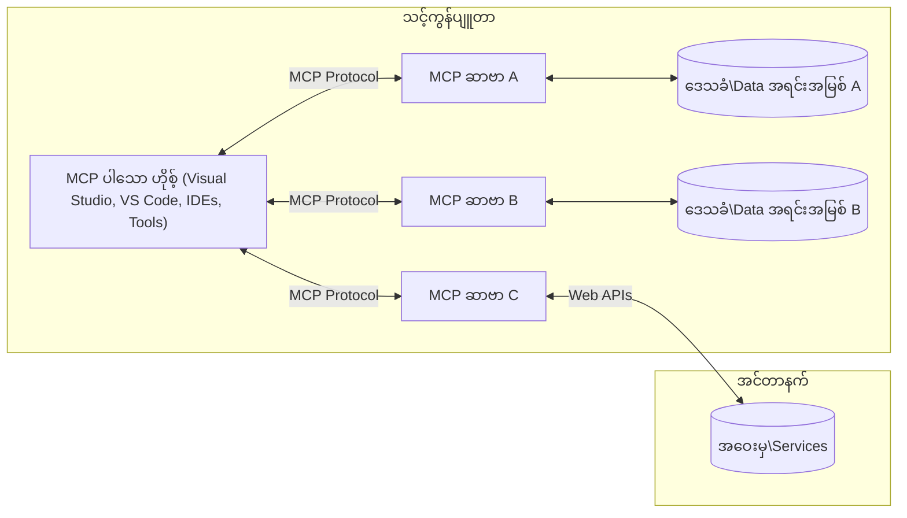

# MCP အခြေခံအယူအဆများ: AI ပေါင်းစည်းမှုအတွက် Model Context Protocol ကို ကျွမ်းကျင်စွာ အသုံးပြုခြင်း

[](https://youtu.be/earDzWGtE84)

_(ဤသင်ခန်းစာ၏ ဗီဒီယိုကို ကြည့်ရန် အပေါ်တွင် ရုပ်ပုံကို နှိပ်ပါ)_

[Model Context Protocol (MCP)](https://github.com/modelcontextprotocol) သည် ကြီးမားသော ဘာသာစကား မော်ဒယ်များ (LLMs) နှင့် ပြင်ပကိရိယာများ၊ အက်ပလီကေးရှင်းများ၊ ဒေတာရင်းမြစ်များအကြား ဆက်သွယ်မှုကို အထူးပြု၍ စံချိန်စံညွှန်းထားသော အင်အားကြီးသော ဖရိမ်ဝတ်တစ်ခုဖြစ်သည်။  
ဤလမ်းညွှန်စာအုပ်သည် MCP ၏ အခြေခံအယူအဆများကို သင်ကြားပေးမည်ဖြစ်သည်။ သင်သည် ၎င်း၏ client-server ဖွဲ့စည်းပုံ၊ အရေးကြီးသော အစိတ်အပိုင်းများ၊ ဆက်သွယ်မှုစနစ်များနှင့် အကောင်အထည်ဖော်မှုအကောင်းဆုံး လေ့လာမှုများကို သင်ယူရမည်ဖြစ်သည်။

- **အသုံးပြုသူ၏ ထင်ရှားသော သဘောတူညီချက်**: ဒေတာဝင်ရောက်မှုနှင့် လုပ်ဆောင်ချက်များအားလုံးသည် အကောင်အထည်ဖော်မပြုမီ အသုံးပြုသူ၏ ထင်ရှားသော သဘောတူညီချက် လိုအပ်သည်။ အသုံးပြုသူများသည် မည်သည့်ဒေတာကို ဝင်ရောက်မည်၊ မည်သည့်လုပ်ဆောင်ချက်များ ပြုလုပ်မည်ကို ရှင်းလင်းစွာ နားလည်ရမည်ဖြစ်ပြီး ခွင့်ပြုချက်များနှင့် အတည်ပြုချက်များကို အသေးစိတ် ထိန်းချုပ်နိုင်ရမည်။

- **ဒေတာကိုယ်ရေးကိုယ်တာ ကာကွယ်မှု**: အသုံးပြုသူဒေတာကို ထင်ရှားသော သဘောတူညီချက်ဖြင့်သာ ဖော်ပြရမည်ဖြစ်ပြီး ဆက်သွယ်မှုတစ်လျှောက်လုံးတွင် ခိုင်မာသော ဝင်ရောက်ခွင့် ထိန်းချုပ်မှုများဖြင့် ကာကွယ်ထားရမည်။ မလိုလားအပ်သော ဒေတာ ပို့ဆောင်မှုများကို တားဆီးရမည်ဖြစ်ပြီး တင်းကြပ်သော ကိုယ်ရေးကိုယ်တာ နယ်နိမိတ်များကို ထိန်းသိမ်းရမည်။

- **ကိရိယာ လုပ်ဆောင်မှု လုံခြုံမှု**: ကိရိယာတိုင်းကို အသုံးပြုမည့်အခါ အသုံးပြုသူ၏ ထင်ရှားသော သဘောတူညီချက် လိုအပ်ပြီး ကိရိယာ၏ လုပ်ဆောင်ချက်များ၊ ပါရာမီတာများနှင့် ဖြစ်နိုင်သော သက်ရောက်မှုများကို ရှင်းလင်းစွာ နားလည်ရမည်။ ခိုင်မာသော လုံခြုံရေး နယ်နိမိတ်များက မလိုလားအပ်သော၊ မလုံခြုံသော သို့မဟုတ် မကောင်းဆိုးရွားသော ကိရိယာ လုပ်ဆောင်မှုများကို တားဆီးရမည်။

- **သယ်ယူပို့ဆောင်မှု အလွှာ လုံခြုံရေး**: ဆက်သွယ်မှု ချန်နယ်အားလုံးတွင် သင့်တော်သော စာလုံးကူးခြင်းနှင့် အတည်ပြုခြင်း စနစ်များကို အသုံးပြုရမည်။ ဝေးလံသော ချိတ်ဆက်မှုများတွင် လုံခြုံသော သယ်ယူပို့ဆောင်မှု ပရိုတိုကောများနှင့် သင့်တော်သော အသိအမှတ်ပြု စီမံခန့်ခွဲမှုများကို အကောင်အထည်ဖော်ရမည်။

#### အကောင်အထည်ဖော်မှု လမ်းညွှန်ချက်များ

- **ခွင့်ပြုချက် စီမံခန့်ခွဲမှု**: အသုံးပြုသူများအား မည်သည့် ဆာဗာများ၊ ကိရိယာများနှင့် အရင်းအမြစ်များကို ဝင်ရောက်ခွင့်ရှိမည်ကို အသေးစိတ် ထိန်းချုပ်နိုင်သော ခွင့်ပြုချက် စနစ်များကို အကောင်အထည်ဖော်ပါ  
- **အတည်ပြုခြင်းနှင့် ခွင့်ပြုခြင်း**: လုံခြုံသော အတည်ပြုနည်းများ (OAuth, API keys) ကို သင့်တော်သော token စီမံခန့်ခွဲမှုနှင့် သက်တမ်းကုန်ဆုံးမှုဖြင့် အသုံးပြုပါ  
- **အချက်အလက် စစ်ဆေးခြင်း**: ထိုးထွင်းမှုတိုက်ခိုက်မှုများကို တားဆီးရန် သတ်မှတ်ထားသော စံနမူနာများအတိုင်း ပါရာမီတာများနှင့် ဒေတာအချက်အလက်များအားလုံးကို စစ်ဆေးပါ  
- **စာရင်းသွင်း မှတ်တမ်းတင်ခြင်း**: လုံခြုံရေး စောင့်ကြည့်မှုနှင့် လိုက်နာမှုအတွက် လုပ်ဆောင်ချက်အားလုံး၏ စာရင်းသွင်းမှတ်တမ်းများကို ပြည့်စုံစွာ ထိန်းသိမ်းပါ

## အနှစ်ချုပ်

ဤသင်ခန်းစာသည် Model Context Protocol (MCP) စနစ်၏ အခြေခံဖွဲ့စည်းပုံနှင့် အစိတ်အပိုင်းများကို ရှင်းလင်းဖော်ပြသည်။ သင်သည် client-server ဖွဲ့စည်းပုံ၊ အဓိကအစိတ်အပိုင်းများနှင့် MCP ဆက်သွယ်မှုစနစ်များကို လေ့လာသိရှိရမည်ဖြစ်သည်။

## အဓိက သင်ယူရမည့် ရည်မှန်းချက်များ

ဤသင်ခန်းစာ၏ အဆုံးတွင် သင်သည် -

- MCP client-server ဖွဲ့စည်းပုံကို နားလည်နိုင်မည်  
- Hosts, Clients, Servers ၏ တာဝန်များနှင့် အခန်းကဏ္ဍများကို ဖော်ထုတ်နိုင်မည်  
- MCP ကို ပေါင်းစည်းမှု အလွယ်တကူဖြစ်စေသော အဓိက လက္ခဏာများကို ခွဲခြမ်းစိတ်ဖြာနိုင်မည်  
- MCP စနစ်အတွင်း သတင်းအချက်အလက်များ မည်သို့ လည်ပတ်သွားသည်ကို သဘောပေါက်နိုင်မည်  
- .NET, Java, Python, JavaScript တို့တွင် ကုဒ်နမူနာများမှတဆင့် လက်တွေ့ အမြင်များ ရရှိနိုင်မည်

## MCP ဖွဲ့စည်းပုံ: နက်ရှိုင်းစွာ ကြည့်ရှုခြင်း

MCP စနစ်သည် client-server မော်ဒယ်ပေါ်တွင် တည်ဆောက်ထားသည်။ ဤ မော်ဂျူးလာဖွဲ့စည်းပုံသည် AI အက်ပလီကေးရှင်းများအား ကိရိယာများ၊ ဒေတာဘေ့စ်များ၊ API များနှင့် အခြေအနေဆိုင်ရာ အရင်းအမြစ်များနှင့် ထိရောက်စွာ ဆက်သွယ်နိုင်စေသည်။ ဤဖွဲ့စည်းပုံကို အဓိကအစိတ်အပိုင်းများအဖြစ် ခွဲခြမ်းကြည့်မည်။

MCP သည် client-server ဖွဲ့စည်းပုံကို လိုက်နာပြီး host အက်ပလီကေးရှင်းတစ်ခုသည် ဆာဗာများစွာနှင့် ချိတ်ဆက်နိုင်သည် -


- **MCP Hosts**: VSCode, Claude Desktop, IDE များ သို့မဟုတ် MCP မှတဆင့် ဒေတာဝင်ရောက်လိုသော AI ကိရိယာများ  
- **MCP Clients**: ဆာဗာများနှင့် 1:1 ချိတ်ဆက်မှုကို ထိန်းသိမ်းထားသော ပရိုတိုကော client များ  
- **MCP Servers**: စံချိန်စံညွှန်းထားသော Model Context Protocol ဖြင့် သတ်မှတ်ထားသော အင်အားများကို ဖော်ပြသည့် အလင်းလေးသော ပရိုဂရမ်များ  
- **ဒေသခံ ဒေတာရင်းမြစ်များ**: MCP ဆာဗာများက လုံခြုံစွာ ဝင်ရောက်နိုင်သော သင့်ကွန်ပျူတာ၏ ဖိုင်များ၊ ဒေတာဘေ့စ်များနှင့် ဝန်ဆောင်မှုများ  
- **ဝေးလံသော ဝန်ဆောင်မှုများ**: MCP ဆာဗာများက API များမှတဆင့် ချိတ်ဆက်နိုင်သော အင်တာနက်ပေါ်ရှိ ပြင်ပစနစ်များ

MCP Protocol သည် ရက်စွဲအခြေပြု ဗားရှင်းစနစ် (YYYY-MM-DD ပုံစံ) ဖြင့် တိုးတက်နေသော စံချိန်စံညွှန်းတစ်ခုဖြစ်သည်။ လက်ရှိ protocol ဗားရှင်းမှာ **2025-11-25** ဖြစ်သည်။ [protocol specification](https://modelcontextprotocol.io/specification/2025-11-25/) တွင် နောက်ဆုံးအပ်ဒိတ်များကို ကြည့်ရှုနိုင်သည်။

### 1. Hosts

Model Context Protocol (MCP) တွင် **Hosts** သည် အသုံးပြုသူများ protocol နှင့် ဆက်သွယ်ရာ အဓိက အင်တာဖေ့စ်အဖြစ် တာဝန်ယူသော AI အက်ပလီကေးရှင်းများဖြစ်သည်။ Hosts များသည် MCP ဆာဗာများစွာနှင့် ချိတ်ဆက်ရန် MCP client များကို တစ်ဆာဗာချင်းစီအတွက် ဖန်တီးကာ ချိတ်ဆက်မှုများကို စီမံခန့်ခွဲသည်။ Hosts ၏ နမူနာများမှာ -

- **AI အက်ပလီကေးရှင်းများ**: Claude Desktop, Visual Studio Code, Claude Code  
- **ဖွံ့ဖြိုးရေး ပတ်ဝန်းကျင်များ**: MCP ပေါင်းစည်းထားသော IDE များနှင့် ကုဒ်တည်းဖြတ်သူများ  
- **စိတ်ကြိုက် အက်ပလီကေးရှင်းများ**: ရည်ရွယ်ချက်အထူးပြု AI ကိုယ်စားလှယ်များနှင့် ကိရိယာများ

**Hosts** သည် AI မော်ဒယ်များနှင့် ဆက်သွယ်မှုများကို စီမံခန့်ခွဲသော အက်ပလီကေးရှင်းများဖြစ်သည်။ ၎င်းတို့သည် -

- **AI မော်ဒယ်များကို စီမံခန့်ခွဲခြင်း**: LLM များနှင့် ဆက်သွယ်ကာ တုံ့ပြန်ချက်များ ထုတ်လုပ်ခြင်းနှင့် AI လုပ်ငန်းစဉ်များကို စီမံခြင်း  
- **Client ချိတ်ဆက်မှုများ စီမံခြင်း**: MCP ဆာဗာတစ်ခုချင်းစီအတွက် MCP client တစ်ခုစီ ဖန်တီးပြီး ထိန်းသိမ်းခြင်း  
- **အသုံးပြုသူ အင်တာဖေ့စ် ထိန်းချုပ်ခြင်း**: စကားပြောစီးဆင်းမှု၊ အသုံးပြုသူ ဆက်သွယ်မှုများနှင့် တုံ့ပြန်ချက် ဖော်ပြမှုကို ကိုင်တွယ်ခြင်း  
- **လုံခြုံရေး အကန့်အသတ်များ အကောင်အထည်ဖော်ခြင်း**: ခွင့်ပြုချက်များ၊ လုံခြုံရေး ကန့်သတ်ချက်များနှင့် အတည်ပြုခြင်းကို ထိန်းချုပ်ခြင်း  
- **အသုံးပြုသူ သဘောတူညီချက် ကိုင်တွယ်ခြင်း**: ဒေတာမျှဝေခြင်းနှင့် ကိရိယာ လုပ်ဆောင်မှုအတွက် အသုံးပြုသူ၏ အတည်ပြုချက်ကို စီမံခြင်း

### 2. Clients

**Clients** သည် Hosts နှင့် MCP ဆာဗာများအကြား တစ်ဆာဗာချင်းစီနှင့် တစ် client တစ်ခု ချိတ်ဆက်မှုကို ထိန်းသိမ်းထားသော အရေးကြီးသော အစိတ်အပိုင်းများဖြစ်သည်။ MCP client တစ်ခုစီကို Host မှ ဖန်တီးကာ သတ်မှတ်ထားသော MCP ဆာဗာနှင့် ချိတ်ဆက်သည်၊ ထိုကဲ့သို့ client များစွာရှိခြင်းအားဖြင့် Host များသည် ဆာဗာများစွာနှင့် တပြိုင်နက် ချိတ်ဆက်နိုင်သည်။

**Clients** သည် host အက်ပလီကေးရှင်းအတွင်း ချိတ်ဆက်သူ အစိတ်အပိုင်းများဖြစ်သည်။ ၎င်းတို့သည် -

- **ပရိုတိုကော ဆက်သွယ်မှု**: JSON-RPC 2.0 အမိန့်များကို ဆာဗာများသို့ ပို့ပြီး prompt များနှင့် ညွှန်ကြားချက်များ ပေးပို့ခြင်း  
- **စွမ်းဆောင်ရည် ညှိနှိုင်းမှု**: စတင်ချိန်တွင် ဆာဗာများနှင့် ပရိုတိုကော ဗားရှင်းများနှင့် ထောက်ပံ့မှုများကို ညှိနှိုင်းခြင်း  
- **ကိရိယာ လုပ်ဆောင်မှု**: မော်ဒယ်များမှ ကိရိယာ လုပ်ဆောင်မှု တောင်းဆိုမှုများကို စီမံကိန်းဆောင်ရွက်ခြင်းနှင့် တုံ့ပြန်ချက်များကို လက်ခံခြင်း  
- **အချိန်နှင့်တပြေးညီ အပ်ဒိတ်များ**: ဆာဗာများမှ အသိပေးချက်များနှင့် အချိန်နှင့်တပြေးညီ အပ်ဒိတ်များကို ကိုင်တွယ်ခြင်း  
- **တုံ့ပြန်ချက် ကိုင်တွယ်မှု**: အသုံးပြုသူများအား ပြသရန် ဆာဗာ တုံ့ပြန်ချက်များကို စီမံပြီး ဖော်ပြခြင်း

### 3. Servers

**Servers** သည် MCP clients များအား အခြေအနေ၊ ကိရိယာများနှင့် စွမ်းဆောင်ရည်များ ပေးသည့် ပရိုဂရမ်များဖြစ်သည်။ ၎င်းတို့သည် ဒေသခံ (Host နှင့် တူညီသော စက်ပေါ်တွင်) သို့မဟုတ် ဝေးလံသော (ပြင်ပ ပလက်ဖောင်းများပေါ်တွင်) အကောင်အထည်ဖော်နိုင်ပြီး client တောင်းဆိုမှုများကို ကိုင်တွယ်ကာ ဖွဲ့စည်းထားသော တုံ့ပြန်ချက်များ ပေးသည်။ Servers များသည် စံချိန်စံညွှန်းထားသော Model Context Protocol ဖြင့် သတ်မှတ်ထားသော အထူးလုပ်ဆောင်ချက်များကို ဖော်ပြသည်။

**Servers** သည် အခြေအနေနှင့် စွမ်းဆောင်ရည်များ ပေးသော ဝန်ဆောင်မှုများဖြစ်သည်။ ၎င်းတို့သည် -

- **စွမ်းဆောင်ရည် မှတ်ပုံတင်ခြင်း**: client များအား ရရှိနိုင်သော ပရိမစ်များ (အရင်းအမြစ်များ၊ prompt များ၊ ကိရိယာများ) ကို မှတ်ပုံတင်ပြီး ဖော်ပြခြင်း  
- **တောင်းဆိုမှု ကိုင်တွယ်မှု**: client များမှ ကိရိယာခေါ်ဆိုမှုများ၊ အရင်းအမြစ် တောင်းဆိုမှုများနှင့် prompt တောင်းဆိုမှုများကို လက်ခံကာ ဆောင်ရွက်ခြင်း  
- **အခြေအနေ ပံ့ပိုးမှု**: မော်ဒယ် တုံ့ပြန်ချက်များကို တိုးတက်စေရန် အခြေအနေဆိုင်ရာ သတင်းအချက်အလက်များနှင့် ဒေတာများ ပေးခြင်း  
- **အခြေအနေ စီမံခန့်ခွဲမှု**: လိုအပ်ပါက အစည်းအဝေး အခြေအနေကို ထိန်းသိမ်းကာ အခြေအနေဆိုင်ရာ ဆက်သွယ်မှုများကို ကိုင်တွယ်ခြင်း  
- **အချိန်နှင့်တပြေးညီ အသိပေးချက်များ**: စွမ်းဆောင်ရည် ပြောင်းလဲမှုများနှင့် အပ်ဒိတ်များကို ချိတ်ဆက်ထားသော client များသို့ ပို့ခြင်း

Servers များကို မည်သူမဆို ဖွံ့ဖြိုးနိုင်ပြီး မော်ဒယ် စွမ်းဆောင်ရည်များကို အထူးပြု လုပ်ဆောင်ချက်များဖြင့် တိုးချဲ့နိုင်သည်။ ဒေသခံနှင့် ဝေးလံသော တပ်ဆင်မှု အခြေအနေများကို နှစ်မျိုးလုံး ထောက်ပံ့သည်။

### 4. Server Primitives

Model Context Protocol (MCP) တွင် Servers များသည် client များ၊ hosts များနှင့် ဘာသာစကား မော်ဒယ်များအကြား သက်ဝင်လှုပ်ရှားမှုများအတွက် အခြေခံ အဆောက်အအုံများကို သတ်မှတ်သည့် သုံးမျိုးသော **primitives** များကို ပံ့ပိုးပေးသည်။ ဤ primitives များသည် protocol ဖြင့် ရရှိနိုင်သော အခြေအနေဆိုင်ရာ သတင်းအချက်အလက်များနှင့် လုပ်ဆောင်ချက်များအမျိုးအစားများကို သတ်မှတ်သည်။

MCP servers များသည် အောက်ပါ သုံးမျိုးသော core primitives များကို မည်သည့်ပေါင်းစပ်မှုဖြင့်မဆို ဖော်ပြနိုင်သည် -

#### Resources

**Resources** သည် AI အက်ပလီကေးရှင်းများအား အခြေအနေဆိုင်ရာ သတင်းအချက်အလက်များ ပေးသော ဒေတာရင်းမြစ်များဖြစ်သည်။ ၎င်းတို့သည် မော်ဒယ် နားလည်မှုနှင့် ဆုံးဖြတ်ချက်ချမှုကို တိုးတက်စေသော စတိတ်တစ်ခု သို့မဟုတ် လှုပ်ရှားမှုရှိသော အကြောင်းအရာများကို ကိုယ်စားပြုသည် -

- **အခြေအနေဆိုင်ရာ ဒေတာ**: AI မော်ဒယ် အသုံးပြုမှုအတွက် ဖွဲ့စည်းထားသော သတင်းအချက်အလက်များနှင့် အခြေအနေ  
- **အသိပညာ အခြေခံများ**: စာရွက်စာတမ်းများ၊ ဆောင်းပါးများ၊ လက်စွဲစာအုပ်များနှင့် သုတေသနစာတမ်းများ  
- **ဒေသခံ ဒေတာရင်းမြစ်များ**: ဖိုင်များ၊ ဒေတာဘေ့စ်များနှင့် ဒေသခံ စနစ် သတင်းအချက်အလက်များ  
- **ပြင်ပ ဒေတာများ**: API တုံ့ပြန်ချက်များ၊ ဝက်ဘ်ဝန်ဆောင်မှုများနှင့် ဝေးလံသော စနစ် ဒေတာများ  
- **လှုပ်ရှားမှုရှိသော အကြောင်းအရာများ**: ပြင်ပ အခြေအနေများအပေါ် မူတည်၍ အချိန်နှင့်တပြေးညီ အပ်ဒိတ်ဖြစ်ပေါ်သော ဒေတာများ

Resources များကို URI များဖြင့် သတ်မှတ်ပြီး `resources/list` ဖြင့် ရှာဖွေမှုနှင့် `resources/read` ဖြင့် ဖတ်ရှုမှုကို ထောက်ပံ့သည် -

```text
file://documents/project-spec.md
database://production/users/schema
api://weather/current
```

#### Prompts

**Prompts** သည် ဘာသာစကား မော်ဒယ်များနှင့် ဆက်သွယ်မှုများကို ဖွဲ့စည်းရန် အသုံးပြုနိုင်သော ထပ်မံအသုံးပြုနိုင်သော စံနမူနာများဖြစ်သည်။ ၎င်းတို့သည် စံချိန်စံညွှန်းထားသော ဆက်သွယ်မှု ပုံစံများနှင့် စံနမူနာ လုပ်ငန်းစဉ်များကို ပံ့ပိုးပေးသည် -

- **စံနမူနာအခြေပြု ဆက်သွယ်မှုများ**: ကြိုတင်ဖွဲ့စည်းထားသော စာတိုက်များနှင့် စကားပြော စတင်ချက်များ  
- **လုပ်ငန်းစဉ် စံနမူနာများ**: ပုံမှန် လုပ်ငန်းများနှင့် ဆက်သွယ်မှုများအတွက် စံချိန်စံညွှန်း အဆက်အစပ်များ  
- **နမူနာအခြေပြု စံနမူနာများ**: မော်ဒယ် ညွှန်ကြားမှုအတွက် နမူနာအခြေပြု စံနမူနာများ  
- **စနစ် prompt များ**: မော်ဒယ် အပြုအမူနှင့် အခြေအနေကို သတ်မှတ်သည့် အခြေခံ prompt များ  
- **လှုပ်ရှားမှုရှိသော စံနမူနာများ**: သတ်မှတ်ထားသော အခြေအနေများအပေါ် မူတည်၍ ပြောင်းလဲနိုင်သော ပါရာမီတာပါရှိသော prompt များ

Prompts များသည် အပြောင်းအလဲများကို ထောက်ပံ့ပြီး `prompts/list` ဖြင့် ရှာဖွေမှုနှင့် `prompts/get` ဖြင့် ဖတ်ရှုမှုကို ထောက်ပံ့သည် -

```markdown
Generate a {{task_type}} for {{product}} targeting {{audience}} with the following requirements: {{requirements}}
```

#### Tools

**Tools** သည် AI မော်ဒယ်များမှ သတ်မှတ်ထားသော လုပ်ဆောင်ချက်များကို ခေါ်ယူနိုင်သော အကောင်အထည်ဖော်နိုင်သော လုပ်ဆောင်ချက်များဖြစ်သည်။ ၎င်းတို့သည် MCP စနစ်၏ "ကြိယာ" များအဖြစ် လုပ်ဆောင်ကာ မော်ဒယ်များအား ပြင်ပ စနစ်များနှင့် ဆက်သွယ်နိုင်စေသည် -

- **အကောင်အထည်ဖော်နိုင်သော လုပ်ဆောင်ချက်များ**: မော်ဒယ်များမှ သတ်မှတ်ထားသော ပါရာမီတာများဖြင့် ခေါ်ယူနိုင်သော သီးသန့် လုပ်ဆောင်ချက်များ  
- **ပြင်ပ စနစ် ပေါင်းစည်းမှု**: API ခေါ်ဆိုမှုများ၊ ဒေတာဘေ့စ် မေးခွန်းများ၊ ဖိုင် လုပ်ဆောင်မှုများ၊ တွက်ချက်မှုများ  
- **ထူးခြားသော အမည်**: ကိရိယာတိုင်းတွင် ထူးခြားသော အမည်၊ ဖော်ပြချက်နှင့် ပါရာမီတာ စံနမူနာရှိသည်  
- **ဖွဲ့စည်းထားသော I/O**: ကိရိယာများသည် စစ်ဆေးပြီးသော ပါရာမီတာများကို လက်ခံကာ ဖွဲ့စည်းထားသော၊ အမျိုးအစားသတ်မှတ်ထားသော တုံ့ပြန်ချက်များကို ပြန်လည်ပေးပို့သည်  
- **လုပ်ဆောင်ချက် စွမ်းဆောင်ရည်များ**: မော်ဒယ်များအား လက်တွေ့ လုပ်ဆောင်ချက်များ ပြုလုပ်ရန်နှင့် တိုက်ရိုက် ဒေတာ ရယူရန် ခွင့်ပြုသည်

Tools များကို ပါရာမီတာ စစ်ဆေးမှုအတွက် JSON Schema ဖြင့် သတ်မှတ်ပြီး `tools/list` ဖြင့် ရှာဖွေမှုနှင့် `tools/call` ဖြင့် လုပ်ဆောင်မှုကို ထောက်ပံ့သည် -

```typescript
server.tool(
  "search_products", 
  {
    query: z.string().describe("Search query for products"),
    category: z.string().optional().describe("Product category filter"),
    max_results: z.number().default(10).describe("Maximum results to return")
  }, 
  async (params) => {
    // ရှာဖွေမှုကို အကောင်အထည်ဖော်ပြီး ဖွဲ့စည်းထားသော ရလဒ်များကို ပြန်လည်ပေးပို့ပါ။
    return await productService.search(params);
  }
);
```

## Client Primitives

Model Context Protocol (MCP) တွင် **clients** များသည် servers များအား host အက်ပလီကေးရှင်းမှ ထပ်မံ စွမ်းဆောင်ရည်များ တောင်းဆိုနိုင်ရန် အတွက် primitives များကို ဖော်ပြနိုင်သည်။ ဤ client-ဘက် primitives များသည် AI မော်ဒယ် စွမ်းဆောင်ရည်များနှင့် အသုံးပြုသူ ဆက်သွယ်မှုများကို ဝင်ရောက် အသုံးပြုနိုင်သော ပိုမို သက်ဝင်လှုပ်ရှားသော server အကောင်အထည်ဖော်မှုများကို ခွင့်ပြုသည်။

### Sampling

**Sampling** သည် servers များအား client ၏ AI အက်ပလီကေးရှင်းမှ ဘာသာစကား မော်ဒယ် ပြည့်စုံမှုများ တောင်းဆိုနိုင်စေသည်။ ဤ primitive သည် servers များအား မိမိတို့၏ မော်ဒယ် မပါဝင်ဘဲ LLM စွမ်းဆောင်ရည်များကို ဝင်ရောက် အသုံးပြုခွင့် ပေးသည် -

- **မော်ဒယ် မပေါင်းစပ်ဘဲ ဝင်ရောက်မှု**: servers များသည် LLM SDK များ ထည့်သွင်းခြင်း သို့မဟုတ် မော်ဒယ် ဝင်ရောက်မှု စီမံခန့်ခွဲမှု မလိုအပ်ဘဲ ပြည့်စုံမှုများ တောင်းဆိုနိုင်သည်  
- **server စတင်သော AI**: servers များသည် client ၏ AI မော်ဒယ်ကို အသုံးပြု၍ ကိုယ်တိုင် အကြောင်းအရာများ ဖန်တီးနိုင်သည်  
- **ပြန်လည် recursive LLM ဆက်သွယ်မှုများ**: servers များသည် AI အကူအညီလိုအပ်သော ရှုပ်ထွေးသော အခြေအနေများကို ထောက်ပံ့သည်  
- **လှုပ်ရှားမှုရှိသော အကြောင်းအရာ ဖန်တီးမှု**: servers များသည် host ၏ မော်ဒယ်ကို အသုံးပြု၍ အခြေအနေဆိုင်ရာ တုံ့ပြန်ချက်များ ဖန်တီးနိုင်သည်

Sampling ကို `sampling/complete` နည်းလမ်းဖြင့် စတင်ပြီး servers များမှ client များသို့ ပြည့်စုံမှု တောင်းဆိုမှုများ ပို့သည်။

### Elicitation

**Elicitation** သည် servers များအား client အင်တာဖေ့စ်မှတဆင့် အသုံးပြုသူထံမှ ထပ်မံ သတင်းအချက်အလက် သို့မဟုတ် အတည်ပြုချက် တောင်းဆိုနိုင်စေသည် -

- **အသုံးပြုသူ အချက်အလက် တောင်းဆိုမှုများ**: ကိရိယာ လုပ်ဆောင်မှုအတွက် လိုအပ်သော ထပ်မံ သတင်းအချက်အလက်များကို servers များ တောင်းဆိုနိုင်သည်  
- **အတည်ပြုချက် ပြသမှုများ**: အရေးကြီး သို့မဟုတ် သက်ရောက်မှုရှိသော လုပ်ဆောင်ချက်များအတွက် အသုံးပြုသူ၏ အတည်ပြုချက် တောင်းဆိုခြင်း  
- **အပြန်အလှန် ဆက်သွယ်မှု လုပ်ငန်းစဉ်များ**: အသုံးပြုသူနှင့် အဆင့်ဆင့် ဆက်သွယ်မှုများ ဖန်တီးနိုင်စေသည်  
- **ပါရာမီတာ စုဆောင်းမှု လှုပ်ရှားမှု**: ကိရိယာ လုပ်ဆောင်မှုအတွင်း လိုအပ်သော်လည်း မဖြည့်သွင်းထားသည့် သို့မဟုတ် ရွေးချယ်နိုင်သော ပါရာမီတာများကို စုဆောင်းခြင်း

Elicitation တောင်းဆိုမှုများကို `elicitation/request` နည်းလမ်းဖြင့် client ၏ အင်တာဖေ့စ်မှတဆင့် အသုံးပြုသူထံ သတင်းအချက်အလက် စုဆောင်းရန် အသုံးပြုသည်။

### Logging

**Logging** သည် servers များအား client များသို့ ဖော်ပြချက်၊ စောင့်ကြည့်မှုနှင့် လုပ်ငန်းဆောင်တာ မြင်သာမှုအတွက် ဖွဲ့စည်းထားသော မှတ်တမ်းစာသားများ ပို့နိုင်စေသည် -

- **အမှားရှာဖွေရေး ထောက်ပံ့မှု**: ပြဿနာရှာဖွေရေးအတွက် အသေးစိတ် လုပ်ဆောင်မှု မှတ်တမ်းများ ပေးနိုင်သည်  
- **လုပ်ငန်းဆောင်တာ စောင့်ကြည့်မှု**: client များသို့ အခြေအနေ အပ်ဒိတ်များနှင့် စွမ်းဆောင်ရည် အချက်အလက်များ ပို့ခြင်း  
- **အမှား အစီရင်ခံခြင်း**: အသေးစိတ် အမှားအခြေအနေ နှင့် ရှာဖွေရေး သတင်းအချက်အလက်များ ပေးခြင်း  
- **စာရင်းစစ် လမ်းကြောင်းများ**: server လုပ်ဆောင်ချက်များနှင့် ဆုံးဖြတ်ချက်များ၏ ပြည့်စုံသော မှတ်တမ်းများ ဖန်တီးခြင်း

Logging စာသားများကို server လုပ်ဆောင်ချက်များအား ထင်ရှားစေရန်နှင့် ပြဿနာရှာဖွေရေး အတွက် client များသို့ ပို့သည်။

## MCP တွင် သတင်းအချက်အလက် လည်ပတ်မှု

Model Context Protocol (MCP) သည် hosts, clients, servers နှင့် မော်ဒယ်များအကြား သတင်းအချက်အလက် လည်ပတ်မှု တိကျစွာ ဖော်ပြထားသည်။ ဤ လည်ပတ်မှုကို နားလည်ခြင်းဖြင့် အသုံးပြုသူ တောင်းဆိုမှုများ မည်သို့ ကိုင်တွယ်ပြီး ပြင်ပ ကိရိယာများနှင့် ဒေတာရင်းမြစ်များကို မော်ဒယ် တုံ့ပြန်ချက်များတွင် မည်သို့ ပေါင်းစည်းသွားသည်ကို ရှင်းလင်းစေသည်။

- **Host မှ ချိတ်ဆက်မှု စတင်ခြင်း**  
  IDE သို့မဟုတ် စကားပြော အင်တာဖေ့စ်ကဲ့သို့သော host အက်ပလီကေးရှင်းသည် MCP ဆာဗာတစ်ခုနှင့် ချိတ်ဆက်မှု တည်ဆောက်သည်။ ယင်းသည် ပုံမှန်အားဖြင့် STDIO, WebSocket သို့မဟုတ် ထောက်ပံ့ထားသော သယ်ယူပို့ဆောင်မှု တစ်ခုဖြစ်သည်။

- **စွမ်းဆောင်ရည် ညှိနှိုင်းမှု**  
  client (host အတွင်း ထည့်သွင်းထားသော) နှင့် server တို့သည် ၎င်းတို့ ထောက်ပံ့သော လက္ခဏာများ၊ ကိရိယာများ၊ အရင်းအမြစ်များနှင့် ပရိုတိုကော ဗားရှင်းများအကြောင်း အချက်အလက်များ လဲလှယ်သည်။ ၎င်းက နှစ်ဖက်စလုံးသည် အစည်းအဝေးအတွက် ရရှိနိုင်သော စွမ်းဆောင်ရည်များကို နားလည်စေသည်။

- **အသုံးပြုသူ တောင်းဆိုမှု**  
  အသုံးပြုသူသည် host နှင့် ဆက်သွယ်သည် (ဥပမာ prompt သို့မဟုတ် အမိန့် ထည့်သွင်းခြင်း)။ host သည် ဤအချက်အလက်ကို စုဆောင်းကာ client သို့ ပို့သည်။

- **အရင်းအမြစ် သို့မဟုတ် ကိရိယာ အသုံးပြုမှု**  
  - client သည် မော်ဒယ်၏ နားလည်မှု တိုးတက်စေရန် ဆာဗာထံမှ ထပ်မံ အခြေအနေ သို့မဟုတ် အရင်းအမြစ်များ (ဖိုင်များ၊ ဒေတာဘေ့စ် မှတ်တမ်းများ သို့မဟုတ် အသိပညာ အခြေခံ ဆောင်းပါးများ) တောင်းဆိုနိုင်သည်။  
  - မော်ဒယ်သည် ကိရိယာတစ်ခု လိုအပ်ကြောင်း သတ်မှတ်ပါက (ဥပမာ ဒေတာ ရယူရန်၊ တွက်ချက်ရန် သို့မဟုတ် API ခေါ်ရန်) client သည် ကိရိယာ ခေါ်ဆိုမှု တောင်းဆိုမှုကို ဆာဗာထံ ပို့ပြီး ကိရိယာအမည်နှင့် ပါရာမီတာများကို ဖော်ပြသည်။

- **Server လုပ်ဆောင်မှု**  
  ဆာဗာသည် အရင်းအမြစ် သို့မဟုတ် ကိရိယာ တောင်းဆိုမှုကို လက်ခံကာ လိုအပ်သော လုပ်ဆောင်ချက်များ (လုပ်ဆောင်ချက် ခေါ်ဆိုခြင်း၊ ဒေတာဘေ့စ် မေးခွန်းများ၊ ဖိုင် ရယူခြင်း) ကို ဆောင်ရွက်ပြီး ရလဒ်များကို ဖွဲ့စည်းထားသော ပုံစံဖြင့် client သို့ ပြန်ပို့သည်။

- **တုံ့ပြန်ချက် ဖန်တီးမှု**  
  client သည် ဆာဗာ၏ တုံ့ပြန်ချက်များ (အရင်းအမြစ် ဒေတာ၊ ကိရိယာ ထွက်ရှိမှုများ) ကို မော်ဒယ် ဆက်သွယ်မှုတွင် ပေါင်းစပ်သည်။ မော်ဒယ်သည် ဤသတင်းအချက်အလက်များကို အသုံးပြု၍ ပြည့်စုံပြီး အခြေအနေသင့်တော်သော တုံ့ပြန်ချက်ကို ဖန်တီးသည်။

- **ရလဒ် ဖော်ပြမှု**  
  host သည် client မှ နောက်ဆုံး ထွက်ရှိမှုကို လက်ခံကာ အသုံးပြုသူထံ ဖော်ပြသည်။ ၎င်းတွင် မော်ဒယ် ထုတ်လုပ်သော စာသားနှင့် ကိရိယာ လုပ်ဆောင်မှု သို့မဟုတ် အရင်းအမြစ် ရှာဖွေမှုမှ ရလဒ်များ ပါဝင်နိုင်သည်။

ဤ လည်ပတ်မှုသည် MCP ကို မော်ဒယ်များနှင့် ပြင်ပ ကိရိယာများ၊ ဒေတာရင်းမြစ်များကို ချိတ်ဆက်ကာ အဆင့်မြင့်၊ အပြန်အလှန်၊ အခြေအနေသိ AI အက်ပလီကေးရှင်းများကို ထောက်ပံ့နိုင်စေသည်။

## ပရိုတိုကော ဖွဲ့စည်းပုံနှင့် အလွှာများ

MCP သည် ပြည့်စုံသော ဆက်သွယ်မှု ဖရိမ်ဝတ်ကို ပေးစွမ်းရန် အတူတကွ လုပ်ဆောင်သော နှစ်မျိုးသော ဖွဲ့စည်းပုံ အလွှာများ ပါဝင်သည် -

### ဒေတာ အလွှာ

**ဒေတာ အလွှာ** သည် MCP ပရိုတိုကော၏ အဓိကကို **JSON-RPC 2.0** ကို အခြေခံ၍ အကောင်အထည်ဖော်သည်။ ဤအလွှာသည် စာတိုက်ဖွဲ့စည်းမှု၊ အဓိပ္ပါယ်နှင့် ဆက်သွယ်မှု ပုံစံများကို သတ်မှတ်သည် -

#### အဓိက အစိတ်အပိုင်းများ

- **JSON-RPC 2.0 ပရိုတိုကော**: အားလုံးသော ဆက်သွယ်မှုများသည် method call များ၊ တုံ့ပြန်ချက်များနှင့် အသိပေးချက်များအတွက် စံချိန်စံညွှန်း JSON-RPC 2.0 စာတိုက်ပုံစံကို အသုံးပြုသည်
- **အသက်တာစီမံခန့်ခွဲမှု**: ဖောက်သည်များနှင့်ဆာဗာများအကြား ချိတ်ဆက်မှု စတင်ခြင်း၊ စွမ်းဆောင်ရည်ညှိနှိုင်းခြင်းနှင့် အစည်းအဝေး ပိတ်သိမ်းခြင်းကို ကိုင်တွယ်သည်
- **ဆာဗာ ပရင်မတစ်များ**: ဆာဗာများအား ကိရိယာများ၊ အရင်းအမြစ်များနှင့် အကြံပြုချက်များမှတဆင့် အခြေခံလုပ်ဆောင်ချက်များ ပေးစွမ်းနိုင်စေသည်
- **ဖောက်သည် ပရင်မတစ်များ**: ဆာဗာများအား LLM များမှ စမ်းသပ်မှုတောင်းဆိုခြင်း၊ အသုံးပြုသူထံမှ အချက်အလက်ရယူခြင်းနှင့် မှတ်တမ်းစာတိုက်ပို့ခြင်းများ ပြုလုပ်နိုင်စေသည်
- **အချိန်နှင့်တပြေးညီ အသိပေးချက်များ**: polling မလိုအပ်ဘဲ ဒိုင်နမစ် အပ်ဒိတ်များအတွက် အချိန်နှင့်တပြေးညီ အသိပေးချက်များကို ထောက်ပံ့သည်

#### အဓိက လက္ခဏာများ:

- **ပရိုတိုကော ဗားရှင်းညှိနှိုင်းခြင်း**: ကိုက်ညီမှုရှိစေရန် ရက်စွဲအခြေပြု ဗားရှင်း (YYYY-MM-DD) ကို အသုံးပြုသည်
- **စွမ်းဆောင်ရည် ရှာဖွေခြင်း**: ဖောက်သည်များနှင့် ဆာဗာများသည် စတင်ချိန်တွင် ထောက်ခံထားသော လက္ခဏာများကို လဲလှယ်ကြသည်
- **အခြေအနေရှိသော အစည်းအဝေးများ**: အကြောင်းအရာ ဆက်လက်မှုအတွက် အချိန်အတော်များစွာ ချိတ်ဆက်မှု အခြေအနေကို ထိန်းသိမ်းသည်

### သယ်ယူပို့ဆောင်မှု အလွှာ

**သယ်ယူပို့ဆောင်မှု အလွှာ** သည် MCP ပါဝင်သူများအကြား ဆက်သွယ်ရေး ချန်နယ်များ၊ စာတိုက်ပုံစံနှင့် အတည်ပြုမှုကို စီမံခန့်ခွဲသည်။

#### ထောက်ခံသော သယ်ယူပို့ဆောင်မှု မက်ခနစ်များ:

1. **STDIO သယ်ယူပို့ဆောင်မှု**:
   - တိုက်ရိုက်လုပ်ငန်းစဉ် ဆက်သွယ်ရေးအတွက် စံသတ်မှတ် input/output စီးရီးများကို အသုံးပြုသည်
   - ကွန်ပျူတာတစ်လုံးပေါ်ရှိ ဒေသခံလုပ်ငန်းစဉ်များအတွက် အကောင်းဆုံးဖြစ်ပြီး ကွန်ယက်အလေးပေးမှု မရှိပါ
   - ဒေသခံ MCP ဆာဗာ အကောင်အထည်ဖော်မှုများတွင် ပုံမှန်အသုံးပြုသည်

2. **Streamable HTTP သယ်ယူပို့ဆောင်မှု**:
   - ဖောက်သည်မှ ဆာဗာသို့ စာတိုက်များအတွက် HTTP POST ကို အသုံးပြုသည်  
   - ဆာဗာမှ ဖောက်သည်သို့ စီးရီးပို့ရန် Server-Sent Events (SSE) ကို ရွေးချယ်အသုံးပြုနိုင်သည်
   - ကွန်ယက်များအတွင်း အဝေးဆာဗာ ဆက်သွယ်မှုကို ခွင့်ပြုသည်
   - စံသတ်မှတ် HTTP အတည်ပြုမှုများ (bearer token များ၊ API key များ၊ စိတ်ကြိုက် header များ) ကို ထောက်ပံ့သည်
   - MCP သည် လုံခြုံသော token အတည်ပြုမှုအတွက် OAuth ကို အကြံပြုသည်

#### သယ်ယူပို့ဆောင်မှု အနှစ်ချုပ်:

သယ်ယူပို့ဆောင်မှု အလွှာသည် ဒေတာအလွှာမှ ဆက်သွယ်ရေးအသေးစိတ်များကို abstraction လုပ်ပေးပြီး၊ သယ်ယူပို့ဆောင်မှု မက်ခနစ်အားလုံးတွင် တူညီသော JSON-RPC 2.0 စာတိုက်ပုံစံကို အသုံးပြုနိုင်စေသည်။ ဤ abstraction သည် ဒေသခံနှင့် အဝေးဆာဗာများအကြား အလွယ်တကူ ပြောင်းလဲအသုံးပြုနိုင်စေသည်။

### လုံခြုံရေး စဉ်းစားချက်များ

MCP အကောင်အထည်ဖော်မှုများသည် ပရိုတိုကော လုပ်ဆောင်ချက်များအတွင်း လုံခြုံမှု၊ ယုံကြည်စိတ်ချရမှုနှင့် လုံခြုံမှုရှိစေရန် အရေးကြီးသော လုံခြုံရေး 원칙များကို လိုက်နာရမည်။

- **အသုံးပြုသူ သဘောတူညီချက်နှင့် ထိန်းချုပ်မှု**: အသုံးပြုသူများသည် ဒေတာဝင်ရောက်မှု သို့မဟုတ် လုပ်ဆောင်ချက်များ ပြုလုပ်မည့်အခါ မည်သည့်အချက်အလက်မျှ မဝင်ရောက်မီ ထိပ်တန်း သဘောတူညီချက် ပေးရမည်။ မျှဝေမည့် ဒေတာနှင့် ခွင့်ပြုမည့် လုပ်ဆောင်ချက်များကို အသုံးပြုသူများ ထိန်းချုပ်နိုင်ရန် ရိုးရှင်းသည့် အသုံးပြုသူ အင်တာဖေ့စ်များဖြင့် ထောက်ပံ့ရမည်။

- **ဒေတာ ကိုယ်ရေးကာကွယ်မှု**: အသုံးပြုသူ ဒေတာကို သဘောတူညီချက် ရရှိမှသာ ဖော်ပြရမည်။ မလိုလားအပ်သော ဒေတာ ပို့ဆောင်မှုမှ ကာကွယ်ရန် MCP အကောင်အထည်ဖော်မှုများသည် သင့်တော်သော ဝင်ရောက်ခွင့် ထိန်းချုပ်မှုများဖြင့် ကာကွယ်ရမည်။

- **ကိရိယာ လုံခြုံမှု**: ကိရိယာတစ်ခုကို ခေါ်ယူမည့်အခါ အသုံးပြုသူ၏ ထိပ်တန်း သဘောတူညီချက် လိုအပ်သည်။ အသုံးပြုသူများသည် ကိရိယာ၏ လုပ်ဆောင်ချက်များကို ရှင်းလင်းစွာ နားလည်ထားရမည်။ မလိုလားအပ်သော သို့မဟုတ် မလုံခြုံသော ကိရိယာ လုပ်ဆောင်မှုများကို ကာကွယ်ရန် ခိုင်မာသော လုံခြုံရေး နယ်နိမိတ်များကို အကောင်အထည်ဖော်ရမည်။

ဤလုံခြုံရေး 원칙များကို လိုက်နာခြင်းဖြင့် MCP သည် အသုံးပြုသူ ယုံကြည်မှု၊ ကိုယ်ရေးကာကွယ်မှုနှင့် လုံခြုံမှုကို ပရိုတိုကော လုပ်ဆောင်ချက်များအတွင်း ထိန်းသိမ်းပေးပြီး အင်အားကြီး AI ပေါင်းစည်းမှုများကို ခွင့်ပြုသည်။

## ကုဒ် ဥပမာများ: အဓိက အစိတ်အပိုင်းများ

အောက်တွင် MCP ဆာဗာ အဓိကအစိတ်အပိုင်းများနှင့် ကိရိယာများကို အကောင်အထည်ဖော်ရန် လူကြိုက်များသော programming ဘာသာစကားများဖြင့် ကုဒ် ဥပမာများ ပါရှိသည်။

### .NET ဥပမာ: ကိရိယာများပါရှိသည့် ရိုးရှင်းသော MCP ဆာဗာ တည်ဆောက်ခြင်း

ဒီမှာ .NET ကုဒ် ဥပမာတစ်ခုရှိပြီး MCP ဆာဗာကို ကိရိယာများနှင့်အတူ တည်ဆောက်နည်းကို ပြသသည်။ ဤဥပမာတွင် ကိရိယာများကို သတ်မှတ်ခြင်း၊ မှတ်ပုံတင်ခြင်း၊ တောင်းဆိုမှုများကို ကိုင်တွယ်ခြင်းနှင့် Model Context Protocol ဖြင့် ဆာဗာချိတ်ဆက်ခြင်းကို ပြသထားသည်။

```csharp
using System;
using System.Threading.Tasks;
using ModelContextProtocol.Server;
using ModelContextProtocol.Server.Transport;
using ModelContextProtocol.Server.Tools;

public class WeatherServer
{
    public static async Task Main(string[] args)
    {
        // Create an MCP server
        var server = new McpServer(
            name: "Weather MCP Server",
            version: "1.0.0"
        );
        
        // Register our custom weather tool
        server.AddTool<string, WeatherData>("weatherTool", 
            description: "Gets current weather for a location",
            execute: async (location) => {
                // Call weather API (simplified)
                var weatherData = await GetWeatherDataAsync(location);
                return weatherData;
            });
        
        // Connect the server using stdio transport
        var transport = new StdioServerTransport();
        await server.ConnectAsync(transport);
        
        Console.WriteLine("Weather MCP Server started");
        
        // Keep the server running until process is terminated
        await Task.Delay(-1);
    }
    
    private static async Task<WeatherData> GetWeatherDataAsync(string location)
    {
        // This would normally call a weather API
        // Simplified for demonstration
        await Task.Delay(100); // Simulate API call
        return new WeatherData { 
            Temperature = 72.5,
            Conditions = "Sunny",
            Location = location
        };
    }
}

public class WeatherData
{
    public double Temperature { get; set; }
    public string Conditions { get; set; }
    public string Location { get; set; }
}
```

### Java ဥပမာ: MCP ဆာဗာ အစိတ်အပိုင်းများ

ဤဥပမာသည် အထက်ပါ .NET ဥပမာနှင့် တူညီသော MCP ဆာဗာနှင့် ကိရိယာ မှတ်ပုံတင်ခြင်းကို Java ဖြင့် အကောင်အထည်ဖော်ထားသည်။

```java
import io.modelcontextprotocol.server.McpServer;
import io.modelcontextprotocol.server.McpToolDefinition;
import io.modelcontextprotocol.server.transport.StdioServerTransport;
import io.modelcontextprotocol.server.tool.ToolExecutionContext;
import io.modelcontextprotocol.server.tool.ToolResponse;

public class WeatherMcpServer {
    public static void main(String[] args) throws Exception {
        // MCP ဆာဗာတစ်ခု ဖန်တီးပါ
        McpServer server = McpServer.builder()
            .name("Weather MCP Server")
            .version("1.0.0")
            .build();
            
        // မိုးလေဝသကိရိယာတစ်ခု မှတ်ပုံတင်ပါ
        server.registerTool(McpToolDefinition.builder("weatherTool")
            .description("Gets current weather for a location")
            .parameter("location", String.class)
            .execute((ToolExecutionContext ctx) -> {
                String location = ctx.getParameter("location", String.class);
                
                // မိုးလေဝသဒေတာ ရယူပါ (ရိုးရှင်းစွာ)
                WeatherData data = getWeatherData(location);
                
                // ဖော်မတ်ပြုထားသော တုံ့ပြန်ချက် ပြန်ပေးပါ
                return ToolResponse.content(
                    String.format("Temperature: %.1f°F, Conditions: %s, Location: %s", 
                    data.getTemperature(), 
                    data.getConditions(), 
                    data.getLocation())
                );
            })
            .build());
        
        // stdio သယ်ယူပို့ဆောင်မှုဖြင့် ဆာဗာကို ချိတ်ဆက်ပါ
        try (StdioServerTransport transport = new StdioServerTransport()) {
            server.connect(transport);
            System.out.println("Weather MCP Server started");
            // လုပ်ငန်းစဉ် ပိတ်သိမ်းသည်အထိ ဆာဗာကို ဆက်လက်ပြေးဆွဲပါ
            Thread.currentThread().join();
        }
    }
    
    private static WeatherData getWeatherData(String location) {
        // အကောင်အထည်ဖော်မှုတွင် မိုးလေဝသ API ကို ခေါ်ယူမည်
        // ဥပမာရည်ရွယ်ချက်အတွက် ရိုးရှင်းစွာ ပြုလုပ်ထားသည်
        return new WeatherData(72.5, "Sunny", location);
    }
}

class WeatherData {
    private double temperature;
    private String conditions;
    private String location;
    
    public WeatherData(double temperature, String conditions, String location) {
        this.temperature = temperature;
        this.conditions = conditions;
        this.location = location;
    }
    
    public double getTemperature() {
        return temperature;
    }
    
    public String getConditions() {
        return conditions;
    }
    
    public String getLocation() {
        return location;
    }
}
```

### Python ဥပမာ: MCP ဆာဗာ တည်ဆောက်ခြင်း

ဤဥပမာတွင် fastmcp ကို အသုံးပြုထားသဖြင့် အရင်ဆုံး ထည့်သွင်းထားရန် သေချာပါစေ။

```python
pip install fastmcp
```
ကုဒ် နမူနာ:

```python
#!/usr/bin/env python3
import asyncio
from fastmcp import FastMCP
from fastmcp.transports.stdio import serve_stdio

# FastMCP ဆာဗာတစ်ခု ဖန်တီးပါ
mcp = FastMCP(
    name="Weather MCP Server",
    version="1.0.0"
)

@mcp.tool()
def get_weather(location: str) -> dict:
    """Gets current weather for a location."""
    return {
        "temperature": 72.5,
        "conditions": "Sunny",
        "location": location
    }

# အတန်းတစ်ခုကို အသုံးပြုသော အခြားနည်းလမ်း
class WeatherTools:
    @mcp.tool()
    def forecast(self, location: str, days: int = 1) -> dict:
        """Gets weather forecast for a location for the specified number of days."""
        return {
            "location": location,
            "forecast": [
                {"day": i+1, "temperature": 70 + i, "conditions": "Partly Cloudy"}
                for i in range(days)
            ]
        }

# အတန်းကိရိယာများကို မှတ်ပုံတင်ပါ
weather_tools = WeatherTools()

# ဆာဗာကို စတင်ပါ
if __name__ == "__main__":
    asyncio.run(serve_stdio(mcp))
```

### JavaScript ဥပမာ: MCP ဆာဗာ တည်ဆောက်ခြင်း

ဤဥပမာတွင် JavaScript ဖြင့် MCP ဆာဗာ တည်ဆောက်ခြင်းနှင့် ရာသီဥတုဆိုင်ရာ ကိရိယာ နှစ်ခုကို မှတ်ပုံတင်နည်းကို ပြသထားသည်။

```javascript
// တရားဝင် Model Context Protocol SDK ကို အသုံးပြုခြင်း
import { McpServer } from "@modelcontextprotocol/sdk/server/mcp.js";
import { StdioServerTransport } from "@modelcontextprotocol/sdk/server/stdio.js";
import { z } from "zod"; // ပါရာမီတာ စစ်ဆေးမှုအတွက်

// MCP ဆာဗာ တည်ဆောက်ခြင်း
const server = new McpServer({
  name: "Weather MCP Server",
  version: "1.0.0"
});

// မိုးလေဝသ ကိရိယာ သတ်မှတ်ခြင်း
server.tool(
  "weatherTool",
  {
    location: z.string().describe("The location to get weather for")
  },
  async ({ location }) => {
    // ယင်းသည် ပုံမှန်အားဖြင့် မိုးလေဝသ API ကို ခေါ်ယူမည်
    // ပြသရန် ရိုးရှင်းပြုလုပ်ထားခြင်း
    const weatherData = await getWeatherData(location);
    
    return {
      content: [
        { 
          type: "text", 
          text: `Temperature: ${weatherData.temperature}°F, Conditions: ${weatherData.conditions}, Location: ${weatherData.location}` 
        }
      ]
    };
  }
);

// မိုးလေဝသ ခန့်မှန်းချက် ကိရိယာ သတ်မှတ်ခြင်း
server.tool(
  "forecastTool",
  {
    location: z.string(),
    days: z.number().default(3).describe("Number of days for forecast")
  },
  async ({ location, days }) => {
    // ယင်းသည် ပုံမှန်အားဖြင့် မိုးလေဝသ API ကို ခေါ်ယူမည်
    // ပြသရန် ရိုးရှင်းပြုလုပ်ထားခြင်း
    const forecast = await getForecastData(location, days);
    
    return {
      content: [
        { 
          type: "text", 
          text: `${days}-day forecast for ${location}: ${JSON.stringify(forecast)}` 
        }
      ]
    };
  }
);

// အကူအညီလုပ်ဆောင်ချက်များ
async function getWeatherData(location) {
  // API ခေါ်ယူမှုကို အတုလုပ်ခြင်း
  return {
    temperature: 72.5,
    conditions: "Sunny",
    location: location
  };
}

async function getForecastData(location, days) {
  // API ခေါ်ယူမှုကို အတုလုပ်ခြင်း
  return Array.from({ length: days }, (_, i) => ({
    day: i + 1,
    temperature: 70 + Math.floor(Math.random() * 10),
    conditions: i % 2 === 0 ? "Sunny" : "Partly Cloudy"
  }));
}

// stdio သယ်ယူပို့ဆောင်မှုဖြင့် ဆာဗာကို ချိတ်ဆက်ခြင်း
const transport = new StdioServerTransport();
server.connect(transport).catch(console.error);

console.log("Weather MCP Server started");
```

ဤ JavaScript ဥပမာသည် MCP ဖောက်သည်တစ်ခုကို ဆာဗာနှင့် ချိတ်ဆက်ခြင်း၊ prompt ပို့ခြင်းနှင့် ပြန်လည်တုံ့ပြန်မှုကို (ကိရိယာခေါ်ဆိုမှုများပါဝင်သည့်) ကိုင်တွယ်နည်းကို ပြသသည်။

## လုံခြုံရေးနှင့် ခွင့်ပြုချက်

MCP သည် ပရိုတိုကောတစ်လျှောက်လုံး လုံခြုံရေးနှင့် ခွင့်ပြုချက် စီမံခန့်ခွဲမှုအတွက် အောက်ပါ အတွေးအခေါ်များနှင့် မက်ခနစ်များ ပါဝင်သည်။

1. **ကိရိယာ ခွင့်ပြုချက် ထိန်းချုပ်မှု**:  
  ဖောက်သည်များသည် အစည်းအဝေးအတွင်း မော်ဒယ်အသုံးပြုခွင့်ရှိသည့် ကိရိယာများကို သတ်မှတ်နိုင်သည်။ ဤကိရိယာများသာ သတ်မှတ်ထားသော ခွင့်ပြုချက်ရှိသော ကိရိယာများသာ အသုံးပြုနိုင်ပြီး မလိုလားအပ်သော သို့မဟုတ် မလုံခြုံသော လုပ်ဆောင်ချက်များ ဖြစ်ပေါ်မှုကို လျော့နည်းစေသည်။ ခွင့်ပြုချက်များကို အသုံးပြုသူ စိတ်ကြိုက်၊ အဖွဲ့အစည်း မူဝါဒများ သို့မဟုတ် ဆက်သွယ်မှုအခြေအနေအပေါ် မူတည်၍ အလိုအလျောက် ပြင်ဆင်နိုင်သည်။

2. **အတည်ပြုမှု**:  
  ဆာဗာများသည် ကိရိယာများ၊ အရင်းအမြစ်များ သို့မဟုတ် အထူးသဖြင့် လုပ်ဆောင်ချက်များကို ဝင်ရောက်ခွင့်မပေးမီ အတည်ပြုမှု လိုအပ်နိုင်သည်။ ၎င်းသည် API key များ၊ OAuth token များ သို့မဟုတ် အခြား အတည်ပြုမှု စနစ်များ ပါဝင်နိုင်သည်။ သင့်တော်သော အတည်ပြုမှုသည် ယုံကြည်စိတ်ချရသော ဖောက်သည်များနှင့် အသုံးပြုသူများသာ ဆာဗာဘက် စွမ်းဆောင်ရည်များကို ခေါ်ယူနိုင်စေရန် အထောက်အကူပြုသည်။

3. **အတည်ပြုခြင်း**:  
  ကိရိယာခေါ်ဆိုမှုအားလုံးအတွက် ပါရာမီတာ အတည်ပြုမှုကို အကောင်အထည်ဖော်သည်။ ကိရိယာတစ်ခုစီသည် ၎င်း၏ ပါရာမီတာများအတွက် မျှော်မှန်းထားသော အမျိုးအစားများ၊ ပုံစံများနှင့် ကန့်သတ်ချက်များကို သတ်မှတ်ပြီး ဆာဗာသည် လာရောက်သော တောင်းဆိုမှုများကို အတည်ပြုသည်။ ဤကိစ္စသည် မမှန်ကန်သော သို့မဟုတ် မကောင်းသော အချက်အလက်များက ကိရိယာ အကောင်အထည်ဖော်မှုများသို့ မရောက်ရှိစေရန် ကာကွယ်ပေးပြီး လုပ်ဆောင်ချက်များ၏ တရားဝင်မှုကို ထိန်းသိမ်းပေးသည်။

4. **နှုန်းထား ကန့်သတ်ခြင်း**:  
  ဆာဗာ အရင်းအမြစ်များကို မတရားအသုံးပြုမှုမှ ကာကွယ်ရန်နှင့် တရားမျှတသော အသုံးပြုမှုကို သေချာစေရန် MCP ဆာဗာများသည် ကိရိယာခေါ်ဆိုမှုများနှင့် အရင်းအမြစ် ဝင်ရောက်မှုများအတွက် နှုန်းထား ကန့်သတ်မှုကို အကောင်အထည်ဖော်နိုင်သည်။ နှုန်းထား ကန့်သတ်မှုများကို အသုံးပြုသူ တစ်ဦးချင်း၊ အစည်းအဝေး တစ်ခုချင်းစီ သို့မဟုတ် ကမ္ဘာလုံးဆိုင်ရာ အဆင့်တွင် သတ်မှတ်နိုင်ပြီး Denial-of-Service တိုက်ခိုက်မှုများ သို့မဟုတ် အလွန်အကျွံ အရင်းအမြစ် သုံးစွဲမှုများမှ ကာကွယ်ပေးသည်။

ဤ မက်ခနစ်များကို ပေါင်းစပ်ခြင်းဖြင့် MCP သည် ဘာသာစကား မော်ဒယ်များကို ပြင်ပ ကိရိယာများနှင့် ဒေတာ အရင်းအမြစ်များနှင့် ပေါင်းစည်းရာတွင် လုံခြုံသော အခြေခံအဆောက်အအုံကို ပေးစွမ်းပြီး အသုံးပြုသူများနှင့် ဖွံ့ဖြိုးသူများအား ဝင်ရောက်ခွင့်နှင့် အသုံးပြုမှုကို အသေးစိတ် ထိန်းချုပ်နိုင်စေသည်။

## ပရိုတိုကော စာတိုက်များနှင့် ဆက်သွယ်မှု လည်ပတ်မှု

MCP ဆက်သွယ်မှုသည် အိမ်ရှင်များ၊ ဖောက်သည်များနှင့် ဆာဗာများအကြား ရှင်းလင်းပြီး ယုံကြည်စိတ်ချရသော ဆက်သွယ်မှုများအတွက် ဖွဲ့စည်းထားသော **JSON-RPC 2.0** စာတိုက်များကို အသုံးပြုသည်။ ပရိုတိုကောသည် လုပ်ဆောင်ချက်အမျိုးအစားအလိုက် သတ်မှတ်ထားသော စာတိုက် ပုံစံများကို ဖော်ပြသည်။

### အဓိက စာတိုက်အမျိုးအစားများ:

#### **စတင်ခြင်း စာတိုက်များ**
- **`initialize` တောင်းဆိုမှု**: ချိတ်ဆက်မှု တည်ဆောက်ခြင်းနှင့် ပရိုတိုကော ဗားရှင်းနှင့် စွမ်းဆောင်ရည်များကို ညှိနှိုင်းခြင်း
- **`initialize` တုံ့ပြန်မှု**: ထောက်ခံထားသော လက္ခဏာများနှင့် ဆာဗာ အချက်အလက်များကို အတည်ပြုသည်  
- **`notifications/initialized`**: စတင်ခြင်း ပြီးစီးပြီး အစည်းအဝေး အသင့်ရှိကြောင်း အချက်ပေးသည်

#### **ရှာဖွေမှု စာတိုက်များ**
- **`tools/list` တောင်းဆိုမှု**: ဆာဗာမှ ရနိုင်သော ကိရိယာများ ရှာဖွေသည်
- **`resources/list` တောင်းဆိုမှု**: ရနိုင်သော အရင်းအမြစ်များ (ဒေတာ အရင်းအမြစ်များ) ကို စာရင်းပြုစုသည်
- **`prompts/list` တောင်းဆိုမှု**: ရနိုင်သော prompt ပုံစံများ ရယူသည်

#### **အကောင်အထည်ဖော်မှု စာတိုက်များ**  
- **`tools/call` တောင်းဆိုမှု**: ပေးထားသော ပါရာမီတာများဖြင့် ကိရိယာတစ်ခုကို အကောင်အထည်ဖော်သည်
- **`resources/read` တောင်းဆိုမှု**: အထူးသတ်မှတ်ထားသော အရင်းအမြစ်မှ အကြောင်းအရာ ရယူသည်
- **`prompts/get` တောင်းဆိုမှု**: ရွေးချယ်ထားသော prompt ပုံစံကို ရယူသည် (ရွေးချယ်စရာ ပါရာမီတာများပါရှိနိုင်သည်)

#### **ဖောက်သည်ဘက် စာတိုက်များ**
- **`sampling/complete` တောင်းဆိုမှု**: ဆာဗာမှ ဖောက်သည်ထံ LLM ပြီးစီးမှု တောင်းဆိုသည်
- **`elicitation/request`**: ဆာဗာမှ ဖောက်သည် အင်တာဖေ့စ်မှ အသုံးပြုသူ အချက်အလက် တောင်းဆိုသည်
- **မှတ်တမ်း စာတိုက်များ**: ဆာဗာမှ ဖောက်သည်ထံ ဖွဲ့စည်းထားသော မှတ်တမ်းစာတိုက်များ ပို့သည်

#### **အသိပေး စာတိုက်များ**
- **`notifications/tools/list_changed`**: ကိရိယာ ပြောင်းလဲမှုများအတွက် ဆာဗာမှ ဖောက်သည်အား အသိပေးသည်
- **`notifications/resources/list_changed`**: အရင်းအမြစ် ပြောင်းလဲမှုများအတွက် ဆာဗာမှ ဖောက်သည်အား အသိပေးသည်  
- **`notifications/prompts/list_changed`**: prompt ပြောင်းလဲမှုများအတွက် ဆာဗာမှ ဖောက်သည်အား အသိပေးသည်

### စာတိုက် ဖွဲ့စည်းပုံ:

MCP စာတိုက်အားလုံးသည် JSON-RPC 2.0 ပုံစံကို လိုက်နာပြီး:
- **တောင်းဆိုမှု စာတိုက်များ**: `id`, `method` နှင့် ရွေးချယ်စရာ `params` ပါဝင်သည်
- **တုံ့ပြန်မှု စာတိုက်များ**: `id` နှင့် `result` သို့မဟုတ် `error` ပါဝင်သည်  
- **အသိပေး စာတိုက်များ**: `method` နှင့် ရွေးချယ်စရာ `params` ပါဝင်ပြီး `id` သို့မဟုတ် တုံ့ပြန်မှု မလိုအပ်ပါ

ဤဖွဲ့စည်းထားသော ဆက်သွယ်မှုသည် ယုံကြည်စိတ်ချရပြီး လမ်းကြောင်းလိုက်နိုင်သော၊ တိုးချဲ့နိုင်သော ဆက်သွယ်မှုများကို အထောက်အပံ့ပြုသည်။ ၎င်းသည် အချိန်နှင့်တပြေးညီ အပ်ဒိတ်များ၊ ကိရိယာ ချိတ်ဆက်မှုများနှင့် ခိုင်မာသော အမှား ကိုင်တွယ်မှုများကဲ့သို့သော အဆင့်မြင့် အခြေအနေများကို ထောက်ပံ့ပေးသည်။

## အဓိက သင်ခန်းစာများ

- **ဖွဲ့စည်းပုံ**: MCP သည် ဖောက်သည်-ဆာဗာ ဖွဲ့စည်းပုံကို အသုံးပြုသည်၊ အိမ်ရှင်များသည် ဆာဗာများသို့ ဖောက်သည် ချိတ်ဆက်မှုများစွာကို စီမံခန့်ခွဲသည်
- **ပါဝင်သူများ**: စနစ်တွင် အိမ်ရှင်များ (AI အပလီကေးရှင်းများ), ဖောက်သည်များ (ပရိုတိုကော ချိတ်ဆက်သူများ) နှင့် ဆာဗာများ (စွမ်းဆောင်ရည် ပေးသူများ) ပါဝင်သည်
- **သယ်ယူပို့ဆောင်မှု မက်ခနစ်များ**: ဆက်သွယ်မှုသည် STDIO (ဒေသခံ) နှင့် Streamable HTTP (ရွေးချယ်စရာ SSE ပါရှိသော အဝေး) ကို ထောက်ပံ့သည်
- **အခြေခံ ပရင်မတစ်များ**: ဆာဗာများသည် ကိရိယာများ (အကောင်အထည်ဖော်နိုင်သော လုပ်ဆောင်ချက်များ), အရင်းအမြစ်များ (ဒေတာ အရင်းအမြစ်များ) နှင့် prompt များ (ပုံစံများ) ကို ဖော်ပြသည်
- **ဖောက်သည် ပရင်မတစ်များ**: ဆာဗာများသည် ဖောက်သည်ထံမှ စမ်းသပ်မှု (LLM ပြီးစီးမှု), အသုံးပြုသူ ထုတ်ဖော်မှုနှင့် မှတ်တမ်းရေးခြင်း တောင်းဆိုနိုင်သည်
- **ပရိုတိုကော အခြေခံ**: JSON-RPC 2.0 အပေါ် တည်ဆောက်ပြီး ရက်စွဲအခြေပြု ဗားရှင်း (လက်ရှိ: 2025-11-25) ကို အသုံးပြုသည်
- **အချိန်နှင့်တပြေးညီ စွမ်းဆောင်ရည်များ**: ဒိုင်နမစ် အပ်ဒိတ်များနှင့် အချိန်နှင့်တပြေးညီ စနစ်ညှိနှိုင်းမှုများအတွက် အသိပေးချက်များကို ထောက်ပံ့သည်
- **လုံခြုံရေး အရင်ဆုံး**: အသုံးပြုသူ သဘောတူညီချက် ထုတ်ဖော်ခြင်း၊ ဒေတာ ကိုယ်ရေးကာကွယ်မှုနှင့် လုံခြုံသော သယ်ယူပို့ဆောင်မှုများသည် အဓိကလိုအပ်ချက်များဖြစ်သည်

## လေ့ကျင့်ခန်း

သင့်နယ်ပယ်တွင် အသုံးဝင်မည့် ရိုးရှင်းသော MCP ကိရိယာတစ်ခုကို ဒီဇိုင်းဆွဲပါ။ သတ်မှတ်ပါ-
1. ကိရိယာအမည်
2. လက်ခံမည့် ပါရာမီတာများ
3. ထုတ်ပေးမည့် အထွက်
4. အသုံးပြုသူ ပြဿနာများကို ဖြေရှင်းရန် မော်ဒယ်သည် ဤကိရိယာကို မည်သို့ အသုံးပြုနိုင်မည်နည်း

---

## နောက်တစ်ခု

နောက်တစ်ခု: [အခန်း ၂: လုံခြုံရေး](../02-Security/README.md)

---

<!-- CO-OP TRANSLATOR DISCLAIMER START -->
**အကြောင်းကြားချက်**  
ဤစာတမ်းကို AI ဘာသာပြန်ဝန်ဆောင်မှု [Co-op Translator](https://github.com/Azure/co-op-translator) ဖြင့် ဘာသာပြန်ထားပါသည်။ ကျွန်ုပ်တို့သည် တိကျမှန်ကန်မှုအတွက် ကြိုးစားသော်လည်း အလိုအလျောက် ဘာသာပြန်ချက်များတွင် အမှားများ သို့မဟုတ် မှားယွင်းချက်များ ပါဝင်နိုင်ကြောင်း သတိပြုပါရန် မေတ္တာရပ်ခံအပ်ပါသည်။ မူရင်းစာတမ်းကို မိမိဘာသာစကားဖြင့်သာ တရားဝင်အချက်အလက်အဖြစ် ယူဆသင့်ပါသည်။ အရေးကြီးသော အချက်အလက်များအတွက် လူ့ဘာသာပြန်ပညာရှင်မှ ဘာသာပြန်ခြင်းကို အကြံပြုပါသည်။ ဤဘာသာပြန်ချက်ကို အသုံးပြုရာမှ ဖြစ်ပေါ်လာနိုင်သည့် နားလည်မှုမှားယွင်းမှုများ သို့မဟုတ် မှားဖတ်ရှုမှုများအတွက် ကျွန်ုပ်တို့သည် တာဝန်မယူပါ။
<!-- CO-OP TRANSLATOR DISCLAIMER END -->