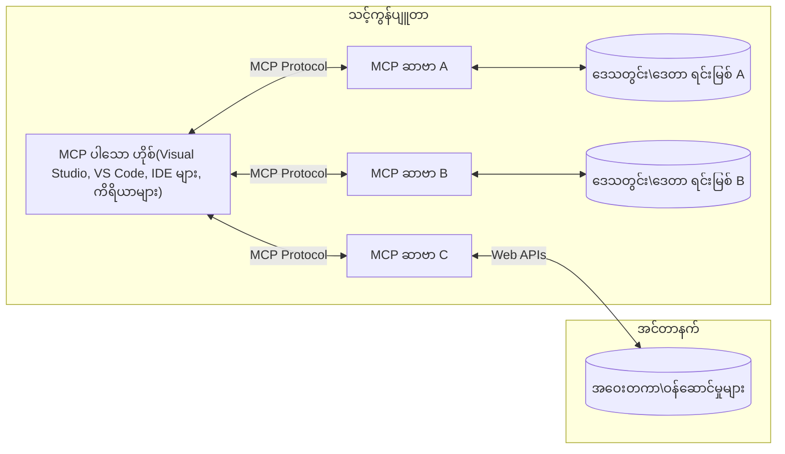

# MCP အဓိကအတွေးအခေါ်များ - AI ပေါင်းစည်းမှုအတွက် Model Context Protocol ကို ကျွမ်းကျင်စွာ သုံးရန်

[](https://youtu.be/earDzWGtE84)

_(ဤသင်ခန်းစာ ဗီဒီယိုကို ကြည့်ရန် အပေါ်တွင် ပုံကို နှိပ်ပါ)_

[Model Context Protocol (MCP)](https://github.com/modelcontextprotocol) သည် ကြီးမားသောဘာသာစကား မော်ဒယ်များ (LLMs) နှင့် အပြင် tools၊ applications နှင့် ဒေတာရင်းမြစ်များအကြား ဆက်သွယ်ရေးကို အာရုံစိုက်ကောင်းမွန်စွာ ဖော်ဆောင်ရန် အင်အားကြီးပြီး စံပြထားသော စနစ်ဖြစ်သည်။
ဤလမ်းညွှန်စာအုပ်သည် MCP ၏ အဓိကအတွေးအခေါ်များကို ခရီးလျှောက်သွားမှာဖြစ်ပြီး client-server architecture၊ အဓိကအဖွဲ့အစည်းများ၊ ဆက်သွယ်ရေးနည်းလမ်းများနှင့် တည်ဆောက်မှုဆိုင်ရာ အကောင်းဆုံးလေ့လာမှုများကို သင်ယူနိုင်မည်ဖြစ်သည်။

- **အသုံးပြုသူ ရှင်းလင်းသဘောတူညီချက်** - ဒေတာ ဝင်ရောက်ခြင်းနှင့် လုပ်ငန်းစဉ်များအားလုံးသည် အသုံးပြုသူ၏ ရှင်းလင်းသဘောတူညီချက် မရှိမဖြစ် လိုအပ်သည်။ အသုံးပြုသူများကို မည်သည့်ဒေတာများ ဝင်ရောက်မည်၊ မည်သည့်လုပ်ဆောင်ချက်များ ပြုလုပ်မည်ကို ဂရမ်ဂျူလာ ထိန်းချုပ်ခွင့်နှင့် ခွင့်ပြုချက်များနှင့် အတူ ရှင်းလင်းမြင်သာစေရမည်။

- **ဒေတာကိုယ်ရေးလုံခြုံရေးကာကွယ်မှု** - အသုံးပြုသူ ဒေတာသည် ရှင်းလင်း သဘောတူနည်းဖြင့်သာ ဖော်ပြမည် ဖြစ်ပြီး လုံးဝ လုံခြုံရေး ထိန်းချုပ်မှုများဖြင့် တာဝန်ယူ ကာကွယ်ထားရမည်။ မသင့်တော်သော ဒေတာ ပေးပို့မှု မဖြစ်စေရန် ဆောင်ရွက်ရမည်။

- **စက်ကိရိယာ လုံခြုံမှု အသုံးပြုမှု** - စက်ကိရိယာ တစ်ခုချင်း စီအတွက်လည်း အသုံးပြုသူ၏ ရှင်းလင်း သဘောတူမှု မရှိမဖြစ် လိုအပ်ပြီး စက်ကိရိယာ၏ လုပ်ဆောင်ချက်များ၊ ပါရာမီတာများနှင့် သက်ရောက်မှု ဖြစ်နိုင်ချေများကို ရှင်းလင်း သဘောတူရာမှာ ဖြစ်ရမည်။ တရားမကျသော၊ မလုံခြုံသော သို့မဟုတ် တွန်းအားမလိုအပ်သော စက်ကိရိယာ အလုပ်လုပ်မှု မဖြစ်စေရန်တွင် ဟန်ချက်ညီ လုံခြုံရေး နယ်မြေများ ကိုယ်တိုင် တားဆီးရမည်။

- **သယ်ယူပို့ဆောင်ရေး အလွှာ လုံခြုံမှု** - ဆက်သွယ်ရေး ချန်နယ်အားလုံးတွင် သင့်တော်သည့် သင်္ကေတ encryption နှင့် လက်မှတ်စနစ်များ အသုံးပြုရန်လိုအပ်သည်။ ဝေးလံသော ချိတ်ဆက်မှုများတွင် လုံခြုံသယ်ယူပို့ဆောင်ရေး စနစ်များနှင့် မှန်ကန်သော အတည်ပြုမှုစီမံခန့်ခွဲမှုများ ကို အသုံးပြုရမည်။

#### တည်ဆောက်စပ်ဆက်မှု လမ်းညွှန်ချက်များ

- **ခွင့်ပြုချက် စီမံခန့်ခွဲမှု** - အသုံးပြုသူများကို ဆာဗာများ၊ စက်ကိရိယာများနှင့် အရင်းအမြစ်များ အသုံးပြုခွင့်ကို သန့်စင်သော ခွင့်ပြုချက် စနစ်ဖြင့် ထိန်းချုပ်ခွင့်ပြုသည်။
- **အတည်ပြုမှုနှင့် ခွင့်ပြုမှု** - လုံခြုံသော အတည်ပြုမှုနည်းလမ်းများ (OAuth၊ API key) အသုံးပြု၍ မှန်ကန်သော token စီမံခန့်ခွဲမှုနှင့် သက်တမ်းကုန်ဆုံးမှုကို ခံယူရန်။
- **အချက်အလက် စစ်ဆေးခြင်း** - ပုံသေ schemas အတိုင်း ပါရာမီတာများ၊ ဒေတာများအား အနုညာတသက်ရောက်မှု မဖြစ်စေရန် သေချာစစ်ဆေးရန်။
- **စာရင်းပြုစုခြင်း** - လုံခြုံရေးစောင့်ကြည့်မှုနှင့် လိုက်လံမှုအတွက် လုပ်ငန်းဆောင်တာအားလုံး၏ စာရင်းများကို စနစ်တကျ တွဲဖက်ထားရန်။

## ကိုယ်တိုင်ကြည့်ရှုခြင်း

ဤသင်ခန်းစာတွင် Model Context Protocol (MCP) ပတ်ဝန်းကျင်၌ လုပ်ဆောင်မှုအခြေခံ သဘောတရားများနှင့် အဖွဲ့အစည်းများ ကိုလေ့လာမည်ဖြစ်သည်။ သင်သည် MCP သုံးစွဲမှု၏ client-server architecture၊ အဓိက အဖွဲ့အစည်းများနှင့် ဆက်သွယ်ရေးနည်းလမ်းများကို သိရှိလာမည်။

## သင်ယူရန် အဓိကအကြောင်းအရာများ

ဤသင်ခန်းစာ၏အဆုံးတွင် သင်သည် -

- MCP client-server architecture ကို နားလည်မည်။
- Hosts, Clients, Servers ၏ တာဝန်များကိုဖော်ထုတ်နိုင်မည်။
- MCP ၏ ပြောင်းလဲမှုနှင့် ပေါင်းစည်းသည့် အလွယ်တကူလုပ်ဆောင်မှု အင်္ဂါရပ်များကို ခွဲခြမ်းသုံးသပ်ရန်။
- MCP ပတ်ဝန်းကျင် ကျယ်ပြန့်သည့် သတင်းအချက်အလက်များ မည်သို့ လှုပ်ရှားသောကြောင်း သဘောပေါက်ရန်။
- .NET၊ Java၊ Python နှင့် JavaScript ၌ ကုဒ်နမူနာများမှတဆင့် လက်တွေ့ အမြင်များ ရရှိရန်။

## MCP Architecture - နက်ရှိုင်းစွာ ကြည့်ရှုခြင်း

MCP ပတ်ဝန်းကျင်သည် client-server မော်ဒယ်ပေါ်တွင် တည်ဆောက်ထားသည်။ ဤအပိုင်းက AI အမျိုးအစား applications များကို tools၊ database, API များနှင့် သက်ဆိုင်ရာ အရင်းအမြစ်များနှင့် ထိထိရောက်ရောက် ဆက်သွယ်နိုင်အောင် ဖွဲ့စည်းထားသည့် module အမျိုးအစား ဖြစ်သည်။ MCP Architecture ၏ အဓိကအဖွဲ့အစည်းများကို ဆွဲထုတ်ကြည့်မည်။

အခြေခံအားဖြင့် MCP သည် client-server architecture ကို လိုက်နာပြီး host application မှ ဆာဗာများစွာ နှင့် ချိတ်ဆက်နိုင်သည်။


```mermaid
flowchart LR
    subgraph "သင့်ကွန်ပျူတာ"
        Host["MCP ပါသော ဟိုစ်(Visual Studio, VS Code, IDE များ, ကိရိယာများ)"]
        S1["MCP ဆာဗာ A"]
        S2["MCP ဆာဗာ B"]
        S3["MCP ဆာဗာ C"]
        Host <-->|"MCP Protocol"| S1
        Host <-->|"MCP Protocol"| S2
        Host <-->|"MCP Protocol"| S3
        S1 <--> D1[("ဒေသတွင်း\ဒေတာ ရင်းမြစ် A")]
        S2 <--> D2[("ဒေသတွင်း\ဒေတာ ရင်းမြစ် B")]
    end
    subgraph " အင်တာနက်"
        S3 <-->|"Web APIs"| D3[("အဝေးတကာ\ဝန်ဆောင်မှုများ")]
    end
```
- **MCP Hosts**: VSCode, Claude Desktop, IDE များ၊ MCP မှတဆင့် ဒေတာ ဝင်ရောက်လိုသော AI Tools များ
- **MCP Clients**: ဆာဗာနှင့် 1:1 ချိတ်ဆက်ထားသော protocol clients
- **MCP Servers**: ထိပ်တန်း Model Context Protocol ဖြင့် သတ်မှတ်ထားသော လုပ်ဆောင်ချက်များကို ဖော်ပြသော software များ
- **ဒေသတွင်း ဒေတာရင်းမြစ်များ**: MCP servers များ အကောင်အထည်ဖော်၍ လုံခြုံစိတ်ချရသော မိမိကွန်ပျူတာဖိုင်များ၊ ဒေတာဘေ့စ်များနှင့် ဝန်ဆောင်မှုများ
- **ဝေးလံသော ဝန်ဆောင်မှုများ**: MCP servers များမှ API များ အားဖြင့် ချိတ်ဆက်နိုင်သည့် အင်တာနက်တစ်လွှားရှိ အပြင်ပေါ် စနစ်များ။

MCP Protocol သည် ရက်စွဲအခြေပြု ဗားရှင်းကာလဆက်တိုက် (YYYY-MM-DD ပုံစံ) ကို အသုံးပြုသော တိုးတက်နေသော စံစနစ်ဖြစ်သည်။ ယခု protocol ဗားရှင်းမှာ **2025-11-25** ဖြစ်သည်။ [protocol specification](https://modelcontextprotocol.io/specification/2025-11-25/) တွင် နောက်ဆုံးပေါ် အပ်ဒိတ်များကို ကြည့်ရှုနိုင်သည်။

### 1. Hosts

Model Context Protocol (MCP) တွင် **Hosts** ဆိုသည်မှာ protocol နှင့် အသုံးပြုသူများ ထိတွေ့ဆက်ဆံရာ အဓိက အင်တာဖေ့စ် အပါအဝင် AI applications များဖြစ်သည်။ Hosts များသည် MCP servers များစွာနှင့် ချိတ်ဆက်ရန် dedicated MCP clients များ ဖန်တီးကာ ဆက်သွယ်မှုကို စီမံခန့်ခွဲသည်။ Hosts အဖြစ် ဥပမာများမှာ -

- **AI Applications**: Claude Desktop, Visual Studio Code, Claude Code
- **ဖွံ့ဖြိုးရေး ပတ်ဝန်းကျင်များ**: MCP တွဲဖက်ထားသော IDE များနှင့် ကုဒ်編editors
- **စိတ်ကြိုက် Applications**: သီးသန့် AI agents နှင့် tools များ

**Hosts** သည် AI မော်ဒယ်ဖွံ့ဖြိုးမှုကို ဦးဆောင်ညှိနှိုင်းသည့် Applications ဖြစ်သည်။ ၎င်းတို့သည် -

- **AI မော်ဒယ်များကို အဆက်အသွယ် ပေးဆောင်ခြင်း** - LLMs နှင့် အပြန်အလှန် ဆက်သွယ်ကာ တုံ့ပြန်ချက် ထုတ်ပေးခြင်းနှင့် AI လုပ်ငန်းစဉ်များ ဦးဆောင်ညှိနှိုင်းခြင်း။
- **Client ချိတ်ဆက်မှုစီမံခန့်ခွဲမှု** - MCP server တစ်ခုစီ အတွက် MCP client တစ်ခု လုပ်ဆောင်ခြင်းနှင့် ထိန်းသိမ်းခြင်း။
- **အသုံးပြုသူ အင်တာဖေ့စ် ထိန်းချုပ်မှု** - ဆွေးနွေးမှုစီးဆင်းမှု၊ အသုံးပြုသူ ဆက်သွယ်မှုများနှင့် တုံ့ပြန်မှု ဖော်ပြချက်များ ကို ကိုင်တွယ်မည်။
- **လုံခြုံရေး တိုးတက်မှု ဆောင်ရွက်ခြင်း** - ခွင့်ပြုချက်များ၊ လုံခြုံရေးကန့်သတ်ချက်များ၊ အတည်ပြုမှုများ ကြီးကြပ်ခြင်း။
- **အသုံးပြုသူ သဘောတူမှု ကိုင်တွယ်မှု** - ဒေတာမျှဝေမှုနှင့် စက်ကိရိယာ ပြုလုပ်မှုအတွက် အသုံးပြုသူ ခွင့်ပြုချက် ကို စီမံခြင်း။

### 2. Clients

**Clients** ဆိုသည်မှာ Hosts နှင့် MCP servers ၏ တစ်ခုချင်းဆက်သွယ်မှု ချိတ်ဆက်ထားသော အရေးကြီး အဖွဲ့အစည်းများဖြစ်သည်။ MCP client တစ်ခုစီကို Host မှ တည်ဆောက်ကာ သတ်မှတ်ထားသော MCP server တစ်ခုနှင့် ချိတ်ဆက်ထားသည်။ Clients များစွာရှိခြင်းက Hosts ၌ servers များစွာနှင့် တပြိုင်နက် ချိတ်ဆက်ရန် ခွင့်ပြုသည်။

**Clients** သည် host application အတွင်း ချိတ်ဆက်မှု အစိတ်အပိုင်းများဖြစ်သည်။ ၎င်းတို့သည် -

- **protocol ဆက်သွယ်ရေး** - JSON-RPC 2.0 တောင်းဆိုမှုများကို servers များသို့ ပို့ဆောင်ကာ လမ်းညွှန်ချက်များ ထည့်သွင်းပေးရန်။
- **စွမ်းရည်ညှိနှိုင်းမှု** - စာရွက်များနှင့် protocol ဗားရှင်းများကို စတင်ချိန်းဆိုမှုအချိန်တွင် servers နှင့်ညှိနှိုင်းခြင်း။
- **စက်ကိရိယာ အလုပ်လုပ်မှု စီမံခြင်း** - မော်ဒယ်များမှ စက်ကိရိယာ ဖြစ်ဆောင်ချက်များ တောင်းဆိုမှုများ ကို ထိန်းသိမ်းဆောင်ရွက်ခြင်း။
- **အချိန်နှင့်ကိုက်ညီသော အပ်ဒိတ်များ ကိုင်တွယ်မှု** - ဆာဗာများမှ အချက်အလက်အသစ်များနှင့် သတိပေးချက်များ ကို စီမံဆောင်ရွက်ခြင်း။
- **တုံ့ပြန်ချက် ကိုင်တွယ်မှု** - ဆာဗာ ချုံလောက်ချက်များကို ခေတ်မှီထားပြီး အသုံးပြုသူများအား ဖော်ပြရန် ပြင်ဆင်ခြင်း။

### 3. Servers

**Servers** သည် MCP clients များကို ကိုယ်စားပြု စက်ကိရိယာများ၊ တည်နေရာများနှင့် လုပ်ဆောင်မှုများ ပေးဆောင်ကြသည်။ ၎င်းတို့သည် ဒေသတွင်း (host ရှိ စက်ပစ္စည်းပေါ်) သို့မဟုတ် ဝေးလံသော (ပြင်ပ ကွန်ပျူတာပလက်ဖောင်းပေါ်) အနေဖြင့် တည်ဆောက်၍ client များ၏ တောင်းဆိုမှုများကို လက်ခံ ဆောင်ရွက်ပေးကာ ဖော်ပြချက်များ သာမန် စနစ်တကျ ထုတ်ပေးသည်။ Servers သည် standard Model Context Protocol အရ သတ်မှတ်ထားသည့် လုပ်ဆောင်နိုင်စွမ်းများကို ဖော်ပြသည်။

**Servers** သည် ကြောင်းနှင့် လုပ်ဆောင်ချက်များ ပေးဆောင်သော ဝန်ဆောင်မှုများဖြစ်သည်။ ၎င်းတို့သည် -

- **အင်္ဂါရပ် မှတ်ပုံတင်ခြင်း** - client များအတွက် ရရှိနိုင်သော primitive များ (အရင်းအမြစ်များ၊ prompt များ၊ စက်ကိရိယာများ) ကို မှတ်ပုံတင်၍ ဖော်ပြခြင်း။
- **တောင်းဆိုချက် ဆောင်ရွက်ခြင်း** - client များမှ စက်ကိရိယာခေါ်ယူမှု၊ အရင်းအမြစ်တောင်းဆိုမှု၊ prompt တောင်းဆိုမှုများ လက်ခံဆောင်ရွက်ခြင်း။
- **ကြောင်းပေးခြင်း** - မော်ဒယ်တုံ့ပြန်ချက် တိုးတက်စေရန် အကြောင်းအရာနှင့် ဒေတာ ပေးအပ်ခြင်း။
- **အခြေအနေ စီမံခန့်ခွဲမှု** - အစည်းအဝေးအခြေအနေ ကို ထိန်းသိမ်းပြီး အခြေအနေမတည်မြဲသော ဆက်သွယ်မှုများကို ဖြေရှင်းခြင်း။
- **အချိန်နှင့် ကိုက်ညီသော သတိပေးချက်များ** - ချိတ်ဆက်ထားသူ clients များအား အင်္ဂါရပ် ပြောင်းလဲမှုများနှင့် အပ်ဒိတ်များ ပေးပို့ခြင်း။

Servers များကို မည်သူမဆို တည်ဆောက်၍ model စွမ်းရည်များကို အထူးပြု လုပ်ဆောင်ချက်များဖြင့် လေးစားနိုင်ပြီး ဒေသတွင်းနှင့် ဝေးလံထားရာ သတ်မှတ်ချက်များ နှစ်မျိုးလုံးကို ထောက်ပံ့ပါသည်။

### 4. Server Primitives

Model Context Protocol (MCP) တွင် servers များသည် clients, hosts နှင့် ဘာသာစကား မော်ဒယ်များအကြား စုံလင်သော ဆက်သွယ်မှုအတွက် အခြေခံ ဆောက်လုပ်ပစ္စည်းဖြစ်သော **primitives** သုံးမျိုးကို ပေးဆောင်သည်။ ထို primitives များသည် protocol ဖြင့် ရရှိနိုင်သော အကြောင်းအရာနှင့် လုပ်ဆောင်ချက် များ အမျိုးအစားများကို သတ်မှတ်ပေးသည်။

MCP servers များသည် အောက်ပါ primitives သုံးမျိုးအနက် တစ်ခုသို့ ပေါင်းစပ်၍ ဖော်ပြနိုင်သည် -

#### Resources

**Resources** ဆိုသည်မှာ AI applications များအား မော်ဒယ် နားလည်မှုနှင့် ဆုံးဖြတ်ချက် အတွက် အသုံးပြုနိုင်သည့် အကြောင်းအရာ ရင်းမြစ်များဖြစ်သည်။ ၎င်းတို့မှာ မှတ်ထားသော ဒေတာ သို့မဟုတ် ပြောင်းလဲနိုင်သော အကြောင်းအရာ ဖြစ်နိုင်သည်။

- **အကြောင်းအရာ ဒေတာ** - AI မော်ဒယ်များ စားသုံးရန် ဖွဲ့စည်းထားသော သတင်းအချက်အလက်များ
- **သိက္ခာအခြေအနေ စနစ်များ** - စာရွက်တိုက်များ၊ ဆောင်းပါးများ၊ လက်စွဲစာအုပ်များ နှင့် သုတေသနစာတမ်းများ
- **ဒေသတွင်း ဒေတာရင်းမြစ်များ** - ဖိုင်များ၊ ဒေတာဘေ့စ်များ နှင့် ဒေသတွင်း စနစ် သတင်းအချက်အလက်များ
- **ပြင်ပ ဒေတာ** - API တုံ့ပြန်ချက်များ၊ ဝက်ဘ်ဝန်ဆောင်မှုများ၊ ဝေးလံသော စနစ်ဒေတာများ
- **ပြောင်းလဲမှုရှိသော အကြောင်းအရာများ** - ပြင်ပ အခြေအနေများအပေါ် မူတည်၍ အချိန်နှင့်ကိုက်ညီအပ်ဒိတ်များ

Resources များကို URI များဖြင့် ဖော်ထုတ်ပြီး `resources/list` ဖြင့် ရှာဖွေကာ `resources/read` ဖြင့် ဖတ်ယူနိုင်သည်။

```text
file://documents/project-spec.md
database://production/users/schema
api://weather/current
```

#### Prompts

**Prompts** သည် ဘာသာစကား မော်ဒယ်များနှင့် ဆက်သွယ်မှုကို ဖွဲ့စည်းရန် အသုံးပြုနိုင်သည့် ပြန်လည် အသုံးပြုနိုင်သော နမူနာများဖြစ်သည်။ ၎င်းတို့သည် စနစ်တကျ ပြုလုပ်ထားသော စကားဝိုင်းနှင့် စိတ်ကြိုက် Workflow များကို ဖြည့်ဆည်းပေးသည်။

- **နမူနာအခြေပြု ဆက်သွယ်မှု** - ကြိုတင် ဖွဲ့စည်းထားသော စာပို့ခြင်းများနှင့် စကားဝိုင်း စတင်မှုများ
- **Workflow Template များ** - ပုံမှန် လုပ်ငန်းများအတွက် စနစ်တကျ သတ်မှတ်ထားသော အဆင့်စပ်စဉ်များ
- **နမူနာ အခြေခံ သင်ခန်းစာများ** - မော်ဒယ် လမ်းညွှန်ချက် ပေးရန် နမူနာများ
- **စနစ် Prompt များ** - မော်ဒယ် အပြုအမူနှင့် အကြောင်းအရာ သတ်မှတ်မှုများ
- **ပြောင်းလဲနိုင်သော Template များ** - အခြေအနေ အလိုက် ချိန်ညှိနိုင်သော parameter များပါသော prompts

Prompts များသည် အစားထိုး ပြောင်းလဲနိုင်ပြီး `prompts/list` ဖြင့် ရှာဖွေကာ `prompts/get` ဖြင့် ဖတ်ရှုနိုင်သည်။

```markdown
Generate a {{task_type}} for {{product}} targeting {{audience}} with the following requirements: {{requirements}}
```

#### Tools

**Tools** သည် AI မော်ဒယ်များမှ ဖေါ်ပြချက်တစ်ခုကို ဆောင်ရွက်ရန် ခေါ်ယူနိုင်သော လုပ်ဆောင်နိုင်သော function များဖြစ်သည်။ MCP ပတ်ဝန်းကျင်တွင် ကိန်းစာ သတ္တိ(verbs) အဖြစ် တည်ရှိသည်။ ၎င်းတို့သည် မော်ဒယ်များကို ပြင်ပစနစ်များနှင့် ဆက်သွယ်နိုင်စေသည်။

- **အလုပ်လုပ်နိုင်သော function များ** - ဆာဗာများ သတ်မှတ်သော parameter များဖြင့် မော်ဒယ်များက ခေါ်ယူနိုင်သော လုပ်ဆောင်မှုများ
- **ပြင်ပစနစ် ပေါင်းစည်းမှု** - API ခေါ်ဆိုမှုများ၊ ဒေတာ Queries များ၊ ဖိုင် လုပ်ဆောင်ချက်များ၊ တွက်ချက်မှုများ
- **ထူးခြား လုပ်ဆောင်မှုအမှတ်တံဆိပ်** - အသေးစိတ် အမည်၊ ဖော်ပြချက်နှင့် ပါရာမီတာ schema များရှိသည်
- **ဖွဲ့စည်းတည်ဆောက်သော I/O** - Tools များသည် စိစစ်ထားသော ပါရာမီတာများ လက်ခံကာ ဖွဲ့စည်းစနစ်ပါသော ပုံစံနိုင်သော တုံ့ပြန်ချက်များ ပြန်ပေးသည်
- **လှုပ်ရှားမှု အင်္ဂါရပ်များ** - မော်ဒယ်များအား ပါရဂူ အလုပ်များ ပြုလုပ်ရန်နှင့် တိုက်ရိုက် ဒေတာ ဆွဲယူရန် ခွင့်ပြုသည်။

Tools များကို JSON Schema ဖြင့် parameter စိစစ်မှု ပြုလုပ်၍ `tools/list` ဖြင့် ရှာဖွေနိုင်ပြီး `tools/call` အသုံးပြု၍ ခေါ်ယူနိုင်သည်။ Tool များသည် ဒါရိုက်ရာကိုပိုမို ကောင်းမွန်စေရန် **icon** များ ပါရှိနိုင်သည်။

**Tool Annotations** - Tools များတွင် optional annotations (ဥပမာ `readOnlyHint`, `destructiveHint`) ပါဝင်၍ tool ၏ သက်ရောက်မှုကို ဖော်ပြကာ client များအား tool အသုံးပြုမည့် ဆုံးဖြတ်ချက်များမှာ သေချာစေရန် ကူညီသည်။

Tool နမူနာ ဖော်ပြချက်တစ်ခု  -

```typescript
server.tool(
  "search_products", 
  {
    query: z.string().describe("Search query for products"),
    category: z.string().optional().describe("Product category filter"),
    max_results: z.number().default(10).describe("Maximum results to return")
  }, 
  async (params) => {
    // သွင်းယူရှာဖွေရေး ပြုလုပ်ပြီး ညွှန်အပ်ပုံစံ နောက်ထပ်ရလဒ်များ ပြန်ပေးပါ။
    return await productService.search(params);
  }
);
```

## Client Primitives

Model Context Protocol (MCP) တွင် **clients** များသည် servers များမှ host application အထိ ပိုမိုစွမ်းဆောင်ရည်များကို တောင်းဆိုနိုင်ရန် primitives များ ဖော်ပြနိုင်ပါသည်။ ဤ client အပေါ်က primitives များသည် servers များကို လိုအပ်သော AI မော်ဒယ် စွမ်းဆောင်ရည်များနှင့် အသုံးပြုသူ ဆက်သွယ်မှုများကို ပိုမိုကောင်းမွန်စွာ အသုံးပြုခွင့် ပေးသည်။

### Sampling

**Sampling** သည် servers များအား clients ၏ AI application မှ ဘာသာစကားမော်ဒယ် ဖြည့်စွက်မှုများ တောင်းဆိုခွင့် ပေးသော primitive တစ်ခုဖြစ်သည်။  ဤ primitive သည် servers များကို မိမိတို့၏ မော်ဒယ် မပါဝင်ဘဲ LLM စွမ်းရည်များ သုံးခွင့် ပေးသည်။

- **မော်ဒယ် အခြေမထားသော ဝင်ကြေးချုပ်ခြင်း** - servers များသည် LLM SDK မထည့်စရာမလိုဘဲ မော်ဒယ်၏ ဖြည့်စွက်ချက်များ တောင်းဆိုခွင့် ရရှိသည်
- **server မှ စတင်သော AI** - servers များသည် clients ၏ AI မော်ဒယ် အသုံးပြုကာ လွတ်လပ်စွာ အကြောင်းအရာ ဖန်တီးနိုင်ခြင်း
- **recursive LLM ဆက်သွယ်မှုများ** - servers များသည် AI ကူညီမှု ပြုလုပ်ရန် ခက်ခဲသော နေရာများတွင် AI အကူအညီ လိုအပ်သော နည်းလမ်းများကို ပံ့ပိုးသည်
- **အချိန်နှင့် ကိုက်ညီသောအကြောင်းအရာ ဖန်တီးမှု** - servers များသည် host ၏ မော်ဒယ်ကို အသုံးပြုကာ အကြောင်းအရာ အပြန်အလှန်ဖြေဆိုမှုများ ဖန်တီးနိုင်သည်
- **Tool ခေါ်ယူမှု ပံ့ပိုးမှု** - servers များသည် `tools` နှင့် `toolChoice` ပါရာမီတာများ ထည့်သွင်းကာ sampling အတွင်း client မော်ဒယ်မှ tools များကို ခေါ်ယူခွင့် ရရှိစေသည်

Sampling ကို `sampling/complete` method ဖြင့် စတင်ကာ servers များမှ client များသို့ ဖြည့်စွက်ချက်များ တောင်းဆိုသည်။

### Roots

**Roots** သည် clients များမှ servers များကို ဖိုင်စနစ် နယ်နိမိတ်များ ပေးပို့နိုင်ရန် စံလိုက်နည်းလမ်းဖြစ်သည်။ ဤ Roots သည် servers မည်သည့် ဖိုလ်ဒါနှင့် ဖိုင်များတွင် ပိုင်ခွင့်ရှိသည်ကို နားလည်နိုင်စေသည်။

- **ဖိုင်စနစ် နယ်နိမိတ်များ** - servers များ တည်ဆောက်နေနိုင်သည့် ဖိုင်စနစ် နယ်နိမိတ်များသတ်မှတ်ချက်
- **အသုံးပြုခွင့် ထိန်းချုပ်မှု** - servers မည်သည့် ဖိုလ်ဒါများနှင့် ဖိုင်များ အသုံးပြုခွင့် ရှိသည်ကို နားလည်စေရန် ပံ့ပိုးမှု၊
- **အချိန်နှင့် ကိုက်ညီသော အပ်ဒိတ်များ** - Roots ပြောင်းလဲသောအခါ clients များမှ servers များကို သတိပေးနိုင်ခြင်း
- **URI ဖြင့် အသိအမှတ်ပြုခြင်း** - Roots များတွင် `file://` URI များကို အသုံးပြုပြီး သတ်မှတ်ထားသည်။

Roots များကို `roots/list` များဖြင့် ရှာဖွေကာ clients များမှ `notifications/roots/list_changed` ဖြင့် Roots မပြောင်းလဲသောအခါ ထုတ်သတင်းပေးသည်။

### Elicitation

**Elicitation** သည် servers များအနေဖြင့် client ၏ အင်တာဖေ့စ်မှတဆင့် အသုံးပြုသူများထံ ထပ်မံသတင်းအချက်အလက် သို့မဟုတ် အတည်ပြုချက် တောင်းခံနိုင်ခြင်း ဖြစ်သည်။

- **အသုံးပြုသူ အချက်အလက် တောင်းဆိုမှု** - tool လုပ်ဆောင်ရန် လိုအပ်သော ပိုမိုသော သတင်းအချက်အလက် များ တောင်းနိုင်ခြင်း
- **အတည်ပြုချက် ပြသမှုများ** - မတော်တဆ ဖြစ်ရပ်ကြီးမားမှုများအတွက် အသုံးပြုသူ သဘောတူညီချက် တောင်းနိုင်ခြင်း
- **အပြန်အလှန် ဆက်သွယ်မှုများ** - လိုအပ်သလို အဆင့်လိုက် အသုံးပြုသူ ဆက်သွယ်မှုများ ဖန်တီးနိုင်ခြင်း
- **ပြောင်းလဲနိုင်သော ပါရာမီတာ စုစည်းမှု** - စက်ကိရိယာအလုပ်ဆောင်မှုအတွင်း လိုအပ်သော်လည်း ပျက်ကွက်နေသော သို့မဟုတ် ရွေးချယ်မှု ပါရာမီတာ များ ကောက်ယူခြင်း

Elicitation တောင်းဆိုမှုများကို `elicitation/request` 方法ဖြင့် အသုံးပြုသူ အင်တာဖေ့စ်မှတဆင့် စုဆောင်းသည်။

**URL Mode Elicitation**: servers များသည် URL အခြေပြု အသုံးပြုသူ ဆက်သွယ်မှုများကိုလည်း တောင်းဆိုနိုင်ပြီး ရှေ့ပြေး ဝက်ဘ်စာမျက်နှာများသို့ အသုံးပြုသူများအား လမ်းညွှန်ပြီး အတည်ပြုပြုလုပ်ရန်၊ အချက်အလက်ထည့်သွင်းရန် အသုံးပြုစေသည်။

### Logging

**Logging** သည် servers များမှ clients များသို့ error တွေ့ရှိမှုများ၊ မှတ်တမ်းများ၊ လုပ်ငန်းအခြေအနေများ အကြောင်း မြင်သာအောင် log ပို့ရန်ဖြစ်သည်။

- **debugging အထောက်အကူပြုခြင်း** - troubleshooting ရေးအတွက် အသေးစိတ် ထိန်းသိမ်းမှု log များ ပေးစွမ်းခြင်း
- **လုပ်ဆောင်မှု မျက်မြင်မှုပေးခြင်း** - အခြေအနေ ပြောင်းလဲမှုများနှင့် ကြာမြင့်ချိန် သတင်းအချက်အလက်များ ပေးပို့ခြင်း
- **အမှား အချက်အလက်များ ပို့ခြင်း** - error နှင့် diagnostic သတင်းအချက်အလက် များ ပေးပို့ခြင်း
- **စာရင်းစစ် မျက်နှာပြင်** - server လုပ်ဆောင်ချက်များ နှင့် ဆုံးဖြတ်ချက် များ၏ လုံးလုံးလုံးရှင်း စာရင်းထားမှုဖန်တီးခြင်း

Logging message များသည် servers ၏ လုပ်ငန်းဆောင်တာများတွင် အမြင်ပြုမှုနှင့် debugging ချမှတ်မှုအတွက် clients ထံ ပေးပို့ခြင်း ဖြစ်သည်။

## MCP တွင် သတင်းအချက်အလက် ညှိနှိုင်းမှုလမ်းကြောင်း

Model Context Protocol (MCP) သည် hosts, clients, servers နှင့် မော်ဒယ်များကြား ဖြန့်ဖြူးသည့် သတင်းအချက်အလက် လမ်းကြောင်း တစ်ခုကို သတ်မှတ်သည်။ ဤလမ်းကြောင်း ကို နားလည်ခြင်းဖြင့် အသုံးပြုသူ တောင်းဆိုမှုများ မည်သို့ ဆက်လုပ်ပြီး မော်ဒယ် တုံ့ပြန်ချက်များတွင် ပြင်ပ tools နှင့် ဒေတာများ မည်သို့ ပေါင်းစည်းထားသည်ကို ပိုမိုရှင်းလင်းစေသည်။
- **ဧည့်သည်က ချိတ်ဆက်မှု စတင်သည်**  
  ဧည့်သည် အက်ပလီကေးရှင်း (IDE သို့မဟုတ် chat interface ကဲ့သို့) မှ MCP ဆာဗာသို့ ချိတ်ဆက်မှုတစ်ခုကို စတင်တည်ဆောက်သည်၊ ပုံမှန်အားဖြင့် STDIO၊ WebSocket သို့မဟုတ် အခြား ထောက်ခံသော သယ်ယူပို့ဆောင်မှုများမှ ဖြစ်သည်။

- **စွမ်းရည် ဆွေးနွေးခြင်း**  
  ဧည့်သည်ထဲတွင် သွင်းထားသော client နှင့် ဆာဗာသည် ၎င်းတို့ ထောက်ခံသော လက္ခဏာများ၊ ကိရိယာများ၊ အရင်းအမြစ်များနှင့် ပရိုတိုကော ဗားရှင်းများအကြောင်း အချက်အလက်များကို လဲလှယ်ဆွေးနွေးကြသည်။ ၎င်းသည် နှစ်ဖက်စလုံး သဘောပေါက်နိုင်စေပြီး ဆက်ဆံမှုအတွက် ရနိုင်သော စွမ်းရည်များကို နားလည်နိုင်စေရန် ဖြစ်သည်။

- **အသုံးပြုသူ တောင်းဆိုချက်**  
  အသုံးပြုသူသည် ဧည့်သည်နှင့် အပြန်အလှန်လုပ်ဆောင်သည် (ဥပမာ၊ prompt သို့မဟုတ် command ရိုက်ထည့်ခြင်း)။ ဧည့်သည်သည် ဤအချက်အလက်ကို စုဆောင်းပြီး client ကို လုပ်ငန်းစဉ်ဆောင်ရွက်ရန် ပေးပို့သည်။

- **အရင်းအမြစ် သို့မဟုတ် ကိရိယာ အသုံးပြုမှု**  
  - Client မှ ဆာဗာထံမှ ပိုမိုသော သဘောတူအကြောင်းအရာ သို့မဟုတ် အရင်းအမြစ်များ (ဖိုင်များ၊ ဒေတာဘေ့စ် အချက်အလက်များ သို့မဟုတ် သိမြင်ကောင်းကျိုး အခြေခံဆောင်းပါးများကဲ့သို့) တောင်းဆိုနိုင်ပြီး မော်ဒယ်၏ နားလည်မှုကို မြှင့်တင်သည်။  
  - မော်ဒယ်သည် ကိရိယာတစ်ခုလိုအပ်သည်ဟု ဆုံးဖြတ်ပါက (ဥပမာ၊ ဒေတာဆောင်ရွက်ခြင်း၊ တိုင်းတာမှု လုပ်ဆောင်ခြင်း သို့မဟုတ် API ကို ခေါ်ယူခြင်း), client သည် ကိရိယာအသုံးပြုသော တောင်းဆိုချက်ကို ဆာဗာထံ ပေးပို့ပြီး ကိရိယာနာမည်နှင့် ပမာဏများကို ဖော်ပြသည်။

- **ဆာဗာ အကောင်အထည်ဖော်ခြင်း**  
  ဆာဗာသည် အရင်းအမြစ် သို့မဟုတ် ကိရိယာ တောင်းဆိုချက်ကို လက်ခံပြီး လိုအပ်သည့် လုပ်ဆောင်ချက်များ (လည်ပတ်မှု၊ ဒေတာဘေ့စ် စုံစမ်းမှု သို့မဟုတ် ဖိုင်ယူဆောင်မှု) ကို ဆောင်ရွက်ကာ ရလာဒ်များကို ဖွဲ့စည်းထားသည့် ပုံစံဖြင့် client ထံ ပြန်ပေးပို့သည်။

- **တုံ့ပြန်ချက် ထုတ်လွှင့်ခြင်း**  
  Client သည် ဆာဗာ၏ တုံ့ပြန်ချက်များ (အရင်းအမြစ် ဒေတာများ၊ ကိရိယာ ထွက်သောအရာများ နှင့် အခြား) ကို မော်ဒယ်၏ ဆက်လက်ပြောဆိုမှုထဲတွင် ထည့်သွင်းသည်။ မော်ဒယ်သည် ဤအချက်အလက်များကို အသုံးပြုကာ ပိုမိုကျယ်ပြန့်ပြီး အကြောင်းအရာကို သေချာနားလည်သော တုံ့ပြန်ချက် တစ်ရပ်ကို ဖန်တီးသည်။

- **ရလဒ် ဖော်ပြမှု**  
  ဧည့်သည်သည် client မှ နောက်ဆုံးရ output ကို လက်ခံပြီး အသုံးပြုသူထံ မော်ဒယ်ထုတ်ဖော်သော စာသားနှင့် ကိရိယာအကောင်အထည်ဖော်မှု သို့မဟုတ် အရင်းအမြစ် ရှာဖွေမှုမှ ရလဒ်များကို ထည့်သွင်း ပြသည်။

ဤ စီးဆင်းမှုသည် MCP ကို ပုံစံများအား အပြင်ကိရိယာများနှင့် ဒေတာအရင်းအမြစ်များနှင့် ချိတ်ဆက်ကာ တိုးတက် မြင့်မားသော၊ အပြန်အလှန်ပြောဆိုနိုင်သော၊ အကြောင်းအရာနားလည်မှုရှိသော AI အက်ပလီကေးရှင်းများကို ထောက်ပံ့နိုင်စေသည်။

## Protocol Architecture & Layers

MCP သည် ပေါင်းစပ်၍ စုစည်းထားသော ဆောက်လုပ်မှုအလွှာ နှစ်ခု မရှိမဖြစ်လိုအပ်သည်။

### ဒေတာ အလွှာ

**ဒေတာ အလွှာ** သည် MCP protocol အဓိကကို **JSON-RPC 2.0** ကို အခြေခံပြီး တည်ဆောက်ထားသည်။ ဤအလွှာတွင် စာတိုက်ပုံစံ၊ အဓိပ္ပာယ်နဲ့ အပြန်အလှန်ဆက်ဆံမှုပုံစံများ သတ်မှတ်ထားသည်-

#### အဓိကအစိတ္တျများ-

- **JSON-RPC 2.0 Protocol**: မက်ဆေ့ဂျ်များအားလုံးတွင် method call၊ တုံ့ပြန်ချက်နှင့် အသိပေးစာများအတွက် စံနှုန်း JSON-RPC 2.0 ပုံစံကို အသုံးပြုသည်  
- **အသက်တာစီမံခန့်ခွဲမှု**: client နှင့် ဆာဗာများအကြား ချိတ်ဆက်မှု စတင်ခြင်း၊ စွမ်းဆောင်ရည် ဆွေးနွေးခြင်းနှင့် အစည်းအဝေး ပိတ်သိမ်းခြင်းတို့ကို ကိုင်တွယ်သည်  
- **ဆာဗာ အခြေခံအစိတ်အပိုင်းများ**: ဆာဗာများက ကိရိယာများ၊ အရင်းအမြစ်များနှင့် prompt များမှတဆင့် အဓိက လုပ်ဆောင်ချက်များ ပေးနိုင်သည်  
- **Client အခြေခံအစိတ်အပိုင်းများ**: ဆာဗာများက LLM များမှ ရွေးချယ်မှု၊ အသုံးပြုသူ အသွင်ပြောင်းမှု တောင်းဆိုမှုနှင့် log စာရင်းပို့ရန် တောင်းဆိုနိုင်သည်  
- **အချိန်နှင့်တပြေးညီ အသိပေးချက်များ**: polling မလိုအပ်ပဲ ဒိုင်းနမစ် အပ်ဒိတ်များအတွက် asynchronous အသိပေးချက်များကို ထောက်ပံ့သည်  

#### အဓိက လက္ခဏာများ-

- **ပရိုတိုကော ဗားရှင်းဆွေးနွေးမှု**: တွေ့ဆုံပြီး ပြန်လည်သုံးသပ်နိုင်ဖို့ နှစ်ဖက်စလုံးအတွက် လက်ခံနိုင်သော နောက်ဆုံးရ ဗားရှင်း (YYYY-MM-DD) ကို သုံးသည်  
- **စွမ်းရည် ရှာဖွေမှု**: စတင်ချိန်တွင် client နှင့် ဆာဗာတို့သည် ထောက်ခံသော လက္ခဏာများအကြောင်း အချက်အလက်များကို လဲလှယ်ကြသည်  
- **အစိတ်အပိုင်းနဲ့ တက်သစ်စွာ ဆက်သွယ်မှု**: လွယ်ကူစေရန် ဘက်စုံ ဆက်သွယ်မှု အခြေအနေကို ထိန်းသိမ်းသည်  

### သယ်ယူပို့ဆောင်မှု အလွှာ

**သယ်ယူပို့ဆောင်မှု အလွှာ** သည် MCP ပါဝင်သူများအကြား ဆက်သွယ်မှု ချန်နယ်များ၊ စာတိုက်ပြုပြင်မှုနှင့် အသိမခံခြင်းကို စီမံခန့်ခွဲသည်-

#### ထောက်ခံသော သယ်ယူပို့ဆောင်မှု မျိုးစုံ-

1. **STDIO သယ်ယူပို့ဆောင်မှု**  
   - တိုက်ရိုက်လုပ်ငန်းဆောင်တာအတွက် စံ input/output stream များကို အသုံးပြုသည်  
   - တဲ့ မက်ရှင်းတစ်ခုအတွင်း လုပ်ဆောင်ရာတွင် network ဝင်ပေါက်မရှိပဲ လုပ်နိုင်မှုအတွက် အကောင်းဆုံးဖြစ်သည်  
   - ဒေသစံ MCP ဆာဗာ အကောင်အထည်ဖော်မှုများအတွက် ပုံမှန်သုံးသည်

2. **Streamable HTTP သယ်ယူပို့ဆောင်မှု**  
   - client မှ ဆာဗာသို့ HTTP POST ကို အသုံးပြုသည်  
   - server မှ client သို့ streaming ပေးရန် Server-Sent Events (SSE) ကို ရွေးချယ်စွာ ထောက်ပံ့သည်  
   - network များ ထက်ဝေးနေသော ဆာဗာများ နှင့် ဆက်သွယ်ခွင့် စီမံခန့်ခွဲပေးသည်  
   - စံ HTTP authentication (bearer tokens, API key များ၊ အထူး headers များ) ကို အသုံးပြုသည်  
   - MCP သည် OAuth ကို ကာကွယ်မှုအတွက် အကြံပြုသည်  

#### သယ်ယူပို့ဆောင်မှု abstraction

သယ်ယူပို့ဆောင်မှုအလွှာသည် ဒေတာအလွှာထံမှ ဆက်သွယ်မှု အသေးစိတ်များကို သီးခြား ဖုံးကွယ်ထားကာ၊ JSON-RPC 2.0 မက်ဆေ့ဂျ်ပုံစံတစ်ခုတည်းကို သယ်ယူပို့ဆောင်မှုနည်းလမ်းအားလုံးတွင် အသုံးပြုနိုင်စေသည်။ ဤ abstraction သည် အက်ပလီကေးရှင်းများအား ဒေသတွင်း ဆာဗာနှင့် ဝေးလံသော ဆာဗာတို့အကြား လွယ်ကူစွာ ပြောင်းရွှေ့နိုင်စေသည်။

### လုံခြုံရေး စဉ်းစားချက်များ

MCP အကောင်အထည်ဖော်သူများသည် ဆက်သွယ်မှုလုပ်ငန်းစဉ်အားလုံးတွင် လုံခြုံမှု၊ ယုံကြည်မှုနှင့် လုံခြုံစိတ်ချရမှု ပြည့်စုံစွာ ထိန်းသိမ်းထားရန် အောက်ပါ အချက်အလက်များကို လိုက်နာရမည်-

- **အသုံးပြုသူ သဘောတူချက်နှင့် ထိန်းချုပ်မှု**  
  မည်သည့် ဒေတာကိုမဆို ပြုလုပ်မည့် လုပ်ငန်းများကိုမဆို အသုံးပြုသူ၏‌ တိတိကျကျ သဘောတူချက် ရရှိထားရန် လိုအပ်သည်။ အသုံးပြုသူများသည် မဖြန့်ဝေလိုသည့် ဒေတာနှင့် ခွင့်ပြုလိုသည့် လုပ်ဆောင်ချက်များကို သေချာ ထိန်းချုပ်နိုင်ရန် ရိုးရှင်းသည့် အသုံးပြုသူ မျက်နှာပြင်များ ကို ထောက်ပံ့ထားရမည်။

- **ဒေတာ ကိုယ်ရေးစောင့်ရှောက်မှု**  
  အသုံးပြုသူ၏ ဒေတာကို တိတိကျကျ သဘောတူချက် ရရှိပြီးမှသာ ဖော်ပြနိုင်ပြီး သပ်သပ်ခံ အစိုးရ နည်းလမ်းဖြင့် ကာကွယ်ထားရမည်။ MCP အကောင်အထည်ဖော်သူများသည် မလိုလားအပ်သော ဒေတာ ပေးပို့ခြင်းမှ ကာကွယ်ရန် နှင့် မည်သည့် ဆက်ဆံမှုမဆို ကိုယ်ရေးအချက်အလက် စောင့်ရှောက်မှုရရှိအောင် အာမခံရမည်။

- **ကိရိယာ လုံခြုံမှု**  
  မည်သည့် ကိရိယာကိုမဆို အသုံးပြုရန် မတိုင်မီ အသုံးပြုသူ၏ တိတိကျကျ သဘောတူချက် လိုအပ်သည်။ အသုံးပြုသူများကို ကိရိယာတစ်ခုချင်းစီ၏ လုပ်ဆောင်ချက်များကို နားလည်သိရှိစေပြီး မထာဝရနှင့် လုံခြုံမှုမရှိသော လုပ်ငန်းဆောင်တာများကို ဖြစ်ပေါ်စေခြင်းမှ ကာကွယ်ရန် အပြင်းအထန် လုံခြုံရေး အကန့်အသတ်များကို ထားရှိရမည်။

ဤ လုံခြုံရေးအခြေခံ စည်းကမ်းများကို လိုက်နာခြင်းဖြင့် MCP သည် အသုံးပြုသူ ယုံကြည်မှု၊ ကိုယ်ရေးလုံခြုံမှုနှင့် လုံခြုံမှုတို့ကို ဆက်သွယ်မှုနယ်ပယ်အားလုံးတွင် ထိန်းသိမ်းကာ စွမ်းအားမြင့် AI ပေါင်းစပ်ခြင်းများကို တည်ဆောက်နိုင်သည်။

## ကုဒ် နမူနာများ: အဓိကအစိတ်အပိုင်းများ

အောက်တွင် လူကြိုက်များသော ပရိုဂရမ်မင်းဘာသာစကား များဖြင့် MCP ဆာဗာ၏ အဓိကအစိတ်အပိုင်းများနှင့် ကိရိယာများကို အကောင်အထည်ဖော်မှုနမူနာများ ပါဝင်သည်။

### .NET နမူနာ: ကိရိယာများဖြင့် ရိုးရှင်းသော MCP ဆာဗာ တည်ဆောက်ခြင်း

ဒီမှာ .NET ကုဒ်နမူနာတစ်ခုရှိပြီး MCP ဆာဗာကို ကိရိယာများဖြင့် ဘယ်လိုလုပ်မယ်ဆိုတာ ပြသသည်။ ဤနမူနာတွင် ကိရိယာများ၏ အဓိကထားဖော်ပြချက်များ၊ မှတ်ပုံတင်မှုများနှင့် MCP နည်းပညာနဲ့ ဆာဗာချိတ်ဆက်မှုကို ဖော်ပြပါသည်။

```csharp
using System;
using System.Threading.Tasks;
using ModelContextProtocol.Server;
using ModelContextProtocol.Server.Transport;
using ModelContextProtocol.Server.Tools;

public class WeatherServer
{
    public static async Task Main(string[] args)
    {
        // Create an MCP server
        var server = new McpServer(
            name: "Weather MCP Server",
            version: "1.0.0"
        );
        
        // Register our custom weather tool
        server.AddTool<string, WeatherData>("weatherTool", 
            description: "Gets current weather for a location",
            execute: async (location) => {
                // Call weather API (simplified)
                var weatherData = await GetWeatherDataAsync(location);
                return weatherData;
            });
        
        // Connect the server using stdio transport
        var transport = new StdioServerTransport();
        await server.ConnectAsync(transport);
        
        Console.WriteLine("Weather MCP Server started");
        
        // Keep the server running until process is terminated
        await Task.Delay(-1);
    }
    
    private static async Task<WeatherData> GetWeatherDataAsync(string location)
    {
        // This would normally call a weather API
        // Simplified for demonstration
        await Task.Delay(100); // Simulate API call
        return new WeatherData { 
            Temperature = 72.5,
            Conditions = "Sunny",
            Location = location
        };
    }
}

public class WeatherData
{
    public double Temperature { get; set; }
    public string Conditions { get; set; }
    public string Location { get; set; }
}
```

### Java နမူနာ: MCP ဆာဗာ အစိတ်အပိုင်းများ

ဤနမူနာသည် .NET နမူနာနှင့် ဆင်တူသော်လည်း Java ဖြင့် MCP ဆာဗာနှင့် ကိရိယာ မှတ်ပုံတင်ခြင်းကို ပြသသည်။

```java
import io.modelcontextprotocol.server.McpServer;
import io.modelcontextprotocol.server.McpToolDefinition;
import io.modelcontextprotocol.server.transport.StdioServerTransport;
import io.modelcontextprotocol.server.tool.ToolExecutionContext;
import io.modelcontextprotocol.server.tool.ToolResponse;

public class WeatherMcpServer {
    public static void main(String[] args) throws Exception {
        // MCP ဆာဗာတစ်ခု ဖန်တီးပါ
        McpServer server = McpServer.builder()
            .name("Weather MCP Server")
            .version("1.0.0")
            .build();
            
        // မိုးလေဝသ ကိရိယာတစ်ခု စာရင်းသွင်းပါ
        server.registerTool(McpToolDefinition.builder("weatherTool")
            .description("Gets current weather for a location")
            .parameter("location", String.class)
            .execute((ToolExecutionContext ctx) -> {
                String location = ctx.getParameter("location", String.class);
                
                // မိုးလေဝသဒေတာ ရယူပါ (ရိုးရိုးရှင်းရှင်း)
                WeatherData data = getWeatherData(location);
                
                // ပုံစံတင်ထားသော တုံ့ပြန်မှုကို ပြန်ပေးပါ
                return ToolResponse.content(
                    String.format("Temperature: %.1f°F, Conditions: %s, Location: %s", 
                    data.getTemperature(), 
                    data.getConditions(), 
                    data.getLocation())
                );
            })
            .build());
        
        // stdio ပို့ဆောင်ရေးဖြင့် ဆာဗာကို ဆက်သွယ်ပါ
        try (StdioServerTransport transport = new StdioServerTransport()) {
            server.connect(transport);
            System.out.println("Weather MCP Server started");
            // ပရိုဆက်မှ ပိတ်သိမ်းမအ ထိ ဆာဗာကို ဆက်လက်ပြေးပါစေ
            Thread.currentThread().join();
        }
    }
    
    private static WeatherData getWeatherData(String location) {
        // အကောင်အထည်ဖော်မှုမှာ မိုးလေဝသ API ကို ခေါ်သုံးမည်
        // ဥပမာရည်ရွယ်ချက်အတွက် ရိုးရှင်းသည့် ပုံစံဖြစ်သည်
        return new WeatherData(72.5, "Sunny", location);
    }
}

class WeatherData {
    private double temperature;
    private String conditions;
    private String location;
    
    public WeatherData(double temperature, String conditions, String location) {
        this.temperature = temperature;
        this.conditions = conditions;
        this.location = location;
    }
    
    public double getTemperature() {
        return temperature;
    }
    
    public String getConditions() {
        return conditions;
    }
    
    public String getLocation() {
        return location;
    }
}
```

### Python နမူနာ: MCP ဆာဗာ တည်ဆောက်ခြင်း

ဤနမူနာမှာ fastmcp ကို အသုံးပြုထားသည်၊ ထို့ကြောင့် ရှိပြီးသားထည့်သွင်းထားရန် အသင့်ရှိစေနိုင်ရန် ဖြစ်သည်။

```python
pip install fastmcp
```
ကုဒ် နမူနာ-

```python
#!/usr/bin/env python3
import asyncio
from fastmcp import FastMCP
from fastmcp.transports.stdio import serve_stdio

# FastMCP ဆာဗာတစ်ခု ဖန်တီးပါ
mcp = FastMCP(
    name="Weather MCP Server",
    version="1.0.0"
)

@mcp.tool()
def get_weather(location: str) -> dict:
    """Gets current weather for a location."""
    return {
        "temperature": 72.5,
        "conditions": "Sunny",
        "location": location
    }

# class အသုံးပြု၍ လမ်းကြောင်းအခြားတစ်ခု
class WeatherTools:
    @mcp.tool()
    def forecast(self, location: str, days: int = 1) -> dict:
        """Gets weather forecast for a location for the specified number of days."""
        return {
            "location": location,
            "forecast": [
                {"day": i+1, "temperature": 70 + i, "conditions": "Partly Cloudy"}
                for i in range(days)
            ]
        }

# class ကိရိယာများကို မှတ်ပုံတင်ပါ
weather_tools = WeatherTools()

# ဆာဗာကို စတင်ပါ
if __name__ == "__main__":
    asyncio.run(serve_stdio(mcp))
```

### JavaScript နမူနာ: MCP ဆာဗာ တည်ဆောက်ခြင်း

ဤနမူနာတွင် MCP ဆာဗာ တည်ဆောက်ခြင်းနှင့် ဝေယာဝတီခရိုင် ဆိုင်ရာ ကိရိယာ၂ ခု မှတ်ပုံတင်ခြင်းကို ပြသသည်။

```javascript
// တရားဝင် Model Context Protocol SDK ကို အသုံးပြုသည်
import { McpServer } from "@modelcontextprotocol/sdk/server/mcp.js";
import { StdioServerTransport } from "@modelcontextprotocol/sdk/server/stdio.js";
import { z } from "zod"; // ပါရာမီတာ စစ်ဆေးမှုအတွက်

// MCP ဆာဗာတစ်ခု ဖန်တီးပါ
const server = new McpServer({
  name: "Weather MCP Server",
  version: "1.0.0"
});

// မိုးလေဝသ ကိရိယာ တစ်ခု သတ်မှတ်ပါ
server.tool(
  "weatherTool",
  {
    location: z.string().describe("The location to get weather for")
  },
  async ({ location }) => {
    // အခြား မိုးလေဝသ API ကို သာမန်အားဖြင့် ခေါ်ယူမည်ဖြစ်သည်
    // လေ့လာမှုအတွက် ရိုးရိုးရှင်းရှင်းအဖြစ်
    const weatherData = await getWeatherData(location);
    
    return {
      content: [
        { 
          type: "text", 
          text: `Temperature: ${weatherData.temperature}°F, Conditions: ${weatherData.conditions}, Location: ${weatherData.location}` 
        }
      ]
    };
  }
);

// မိုးလေဝသ ခန့်မှန်းမှု ကိရိယာ တစ်ခု သတ်မှတ်ပါ
server.tool(
  "forecastTool",
  {
    location: z.string(),
    days: z.number().default(3).describe("Number of days for forecast")
  },
  async ({ location, days }) => {
    // အခြား မိုးလေဝသ API ကို သာမန်အားဖြင့် ခေါ်ယူမည်ဖြစ်သည်
    // လေ့လာမှုအတွက် ရိုးရိုးရှင်းရှင်းအဖြစ်
    const forecast = await getForecastData(location, days);
    
    return {
      content: [
        { 
          type: "text", 
          text: `${days}-day forecast for ${location}: ${JSON.stringify(forecast)}` 
        }
      ]
    };
  }
);

// ကူညီပေးသော function များ
async function getWeatherData(location) {
  // API ခေါ်ယူမှု ကို အတုယူပါ
  return {
    temperature: 72.5,
    conditions: "Sunny",
    location: location
  };
}

async function getForecastData(location, days) {
  // API ခေါ်ယူမှု ကို အတုယူပါ
  return Array.from({ length: days }, (_, i) => ({
    day: i + 1,
    temperature: 70 + Math.floor(Math.random() * 10),
    conditions: i % 2 === 0 ? "Sunny" : "Partly Cloudy"
  }));
}

// stdio ကားပို့ခြင်းဖြင့် ဆာဗာကို ချိတ်ဆက်ပါ
const transport = new StdioServerTransport();
server.connect(transport).catch(console.error);

console.log("Weather MCP Server started");
```

ဤ JavaScript နမူနာသည် မိုးလေဝသနှင့် အသက်ဆိုင်ရာ ကိရိယာများကို မှတ်ပုံတင်ထားသည့် MCP ဆာဗာတစ်ခုကို stdio သယ်ယူပို့ဆောင်မှုဖြင့် client တောင်းဆိုမှုများကို ကိုင်တွယ်သော နည်းလမ်း ဖြစ်သည်။

## လုံခြုံရေးနှင့် ခွင့်ပြုချက်

MCP သည် လုံခြုံရေးနှင့် ခွင့်ပြုခွင့် စီမံခန့်ခွဲမှု အတွက် အောက်ပါ အယူအဆနှင့် ယန္တရားများ ပါဝင်သည်။

1. **ကိရိယာ ခွင့်ပြုခွင့် ထိန်းချုပ်မှု**  
  Client များသည် မော်ဒယ် အသုံးပြုခွင့် ရှိသော ကိရိယာများကို ဆက်သွယ်မှု အတွင်း ပြောင်းလဲ သတ်မှတ်နိုင်သည်။ ၎င်းသည် တိတိကျကျ ခွင့်ပြုထားသော ကိရိယာပဲ အသုံးပြုနိုင်စေရန် သိသာထင်ရှားသော လုပ်ဆောင်မှုမမှား အန္တရာယ်၇ှိမှုကို လျှော့ချနိုင်သည်။ ခွင့်ပြုချက်များကို အသုံးပြုသူ အလိုက်၊ အဖွဲ့အစည်း မူဝါဒများအရ သို့မဟုတ် ဆက်ဆံမှုအခြေအနေအရ dynamic အဖြစ် ပြင်ဆင်နိုင်သည်။

2. **အသိမခံခြင်း (Authentication)**  
  ဆာဗာများသည် ကိရိယာများ၊ အရင်းအမြစ်များ သို့မဟုတ် အထူးအသုံးပြုမှုလုပ်ဆောင်ချက်များကို ဝင်ရောက်ခွင့် ပေးမည့်မတိုင်မီ အသိမခံခြင်း လိုအပ်နိုင်သည်။ ၎င်းတွင် API key များ၊ OAuth token များ သို့မဟုတ် အခြား အတည်ပြုနည်းလမ်းများ ပါဝင်နိုင်သည်။ အသိမခံခြင်းမှန်ကန်မှုက ယုံကြည်စိတ်ချရသော client နှင့် အသုံးပြုသူများသာ ဆာဗာ၌ လုပ်ဆောင်မှုများကို ခေါ်သုံးနိုင်ရန် သာအာမခံသည်။

3. **အတည်ပြုမှု (Validation)**  
  ကိရိယာတိုင်း အသုံးပြုလိုသော parameter များအတွက် အတိအကျ အမျိုးအစားများ၊ ပုံစံများနှင့် ကန့်သတ်ချက်များကို သတ်မှတ်ထားပြီး ဆာဗာသည် ရရှိသော တောင်းဆိုချက်များကို အတည်ပြုသည်။ ၎င်းက မမှန်ကန်သော သို့မဟုတ် မကောင်းသော input များအား ကိရိယာထဲသို့ မဝင်ရောက်အောင် တားဆီးကာ လုပ်ငန်းစဉ်များ၏ တိကျမှန်ကန်မှုကို ထိန်းသိမ်းပေးသည်။

4. **နှုန်းအကန့်အသတ်ထားခြင်း (Rate Limiting)**  
  မလိုလားအပ်သော အသုံးပြုမှုများမှ ကာကွယ်ရန်နှင့် ဆာဗာအရင်းအမြစ်၏ တရားမျှတသော အသုံးပြုမှုကို အာမခံရန် MCP ဆာဗာများသည် ကိရိယာ ခေါ်ဆိုမှုနှင့် အရင်းအမြစ် အသုံးပြုခြင်းအတွက် နှုန်းအကန့်အသတ်ထားနိုင်သည်။ ယင်းနှုန်းအကန့်အသတ်များကို အသုံးပြုသူ တစ်ဦးချင်း၊ session တစ်ခုစီ သို့မဟုတ် အားလုံးအတွက် တရားမျှတစွာ သတ်မှတ်နိုင်ပြီး denial-of-service တိုက်ခိုက်မှုများနှင့် ထူးခြားသော အရင်းအမြစ် စားသုံးမှုများကို ကာကွယ်ပေးသည်။

ဤ ယန္တရားများပေါင်းစပ်၍ MCP သည် ဘာသာစကား မော်ဒယ်များကို အပြင်ကိရိယာနှင့် ဒေတာ အရင်းအမြစ်များနှင့် လုံခြုံစိတ်ချရစွာ ပေါင်းစပ်နိုင်စေရန် အခြေခံခံကာ အသုံးပြုသူများနှင့် ဖန်တီးသူများအား ဝင်ရောက်ခွင့်နှင့် အသုံးပြုခွင့်ကို တိကျသေချာ ထိန်းချုပ်ပေးသည်။

## Protocol မက်ဆေ့ဂျ်များနှင့် ဆက်သွယ်မှု စီးဆင်းမှု

MCP ဆက်သွယ်မှုအတွက် စဉ်းစားဖွယ် **JSON-RPC 2.0** မက်ဆေ့ဂျ်များကို အသုံးပြု၍ ဟိုက်စ်၊ client နှင့် ဆာဗာတို့အကြား စနစ်တကျ၊ ယုံကြည်စိတ်ချရသော ပြောဆို ဆက်ဆံမှုများကို အကောင်အထည်ဖော်သည်။ ပရိုတိုကောသည် လုပ်ဆောင်ချက်အမျိုးအစား အလိုက် သတ်မှတ်ချက်တိတိရှိသော မက်ဆေ့ဂျ်ပုံစံများ ပါဝင်သည်။

### အဓိက မက်ဆေ့ဂျ် အမျိုးအစားများ-

#### **စတင်ခြင်း မက်ဆေ့ဂျ်များ**  
- **`initialize` တောင်းဆိုချက်**: ချိတ်ဆက်မှု တည်ဆောက်ပြီး ပရိုတိုကော ဗားရှင်းနှင့် စွမ်းဆောင်ရည်များ ဆွေးနွေးခြင်း  
- **`initialize` တုံ့ပြန်ချက်**: ထောက်ခံသော လက္ခဏာများနှင့် ဆာဗာ အချက်အလက်များ အတည်ပြု  
- **`notifications/initialized`**: စတင်ဆောင်ရွက်မှု ပြီးစီးပြီး ဆက်ဆံမှု ပြင်ဆင်ပြီးဆီလျော်သည်ဟု ဖော်ပြခြင်း  

#### **ရှာဖွေမှု မက်ဆေ့ဂျ်များ**  
- **`tools/list` တောင်းဆိုချက်**: ဆာဗာရှိ ကိရိယာများ ရှာဖွေပုံ  
- **`resources/list` တောင်းဆိုချက်**: ရနိုင်သော အရင်းအမြစ်များစာရင်း  
- **`prompts/list` တောင်းဆိုချက်**: ရနိုင်သော prompt template များကို ရယူခြင်း  

#### **ဆောင်ရွက်မှု မက်ဆေ့ဂျ်များ**  
- **`tools/call` တောင်းဆိုချက်**: သတ်မှတ်ထားသော ကိရိယာတစ်ရပ်ကို ပေးသော parameter များဖြင့် လုပ်ဆောင်ခြင်း  
- **`resources/read` တောင်းဆိုချက်**: သတ်မှတ်ထားသော အရင်းအမြစ်မှ အချက်အလက် ရယူခြင်း  
- **`prompts/get` တောင်းဆိုချက်**: ရရှိနိုင်သော prompt template ကို optional parameters ပါရောက်အောင် ရယူခြင်း  

#### **Client-ဘက် မက်ဆေ့ဂျ်များ**  
- **`sampling/complete` တောင်းဆိုချက်**: ဆာဗာက client ထံမှ LLM ရလဒ် ပြည့်စုံရန် တောင်းဆိုမှု  
- **`elicitation/request`**: ဆာဗာကဇာတ်ကောင်အသစ် အသုံးပြုသူ input ရယူမှုတောင်းဆိုစေခြင်း  
- **Logging မက်ဆေ့ဂျ်များ**: ဆာဗာမှ ဖွဲ့စည်းထားသော log မက်ဆေ့ဂျ်များ client သို့ ပို့ခြင်း  

#### **အသိပေး မက်ဆေ့ဂျ်များ**  
- **`notifications/tools/list_changed`**: ကိရိယာများပြောင်းလဲမှု client ထံ အသိပေးမှု  
- **`notifications/resources/list_changed`**: အရင်းအမြစ်များပြောင်းလဲမှု client ထံ အသိပေးမှု  
- **`notifications/prompts/list_changed`**: prompt များပြောင်းလဲမှု client ထံ အသိပေးမှု  

### မက်ဆေ့ဂျ် ဖွဲ့စည်းပုံ-

MCP မက်ဆေ့ဂျ်များအားလုံးမှာ JSON-RPC 2.0 ပုံစံကို လိုက်နာပြီး  
- **တောင်းဆိုချက် မက်ဆေ့ဂျ်များ**: `id`, `method` နှင့် ရွေးချယ်နိုင်သည့် `params` ပါဝင်သည်  
- **တုံ့ပြန်ချက် မက်ဆေ့ဂျ်များ**: `id` နှင့် `result` သို့မဟုတ် `error` ပါရှိသည်  
- **အသိပေး မက်ဆေ့ဂျ်များ**: `method` နှင့် ရွေးချယ်နိုင်သည့် `params` ပါရှိပြီး `id` သို့မဟုတ် တုံ့ပြန်ချက် မလိုအပ်ပါ  

ဤဖွဲ့စည်းထားသော ဆက်သွယ်မှုသည် ယုံကြည်စိတ်ချရမှုရှိပြီး လမ်းကြောင်း သိရှိနိုင်ပြီး ပြန်လည်တိုးချဲ့နိုင်သည့် ဆက်ဆံမှုများကို အကျိုးအမြတ် ပြုရန် ကူညီပေးသည်။

### Tasks (အတွေ့အကြုံ)

**Tasks** သည် MCP တောင်းဆိုချက်များအတွက် ရေရှည်ထိန်းသိမ်းထားနိုင်သော ရလဒ်ရယူမှုနှင့် အခြေအနေထိန်းသိမ်းမှုများကို လုပ်ဆောင်ပေးသော စမ်းသပ်အစိတ်အပိုင်းဖြစ်သည်-

- **ရှည်လျားသည့် လုပ်ငန်းများ**: စွမ်းအားများသော တွက်ချက်မှုများ၊ workflow အလိုအလျောက် စီမံခန့်ခွဲမှုများနှင့် အစုလိုက်အပြုံလိုက် လုပ်ငန်းများကို မှတ်တမ်းတင်ခြင်း  
- ** deferred result **:  လုပ်ငန်းများ ပြီးဆုံးချိန်တွင် အခြေအနေကို ပုံမှန် စစ်ဆေးခြင်းနှင့် ရလဒ်ကို ရယူခြင်း  
- **အခြေအနေ စောင့်ကြည့်ခြင်း**: သတ်မှတ်ထားသော အသက်တာအခြေအနေများမှတဆင့် ကြေညာခြင်း  
- **အဆင့်မြင့် လုပ်ငန်းများ**: အသေးစိတ် workflow များကို တစ်ချိန်တည်း မဟုတ်ဘဲ အဆင့်အတန်းဆက်တိုက်ဆောင်ရွက်ခြင်း  

Tasks သည် ယခင် MCP တောင်းဆိုချက်များကို ဝေးလံသော လုပ်ငန်းဆောင်တာများမှာ အချိန်နှုတ်ကာ လုပ်ဆောင်ရန် ဖော်ပြချက်များဖြစ်သည်။

## အဓိက သင်ယူချက်များ

- **ဆောက်လုပ်မှု**: MCP သည် host များမှ ဆာဗာများဆီ client ချိတ်ဆက်မှုအများအပြားကို စီမံသည့် client-server ဆောက်လုပ်မှုဖြစ်သည်  
- **ပါဝင်သူများ**: အိတ်စက်မြှုပ်သည့် hosts (AI အက်ပလီကေးရှင်းများ), client (ပရိုတိုကော ချိတ်ဆက်ခြင်း), နှင့် server (စွမ်းရည်ပေးသူများ)  
- **သယ်ယူပို့ဆောင်မှု နည်းလမ်းများ**: ဆက်သွယ်မှုသည် STDIO (ဒေသခံ) နှင့် Streamable HTTP နဲ့ ရွေးချယ်လို့ရတဲ့ SSE (ဝေးလံသော) ကို ထောက်ပံ့သည်  
- **အခြေခံ primitive များ**: ဆာဗာများသည် ကိရိယာများ (လုပ်ဆောင်နိုင်သော function များ), အရင်းအမြစ်များ (ဒေတာအရင်းအမြစ်များ) နှင့် prompt များ (တမ်းပုံများ) ကို ဖော်ပြသည်  
- **Client primitive များ**: ဆာဗာများသည် sampling (tool ခေါ်နိုင်သော LLM ကြီးပွားမှု), elicitation (URL mode ပါဝင်သော အသုံးပြုသူ input), roots (ဖိုင်စနစ် အကွဲအရွယ်) နှင့် log စာရင်းကို client မှ တောင်းဆိုနိုင်သည်  
- **စမ်းသပ်ပြီး Features**: Tasks သည် ရေရှည် ပြုလုပ်မှုများအတွက် အမြဲတမ်း လုပ်ဆောင်မှု wrappers ပံ့ပိုးသည်  
- **ပရိုတိုကော အခြေခံ**: JSON-RPC 2.0 ကို date-based versioning (လက်ရှိ: 2025-11-25) ဖြင့် တည်ဆောက်ထားသည်  
- **အချိန်နှင့်တပြေးညီ အင်အားများ**: ဒိုင်းနမစ် အပ်ဒိတ်များနှင့် အချိန်နှင့်တပြေးညီ synchronization များအတွက် အသိပေးချက်များ ထောက်ပံ့သည်  
- **လုံခြုံရေး အရင်ဆုံး**: အသုံးပြုသူ၏ တိတိကျကျ သဘောတူချက်၊ ကိုယ်ရေးလုံခြုံမှု ကာကွယ်မှုနှင့် လုံခြုံသယ်ယူပို့ဆောင်မှုသည် အဓိကလိုအပ်ချက်များဖြစ်သည်  

## လေ့ကျင့်ခန်း

သင်၏ လုပ်ငန်းနယ်ပယ်တွင် အသုံးဝင်မည့် ရိုးရှင်းသော MCP ကိရိယာတစ်ခု ဒီSign ပြုလုပ်ပါ။ သတ်မှတ်ပါ-

1. ကိရိယာနာမည်
2. လက်ခံမည့် parameter များ
3. ထုတ်လွှင့်မည့် ထွက်ရှိမှု
4. အသုံးပြုသူ ပြဿနာများကို ဖြေရှင်းရန် မော်ဒယ်က ဤကိရိယာကို ဘယ်လို အသုံးပြုမည်ကို

---

## နောက်ထပ်

နောက်တစ်ခု- [Chapter 2: Security](../02-Security/README.md)

---

<!-- CO-OP TRANSLATOR DISCLAIMER START -->
**တားမြစ်ချက်**  
ဤစာတမ်းကို AI ဘာသာပြန်ဝန်ဆောင်မှုဖြစ်သော [Co-op Translator](https://github.com/Azure/co-op-translator) ဖြင့် ဘာသာပြန်ထားပါသည်။ ကျွန်ုပ်တို့သည် တိကျမှန်ကန်မှုအတွက် ကြိုးစားပါသော်လည်း၊ အလိုအလျောက် ဘာသာပြန်မှုများတွင် မှားယွင်းမှုများ သို့မဟုတ် မှန်ကန်မှုမရှိမှုများပါဝင်နိုင်ကြောင်း သတိပြုပါရန် ဖြစ်သည်။ မူရင်းစာတမ်းကို ၎င်း၏မူလဘာသာဖြင့်သာ အတည်ပြုရင်း အရင်းအမြစ်အနေဖြင့် သတ်မှတ်သင့်ပါသည်။ အရေးကြီးသည့် အချက်အလက်များအတွက် လုပ်ငန်းအတွေ့အကြုံရှိ လူပညာရှင်တစ်ဦးမှ ဘာသာပြန်ခြင်းကို အကြံပြုပါသည်။ ဤဘာသာပြန်ချက်ကို အသုံးပြုမှုကြောင့် ဖြစ်ပေါ်နိုင်သည့် နားလည်မှားယွင်းမှုများ သို့မဟုတ် အဓိပ္ပာယ်လွဲခြင်းများအတွက် ကျွန်ုပ်တို့၏ တာဝန်မရှိကြောင်း သတိပေးအပ်ပါသည်။
<!-- CO-OP TRANSLATOR DISCLAIMER END -->