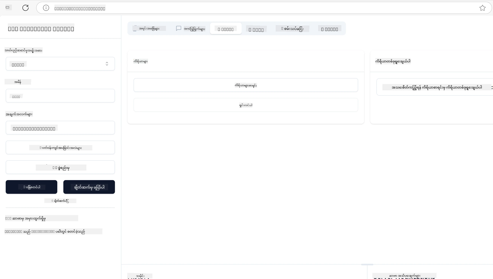
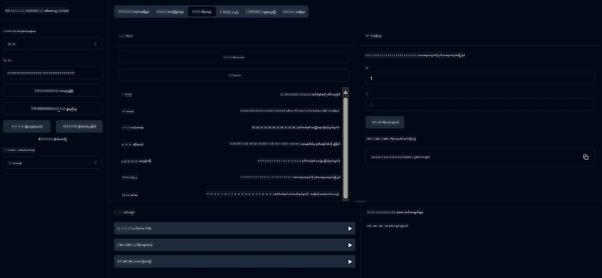
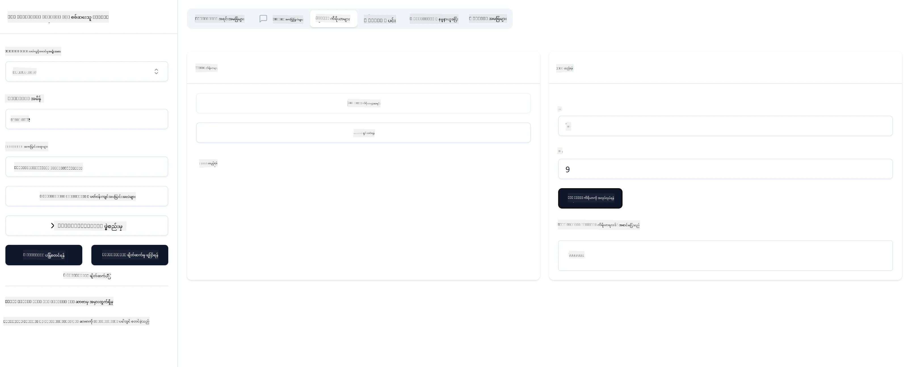

# MCP ဖြင့် စတင်လေ့လာခြင်း

> [!NOTE]
> ဤသင်ခန်းစာရှိ Java HTTP ဥပမာသည် နောက်ခံ HTTP+SSE ပို့ဆောင်မှုကို အသုံးပြုပြီး MCP `2025-11-25` နှင့် ကိုက်ညီသော SDK ကို ရည်ရွယ်သည်။ နယူး ပြင်ပ ဆာဗာများအတွက် `2026-07-28` Streamable HTTP ပို့ဆောင်မှုကို အသုံးပြု၍ သင့် SDK တွင် ထောက်ခံမှုရှိမှုကို အတည်ပြုပါ။
> 
> 


## အနှစ်ချုပ်

ဤသင်ခန်းစာသည် MCP ပတ်ဝန်းကျင်များ တပ်ဆင်ခြင်းနှင့် သင်၏ ပထမဆုံး MCP အပ်ပလီကေးရှင်းများ တည်ဆောက်ခြင်းအတွက် လက်တွေ့ လမ်းညွှန်မှုများ ပေးပါသည်။ လိုအပ်သော ကိရိယာများနှင့် ဖရိမ်ဝဝပ်များ ကို ဘယ်လို တပ်ဆင်ရမည်၊ အခြေခံ MCP ဆာဗာ များ တည်ဆောက်ရမည်၊ ဟောစ့် အပ်ပလီကေးရှင်းများ ဖန်တီးရမည်၊ နှင့် သင်၏ အကောင်အထည်ဖော်မှုများကို စစ်ဆေးရမည် ဆိုတာတွေကို သင်လေ့လာမည်ဖြစ်သည်။

Model Context Protocol (MCP) သည် LLMs များသို့ အက်ပလီကေးရှင်းများမှ context ပံ့ပိုးပေးပုံကို စံပြုထားသည့် ဖွင့်လှစ်သော ပရိုတိုကောဖြစ်သည်။ MCP ကို AI အက်ပလီကေးရှင်းများအတွက် USB-C ဆိပ်ကမ်းတစ်ခုလို ထင်ရှားနိုင်သည် - AI မော်ဒယ်များကို အမျိုးမျိုးသော ဒေတာအရင်းအမြစ်များနှင့် ကိရိယာများ ဆက်သွယ်ရန် စံပြု နည်းလမ်းကို ပံ့ပိုးပေးသည်။

## သင်ယူရန် ရည်ရွယ်ချက်များ

ဤသင်ခန်းစာ၏အဆုံးတွင် သင်သည် အောက်ပါအချက်များ ပြုလုပ်နိုင်မည်ဖြစ်သည် -

- C#၊ Java၊ Python၊ TypeScript၊ နှင့် Rust အတွက် MCP ဖွံ့ဖြိုးမှု ပတ်ဝန်းကျင်များ တပ်ဆင်ခြင်း
- စိတ်ကြိုက် အင်္ဂါရပ်များ (အရင်းအမြစ်များ၊ မေးမြန်းချက်များ၊ နှင့် ကိရိယာများ) ပါသော အခြေခံ MCP ဆာဗာများ တည်ဆောက်ပြီး ထုတ်လုပ်ခြင်း
- MCP ဆာဗာများနှင့် ချိတ်ဆက်သော ဟော့ပ် အပ်ပလီကေးရှင်းများ ဖန်တီးခြင်း
- MCP အကောင်အထည်ဖော်မှုများကို စစ်ဆေးပြီး ပြသာနာရှာဖွေရန်

## သင့် MCP ပတ်ဝန်းကျင်ကို တပ်ဆင်ခြင်း

MCP နှင့်လုပ်ကိုင်မတိုင်မီ သင့်ဖွံ့ဖြိုးမှု ပတ်ဝန်းကျင်ကို ပြင်ဆင်ခြင်းနှင့် အခြေခံ လုပ်ငန်းစဉ်ကို နားလည်ထားခြင်းမှာ အရေးကြီးသည်။ ဤ အပိုင်းသည် MCP နှင့် အဆင်ပြေစွာ စတင်နိုင်ရန် မူလတပ်ဆင်ခြင်း အဆင့်များကို လမ်းညွှန်ပေးမည်။

### မတိုင်မှီလိုအပ်ချက်များ

MCP ဖွံ့ဖြိုးမှု စတင်ရန်မတိုင်မီ အောက်ပါအချက်များကို အာမခံပါ -

- **ဖွံ့ဖြိုးမှု ပတ်ဝန်းကျင်**: သင်ရွေးချယ်ထားသော ဘာသာစကား (C#၊ Java၊ Python၊ TypeScript၊ သို့မဟုတ် Rust)
- **IDE/Editor**: Visual Studio, Visual Studio Code, IntelliJ, Eclipse, PyCharm, သို့မဟုတ် ခေတ်မီ ကုဒ်ပြင်ဆင်မည့် အင်္ဂါရပ်တစ်ခုခု
- **ပက်ကေ့ချ် မန်နေဂျာများ**: NuGet, Maven/Gradle, pip, npm/yarn, သို့မဟုတ် Cargo
- **API ခလုတ်များ**: သင့်ဟော့ပ် အပ်ပလီကေးရှင်းများတွင် အသုံးပြုရန် ရည်ရွယ်သော AI ဝန်ဆောင်မှုများအတွက်

## အခြေခံ MCP ဆာဗာ ဖွဲ့စည်းပုံ

MCP ဆာဗာတွင် အမြဲပါဝင်သည့် အရာများမှာ

- **ဆာဗာ ပြင်ဆင်မှု**: ပို့စ်၊ အတည်ပြုမှု၊ နှင့် အခြား ဆက်တင်များ
- **အရင်းအမြစ်များ**: LLMs များသို့ ချိတ်ဆက်ပေးရန် ဒေတာနှင့် context များ
- **ကိရိယာများ**: မော်ဒယ်များက ခေါ်ယူနိုင်သော လုပ်ဆောင်ချက်များ
- **မေးမြန်းချက်များ**: စာသားများအား ဖန်တီးရန် သို့မဟုတ် တည်ဆောက်ရန် ကြံဆ

ဤနေရာတွင် TypeScript တွင် ရိုးရှင်းစွာ ဆွဲဆောင်ထားသော ဥပမာက အောက်ပါအတိုင်းဖြစ်သည် -

```typescript
import { McpServer, ResourceTemplate } from "@modelcontextprotocol/sdk/server/mcp.js";
import { StdioServerTransport } from "@modelcontextprotocol/sdk/server/stdio.js";
import { z } from "zod";

// MCP ဆာဗာတစ်ခု ဖန်တီးပါ
const server = new McpServer({
  name: "Demo",
  version: "1.0.0"
});

// ပေါင်းထည့်နိုင်သည့် ကိရိယာတစ်ခု ထည့်ပါ
server.tool("add",
  { a: z.number(), b: z.number() },
  async ({ a, b }) => ({
    content: [{ type: "text", text: String(a + b) }]
  })
);

// တုန့်ပြန် မင်္ဂလာပါ ပေးသော အရင်းအမြစ်တစ်ခု ထည့်ပါ
server.resource(
  "file",
  // 'list' ပါရာမီတာသည် အရင်းအမြစ်မှ ရနိုင်သော ဖိုင်များကို စာရင်းပြသပုံကို ထိန်းချုပ်သည်။ ဤအရင်းအမြစ်အတွက် undefined ပြုလုပ်ထားလျှင် စာရင်းပြမတတ်ပါ။
  new ResourceTemplate("file://{path}", { list: undefined }),
  async (uri, { path }) => ({
    contents: [{
      uri: uri.href,
      text: `File, ${path}!`
    }]
  })
);

// ဖိုင်ထဲပါ အချက်အလက်များကို ဖတ်ရှုနိုင်သော ဖိုင်အရင်းအမြစ်တစ်ခု ထည့်ပါ
server.resource(
  "file",
  new ResourceTemplate("file://{path}", { list: undefined }),
  async (uri, { path }) => {
    let text;
    try {
      text = await fs.readFile(path, "utf8");
    } catch (err) {
      text = `Error reading file: ${err.message}`;
    }
    return {
      contents: [{
        uri: uri.href,
        text
      }]
    };
  }
);

server.prompt(
  "review-code",
  { code: z.string() },
  ({ code }) => ({
    messages: [{
      role: "user",
      content: {
        type: "text",
        text: `Please review this code:\n\n${code}`
      }
    }]
  })
);

// stdin တွင် သတင်းစကားများ လက်ခံစတင်ပြီး stdout မှာ သတင်းစကားများ ပို့ရန် စတင်ပါ။
const transport = new StdioServerTransport();
await server.connect(transport);
```

အဆိုပါကုဒ်တွင် -

- MCP TypeScript SDK မှ လိုအပ်သော class များ Import ပြုလုပ်ထားသည်။
- MCP ဆာဗာ instance အသစ် တစ်ခု ဖန်တီး၍ ပြင်ဆင်ထားသည်။
- စိတ်ကြိုက် tool တစ်ခု (`calculator`) ကို handler function နဲ့ စာရင်းသွင်းထားသည်။
- MCP ဆာဗာကို စတင်ပြီး အသုံးပြုသူမှ အဆိုပြု MCP request များနားထောင်သည်။

## စစ်ဆေးခြင်းနှင့် ပြဿနာရှာဖွေရန်

MCP server ကို စမ်းသပ်မတိုင်မီ သင်မှာ စက်ကိရိယာများ အသုံးပြုနည်းနှင့် ပြဿနာရှာဖွေရန် လုပ်နည်းများကို နားလည်ထားခြင်း အရေးကြီးသည်။ ထိရောက်သော စစ်ဆေးမှုသည် သင့်ဆာဗာအား မျှော်မှန်းသည့်အတိုင်း လုပ်ဆောင်ရာတွင် အကူအညီဖြစ်ပြီး ပြဿနာများကို မြန်မြန် ဆင်ခြင်ဖြေရှင်းနိုင်စေသည်။ အောက်တွင် MCP အကောင်အထည်ဖော်မှု စစ်ဆေးရန် အကြံပြုမှုများ ဖော်ပြထားသည်။

MCP သည် သင်၏ ဆာဗာများကို စမ်းသပ်၍ ပြဿနာရှာဖွေရန် ကိရိယာများကို ပံ့ပိုးပေးသည် -

- **Inspector tool**: ဤ ဂရပ်ဖစ်ဒ် user interface မှ ဆာဗာနှင့် ချိတ်ဆက်ပြီး tool များ၊ မေးမြန်းချက်များနှင့် အရင်းအမြစ်များ စစ်ဆေးနိုင်ပါသည်။
- **curl**: curl သို့မဟုတ် အခြား HTTP command များ ဖန်တီးနိုင်သည့် client များဖြင့် ဆာဗာနှင့် ချိတ်ဆက်နိုင်သည်။

### MCP Inspector အသုံးပြုခြင်း

[MCP Inspector](https://github.com/modelcontextprotocol/inspector) သည် ဂရပ်ဖစ်စမ်းသပ်မှု ကိရိယာ ဖြစ်ပြီး အောက်ပါအချက်များ အတွက် အထောက်အကူပြုသည် -

1. **ဆာဗာ စွမ်းဆောင်ရည် ရှာဖွေခြင်း**: ရရှိနိုင်သည့် အရင်းအမြစ်များ၊ ကိရိယာများနှင့် မေးမြန်းချက်များကို အလိုအလျောက် ရှာဖွေခြင်း
2. **ကိရိယာ လုပ်ဆောင်မှု စမ်းသပ်ခြင်း**: အမျိုးမျိုးသော ပါရာမီတာများကို စမ်းသပ်ပြီး တုံ့ပြန်ချက်များကို တိုက်ရိုက် ကြည့်ရှုနိုင်သည်
3. **ဆာဗာ Metadata ကြည့်ရှုခြင်း**: ဆာဗာနှင့် ပတ်သက်သော အချက်အလက်များ၊ schema များနှင့် ပြင်ဆင်ချက်များ ဝေဖန်နိုင်သည်

```bash
# ဥပမာ TypeScript, MCP Inspector ကို 설치နှင့်ပြေးဆွဲခြင်း
npx @modelcontextprotocol/inspector node build/index.js
```

အထက်ဖော်ပြပါ command များကို 실행မှ MCP Inspector သည် ဘရောက်ဇာတွင် ဒေသိယ ဝက်ဘ်အင်တာဖေ့စ် တစ်ခု ဖွင့်ပေးမည်။ သင်ရဲ့ MCP ဆာဗာများ၊ ၎င်းတို့၏ tool များ၊ အရင်းအမြစ်များ နှင့် မေးမြန်းချက်များကို ပြသသည့် dashboard ကို ကြည့်ရှုနိုင်ပါသည်။ ဒီ interface ကို အသုံးပြုပြီး tool လုပ်ဆောင်မှု စမ်းသပ်ခြင်း၊ ဆာဗာ metadata အကျဉ်းချုပ် စစ်ဆေးခြင်း နှင့် တုံ့ပြန်မှုများကို တိုက်ရိုက် ကြည့်ရှုနိုင်ပြီး MCP ဆာဗာ အကောင်အထည်ဖော်မှုများကို လွယ်လင့်တကူ စစ်ဆေး ပြီး ပြဿနာရှာဖွေသည်။

ဤသည်မှာ ၎င်း၏ မျက်နှာပြင် ရုပ်ပုံဥပမာဖြစ်ပါသည် -



## တစ်ချို့ ပုံမှန် တပ်ဆင်မှု ပြဿနာများ နှင့် ဖြေရှင်းချက်များ

| ပြဿနာ | ဖြစ်နိုင်သော ဖြေရှင်းချက် |
|-------|-------------------|
| ချိတ်ဆက်မှု ငြင်းပယ်ခြင်း | ဆာဗာ လည်ပတ်နေမှုနှင့် ပို့၏ မှန်ကန်မှု စစ်ဆေးခြင်း |
| ကိရိယာ လုပ်ဆောင်မှု အမှားများ | ပါရာမီတာ စစ်ဆေးမှု နှင့် အမှားကိုင်တွယ်မှုကို ပြန်လည် သုံးသပ်ခြင်း |
| အတည်ပြုမှု မအောင်မြင်ခြင်း | API key များနှင့် ခွင့်ပြုချက်များ စစ်ဆေးခြင်း |
| ဆီမား (schema) စစ်ဆေးမှု အမှားများ | သတ်မှတ်ထားသော schema နှင့် ကိုက်ညီမှု ရှိ/မရှိ စစ်ဆေးခြင်း |
| ဆာဗာ မစတင်နိုင်ခြင်း | ပို့စ္ဆက်စပ်မှု လိုက်လျောမှု သို့မဟုတ် မရှိသော ပါဝင်ဆောင်ရွက်ချက်များ စစ်ဆေးခြင်း |
| CORS အမှားများ | cross-origin request များအတွက် CORS header များ မှန်ကန်စွာ ပြင်ဆင်ခြင်း |
| အတည်ပြုမှု အခက်အခဲများ | token တရားဝင်မှုနှင့် ခွင့်ပြုချက်များ ခုခံစစ်ဆေးခြင်း |

## ဒေသန္တရ ဖွံ့ဖြိုးမှု

ဒေသန္တရ ဖွံ့ဖြိုးမှု နှင့် စမ်းသပ်မှုအတွက် MCP ဆာဗာများကို သင့်ကွန်ပျူတာပေါ်တွင် တိုက်ရိုက် ဖြေရှင်းနိုင်သည်။

1. **ဆာဗာ လုပ်ငန်းစဉ် စတင်ခြင်း**: သင့် MCP ဆာဗာ အပ်ပလီကေးရှင်းကို ပြေးပါ
2. **ကွန်ရက်ပြင်ဆင်ခြင်း**: ဆာဗာကို မျှော်မှန်းထားသော ပို့တွင် ဝင်ရောက်ဆန်းစစ်နိုင်မှုရှိရန် အာမခံပါ
3. **ကလိုင်းအသုံးပြုခြင်း**: `http://localhost:3000` ကဲ့သို့ ဒေသန္တရ ချိတ်ဆက်မှု URL များ အသုံးပြုပါ

```bash
# ဥပမာ - TypeScript MCP ဆာဗာကို ဒေသန္တရအားဖြင့် စတင်မောင်းနှင်ခြင်း
npm run start
# ဆာဗာ http://localhost:3000 တွင် သက်ဆိုင်မှုရှိသည်။
```

## သင့် ပထမဆုံး MCP ဆာဗာ တည်ဆောက်ခြင်း

ပြီးခဲ့သည့် သင်ခန်းစာတွင် [ပင်မ အကြောင်းအရာများ](../../01-CoreConcepts/README.md) ကို ဖော်ပြခဲ့ပြီး ယခု သင်၏ သိမှုများကို လက်တွေ့အသုံးပြုခွင့် ရပါပြီ။

### ဆာဗာ တစ်ခု လုပ်နိုင်သည့်အရာများ

ကုဒ်ရေးသားခြင်းစတင်မီ ဆာဗာ တစ်ခု ဘာတွေလုပ်နိုင်သလဲဆိုတာ ရှင်းလင်းစေချင်ပါတယ် -

MCP ဆာဗာတစ်ခုသည် ဥပမာအားဖြင့် -

- ဒေသန္တရ ဖိုင်များနှင့် ဒေတာဘေ့စ်များကို လှမ်းနိုင်သည်
- ပြင်ပ API များနှင့် ချိတ်ဆက်နိုင်သည်
- ကွက်ချက်တွက်ချက်မှုများ ဆောင်ရွက်နိုင်သည်
- အခြား ကိရိယာများနှင့် ဝန်ဆောင်မှုများနှင့် ပေါင်းစပ်နိုင်သည်
- အသုံးပြုသူ စကားဝိုင်း အင်တာဖေ့စ် ပံ့ပိုးနိုင်သည်

ကောင်းပါပြီ၊ ယခု ဆာဗာကို ဘာလုပ်ခြင်လဲဆိုတာ သိပြီးနောက် ကုဒ်ရေးမှုကို စတင်လိုက်ကြစို့။

## လေ့ကျင့်ခန်း: ဆာဗာ ဖန်တီးခြင်း

ဆာဗာ ဖန်တီးလိုပါက အောက်ပါ လုပ်ဆောင်ချက်များကို လိုက်နာရမည် -

- MCP SDK ကို တပ်ဆင်ပါ။
- project တစ်ခု ဖန်တီးပြီး project ဖွဲ့စည်းပုံကို စီစဉ်ပါ။
- ဆာဗာ ကုဒ်ကို ရေးသားပါ။
- ဆာဗာကို စမ်းသပ်ပါ။

### -1- project ဖန်တီးခြင်း

#### TypeScript

```sh
# ပရောဂျက်ဖိုဒါဖန်တီး၍ npm ပရောဂျက်အား စတင်ဆောင်ရွက်ပါ
mkdir calculator-server
cd calculator-server
npm init -y
```

#### Python

```sh
# ပရောဂျက် ဖိုလ်ဒါ ဖန်တီးမယ်
mkdir calculator-server
cd calculator-server
# Visual Studio Code မှာ ဖိုလ်ဒါကို ဖွင့်ပါ - မတူညီတဲ့ IDE ကို သုံးနေပါက ဒီအဆင့်ကို ကျော်ပါ
code .
```

#### .NET

```sh
dotnet new console -n McpCalculatorServer
cd McpCalculatorServer
```

#### Java

Java အတွက် Spring Boot project ဖန်တီးပါ -

```bash
curl https://start.spring.io/starter.zip \
  -d dependencies=web \
  -d javaVersion=21 \
  -d type=maven-project \
  -d groupId=com.example \
  -d artifactId=calculator-server \
  -d name=McpServer \
  -d packageName=com.microsoft.mcp.sample.server \
  -o calculator-server.zip
```

zip ဖိုင်ကို ဖြုတ်ပါ -

```bash
unzip calculator-server.zip -d calculator-server
cd calculator-server
# ရွေးချယ်ဖို့ မသုံးတော့တဲ့ စမ်းသပ်မှုကို ဖယ်ရှားပါ
rm -rf src/test/java
```

*pom.xml* ဖိုင်တွင် အောက်ပါ ပြည့်စုံသော ဖော်ပြချက်ကို ထည့်ပါ -

```xml
<?xml version="1.0" encoding="UTF-8"?>
<project xmlns="http://maven.apache.org/POM/4.0.0"
    xmlns:xsi="http://www.w3.org/2001/XMLSchema-instance"
    xsi:schemaLocation="http://maven.apache.org/POM/4.0.0 http://maven.apache.org/xsd/maven-4.0.0.xsd">
    <modelVersion>4.0.0</modelVersion>
    
    <!-- Spring Boot parent for dependency management -->
    <parent>
        <groupId>org.springframework.boot</groupId>
        <artifactId>spring-boot-starter-parent</artifactId>
        <version>3.5.0</version>
        <relativePath />
    </parent>

    <!-- Project coordinates -->
    <groupId>com.example</groupId>
    <artifactId>calculator-server</artifactId>
    <version>0.0.1-SNAPSHOT</version>
    <name>Calculator Server</name>
    <description>Basic calculator MCP service for beginners</description>

    <!-- Properties -->
    <properties>
        <java.version>21</java.version>
        <maven.compiler.source>21</maven.compiler.source>
        <maven.compiler.target>21</maven.compiler.target>
    </properties>

    <!-- Spring AI BOM for version management -->
    <dependencyManagement>
        <dependencies>
            <dependency>
                <groupId>org.springframework.ai</groupId>
                <artifactId>spring-ai-bom</artifactId>
                <version>1.0.0-SNAPSHOT</version>
                <type>pom</type>
                <scope>import</scope>
            </dependency>
        </dependencies>
    </dependencyManagement>

    <!-- Dependencies -->
    <dependencies>
        <dependency>
            <groupId>org.springframework.ai</groupId>
            <artifactId>spring-ai-starter-mcp-server-webflux</artifactId>
        </dependency>
        <dependency>
            <groupId>org.springframework.boot</groupId>
            <artifactId>spring-boot-starter-actuator</artifactId>
        </dependency>
        <dependency>
         <groupId>org.springframework.boot</groupId>
         <artifactId>spring-boot-starter-test</artifactId>
         <scope>test</scope>
      </dependency>
    </dependencies>

    <!-- Build configuration -->
    <build>
        <plugins>
            <plugin>
                <groupId>org.springframework.boot</groupId>
                <artifactId>spring-boot-maven-plugin</artifactId>
            </plugin>
            <plugin>
                <groupId>org.apache.maven.plugins</groupId>
                <artifactId>maven-compiler-plugin</artifactId>
                <configuration>
                    <release>21</release>
                </configuration>
            </plugin>
        </plugins>
    </build>

    <!-- Repositories for Spring AI snapshots -->
    <repositories>
        <repository>
            <id>spring-milestones</id>
            <name>Spring Milestones</name>
            <url>https://repo.spring.io/milestone</url>
            <snapshots>
                <enabled>false</enabled>
            </snapshots>
        </repository>
        <repository>
            <id>spring-snapshots</id>
            <name>Spring Snapshots</name>
            <url>https://repo.spring.io/snapshot</url>
            <releases>
                <enabled>false</enabled>
            </releases>
        </repository>
    </repositories>
</project>
```

#### Rust

```sh
mkdir calculator-server
cd calculator-server
cargo init
```

### -2- မူလက်ဆောင်များ ထည့်သွင်းခြင်း

project ဖန်တီးပြီးနောက် မူလက်ဆောင်များ ထည့်ခြင်းဆီသို့ ရောက်ရှိပါပြီ -

#### TypeScript

```sh
# မတင်ထားသေးပါက TypeScript ကို ကမ္ဘာတစ်လွှား တပ်ဆင်ပါ
npm install typescript -g

# MCP SDK နှင့် schema စစ်ဆေးမှုအတွက် Zod ကို တပ်ဆင်ပါ
npm install @modelcontextprotocol/sdk zod
npm install -D @types/node typescript
```

#### Python

```sh
# ဗာချွပ်ထည်ပတ်ဝန်းကျင်တစ်ခုထုတ်ပြီး လိုအပ်သောပစ္စည်းများကို 설치 ပြုလုပ်ပါ။
python -m venv venv
venv\Scripts\activate
pip install "mcp[cli]"
```

#### Java

```bash
cd calculator-server
./mvnw clean install -DskipTests
```

#### Rust

```sh
cargo add rmcp --features server,transport-io
cargo add serde
cargo add tokio --features rt-multi-thread
```

### -3- project ဖိုင်များ ဖန်တီးခြင်း

#### TypeScript

*package.json* ဖိုင်ကို ဖွင့်ပြီး အောက်ပါ အရာများဖြင့် အစားထိုးပါ၊ ဆာဗာကို ဖန်တီးခြင်းနှင့် ပြေးဆွဲခြင်းအတွက် လိုအပ်မှု ရှိရန် -

```json
{
  "name": "calculator-server",
  "version": "1.0.0",
  "main": "index.js",
  "type": "module",
  "scripts": {
    "build": "tsc",
    "start": "npm run build && node ./build/index.js",
  },
  "keywords": [],
  "author": "",
  "license": "ISC",
  "description": "A simple calculator server using Model Context Protocol",
  "dependencies": {
    "@modelcontextprotocol/sdk": "^1.16.0",
    "zod": "^3.25.76"
  },
  "devDependencies": {
    "@types/node": "^24.0.14",
    "typescript": "^5.8.3"
  }
}
```

*tsconfig.json* ဖိုင်ကို အောက်ပါ အကြောင်းအရာနှင့် ဖန်တီးပါ -

```json
{
  "compilerOptions": {
    "target": "ES2022",
    "module": "Node16",
    "moduleResolution": "Node16",
    "outDir": "./build",
    "rootDir": "./src",
    "strict": true,
    "esModuleInterop": true,
    "skipLibCheck": true,
    "forceConsistentCasingInFileNames": true
  },
  "include": ["src/**/*"],
  "exclude": ["node_modules"]
}
```

ကိုးကားကုဒ်များ အတွက် ဖိုလ်ဒါ တစ်ခုဖန်တီးပါ -

```sh
mkdir src
touch src/index.ts
```

#### Python

*server.py* ဖိုင်တစ်ခု ဖန်တီးပါ

```sh
touch server.py
```

#### .NET

လိုအပ်သည့် NuGet package များကို တပ်ဆင်ပါ -

```sh
dotnet add package ModelContextProtocol --prerelease
dotnet add package Microsoft.Extensions.Hosting
```

#### Java

Java Spring Boot project များအတွက် project ဖွဲ့စည်းပုံကို အလိုအလျောက် ဖန်တီးပေးသည်။

#### Rust

Rust မှာ `cargo init` ကုဒ်ကို run လုပ်တိုင်း အလိုအလျောက် *src/main.rs* ဖိုင် တစ်ခု ဖန်တီးပေးသည်။ ဖိုင်ကိုဖွင့်၍ ပုံမှန်ကုဒ်ကို ဖျက်ပါ။

### -4- ဆာဗာ ကုဒ်ရေးသားခြင်း

#### TypeScript

*index.ts* ဖိုင် တစ်ခု ဖန်တီးပြီး အောက်ပါ ကုဒ်ရေးထည့်ပါ -

```typescript
import { McpServer, ResourceTemplate } from "@modelcontextprotocol/sdk/server/mcp.js";
import { StdioServerTransport } from "@modelcontextprotocol/sdk/server/stdio.js";
import { z } from "zod";
 
// MCP ဆာဗာတစ်ခုတည်ဆောက်ပါ
const server = new McpServer({
  name: "Calculator MCP Server",
  version: "1.0.0"
});
```

ယခု သင်တွင် ဆာဗာ ရှိပြီး သို့သော် သိသမျှ မလုပ်ဆောင်သေးပါ၊ ကြစေလိုက်ပါ။

#### Python

```python
# server.py
from mcp.server.fastmcp import FastMCP

# MCP ဆာဗာတစ်ခု ဖန်တီးပါ
mcp = FastMCP("Demo")
```

#### .NET

```csharp
using Microsoft.Extensions.DependencyInjection;
using Microsoft.Extensions.Hosting;
using Microsoft.Extensions.Logging;
using ModelContextProtocol.Server;
using System.ComponentModel;

var builder = Host.CreateApplicationBuilder(args);
builder.Logging.AddConsole(consoleLogOptions =>
{
    // Configure all logs to go to stderr
    consoleLogOptions.LogToStandardErrorThreshold = LogLevel.Trace;
});

builder.Services
    .AddMcpServer()
    .WithStdioServerTransport()
    .WithToolsFromAssembly();
await builder.Build().RunAsync();

// add features
```

#### Java

Java သို့မဟုတ် core ဆာဗာ စိတ်ကြိုက်အပိုင်း များ ဖန်တီးပါ။ ပထမဦးဆုံး main application class ကို ပြင်ဆင်ပါ -

*src/main/java/com/microsoft/mcp/sample/server/McpServerApplication.java*:

```java
package com.microsoft.mcp.sample.server;

import org.springframework.ai.tool.ToolCallbackProvider;
import org.springframework.ai.tool.method.MethodToolCallbackProvider;
import org.springframework.boot.SpringApplication;
import org.springframework.boot.autoconfigure.SpringBootApplication;
import org.springframework.context.annotation.Bean;
import com.microsoft.mcp.sample.server.service.CalculatorService;

@SpringBootApplication
public class McpServerApplication {

    public static void main(String[] args) {
        SpringApplication.run(McpServerApplication.class, args);
    }
    
    @Bean
    public ToolCallbackProvider calculatorTools(CalculatorService calculator) {
        return MethodToolCallbackProvider.builder().toolObjects(calculator).build();
    }
}
```

calculator service ဖိုင်ကို ဖန်တီးပါ *src/main/java/com/microsoft/mcp/sample/server/service/CalculatorService.java* မှာ -

```java
package com.microsoft.mcp.sample.server.service;

import org.springframework.ai.tool.annotation.Tool;
import org.springframework.stereotype.Service;

/**
 * Service for basic calculator operations.
 * This service provides simple calculator functionality through MCP.
 */
@Service
public class CalculatorService {

    /**
     * Add two numbers
     * @param a The first number
     * @param b The second number
     * @return The sum of the two numbers
     */
    @Tool(description = "Add two numbers together")
    public String add(double a, double b) {
        double result = a + b;
        return formatResult(a, "+", b, result);
    }

    /**
     * Subtract one number from another
     * @param a The number to subtract from
     * @param b The number to subtract
     * @return The result of the subtraction
     */
    @Tool(description = "Subtract the second number from the first number")
    public String subtract(double a, double b) {
        double result = a - b;
        return formatResult(a, "-", b, result);
    }

    /**
     * Multiply two numbers
     * @param a The first number
     * @param b The second number
     * @return The product of the two numbers
     */
    @Tool(description = "Multiply two numbers together")
    public String multiply(double a, double b) {
        double result = a * b;
        return formatResult(a, "*", b, result);
    }

    /**
     * Divide one number by another
     * @param a The numerator
     * @param b The denominator
     * @return The result of the division
     */
    @Tool(description = "Divide the first number by the second number")
    public String divide(double a, double b) {
        if (b == 0) {
            return "Error: Cannot divide by zero";
        }
        double result = a / b;
        return formatResult(a, "/", b, result);
    }

    /**
     * Calculate the power of a number
     * @param base The base number
     * @param exponent The exponent
     * @return The result of raising the base to the exponent
     */
    @Tool(description = "Calculate the power of a number (base raised to an exponent)")
    public String power(double base, double exponent) {
        double result = Math.pow(base, exponent);
        return formatResult(base, "^", exponent, result);
    }

    /**
     * Calculate the square root of a number
     * @param number The number to find the square root of
     * @return The square root of the number
     */
    @Tool(description = "Calculate the square root of a number")
    public String squareRoot(double number) {
        if (number < 0) {
            return "Error: Cannot calculate square root of a negative number";
        }
        double result = Math.sqrt(number);
        return String.format("√%.2f = %.2f", number, result);
    }

    /**
     * Calculate the modulus (remainder) of division
     * @param a The dividend
     * @param b The divisor
     * @return The remainder of the division
     */
    @Tool(description = "Calculate the remainder when one number is divided by another")
    public String modulus(double a, double b) {
        if (b == 0) {
            return "Error: Cannot divide by zero";
        }
        double result = a % b;
        return formatResult(a, "%", b, result);
    }

    /**
     * Calculate the absolute value of a number
     * @param number The number to find the absolute value of
     * @return The absolute value of the number
     */
    @Tool(description = "Calculate the absolute value of a number")
    public String absolute(double number) {
        double result = Math.abs(number);
        return String.format("|%.2f| = %.2f", number, result);
    }

    /**
     * Get help about available calculator operations
     * @return Information about available operations
     */
    @Tool(description = "Get help about available calculator operations")
    public String help() {
        return "Basic Calculator MCP Service\n\n" +
               "Available operations:\n" +
               "1. add(a, b) - Adds two numbers\n" +
               "2. subtract(a, b) - Subtracts the second number from the first\n" +
               "3. multiply(a, b) - Multiplies two numbers\n" +
               "4. divide(a, b) - Divides the first number by the second\n" +
               "5. power(base, exponent) - Raises a number to a power\n" +
               "6. squareRoot(number) - Calculates the square root\n" + 
               "7. modulus(a, b) - Calculates the remainder of division\n" +
               "8. absolute(number) - Calculates the absolute value\n\n" +
               "Example usage: add(5, 3) will return 5 + 3 = 8";
    }

    /**
     * Format the result of a calculation
     */
    private String formatResult(double a, String operator, double b, double result) {
        return String.format("%.2f %s %.2f = %.2f", a, operator, b, result);
    }
}
```

**ထုတ်လုပ်မှုအဆင်သင့် ဝန်ဆောင်မှုအတွက် ရွေးချယ်ဖွဲ့စည်းချက်များ -**

startup configuration ကို ဖန်တီးပါ *src/main/java/com/microsoft/mcp/sample/server/config/StartupConfig.java* မှာ -

```java
package com.microsoft.mcp.sample.server.config;

import org.springframework.boot.CommandLineRunner;
import org.springframework.context.annotation.Bean;
import org.springframework.context.annotation.Configuration;

@Configuration
public class StartupConfig {
    
    @Bean
    public CommandLineRunner startupInfo() {
        return args -> {
            System.out.println("\n" + "=".repeat(60));
            System.out.println("Calculator MCP Server is starting...");
            System.out.println("SSE endpoint: http://localhost:8080/sse");
            System.out.println("Health check: http://localhost:8080/actuator/health");
            System.out.println("=".repeat(60) + "\n");
        };
    }
}
```

health controller ကို ဖန်တီးပါ *src/main/java/com/microsoft/mcp/sample/server/controller/HealthController.java* မှာ -

```java
package com.microsoft.mcp.sample.server.controller;

import org.springframework.http.ResponseEntity;
import org.springframework.web.bind.annotation.GetMapping;
import org.springframework.web.bind.annotation.RestController;
import java.time.LocalDateTime;
import java.util.HashMap;
import java.util.Map;

@RestController
public class HealthController {
    
    @GetMapping("/health")
    public ResponseEntity<Map<String, Object>> healthCheck() {
        Map<String, Object> response = new HashMap<>();
        response.put("status", "UP");
        response.put("timestamp", LocalDateTime.now().toString());
        response.put("service", "Calculator MCP Server");
        return ResponseEntity.ok(response);
    }
}
```

exception handler ကို ဖန်တီးပါ *src/main/java/com/microsoft/mcp/sample/server/exception/GlobalExceptionHandler.java* မှာ -

```java
package com.microsoft.mcp.sample.server.exception;

import org.springframework.http.HttpStatus;
import org.springframework.http.ResponseEntity;
import org.springframework.web.bind.annotation.ExceptionHandler;
import org.springframework.web.bind.annotation.RestControllerAdvice;

@RestControllerAdvice
public class GlobalExceptionHandler {

    @ExceptionHandler(IllegalArgumentException.class)
    public ResponseEntity<ErrorResponse> handleIllegalArgumentException(IllegalArgumentException ex) {
        ErrorResponse error = new ErrorResponse(
            "Invalid_Input", 
            "Invalid input parameter: " + ex.getMessage());
        return new ResponseEntity<>(error, HttpStatus.BAD_REQUEST);
    }

    public static class ErrorResponse {
        private String code;
        private String message;

        public ErrorResponse(String code, String message) {
            this.code = code;
            this.message = message;
        }

        // ရယူသူများ
        public String getCode() { return code; }
        public String getMessage() { return message; }
    }
}
```

စိတ်ကြိုက် banner ဖိုင် *src/main/resources/banner.txt* သို့ ထည့်ပါ -

```text
_____      _            _       _             
 / ____|    | |          | |     | |            
| |     __ _| | ___ _   _| | __ _| |_ ___  _ __ 
| |    / _` | |/ __| | | | |/ _` | __/ _ \| '__|
| |___| (_| | | (__| |_| | | (_| | || (_) | |   
 \_____\__,_|_|\___|\__,_|_|\__,_|\__\___/|_|   
                                                
Calculator MCP Server v1.0
Spring Boot MCP Application
```

</details>

#### Rust

*src/main.rs* ဖိုင် အထိပ်တွင် အောက်ပါ ကုဒ်များ ထည့်ပါ။ ဤသည်သည် MCP ဆာဗာအတွက် လိုအပ်သော စာကြည့်တိုက်များနှင့် မော်ဂျူးများကို သွင်းယူသည်။

```rust
use rmcp::{
    handler::server::{router::tool::ToolRouter, tool::Parameters},
    model::{ServerCapabilities, ServerInfo},
    schemars, tool, tool_handler, tool_router,
    transport::stdio,
    ServerHandler, ServiceExt,
};
use std::error::Error;
```

calculator server သည် နံပါတ်နှစ်ခုကို ပေါင်းတင်နိုင်သော ရိုးရှင်းစနစ်ဖြစ်သည်။ calculator request ကို ကိုယ်စားပြုရန် struct တစ်ခု ဖန်တီးပါ။

```rust
#[derive(Debug, serde::Deserialize, schemars::JsonSchema)]
pub struct CalculatorRequest {
    pub a: f64,
    pub b: f64,
}
```

နောက်တစ်ခုမှာ calculator server ကို ကိုယ်စားပြု struct တစ်ခု ဖန်တီးပါ။ ဤ struct တွင် tool router ပါပြီး tool များ စာရင်းသွင်းရာတွင် အသုံးပြုသည်။

```rust
#[derive(Debug, Clone)]
pub struct Calculator {
    tool_router: ToolRouter<Self>,
}
```

ယခု `Calculator` struct ကို အသစ် ဖြစ်အောင်ဖန်တီး၍ ဆာဗာ handler ကို လုပ်ဆောင်မှုများ ပေးရန် အကောင်အထည်ဖော်နိုင်သည်။

```rust
#[tool_router]
impl Calculator {
    pub fn new() -> Self {
        Self {
            tool_router: Self::tool_router(),
        }
    }
}

#[tool_handler]
impl ServerHandler for Calculator {
    fn get_info(&self) -> ServerInfo {
        ServerInfo {
            instructions: Some("A simple calculator tool".into()),
            capabilities: ServerCapabilities::builder().enable_tools().build(),
            ..Default::default()
        }
    }
}
```

နောက်ဆုံးတွင် ဆာဗာ စတင်ပေးနိုင်ရန် main function ကို အကောင်အထည်ဖော်ရမည်။ ဤ function သည် `Calculator` struct instance ဖန်တီး၍ standard input/output ဖြင့် ပေးပို့ပါမည်။

```rust
#[tokio::main]
async fn main() -> Result<(), Box<dyn Error>> {
    let service = Calculator::new().serve(stdio()).await?;
    service.waiting().await?;
    Ok(())
}
```

ယခု ဆာဗာသည် ယင်းအကြောင်းအရာ အခြေခံ ပြသနိုင်ပြီး နောက်တစ်ဆင့်တွင် ပေါင်းခြင်း လုပ်ငန်းကို ဆောင်ရွက်ရန် tool တစ်ခု ထည့်မည်။

### -5- tool နှင့် resource ထည့်ခြင်း

အောက်ပါ ကုဒ်များ ထည့်၍ tool နှင့် resource တို့ကို ထည့်ပါ။

#### TypeScript

```typescript
server.tool(
  "add",
  { a: z.number(), b: z.number() },
  async ({ a, b }) => ({
    content: [{ type: "text", text: String(a + b) }]
  })
);

server.resource(
  "greeting",
  new ResourceTemplate("greeting://{name}", { list: undefined }),
  async (uri, { name }) => ({
    contents: [{
      uri: uri.href,
      text: `Hello, ${name}!`
    }]
  })
);
```

သင့် tool သည် `a` နှင့် `b` ပါရာမီတာများ ယူပြီး အောက်ပါ ပုံစံဖြင့် တုံ့ပြန်ချက် ထုတ်ပေးသည် -

```typescript
{
  contents: [{
    type: "text", content: "some content"
  }]
}
```

သင်၏ resource သည် "greeting" string မှတစ်ဆင့် ဝင်ရောက်နိုင်ပြီး `name` ပါရာမီတာယူသည့် tool နှင့် ဆင်တူ တုံ့ပြန်ချက်ဖြစ်သည် -

```typescript
{
  uri: "<href>",
  text: "a text"
}
```

#### Python

```python
# ပေါင်းထည့်ရန်ကိရိယာတစ်ခု ထည့်ပါ
@mcp.tool()
def add(a: int, b: int) -> int:
    """Add two numbers"""
    return a + b


# အလုပ်လုပ်နေသော မင်္ဂလာဆောင်မှု အရင်းအမြစ်ကို ထည့်ပါ
@mcp.resource("greeting://{name}")
def get_greeting(name: str) -> str:
    """Get a personalized greeting"""
    return f"Hello, {name}!"
```

အထက်ဖော်ပြပါကုဒ်တွင် -

- `add` tool ကို ဖေါ်ပြထားပြီး `a` နှင့် `b` တန်ဖိုး INTEGER အဖြစ် သတ်မှတ်ထားသည်။
- `greeting` resource ကို `name` ပါရာမီတာနဲ့ ဖန်တီးထားသည်။

#### .NET

Program.cs ဖိုင်ထဲတွင် ဤပိုင်းကို ထည့်ပါ -

```csharp
[McpServerToolType]
public static class CalculatorTool
{
    [McpServerTool, Description("Adds two numbers")]
    public static string Add(int a, int b) => $"Sum {a + b}";
}
```

#### Java

ယခင် အဆင့်တွင် အဆိုပါ tool များကို ဖန်တီးပြီးပြီ။

#### Rust

`impl Calculator` block အတွင်း ထပ်မံ tool တစ်ခု ထည့်ပါ -

```rust
#[tool(description = "Adds a and b")]
async fn add(
    &self,
    Parameters(CalculatorRequest { a, b }): Parameters<CalculatorRequest>,
) -> String {
    (a + b).to_string()
}
```

### -6- နောက်ဆုံးကုဒ်

ဆာဗာကို စတင်နိုင်ရန် ပြီးဆုံးကုဒ် အောက်ပါအတိုင်း ထည့်ပါ -

#### TypeScript

```typescript
// stdin တွင်မက်ဆေ့ခ်ျများကိုလက်ခံပြီး stdout တွင်မက်ဆေ့ခ်ျများပို့ခြင်းကိုစတင်ပါ။
const transport = new StdioServerTransport();
await server.connect(transport);
```

ပြည့်စုံသော ကုဒ်မှာ -

```typescript
// index.ts
import { McpServer, ResourceTemplate } from "@modelcontextprotocol/sdk/server/mcp.js";
import { StdioServerTransport } from "@modelcontextprotocol/sdk/server/stdio.js";
import { z } from "zod";

// MCP ဆာဗာတစ်ခု ဖန်တီးပါ
const server = new McpServer({
  name: "Calculator MCP Server",
  version: "1.0.0"
});

// အပိုဆော့ဖ်တစ် ခု ထည့်ပါ
server.tool(
  "add",
  { a: z.number(), b: z.number() },
  async ({ a, b }) => ({
    content: [{ type: "text", text: String(a + b) }]
  })
);

// အပြောင်းအလဲရှိသော မင်္ဂလာပါ စနစ် အရင်းအမြစ် ထည့်ပါ
server.resource(
  "greeting",
  new ResourceTemplate("greeting://{name}", { list: undefined }),
  async (uri, { name }) => ({
    contents: [{
      uri: uri.href,
      text: `Hello, ${name}!`
    }]
  })
);

// stdin မှ စာမက်ဆေ့များ လက်ခံ၍ stdout မှ စာမက်ဆေ့များ ပို့ဆောင်မှုကို စတင်ပါ
const transport = new StdioServerTransport();
server.connect(transport);
```

#### Python

```python
# server.py
from mcp.server.fastmcp import FastMCP

# MCP ဆာဗာ တစ်ခု ဖန်တီးပါ
mcp = FastMCP("Demo")


# ပေါင်းထည့်ရန် ကိရိယာ တစ်ခု ထည့်ပါ
@mcp.tool()
def add(a: int, b: int) -> int:
    """Add two numbers"""
    return a + b


# ကွဲပြားသော ကြိုဆိုမှု အရင်းအမြစ် တစ်ခု ထည့်ပါ
@mcp.resource("greeting://{name}")
def get_greeting(name: str) -> str:
    """Get a personalized greeting"""
    return f"Hello, {name}!"

# အဓိက လုပ်ဆောင်မှု အပိုင်း - ဆာဗာကို လည်ပတ်ရန် လိုအပ်ပါသည်
if __name__ == "__main__":
    mcp.run()
```

#### .NET

အောက်ပါအကြောင်းအရာဖြင့် Program.cs ဖိုင်ကို ဖန်တီးပါ -

```csharp
using Microsoft.Extensions.DependencyInjection;
using Microsoft.Extensions.Hosting;
using Microsoft.Extensions.Logging;
using ModelContextProtocol.Server;
using System.ComponentModel;

var builder = Host.CreateApplicationBuilder(args);
builder.Logging.AddConsole(consoleLogOptions =>
{
    // Configure all logs to go to stderr
    consoleLogOptions.LogToStandardErrorThreshold = LogLevel.Trace;
});

builder.Services
    .AddMcpServer()
    .WithStdioServerTransport()
    .WithToolsFromAssembly();
await builder.Build().RunAsync();

[McpServerToolType]
public static class CalculatorTool
{
    [McpServerTool, Description("Adds two numbers")]
    public static string Add(int a, int b) => $"Sum {a + b}";
}
```

#### Java

သင့် main application class ပြည့်စုံသည် အောက်ပါအတိုင်း ဖြစ်ရမည် -

```java
// McpServerApplication.java
package com.microsoft.mcp.sample.server;

import org.springframework.ai.tool.ToolCallbackProvider;
import org.springframework.ai.tool.method.MethodToolCallbackProvider;
import org.springframework.boot.SpringApplication;
import org.springframework.boot.autoconfigure.SpringBootApplication;
import org.springframework.context.annotation.Bean;
import com.microsoft.mcp.sample.server.service.CalculatorService;

@SpringBootApplication
public class McpServerApplication {

    public static void main(String[] args) {
        SpringApplication.run(McpServerApplication.class, args);
    }
    
    @Bean
    public ToolCallbackProvider calculatorTools(CalculatorService calculator) {
        return MethodToolCallbackProvider.builder().toolObjects(calculator).build();
    }
}
```

#### Rust

Rust ဆာဗာအတွက် နောက်ဆုံးကုဒ်မှာ အောက်ပါအတိုင်း ဖြစ်ရမည် -

```rust
use rmcp::{
    ServerHandler, ServiceExt,
    handler::server::{router::tool::ToolRouter, tool::Parameters},
    model::{ServerCapabilities, ServerInfo},
    schemars, tool, tool_handler, tool_router,
    transport::stdio,
};
use std::error::Error;

#[derive(Debug, serde::Deserialize, schemars::JsonSchema)]
pub struct CalculatorRequest {
    pub a: f64,
    pub b: f64,
}

#[derive(Debug, Clone)]
pub struct Calculator {
    tool_router: ToolRouter<Self>,
}

#[tool_router]
impl Calculator {
    pub fn new() -> Self {
        Self {
            tool_router: Self::tool_router(),
        }
    }
    
    #[tool(description = "Adds a and b")]
    async fn add(
        &self,
        Parameters(CalculatorRequest { a, b }): Parameters<CalculatorRequest>,
    ) -> String {
        (a + b).to_string()
    }
}

#[tool_handler]
impl ServerHandler for Calculator {
    fn get_info(&self) -> ServerInfo {
        ServerInfo {
            instructions: Some("A simple calculator tool".into()),
            capabilities: ServerCapabilities::builder().enable_tools().build(),
            ..Default::default()
        }
    }
}

#[tokio::main]
async fn main() -> Result<(), Box<dyn Error>> {
    let service = Calculator::new().serve(stdio()).await?;
    service.waiting().await?;
    Ok(())
}
```

### -7- ဆာဗာ စမ်းသပ်ခြင်း

အောက်ပါ command ဖြင့် ဆာဗာကို စတင်ပါ -

#### TypeScript

```sh
npm run build
```

#### Python

```sh
mcp run server.py
```

> MCP Inspector ကို အသုံးပြုရန် `mcp dev server.py` ကို အသုံးပြုပါ။ ၎င်းသည် Inspector ကို အလိုအလျောက် စတင်ကာ လိုအပ်သော proxy session token ကို ပေးမှတ်ပေးသည်။ `mcp run server.py` ကို အသုံးပြုသောအခါတွင် သင်သည် လက်ဖြင့် Inspector ကို စတင်၍ ချိတ်ဆက်မှု တပ်ဆင်ရမည် ဖြစ်သည်။

#### .NET

သင်၏ project directory တွင် ရှိကြောင်း အတည်ပြုပါ -

```sh
cd McpCalculatorServer
dotnet run
```

#### Java

```bash
./mvnw clean install -DskipTests
java -jar target/calculator-server-0.0.1-SNAPSHOT.jar
```

#### Rust

ဆာဗာကို ဖော်မက်လုပ်ရန်နှင့် ပြေးရန် အောက်ပါ command များကို run ပါ -

```sh
cargo fmt
cargo run
```

### -8- inspector ဖြင့် ပြေးပါ

Inspector သည် သင့်ဆာဗာကို စတင်ရန် နှင့် အလုပ်လုပ်မှုကို စမ်းသပ်ရန် အထောက်အကူ ပေးသော ကိရိယာကောင်းဖြစ်သည်။ စတင်လော့စဉ်းစားကြပါစို့ -

> [!NOTE]
> "command" ဘာသာရပ်အတွင်း၌ သင့်ရဲ့ runtime ဖြင့် ဆာဗာကို ပြေးစေသည့် ကွန်မန်ကို ထည့်သွင်းထားသည့်အတွက် ဖွဲ့စည်းမှု အနည်းငယ်ကွဲပြားနိုင်ပါသည်။

#### TypeScript

```sh
npx @modelcontextprotocol/inspector node build/index.js
```

သို့မဟုတ် *package.json* ထဲတွင် `"inspector": "npx @modelcontextprotocol/inspector node build/index.js"` ဆိုပြီး ထည့်သွင်း၍ နောက်တစ်ချက် `npm run inspector` ကို 실행ပါ။

#### Python

Python သည် Node.js ကိရိယာဖြစ်သည့် inspector ကို wrapping လုပ်ထားသည်။ အောက်ပါအတိုင်း သုံးနိုင်ပါသည် -

```sh
mcp dev server.py
```


သို့သော်၊ ၎င်းသည် tool ပေါ်တွင်ရရှိနိုင်သည့် method များအားလုံးကို အကောင်အထည်မပြုသဖြစ်၍ သင်သည် အောက်ပါအတိုင်း Node.js tool ကို တိုက်ရိုက် run ပြုလုပ်ရန် အကြံပြုပါသည်။

```sh
npx @modelcontextprotocol/inspector mcp run server.py
```

သင်သည် script များကို ရေးထိုးရန် command များနှင့် argument များကို ပြင်ဆင်ခွင့်ပြုသော tool သို့မဟုတ် IDE ကို အသုံးပြုလျှင်၊
`Command` field တွင် `python` ကို နှင့် `Arguments` တွင် `server.py` ကို သတ်မှတ်ရန်သေချာစေရန် လိုအပ်သည်။ ၎င်းသည် script ကို မှန်ကန်စွာ run ပြုလုပ်ရန် အာမခံသည်။

#### .NET

သင်၏ project directory ထဲတွင် ရှိနေကြောင်း သေချာပါစေ။

```sh
cd McpCalculatorServer
npx @modelcontextprotocol/inspector dotnet run
```

#### Java

သင်၏ calculator server သည် chạy နေကြောင်း သေချာပါစေ
Inspector ကို run ပြုလုပ်ပါ။

```cmd
npx @modelcontextprotocol/inspector
```

Inspector web interface တွင်

1. "SSE" ကို transport type အဖြစ် ရွေးချယ်ပါ
2. URL ကို `http://localhost:8080/sse` ဟု သတ်မှတ်ပါ
3. "Connect" ကို နှိပ်ပါ



**သင်သည် ယခု server နှင့် ချိတ်ဆက်ပြီးဖြစ်သည်**
**Java server စမ်းသပ်ခြင်း အပိုင်း ပြီးစီးပါပြီ**

နောက်ကွေးအပိုင်းသည် server နှင့် ဆက်ဆံခြင်းအကြောင်းဖြစ်သည်။

သင်သည် အောက်ပါ user interface ကို မြင်ရမည်။


1. Connect ခလုတ်ကို ရွေးပြီး server နှင့် ချိတ်ဆက်ပါ
  သင်သည် server နှင့် ချိတ်ဆက်ပြီးသောအခါ အောက်ပါအတိုင်း မြင်ရပါမည်။

  

1. "Tools" နှင့် "listTools" ကို ရွေးပါ၊ "Add" စကားလုံးကို မြင်ရမည်၊ "Add" ကို ရွေးပြီး parameter တန်ဖိုးများကို ဖြည့်ပါ။

  တုံ့ပြန်ချက်ကို အောက်ပါအတိုင်း မြင်ရမည်၊ ၎င်းမှာ "add" tool ၏ ရလဒ် ဖြစ်ပါသည်။

  

ပါးတိုး၊ သင်သည် သင်၏ ပထမဆုံး server ကို တည်ဆောက်ပြီး run ပြုလုပ်နိုင်ပြီဖြစ်သည်!

#### Rust

MCP Inspector CLI ဖြင့် Rust server ကို run ရန် အောက်ပါ command ကို အသုံးပြုပါ။

```sh
npx @modelcontextprotocol/inspector cargo run --cli --method tools/call --tool-name add --tool-arg a=1 b=2
```

### တရားဝင် SDK များ

MCP သည် ဘာသာစကား အမျိုးအစားစုံအတွက် တရားဝင် SDK များကို ပံ့ပိုးပေးသည်။

- [C# SDK](https://github.com/modelcontextprotocol/csharp-sdk) - Microsoft နှင့် ပူးပေါင်းထိန်းသိမ်း
- [Java SDK](https://github.com/modelcontextprotocol/java-sdk) - Spring AI နှင့် ပူးပေါင်းထိန်းသိမ်း
- [TypeScript SDK](https://github.com/modelcontextprotocol/typescript-sdk) - တရားဝင် TypeScript အကောင်အထည်ဖော်မှု
- [Python SDK](https://github.com/modelcontextprotocol/python-sdk) - တရားဝင် Python အကောင်အထည်ဖော်မှု
- [Kotlin SDK](https://github.com/modelcontextprotocol/kotlin-sdk) - တရားဝင် Kotlin အကောင်အထည်ဖော်မှု
- [Swift SDK](https://github.com/modelcontextprotocol/swift-sdk) - Loopwork AI နှင့် ပူးပေါင်းထိန်းသိမ်း
- [Rust SDK](https://github.com/modelcontextprotocol/rust-sdk) - တရားဝင် Rust အကောင်အထည်ဖော်မှု

## အထွေထွေ သတိပြုစရာများ

- MCP ဖွံ့ဖြိုးရေး ပတ်ဝန်းကျင် တည်ဆောက်ခြင်းသည် ဘာသာစကားပေါ်မူတည်သော SDK များဖြင့် မလွယ်ကူတော့ပါ။
- MCP servers တည်ဆောက်ခြင်းသည် ရှင်းလင်းသေချာသော schemas များဖြင့် tools များ တည်ဆောက်၍ မှတ်ပုံတင်ခြင်း ဖြစ်သည်။
- စမ်းသပ်ခြင်းနှင့် debugging သည် MCP အကောင်အထည်ဖော်မှုများအတွက် ယုံကြည်စိတ်ချရမှုရှိစေရန် အရေးကြီးသည်။

## နမူနာများ

- [Java Calculator](../samples/java/calculator/README.md)
- [.NET Calculator](../../../../03-GettingStarted/samples/csharp)
- [JavaScript Calculator](../samples/javascript/README.md)
- [TypeScript Calculator](../samples/typescript/README.md)
- [Python Calculator](../../../../03-GettingStarted/samples/python)
- [Rust Calculator](../../../../03-GettingStarted/samples/rust)

## အလုပ်အပ်

သင်ကြိုက်နှစ်သက်သည့် tool ဖြင့် ရိုးရိုး MCP server တစ်ခု ဖန်တီးပါ။

1. သင်၏ ရွေးချယ်ထားသော ဘာသာစကား (.NET, Java, Python, TypeScript, သို့မဟုတ် Rust) ဖြင့် tool ကို အကောင်အထည်ဖော်ပါ။
2. ထည့်သွင်းမည့် parameter များနှင့် ပြန်လည်ထုတ်ပေးမည့် တန်ဖိုးများကို သတ်မှတ်ပါ။
3. Server ပြေးနေသည်ဟု အာမခံရန် inspector tool ကို run ပြုလုပ်ပါ။
4. ကွဲပြားသော input များဖြင့် အကောင်အထည်ဖော်မှုကို စမ်းသပ်ပါ။

## ဖြေရှင်းချက်

[Solution](./solution/README.md)

## ထပ်ဆင့္ အရင်းအမြစ်များ

- [Azure တွင် Model Context Protocol ကို အသုံးပြု၍ Agents ပြုလုပ်ခြင်း](https://learn.microsoft.com/azure/developer/ai/intro-agents-mcp)
- [Azure Container Apps (Node.js/TypeScript/JavaScript) ဖြင့် Remote MCP ](https://learn.microsoft.com/samples/azure-samples/mcp-container-ts/mcp-container-ts/)
- [.NET OpenAI MCP Agent](https://learn.microsoft.com/samples/azure-samples/openai-mcp-agent-dotnet/openai-mcp-agent-dotnet/)

## နောက်တစ်ဆင့်

နောက်တစ်ခု - [MCP Clients ဖြင့် စတင်အသုံးပြုခြင်း](../02-client/README.md)

---

<!-- CO-OP TRANSLATOR DISCLAIMER START -->
**ပြောကြားချက်**
ဤစာတမ်းကို AI ဘာသာပြန်ဝန်ဆောင်မှု [Co-op Translator](https://github.com/Azure/co-op-translator) အသုံးပြု၍ ဘာသာပြန်ထားပါသည်။ ကျွန်ုပ်တို့သည် တိကျမှန်ကန်မှုအတွက် ကြိုးပမ်းနေသော်လည်း၊ စက်ကိရိယာဘာသာပြန်ခြင်းများတွင် အမှားများ သို့မဟုတ် မှားယွင်းချက်များ ပါဝင်နိုင်ကြောင်း သတိပြုပါရန် လိုအပ်ပါသည်။ မူလစာတမ်းကို မူရင်းဘာသာဖြင့်သာ ယုံကြည်စိတ်ချရသော အချက်အလက်အဖြစ် သတ်မှတ်သင့်သည်။ အရေးကြီးသည့် သတင်းအချက်အလက်များအတွက် ပရော်ဖက်ရှင်နယ် လူသားဘာသာပြန်သူဝန်ဆောင်မှုကို အကြံပြုပါသည်။ ဤဘာသာပြန်ချက်ကို အသုံးပြုခြင်းမှ ဖြစ်ပေါ်လာသော နားလည်မှုကွာခြားမှုများ သို့မဟုတ် မမှန်ကန်သော အသုံးပြုမှုများအတွက် ကျွန်ုပ်တို့ တာဝန်မခံပါ။
<!-- CO-OP TRANSLATOR DISCLAIMER END -->